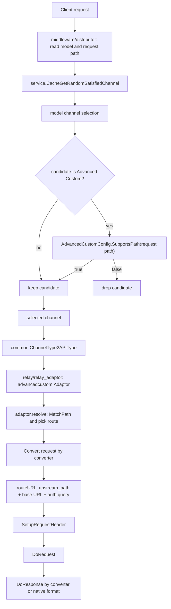

# Advanced Custom 渠道、端点类型与自定义转换器学习指南

这篇文档专门讲 new-api 里的 **Advanced Custom 渠道**、**endpoint type** 和 **内置协议转换器**。读完它，你应该能回答这些问题：

- 为什么 Advanced Custom 不是普通“OpenAI 兼容渠道”的另一个名字。
- `advanced_custom` JSON 是怎么保存、校验、缓存和参与渠道选择的。
- 请求进入 `/v1/chat/completions`、`/v1/responses`、`/v1/messages`、Gemini 原生路径时，系统如何决定一个 type 58 渠道能不能接。
- route 的 `incoming_path`、`upstream_path`、`converter`、`auth` 各自负责什么。
- converter 到底复用了 OpenAI、Claude、Gemini adaptor 的哪些能力，响应又如何反向转换。
- endpoint type 在模型目录、Pricing 页面、默认 endpoint path 和渠道能力之间扮演什么角色。

本文面向已经会 Go 基本语法、正在通过 new-api 学真实项目源码的读者。你可以把它当作“高级自定义渠道专题地图”：先从概念建立边界，再按源码入口逐层阅读。

## 一句话总览

Advanced Custom 渠道是一个 **按请求路径路由的可配置 provider adaptor**。它把“这个渠道能接哪些入口路径”“要打到上游哪个路径”“上游认证怎么写”“是否使用某个内置协议转换器”都放进 `Channel.OtherSettings.advanced_custom`。

它的实现可以拆成五层：

1. **配置层**：`dto.AdvancedCustomConfig` 定义 route JSON 和校验规则。
2. **保存层**：type 58 渠道保存时必须有合法 `advanced_custom`。
3. **选择层**：渠道选择前先用 request path 过滤 Advanced Custom 候选。
4. **relay 层**：`advancedcustom.Adaptor` 解析 route、构造上游 URL/Header、转换请求和响应。
5. **前端层**：默认前端提供模板、可视化编辑器、JSON 编辑器和保存前校验。

核心源码入口：

| 主题 | 关键文件 |
| --- | --- |
| 配置结构与校验 | `dto/channel_settings.go` |
| type 58 渠道保存校验 | `model/channel.go` |
| 内存缓存与 path-aware 选择 | `model/channel_cache.go` |
| 非内存 DB 选择过滤 | `model/ability.go` |
| 分发器传入 request path | `middleware/distributor.go` |
| relay adaptor 分派 | `relay/channel/advancedcustom/adaptor.go` |
| API type 到 adaptor | `common/api_type.go`、`relay/relay_adaptor.go` |
| endpoint type 常量和默认 path | `constant/endpoint_type.go`、`common/endpoint_type.go`、`common/endpoint_defaults.go` |
| 前端模板与校验 | `web/default/src/features/channels/lib/advanced-custom.ts` |
| 前端编辑弹窗 | `web/default/src/features/channels/components/dialogs/advanced-custom-editor-dialog.tsx` |
| 前端表单保存 | `web/default/src/features/channels/lib/channel-form.ts` |

## 先分清五个概念

Advanced Custom 容易混，是因为它同时碰到“渠道类型、端点类型、请求路径、relay format、协议转换器”五个概念。

### 渠道类型

渠道类型是 `constant.ChannelType*`，保存到 `channels.type`。Advanced Custom 的类型是：

```go
const ChannelTypeAdvancedCustom = 58
```

在 `common.ChannelType2APIType` 中，type 58 被映射到 `constant.APITypeAdvancedCustom`，最终 `relay/relay_adaptor.go` 会创建 `advancedcustom.Adaptor`。

它回答的问题是：**选中的渠道应该用哪个 adaptor 执行 relay？**

### endpoint type

endpoint type 是模型/定价侧暴露给前端和客户端的“能力类别”，比如：

- `openai`
- `openai-response`
- `anthropic`
- `gemini`
- `jina-rerank`
- `image-generation`
- `embeddings`
- `openai-video`

定义在 `constant/endpoint_type.go`，默认 path 定义在 `common/endpoint_defaults.go`。

它回答的问题是：**某个模型在目录和 Pricing 页面上支持哪些 API 入口类型？默认入口路径是什么？**

注意：endpoint type 不是 Advanced Custom route。route 更细，是真正的 request path 匹配规则。

### request path / incoming path

请求路径来自 `c.Request.URL.Path`，比如：

- `/v1/chat/completions`
- `/v1/responses`
- `/v1/messages`
- `/v1beta/models/gemini-2.5-flash:generateContent`

Advanced Custom route 里的 `incoming_path` 是配置里的匹配模板，比如：

```json
{
  "incoming_path": "/v1beta/models/{model}:generateContent"
}
```

它回答的问题是：**这个 Advanced Custom 渠道是否能接当前 HTTP 请求？**

### relay format

relay format 是 relay 主流程已经识别出的协议形态，例如 OpenAI、Claude、Gemini。Advanced Custom 在 `converter = none` 时，会根据 `info.RelayFormat` 把响应交给 OpenAI、Claude 或 Gemini 原生响应处理器。

它回答的问题是：**当前请求/响应应该按哪套协议解析？**

### converter

converter 是 Advanced Custom route 显式配置的内置转换器。它不是任意 JS、Lua、模板引擎，也不是动态 body patch。它只能从固定枚举里选：

- `none`
- `anthropic_messages_to_openai_chat_completions`
- `openai_chat_completions_to_anthropic_messages`
- `openai_chat_completions_to_openai_responses`
- `openai_responses_to_openai_chat_completions`
- `gemini_generate_content_to_openai_chat_completions`
- `openai_chat_completions_to_gemini_generate_content`

它回答的问题是：**客户端进来的请求体，要不要转成另一种上游协议；上游响应要不要再转回客户端期望的协议？**

## 总流程图



这个图里最关键的是两次 route/path 判断：

1. **渠道选择前过滤**：避免一个只支持 `/v1/messages` 的 Advanced Custom 渠道被选去处理 `/v1/chat/completions`。
2. **adaptor.resolve 再校验**：即便指定渠道、亲和性、缓存状态等路径绕过了普通选择，最终 adaptor 仍会拒绝不匹配的 path。

## 配置结构：AdvancedCustomConfig

Advanced Custom 配置挂在 `dto.ChannelOtherSettings.AdvancedCustom`：

```go
type ChannelOtherSettings struct {
    AdvancedCustom *AdvancedCustomConfig `json:"advanced_custom,omitempty"`
}
```

配置本体：

```go
type AdvancedCustomConfig struct {
    Routes []AdvancedCustomRoute `json:"advanced_routes,omitempty"`
}

type AdvancedCustomRoute struct {
    IncomingPath string                   `json:"incoming_path,omitempty"`
    UpstreamPath string                   `json:"upstream_path,omitempty"`
    Converter    string                   `json:"converter,omitempty"`
    Auth         *AdvancedCustomRouteAuth `json:"auth,omitempty"`
}

type AdvancedCustomRouteAuth struct {
    Type  string `json:"type,omitempty"`
    Name  string `json:"name,omitempty"`
    Value string `json:"value,omitempty"`
}
```

一个最小的 OpenAI Chat 转发配置长这样：

```json
{
  "advanced_routes": [
    {
      "incoming_path": "/v1/chat/completions",
      "upstream_path": "/v1/chat/completions",
      "converter": "none"
    }
  ]
}
```

如果 `auth` 省略，运行时默认写：

```http
Authorization: Bearer <channel api key>
```

如果要调用 Gemini 官方 API，通常使用 query auth：

```json
{
  "advanced_routes": [
    {
      "incoming_path": "/v1/chat/completions",
      "upstream_path": "/v1beta/models/{model}:generateContent",
      "converter": "openai_chat_completions_to_gemini_generate_content",
      "auth": {
        "type": "query",
        "name": "key",
        "value": "{api_key}"
      }
    }
  ]
}
```

运行时 `{api_key}` 会替换为渠道密钥，`{model}` 会替换为 `info.UpstreamModelName`。

## 配置校验：前端和后端的双防线

后端核心校验在 `(*AdvancedCustomConfig).Validate()`。

规则如下：

| 字段 | 规则 |
| --- | --- |
| config | 不能为 nil |
| routes | 至少一条 |
| `incoming_path` | 必填，必须以 `/` 开头，不能包含 query，不能重复 |
| `upstream_path` | 必填，必须是 `/...` 相对路径或 `http/https` 完整 URL，不能是 `//...` |
| `converter` | 空值会按 `none` 处理；非空必须在已注册枚举中 |
| converter + path | 必须满足固定兼容规则 |
| `auth` | nil 允许；`none` 允许；`header/query` 必须有 name/value |

converter 与入口 path 的兼容关系：

| converter | 允许的 `incoming_path` |
| --- | --- |
| `none` | 任意合法 path |
| `anthropic_messages_to_openai_chat_completions` | `/v1/messages` |
| `openai_chat_completions_to_anthropic_messages` | `/v1/chat/completions` |
| `openai_chat_completions_to_openai_responses` | `/v1/chat/completions` |
| `openai_responses_to_openai_chat_completions` | `/v1/responses` |
| `openai_chat_completions_to_gemini_generate_content` | `/v1/chat/completions` |
| `gemini_generate_content_to_openai_chat_completions` | 包含 `:generateContent` 或 `:streamGenerateContent` |

为什么校验这么严格？因为 converter 的输入 request struct 是固定的。例如 Responses -> Chat 转换器只能处理 `dto.OpenAIResponsesRequest`，如果让它挂在 `/v1/chat/completions` 上，relay 主流程传进来的 body 类型就不匹配。

前端 `validateAdvancedCustomConfig()` 也做同类校验。它不是安全边界，真正的安全边界在后端；但前端可以让用户在保存前就看到错误。

## 保存时如何落库

Advanced Custom 配置不是独立表，而是在渠道的 `OtherSettings` JSON 里。

后端保存渠道时会调用 `channel.ValidateSettings()`：

1. 解析 `channel.Setting` 到 `dto.ChannelSettings`。
2. 解析 `channel.OtherSettings` 到 `dto.ChannelOtherSettings`。
3. 如果 `channel.Type == constant.ChannelTypeAdvancedCustom`，强制要求 `channelOtherSettings.AdvancedCustom != nil`。
4. 只要 `AdvancedCustom` 不为空，就调用 `Validate()`。

这意味着：

- type 58 渠道没有 `advanced_custom` 不能保存。
- 非 type 58 渠道如果意外带了 `advanced_custom`，也会被校验。
- 后端不会信任前端 JSON 编辑器，保存时仍会完整校验。

前端表单在 `web/default/src/features/channels/lib/channel-form.ts` 里也有对应逻辑：

- type 58 时解析 `advanced_custom` 字符串。
- 调用 `validateAdvancedCustomConfig()`。
- 如果 route 使用相对 `upstream_path`，要求渠道 `base_url` 非空。
- 构造 `other_settings` JSON 时，把解析后的对象放入 `settingsObj.advanced_custom`。
- 非 type 58 渠道会删除 `advanced_custom` 字段，避免无关配置残留。

## path matching：route 如何匹配请求

匹配入口在 `AdvancedCustomConfig.MatchPath(requestPath)`。

它返回第一条匹配 route：

```go
func (c *AdvancedCustomConfig) MatchPath(requestPath string) (AdvancedCustomRoute, bool)
```

匹配规则有三种。

### 精确匹配

配置：

```json
{ "incoming_path": "/v1/chat/completions" }
```

请求：

```text
/v1/chat/completions
```

直接匹配。

### `{model}` 单占位符匹配

配置：

```json
{ "incoming_path": "/v1beta/models/{model}:generateContent" }
```

请求：

```text
/v1beta/models/gemini-2.5-flash:generateContent
```

匹配成功。中间的 `gemini-2.5-flash` 必须：

- 非空。
- 不包含 `/`。

这个限制很重要：它避免 `{model}` 跨路径段吞掉额外路径。

### Gemini stream 等价匹配

如果配置里包含 `:generateContent`，匹配器还会把它视为可以匹配 `:streamGenerateContent`。

配置：

```json
{ "incoming_path": "/v1beta/models/{model}:generateContent" }
```

可以匹配：

```text
/v1beta/models/gemini-2.5-flash:streamGenerateContent
```

这是为了让同一条 Gemini 原生 route 同时服务普通和流式 GenerateContent。

## 渠道选择：Advanced Custom 为什么要先按 path 过滤

普通渠道的选择主要看：

- group
- model
- channel enabled
- priority
- weight
- retry
- fallback model
- negative cache
- affinity

Advanced Custom 多了一个条件：**当前 request path 必须被 route 支持**。

### 内存缓存路径

`model/channel_cache.go` 维护：

```go
var channel2advancedCustomConfig map[int]*dto.AdvancedCustomConfig
```

`InitChannelCache()` 全量同步渠道时：

1. 把所有 channel 放进 `channelsIDM`。
2. 如果 channel type 是 58，就解析 `channel.GetOtherSettings().AdvancedCustom`。
3. 将合法对象缓存到 `channel2advancedCustomConfig[channel.Id]`。

选择渠道时，`GetRandomSatisfiedChannelWithExclusions()` 会在三个阶段都调用 `filterChannelsByRequestPath()`：

1. 精确模型候选。
2. 规范化模型名候选。
3. fallback 扩展候选。

过滤规则：

- requestPath 为空：跳过过滤。
- 非 type 58：保留。
- type 58：只有 `config.SupportsPath(requestPath)` 为 true 才保留。

这里用缓存有一个实际收益：高并发选择渠道时不需要每次反序列化 `OtherSettings`。

### 非内存 DB 路径

如果 `common.MemoryCacheEnabled` 关闭，会走 `model/ability.go` 的 DB 查询路径。

`GetChannelWithExclusions()` 查出 ability 后调用 `filterAbilitiesByRequestPath()`：

1. 收集 ability 中的 channel id。
2. 批量查询这些 channel。
3. 只对 type 58 解析 AdvancedCustom 配置。
4. 非 type 58 保留，type 58 必须 `SupportsPath(requestPath)`。

如果批量查 channel 出错，代码选择回退到未过滤 candidates，避免因为过滤查询失败阻塞整个选择。最终 adaptor 仍会在 route 不匹配时报错。

### middleware 传 path

`middleware/distributor.go` 在正常选择时把：

```go
RequestPath: c.Request.URL.Path
```

放进 `service.RetryParam`，再传到 `service.CacheGetRandomSatisfiedChannel()` 和 model 选择层。

亲和性命中 preferred channel 时，也会调用 `channelSupportsRequestPath(preferred, c.Request.URL.Path)`。这样一个历史亲和渠道如果不支持当前 path，就不会被直接复用。

### 指定渠道的边界

如果 token 或上下文指定了固定渠道，某些分支可能不会在 distributor 里提前做 path 过滤。但 Advanced Custom adaptor 的 `resolve()` 仍会最终检查 route，不匹配会返回：

```text
advanced custom channel does not support request path: ...
```

这就是“选择层过滤 + adaptor 兜底”的双层设计。

## adaptor 结构：一个外壳包住三个原生 adaptor

Advanced Custom adaptor 定义在 `relay/channel/advancedcustom/adaptor.go`。

结构体：

```go
type Adaptor struct {
    openaiAdaptor openai.Adaptor
    claudeAdaptor claude.Adaptor
    geminiAdaptor gemini.Adaptor

    resolved  bool
    converted bool
    route     dto.AdvancedCustomRoute
    converter string
}
```

这个结构能看出设计思路：

- 它自己不重写所有协议细节。
- 它把 OpenAI、Claude、Gemini 三套成熟 adaptor 组合进来。
- route 解析结果缓存在当前 adaptor 实例中。
- `converted` 用来判断 converter route 是否已经走过转换，避免 pass-through body 绕开协议转换。

`Init(info)` 会同时初始化三个内部 adaptor。

## resolve：所有关键动作前都先选 route

很多方法一开始都会调用：

```go
a.resolve(c, info)
```

`resolve()` 做几件事：

1. 如果已经 resolved，直接返回。
2. 检查 `info` 不为空。
3. 取 `info.ChannelOtherSettings.AdvancedCustom`。
4. 调用 `config.Validate()`。
5. 计算 incoming path：
   - 优先 `c.Request.URL.Path`。
   - 否则用 `info.RequestURLPath` 去掉 query。
6. 调用 `config.MatchPath(incomingPath)`。
7. 命中后保存 `a.route` 和 `a.converter`。

为什么运行时还要 `Validate()`？因为配置可能来自 DB、缓存、指定渠道、旧数据或外部导入。运行时重新校验可以让 adaptor 不依赖保存链路一定完美。

## GetRequestURL：从 upstream_path 到真实 URL

`GetRequestURL(info)` 调用 `routeURL(info)`。

URL 构造步骤：

1. 对 `a.route.UpstreamPath` 做 trim。
2. 把 `{model}` 替换为 `info.UpstreamModelName`。
3. 如果 upstream path 以 `/` 开头：
   - 不能是 `//...`。
   - 必须有 `info.ChannelBaseUrl`。
   - 拼成 `baseURL + upstreamPath`。
4. 如果 upstream path 是完整 URL：
   - 必须有 scheme 和 host。
   - scheme 只能是 http/https。
5. 如果是 Realtime relay：
   - `https` 改成 `wss`。
   - `http` 改成 `ws`。
6. 如果 auth type 是 `query`：
   - 在 URL query 上追加 `auth.name = auth.value`。
   - `auth.value` 里的 `{api_key}` 替换为渠道 key。

相对路径例子：

```json
{
  "upstream_path": "/proxy/v1/chat/completions?existing=1"
}
```

渠道 Base URL：

```text
https://gateway.example/base
```

最终：

```text
https://gateway.example/base/proxy/v1/chat/completions?existing=1
```

### Gemini 流式 URL 特例

如果 converter 是：

```text
openai_chat_completions_to_gemini_generate_content
```

并且 `info.IsStream == true`，URL 会做 Gemini 官方流式调整：

- path 中 `:generateContent` 改成 `:streamGenerateContent`。
- query 设置 `alt=sse`。

例如：

```text
/v1beta/models/gemini-2.5-pro:generateContent
```

变为：

```text
/v1beta/models/gemini-2.5-pro:streamGenerateContent?alt=sse
```

## SetupRequestHeader：认证和 Claude 头

`SetupRequestHeader(c, header, info)` 先调用：

```go
channel.SetupApiRequestHeader(info, c, header)
```

这一步设置通用请求头。然后处理 route auth。

auth 规则：

| auth 配置 | 行为 |
| --- | --- |
| nil | 默认 `Authorization: Bearer <apiKey>` |
| `{ "type": "none" }` | 不写认证 |
| `{ "type": "header" }` | 写 `auth.name: applyAuthTemplate(auth.value)` |
| `{ "type": "query" }` | header 阶段不写；URL 阶段写 query |

header auth 例子：

```json
{
  "auth": {
    "type": "header",
    "name": "x-api-key",
    "value": "{api_key}"
  }
}
```

会写：

```http
x-api-key: sk-...
```

如果 converter 是 OpenAI Chat -> Anthropic，或者 `converter=none` 且 relay format 是 Claude，还会补 Claude 头：

- `anthropic-version`
- 以及 `claude.CommonClaudeHeadersOperation()` 里处理的 Claude 相关 header。

如果客户端没传 `anthropic-version`，默认使用：

```text
2023-06-01
```

## 请求转换：Convert* 方法如何分派

Advanced Custom 的转换不是一张完全自由的矩阵，而是按 relay 主流程传入的 request 类型分派。

### OpenAI Chat 请求

入口方法：

```go
ConvertOpenAIRequest(c, info, request *dto.GeneralOpenAIRequest)
```

支持：

| converter | 上游请求形态 |
| --- | --- |
| `none` | OpenAI 兼容 Chat |
| `openai_chat_completions_to_anthropic_messages` | Claude Messages |
| `openai_chat_completions_to_openai_responses` | OpenAI Responses |
| `openai_chat_completions_to_gemini_generate_content` | Gemini GenerateContent |

对应实现：

- `none`：临时把 `info.ChannelType` 改成 OpenAI，调用内部 `openaiAdaptor.ConvertOpenAIRequest()`。
- OpenAI -> Claude：调用 `claudeAdaptor.ConvertOpenAIRequest()`。
- OpenAI -> Responses：调用 `service.ChatCompletionsRequestToResponsesRequest()`。
- OpenAI -> Gemini：调用 `geminiAdaptor.ConvertOpenAIRequest()`。

临时改 `info.ChannelType` 的用途是复用 OpenAI 兼容 adaptor 的内部判断，让它像处理普通 OpenAI 兼容渠道一样处理这次请求。调用结束后会恢复原 channel type。

### Claude Messages 请求

入口方法：

```go
ConvertClaudeRequest(c, info, request *dto.ClaudeRequest)
```

支持：

| converter | 上游请求形态 |
| --- | --- |
| `none` | Claude 原生 |
| `anthropic_messages_to_openai_chat_completions` | OpenAI Chat |

`none` 走 Claude adaptor 原生转换。Anthropic -> OpenAI 会调用 OpenAI adaptor 的 Claude 转 OpenAI 能力。

### Gemini GenerateContent 请求

入口方法：

```go
ConvertGeminiRequest(c, info, request *dto.GeminiChatRequest)
```

支持：

| converter | 上游请求形态 |
| --- | --- |
| `none` | Gemini 原生 |
| `gemini_generate_content_to_openai_chat_completions` | OpenAI Chat |

Gemini -> OpenAI 走 OpenAI adaptor 的 Gemini 转 OpenAI 能力。

### OpenAI Responses 请求

入口方法：

```go
ConvertOpenAIResponsesRequest(c, info, request dto.OpenAIResponsesRequest)
```

支持：

| converter | 上游请求形态 |
| --- | --- |
| `none` | OpenAI Responses 兼容 |
| `openai_responses_to_openai_chat_completions` | OpenAI Chat |

Responses -> Chat 会先调用：

```go
service.ResponsesRequestToChatCompletionsRequest(&request)
```

得到 `*dto.GeneralOpenAIRequest` 后，再走 OpenAI 兼容转换。

### Embedding、Audio、Image

这些入口只允许 `converter=none`：

- `ConvertEmbeddingRequest`
- `ConvertAudioRequest`
- `ConvertImageRequest`

原因很直接：当前 Advanced Custom 没有为 embedding/audio/image 定义跨协议 converter。如果你给这些路径配置了非 `none` converter，运行时会报“不支持该请求类型”。

### Rerank

`ConvertRerankRequest()` 直接标记 `converted = true`，然后复用 OpenAI adaptor 的 rerank 转换。

## DoRequest：禁止 converter route 走 pass-through

`DoRequest()` 里有一个重要判断：

```go
if !a.converted && a.converter != dto.AdvancedCustomConverterNone {
    return nil, errors.New("advanced custom converter routes cannot be used with pass-through request body")
}
```

这句话的含义是：

- 如果 route 配置了 converter，必须经过 `Convert*Request()`。
- 不能拿原始 body 直接透传到上游。

这保护了协议语义。比如 OpenAI Chat -> Gemini converter 的 route，上游期待的是 Gemini GenerateContent body；如果 pass-through 直接把 OpenAI Chat body 发过去，上游会收到错误协议。

之后 DoRequest 根据 relay mode 选择发送方式：

| relay mode | 请求方式 |
| --- | --- |
| audio transcription/translation | form request |
| image edits 且非 JSON | form request |
| realtime | WebSocket |
| 其他 | 普通 HTTP API request |

## DoResponse：响应如何转回客户端协议

`DoResponse()` 根据 converter 选择响应处理器。

| converter | 上游响应形态 | 返回给客户端 |
| --- | --- | --- |
| `none` | 原生/兼容 | 按 `info.RelayFormat` 走 OpenAI/Claude/Gemini |
| `anthropic_messages_to_openai_chat_completions` | OpenAI Chat | Claude 客户端期待的响应由 OpenAI adaptor 处理 |
| `gemini_generate_content_to_openai_chat_completions` | OpenAI Chat | Gemini 客户端期待的响应由 OpenAI adaptor 处理 |
| `openai_chat_completions_to_anthropic_messages` | Claude Messages | OpenAI Chat 客户端期待的响应由 Claude adaptor 转回 |
| `openai_chat_completions_to_gemini_generate_content` | Gemini GenerateContent | OpenAI Chat 客户端期待的响应由 Gemini adaptor 转回 |
| `openai_chat_completions_to_openai_responses` | OpenAI Responses | 用 OpenAI Responses -> Chat handler |
| `openai_responses_to_openai_chat_completions` | OpenAI Chat | 用 OpenAI Chat -> Responses handler |

这里最容易反着想。

以 `openai_chat_completions_to_openai_responses` 为例：

1. 客户端发的是 Chat Completions。
2. 上游收到的是 Responses。
3. 上游返回 Responses。
4. new-api 要把 Responses 再转回 Chat Completions。
5. 所以 `DoResponse()` 调用的是 `openai.OaiResponsesToChatHandler` 或流式版本。

以 `openai_responses_to_openai_chat_completions` 为例：

1. 客户端发的是 Responses。
2. 上游收到的是 Chat Completions。
3. 上游返回 Chat Completions。
4. new-api 要把 Chat 再转回 Responses。
5. 所以 `DoResponse()` 调用的是 `openai.OaiChatToResponsesHandler` 或流式版本。

## converter 全表

| converter | 客户端入口 | 上游入口常见值 | 请求转换 | 响应转换 |
| --- | --- | --- | --- | --- |
| `none` | 任意 route 支持的 path | 任意合法 upstream path | 不跨协议，复用当前 relay format 对应 adaptor | 按 `RelayFormat` 原生处理 |
| `anthropic_messages_to_openai_chat_completions` | `/v1/messages` | `/v1/chat/completions` | Claude -> OpenAI Chat | OpenAI Chat -> Claude |
| `openai_chat_completions_to_anthropic_messages` | `/v1/chat/completions` | `/v1/messages` | OpenAI Chat -> Claude | Claude -> OpenAI Chat |
| `openai_chat_completions_to_openai_responses` | `/v1/chat/completions` | `/v1/responses` | Chat -> Responses | Responses -> Chat |
| `openai_responses_to_openai_chat_completions` | `/v1/responses` | `/v1/chat/completions` | Responses -> Chat | Chat -> Responses |
| `gemini_generate_content_to_openai_chat_completions` | `/v1beta/models/{model}:generateContent` | `/v1/chat/completions` | Gemini -> OpenAI Chat | OpenAI Chat -> Gemini |
| `openai_chat_completions_to_gemini_generate_content` | `/v1/chat/completions` | `/v1beta/models/{model}:generateContent` | OpenAI Chat -> Gemini | Gemini -> OpenAI Chat |

这张表也解释了为什么 converter 和 incoming path 必须绑定。converter 的第一列是“客户端入口协议”，不是“上游协议”。

## auth 模式详解

Advanced Custom 的认证设计足够简单，但有一个细节：`nil auth` 和 `auth.type = none` 不是一回事。

### 默认 Bearer

route 不写 auth：

```json
{
  "incoming_path": "/v1/chat/completions",
  "upstream_path": "/v1/chat/completions",
  "converter": "none"
}
```

会写：

```http
Authorization: Bearer {api_key}
```

这适合 OpenAI 兼容上游。

### No Auth

```json
{
  "auth": {
    "type": "none"
  }
}
```

不写任何认证。适合内网代理、已经由网关处理认证的上游。

### Header Auth

```json
{
  "auth": {
    "type": "header",
    "name": "x-api-key",
    "value": "{api_key}"
  }
}
```

适合 Claude 官方这类 header key。

也可以写：

```json
{
  "auth": {
    "type": "header",
    "name": "Authorization",
    "value": "Bearer {api_key}"
  }
}
```

### Query Auth

```json
{
  "auth": {
    "type": "query",
    "name": "key",
    "value": "{api_key}"
  }
}
```

适合 Gemini 官方 API。query auth 不在 `SetupRequestHeader()` 写入，而是在 `routeURL()` 拼 URL 时写入。

## 前端编辑器：从模板到 JSON

前端核心文件是 `web/default/src/features/channels/lib/advanced-custom.ts` 和 `advanced-custom-editor-dialog.tsx`。

### 类型定义

前端类型和后端 JSON 基本一一对应：

```ts
export interface AdvancedCustomConfig {
  advanced_routes?: AdvancedCustomRoute[]
}

export interface AdvancedCustomRoute {
  incoming_path?: string
  upstream_path?: string
  converter?: AdvancedCustomConverter
  auth?: AdvancedCustomRouteAuth
}
```

converter 和 auth type 也用 TypeScript union 限制。

### 模板

内置模板包括：

- Official OpenAI Chat
- Official OpenAI Responses
- Official OpenAI Embeddings
- Official OpenAI Images
- Official Claude Messages
- Official Gemini Native
- Official Gemini from OpenAI Chat

这 7 个模板只是快速生成 `advanced_routes`，不是特殊逻辑。保存后它们和手写 JSON 没区别。

### 可选 incoming path

前端提供常见入口：

- `/v1/chat/completions`
- `/v1/responses`
- `/v1/responses/compact`
- `/v1/embeddings`
- `/v1/images/generations`
- `/v1/images/edits`
- `/v1/completions`
- `/v1/audio/speech`
- `/v1/audio/transcriptions`
- `/v1/audio/translations`
- `/v1/rerank`
- `/v1/realtime`
- `/v1/messages`
- `/v1beta/models/{model}:generateContent`
- `/v1beta/models/{model}:embedContent`
- `/v1beta/models/{model}:batchEmbedContents`

`converter=none` 可以搭配这些路径；非 none converter 会被 path 白名单限制。

### 可视化模式

弹窗打开时：

1. `parseAdvancedCustomConfig(value)` 解析已有 JSON。
2. 解析失败则用 `createAdvancedCustomConfig()` 创建默认 route。
3. `normalizeAdvancedCustomConfig()` 保证字段形态稳定。
4. 用户可以添加、删除 route。
5. 选择 converter 时，如果当前 path 不兼容，会自动切到该 converter 的默认 path。
6. 选择 incoming path 时，如果当前 converter 不兼容，会自动把 converter 改回 `none`。

这个交互很重要：它尽量让用户不会配置出前端明知错误的组合。

### JSON 模式

JSON 模式允许直接编辑完整配置。

切回可视化或保存时会：

1. JSON parse。
2. normalize。
3. validate。
4. 如果错误，显示 `Invalid JSON` 或具体校验错误。

保存时调用：

```ts
onSave(stringifyAdvancedCustomConfig(...))
```

也就是最终仍保存为一段格式化 JSON 字符串，交给渠道表单落到 `other_settings.advanced_custom`。

### 渠道抽屉中的展示

渠道编辑抽屉只在 type 58 时展示 Advanced Custom Routes 区域：

- 显示 route 数量。
- 显示 route 类型 badge。
- 配置不完整时显示 Incomplete。
- 点击 Configure routes 打开编辑弹窗。

type 58 的提示文案也说明：

- base URL 是 fallback base URL。
- key 用于 route auth templates。
- models 是该渠道对外暴露的模型。

## endpoint type 体系

endpoint type 的源码非常小，但它连接了模型目录、Pricing、API 调试和前端展示。

### 常量

`constant/endpoint_type.go` 定义：

```go
type EndpointType string

const (
    EndpointTypeOpenAI                EndpointType = "openai"
    EndpointTypeOpenAIResponse        EndpointType = "openai-response"
    EndpointTypeOpenAIResponseCompact EndpointType = "openai-response-compact"
    EndpointTypeAnthropic             EndpointType = "anthropic"
    EndpointTypeGemini                EndpointType = "gemini"
    EndpointTypeJinaRerank            EndpointType = "jina-rerank"
    EndpointTypeImageGeneration       EndpointType = "image-generation"
    EndpointTypeEmbeddings            EndpointType = "embeddings"
    EndpointTypeOpenAIVideo           EndpointType = "openai-video"
)
```

### 默认 endpoint path

`common/endpoint_defaults.go` 里把 endpoint type 映射到默认 path：

| endpoint type | 默认 path |
| --- | --- |
| `openai` | `/v1/chat/completions` |
| `openai-response` | `/v1/responses` |
| `openai-response-compact` | `/v1/responses/compact` |
| `anthropic` | `/v1/messages` |
| `gemini` | `/v1beta/models/{model}:generateContent` |
| `jina-rerank` | `/v1/rerank` |
| `image-generation` | `/v1/images/generations` |
| `embeddings` | `/v1/embeddings` |

这些默认值主要用于前端/模型 API 展示，不等于某个 Advanced Custom route 一定存在。

### 按 channel type 推断 endpoint type

`common.GetEndpointTypesByChannelType(channelType, modelName)` 根据渠道类型和模型名推断默认支持端点。

典型规则：

- Jina -> `jina-rerank`
- Anthropic/AWS -> `anthropic`, `openai`
- Gemini/Vertex -> `gemini`, `openai`
- OpenRouter -> `openai`
- XAI -> `openai`, `openai-response`
- Sora -> `openai-video`
- OpenAI response-only 模型 -> `openai-response`
- 其他默认 -> `openai`
- 图片模型会把 `image-generation` 插到最前面

Advanced Custom type 58 没有单独 case，所以默认走普通逻辑：通常是 `openai`，除非模型名被其他规则识别为 response-only 或 image generation。

这带来一个实际含义：

> Advanced Custom route 支持哪些 path，和 Pricing 模型目录显示哪些 endpoint type，不一定自动完全一致。

如果你希望某个模型在目录里显示自定义 endpoint 支持，需要看模型元数据的 `Endpoints` 配置。

### 模型元数据覆盖 endpoint

`model/pricing.go` 在 `updatePricing()` 里构建 `modelSupportEndpointTypes`。

流程：

1. 从启用 ability 中拿到模型和 channel type。
2. 调用 `common.GetEndpointTypesByChannelType()` 生成默认 endpoint types。
3. 如果 `models` 表里的模型元数据 `Endpoints` 非空：
   - 解析 JSON。
   - 用里面的 endpoint keys 替换默认 endpoint types。
   - 不是合并，是替换。
4. 同时构建全局 `supportedEndpointMap`：
   - 先放默认 endpoint path。
   - 再用模型元数据里的自定义 endpoint 覆盖。

`Endpoints` 支持两种值：

```json
{
  "openai": "/v1/chat/completions"
}
```

或者：

```json
{
  "openai": {
    "path": "/v1/chat/completions",
    "method": "POST"
  }
}
```

所以 endpoint type 是模型目录层面的“可见能力”，Advanced Custom route 是渠道执行层面的“实际支持 path”。二者最好保持一致，但不是同一个数据结构。

### 前端展示也有自己的常量层

Pricing 前端在 `web/default/src/features/pricing/constants.ts` 里维护 endpoint filter 和 label。它主要消费 `/api/pricing` 返回的 `supported_endpoint_types` 和 `supported_endpoint` map。

这里要注意两个实现边界：

- 后端定义了 `openai-response-compact`，默认 path 是 `/v1/responses/compact`；当前 Pricing 前端常量侧没有单独暴露这个 filter label。
- 后端定义了 `openai-video`，Pricing 前端有 Video label；但 `common/endpoint_defaults.go` 当前没有给 `openai-video` 配默认 path。

这类差异不影响 Advanced Custom route 运行时选路，但会影响 Pricing/API 示例里“怎么展示、怎么筛选、默认 path 怎么生成”。

## Advanced Custom 与 endpoint type 的关系

可以用一句话概括：

> endpoint type 帮用户知道“这个模型有哪些入口类别”；Advanced Custom route 决定“type 58 渠道在真实请求中能不能处理这个入口 path”。

举例：

你有一个 Advanced Custom 渠道，route 是：

```json
{
  "incoming_path": "/v1/messages",
  "upstream_path": "/v1/chat/completions",
  "converter": "anthropic_messages_to_openai_chat_completions"
}
```

运行时它能处理 `/v1/messages`。但如果模型目录没有把 endpoint type 配成 `anthropic`，Pricing/API 展示可能仍只显示 `openai`。

反过来，如果模型目录显示 `anthropic`，但 type 58 渠道没有 `/v1/messages` route，渠道选择时它仍会被 path 过滤掉。

因此排查问题时要分别看两边：

- 展示/调试入口不对：看模型 `Endpoints`、`GetEndpointTypesByChannelType()`、`pricingMap`。
- 请求打进来选不到渠道：看 `advanced_routes[].incoming_path`、`SupportsPath()`、渠道 group/model/ability。

## 典型配置案例

### 1. OpenAI 兼容上游

```json
{
  "advanced_routes": [
    {
      "incoming_path": "/v1/chat/completions",
      "upstream_path": "/v1/chat/completions",
      "converter": "none",
      "auth": {
        "type": "header",
        "name": "Authorization",
        "value": "Bearer {api_key}"
      }
    }
  ]
}
```

适用场景：上游已经是 OpenAI Chat 兼容协议，只是 URL、鉴权方式或路径需要自定义。

### 2. Claude 官方原生

```json
{
  "advanced_routes": [
    {
      "incoming_path": "/v1/messages",
      "upstream_path": "/v1/messages",
      "converter": "none",
      "auth": {
        "type": "header",
        "name": "x-api-key",
        "value": "{api_key}"
      }
    }
  ]
}
```

适用场景：客户端按 Claude Messages 协议请求，渠道打到 Claude 原生上游。

运行时会补 `anthropic-version`。

### 3. Claude 客户端入口转 OpenAI 上游

```json
{
  "advanced_routes": [
    {
      "incoming_path": "/v1/messages",
      "upstream_path": "/v1/chat/completions",
      "converter": "anthropic_messages_to_openai_chat_completions"
    }
  ]
}
```

适用场景：客户端希望用 Claude Messages，但你手里的上游只有 OpenAI Chat 兼容。

### 4. OpenAI Chat 客户端入口转 Gemini 官方

```json
{
  "advanced_routes": [
    {
      "incoming_path": "/v1/chat/completions",
      "upstream_path": "/v1beta/models/{model}:generateContent",
      "converter": "openai_chat_completions_to_gemini_generate_content",
      "auth": {
        "type": "query",
        "name": "key",
        "value": "{api_key}"
      }
    }
  ]
}
```

适用场景：客户端走 OpenAI Chat 兼容，真实上游是 Gemini 官方 API。

流式请求时，URL 会自动改为 `:streamGenerateContent&alt=sse` 的形式。

### 5. OpenAI Responses 客户端入口转 Chat 上游

```json
{
  "advanced_routes": [
    {
      "incoming_path": "/v1/responses",
      "upstream_path": "/v1/chat/completions",
      "converter": "openai_responses_to_openai_chat_completions"
    }
  ]
}
```

适用场景：客户端使用 Responses API，但上游只支持 Chat Completions。

测试里明确保证：

- `/v1/responses` 合法。
- `/v1/chat/completions` 不合法。
- `/v1/responses/compact` 不合法。

### 6. Gemini 原生入口转 OpenAI Chat 上游

```json
{
  "advanced_routes": [
    {
      "incoming_path": "/v1beta/models/{model}:generateContent",
      "upstream_path": "/v1/chat/completions",
      "converter": "gemini_generate_content_to_openai_chat_completions"
    }
  ]
}
```

配置里的 `:generateContent` 也能匹配请求里的 `:streamGenerateContent`。

## 测试如何固定行为

相关测试不是“凑覆盖率”，而是在固定 Advanced Custom 的用户可见契约。

### DTO 校验测试

`dto/channel_settings_test.go` 固定了 Responses -> Chat converter 只能挂在 `/v1/responses`。

这保护了一个重要 API 契约：`/v1/responses/compact` 虽然也是 Responses 相关路径，但当前 converter 没有声明支持它。

### adaptor URL 和 auth 测试

`relay/channel/advancedcustom/adaptor_test.go` 覆盖：

- 精确 route 匹配。
- query auth 会保留 upstream 原有 query。
- 相对 upstream path 会拼接 channel base URL。
- 相对 path 缺 base URL 报错。
- nil auth 默认 Bearer。
- header auth 不再写默认 Authorization。
- Claude native 会补默认 `anthropic-version`。

### route 和 Gemini 流式测试

同一个测试文件还覆盖：

- route 不匹配时报错。
- upstream `{model}` 替换为 `info.UpstreamModelName`。
- OpenAI Chat -> Gemini 流式时切到 `:streamGenerateContent` 并加 `alt=sse`。
- Gemini incoming path 模板能匹配普通和流式两种请求。

### Responses 转 Chat 测试

测试构造了 `dto.OpenAIResponsesRequest`，验证它会被转成 `*dto.GeneralOpenAIRequest`：

- `Instructions` 变成 system message。
- `Input` 变成 user message。
- 上游 path 是 `/v1/chat/completions`。

读这些测试时，不要只看 assert。要把它们当作“配置能做什么、不能做什么”的真实说明书。

## 常见误区

### 误区 1：Advanced Custom 可以任意改 body

不可以。它只支持固定 converter 枚举。`upstream_path` 能改 URL，`auth` 能改认证，converter 能使用内置协议转换，但没有任意脚本转换能力。

### 误区 2：`converter=none` 等于完全不处理

不准确。`none` 表示不跨协议转换，但仍会：

- 做 route 匹配。
- 拼上游 URL。
- 设置 header/auth。
- 根据 relay format 走 OpenAI/Claude/Gemini 对应 adaptor。
- 走统一 DoRequest、DoResponse、计费和日志流程。

### 误区 3：endpoint type 支持就代表 type 58 渠道一定能选中

不一定。endpoint type 是模型目录/展示层能力。Advanced Custom 选择还要看 route 是否支持当前 request path。

### 误区 4：route 支持 path 就代表 Pricing 一定会展示对应 endpoint

也不一定。Pricing 支持 endpoint types 来自 channel type 推断和模型元数据 `Endpoints`。Advanced Custom route 不会自动反写模型元数据。

### 误区 5：只靠前端校验就够了

不够。前端校验提升体验，后端 `Validate()` 才是保存和运行时安全边界。

### 误区 6：Gemini stream 要单独配一条 route

通常不需要。如果配置是 `/v1beta/models/{model}:generateContent`，匹配器能接受 `:streamGenerateContent`。OpenAI Chat -> Gemini 的上游 URL 也会在 stream 时自动切换。

## 从 Go 学习角度看这块源码

### 1. 学 struct 和 JSON tag

`AdvancedCustomConfig` 是很好的 JSON 配置结构例子：

- Go 字段名用 PascalCase。
- JSON 字段名用 snake_case。
- 可选嵌套对象用指针 `*AdvancedCustomRouteAuth`。
- route 数组用 slice。

### 2. 学方法接收者

`MatchPath`、`SupportsPath`、`Validate` 都是 `*AdvancedCustomConfig` 的方法。

这体现了一个常见组织方式：把和配置本身强相关的行为放到配置类型上，而不是散落在 service 或 adaptor 里。

### 3. 学显式错误返回

校验函数返回 `error`，错误信息包含具体 route index：

```text
advanced_custom.advanced_routes[0].incoming_path is required
```

这种错误对 API 调试很友好。

### 4. 学组合优先于重写

`advancedcustom.Adaptor` 组合了 OpenAI、Claude、Gemini adaptor。这比复制三套协议转换逻辑更稳，也让 Advanced Custom 的职责更清晰：它负责 route、URL、auth 和 converter 分派。

### 5. 学缓存与锁

`model/channel_cache.go` 用 `channelSyncLock` 保护：

- `group2model2channels`
- `channelsIDM`
- `channel2advancedCustomConfig`

读选择路径时持 RLock，全量同步时持 Lock。这是 Go 服务里典型的读多写少缓存模型。

### 6. 学“前置过滤 + 执行兜底”

path 支持既在选择层过滤，也在 adaptor 层 resolve。这个模式适合真实业务系统：

- 前置过滤减少错误选择。
- 执行兜底保证绕过路径也不会产生错误请求。

### 7. 学 table-driven tests

DTO 测试用 table tests 验证多个非法 path。adaptor 测试用具体配置和 URL parse 验证行为。它们都在测用户可见契约，而不是私有实现细节。

## 推荐阅读顺序

如果你要精读这块源码，建议按这个顺序：

1. `constant/channel.go`：确认 type 58 和显示名。
2. `common/api_type.go`：看 type 58 如何映射 API type。
3. `relay/relay_adaptor.go`：看 API type 如何创建 `advancedcustom.Adaptor`。
4. `dto/channel_settings.go`：完整读配置结构、converter 常量、auth 常量、Validate、MatchPath。
5. `model/channel.go` 的 `ValidateSettings()`：看保存时如何强制配置合法。
6. `model/channel_cache.go`：读内存缓存如何 path-aware 过滤 type 58。
7. `model/ability.go`：读非内存 DB 路径的等价过滤。
8. `middleware/distributor.go`：看 request path 如何传到选择层，亲和性如何检查 path。
9. `relay/channel/advancedcustom/adaptor.go`：按 `resolve -> GetRequestURL -> SetupRequestHeader -> Convert* -> DoRequest -> DoResponse` 顺序读。
10. `relay/channel/advancedcustom/adaptor_test.go`：用测试反推行为契约。
11. `web/default/src/features/channels/lib/advanced-custom.ts`：看前端模板和校验如何复刻后端规则。
12. `web/default/src/features/channels/components/dialogs/advanced-custom-editor-dialog.tsx`：看用户如何编辑 route。
13. `constant/endpoint_type.go`、`common/endpoint_type.go`、`common/endpoint_defaults.go`、`model/pricing.go`：理解 endpoint type 和 Advanced Custom route 的边界。

## 排查问题路线

### 请求选不到 Advanced Custom 渠道

检查顺序：

1. 渠道是否启用。
2. 渠道 group 是否包含 token 当前 group。
3. 渠道 models 是否包含请求 model，或 fallback/规范化模型是否能匹配。
4. request path 是否被 `advanced_routes[].incoming_path` 支持。
5. route 是否因为 `{model}` 模板不匹配失败。
6. 内存缓存是否已同步，可尝试触发渠道缓存刷新。
7. 如果是亲和性命中，preferred channel 是否通过 `channelSupportsRequestPath()`。

### 保存 Advanced Custom 渠道失败

检查：

1. type 58 是否有 `advanced_custom`。
2. `advanced_routes` 是否为空。
3. `incoming_path` 是否以 `/` 开头、是否带 query、是否重复。
4. `upstream_path` 是否是 `/...` 或 `http/https` 完整 URL。
5. converter 是否注册。
6. converter 是否匹配 incoming path。
7. auth type/name/value 是否合法。
8. 如果前端使用相对 upstream path，base URL 是否填写。

### 上游认证失败

检查：

1. route 是否没有写 auth，从而默认 Bearer。
2. 上游是否要求 `x-api-key`、`Authorization` 或 query key。
3. `auth.value` 是否包含 `{api_key}`。
4. header auth 和 query auth 是否放错位置。
5. Claude 原生是否需要 `anthropic-version`，代码是否按 RelayFormat 或 converter 补上了。

### Gemini 流式不通

检查：

1. converter 是否是 `openai_chat_completions_to_gemini_generate_content`。
2. `info.IsStream` 是否正确识别。
3. upstream path 是否包含 `:generateContent`。
4. 最终 URL 是否变成 `:streamGenerateContent`。
5. query 是否包含 `alt=sse`。
6. auth query 是否仍保留，例如 `key=...`。

### Pricing 页面 endpoint 展示不符合 route

检查：

1. 该模型是否来自 Advanced Custom 渠道能力。
2. `common.GetEndpointTypesByChannelType(58, modelName)` 默认会不会只给 `openai`。
3. 模型元数据 `Endpoints` 是否配置了自定义 endpoint keys。
4. `model/pricing.go` 是否刷新了 `modelSupportEndpointTypes`。
5. 前端 pricing filter 是否只是按 `supported_endpoint_types` 展示。

## 小练习

### 练习 1：手推 route 匹配

给出配置：

```json
{
  "incoming_path": "/v1beta/models/{model}:generateContent"
}
```

判断下面哪些请求会匹配：

- `/v1beta/models/gemini-2.5-flash:generateContent`
- `/v1beta/models/gemini-2.5-flash:streamGenerateContent`
- `/v1beta/models/foo/bar:generateContent`
- `/v1beta/models/:generateContent`

答案：前两个匹配；第三个因为模型片段包含 `/` 不匹配；第四个因为模型片段为空不匹配。

### 练习 2：解释 converter 方向

看到：

```text
openai_responses_to_openai_chat_completions
```

请说出：

- 客户端入口 path。
- 上游 path。
- 请求转换方向。
- 响应转换方向。

答案：

- 客户端入口 `/v1/responses`。
- 常见上游 `/v1/chat/completions`。
- 请求 Responses -> Chat。
- 响应 Chat -> Responses。

### 练习 3：读测试验证 URL

阅读 `TestAdaptorSwitchesGeminiGenerateContentURLForStream`，写出它验证了哪三个 query/path 行为。

答案：

- path 从 `:generateContent` 切到 `:streamGenerateContent`。
- query 增加 `alt=sse`。
- 原有 query 和 auth query 都保留。

## 本专题的心智模型

最后把整块实现压缩成一个心智模型：

Advanced Custom 是一个 **route-driven adaptor wrapper**。

- route 决定“能不能接这个 path”。
- upstream path 决定“打到哪里”。
- auth 决定“怎么证明身份”。
- converter 决定“请求体和响应体是否跨协议转换”。
- endpoint type 决定“模型目录和前端展示如何描述入口能力”。

源码上，它没有把所有复杂度堆进一个函数，而是分散在几条清晰链路里：

- DTO 负责结构和校验。
- model/middleware/service 负责选择前过滤。
- adaptor 负责运行时解析、URL/header、转换和响应。
- frontend 负责可视化编辑和保存前反馈。
- pricing/model metadata 负责 endpoint 展示。

读懂这几个边界，再去看具体 provider 转换代码，Advanced Custom 就不再像“黑盒自定义渠道”，而是一套非常明确的协议拼接和转换框架。
