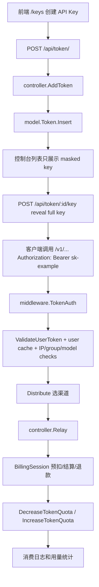
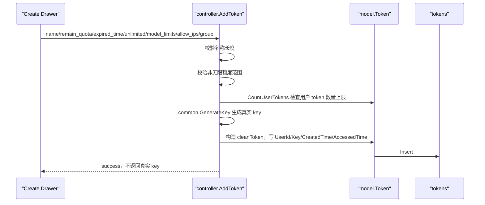

# API Key 与 Token 生命周期源码学习指南

本文面向已经掌握 Go 基本语法、希望通过 new-api 学真实 API 网关项目的读者。目标是把“用户在控制台创建 API Key，到用这个 key 调 relay，再到扣费、日志、删除和缓存失效”完整串起来。

在源码里，用户看到的 API Key 对应后端 `model.Token`。注意它和 `User.AccessToken` 不是一回事：

- `User.AccessToken`：后台 `/api/...` 管理接口的用户 access token，可以替代 Cookie Session。
- `Token.Key`：AI relay API 的 API Key，也就是 `/v1/chat/completions` 等接口使用的 key。

本文只讲第二种，也就是 `model.Token`。

## 1. 全局地图

API Key 生命周期横跨这些目录：

| 层 | 文件 | 负责什么 |
| --- | --- | --- |
| 路由 | `router/api-router.go` | `/api/token` 管理接口、`/api/usage/token` 只读查询 |
| 路由 | `router/relay-router.go` | `/v1/...` relay 接口挂 `TokenAuth` |
| 控制器 | `controller/token.go` | API Key 列表、搜索、创建、更新、删除、reveal、usage |
| 模型 | `model/token.go` | `Token` 表结构、查询、搜索、状态校验、额度增减、批量删除 |
| 缓存 | `model/token_cache.go` | Redis token hash，HMAC key，缓存中不保存真实 key |
| 鉴权 | `middleware/auth.go` | `TokenAuth`、`TokenAuthReadOnly`、`SetupContextForToken` |
| 分发 | `middleware/distributor.go` | 模型限制、分组、渠道选择 |
| 计费 | `service/billing_session.go`、`service/quota.go`、`service/text_quota.go` | 预扣、结算、退款、token quota 调整 |
| 前端 | `web/default/src/features/keys` | `/keys` API Key 管理页面 |
| 前端路由 | `web/default/src/routes/_authenticated/keys/index.tsx` | `/keys` 页面和 URL search schema |

一条完整链路可以这样概括：



Go 学习点：这个专题是理解 new-api 商业主链路的好入口。它同时包含 Gin middleware、GORM、Redis cache、事务/原子更新、前端表格和敏感信息 reveal。

## 2. `Token` 模型字段怎么读

`model/token.go` 中的 `Token` 是 API Key 的数据库模型。

关键字段：

| 字段 | 含义 |
| --- | --- |
| `Id` | token 主键 |
| `UserId` | token 属于哪个用户 |
| `Key` | 真实 API key，数据库唯一索引 |
| `Status` | 状态：enabled、disabled、expired、exhausted |
| `Name` | 用户设置的名称 |
| `CreatedTime` | 创建时间 |
| `AccessedTime` | 最近被访问或额度更新的时间 |
| `ExpiredTime` | 过期时间，`-1` 表示永不过期 |
| `RemainQuota` | token 自身剩余额度 |
| `UsedQuota` | token 已用额度 |
| `UnlimitedQuota` | 是否不限 token 额度 |
| `ModelLimitsEnabled` | 是否开启模型限制 |
| `ModelLimits` | 逗号分隔的模型白名单 |
| `AllowIps` | IP 白名单，多行文本，支持 CIDR |
| `Group` | token 指定使用分组，可覆盖用户组 |
| `CrossGroupRetry` | auto 分组下是否允许跨组重试 |
| `DeletedAt` | GORM 软删除字段 |

几个方法很重要：

- `MaskTokenKey`：列表展示时隐藏真实 key，只露前后少量字符。
- `GetFullKey`：reveal 接口返回真实 key。
- `GetIpLimits`：把 `AllowIps` 文本清洗成 IP/CIDR 列表。
- `ValidateUserToken`：relay 请求校验 token 是否存在、启用、未过期、额度未耗尽。
- `IncreaseTokenQuota` / `DecreaseTokenQuota`：结算和退款时调整 token quota。
- `BatchDeleteTokens`：批量删除并清 Redis cache。
- `InvalidateUserTokensCache`：用户禁用/删除时清掉该用户所有 token 缓存。

Go 学习点：

- `DeletedAt gorm.DeletedAt` 让 token 删除默认是软删除。
- `Select(...).Updates(token)` 允许明确更新零值，例如 `RemainQuota=0` 或 `UnlimitedQuota=false`。
- `Key` 和 `Group` 是 SQL 保留字风险字段，项目用 `commonKeyCol/commonGroupCol` 处理跨数据库引用。

## 3. 后端路由：管理接口全部走 `UserAuth`

`router/api-router.go` 里 tokenRoute 是：

```go
tokenRoute := apiRouter.Group("/token")
tokenRoute.Use(middleware.UserAuth())
{
    tokenRoute.GET("/", controller.GetAllTokens)
    tokenRoute.GET("/search", middleware.SearchRateLimit(), controller.SearchTokens)
    tokenRoute.GET("/:id", controller.GetToken)
    tokenRoute.POST("/:id/key", middleware.CriticalRateLimit(), middleware.DisableCache(), controller.GetTokenKey)
    tokenRoute.POST("/", controller.AddToken)
    tokenRoute.PUT("/", controller.UpdateToken)
    tokenRoute.DELETE("/:id", controller.DeleteToken)
    tokenRoute.POST("/batch", controller.DeleteTokenBatch)
    tokenRoute.POST("/batch/keys", middleware.CriticalRateLimit(), middleware.DisableCache(), controller.GetTokenKeysBatch)
}
```

这说明：

- 管理 API Key 必须先登录控制台。
- 搜索接口额外限流。
- reveal 真实 key 的接口额外 `CriticalRateLimit` 和 `DisableCache`。
- 列表、详情、搜索默认不返回真实 key，只返回 mask 后的 key。

`/api/usage/token` 是例外，它挂在 usage route 下，使用 `TokenAuthReadOnly()`，允许用 API Key 查询自己的 token 用量：

```go
usageRoute := apiRouter.Group("/usage")
usageRoute.Use(middleware.CORS(), middleware.CriticalRateLimit())
{
    tokenUsageRoute := usageRoute.Group("/token")
    tokenUsageRoute.Use(middleware.TokenAuthReadOnly())
    {
        tokenUsageRoute.GET("/", controller.GetTokenUsage)
    }
}
```

`controller.GetTokenStatus` 目前存在函数，但当前路由里没有直接挂载。读源码时要区分“函数存在”和“线上路由可达”。

## 4. 创建 API Key：用户不能提交真实 key

前端创建入口：

- `web/default/src/features/keys/components/api-keys-primary-buttons.tsx`
- `web/default/src/features/keys/components/api-keys-mutate-drawer.tsx`
- `web/default/src/features/keys/api.ts` 的 `createApiKey`

后端创建入口：

- `POST /api/token/`
- `controller.AddToken`
- `model.Token.Insert`

创建流程：



几个边界：

1. 前端不提交 `key`，后端用 `common.GenerateKey()` 生成。
2. Controller 构造 `cleanToken`，强制覆盖 `UserId`、`Key`、时间字段。
3. 名称最长 50。
4. 非无限额度不能为负，且不能超过最大值。
5. 用户 token 数量受 `operation_setting.GetMaxUserTokens()` 限制。
6. 创建响应不返回真实 key，用户需要通过 reveal 接口获取。

Go 学习点：和用户注册类似，这里也使用“请求对象 -> 服务端白名单对象”的写法。只要涉及权限/归属/secret，就不要把请求体直接保存。

## 5. 列表、详情和搜索：默认都只给 masked key

`controller.GetAllTokens`：

1. 从 `c.GetInt("id")` 获取当前用户 id。
2. `common.GetPageQuery(c)` 获取分页。
3. `model.GetAllUserTokens(userId, start, size)`。
4. `model.CountUserTokens(userId)`。
5. `buildMaskedTokenResponses` 把每个 token 的 key 替换成 masked key。
6. `common.ApiSuccess(c, pageInfo)`。

`controller.GetToken` 类似，但按 `id + userId` 查询单条，防止用户读取别人的 token。

`SearchTokens` 支持两个 query：

- `keyword`：搜索 token name。
- `token`：搜索 token key，可带 `sk-` 前缀。

`model.SearchUserTokens` 有很多安全和性能保护：

- limit 最大强制 100。
- offset 小于 0 时修正为 0。
- 搜索 token 时先去掉 `sk-`。
- 模糊搜索只允许最多两个 `%`。
- 不允许连续 `%%`。
- 模糊关键词去掉 `%` 后至少 2 个字符。
- `_` 和 `!` 会被转义。
- token 数量超过上限的用户禁止模糊搜索，只允许精确搜索。
- SQL 里使用 `ESCAPE '!'`，兼容 MySQL/PostgreSQL/SQLite。
- 查询 `key` 列时使用 `commonKeyCol`，规避跨库 quoting 差异。

Go 学习点：

- 搜索接口不仅要“能查”，还要防慢查询和通配符滥用。
- 对用户提供的 LIKE pattern 做白名单式限制，比简单拼 `%keyword%` 更安全。

## 6. Reveal 真实 key：单个和批量都走 POST

列表和详情只返回 masked key。真实 key 只能通过 reveal 接口获取：

- 单个：`POST /api/token/:id/key`
- 批量：`POST /api/token/batch/keys`

单个 reveal：

1. 解析 path id。
2. 使用 `model.GetTokenByIds(id, userId)`，确保 token 属于当前用户。
3. 返回 `token.GetFullKey()`。

批量 reveal：

1. body 是 `{ "ids": [1, 2, 3] }`。
2. ids 不能为空。
3. 最多 100 个。
4. 只查询当前用户拥有的 token。
5. 返回 `{ "keys": { "1": "real-key" } }`。

路由层为 reveal 加了：

- `CriticalRateLimit`
- `DisableCache`
- `UserAuth`

当前默认 API Key 管理页没有接入 `SecureVerificationRequired`。项目有二次验证组件和中间件，但主要用于渠道 key、上游密码等管理端敏感操作。

## 7. 更新、状态切换、删除和批量删除

### 7.1 更新

`controller.UpdateToken` 支持两种模式：

- `PUT /api/token/?status_only=true`：只更新 status。
- 普通 `PUT /api/token/`：更新名称、过期时间、额度、无限额度、模型限制、IP 限制、分组、跨组重试。

更新流程：

1. body bind 到 `model.Token`。
2. 校验名称长度。
3. 校验非无限额度范围。
4. 用 `model.GetTokenByIds(token.Id, userId)` 读取当前用户自己的 token。
5. 如果要启用 token，检查：
   - 已过期且过期时间已到的 token 不能重新启用。
   - 已耗尽且非 unlimited 的 token 不能重新启用。
6. status only 只改 `Status`。
7. 普通更新只拷贝允许字段。
8. `cleanToken.Update()`。
9. 返回 masked token。

`model.Token.Update` 使用：

```go
DB.Model(token).Select(
    "name", "status", "expired_time", "remain_quota", "unlimited_quota",
    "model_limits_enabled", "model_limits", "allow_ips", "group", "cross_group_retry",
).Updates(token)
```

这允许把某些字段更新为零值或 false。

### 7.2 删除

`DeleteToken`：

1. path id。
2. user id from context。
3. `model.DeleteTokenById(id, userId)`。
4. model 层先按 `id + userId` 查到 token。
5. `token.Delete()` 软删除。
6. Redis 开启时异步删除 token cache。

### 7.3 批量删除

`BatchDeleteTokens`：

1. body ids 非空。
2. 开事务。
3. 先查 `user_id = ? AND id IN (?)` 的 token。
4. 删除同一条件下的 token。
5. commit。
6. Redis 开启时异步删除这些 token cache。
7. 返回实际删除数量。

Go 学习点：

- 删除前先按 `user_id` 限定归属，是对象级权限的基本功。
- 批量删除返回实际删除数量，可以自然处理用户传入了不属于自己的 id。

## 8. Redis Token 缓存：HMAC key + 不缓存真实 secret

`model/token_cache.go` 是一个很值得看的安全缓存设计。

写缓存：

```go
func cacheSetToken(token Token) error {
    key := common.GenerateHMAC(token.Key)
    token.Clean()
    return common.RedisHSetObj(fmt.Sprintf("token:%s", key), &token, ttl)
}
```

要点：

- Redis key 不是明文 token，而是 `HMAC(token.Key)`。
- 写入 Redis value 前调用 `token.Clean()`，把真实 `Key` 清空。
- 从缓存读出来时，使用请求里的 key 再补回 `token.Key`。

读缓存：

```go
func cacheGetTokenByKey(key string) (*Token, error) {
    hmacKey := common.GenerateHMAC(key)
    RedisHGetObj("token:"+hmacKey, &token)
    token.Key = key
    return &token
}
```

额度更新：

- `cacheIncrTokenQuota`
- `cacheDecrTokenQuota`
- Redis field 使用 `constant.TokenFiledRemainQuota`，当前值是 `"RemainQuota"`。

失效：

- 单删：`cacheDeleteToken(token.Key)`。
- 批量删除：逐个 `cacheDeleteToken`。
- 用户禁用/删除：`InvalidateUserTokensCache(userId)` 查该用户所有 token key 并删除缓存。

Go 学习点：

- 敏感 secret 不应以明文出现在缓存 key 或缓存 value 中。
- cache-aside 模式下 DB 是最终事实，Redis 只是热点加速。
- 删除/禁用这类安全状态变化要主动清 cache，不能等 TTL。

## 9. TokenAuth：relay 请求如何识别 API Key

`middleware.TokenAuth()` 是 API Key 进入 relay 的第一关。它支持多种协议取 key：

| 协议/场景 | key 来源 |
| --- | --- |
| OpenAI 兼容 | `Authorization: Bearer sk-example` |
| Realtime WebSocket | `Sec-WebSocket-Protocol` 中的 `openai-insecure-api-key.sk-example` |
| Anthropic 兼容 | `/v1/messages` 或 `/v1/models` 时读 `x-api-key` |
| Gemini 兼容 | `/v1beta/models`、`/v1beta/openai/models`、`/v1/models/...` 时读 query `key` 或 `x-goog-api-key` |
| Midjourney | Authorization 空或为 `midjourney-proxy` 时读 `mj-api-secret` |

解析规则：

1. 去掉 `Bearer `。
2. 去掉 `sk-`。
3. 按 `-` split。
4. `parts[0]` 是真正 token key。
5. 如果存在 `parts[1]`，表示指定渠道 id；只有管理员可用，普通用户会被拒绝。

然后调用：

```go
token, err := model.ValidateUserToken(key)
```

`ValidateUserToken` 检查：

- key 是否为空。
- token 是否存在。
- token status 是否 enabled。
- token 是否过期。
- 非无限 token 的 `RemainQuota` 是否大于 0。

如果 Redis 未启用，过期或耗尽时会回写 token status 为 expired/exhausted。Redis 启用时要考虑缓存一致性，状态最终仍以 DB 和显式缓存失效为准。

## 10. IP、用户状态、分组、模型限制

`TokenAuth` 不只校验 key，它还会继续检查 token 的使用边界。

### 10.1 IP 白名单

`token.GetIpLimits()` 把 `AllowIps` 清理成列表。若列表非空：

1. 取 `c.ClientIP()`。
2. `net.ParseIP` 解析。
3. `common.IsIpInCIDRList(ip, allowIps)` 判断。
4. 不匹配则返回 forbidden。

前端表单提示用户：不要过度信任 IP 白名单，应结合 nginx、CDN 等网关使用。

### 10.2 用户状态

`TokenAuth` 使用 `model.GetUserCache(token.UserId)` 获取用户缓存。用户必须是 enabled，否则 API Key 即使自身有效也不能请求。

这就是为什么管理端禁用用户时要调用：

- `model.InvalidateUserCache(user.Id)`
- `model.InvalidateUserTokensCache(user.Id)`

### 10.3 分组覆盖

token 可以设置 `Group`：

- 如果为空，使用用户自己的 group。
- 如果非空，必须在 `service.GetUserUsableGroups(userGroup)` 中。
- group 必须存在于 ratio setting 中。
- `auto` 是特殊分组，允许继续通过。

最终使用组写入：

```go
common.SetContextKey(c, constant.ContextKeyUsingGroup, userGroup)
```

### 10.4 模型限制

`SetupContextForToken` 将模型限制写入 context：

- `token_model_limit_enabled`
- `token_model_limit`

后续 `Distribute` 解析请求 model 后，如果 token 开启模型限制，会用格式化后的模型名检查是否在 map 中。不在白名单则拒绝。

Go 学习点：

- 鉴权不只是“key 对不对”，还要校验用户状态、IP、分组、模型、额度。
- 这些检查分布在 `TokenAuth` 和 `Distribute`，读源码时要按 middleware 顺序串起来。

## 11. `SetupContextForToken` 写了哪些上下文

`SetupContextForToken(c, token, parts...)` 是把 token 数据交给后续 middleware/controller/service 的关键函数。

它写入：

- `id`
- `token_id`
- `token_key`
- `token_name`
- `token_unlimited_quota`
- `token_quota`，仅非无限 token 写入
- `token_model_limit_enabled`
- `token_model_limit`
- `ContextKeyTokenGroup`
- `ContextKeyTokenCrossGroupRetry`
- `specific_channel_id`，仅管理员通过 key suffix 指定渠道时写入

`userCache.WriteContext(c)` 还会写：

- `id`
- `user_group`
- `user_quota`
- `user_status`
- `user_email`
- `username`
- `user_setting`

这些 context 字段后续会被：

- `Distribute` 用于分组、模型限制、渠道选择。
- `relay/common.GenRelayInfo` 用于生成 `RelayInfo`。
- `BillingSession` 用于预扣和结算。
- `RecordConsumeLog` 用于写 token id/name、用户、分组、模型等日志字段。

Go 学习点：Gin 的 `Context` 在 new-api 中是“请求内共享总线”。理解每个 middleware 写了什么，后面 controller 为什么能读到就清楚了。

## 12. Relay 路由中的 middleware 顺序

`router/relay-router.go` 的核心顺序可以概括为：

```text
SystemPerformanceCheck
-> TokenAuth
-> ModelRequestRateLimit
-> Distribute
-> controller.Relay
```

这几个环节的职责：

- `SystemPerformanceCheck`：系统资源保护。
- `TokenAuth`：API Key 鉴权、用户状态、IP、分组、token context。
- `ModelRequestRateLimit`：模型请求限流。
- `Distribute`：解析模型、检查 token model limit、选择渠道、写渠道 context。
- `controller.Relay`：解析请求、预扣费、调用 provider adaptor、后结算和日志。

如果某个请求失败，要先判断失败发生在哪一层：

- 401/403 且还没选渠道：多半是 `TokenAuth`。
- 模型不允许：可能是 token model limit 或渠道无能力。
- 429：可能是模型请求限流或渠道 RPM。
- 余额不足：可能是 token quota、用户钱包、订阅额度。
- 上游错误：进入了 `controller.Relay` 和 provider adaptor。

## 13. TokenAuthReadOnly：只读用量查询为什么更宽松

`TokenAuthReadOnly()` 用在 `/api/usage/token/`。

它只做：

- 从 `Authorization` 读 token key。
- 去掉 Bearer 和 `sk-`。
- `model.GetTokenByKey(key, false)`。
- 查询用户 cache。
- 检查用户未被封禁。
- 写 `id/token_id/token_key`。

它不检查：

- token status。
- token expired。
- token remain quota。

设计意图：即使 token 已过期、耗尽或禁用，用户仍可用这个 key 查询它自己的 usage 摘要。用户被封禁则仍拒绝。

`controller.GetTokenUsage` 会返回：

- name
- total_granted = remain + used
- total_used
- total_available
- unlimited_quota
- model_limits
- model_limits_enabled
- expires_at

## 14. 计费：预扣、结算、退款和 token quota

API Key 的额度不只是创建时的 `RemainQuota`，它在 relay 请求中会被预扣、结算和退款。

核心文件：

- `service/billing_session.go`
- `service/quota.go`
- `service/pre_consume_quota.go`
- `service/text_quota.go`
- `model/token.go`

### 14.1 预扣

`controller.Relay` 会估算请求消耗，得到 `QuotaToPreConsume`。非免费模型会调用 `service.PreConsumeBilling()`，新主线是 `BillingSession`。

`BillingSession.preConsume`：

1. 判断是否可走信任额度旁路。
2. 如果需要预扣，先调用 `PreConsumeTokenQuota` 扣 token quota。
3. 再扣资金来源：钱包或订阅。
4. 如果资金来源扣失败，回滚 token quota。
5. 将 `FinalPreConsumedQuota` 等字段同步到 `RelayInfo`。

信任额度旁路：

- 只适用于钱包路径。
- 用户额度充足。
- token 额度充足或 token unlimited。
- 非强制预扣。
- 订阅不走信任旁路。

### 14.2 Token quota 预扣

`PreConsumeTokenQuota`：

1. quota 不能为负。
2. playground 跳过。
3. 重新通过 token key 查询 token。
4. 如果 token 不是 unlimited，则检查 `RemainQuota >= quota`。
5. 调 `model.DecreaseTokenQuota`。

一个容易忽略的业务细节：unlimited token 跳过“余额不足”检查，但当前实现仍会调用 `DecreaseTokenQuota`，因此 used quota 仍可能增长，remain quota 也会被表达式更新。

### 14.3 结算

实际 usage 回来后，例如文本请求会进入 `service.PostTextConsumeQuota`。它会：

1. 计算实际 prompt/completion/cache/image/audio/tool 等成本。
2. 有效 usage 下更新用户已用额度和请求数。
3. 更新渠道已用额度。
4. 调 `SettleBilling` 或 `BillingSession.Settle(actualQuota)`。
5. 写消费日志。

`BillingSession.Settle`：

```text
delta = actualQuota - preConsumedQuota
delta > 0: 补扣
delta < 0: 返还
```

先调整资金来源，再调整 token quota。若资金来源已成功提交而 token 调整失败，只能记录日志并避免后续误退款。

### 14.4 退款

请求失败时，`controller.Relay` 的 defer 会触发 `relayInfo.Billing.Refund()`。

`BillingSession.Refund` 是幂等的：

- 已结算不退。
- 已退过不退。
- 没有需要退的预扣不退。
- 异步退资金来源。
- 异步退 token quota。
- 对订阅额外预留额度做补偿。

Go 学习点：

- `BillingSession` 用 `sync.Mutex` 防重复结算/退款。
- 异步 goroutine 前复制需要的字段到局部变量，避免闭包读到后来变化。
- `FundingSource` interface 把钱包和订阅统一成 `PreConsume/Settle/Refund` 生命周期。

## 15. `DecreaseTokenQuota` 和 `IncreaseTokenQuota`

`model.DecreaseTokenQuota(id, key, quota)`：

- quota 不能为负。
- Redis 开启时异步 `cacheDecrTokenQuota`。
- BatchUpdate 开启时写 batch record。
- 否则直接 DB 更新：
  - `remain_quota = remain_quota - quota`
  - `used_quota = used_quota + quota`
  - `accessed_time = now`

`model.IncreaseTokenQuota(id, key, quota)`：

- quota 不能为负。
- Redis 开启时异步 `cacheIncrTokenQuota`。
- BatchUpdate 开启时写 batch record。
- 否则直接 DB 更新：
  - `remain_quota = remain_quota + quota`
  - `used_quota = used_quota - quota`
  - `accessed_time = now`

这里用的是 `gorm.Expr`，让数据库原子执行加减。

注意：`IncreaseTokenQuota` 在退款或实际消耗小于预扣时会减少 `used_quota`。所以 `UsedQuota` 是随着预扣/退款动态调整的，不只是单向增长。

## 16. 前端 `/keys` 页面结构

默认前端的 API Key 模块位于：

- `web/default/src/routes/_authenticated/keys/index.tsx`
- `web/default/src/features/keys/index.tsx`
- `web/default/src/features/keys/api.ts`
- `web/default/src/features/keys/types.ts`
- `web/default/src/features/keys/lib/api-key-form.ts`

路由文件用 TanStack Router 定义：

- 页面路径：`/_authenticated/keys/`
- 对外访问：`/keys`
- URL search：`page`、`pageSize`、`status`、`filter`、`token`

`features/keys/index.tsx` 组合：

- `ApiKeysProvider`
- `SectionPageLayout`
- `ApiKeysPrimaryButtons`
- `ApiKeysTable`
- `ApiKeysDialogs`

侧边栏入口在 `web/default/src/hooks/use-sidebar-data.ts`：

- `API Keys -> /keys`
- `Usage Logs -> /usage-logs/common`

## 17. 前端 API client 和字段转换

`web/default/src/features/keys/api.ts` 封装：

- `getApiKeys`
- `searchApiKeys`
- `getApiKey`
- `createApiKey`
- `updateApiKey`
- `deleteApiKey`
- `batchDeleteApiKeys`
- `updateApiKeyStatus`
- `fetchTokenKey`
- `fetchTokenKeysBatch`

`types.ts` 用 zod 定义 `apiKeySchema`：

- `cross_group_retry` 支持把 `1/0` 预处理成 boolean。
- `model_limits` 和 `allow_ips` 用 `nullish().default('')`，方便 UI 处理。

字段转换在 `lib/api-key-form.ts`：

| 表单字段 | 后端字段 | 转换 |
| --- | --- | --- |
| `remain_quota_dollars` | `remain_quota` | `parseQuotaFromDollars` |
| `expired_time` | `expired_time` | Date -> 秒级时间戳，空值为 `-1` |
| `model_limits` | `model_limits` | string[] -> 逗号字符串 |
| `model_limits.length > 0` | `model_limits_enabled` | 自动派生 |
| `group === "auto"` | `cross_group_retry` | 只有 auto 分组保留 true |

编辑时反向转换：

- quota units -> display dollars/tokens。
- 秒级 timestamp -> Date。
- 逗号字符串 -> string[]。

React/TypeScript 学习点：

- 表单状态用 `react-hook-form`。
- 校验用 zod。
- API 契约转换集中在 `transformFormDataToPayload`，不要散落在组件里。

## 18. 前端列表、搜索和状态筛选

`ApiKeysTable` 使用：

- `useTableUrlState`
- `useDebouncedColumnFilter`
- React Query
- 项目 DataTable 组件

URL search 同步：

- `filter`：名称搜索。
- `token`：API Key 搜索。
- `status`：状态筛选。
- `page/pageSize`：分页。

当 `filter` 或 `token` 有值时，调用 `searchApiKeys`。否则调用 `getApiKeys`。

一个源码阅读细节：状态筛选进入 table column filter，但没有传给后端 `/api/token/search`，因此更像当前页前端过滤，而不是后端全量状态过滤。

React Query query key 包含：

- page
- page size
- globalFilter
- tokenFilter
- refreshTrigger

`placeholderData` 保留上一页数据，翻页/搜索时体验更稳。

## 19. 前端 reveal、复制和批量复制

`ApiKeysProvider` 管理跨组件状态：

- 当前打开的 dialog。
- 当前 row。
- refresh trigger。
- 单个 resolved key。
- `resolvedKeys` map。
- `loadingKeys` map。
- pending request 去重。
- copied state。

单个 reveal：

1. `resolveRealKey(id)`。
2. 如果已有缓存，直接返回。
3. 如果同 id 请求正在进行，复用 promise。
4. 调 `fetchTokenKey(id)`。
5. 成功后给 key 加 `sk-` 前缀存入 `resolvedKeys`。

批量 reveal：

1. 过滤掉已缓存 id。
2. 调 `fetchTokenKeysBatch(uncachedIds)`。
3. 后端返回的真实 key 不带 `sk-`。
4. 前端统一加 `sk-`。
5. 合并已缓存和新获取的 key。

行菜单支持：

- Copy Key。
- Copy Connection Info。
- CC Switch。
- Chat preset。
- Delete。

批量操作支持：

- 选中多行。
- 批量 fetch real keys。
- 按 `name\tkey` 形式复制多行。
- 批量删除。

安全设计上，页面默认只展示 masked key，真实 key 只在用户明确 reveal/copy/集成导出时请求。

## 20. 用量和日志如何关联 token

token 维度的信息进入日志和用量统计：

- `token_id`
- `token_name`
- model
- group
- quota
- prompt/completion tokens

前端日志页：

- `/usage-logs`
- `/usage-logs/$section`
- 支持 `token` search 参数。
- 过滤会映射成后端 `token_name`。

API Key 行操作里当前没有直接“查看该 key 日志”的入口；日志页独立支持按 token name 查询。

`/api/usage/token/` 则提供用 API Key 自身查询自己的 token usage 摘要的能力。

## 21. 安全边界总结

API Key 生命周期的关键安全边界：

1. `/api/token` 管理接口必须 `UserAuth`。
2. 列表、搜索、详情默认 masked key。
3. reveal 真实 key 走 POST、critical rate limit、disable cache。
4. 所有读写都必须按 `id + user_id` 查询，防止访问别人 token。
5. 批量 reveal 最多 100 个。
6. Redis cache key 使用 HMAC，不用明文 token。
7. Redis cache value 清空真实 key。
8. relay `TokenAuth` 校验 token status、过期、额度。
9. token IP 白名单支持 CIDR。
10. token group 必须在用户可用分组内。
11. token model limits 在 `Distribute` 中检查。
12. 用户被禁用时，token 也不能继续用。
13. 管理员禁用/删除用户时应清用户缓存和 token 缓存。
14. 预扣失败会回滚 token quota。
15. relay 失败退款会退回 token quota。

## 22. 推荐精读顺序

如果你想一边学 Go 一边读这条链路，推荐按这个顺序：

1. `web/default/src/routes/_authenticated/keys/index.tsx`：看页面 URL search。
2. `web/default/src/features/keys/index.tsx`：看页面组件组合。
3. `web/default/src/features/keys/api.ts`：看前端 API 契约。
4. `web/default/src/features/keys/lib/api-key-form.ts`：看表单到后端 payload 的转换。
5. `router/api-router.go` 的 tokenRoute：看管理接口怎么挂中间件。
6. `controller/token.go`：按 CRUD 顺序读一遍。
7. `model/token.go`：读模型字段、搜索、校验和额度更新。
8. `model/token_cache.go`：理解 HMAC cache 和 secret 清理。
9. `middleware/auth.go` 的 `TokenAuth`：看 relay key 怎么被识别。
10. `middleware/distributor.go`：看模型限制和渠道选择如何消费 token context。
11. `controller/relay.go`：看预扣费进入点。
12. `service/billing_session.go`：看预扣、结算、退款状态机。
13. `service/text_quota.go`：看实际 usage 如何变成最终 quota 和日志。

## 23. 修改 API Key 相关代码时的检查清单

改这条链路时，建议逐项检查：

- 是否误把 `User.AccessToken` 和 `Token.Key` 混淆。
- 列表/详情/搜索是否泄露真实 key。
- reveal 接口是否校验 `user_id`。
- 是否需要 `CriticalRateLimit` 和 `DisableCache`。
- 新搜索条件是否跨 SQLite/MySQL/PostgreSQL 兼容。
- 更新字段是否需要允许零值。
- 删除或禁用后是否清 Redis token cache。
- token quota 更新是否同步 Redis 和 batch update。
- 是否影响 unlimited token 的 used/remain 语义。
- 新 relay 协议是否需要从特殊 header/query/websocket protocol 提取 key。
- 新 context key 是否和 `RelayInfo`、日志、计费消费方一致。
- 模型限制、分组、IP 白名单是否仍然生效。
- 前端是否只在明确 reveal/copy 时请求真实 key。
- 新前端文案是否走 i18n。

这条链路读懂后，你会更容易理解 new-api 的核心：它不是简单转发 OpenAI 请求，而是在每次请求前后维护了一套完整的身份、权限、分组、额度、缓存、日志和安全状态机。
