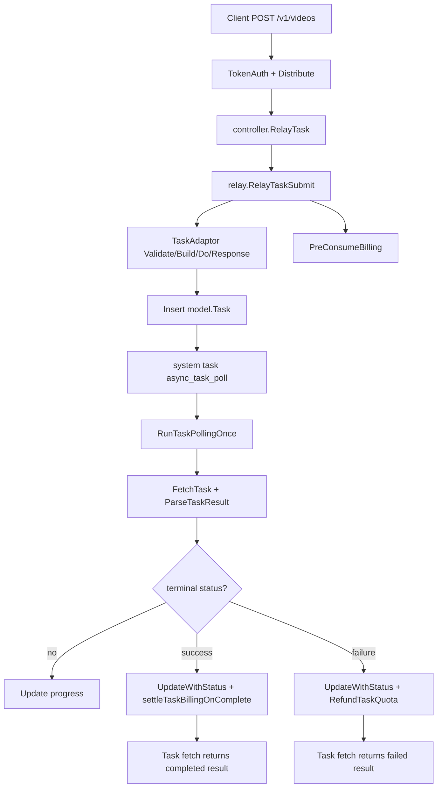

# 异步任务与媒体生成学习指南

这份文档梳理 new-api 里“提交后不能立刻得到最终结果”的任务型接口，包括 Midjourney、Suno、视频生成、Gemini/Vertex 长任务、Kling、Vidu、Jimeng、Doubao、Sora、Ali 等。重点不是某个 provider 的参数，而是项目怎样把 submit、fetch、poll、状态更新、退款和差额结算串成完整生命周期。

建议先读：

- `system-tasks-observability-guide-for-go-learners.md`
- `channel-management-selection-guide-for-go-learners.md`
- `provider-adapter-guide-for-go-learners.md`
- `billing-expression-guide-for-go-learners.md`

## 一、先区分两套任务模型

new-api 当前有两条异步任务线：

```text
Midjourney proxy 兼容线
  -> model.Midjourney
  -> midjourneys 表
  -> /mj/... 路由
  -> relay/mjproxy_handler.go
  -> controller/midjourney.go 轮询

通用 Task 线
  -> model.Task
  -> tasks 表
  -> /suno/...、/v1/videos...、任务型 provider
  -> relay/relay_task.go
  -> service/task_polling.go 轮询
```

它们相似：

- 都会提交到上游。
- 都会保存本地任务记录。
- 都要周期性拉取上游状态。
- 都要在失败时退款。
- 都要避免多节点重复处理同一终态。

但它们不是同一张表、不是同一套 adaptor。读源码时不要把 `model.Midjourney` 和 `model.Task` 混在一起。

## 二、路由入口

### 1. Midjourney

路由在 `router/relay-router.go`：

```text
/mj/...
/:mode/mj/...
```

控制器入口是 `controller.RelayMidjourney()`：

```text
RelayMidjourney
  -> GenRelayInfo
  -> 按 relay mode 分发
       notify          -> relay.RelayMidjourneyNotify
       task fetch      -> relay.RelayMidjourneyTask
       image seed      -> relay.RelayMidjourneyTaskImageSeed
       swap face       -> relay.RelaySwapFace
       submit/default  -> relay.RelayMidjourneySubmit
```

管理/用户查询入口在 `router/api-router.go`：

```text
GET /api/mj/self
GET /api/mj/
```

对应 `controller.GetUserMidjourney()` 和 `controller.GetAllMidjourney()`。

### 2. Suno 和通用任务

路由在 `router/relay-router.go`：

```text
POST /suno/submit/:action
POST /suno/fetch
GET  /suno/fetch/:id

POST /v1/videos
GET  /v1/videos/:task_id
POST /v1/videos/:video_id/remix
```

控制器入口：

```text
controller.RelayTask
controller.RelayTaskFetch
```

后台/用户任务列表：

```text
controller.GetAllTask
controller.GetUserTask
```

## 三、通用 Task 数据模型

`model/task.go` 的 `Task` 是通用异步任务主模型：

```go
type Task struct {
    TaskID     string
    Platform   constant.TaskPlatform
    UserId     int
    Group      string
    ChannelId  int
    Quota      int
    Action     string
    Status     TaskStatus
    FailReason string
    SubmitTime int64
    StartTime  int64
    FinishTime int64
    Progress   string
    Properties TaskProperties
    PrivateData TaskPrivateData
    Data        json.RawMessage
}
```

状态枚举：

```text
NOT_START
SUBMITTED
QUEUED
IN_PROGRESS
FAILURE
SUCCESS
UNKNOWN
```

`TaskID` 是对外暴露的 `task_<random>` ID。上游真实 ID 放在 `PrivateData.UpstreamTaskID`。这样可以隐藏上游任务 ID，也方便 remix、fetch、日志都统一使用本地公开 ID。

`Properties` 保存公开模型信息：

- `OriginModelName`
- `UpstreamModelName`
- `Input`

`PrivateData` 保存内部信息，不返回给用户：

- 上游真实 task id。
- 结果 URL。
- 任务提交时使用的 key。
- 计费来源：wallet/subscription。
- subscription id。
- token id。
- 发起节点名。
- `TaskBillingContext` 计费快照。

## 四、TaskBillingContext

异步任务有一个特殊难点：提交时先预扣，真正完成可能在几分钟后，由另一个节点轮询到结果。那时不能依赖原来的 Gin context，所以必须把计费上下文写进任务记录。

`TaskBillingContext` 保存：

```text
ModelPrice
GroupRatio
ModelRatio
OtherRatios
OriginModelName
PerCallBilling
```

这些字段用于：

- 任务失败时知道退多少。
- 任务成功后如果上游返回真实 token，能重新计算实际 quota。
- 按次计费任务跳过 token 差额结算。
- 日志里还原提交时的计费参数。

这是异步系统里很重要的设计：跨进程、跨时间的状态必须持久化，不能只放在内存。

## 五、通用任务提交流程

入口是 `controller.RelayTask()`。

```text
RelayTask
  -> GenRelayInfo
  -> relay.ResolveOriginTask
  -> retry loop
       getChannel 或使用 LockedChannel
       reset request body
       relay.RelayTaskSubmit
       上游错误时 processChannelError
       shouldRetryTaskRelay
  -> 成功后
       SettleBilling(result.Quota)
       LogTaskConsumption
       model.InitTask
       写 PrivateData/BillingContext
       task.Insert
  -> 失败时 defer Billing.Refund
```

和普通文本 relay 类似，它也有 retry loop，也会重置请求体，也会调用渠道错误处理。差异是：文本请求成功后立即拿到 usage 并结算；任务请求成功只代表“提交成功”，最终状态要靠后续 fetch/poll。

## 六、RelayTaskSubmit 细节

`relay/relay_task.go` 的 `RelayTaskSubmit()` 是通用任务提交核心：

```text
1. info.InitChannelMeta(c)
2. 根据 platform 获取 TaskAdaptor
3. adaptor.ValidateRequestAndSetAction
4. 推导 modelName
5. helper.ModelMappedHelper 应用模型映射
6. 预生成公开 task ID
7. helper.ModelPriceHelperPerCall 计算基础价格
8. adaptor.EstimateBilling 提供 OtherRatios
9. 应用 OtherRatios 到 quota
10. PreConsumeBilling，且 ForcePreConsume=true
11. adaptor.BuildRequestBody
12. adaptor.DoRequest
13. adaptor.DoResponse 解析上游任务 ID 和 task data
14. adaptor.AdjustBillingOnSubmit 可基于上游响应修正 quota
```

`ForcePreConsume=true` 很关键。普通同步请求可以在用户额度足够时走 trust quota 旁路，但异步任务必须预扣，因为最终结果可能很久后才回来。如果不预扣，任务完成时用户可能已经没有额度。

## 七、TaskAdaptor 接口

任务型 provider 都实现 `relay/channel/adapter.go` 的 `TaskAdaptor`：

```go
type TaskAdaptor interface {
    Init(info *RelayInfo)
    ValidateRequestAndSetAction(c, info)
    EstimateBilling(c, info) map[string]float64
    AdjustBillingOnSubmit(info, taskData) map[string]float64
    AdjustBillingOnComplete(task, taskResult) int
    BuildRequestURL(info)
    BuildRequestHeader(c, req, info)
    BuildRequestBody(c, info)
    DoRequest(c, info, requestBody)
    DoResponse(c, resp, info)
    FetchTask(baseUrl, key, body, proxy)
    ParseTaskResult(respBody)
}
```

可以按职责分三组：

提交前：

- 校验请求。
- 设置 action。
- 估算计费倍率。
- 构造上游请求。

提交后：

- 解析上游 task id。
- 保存 task data。
- 修正提交阶段计费。

轮询阶段：

- 查询上游任务状态。
- 解析状态和结果 URL。
- 成功后按真实结果修正计费。

`relay/channel/task/taskcommon.BaseBilling` 提供默认 no-op 计费方法，provider 不需要特殊计费时直接嵌入即可。

## 八、OtherRatios 是什么

任务型接口经常不是单纯“一个模型一次多少钱”，而是受请求参数影响：

- 视频时长。
- 分辨率。
- 质量档位。
- remix 参数。
- provider 返回的真实秒数。

这些倍率放在 `PriceData.OtherRatios`。

提交阶段：

```text
adaptor.EstimateBilling
  -> 从用户请求估算 seconds/size/quality
  -> 写入 info.PriceData.OtherRatios
  -> quota = baseQuota * product(OtherRatios)
```

提交后：

```text
adaptor.AdjustBillingOnSubmit
  -> 如果上游返回了更准确参数
  -> 重新计算 finalQuota
```

完成后：

```text
adaptor.AdjustBillingOnComplete
  -> 如果上游最终结果才知道真实消耗
  -> 返回 actualQuota
  -> RecalculateTaskQuota 差额结算
```

## 九、任务 fetch

用户主动查询任务时走 `controller.RelayTaskFetch()` -> `relay.RelayTaskFetch()`。

支持的 response builder：

```text
sunoFetchByIDRespBodyBuilder
sunoFetchRespBodyBuilder
videoFetchByIDRespBodyBuilder
```

Suno fetch：

```text
根据用户 id + task ids 查询本地 tasks 表
  -> TaskModel2Dto
  -> 返回 TaskResponse
```

视频 fetch：

```text
根据用户 id + task_id 查询本地 task
  -> Gemini/Vertex 可尝试实时 fetch 上游
  -> OpenAI Video API 路径转成 OpenAI video 格式
  -> 否则返回通用 TaskDto
```

注意：fetch 通常不是重新提交任务，而是读本地状态。部分 provider 支持“fetch 时实时拉上游”，但那是优化路径，不是主轮询机制的替代。

## 十、系统任务如何轮询

`controller.RegisterScheduledSystemTasks()` 注册：

```text
midjourneyPollHandler
asyncTaskPollHandler
```

二者都挂在 system task runner 下，由 DB lease 去重，多节点时不会所有节点同时执行同一个系统任务。

```text
midjourney_poll
  Enabled: constant.UpdateTask && model.HasUnfinishedMidjourneyTasks()
  Interval: 15s
  Run: runMidjourneyTaskUpdateOnce

async_task_poll
  Enabled: constant.UpdateTask && model.HasUnfinishedSyncTasks()
  Interval: 15s
  Run: service.RunTaskPollingOnce
```

`Enabled()` 里先做“是否有未完成任务”的 cheap existence check。没有任务时不创建 system task row，这能减少空转。

## 十一、通用 Task 轮询流程

核心函数：`service.RunTaskPollingOnce()`。

```text
RunTaskPollingOnce
  -> sweepTimedOutTasks
  -> model.GetAllUnFinishSyncTasks
  -> 按 Platform 分组
  -> 每个平台内按 ChannelId 分组
  -> DispatchPlatformUpdate
       Suno       -> UpdateSunoTasks
       Midjourney -> 预留，不在这里处理
       default    -> UpdateVideoTasks
```

### 1. 超时清理

`sweepTimedOutTasks()` 会把超过 `constant.TaskTimeoutMinutes` 的未完成任务置为 `FAILURE`：

```text
读取超时未完成任务
  -> task.Status = FAILURE
  -> task.Progress = 100%
  -> task.UpdateWithStatus(oldStatus)
  -> 如果 CAS 成功且非遗留任务，RefundTaskQuota
```

这里的 CAS 很重要。如果另一个轮询器刚好把任务更新为 SUCCESS，本轮不能再覆盖成 FAILURE。

### 2. Suno 轮询

`UpdateSunoTasks()` 按 channel 调用上游 batch fetch：

```text
channel -> taskIds
  -> CacheGetChannel
  -> adaptor.FetchTask(baseURL, key, {"ids": taskIds}, proxy)
  -> 解析 []SunoDataResponse
  -> 对每个任务判断 taskNeedsUpdate
  -> FAILURE 时 RefundTaskQuota
  -> SUCCESS 时 progress=100%
  -> task.Update()
```

Suno 的轮询结果格式和通用视频 adaptor 不完全一致，所以它有单独分支。

也要注意一个实现差异：Suno 分支当前使用 `task.Update()` 保存状态，失败时直接调用 `RefundTaskQuota()`，不像视频任务和 MJ 那样在终态转换处统一用 `UpdateWithStatus()` CAS 抢占。因此 Suno 路径主要依赖 system task runner 的 DB lease 去减少并发重复执行；如果未来要强化防重复退款，Suno 终态更新也应该向视频任务的 snapshot + CAS 模式靠拢。

### 3. 视频/任务型 provider 轮询

`UpdateVideoTasks()` 会按 channel 并发：

```text
每个 channel 一个 goroutine
  -> updateVideoTasks
       CacheGetChannel
       GetTaskAdaptorFunc(platform)
       对该 channel 的 task 逐个 updateVideoSingleTask
```

`updateVideoSingleTask()`：

```text
FetchTask
  -> ParseTaskResult
  -> task.Snapshot()
  -> 根据 status 更新 progress/start/finish/url/fail_reason
  -> 终态用 task.UpdateWithStatus(snap.Status)
  -> 成功终态 settleTaskBillingOnComplete
  -> 失败终态 RefundTaskQuota
```

这里的 `Snapshot()` + `UpdateWithStatus()` 是防重复结算的关键：只有第一个把任务从旧状态推进到终态的轮询器，才允许执行退款或差额结算。

## 十二、任务退款与差额结算

任务失败：

```text
RefundTaskQuota
  -> taskAdjustFunding(task, -quota)
       subscription -> PostConsumeUserSubscriptionDelta(subscriptionId, -quota)
       wallet       -> IncreaseUserQuota(userId, quota)
  -> taskAdjustTokenQuota(delta=-quota)
  -> RecordTaskBillingLog(refund)
```

任务成功但实际费用不同：

```text
RecalculateTaskQuota(task, actualQuota)
  -> quotaDelta = actualQuota - task.Quota
  -> taskAdjustFunding(delta)
  -> taskAdjustTokenQuota(delta)
  -> task.Quota = actualQuota
  -> 记录 consume/refund 日志
  -> 正向 delta 更新 user/channel used quota
```

如果上游返回 token：

```text
RecalculateTaskQuotaByTokens
  -> totalTokens * modelRatio * groupRatio * otherMultiplier
  -> RecalculateTaskQuota
```

按次计费任务：

```text
TaskBillingContext.PerCallBilling = true
  -> settleTaskBillingOnComplete 跳过差额结算
```

## 十三、Midjourney 数据模型

`model.Midjourney` 是历史兼容模型：

```text
MjId
Action
Prompt
PromptEn
State
SubmitTime/StartTime/FinishTime
ImageUrl/VideoUrl/VideoUrls
Status
Progress
FailReason
ChannelId
Quota
Buttons
Properties
```

和通用 `Task` 相比：

- 没有 `PrivateData`。
- 计费来源不保存 subscription/token 上下文。
- 状态字段直接贴近 midjourney-proxy 协议。
- 图片转发和按钮/properties 都按 MJ 协议保存。

## 十四、Midjourney 提交流程

核心入口：`relay.RelayMidjourneySubmit()`。

```text
1. 解析 MidjourneyRequest
2. InitChannelMeta
3. 根据 relay mode 设置 action
4. 如果是 action/change/video 等派生操作
     -> 找原始任务
     -> 强制使用原始任务所属 channel
5. 某些 action 不消耗 quota，例如 InPaint/CustomZoom
6. ModelPriceHelperPerCall 计算价格
7. 检查用户 quota
8. DoMidjourneyHttpRequest 转发到上游
9. status 200 且需要扣费时 PostConsumeQuota
10. RecordConsumeLog + user/channel used quota
11. 创建 model.Midjourney 记录
12. 返回上游响应
```

Midjourney 与通用 Task 的最大差异：它没有统一 `BillingSession` 异步预扣上下文，而是提交成功后直接 `PostConsumeQuota`。失败退款由 MJ 轮询根据 `Quota` 退回用户。

## 十五、Midjourney 轮询

核心函数：`controller.runMidjourneyTaskUpdateOnce()`。

```text
读取 progress != 100% 的 midjourney tasks
  -> 按 ChannelId 分组
  -> 对每个 channel 调 /mj/task/list-by-condition
  -> 解析 []MidjourneyDto
  -> 更新 progress/status/image/video/buttons/properties
  -> 超过 1 小时仍未完成则标记 FAILURE
  -> UpdateWithStatus(preStatus)
  -> 如果 CAS 成功且失败需要退款
       IncreaseUserQuota
       RecordTaskBillingLog(refund)
```

MJ 也用了 CAS 更新，避免多个系统任务实例重复退款。

## 十六、图片和结果 URL 代理

Midjourney 图片代理：

```text
RelayMidjourneyImage
  -> 根据 mj id 找任务
  -> 使用任务渠道代理设置创建 HTTP client
  -> ValidateURLWithFetchSetting 做 SSRF 防护
  -> 拉取 ImageUrl 并流式返回
```

视频任务结果：

```text
task.PrivateData.ResultURL
  -> 直接上游 URL
  -> 或 taskcommon.BuildProxyURL(task.TaskID)
```

Gemini/Vertex 这类可能返回 `data:` 或 base64 视频的 provider，会把直接内容放在 `Data`，对外用 `/v1/videos/{task_id}/content` 这类代理 URL。

## 十七、remix / continuation 任务

`relay.ResolveOriginTask()` 处理基于已有任务的提交，例如 `/v1/videos/:video_id/remix`。

流程：

```text
读取 origin task
  -> 从 origin task 推导 OriginModelName
  -> 锁定 origin task 的 ChannelId
  -> 读取原渠道最新 key
  -> 写回 context 和 RelayInfo
  -> 如果是 remix，从原任务 BillingContext 提取 OtherRatios
```

为什么要锁定原渠道？因为很多上游任务的后续操作必须在同一个上游账号/渠道上执行，换渠道可能找不到原始任务。

## 十八、两套任务线的对比

| 维度 | Midjourney | 通用 Task |
| --- | --- | --- |
| 表 | `midjourneys` | `tasks` |
| 模型 | `model.Midjourney` | `model.Task` |
| 提交入口 | `RelayMidjourneySubmit` | `RelayTaskSubmit` |
| adaptor | midjourney proxy HTTP | `TaskAdaptor` |
| 轮询 | `runMidjourneyTaskUpdateOnce` | `RunTaskPollingOnce` |
| 状态判断 | MJ proxy 协议 | `TaskStatus` |
| 计费 | 提交后 `PostConsumeQuota` | `BillingSession` 预扣 + settle |
| 退款 | 轮询失败后退用户 quota | `RefundTaskQuota` 退 funding + token |
| 差额结算 | 较弱/历史逻辑 | `RecalculateTaskQuota` |
| 多节点防重 | `UpdateWithStatus` | 视频任务用 `UpdateWithStatus`；Suno 当前主要依赖 system task lease |

## 十九、一次通用视频任务完整链路



## 二十、Go 学习重点

### 1. 接口拆分避免循环依赖

`service.TaskPollingAdaptor` 是轮询所需的最小接口，`GetTaskAdaptorFunc` 由外部注入。这样 service 不需要直接 import relay，避免 `service -> relay -> channel -> service` 循环依赖。

### 2. 异步状态要持久化

`TaskPrivateData` 和 `TaskBillingContext` 是典型异步工程写法：提交阶段的上下文必须存 DB，轮询阶段不能假设原请求还在。

### 3. CAS 防重复结算

`UpdateWithStatus(oldStatus)` 用 `WHERE status = oldStatus` 做条件更新。只有抢到状态转换的执行者才退款或结算。这比单纯 `Save()` 安全得多。

### 4. 分组再并发

轮询先按 platform 分组，再按 channel 分组。视频任务按 channel 并发，channel 内逐个任务处理，并可按渠道设置决定是否 sleep。这能控制上游压力。

### 5. 终态副作用要晚于状态抢占

退款、差额结算、日志都是副作用。代码先 CAS 更新终态，确认自己赢了，再做这些副作用，避免重复退款或重复补扣。

### 6. legacy 和新链路并存

`controller/task_video.go` 里还有旧式视频轮询逻辑，当前通用 system task 主线在 `service/task_polling.go`。读大型项目时常会遇到这种迁移期并存代码，要优先看路由和调度入口判断真实主链路。

## 二十一、自测问题

1. 为什么通用任务要有公开 `TaskID` 和上游 `UpstreamTaskID` 两个 ID？
2. 为什么异步任务必须 `ForcePreConsume=true`？
3. `TaskBillingContext` 保存了哪些跨时间结算信息？
4. `UpdateWithStatus` 如何防止重复退款？
5. Suno 轮询为什么有单独分支？
6. `AdjustBillingOnSubmit` 和 `AdjustBillingOnComplete` 分别解决什么问题？
7. Midjourney 为什么没有直接复用通用 `Task` 表？
8. remix 为什么要锁定原任务渠道？
9. system task runner 对异步轮询有什么价值？
10. 任务失败时，钱包、订阅、token quota 分别如何退回？

能回答这些问题，就说明你已经掌握 new-api 异步任务和媒体任务的主体实现。
