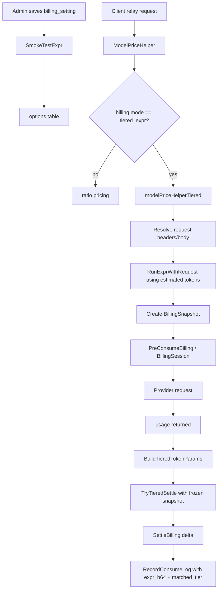

# Tiered Expression 计费引擎学习指南

这份文档专门讲 new-api 的 `tiered_expr` 动态计费系统。它适合在读完 `auth-token-quota-guide-for-go-learners.md` 和 `payment-subscription-guide-for-go-learners.md` 后阅读。

项目约定要求：修改或理解 tiered/dynamic billing 前，必须先读 `pkg/billingexpr/expr.md`。这份源码学习文档就是基于该设计文档和当前 Go 实现整理出来的。

## 一、为什么需要 tiered expression

传统 ratio 计费把价格拆成很多配置：

```text
model ratio
completion ratio
cache ratio
cache creation ratio
image ratio
audio ratio
group ratio
```

这对简单模型够用，但对现代模型会变复杂：

- 长上下文价格可能不同。
- cache read、cache write、1h cache write 价格不同。
- 图片、音频、工具调用可能独立计价。
- 有些价格取决于请求参数或 header。
- 管理员希望按供应商公布的 `$ / 1M tokens` 价格直接配置。

`tiered_expr` 的设计哲学是：

```text
one expression, one truth
```

也就是“一条表达式就是计费真相”。表达式本身完整描述模型如何计费，系统只负责忠实执行、预扣、冻结、结算和记录日志。

## 二、核心文件地图

| 层次 | 文件 | 作用 |
| --- | --- | --- |
| 设计文档 | `pkg/billingexpr/expr.md` | 表达式语言、变量、归一化、版本、数据流 |
| 类型 | `pkg/billingexpr/types.go` | `TokenParams`、`BillingSnapshot`、`TieredResult` |
| 编译缓存 | `pkg/billingexpr/compile.go` | 编译 expr-lang 表达式、缓存 program、提取 used vars |
| 执行 | `pkg/billingexpr/run.go` | 构造运行时 env，执行表达式，提供 `tier/header/param` 等函数 |
| 结算 | `pkg/billingexpr/settle.go` | 从冻结 snapshot 重跑表达式，转换 quota |
| 舍入 | `pkg/billingexpr/round.go` | 统一 `QuotaRound` |
| 配置 | `setting/billing_setting/tiered_billing.go` | 保存 billing mode 和 billing expr，做 smoke test |
| 预扣 | `relay/helper/price.go` | `modelPriceHelperTiered` |
| 请求输入 | `relay/helper/billing_expr_request.go` | 构建 header/body 输入给 `param()`、`header()` |
| 真实结算 | `service/tiered_settle.go` | usage 归一化、`TryTieredSettle` |
| 文本扣费 | `service/text_quota.go` | tiered 结算接入文本 usage |
| 音频/realtime 扣费 | `service/quota.go` | tiered 接入音频和 realtime |
| 日志 | `service/log_info_generate.go` | 注入表达式、tier 到 consume log |

## 三、表达式语言

底层使用 `expr-lang/expr`。表达式示例：

```text
tier("base", p * 2.5 + c * 15 + cr * 0.25)
```

这里的系数是供应商常见的 `$ / 1M tokens` 真实价格：

- `p * 2.5`：prompt token 每百万 2.5 美元。
- `c * 15`：completion token 每百万 15 美元。
- `cr * 0.25`：cache read token 每百万 0.25 美元。

系统最后把表达式输出转换为内部 quota：

```text
quota = exprOutput / 1_000_000 * QuotaPerUnit * groupRatio
```

常用变量：

| 变量 | 含义 |
| --- | --- |
| `p` | 输入 token，自动排除表达式单独计价的子类别 |
| `c` | 输出 token，自动排除表达式单独计价的子类别 |
| `len` | 完整输入上下文长度，只用于 tier 条件，不被 cache/image/audio 排除 |
| `cr` | cache read token |
| `cc` | cache creation token |
| `cc1h` | Claude 1h cache creation token |
| `img` | 图片输入 token |
| `img_o` | 图片输出 token |
| `ai` | 音频输入 token |
| `ao` | 音频输出 token |

常用函数：

| 函数 | 作用 |
| --- | --- |
| `tier(name, value)` | 返回 value，同时记录命中的 tier 名称 |
| `param(path)` | 从请求 JSON body 中读取字段 |
| `header(key)` | 从请求 header 中读取字段 |
| `has(source, substr)` | 字符串包含判断 |
| `hour(tz)`、`weekday(tz)` 等 | 时间条件 |
| `max/min/abs/ceil/floor` | 数学函数 |

长上下文示例：

```text
len <= 200000
  ? tier("standard", p * 3 + c * 15 + cr * 0.3 + cc * 3.75 + cc1h * 6)
  : tier("long_context", p * 6 + c * 22.5 + cr * 0.6 + cc * 7.5 + cc1h * 12)
```

这里条件用 `len`，不是 `p`。原因是 `p` 可能因为 cache read 被扣减，导致 300K 上下文在 cache 命中后看起来只有 50K，从而误判 tier。

## 四、配置如何进入运行时

配置结构在 `setting/billing_setting/tiered_billing.go`：

```go
type BillingSetting struct {
    BillingMode map[string]string `json:"billing_mode"`
    BillingExpr map[string]string `json:"billing_expr"`
}
```

两个 DB option map：

```text
billing_setting.billing_mode
  { "gpt-x": "tiered_expr" }

billing_setting.billing_expr
  { "gpt-x": "tier(\"base\", p * 2.5 + c * 15)" }
```

读取时：

```text
billing_setting.GetBillingMode(model)
  -> 未配置默认 ratio

billing_setting.GetBillingExpr(model)
  -> 返回表达式字符串
```

保存前会调用 `SmokeTestExpr()`：

```text
编译表达式
  -> 用多组 token vector 执行
  -> 用空请求和带 header/body 的样例请求执行
  -> 确保结果非负
```

这不是完整证明表达式业务正确，但能挡住语法错误、运行时类型错误和明显负价格。

## 五、编译缓存和 used vars

`pkg/billingexpr/compile.go` 做三件事：

1. 解析版本前缀：

```text
v1:tier(...)
无前缀 -> v1
```

2. 调用 `expr.Compile` 编译：

```go
expr.Compile(body, expr.Env(getCompileEnv(version)), expr.AsFloat64())
```

3. 遍历 AST 提取表达式实际使用的变量：

```go
ast.Find(node, func(n ast.Node) bool {
    if id, ok := n.(*ast.IdentifierNode); ok {
        vars[id.Value] = true
    }
    return false
})
```

缓存 key 是表达式字符串的 SHA-256：

```text
ExprHashString(expr)
  -> compile cache map[hash]*cachedEntry
```

缓存最多 256 条，超过后整体清空。配置更新时调用 `billingexpr.InvalidateCache()`。

Go 学习点：这里是典型的读多写少缓存，用 `sync.RWMutex` 保护 map；同时把 `usedVars` 跟 compiled program 一起缓存，避免每次结算都重新走 AST。

## 六、执行环境如何构造

`pkg/billingexpr/run.go` 的 `runProgram()` 构造 `env`：

```text
p/c/len/cr/cc/cc1h/img/img_o/ai/ao
tier()
header()
param()
has()
hour/minute/weekday/month/day
max/min/abs/ceil/floor
```

`tier(name, value)` 有一个副作用：把命中的 tier 名称写到 `TraceResult`：

```go
trace := TraceResult{}
"tier": func(name string, value float64) float64 {
    trace.MatchedTier = name
    trace.Cost = value
    return value
}
```

`param(path)` 使用 `gjson.GetBytes(request.Body, path)` 读取请求体字段；`header(key)` 读取归一化后的 header map。

所以表达式可以写成：

```text
param("service_tier") == "priority"
  ? tier("priority", p * 6 + c * 30)
  : tier("base", p * 3 + c * 15)
```

这就是请求感知计费。

## 七、预扣费流程

普通 relay 请求在 `controller.Relay()` 中会先调用：

```text
helper.ModelPriceHelper(c, relayInfo, estimatedPromptTokens, meta)
```

如果模型配置了 `tiered_expr`：

```text
ModelPriceHelper
  -> billing_setting.GetBillingMode(pricingModel) == tiered_expr
  -> modelPriceHelperTiered
```

`modelPriceHelperTiered()` 做这些事：

```text
1. GetBillingExpr(pricingModel)
2. 用 ResolveIncomingBillingExprRequestInput 读取请求 header/body
3. 用估算 prompt tokens 和 max tokens 构造 TokenParams
4. RunExprWithRequest
5. rawCost / 1_000_000 * QuotaPerUnit
6. 乘 group ratio 并 QuotaRound
7. 创建 BillingSnapshot
8. 写入 relayInfo.TieredBillingSnapshot
9. 写入 relayInfo.BillingRequestInput
10. 返回 PriceData{QuotaToPreConsume}
```

预扣只用估算值：

- `P`：请求 prompt token 估算。
- `C`：`meta.MaxTokens`，也就是最多可能输出的 token。
- `Len`：预扣阶段等于 prompt 估算。

后续 `service.PreConsumeBilling()` 会创建 `BillingSession`，从钱包或订阅里预扣 `QuotaToPreConsume`。

## 八、BillingSnapshot 为什么必须存在

`BillingSnapshot` 在 `pkg/billingexpr/types.go`：

```go
type BillingSnapshot struct {
    BillingMode string
    ModelName string
    ExprString string
    ExprHash string
    GroupRatio float64
    EstimatedPromptTokens int
    EstimatedCompletionTokens int
    EstimatedQuotaBeforeGroup float64
    EstimatedQuotaAfterGroup int
    EstimatedTier string
    QuotaPerUnit float64
    ExprVersion int
}
```

它解决一个很实际的问题：请求开始后，管理员可能修改模型表达式或分组倍率。如果结算时直接读最新配置，就会出现“预扣按旧规则，结算按新规则”的不一致。

因此预扣时冻结：

- 表达式字符串。
- 表达式 hash。
- group ratio。
- quota per unit。
- 表达式版本。
- 估算 token 和估算 tier。

结算时只用这个 snapshot，不再重新读取配置。这样同一个请求从预扣到结算使用同一套计费合同。

## 九、真实 usage 结算流程

文本响应完成后，`service.PostTextConsumeQuota()` 会拿到上游真实 `dto.Usage`。

核心流程：

```text
PostTextConsumeQuota
  -> calculateTextQuotaSummary
  -> 如果 relayInfo.TieredBillingSnapshot != nil
       usedVars = billingexpr.UsedVars(snapshot.ExprString)
       params = BuildTieredTokenParams(usage, isClaudeSemantic, usedVars)
       TryTieredSettle(relayInfo, params)
       summary.Quota = composeTieredTextQuota(...)
  -> UpdateUserUsedQuotaAndRequestCount
  -> UpdateChannelUsedQuota
  -> SettleBilling(ctx, relayInfo, summary.Quota)
  -> RecordConsumeLog
```

`TryTieredSettle()`：

```text
如果没有 snapshot 或 billing mode 不是 tiered_expr
  -> ok=false，回到 ratio 计费

否则
  -> ComputeTieredQuotaWithRequest(snapshot, params, frozenRequestInput)
  -> 返回实际 quota 和 matched tier

如果表达式执行失败
  -> 使用 FinalPreConsumedQuota
  -> 如果没有，则使用 snapshot.EstimatedQuotaAfterGroup
```

失败兜底很重要：结算阶段不能因为表达式运行错误导致无法扣费或流程崩掉。

## 十、TokenParams 归一化

最容易读错的是 `service.BuildTieredTokenParams()`。

不同上游返回 usage 的语义不同：

```text
OpenAI/GPT 格式
  prompt_tokens 通常包含 text + cache + image + audio

Claude/Anthropic 语义
  input_tokens 通常更接近文本 token
  cache read / cache creation 单独返回
```

表达式里的 `p` 和 `c` 是兜底变量。规则是：

```text
如果表达式单独使用某个子类别变量
  -> 从 p 或 c 中扣掉对应 token

如果表达式没有使用该变量
  -> 子类别 token 仍留在 p 或 c 中按基础价格计费
```

例子：

```text
usage.prompt_tokens = 1000
cache read = 200
image input = 100
```

表达式 `p * 3 + c * 15`：

```text
p = 1000
cache 和 image 都按 p 的价格计
```

表达式 `p * 3 + cr * 0.3 + c * 15`：

```text
p = 800
cr = 200
image 仍留在 p 中
```

表达式 `p * 3 + cr * 0.3 + img * 2 + c * 15`：

```text
p = 700
cr = 200
img = 100
```

`len` 不参与扣减：

```text
OpenAI 语义: len = prompt_tokens
Claude 语义: len = input_tokens + cache_read + cache_creation_5m + cache_creation_1h
```

这就是为什么 AST 提取 `usedVars` 是核心设计，而不是小优化。

## 十一、与普通 ratio 计费的差异

普通 ratio 路径：

```text
配置多个 ratio
  -> 代码按固定公式组合
  -> cache/image/audio 等逻辑散在 service/text_quota.go
```

tiered expression 路径：

```text
配置一条表达式
  -> 表达式直接使用 p/c/cr/cc/img/ai 等变量
  -> 系统只负责变量归一化和 quota 转换
```

普通 ratio 的优点：

- 配置简单。
- 对旧模型兼容好。
- 管理后台容易理解。

tiered expression 的优点：

- 可以直接表达长上下文阶梯价。
- 可以精确表达 cache、image、audio、请求参数价格。
- 价格配置更接近供应商原始定价。
- 预扣和结算通过 snapshot 保持一致。

## 十二、工具调用附加费

`service/text_quota.go` 里还有工具调用附加费：

- web search。
- Claude web search。
- file search。
- image generation call。
- audio input 独立价格。

这些费用通过 `calculateTextToolCallSurcharge()` 计算。即使主计费走 tiered expression，工具附加费仍会在 `composeTieredTextQuota()` 里叠加：

```text
tiered actual quota before group
  -> 乘 snapshot group ratio
  -> 加 tool surcharge quota
  -> round
```

这说明 tiered expression 当前覆盖 token 主体价格，但某些“按调用次数”或特殊工具价格仍在 service 层统一追加。

## 十三、音频和 realtime 的接入

`service/quota.go` 里也接入了 tiered：

- `PostWssConsumeQuota()`：realtime usage。
- `PostAudioConsumeQuota()`：audio usage。

它们先尝试：

```text
TryTieredSettle(...)
```

如果 ok，就用 tiered quota 覆盖原本的 audio/realtime quota。日志里如果拿到 `TieredResult`，也会调用 `InjectTieredBillingInfo()`。

## 十四、日志如何记录

`service.InjectTieredBillingInfo()` 会往 consume log 的 `other` 里写：

```text
billing_mode = "tiered_expr"
expr_b64 = base64(expression)
matched_tier = result.MatchedTier
```

表达式用 base64 存是为了避免 JSON 字符串里大量括号、引号、换行带来的展示和转义问题。

日志显示层可以通过 `billing_mode` 判断这条记录是否用 tiered expression，并解码 `expr_b64` 展示当时冻结的表达式。

## 十五、测试应该怎么读

重点测试：

- `pkg/billingexpr/billingexpr_test.go`
- `service/tiered_settle_test.go`
- `service/text_quota_test.go`
- `relay/helper/price_test.go`

建议按这个顺序读：

1. 先读 `pkg/billingexpr/billingexpr_test.go`，理解语言变量和函数。
2. 再读 `service/tiered_settle_test.go`，理解 snapshot、tier crossing、group ratio、错误兜底。
3. 再读 token normalization 测试，看 GPT/Claude/cache/image/audio 的差异。
4. 最后读 `relay/helper/price_test.go`，看预扣阶段如何从请求参数影响 tier。

测试里最重要的不变量：

- ratio 和等价 tiered 表达式应该算出相同 quota。
- `len` 在 cache 场景不能被错误扣减。
- 结算必须使用 frozen request input。
- 表达式执行失败时，必须兜底到预扣额度。
- `QuotaRound` 必须统一，避免预扣和结算相差 1。

## 十六、一次完整 tiered 请求



## 十七、Go 学习重点

### 1. 小包边界清晰

`pkg/billingexpr` 不依赖 Gin、GORM、业务 model。它只知道表达式、token 参数、request input 和 quota 转换。这种小包很适合单元测试。

### 2. 用 struct 冻结跨阶段状态

`BillingSnapshot` 是跨“预扣”和“结算”的状态边界。它不保存 compiled program 指针，只保存可序列化数据，便于日志、测试和未来扩展。

### 3. AST introspection 不是炫技

`UsedVars()` 直接影响计费正确性。它让表达式作者只要写变量，系统就知道哪些 token 要从 `p/c` 中排除。

### 4. 请求体复读

预扣阶段的 `param()` 需要读请求 JSON body，但后续 relay 还要读同一个 body。这里依赖 `common.GetBodyStorage()`，这是公共基础设施文档里的 BodyStorage 机制。

### 5. 错误兜底是计费系统必需品

结算阶段不能轻易失败。`TryTieredSettle()` 在表达式执行失败时回退到预扣额度，避免请求成功但计费流程中断。

### 6. decimal 和统一 round

普通 quota 计算大量使用 `shopspring/decimal`，tiered 路径用统一 `billingexpr.QuotaRound()`。读计费代码时要特别注意舍入位置，否则会出现少扣或多扣 1 quota 的边界 bug。

## 十八、自测问题

1. 为什么表达式系数是 `$ / 1M tokens`，而不是项目内部 ratio？
2. `p` 和 `len` 的区别是什么？
3. 为什么表达式用了 `cr` 后，要从 `p` 中扣掉 cache read tokens？
4. Claude usage 和 OpenAI usage 在 token normalization 上有什么差异？
5. `BillingSnapshot` 冻结了哪些字段？不冻结会有什么问题？
6. `param()` 为什么需要保存 request body？
7. `TryTieredSettle()` 为什么不能在表达式执行失败时直接返回错误？
8. 工具调用附加费为什么不完全放进 tiered expression？
9. `expr_b64` 存在 consume log 的意义是什么？
10. 如果管理员更新表达式，已经在途的请求会按新表达式还是旧表达式结算？

能回答这些问题，就说明你已经理解 new-api tiered expression 计费的主体实现。
