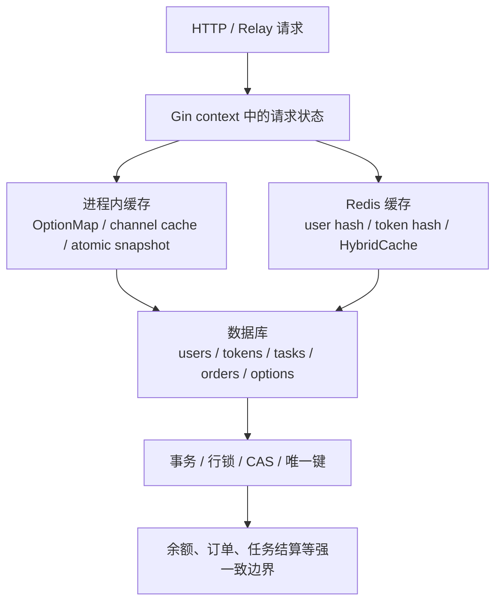
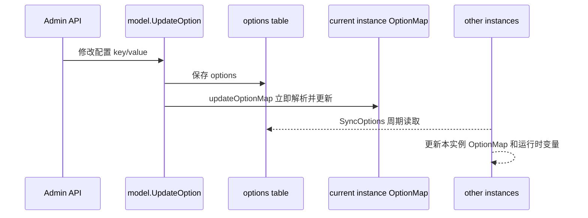
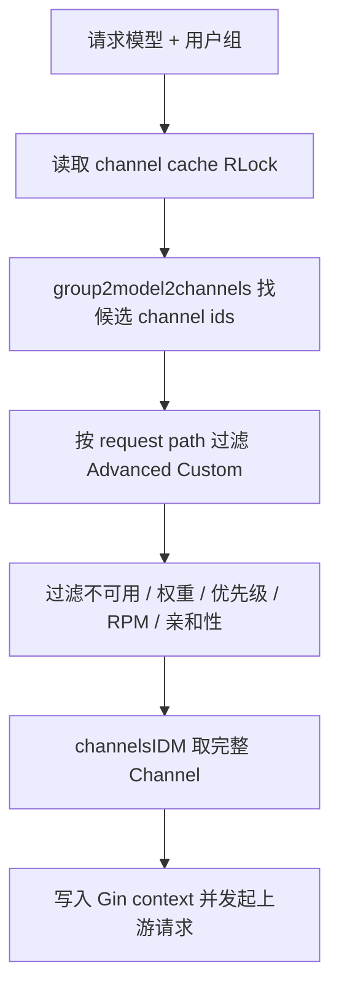
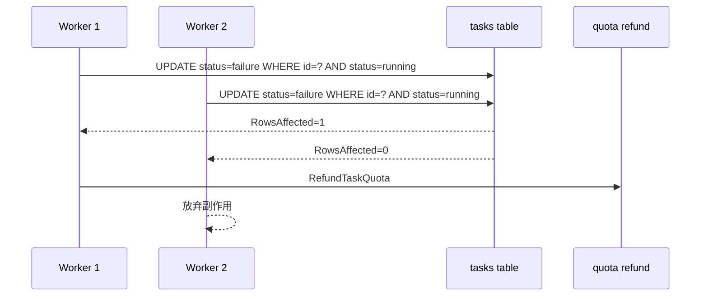
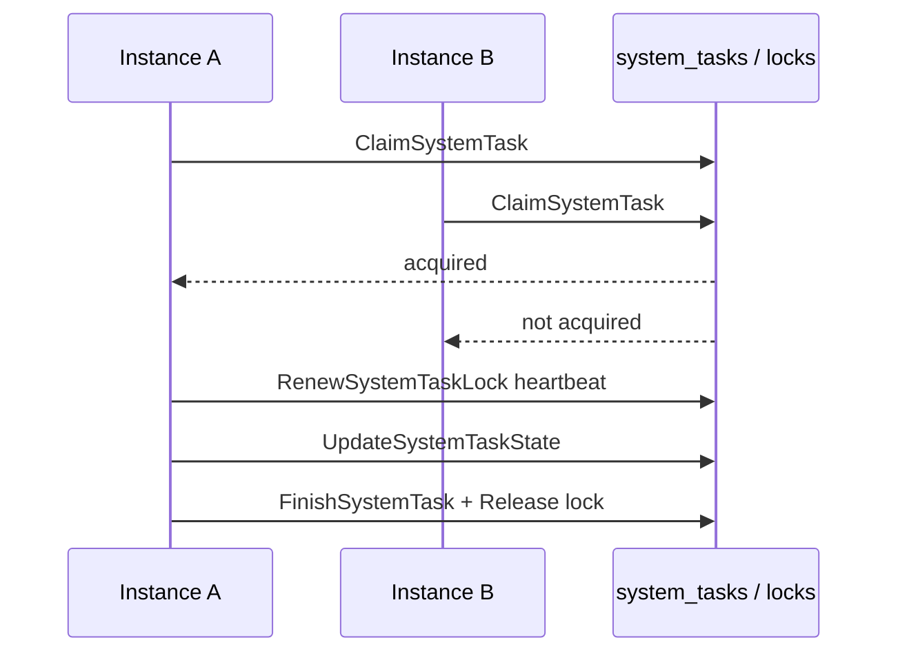
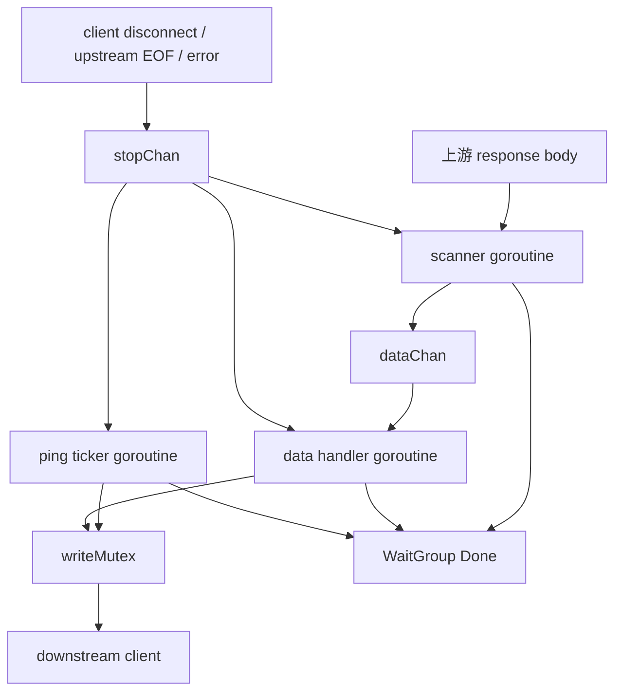

# 缓存、并发控制与一致性学习指南

这篇文档专门讲 new-api 里“数据什么时候是准的、并发时谁能改成功、缓存什么时候会旧、多个 goroutine 怎样退出”。

如果你已经会 Go 的基本语法，但还没有系统读过带缓存、Redis、数据库事务、后台任务和流式转发的项目，这一篇适合反复读。它不会只列函数，而是把源码背后的设计模型讲清楚：哪些地方追求强一致，哪些地方接受最终一致，哪些地方只做性能优化，哪些地方是请求生命周期内的临时状态。

## 1. 先建立全局心智模型

new-api 的一致性策略可以概括成一句话：

> 数据库是最终事实；Redis 和内存缓存主要提升读写性能；涉及余额、订单、任务结算的地方，用事务、行锁、唯一键或 CAS 保护。

这句话很重要。读源码时不要看到缓存就以为缓存是最终答案，也不要看到 goroutine 就以为并发一定跨实例安全。项目里有几类不同的“共享状态”：

| 类型 | 代表代码 | 作用 | 一致性级别 |
| --- | --- | --- | --- |
| 数据库事实 | `model/user.go`、`model/token.go`、`model/task.go`、`model/system_task.go` | 用户余额、令牌、任务状态、订单、系统任务 | 最终事实，关键路径强一致 |
| 进程内配置缓存 | `common.OptionMap`、`model/channel_cache.go` | 避免每次请求查 DB | 单进程实时，多进程定期同步 |
| Redis Hash 缓存 | `model/user_cache.go`、`model/token_cache.go`、`common/redis.go` | 用户和令牌快速读取、额度增减 | TTL 内近似事实，DB 仍是最终事实 |
| HybridCache | `pkg/cachex`、`service/channel_affinity.go` | Redis 开启时跨实例缓存，未开启时本地热点缓存 | 依赖 Redis 或本机内存，按 TTL 过期 |
| 请求临时缓存 | `common/body_storage.go`、`common/disk_cache.go` | 复读请求体、大文件临时存放 | 只在请求/资源生命周期内有效 |
| 原子快照 | `atomic.Value` 相关文件 | 系统状态、性能配置、暴露倍率缓存 | 整体替换快照，读无锁 |
| CAS 状态迁移 | `Task.UpdateWithStatus` | 防止多个 worker 重复结算 | 由 DB `WHERE status = ?` 决定唯一赢家 |
| DB lease | `SystemTaskLock` | 多实例后台任务抢占和心跳续租 | DB 保证跨实例互斥 |

读源码时可以先问 5 个问题：

1. 这个数据的最终事实在哪里？
2. 这个缓存失效后能不能自动从最终事实恢复？
3. 多实例部署时，这个锁是进程内锁，还是数据库/Redis 级别的锁？
4. 如果两个请求同时修改，代码是靠事务、CAS、唯一键，还是只靠最后写入覆盖？
5. 如果进程崩溃，未 flush 的状态会丢，还是能从数据库恢复？

## 2. 一致性分层图



这个图的读法：

- Gin context 里的数据只属于当前请求。
- 进程内缓存只属于当前实例。
- Redis 缓存可以跨实例，但仍然不是所有业务状态的最终事实。
- 数据库是最终事实。
- 对钱、额度、任务状态、订单状态这种关键状态，代码会尽量把“唯一成功者”的判断放进数据库。

## 3. 源码入口速查

| 主题 | 入口文件 | 重点函数或对象 |
| --- | --- | --- |
| Option 配置缓存 | `model/option.go`、`common/constants.go` | `InitOptionMap`、`SyncOptions`、`UpdateOption`、`updateOptionMap`、`OptionMapRWMutex` |
| 渠道能力缓存 | `model/channel_cache.go` | `InitChannelCache`、`SyncChannelCache`、`CacheGetRandomSatisfiedChannel`、`channelsIDM`、`group2model2channels` |
| Redis 初始化 | `common/redis.go` | `InitRedisClient`、`RedisKeyCacheSeconds`、`RedisHSetObj`、`RedisHGetObj`、`RedisHIncrBy`、`RedisHSetField` |
| 用户缓存 | `model/user_cache.go`、`model/user.go` | `CacheGetUser`、`updateUserCache`、`UpdateUserCacheQuota`、`IncreaseUserQuota`、`DecreaseUserQuota` |
| Token 缓存 | `model/token_cache.go`、`model/token.go` | `CacheGetTokenByKey`、`UpdateTokenCacheRemainQuota`、`ValidateUserToken` |
| 泛型混合缓存 | `pkg/cachex` | `HybridCache`、`NewHybridCache`、`SetWithTTL`、`DeleteByPrefix`、`DeleteMany` |
| 渠道模型负缓存 | `service/channel_model_unavailable.go` | `MarkModelUnavailableForChannel`、`ClearModelUnavailableForChannel`、`IsModelUnavailableForChannel` |
| 渠道亲和性 | `service/channel_affinity.go` | `GetPreferredChannelByAffinity`、`RecordChannelAffinity`、`HandleChannelAffinityFailure` |
| 批量写回 | `model/utils.go` | `InitBatchUpdater`、`addNewRecord`、`batchUpdate` |
| 异步任务 CAS | `model/task.go`、`service/task_polling.go` | `Task.UpdateWithStatus`、`TaskBulkUpdateByID`、`RefundTaskQuota`、`RecalculateTaskQuota` |
| 系统任务 lease | `model/system_task.go`、`service/system_task.go` | `ClaimSystemTask`、`RenewSystemTaskLock`、`FinishSystemTask`、`runWithLeaseHeartbeat` |
| SSE 流式并发 | `relay/helper/stream_scanner.go` | `StreamScannerHandler`、`writeMutex`、`stopChan`、`WaitGroup` |
| 上游请求等待 ping | `relay/channel/api_request.go` | `startPingKeepAlive`、`DoRequest` 附近等待响应头逻辑 |
| Realtime WebSocket | `relay/channel/openai/relay_realtime.go` | 双向转发 goroutine、`localUsage`、`preConsumeUsage` |
| 原子快照 | `common/system_monitor.go`、`common/performance_config.go`、`setting/ratio_setting/exposed_cache.go` | `atomic.Value`、`Store`、`Load` |

## 4. Go 并发工具在项目里的角色

先把 Go 语言点和项目代码对上：

| Go 工具 | 项目用法 | 适合场景 |
| --- | --- | --- |
| `sync.Mutex` | 批量更新 map、BodyStorage、stream 写响应 | 写操作互斥，临界区短 |
| `sync.RWMutex` | `OptionMap`、channel cache、`RWMap` | 读多写少，允许多个读者并发 |
| `sync.Map` | 亲和性正则缓存、stream status 等 | key 动态且并发访问频繁 |
| `sync.Once` | HybridCache 单例初始化 | 延迟初始化，全局只执行一次 |
| `sync.WaitGroup` | SSE scanner 请求内多个 goroutine 等待退出 | 同一请求内收尾 |
| `context.Context` | system task、请求取消、stream 退出 | 超时、取消、传递请求域状态 |
| `atomic.Value` | 系统状态和性能配置快照 | 整体替换、读路径无锁 |
| `gorm.Transaction` | 充值、兑换、订阅购买、订阅预扣 | 多条 DB 更新要么全成要么全败 |
| `RowsAffected` | Task CAS、system task claim/finish | 通过数据库判断谁赢 |

一个适合新手的理解方式：

- 进程内锁只能管当前 Go 进程。
- 数据库事务和唯一约束才能管多实例。
- Redis 里的普通 get/set 不天然等于事务，除非显式用 Redis 原子命令或 Lua。
- `atomic.Value` 适合读多写少的整块配置，不适合在快照内部就地改字段。

## 5. OptionMap：配置热更新的第一层缓存

### 5.1 数据结构

配置缓存的核心在 `common.OptionMap` 和 `common.OptionMapRWMutex`。`model/option.go` 在启动时调用 `InitOptionMap`，先把大量默认值写进内存 map，再从数据库 `options` 表读取已保存的配置，覆盖默认值。

这个设计解决两个问题：

- 业务代码读配置时不用每次查数据库。
- 没有 DB 配置时仍然有默认值。

### 5.2 写入流程

后台管理接口修改配置时，一般会走：

```text
controller
  -> model.UpdateOption / model.UpdateOptionsBulk
     -> 写 options 表
     -> updateOptionMap
        -> 加 OptionMapRWMutex 写锁
        -> 更新 common.OptionMap
        -> 同步解析到 setting/common 包中的运行时变量
```

`updateOptionMap` 不只是改字符串 map。它还会根据 key 把字符串解析成布尔、整数、浮点、JSON 配置等，更新到对应的全局变量或 setting 模块。

### 5.3 读路径

读路径通常是：

- 直接读已解析的全局变量，比如 `common.RetryTimes`、`setting.ModelRequestRateLimitEnabled`。
- 或者在需要保留原始配置时读 `OptionMap`。

因为 map 不是并发安全的，所以直接访问 `OptionMap` 时需要使用锁。项目里很多配置已经被解析成普通变量，业务路径更多读这些变量。

### 5.4 多实例一致性

`SyncOptions(frequency)` 会周期性从数据库加载配置并更新当前进程。也就是说：

- 当前实例调用 `UpdateOption` 后，本实例立即生效。
- 其他实例不会通过 pub/sub 立即感知。
- 其他实例等下一次 `SyncOptions` 才会同步。

这就是典型的最终一致配置缓存。

读源码时要注意：如果一个配置影响请求路由或计费，新旧实例在同步间隔内可能短暂表现不同。项目通过周期刷新接受这个窗口，而不是追求配置强一致。

## 6. channel cache：渠道选择的本地快照

### 6.1 为什么需要渠道缓存

每个 relay 请求都要回答几个问题：

- 当前用户组能用哪些渠道？
- 请求模型在哪些渠道可用？
- 渠道是否启用？
- 高级自定义渠道是否支持当前 path？
- 选出来的 channel id 对应完整配置是什么？

如果每个请求都查数据库并解析渠道配置，成本很高。`model/channel_cache.go` 维护了几个进程内 map：

- `group2model2channels`：组和模型到 channel id 列表的索引。
- `channelsIDM`：channel id 到完整 `Channel` 的索引。
- `channel2advancedCustomConfig`：Advanced Custom 渠道解析后的配置缓存。
- `channelSyncLock`：保护这些 map 的 `sync.RWMutex`。

### 6.2 刷新方式

`InitChannelCache` 的思路是：

1. 从数据库读取渠道。
2. 构建新的临时 map。
3. 解析高级自定义配置。
4. 加写锁。
5. 用新 map 替换旧 map。
6. 释放写锁。

这种“先构建、后整体替换”的写法很适合读多写少的缓存：

- 构建阶段不长时间阻塞读请求。
- 替换时临界区短。
- 读请求拿 RLock，要么看到旧快照，要么看到新快照，不会看到半成品。

### 6.3 读路径

渠道选择函数会加 RLock，然后从 `group2model2channels[group][model]` 找候选渠道，再根据路径、高级自定义支持情况、权重、优先级等继续筛选。

常见入口包括：

- `CacheGetRandomSatisfiedChannel`
- `CacheGetRandomSatisfiedChannelWithGroup`
- `CacheGetChannel`
- `CacheUpdateChannel`
- `CacheDeleteChannel`

### 6.4 多实例一致性

这套 channel cache 是进程本地缓存。多实例部署时：

- A 实例修改渠道后，A 的缓存可以立即更新。
- B 实例要等周期性 `SyncChannelCache`。
- Redis 不参与这套能力索引。

因此渠道启用/禁用、模型能力、权重等修改在多实例间存在短暂同步窗口。对 relay 来说，这是性能和实时性的取舍。

### 6.5 读源码练习

你可以按这个顺序读：

1. `InitChannelCache`：看它如何把数据库行变成多个 map。
2. `CacheGetRandomSatisfiedChannel`：看读锁如何保护选择过程。
3. `filterChannelsByRequestPath`：看 Advanced Custom 渠道如何按 path 过滤。
4. `CacheUpdateChannel` 和 `CacheDeleteChannel`：看单个渠道修改如何影响缓存。

## 7. Redis：用户和 Token 的近似事实缓存

### 7.1 Redis 何时开启

`common.InitRedisClient` 根据 `REDIS_CONN_STRING` 初始化 Redis。没有配置 Redis 时，很多逻辑会走数据库或内存缓存分支。

`RedisKeyCacheSeconds()` 返回与同步频率相关的 TTL。用户、令牌这类 hash 缓存不是永久事实，它们会过期。

### 7.2 Hash 对象工具

`common/redis.go` 中有几个重要工具：

- `RedisHSetObj`：把结构体字段写入 Redis hash，并设置过期时间。
- `RedisHGetObj`：从 hash 读出并反序列化到结构体。
- `RedisHIncrBy`：对 hash 中的数字字段做增量。
- `RedisHSetField`：更新 hash 的单个字段。

注意一个实现细节：`RedisHIncrBy` 和 `RedisHSetField` 会检查 key 是否存在、是否有 TTL。key 缺失或没有 TTL 时，它们会选择不更新，避免制造无过期时间的陈旧缓存。

这意味着 Redis 写缓存是最佳努力：

- Redis 中有对应 hash 时，同步更新字段。
- Redis 中没有 key 时，不会强行创建一个不完整缓存。
- 下次读缓存 miss，再从数据库补。

### 7.3 用户缓存

用户缓存的典型链路：

```text
CacheGetUser(userID)
  -> Redis enabled?
     -> 从 user:{id} hash 读
     -> 命中则返回
  -> DB 查询用户
  -> 异步/同步写回 Redis hash
```

额度更新相关函数会同时考虑数据库和缓存：

- `IncreaseUserQuota`
- `DecreaseUserQuota`
- `DeltaUpdateUserQuota`
- `UpdateUserCacheQuota`

当 `BatchUpdateEnabled` 开启时，一些额度变化不会立即写 DB，而是进入批量更新队列。Redis 中的 quota 字段可能先被增减，用来让后续请求尽快看到近似余额。

这里的关键点：

- DB 仍然是最终事实。
- Redis quota 是快速路径。
- Redis 更新失败一般不会让主请求整体失败。
- 写缓存时要避免用旧用户快照覆盖最新 quota，所以 `updateUserCache` 会谨慎处理 quota 字段。

### 7.4 Token 缓存

Token 缓存类似，但 key 不是明文 token，而是 HMAC/哈希后的 key：

```text
token:{HMAC(key)}
```

`ValidateUserToken` 会尝试从缓存读 token，再检查状态、过期时间、剩余额度等。Redis 命中能减少 API Key 鉴权时的 DB 压力。

需要注意：

- token 过期或耗尽在请求时会被判断。
- Redis 中的 token 状态可能在 TTL 窗口内滞后。
- 关键扣费仍要回到用户/token 额度更新函数。

### 7.5 Redis 缓存的正确理解

不要把 Redis 理解为一个强一致的第二数据库。在这个项目里更准确的说法是：

- Redis 是用户和 token 热点读写的加速层。
- 它能减少数据库压力。
- 它接受 TTL 和同步窗口。
- 一旦 miss 或过期，可以从数据库重建。

## 8. HybridCache：Redis 与本地热点缓存的统一封装

### 8.1 基本设计

`pkg/cachex.HybridCache[V]` 是一个泛型缓存封装。创建时传入：

- `Namespace`
- Redis codec
- memory cache builder
- Redis key 扫描配置

它的核心判断是：

```text
Redis enabled
  -> 使用 Redis
Redis disabled
  -> 使用 hot.HotCache 内存缓存
```

注意：Redis 开启后，如果 Redis 操作返回错误，`HybridCache` 不会自动降级到内存缓存。它的分支是“Redis 是否启用”，不是“Redis 是否健康”。

### 8.2 key 命名

`HybridCache.FullKey` 会把 namespace 和业务 key 拼起来。这样不同业务不会互相污染。

例如渠道亲和性有多个 namespace：

- `new-api:channel_affinity:v2`
- `new-api:channel_affinity_state:v1`
- `new-api:channel_affinity_failure_recorder:v1`
- `new-api:channel_affinity_usage_cache_stats:v1`

### 8.3 常见操作

常见方法：

- `Get`
- `SetWithTTL`
- `Keys`
- `Purge`
- `DeleteByPrefix`
- `DeleteMany`
- `Capacity`
- `Algorithm`

读源码时要特别看 `DeleteMany` 的注释：它既接受完整 namespace key，也接受原始 key，返回时使用完整 namespace key。

## 9. 渠道模型不可用负缓存

`service/channel_model_unavailable.go` 用 `HybridCache[int]` 记录某个 channel-model 组合短期不可用。

核心函数：

- `MarkModelUnavailableForChannel`
- `ClearModelUnavailableForChannel`
- `IsModelUnavailableForChannel`
- `GetUnavailableChannelIDsForModel`
- `InvalidateModelUnavailableForChannel`

默认 TTL 是 5 分钟。

这属于“负缓存”：当某个渠道对某个模型失败时，短时间内不要再选它，减少无意义重试。

它的特点：

- 不是永久禁用渠道。
- 成功后可以清除。
- TTL 到期后自动恢复尝试。
- Redis 开启时跨实例生效，否则只在当前进程生效。

源码阅读时可以留意一个边界：`InvalidateModelUnavailableForChannel` 通过 key 前缀清理某渠道下的条目，而 `HybridCache.Keys` 返回值和 raw prefix 的匹配方式需要和 namespace 行为保持一致。改这类代码时，要确认比较的是完整 key 还是业务 key。

## 10. 渠道亲和性：带 TTL 的路由记忆

### 10.1 业务目标

渠道亲和性是为了解决这类需求：

- 同一个用户、会话或自定义 key，希望一段时间内固定走同一个渠道。
- 如果固定渠道失败次数太多，可以迁移到新渠道。
- 管理员希望看到亲和性命中、迁移和 usage cache 统计。

### 10.2 缓存对象

`service/channel_affinity.go` 中有几类缓存：

- binding cache：记录某个亲和性 key 绑定到哪个 channel。
- state cache：记录失败次数、冷却时间、上次失败渠道等迁移状态。
- failure recorder cache：记录更长 TTL 的失败轨迹。
- usage cache stats cache：记录与 cache token 使用相关的统计。

它们都基于 `HybridCache`。

### 10.3 请求流程

```text
请求进入 relay
  -> GetPreferredChannelByAffinity
     -> 根据 header/body/query/user 等来源提取 affinity value
     -> 拼 cache key
     -> 读 binding cache
     -> 命中则优先使用绑定 channel
     -> 把 meta 写入 gin.Context
  -> 正常渠道选择
  -> MarkChannelAffinityUsed / RecordChannelAffinity
     -> 写入 binding cache
  -> 如果失败
     -> HandleChannelAffinityFailure
     -> 记录失败状态
     -> 达到阈值后迁移绑定
```

### 10.4 锁的边界

`channelAffinityStateLocks [64]sync.Mutex` 是本地分片锁。它可以避免当前进程内同一个 cache key 的状态被多个 goroutine 同时改乱。

但要注意：

- 这是进程内锁。
- Redis 模式下，多个实例仍可能对同一个 key 做 get-modify-set。
- 如果需要严格跨实例原子迁移，需要 Redis Lua、事务或数据库锁。

当前实现更像“足够好的路由记忆”，不是金融级强一致状态机。

### 10.5 正则缓存

`channelAffinityRegexCache sync.Map` 用于缓存编译后的正则。正则编译成本比普通字符串比较高，用 `sync.Map` 适合这种“按 pattern 动态缓存”的场景。

## 11. 暴露倍率缓存和编译缓存

### 11.1 exposed ratio cache

`setting/ratio_setting/exposed_cache.go` 用 `atomic.Value` 存储对外暴露的倍率数据快照，并用 `rebuildMu` 控制重建。

它的关键点：

- 快照整体替换。
- 读路径通过 `Load` 拿到当前快照。
- 返回数据时做 clone，避免调用方改坏缓存内部对象。
- 有 30 秒左右 TTL，避免频繁重建。

这就是 `atomic.Value` 的典型用法：读多写少、整体不可变快照。

### 11.2 billing expression compile cache

`pkg/billingexpr/compile.go` 有表达式编译缓存。它缓存已经编译过的 billing expression，避免每次计费重新解析。

设计特点：

- `sync.RWMutex` 保护 map。
- 最大 256 条。
- 达到上限时整体 reset。
- 没有复杂 LRU，也没有 TTL。

这个缓存追求的是实现简单和性能收益，不负责业务一致性。表达式配置变更后，新的表达式字符串自然会形成不同 cache key。

## 12. 请求体和磁盘临时缓存

### 12.1 BodyStorage 的角色

`common/body_storage.go` 解决“请求体只能读一次”的问题。relay 中很多步骤都可能需要读 body：

- middleware 检查大小或安全策略。
- controller 解析请求。
- adaptor 转换上游请求。
- 重试时再次构造请求。

BodyStorage 会把 body 保存到内存或磁盘，使后续代码可以重新打开 reader。

### 12.2 并发和关闭

BodyStorage 用 mutex 保护状态，用 atomic 标记关闭。它不是业务缓存，而是资源生命周期管理工具。

读源码时要关注：

- body 什么时候从内存转到磁盘。
- `Close` 后再读会怎样。
- 请求结束时如何清理临时文件。

### 12.3 disk cache

`common/disk_cache.go` 更偏临时文件缓存，也不是业务事实。它的正确理解是：

- 用来减少重复下载或重复读取。
- 资源可以被清理。
- 丢失后可以重新获取。

## 13. 批量更新：性能与风险的交换

### 13.1 为什么要批量更新

relay 请求量大时，如果每次消费都同步更新用户额度、token 额度、渠道已用额度、请求次数，数据库写压力会很高。

`model/utils.go` 的 BatchUpdate 机制把增量先放进内存 map，定期 flush 到数据库。

### 13.2 内部结构

项目为不同类型维护不同 map 和锁：

- user quota delta
- token quota delta
- used quota delta
- channel used quota delta
- request count delta

`addNewRecord` 把增量放进对应 map。`batchUpdate` 周期性：

1. 加锁。
2. 把当前 map 交换出来。
3. 原 map 清空，接收新请求。
4. 对交换出来的数据做 DB 算术更新。

### 13.3 DB 更新为什么仍然能跨实例安全

flush 时数据库更新通常用类似：

```text
quota = quota + delta
used_quota = used_quota + delta
request_count = request_count + 1
```

这种算术更新由数据库执行，多个实例同时 flush 时不会像“先读出来再写回”那样互相覆盖。

### 13.4 风险

BatchUpdate 的代价也很明确：

- 进程崩溃会丢失尚未 flush 的内存增量。
- flush 失败通常只记录日志，没有持久化重试队列。
- Redis 里的近似额度可能先变化，DB 稍后追上。

因此它适合高吞吐的统计/额度增量优化，但读源码时要知道它不是严格持久队列。

## 14. 数据库事务和行锁：订单与额度的强一致边界

### 14.1 什么时候必须用事务

以下业务必须强一致：

- 充值订单完成后给用户加余额。
- 支付 webhook 重复到达时不能重复加钱。
- 兑换码只能使用一次。
- 订阅购买不能重复扣款或重复发放。
- 订阅预扣请求要幂等。

这些地方通常会用 `DB.Transaction`，并在事务里：

- 查询订单或用户。
- 检查状态。
- 加行锁或利用唯一键。
- 使用 `gorm.Expr` 做额度增量。
- 更新状态。
- 写日志。

### 14.2 行锁的意义

对订单来说，核心不是“先查到订单”，而是“当前事务独占这条订单的状态迁移”。常见模式是：

```text
transaction
  -> SELECT order FOR UPDATE
  -> if status already completed: return
  -> update user quota = quota + amount
  -> update order status = completed
commit
```

这样即使两个 webhook 同时到达，也只有一个事务能先完成状态迁移。

### 14.3 进程锁不能替代数据库锁

项目里有些地方有进程内锁，比如订单处理中的局部锁、亲和性状态分片锁等。它们能减少当前实例内的并发冲突，但多实例部署时只有数据库行锁、唯一键、CAS 或 Redis 原子操作才是跨实例边界。

## 15. 异步 Task：用 CAS 防止重复结算

### 15.1 Task 的状态问题

异步媒体任务会经历：

```text
submitted / queued / running -> success / failure
```

后台轮询、超时扫描、用户查询等多个路径都可能看到同一条任务。真正危险的是：两个 worker 都认为任务失败或成功，然后重复退款或重复结算。

### 15.2 UpdateWithStatus

`model.Task.UpdateWithStatus(fromStatus)` 是关键函数。它用条件更新：

```text
UPDATE tasks
SET ...
WHERE id = ? AND status = fromStatus
```

然后检查 `RowsAffected`：

- `RowsAffected > 0`：当前 goroutine 赢了，可以继续做结算或退款。
- `RowsAffected == 0`：别人已经改过状态，当前 goroutine 放弃副作用。

源码注释还特别说明没有用 GORM `Save()`，因为 `Save()` 在某些情况下可能 fallback/upsert，不适合 CAS。

### 15.3 service/task_polling.go 的典型模式

轮询任务时常见模式：

1. 读取任务当前状态，形成 snapshot。
2. 调 provider 查询结果。
3. 根据结果准备新状态、失败原因、usage、quota。
4. 调 `UpdateWithStatus(snapshot.Status)`。
5. 只有 CAS 成功者执行退款或差额结算。

这个设计把“谁能推进状态”的判断交给数据库。

### 15.4 哪些函数不带 CAS

`TaskBulkUpdateByID` 是批量无条件更新。源码注释明确提醒：涉及 billing 生命周期的状态迁移应该用 `Task.UpdateWithStatus`。

这类函数适合批量标记、清理、维护性更新，不适合“成功后要退款/结算”的终态迁移。

### 15.5 退款函数的边界

`RefundTaskQuota` 本身不是强幂等函数。它安全的前提是调用方已经通过 CAS 确定自己是唯一赢家。

所以读异步任务代码时不要只看退款函数，要看它前面是否有：

- `UpdateWithStatus`
- 事务状态检查
- 唯一请求记录
- 其他幂等边界

## 16. SystemTask：跨实例后台任务 lease

### 16.1 为什么不用简单 goroutine

系统任务包括：

- 日志清理
- 渠道测试
- 模型更新
- Midjourney 轮询
- 异步任务轮询

如果部署多个实例，每个实例都启动 goroutine，会造成重复执行。`SystemTask` 用数据库表实现跨实例任务调度。

### 16.2 两张表的职责

`SystemTask` 记录任务本身：

- task id
- type
- status
- payload
- state
- result
- locked_by
- active_key

`SystemTaskLock` 记录某类任务的 lease：

- type
- task id
- locked_by
- locked_until

其中 `SystemTask.ActiveKey` 对 active 状态有唯一约束思路，`SystemTaskLock.Type` 保证同一类任务只有一个持有者。

### 16.3 claim 流程

`ClaimSystemTask` 大致做：

1. 确认任务仍是 pending。
2. 尝试插入或抢占过期 `SystemTaskLock`。
3. 如果发现旧任务 lease 过期，先标记旧任务失败。
4. 把当前任务从 pending 更新为 running，并写入 locked_by。
5. 如果中途失败，释放锁。

这个流程不完全是一个单事务的完美锁协议，但通过 TTL 和过期恢复保证崩溃后能继续推进。

### 16.4 心跳续租

`service/system_task.go` 的 `runWithLeaseHeartbeat` 会：

- 创建可取消 context。
- 后台 ticker 定期调用 `RenewSystemTaskLock`。
- 如果续租失败，取消 context。
- handler 必须 honor context cancellation。

这就是 Go 后台任务常见模式：任务执行和心跳续租分开，但用 context 把“锁丢了”通知给执行逻辑。

### 16.5 state 和 finish 的保护

`UpdateSystemTaskState` 和 `FinishSystemTask` 不只是按 task id 更新。它们还检查：

- task 状态必须是 running。
- locked_by 必须匹配当前 runner。
- `system_task_locks` 中仍有未过期锁。

如果检查失败，返回 `ErrSystemTaskLockLost`。

这能防止一个已经失去 lease 的旧 runner 继续写进度或完成状态。

## 17. SSE StreamScannerHandler：请求内并发协作

### 17.1 为什么 stream 需要多个 goroutine

流式响应里，new-api 同时做几件事：

- 从上游 response body 扫描 SSE。
- 解析 chunk，累积 usage、错误、结束原因。
- 向下游客户端写数据。
- 定期发送 ping/keepalive，避免连接长时间无输出。
- 监听客户端断开、上游结束、错误和超时。

这些动作天然并发，所以 `relay/helper/stream_scanner.go` 的 `StreamScannerHandler` 使用多个 goroutine。

### 17.2 主要对象

| 对象 | 作用 |
| --- | --- |
| `dataChan` | scanner goroutine 把上游数据交给 data handler |
| `stopChan` | 任一 goroutine 触发停止信号 |
| `writeMutex` | 保护 `gin.ResponseWriter`，避免多个 goroutine 同时写 |
| `WaitGroup` | 等待请求内 goroutine 退出 |
| `context` | 传递停止信号和请求域信息 |
| `StreamResult` | 记录 usage、错误、结束原因等流式结果 |

### 17.3 写响应必须加锁

HTTP response writer 通常不能被多个 goroutine 同时写。stream scanner 里 data handler 和 ping goroutine 都可能写下游，所以用 `writeMutex`。

读代码时看到：

```text
writeMutex.Lock()
write / flush
writeMutex.Unlock()
```

就要意识到这是保护下游写入顺序和线程安全。

### 17.4 stopChan 的语义

`stopChan` 是广播式停止信号。上游 EOF、scanner 错误、客户端断开、data handler 失败、ping 失败，都可以触发停止。

项目使用 `common.SafeSendBool` 来避免向已关闭 channel 发送造成 panic。

### 17.5 一个值得注意的 I/O 边界

stream ping 写入时，为了避免写操作长时间卡住，会把写操作包一层 goroutine 并用 timeout 等待。

这能让外层逻辑不一直卡住，但如果底层 write 本身真的阻塞，内层 goroutine 仍可能留在阻塞状态，并且可能持有写锁。读这类代码时要区分：

- timeout 控制的是等待者。
- timeout 不一定能取消已经进入底层 I/O 的 goroutine。

这是 Go 网络 I/O 中常见的微妙点。

## 18. 上游请求等待阶段的 ping

`relay/channel/api_request.go` 里有 `startPingKeepAlive`。它解决的是另一个阶段的问题：已经收到客户端 stream 请求，但请求上游 `client.Do(req)` 等响应头可能很慢。

如果这段时间完全不向客户端写任何东西，某些代理或客户端可能认为连接死了。于是代码在等待上游响应头期间定期发送 ping。

它和 `StreamScannerHandler` 中的 ping 类似，也要面对同样的 I/O timeout 边界：外层等待可以超时，但底层阻塞写未必被真正取消。

## 19. Realtime WebSocket：双向桥接与 usage

### 19.1 基本结构

`relay/channel/openai/relay_realtime.go` 是 WebSocket 双向转发：

- 一个 goroutine 从客户端读，写到上游。
- 另一个 goroutine 从上游读，写到客户端。
- 中间统计 realtime usage，并做预扣/结算相关逻辑。

### 19.2 并发读写的关注点

WebSocket bridge 的难点是两个方向都在跑，任何一边断开都要让另一边退出。

读源码时重点看：

- 错误如何传递。
- close 如何触发。
- usage 在哪个 goroutine 修改。
- 结算函数是否可能被多次调用。

### 19.3 localUsage 的并发风险

当前代码里 `localUsage` 会在双向处理过程中被读写。读源码时需要特别敏感：如果同一个对象可能被两个 goroutine 同时写，而没有 mutex、channel 串行化或 atomic，就可能触发数据竞争。

这类问题可以用 Go race detector 验证：

```bash
go test -race ./...
```

项目未必能在当前环境完整跑完 race，但这是学习并发代码时非常有价值的工具。

## 20. Uptime Kuma 与 errgroup：有界并发请求

`controller/uptime_kuma.go` 里使用 `errgroup` 批量请求外部监控数据。

这种模式适合：

- 对多个目标并发请求。
- 等待全部完成。
- 统一处理错误。
- 控制局部变量捕获。

读这类代码要注意 Go 循环变量捕获问题。当前实现会把循环变量复制到局部变量，再启动 goroutine，这是正确写法。

## 21. atomic.Value：系统状态和配置快照

### 21.1 system monitor

`common/system_monitor.go` 用 `latestSystemStatus atomic.Value` 存储系统状态快照。

后台 goroutine 定期采集：

- CPU
- memory
- load
- disk

然后整体 `Store(status)`。请求读取 `/api/status` 时 `Load()` 当前快照。

这种设计避免了每个请求实时采集系统指标，也避免读路径加锁。

### 21.2 performance config

`common/performance_config.go` 也用 `atomic.Value` 存配置快照。系统过载保护读取的是一份完整配置。

使用 `atomic.Value` 的原则：

- Store 的值类型要稳定。
- 存进去后不要在原对象上原地修改。
- 修改时构造新对象，再整体 Store。

## 22. RWMap：项目里的泛型并发 map

`types/rw_map.go` 封装了 map + `sync.RWMutex`。

它常用于读多写少的运行时设置，例如倍率配置。相比直接暴露 map，封装能让调用方通过方法访问，并在返回时做 copy，减少外部修改内部 map 的风险。

Go 学习重点：

- map 本身不是并发安全的。
- RLock 允许多个读者并发。
- 写锁会阻塞读写。
- 返回 map 时如果不 copy，调用者仍可能绕过锁修改底层数据。

## 23. 计费会话 BillingSession 的局部互斥

`service/billing_session.go` 中的 `BillingSession` 用 mutex 保护 settled、refunded、funding 等状态。

它解决的是同一个请求/会话内的重复结算或重复退款问题：

- 先加锁检查状态。
- 修改状态。
- 释放锁。
- 必要时异步做日志或退款副作用。

注意它的边界：这是内存对象锁，不能代替数据库幂等。跨请求、跨实例的幂等仍要靠数据库记录、request id、任务 CAS 或订单状态。

## 24. Gin context 中的请求状态

new-api 大量使用 `gin.Context` 存请求域状态：

- user id
- token id
- channel id
- relay info
- request id
- channel affinity meta
- pre-consumed quota
- stream stop channel

这类数据只属于当前请求。它不是缓存，也不是跨请求状态。

读源码时看到 `c.Set` / `c.Get`，要问：

- 谁先写入这个 key？
- 下游哪个 middleware/controller/service 会读取？
- 这个值是否会跨 goroutine 使用？
- 如果跨 goroutine，是否需要拷贝或加锁？

Gin context 本身不应该被随意在请求结束后继续使用。异步 goroutine 里通常应复制必要字段，而不是长期持有整个 context。

## 25. 预扣费、后结算和一致性

### 25.1 普通 relay 计费

relay 请求常见计费链路：

```text
TokenAuth
  -> 写入 user/token/channel context
PreConsumeQuota
  -> 先扣一笔保守额度
请求上游
  -> 获取 usage 或估算 usage
PostConsumeQuota / ReturnPreConsumedQuota
  -> 按实际消耗补扣或退回
写消费日志
```

这里涉及多种一致性边界：

- 用户余额扣减要避免并发透支。
- token 剩余额度要同步扣减。
- 失败时预扣额度要退回。
- 日志要记录最终 usage。

不同函数会根据 BatchUpdate、Redis、订阅、普通钱包等路径选择具体实现。

### 25.2 订阅预扣

订阅预扣更强调请求级幂等。代码会用 request id 记录预扣记录，防止同一个请求重复处理。

读订阅退款路径时要关注事务边界：如果一个函数在外层事务中锁了预扣记录，但内部又开启新的 `DB.Transaction` 修改订阅额度，那么两段状态之间可能存在不一致风险。学习这类代码时，要画出“哪些更新属于同一个事务，哪些不是”。

## 26. 锁和一致性边界对照表

| 场景 | 使用的保护 | 能否跨实例 | 主要风险 |
| --- | --- | --- | --- |
| OptionMap 更新 | `sync.RWMutex` + DB 周期同步 | 通过 DB 最终一致 | 多实例短暂配置不同 |
| channel cache | `sync.RWMutex` + 周期刷新 | 通过 DB 最终一致 | 多实例短暂渠道视图不同 |
| 用户 Redis quota | Redis hash 增量 + DB 更新 | Redis 开启时可跨实例近似同步 | TTL / miss / Redis 失败 |
| HybridCache 本地模式 | hot memory cache | 否 | 每实例各自缓存 |
| 亲和性 state lock | 本地分片 mutex | 否 | Redis 模式下跨实例 get-modify-set 竞争 |
| BatchUpdate | 本地 map mutex + DB 算术更新 | DB flush 后跨实例正确累加 | crash 丢未 flush 增量 |
| Task 终态迁移 | DB CAS `RowsAffected` | 是 | 调用方必须只让 CAS winner 做副作用 |
| SystemTask | DB lock row + TTL + heartbeat | 是 | handler 必须响应 context |
| SSE response writer | 请求内 mutex | 不涉及 | 底层阻塞 I/O 不一定能被 timeout 杀掉 |
| BillingSession | 对象 mutex | 否 | 不能替代 DB 幂等 |

## 27. 典型流程一：配置修改如何生效



结论：

- 当前实例立即生效。
- 其他实例最终生效。
- 配置同步不是强实时广播。

## 28. 典型流程二：渠道缓存如何参与 relay



结论：

- channel cache 是 relay 性能关键。
- 读路径不查 DB。
- 多实例依赖周期刷新保持最终一致。

## 29. 典型流程三：异步任务如何只退款一次



结论：

- CAS 成功者才做退款。
- `RefundTaskQuota` 自己不是幂等核心。
- `RowsAffected` 是理解这段代码的关键。

## 30. 典型流程四：系统任务如何跨实例只跑一个



如果 A 崩溃：

```text
locked_until 到期
  -> 其他实例 ExpireStaleSystemTaskLocks
  -> 旧任务标记失败或释放锁
  -> 新任务可继续被 claim
```

结论：

- lease 让任务在多实例中互斥。
- TTL 让崩溃后能恢复。
- handler 必须在 context 取消时停止。

## 31. 典型流程五：流式响应如何协作退出



结论：

- 请求内并发靠 channel、mutex、WaitGroup 协作。
- response writer 写入必须串行化。
- 任一错误路径都要能触发整体退出。

## 32. 常见误区

### 32.1 “用了 Redis 就强一致”

不是。项目里的 Redis 多数是缓存或近似状态。涉及钱和订单的最终判断仍在数据库。

### 32.2 “用了 mutex 就跨实例安全”

不是。`sync.Mutex` 只保护当前进程。多实例必须靠数据库、Redis 原子操作或外部协调。

### 32.3 “缓存 miss 是错误”

不是。很多缓存 miss 是正常路径，代码会回源数据库或重新计算。

### 32.4 “TTL 过期等于业务状态结束”

不是。TTL 只代表缓存过期。业务状态是否结束要看数据库字段或 provider 返回。

### 32.5 “批量更新一定不丢”

不是。内存批量队列在进程崩溃时会丢失未 flush 的增量。

### 32.6 “timeout 能杀死 goroutine”

不是。timeout 可以让等待方返回，但不能自动终止已经阻塞在底层 I/O 的 goroutine。

### 32.7 “CAS 后任何函数都安全”

不是。只有 CAS winner 可以做副作用。后续函数仍要按照这个前提调用。

## 33. 改代码前的检查清单

如果你要改缓存或并发相关代码，先过这张清单：

1. 这个状态的最终事实是 DB、Redis、内存，还是请求 context？
2. 如果是内存缓存，多实例同步靠什么？
3. 如果是 Redis 缓存，Redis 不可用时主流程是否应该失败？
4. 缓存 key 是否带 namespace？
5. 删除缓存时比较的是 raw key 还是 full key？
6. 写 map 时有没有锁？
7. 返回 map/slice 时是否需要 copy？
8. goroutine 退出是否受 context 或 channel 控制？
9. response writer 是否可能被多个 goroutine 同时写？
10. 金额、额度、订单、任务终态是否有事务、CAS、唯一键或行锁？
11. 副作用是否只由唯一 winner 执行？
12. 批量写回失败或进程崩溃时，业务是否能接受？
13. 测试是否覆盖并发冲突、重复 webhook、重复轮询或缓存失效？

## 34. 推荐阅读路线

### 第一轮：只建立概念

1. `common/redis.go`
2. `pkg/cachex/hybrid_cache.go`
3. `model/option.go`
4. `model/channel_cache.go`
5. `model/task.go`
6. `model/system_task.go`

第一轮不要追所有调用方，只看每个基础设施解决什么问题。

### 第二轮：带业务链路读

1. 从 `controller.Relay` 进入一次普通文本请求。
2. 看鉴权后如何读 user/token 缓存。
3. 看如何预扣费。
4. 看如何从 channel cache 选渠道。
5. 看 stream 或非 stream 如何返回。
6. 看后结算如何更新 quota 和日志。

### 第三轮：专攻并发边界

1. `service/task_polling.go`：找所有 `UpdateWithStatus`。
2. `service/system_task.go`：跟 `runWithLeaseHeartbeat`。
3. `relay/helper/stream_scanner.go`：画 goroutine 退出图。
4. `service/channel_affinity.go`：分清本地锁和 Redis 缓存。
5. `model/utils.go`：分析 BatchUpdate 崩溃窗口。

### 第四轮：自己验证

可以写小测试或本地实验：

- 两个 goroutine 同时调用 `UpdateWithStatus`，确认只有一个成功。
- 构造 Redis miss，确认能从 DB 回源。
- 模拟 BatchUpdate flush，看数据库是否用增量更新。
- 用 `go test -race` 检查可疑并发读写。

## 35. 和其他文档的关系

- 想理解普通请求主链路，读 `auth-token-quota-guide-for-go-learners.md`。
- 想理解渠道选择全貌，读 `channel-management-selection-guide-for-go-learners.md`。
- 想理解配置和数据库初始化，读 `config-database-migration-guide-for-go-learners.md`。
- 想理解后台任务和 observability，读 `system-tasks-observability-guide-for-go-learners.md`。
- 想理解异步媒体任务结算，读 `async-task-media-guide-for-go-learners.md`。
- 想理解公共基础设施，读 `common-infrastructure-guide-for-go-learners.md`。

这一篇的作用是把这些文档里分散出现的缓存、锁、CAS、事务、goroutine 模式统一串起来。

## 36. 最后总结

new-api 的缓存和并发设计不是单一技术堆叠，而是一套分层策略：

- 普通配置和渠道能力用进程内缓存，靠周期同步接受最终一致。
- 热点用户和 token 信息用 Redis hash 加速，DB 仍是最终事实。
- 亲和性、负缓存、统计窗口用 HybridCache，在 Redis 和内存之间切换。
- 请求体复读和磁盘缓存只管理请求资源，不承诺业务事实。
- 金额、额度、订单、异步任务终态用事务、行锁、唯一键和 CAS 保护。
- 系统任务用数据库 lease 和心跳解决多实例互斥。
- 流式请求用 goroutine、channel、mutex、WaitGroup 管理请求内并发。
- 原子快照用 `atomic.Value` 让读路径轻量。

读懂这些边界之后，再看任何一段源码时，你都能迅速判断：这里是在提速，还是在保证正确性；这里能否跨实例安全；这里的旧数据窗口是否被业务接受；这里的副作用是否只会执行一次。
