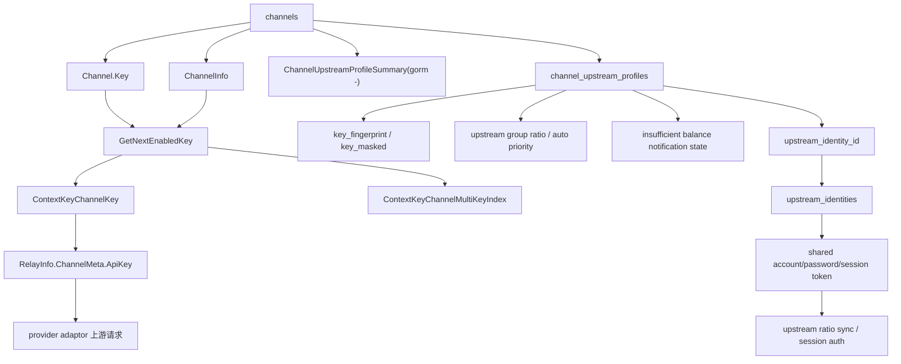

# new-api 渠道凭据、Multi-Key、上游 Profile 和 Identity 源码学习指南

这篇文档梳理 new-api 渠道凭据系统的完整实现：普通单 key、multi-key、渠道运行时 key 选择、上游账号 profile、共享上游身份 identity、上游分组倍率同步、自动优先级、余额不足通知，以及默认前端渠道表单如何把这些字段提交到后端。

如果你已经读过 `channel-management-selection-guide-for-go-learners.md` 和 `group-ratio-access-control-guide-for-go-learners.md`，这篇文档可以补上“渠道选中以后，到底使用哪个上游凭据，以及上游账号治理如何工作”的细节。

## 1. 先分清三类凭据

new-api 里和渠道相关的“凭据”至少有三类，不要混在一起：

| 类型 | 存储位置 | 用途 | 是否直接参与 relay 上游鉴权 |
| --- | --- | --- | --- |
| 渠道 API key | `channels.key` | 真正发给 OpenAI/Claude/Gemini/Azure 等上游的 key | 是 |
| Multi-key 状态 | `channels.channel_info` | 管理一条渠道内多个 key 的启用、禁用、随机/轮询选择 | 间接参与，选出本次 `ApiKey` |
| 上游 Profile/Identity | `channel_upstream_profiles`、`upstream_identities` | 记录上游账号、登录地址、上游分组倍率、欠费通知、价格同步认证 | 不直接参与普通 relay 鉴权 |

最重要的一句话：

> relay 请求最终发给 provider 的 key 来自 `Channel.Key` 或 multi-key 选出的某一行 key；`ChannelUpstreamProfile` 和 `UpstreamIdentity` 主要服务于上游账号治理、倍率同步、自动优先级和余额不足通知。

## 2. 核心对象总览



这条链路有两个方向：

- 请求方向：渠道被选中以后，`ChannelInfo` 决定本次使用哪个 key，写入 context，最终进入 `RelayInfo.ApiKey`。
- 治理方向：`ChannelUpstreamProfile` 和 `UpstreamIdentity` 记录上游账号、倍率、session、通知状态，用于同步和后台治理。

## 3. Channel 和 ChannelInfo

核心文件：

- `model/channel.go`
- `controller/channel.go`
- `middleware/distributor.go`
- `relay/common/relay_info.go`

`model.Channel` 是渠道主表对象，和凭据相关的字段包括：

- `Key string`
- `ChannelInfo ChannelInfo`
- `OtherSettings string`
- `UpstreamProfile *ChannelUpstreamProfileSummary`

`UpstreamProfile` 是 `gorm:"-"` 字段，不直接落在 `channels` 表里。后台列表返回渠道时，controller 会查询 profile，再挂到这个字段上。

`ChannelInfo` 结构：

```go
type ChannelInfo struct {
    IsMultiKey             bool
    MultiKeySize           int
    MultiKeyStatusList     map[int]int
    MultiKeyDisabledReason map[int]string
    MultiKeyDisabledTime   map[int]int64
    MultiKeyPollingIndex   int
    MultiKeyMode           constant.MultiKeyMode
}
```

状态约定：

- 缺省或没有记录：启用。
- `1`：启用。
- `2`：手动禁用。
- `3`：自动禁用。

所以 `MultiKeyStatusList` 不是所有 key 的完整状态表，它更像稀疏覆盖表：没有出现的 index 默认启用。

## 4. 单 Key 和 Multi-Key 的存储方式

### 4.1 单 key

单 key 渠道最简单：

- `ChannelInfo.IsMultiKey = false`
- `Channel.Key = "sk-..."`

运行时直接返回整个 `Channel.Key`。

### 4.2 multi-key

multi-key 不是多条渠道，而是一条渠道里存多行 key：

```text
sk-key-1
sk-key-2
sk-key-3
```

对于 Vertex AI 这类服务账号 JSON key，还支持 JSON array 存储。`Channel.GetKeys()` 的解析规则：

1. 如果 `Channel.Key` 去空格后以 `[` 开头，尝试按 JSON array 解析。
2. 否则按换行拆分。

这让普通 provider 和 Vertex 服务账号都可以复用同一套 multi-key 机制。

## 5. 新增渠道时如何创建 single、batch、multi_to_single

核心文件：

- `controller/channel.go` 的 `AddChannel`
- `web/default/src/features/channels/lib/channel-form.ts`

前端新建渠道提交：

```ts
{
  mode: 'single' | 'batch' | 'multi_to_single',
  multi_key_mode?: 'random' | 'polling',
  batch_add_set_key_prefix_2_name?: boolean,
  channel: { ... },
  upstream_profile?: { ... }
}
```

后端 `AddChannel` 根据 `mode` 分三种：

### 5.1 single

```text
keys = [channel.key]
```

创建一条渠道。

### 5.2 batch

```text
keys = strings.Split(channel.key, "\n")
```

每个 key 创建一条独立渠道。可选 `BatchAddSetKeyPrefix2Name`，把 key 前缀拼进渠道名。

Vertex 非 API key 模式会按 JSON array 拆分。

### 5.3 multi_to_single

只创建一条渠道，但把多行 key 全部保留在同一个 `channel.key` 中：

- `ChannelInfo.IsMultiKey = true`
- `ChannelInfo.MultiKeyMode = random/polling`
- `ChannelInfo.MultiKeySize = key 数量`

这是“多个上游 key 作为一个路由渠道”的模式。

## 6. 更新渠道时 key 如何追加或覆盖

核心文件：

- `controller/channel.go` 的 `UpdateChannel`
- `web/default/src/features/channels/lib/channel-form.ts`

编辑渠道时，前端默认不回传旧 key。只有输入了新 key，`transformFormDataToUpdatePayload` 才设置 `payload.key`。

multi-key 编辑有额外字段：

- `key_mode = append`
- `key_mode = replace`

后端逻辑：

- `replace`：用新 key 替换。
- `append`：把新输入 key 和原 key 合并去重。

`UpdateChannel` 有个重要保护：它会先读取原渠道，并把原 `ChannelInfo` 复制到 patch 对象上，避免前端没传完整 `channel_info` 时把 multi-key 状态冲掉。

如果请求里显式带了新的 `multi_key_mode`，再覆盖 `ChannelInfo.MultiKeyMode`。

## 7. 运行时如何选出本次上游 key

核心文件：

- `middleware/distributor.go`
- `model/channel.go`
- `relay/common/relay_info.go`

渠道被选中后，`SetupContextForSelectedChannel` 会调用：

```go
key, index, newAPIError := channel.GetNextEnabledKey()
```

### 7.1 非 multi-key

直接返回：

```text
key = channel.Key
index = 0
```

### 7.2 multi-key

流程：

```text
1. channel.GetKeys() 解析全部 key。
2. 根据 MultiKeyStatusList 过滤启用 key。
3. 如果没有启用 key，返回 ErrorCodeChannelNoAvailableKey。
4. 如果 MultiKeyMode=random，从启用 index 中随机选一个。
5. 如果 MultiKeyMode=polling，从 MultiKeyPollingIndex 开始找下一个启用 key。
6. polling 选中后把指针推进到下一个位置。
```

轮询使用每渠道锁：

- `model.GetChannelPollingLock(channel.Id)`

这样同一个进程内并发请求不会同时读写同一个 polling index。

### 7.3 context 写入

选中 key 后，`SetupContextForSelectedChannel` 写入：

- `ContextKeyChannelKey`
- `ContextKeyChannelIsMultiKey`
- `ContextKeyChannelMultiKeyIndex`
- `ContextKeyChannelBaseUrl`
- `ContextKeyChannelType`
- `ContextKeyChannelModelMapping`
- `ContextKeyChannelHeaderOverride`
- `ContextKeyChannelParamOverride`

随后 `relay/common/relay_info.go` 的 `InitChannelMeta` 把这些 context 值固化到：

- `RelayInfo.ChannelMeta.ApiKey`
- `RelayInfo.ChannelMeta.ChannelIsMultiKey`
- `RelayInfo.ChannelMeta.ChannelMultiKeyIndex`
- `RelayInfo.ChannelMeta.ChannelBaseUrl`

provider adaptor 最终用 `info.ApiKey` 发上游请求。

## 8. retry 时会不会重新选 key

一个容易误解的细节：

> 初始 key 在 distributor 阶段就选好了；同一渠道没有被排除或重新 setup 前，relay retry 通常复用当前 context 里的 key，不会每次循环都重新 `GetNextEnabledKey()`。

什么时候会重新选 key？

- 切换到新渠道。
- 任务类请求锁定原任务渠道并重新 setup。
- 某些测试/管理路径重新调用 `SetupContextForSelectedChannel`。

这意味着 multi-key 的随机/轮询是“渠道 setup 时选择一次”，不是“每次 retry 都换同渠道另一个 key”。

## 9. 错误处理如何禁用 key 或渠道

核心文件：

- `controller/relay.go`
- `service/channel.go`
- `model/channel.go`
- `controller/channel-test.go`

relay 错误进入：

```text
controller.processChannelError
```

它会判断：

- 模型不存在，标记渠道对该模型不可用。
- 是否余额不足。
- 是否应该自动禁用。
- 是否要写错误日志。

真正禁用走：

```text
service.DisableChannel
  -> model.UpdateChannelStatus(channelId, usingKey, autoDisabled, reason)
```

### 9.1 单 key 渠道

直接更新渠道状态：

- `channels.status = auto disabled`
- `other_info.status_reason = reason`
- `other_info.status_time = now`

同时更新 ability 状态。

### 9.2 multi-key 渠道

如果能用 `usingKey` 找到 key index，只更新该 index：

- `MultiKeyStatusList[index] = 3`
- `MultiKeyDisabledReason[index] = reason`
- `MultiKeyDisabledTime[index] = now`

如果所有 key 都不可用，才把整个渠道状态改为自动禁用，并设置 `All keys are disabled`。

如果找不到 usingKey，逻辑会退回到整体渠道状态更新。

## 10. Multi-Key 管理接口

核心文件：

- `controller/channel.go` 的 `ManageMultiKeys`
- `web/default/src/features/channels/components/dialogs/multi-key-manage-dialog.tsx`
- `web/default/src/features/channels/api.ts`

路由：

- `POST /api/channel/multi_key/manage`

请求结构：

```json
{
  "channel_id": 1,
  "action": "get_key_status",
  "key_index": 0,
  "page": 1,
  "page_size": 50,
  "status": 3
}
```

支持动作：

- `get_key_status`
- `disable_key`
- `enable_key`
- `delete_key`
- `enable_all_keys`
- `disable_all_keys`
- `delete_disabled_keys`

注意边界：

- `get_key_status` 是只读，不记录修改审计。
- 删除 key 会重排 key 和状态 index。
- `delete_disabled_keys` 只删除自动禁用状态 `3` 的 key，不删除手动禁用 `2`。
- 手动 `disable_key` 当前主要写状态，不一定有禁用原因/时间；自动错误路径会写 reason/time。

## 11. provider adaptor 如何使用 ApiKey

大多数 adaptor 不知道 key 来自单 key 还是 multi-key，它们只读：

```go
info.ApiKey
```

典型 header：

- OpenAI：`Authorization: Bearer <ApiKey>`
- Azure：`api-key: <ApiKey>`
- Claude：`x-api-key: <ApiKey>`
- Gemini/PaLM：`x-goog-api-key: <ApiKey>`

Header Override 会在默认 header 后应用，并支持 `{api_key}` 模板，因此高级渠道可以把 key 放在自定义 header 或 query 中。

特殊例子：

- Vertex 非 API key 模式把 `info.ApiKey` 当 service account JSON，并用 `channelId + multiKeyIndex` 缓存 access token，避免 multi-key 之间串 token。
- Vertex API key 模式把 key 放 URL query。
- Codex 渠道 key 是 OAuth JSON 对象，并且 usage 查询和部分刷新路径明确不支持 multi-key。
- AWS API key 模式要求形如 `<api-key>|<region>`。

## 12. ChannelUpstreamProfile 是什么

核心文件：

- `model/channel_upstream_profile.go`
- `controller/channel.go`
- `service/upstream_profile.go`
- `service/upstream_group_ratio_sync.go`

`ChannelUpstreamProfile` 按 `(channel_id, key_fingerprint)` 唯一。

关键字段：

- `ChannelId`
- `KeyFingerprint`
- `KeyMasked`
- `KeyLabel`
- `UpstreamAccount`
- `UpstreamPasswordEnc`
- `UpstreamLoginUrl`
- `UpstreamGroup`
- `UpstreamGroupRatio`
- `UpstreamTopupRatio`
- `UpstreamGroupRatios`
- `AutoPriorityEnabled`
- `AutoPriorityBase`
- `AutoPriorityMin`
- `AutoPriorityMax`
- `AutoPriorityValue`
- `InsufficientBalanceKeywords`
- `NotifyEnabled`
- `LastInsufficientAt`
- `NotifySuppressUntil`
- legacy session 字段
- `UpstreamIdentityId`

它的作用不是替换 relay API key，而是记录“这个渠道 key 在上游系统里的账号视角信息”。

### 12.1 key fingerprint

`KeyFingerprint(key)` 对 key 做 sha256，取前 8 字节 hex。

`MaskKey(key)` 生成脱敏展示：

- 短 key：`****`
- 长 key：前 4 位 + `...` + 后 4 位

profile 通过 key fingerprint 关联到某个 key。普通单 key 就是当前渠道 key；multi-key 当前默认只围绕主 key 建 profile。

### 12.2 Summary

`ChannelUpstreamProfile.Summary()` 返回给前端的摘要不包含明文密码，只包含：

- `password_configured`
- `session_configured`
- 上游账号/登录地址/auth 状态
- 分组倍率
- 自动优先级状态
- 欠费通知状态

它优先读取 `UpstreamIdentity` 的账号、baseURL、auth/session 状态，缺失时 fallback 到 profile legacy 字段。

## 13. UpstreamIdentity 是什么

核心文件：

- `model/upstream_identity.go`
- `service/upstream_auth.go`
- `model/main.go`

`UpstreamIdentity` 按 `(base_url, account)` 唯一。

字段：

- `IdentityFingerprint`
- `Account`
- `BaseURL`
- `PasswordEnc`
- `AuthType`
- `AccessTokenEnc`
- `RefreshTokenEnc`
- `AccessTokenExpiresAt`
- `AuthRefreshedAt`
- `AuthRefreshError`

它是共享认证层。多个渠道 profile 如果指向同一个上游账号和 baseURL，可以复用同一个 identity。

这解决的问题是：同一个上游账号被多个渠道使用时，登录密码/session token 不需要在每个 profile 上重复维护。

### 13.1 identity 创建和解析

关键函数：

- `UpstreamIdentityFingerprint(baseURL, account)`
- `EnsureUpstreamIdentity(baseURL, account)`
- `GetUpstreamIdentityByProfile(profile)`
- `profile.ResolveIdentity()`
- `PreloadUpstreamIdentities(profiles)`

解析顺序：

1. profile 有 `UpstreamIdentityId`，直接查 identity。
2. 没有 FK 时，用 profile 的 `UpstreamAccount` 和 channel baseURL 懒创建 identity。
3. 批量列表场景用 `PreloadUpstreamIdentities` 避免 N+1 查询。

### 13.2 启动迁移

`model/main.go` 的 `migrateProfilesToUpstreamIdentity` 是 Phase A 迁移：

```text
1. 扫描已有 upstream_account/auth_type 但没有 upstream_identity_id 的 profile。
2. 根据 profile 所属 channel 的 baseURL 和 account 确保 identity。
3. 把 profile legacy 密码/session 字段复制到 identity。
4. 回填 profile.upstream_identity_id。
5. 不清空 profile legacy 字段。
```

所以当前代码读路径经常是：

```text
identity 优先，profile legacy fallback
```

这是兼容历史数据的设计，不是重复逻辑。

## 14. 上游密码和 session 的加密

核心文件：

- `service/upstream_profile.go`
- `service/upstream_auth.go`

加密函数：

- `EncryptUpstreamPassword`
- `DecryptUpstreamPassword`

密钥来源：

1. `common.UpstreamSecretKey`
2. `common.CryptoSecret`
3. `common.SessionSecret`

只要三者之一存在，就可以加密；但查看上游密码的能力更严格，`IsUpstreamPasswordRevealEnabled()` 要求 `UpstreamSecretKey` 非空。

加密算法：

- AES-GCM
- secret 先 sha256 成 32 字节 key
- nonce 随机
- 最终 base64 存储

### 14.1 查看上游密码

路由：

- `POST /api/channel/:id/upstream_password`

权限：

- `RootAuth`
- `CriticalRateLimit`
- `DisableCache`
- `SecureVerificationRequired`

如果没有开启 reveal，接口不会返回明文。

### 14.2 写入 session

路由：

- `POST /api/channel/:id/upstream_auth/session`
- `DELETE /api/channel/:id/upstream_auth/session`

写入 session 的要求：

- profile 已存在。
- channel 有 baseURL。
- profile 或 identity 有上游账号。
- 请求带 `auth_type`。

写入位置是 `UpstreamIdentity`，不是 profile。清除 session 时会同时清 identity session 和 profile legacy session，保持兼容。

### 14.3 refresh token 模式

`service.EnsureUpstreamAccessToken` 支持两种 auth type：

- `sub2api_access_token`：直接解密 access token。
- `sub2api_refresh_token`：如果 access token 即将过期，调用上游 `/api/v1/auth/refresh`。

并发保护：

- 按 identity id 分片锁。
- 更新 DB 时用旧 refresh token 做乐观条件。
- 如果别的实例先刷新成功，当前实例 reload identity 后使用新 access token。

## 15. Profile 如何影响自动优先级

核心文件：

- `model/channel_upstream_profile.go`
- `service/upstream_group_ratio_sync.go`

profile 里有：

- `UpstreamGroupRatio`
- `UpstreamTopupRatio`
- `AutoPriorityBase`
- `AutoPriorityMin`
- `AutoPriorityMax`
- `AutoPriorityEnabled`

有效倍率：

```text
effective_ratio = upstream_group_ratio / normalized(upstream_topup_ratio)
```

自动优先级：

```text
raw_priority = round(auto_priority_base / effective_ratio)
priority = clamp(raw_priority, min, max)
```

当 profile 保存或上游倍率同步后，会调用：

- `applyAutoPriority`
- `ApplyChannelAutoPriority`

它会更新：

- `channels.priority`
- `abilities.priority`
- 内存 channel cache

所以 profile 的自动优先级最终会影响渠道选择排序。

## 16. 上游分组倍率同步

核心文件：

- `controller/channel.go`
- `service/upstream_group_ratios.go`
- `service/upstream_group_ratios_profile.go`
- `service/upstream_group_ratio_sync.go`
- `controller/ratio_sync.go`

这里有两类同步，不要混淆：

1. **单渠道 profile 上游分组倍率**：服务于渠道成本、自动优先级、RPM。
2. **系统模型价格同步**：服务于本站 `ModelRatio`、`ModelPrice` 等 option。

### 16.1 渠道抽屉里的 Fetch upstream ratios

编辑已有渠道：

- `GET /api/channel/:id/upstream_group_ratios`

新建预览：

- `POST /api/channel/upstream_group_ratios`

返回：

```json
{
  "group_ratios": { "default": 1 },
  "group_ratios_raw": "{...}",
  "topup_ratio": 1,
  "source": "..."
}
```

前端会：

- 把 `group_ratios_raw` 写入 `upstream_group_ratios`。
- 把 `topup_ratio` 写入 `upstream_topup_ratio`。
- 如果当前 `upstream_group` 命中，把对应倍率写入 `upstream_group_ratio`。

### 16.2 拉取顺序

`service.FetchUpstreamGroupRatios` 的尝试顺序：

1. account + password：登录 new-api 后读 `/api/ratio_config` 或 `/api/pricing`。
2. account + password：尝试 sub2api 邮箱密码登录。
3. account 非空且 password 为空：把 account 当 sub2api access token 直连。
4. 无认证：尝试 new-api 标准端点。
5. 无认证：尝试 sub2api 端点。

profile-aware 入口 `FetchUpstreamGroupRatiosFromProfile` 会先看 identity/session：

- `sub2api_access_token`
- `sub2api_refresh_token`
- legacy password

再 fallback 到 profile legacy 字段。

### 16.3 批量同步 profile

`service.SyncAllChannelUpstreamGroupRatios` 扫描：

```text
channel_upstream_profiles where upstream_login_url != ''
```

每个 profile 同步：

1. 解析 baseURL，优先 identity，其次 profile login url。
2. profile-aware 拉取分组倍率。
3. 找 `profile.UpstreamGroup` 对应倍率。
4. 写回 `upstream_group_ratio` 和 `upstream_group_ratios`。
5. 如果 `upstream_topup_ratio` 为空，尝试从 `/api/status` 拉充值倍率。
6. 记录成功或失败 task。
7. 如果配置的上游分组在快照里不存在，可自动禁用渠道。
8. 如果 sub2api 快照里有 `rpm_limit`，写入渠道 `settings.upstream_rpm_limit`。

## 17. 系统模型价格同步

前端入口：

- Billing -> Model Pricing -> Upstream price sync

核心文件：

- `controller/ratio_sync.go`
- `web/default/src/features/system-settings/models/upstream-ratio-sync.tsx`
- `web/default/src/features/system-settings/models/upstream-ratio-sync-table.tsx`
- `web/default/src/features/system-settings/api.ts`

接口：

- `GET /api/ratio_sync/channels`
- `POST /api/ratio_sync/fetch`
- 应用同步时逐项调用 `PUT /api/option/`

字段映射：

- `model_ratio` -> `ModelRatio`
- `completion_ratio` -> `CompletionRatio`
- `cache_ratio` -> `CacheRatio`
- `create_cache_ratio` -> `CreateCacheRatio`
- `image_ratio` -> `ImageRatio`
- `audio_ratio` -> `AudioRatio`
- `audio_completion_ratio` -> `AudioCompletionRatio`
- `model_price` -> `ModelPrice`
- `billing_mode` -> `billing_setting.billing_mode`
- `billing_expr` -> `billing_setting.billing_expr`

这一套是“本站模型计费配置同步”，不直接更新某个渠道 profile。它和 profile 的上游分组倍率同步是相邻但不同的功能。

## 18. 余额不足识别和通知

核心文件：

- `controller/relay.go`
- `service/upstream_profile.go`
- `service/channel.go`
- `model/channel_upstream_profile.go`

错误处理时：

```text
processChannelError
  -> service.IsInsufficientBalanceError(channelId, usingKey, errorMessage)
```

`IsInsufficientBalanceError` 会按当前使用 key 查 profile：

```text
GetChannelUpstreamProfileByKey(channelId, usingKey)
```

然后合并关键词：

- 默认余额不足关键词。
- 全局自动禁用关键词。
- profile 自定义 `InsufficientBalanceKeywords`。

命中后：

1. context 设置余额不足标记。
2. 异步 `NotifyChannelInsufficientBalance`。
3. 更新 profile：
   - `last_insufficient_at`
   - `last_insufficient_reason`
   - `last_notified_at`
   - `notify_suppress_until`
4. 如果 auto-ban 开启，调用 `DisableChannel`。
5. multi-key 场景下优先禁用当前 key。

通知有静默窗口，默认 2 小时，避免同一个欠费 key 高频邮件轰炸。

## 19. 前端渠道表单如何映射

核心文件：

- `web/default/src/features/channels/types.ts`
- `web/default/src/features/channels/api.ts`
- `web/default/src/features/channels/lib/channel-form.ts`
- `web/default/src/features/channels/components/drawers/channel-mutate-drawer.tsx`

### 19.1 新建 payload

`transformFormDataToCreatePayload` 输出：

```ts
{
  mode,
  multi_key_mode,
  batch_add_set_key_prefix_2_name,
  channel,
  upstream_profile
}
```

其中：

- `mode` 来自 `multi_key_mode` 表单字段。
- 只有 `mode === 'multi_to_single'` 才发送后端的 `multi_key_mode`，值来自 `multi_key_type`。
- `channel.group` 从数组转成逗号字符串。
- `upstream_profile` 由 `buildUpstreamProfilePayload` 生成。

### 19.2 更新 payload

`transformFormDataToUpdatePayload`：

- 只有 `key` 非空才发送新 key。
- `upstream_profile` 编辑时包含 `clear_password`。
- `key_mode` 只有在编辑 multi-key 且输入新 key 时有意义。

### 19.3 upstream_profile 字段映射

前端字段 -> 后端字段：

- `upstream_key_label` -> `key_label`
- `upstream_account` -> `upstream_account`
- `upstream_password` -> `upstream_password`
- `upstream_login_url` -> `upstream_login_url`
- `upstream_group` -> `upstream_group`
- `upstream_group_ratio` -> `upstream_group_ratio`
- `upstream_topup_ratio` -> `upstream_topup_ratio`
- `upstream_group_ratios` -> `upstream_group_ratios`
- `auto_priority_enabled` -> `auto_priority_enabled`
- `auto_priority_base` -> `auto_priority_base`
- `auto_priority_min` -> `auto_priority_min`
- `auto_priority_max` -> `auto_priority_max`
- `insufficient_balance_keywords` -> `insufficient_balance_keywords`
- `upstream_notify_enabled` -> `notify_enabled`
- `clear_upstream_password` -> `clear_password`

## 20. 前端 Multi-Key 管理弹窗

核心文件：

- `web/default/src/features/channels/components/dialogs/multi-key-manage-dialog.tsx`
- `web/default/src/features/channels/components/dialogs/multi-key-statistics-card.tsx`
- `web/default/src/features/channels/components/dialogs/multi-key-table-row-actions.tsx`
- `web/default/src/features/channels/lib/multi-key-utils.ts`

入口：

- 渠道行操作里，仅 multi-key 渠道显示 Manage Keys。

弹窗功能：

- 分页加载 key 状态。
- 按状态筛选。
- 统计 Enabled / Manual Disabled / Auto Disabled。
- 单 key 启用、禁用、删除。
- 全部启用、全部禁用。
- 删除自动禁用 key。

权限：

- 查看状态是普通渠道操作权限。
- 删除类敏感操作需要 `ChannelSensitiveWrite`。

## 21. 前端列表如何展示状态

核心文件：

- `web/default/src/features/channels/components/channels-columns.tsx`
- `web/default/src/features/channels/components/channel-card.tsx`
- `web/default/src/features/channels/lib/channel-utils.ts`

展示内容：

- 普通渠道状态。
- multi-key 启用数/总数。
- random/polling 图标。
- 自动禁用原因和时间。
- 上游账号。
- 上游分组倍率。
- 上游有效倍率。

有效倍率计算：

```text
upstream_effective_ratio
或 upstream_group_ratio / normalized(upstream_topup_ratio)
```

敏感信息开关关闭时，上游账号会被遮蔽。

## 22. 典型流程 walkthrough

### 22.1 创建一个 multi-key 渠道

```text
1. 前端选择 Add Mode = multi_to_single。
2. 选择 multi_key_type = random 或 polling。
3. key 文本框输入多行 key。
4. POST /api/channel。
5. AddChannel 清洗 key，设置 ChannelInfo.IsMultiKey=true。
6. BatchInsertChannels 创建一条渠道。
7. 如果带 upstream_profile，UpsertChannelUpstreamProfile 创建 profile。
8. profile 尝试绑定 UpstreamIdentity。
```

### 22.2 一次 relay 请求使用 multi-key

```text
1. Distribute 选中 channel。
2. SetupContextForSelectedChannel 调 GetNextEnabledKey。
3. random/polling 选出 key 和 index。
4. context 写入 channel_key、is_multi_key、multi_key_index。
5. RelayInfo.InitChannelMeta 写入 ApiKey。
6. provider adaptor 用 ApiKey 发上游请求。
7. 日志 admin_info 记录 multi_key_index。
```

### 22.3 某个 key 余额不足

```text
1. 上游返回错误。
2. processChannelError 调 IsInsufficientBalanceError。
3. 按 channel_id + using_key 找 profile。
4. 合并默认/全局/profile 关键词并匹配。
5. 更新 profile 欠费状态。
6. 通知 Root，受静默窗口控制。
7. DisableChannel 使用 using_key 禁用当前 key index。
8. 如果全部 key 禁用，渠道整体 auto-disabled。
```

### 22.4 上游分组倍率同步后影响优先级

```text
1. SyncAllChannelUpstreamGroupRatios 扫描 profile。
2. 使用 identity/session 或账号密码拉取上游倍率。
3. 找到 profile.UpstreamGroup 对应倍率。
4. 写回 UpstreamGroupRatio 和 UpstreamGroupRatios。
5. 计算 effective ratio 和 AutoPriorityValue。
6. ApplyChannelAutoPriority 更新 channel.priority 和 ability.priority。
7. 后续渠道选择按新 priority 排序。
```

## 23. 常见误区和边界

### 23.1 upstream profile 不替代 relay API key

普通 relay 上游鉴权仍看 `RelayInfo.ApiKey`，它来自渠道 key 或 multi-key 选出的 key。

profile/identity 的密码和 session 用于拉上游倍率、账号治理和通知，不会自动变成 provider 请求的 Authorization。

### 23.2 multi-key 不等于多条渠道

`multi_to_single` 创建一条渠道，多行 key 共享：

- 同一个 channel id。
- 同一个模型列表。
- 同一个分组。
- 同一个 priority/weight。
- 同一个 upstream profile 默认主 key 关联。

如果你希望每个 key 有完全独立渠道配置，应使用 `batch`。

### 23.3 profile 默认只跟主 key 指纹绑定

`UpsertChannelUpstreamProfile` 使用 `primaryChannelKey(channel.Key)` 生成 fingerprint。

multi-key 下，不会自动为每一个 key 建一个 profile。余额不足通知按当前 using key 查 profile，如果没有对应 profile，会 fallback 到默认关键词匹配。

### 23.4 identity 是共享认证层，不是 profile 的替代品

identity 保存账号、密码和 session token。profile 仍保存：

- 上游分组。
- 上游倍率。
- 自动优先级配置。
- 欠费关键词和通知状态。

### 23.5 profile 更新不一定覆盖已有 identity 密码

`UpsertChannelUpstreamProfile` 和 `UpdateChannelUpstreamProfile` 在同步到 identity 时，更偏向“identity 空字段才补充”。

所以如果 identity 已有密码，更新 profile 密码不一定改变实际拉取使用的 identity 密码。读问题时要看 identity 优先逻辑。

### 23.6 session 字段主要通过 session API 写入

`ChannelUpstreamProfileInput` 有 access/refresh token 字段，但常规 add/update profile 路径主要处理密码、分组、倍率等。session 写入主路径是：

- `POST /api/channel/:id/upstream_auth/session`

### 23.7 余额查询跳过 multi-key

`controller/channel-billing.go` 中单渠道余额查询不支持 multi-key，批量余额更新也跳过 multi-key。

原因很直接：multi-key 里每个 key 可能对应不同上游余额，渠道层的一个余额字段无法准确表达。

## 24. 推荐阅读顺序

建议按这个顺序读源码：

1. `model/channel.go` 的 `ChannelInfo`、`GetKeys`、`GetNextEnabledKey`
2. `middleware/distributor.go` 的 `SetupContextForSelectedChannel`
3. `relay/common/relay_info.go` 的 `InitChannelMeta`
4. `controller/relay.go` 的 `processChannelError`
5. `service/channel.go` 的 `DisableChannel`
6. `model/channel.go` 的 `UpdateChannelStatus`
7. `controller/channel.go` 的 `AddChannel`、`UpdateChannel`、`ManageMultiKeys`
8. `model/channel_upstream_profile.go`
9. `model/upstream_identity.go`
10. `model/main.go` 的 `migrateProfilesToUpstreamIdentity`
11. `service/upstream_profile.go`
12. `service/upstream_auth.go`
13. `service/upstream_group_ratios.go`
14. `service/upstream_group_ratio_sync.go`
15. `web/default/src/features/channels/lib/channel-form.ts`
16. `web/default/src/features/channels/components/drawers/channel-mutate-drawer.tsx`
17. `web/default/src/features/channels/components/dialogs/multi-key-manage-dialog.tsx`

读每个文件时问自己：

- 这段代码操作的是 relay API key，还是上游账号 profile？
- 这是运行时请求链路，还是后台治理链路？
- 这是单 key 行为，还是 multi-key index 行为？
- 这段数据会落到 `channels` 表、`channel_upstream_profiles` 表，还是 `upstream_identities` 表？

这四个问题能帮你把渠道凭据这块复杂逻辑拆成稳定的几层。
