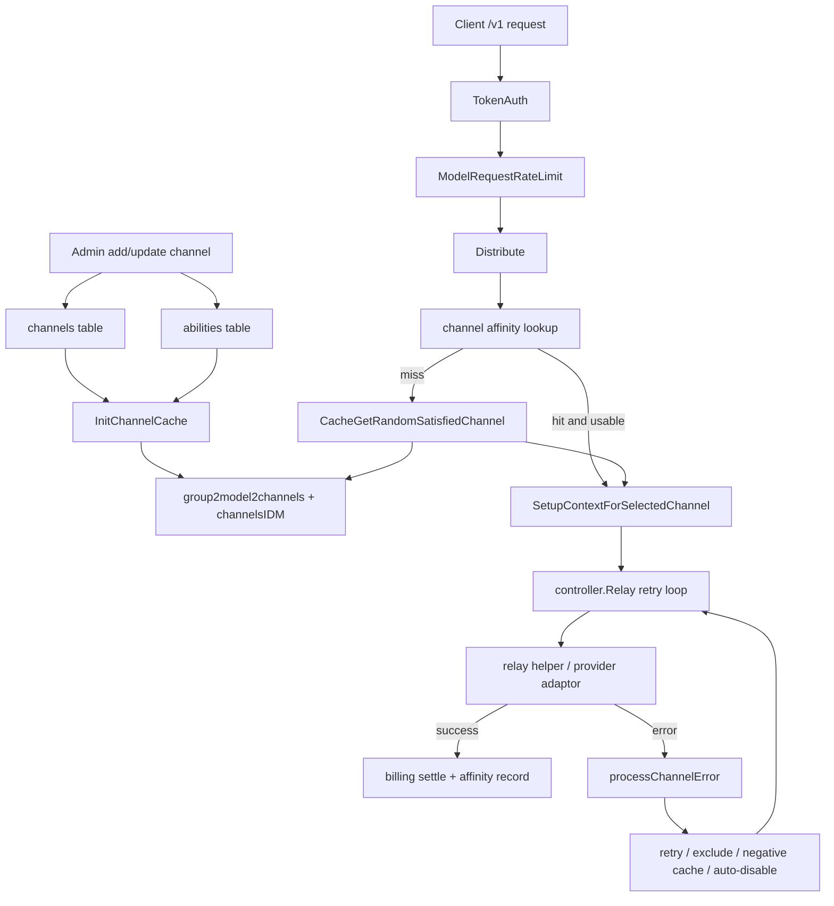

# 渠道管理与选择调度学习指南

这份文档专门讲 new-api 的渠道体系。读完后，你应该能回答三个问题：

1. 管理后台新增、编辑、禁用渠道时，数据库和缓存发生了什么。
2. 一个 `/v1/chat/completions` 请求进入后，系统怎样选出具体上游渠道。
3. 失败、重试、模型 fallback、亲和性、RPM 限制、自动优先级如何影响下一次选择。

建议配合这些文件阅读：

- `router/channel-router.go`
- `controller/channel.go`
- `model/channel.go`
- `model/ability.go`
- `model/channel_cache.go`
- `middleware/distributor.go`
- `service/channel_select.go`
- `service/channel_affinity.go`
- `controller/relay.go`
- `relay/helper/model_mapped.go`
- `model/channel_upstream_profile.go`
- `service/channel_auto_priority_task.go`

## 一、先建立心智模型

new-api 的渠道不是一个简单的 API Key 列表，而是一个可调度资源池。

```text
channels 表
  保存渠道本体：类型、密钥、base_url、模型列表、分组、权重、优先级、模型映射、覆盖参数、多 key 信息

abilities 表
  保存调度索引：group + model + channel_id 是否可用、对应 priority/weight/tag

内存缓存
  group2model2channels: group -> model -> []channel_id
  channelsIDM: channel_id -> *Channel
  channel2advancedCustomConfig: Advanced Custom 渠道路由配置

请求上下文
  Distribute 选渠道并写入 Gin context
  relay handler 从 context 读 channel_id/type/key/base_url/setting
```

可以把 `channels` 理解成配置事实表，把 `abilities` 理解成专门给调度使用的倒排索引，把 `group2model2channels` 理解成高频请求路径上的内存版倒排索引。

## 二、核心数据结构

### 1. Channel

`model.Channel` 是渠道配置中心，主要字段在 `model/channel.go`：

- `Type`：渠道类型，例如 OpenAI、Claude、Gemini、Azure、AWS、Advanced Custom。
- `Key`：上游密钥，单 key 或多 key 文本。
- `Status`：启用、手动禁用、自动禁用等状态。
- `Name`：后台展示和日志使用的名称。
- `Weight`：同一优先级内随机选择的权重。
- `Priority`：优先级，数值越大越先被选中。
- `BaseURL`：自定义上游地址，空值时使用 `constant.ChannelBaseURLs` 默认地址。
- `Models`：逗号分隔的模型列表。
- `Group`：逗号分隔的分组列表。
- `ModelMapping`：模型映射和 fallback 配置。
- `StatusCodeMapping`：上游状态码映射。
- `AutoBan`：是否允许错误时自动禁用。
- `Setting`、`OtherSettings`：渠道级设置，例如代理、系统提示词、Advanced Custom 配置、上游 RPM 限制。
- `ParamOverride`、`HeaderOverride`：转发前覆盖请求体或 header。
- `ChannelInfo`：多 key 模式状态。

读 Go 的时候注意这里大量使用指针字段，例如 `*uint`、`*int64`、`*string`。原因是后台更新和 JSON 表达里要区分“没有传”和“传了零值或空字符串”。例如权重为 0 是合法配置，不能被误判成未设置。

### 2. ChannelInfo 和多 key

`ChannelInfo` 保存多 key 模式：

- `IsMultiKey`：是否启用多 key。
- `MultiKeySize`：key 数量。
- `MultiKeyStatusList`：每个 key 的启用、手动禁用、自动禁用状态。
- `MultiKeyPollingIndex`：轮询模式当前指针。
- `MultiKeyMode`：随机或轮询。

`Channel.GetNextEnabledKey()` 是请求时取 key 的关键函数：

```text
非多 key
  -> 直接返回 Channel.Key

多 key + random
  -> 收集 enabled key index
  -> rand.Intn 随机挑一个

多 key + polling
  -> 使用 channel polling lock
  -> 从 MultiKeyPollingIndex 开始找下一个 enabled key
  -> 更新下一次轮询位置
```

这个函数展示了 Go 并发里常见的“按资源 ID 分锁”思路：不是用一个全局大锁锁住所有渠道，而是通过 `model.GetChannelPollingLock(channel.Id)` 锁住当前渠道的轮询状态。

### 3. Ability

`model.Ability` 的主键是 `Group + Model + ChannelId`：

```go
type Ability struct {
    Group     string
    Model     string
    ChannelId int
    Enabled   bool
    Priority  *int64
    Weight    uint
    Tag       *string
}
```

它是为调度而生的表。后台展示渠道时可以扫 `channels`，但 relay 请求每秒可能很多，不能每次都解析每个渠道的 `Models` 和 `Group` 字符串，所以新增或更新渠道时会同步维护 `abilities`。

## 三、后台渠道管理 API

渠道路由统一在 `router/channel-router.go`。所有 `/api/channel/...` 先经过 `middleware.AdminAuth()`，然后按操作类型叠加细粒度权限：

- `ChannelRead`：读取列表、详情、模型。
- `ChannelOperate`：测试、启停、修复 abilities、批量操作。
- `ChannelWrite`：普通编辑。
- `ChannelSensitiveWrite`：新增、删除、复制、修改 key、param/header override、拉取模型等敏感操作。
- `RootAuth + SecureVerificationRequired`：读取渠道 key、上游密码、上游会话等高敏信息。

典型敏感读取链路：

```text
POST /api/channel/:id/key
  -> AdminAuth
  -> RootAuth
  -> CriticalRateLimit
  -> DisableCache
  -> SecureVerificationRequired
  -> controller.GetChannelKey
```

这体现了项目的安全设计：不是只靠 root 权限，而是在高敏接口上叠加限流、禁缓存、安全二次验证和审计。

## 四、新增渠道流程

入口是 `controller.AddChannel`。

```text
AddChannel
  -> ShouldBindJSON 到 AddChannelRequest
  -> validateChannel
  -> 根据 mode 处理 key
       single: 一个 key 一个渠道
       batch: 多行 key 拆成多个渠道
       multi_to_single: 多行 key 存成一个多 key 渠道
  -> model.BatchInsertChannels
       tx.Create channels
       每个 channel.AddAbilities(tx)
  -> 可选 UpsertChannelUpstreamProfile
  -> service.ResetProxyClientCache
  -> recordManageAudit
```

`BatchInsertChannels` 里有两个重要点：

- 使用事务保证渠道和 ability 要么一起成功，要么一起失败。
- 使用 `lo.Chunk(channels, 50)` 分批插入，避免一次性 SQL 过长。

新增后没有手动调用 `InitChannelCache()`，这意味着在开启内存缓存时，缓存刷新依赖后续同步或其他刷新路径。更新、删除、启停这类操作通常会立刻刷新缓存。

## 五、更新渠道流程

入口是 `controller.UpdateChannel`。它比新增复杂，因为要处理局部 patch、敏感字段、只读字段、多 key 追加、上游 profile。

```text
UpdateChannel
  -> 读取 raw body
  -> common.Unmarshal 到 PatchChannel 和 map[string]any
  -> 禁止直接通过 update 修改 status
  -> clearChannelReadOnlyFields
  -> validateChannel
  -> 读取 originChannel
  -> 保留 originChannel.ChannelInfo
  -> 检测敏感变更，必要时要求 ChannelSensitiveWrite
  -> 处理 MultiKeyMode 和 KeyMode
  -> channel.Update()
       更新 channels
       重建该 channel 的 abilities
       清理 fallback cache
  -> 可选更新 ChannelUpstreamProfile
  -> model.InitChannelCache()
  -> service.ResetProxyClientCache()
  -> 审计 changed_fields
```

这里值得学的 Go 写法：

- `rawBody + map[string]any` 用来判断请求到底传了哪些字段。
- 先读原始渠道，再把 `ChannelInfo` 拷贝回来，避免前端没传多 key 状态时把状态清空。
- 敏感字段的权限判断放在 controller 层，因为它依赖“这次请求传了什么”和“原值是什么”。
- 更新成功后返回前会清空 `Key` 和敏感 `ChannelInfo`，防止后台响应泄露密钥状态。

## 六、启停、删除、批量和 tag 操作

这些接口的共同规律是：先改 DB，再刷新缓存，再写审计。

```text
DeleteChannel
  -> channel.Delete()
  -> DeleteChannelUpstreamProfile
  -> InitChannelCache

UpdateChannelStatus / BatchUpdateChannelStatus
  -> model.UpdateChannelStatus
  -> InitChannelCache
  -> ResetProxyClientCache

DisableTagChannels / EnableTagChannels
  -> 按 tag 更新 channels 和 abilities
  -> InitChannelCache

EditTagChannels
  -> 校验 param/header override JSON
  -> model.EditChannelByTag
  -> InitChannelCache

FixChannelsAbilities
  -> model.FixAbility
  -> 清空并重建 abilities
  -> InitChannelCache
```

`FixAbility()` 是一个很好的源码学习入口：它展示了如何从事实表 `channels` 重建索引表 `abilities`。SQLite 用 `DELETE FROM abilities`，其他数据库使用 `TRUNCATE TABLE`，这也是项目跨库兼容的一个小例子。

## 七、Channel Cache 怎么工作

核心函数是 `model.InitChannelCache()`。

```text
InitChannelCache
  -> DB.Find(&channels)
  -> DB.Find(&abilities)
  -> newChannelId2channel[id] = channel
  -> 收集 ability 中出现过的 group
  -> 遍历启用渠道
       group 拆分
       models 拆分
       group2model2channels[group][model] append channel.Id
  -> 每个 group/model 下按 priority desc 排序
  -> 对多 key polling 渠道保留旧 polling index
  -> 原子替换全局 map
```

关键全局变量：

```go
var group2model2channels map[string]map[string][]int
var channelsIDM map[int]*Channel
var channel2advancedCustomConfig map[int]*dto.AdvancedCustomConfig
var channelSyncLock sync.RWMutex
```

这里的并发模型是“构建新 map，再加写锁整体替换”。请求读缓存时拿 `RLock`，刷新缓存时拿 `Lock`。这种写法比在旧 map 上边读边改安全，也更容易推理。

Advanced Custom 渠道还有额外缓存 `channel2advancedCustomConfig`。调度时只有 type 58 的渠道会检查请求 path 是否匹配配置路由，其他渠道默认支持所有路径。

## 八、第一次选渠道：Distribute 中间件

relay 路由会挂 `middleware.Distribute()`。它的职责是从请求里解析模型名，选择一个初始渠道，并把渠道信息写进 Gin context。

简化流程：

```text
Distribute
  -> getModelRequest
       从 JSON/form/multipart/path/query 解析 model
       Midjourney/Suno/video/audio/Gemini path 有特殊逻辑
  -> 如果 token 绑定 specific_channel_id
       直接读取该渠道并检查启用状态
  -> 否则检查 token model limit
  -> playground 可覆盖 group
  -> 尝试 channel affinity
  -> service.CacheGetRandomSatisfiedChannel
  -> SetChannelAffinityRealGroup
  -> SetupContextForSelectedChannel
  -> c.Next()
  -> 成功响应后 RecordChannelAffinityFromContext
```

`SetupContextForSelectedChannel()` 是后续 relay 共享的上下文装配函数。它会写入：

- `channel_id`
- `channel_name`
- `channel_type`
- `channel_setting`
- `channel_other_setting`
- `channel_param_override`
- `channel_header_override`
- `model_mapping`
- `status_code_mapping`
- `channel_key`
- `channel_base_url`
- 多 key index
- Azure/Gemini/Vertex 等渠道需要的 `api_version`、`region` 等额外字段

所以 relay handler 本身通常不再关心“如何选渠道”，而是直接从 context 读取已经选好的渠道参数。

## 九、选择算法：优先级优先，权重随机

普通分组的核心函数：

```text
service.CacheGetRandomSatisfiedChannel
  -> model.GetRandomSatisfiedChannelWithExclusions
```

内存缓存路径下，`GetRandomSatisfiedChannelWithExclusions` 的逻辑是：

```text
1. exact model 匹配
   channels = group2model2channels[group][model]

2. 如果没有，使用 ratio_setting.FormatMatchingModelName(model) 再匹配

3. 排除本次请求已经失败或负缓存标记的 channel

4. 如果仍为空，使用 GetChannelsForGroupModelWithFallback
   包括 model_mapping 中可 fallback 到目标模型的渠道

5. 收集候选渠道中的 priority 层级，按 priority desc 排序

6. retry=0 选择最高 priority
   retry=1 选择第二高 priority
   retry 超出层数时固定到最后一层

7. 在目标 priority 的渠道里按 weight 随机
```

权重有两个细节：

- 如果同层所有渠道权重和为 0，则每个渠道按 100 的等权重处理。
- 如果平均权重小于 10，会用 smoothing factor 放大，避免小权重随机时分布太粗糙。

这套算法意味着：

- `Priority` 决定“先用哪一层渠道”。
- `Weight` 决定“同一层里流量怎么分”。
- `Retry` 决定“失败后是否降到下一层 priority”。

## 十、auto group 和跨组重试

当 token group 是 `"auto"` 时，选择逻辑会从用户可用自动分组里挑真实 group。

`service.CacheGetRandomSatisfiedChannel()` 会读取：

- `setting.GetAutoGroups()`
- `service.GetUserAutoGroup(userGroup)`
- `ContextKeyAutoGroupIndex`
- `ContextKeyTokenCrossGroupRetry`

流程可以理解为：

```text
auto group list = [groupA, groupB, groupC]

Retry=0
  groupA priority 0

Retry=1
  groupA priority 1

groupA 没有可用渠道或跨组重试触发
  切到 groupB
  retry 在新 group 内重置为 0
```

选中后会把真实分组写入 `ContextKeyAutoGroup` 和 channel affinity 的 RealGroup。这样后续计费、亲和绑定、日志能知道实际用的是哪个 group，而不是只看到 `"auto"`。

## 十一、请求内重试和重新选渠道

`controller.Relay()` 在预扣费后进入 retry loop：

```text
for retry <= common.RetryTimes:
  -> getChannel
  -> bodyStorage.Seek 到开头，重置请求体
  -> relay.TextHelper / ImageHelper / AudioHelper / ...
  -> 成功则返回
  -> 失败 processChannelError
  -> 根据 shouldRetry 判断是否继续
```

`getChannel()` 有三种情况：

1. `RelayInfo.ChannelMeta == nil`：沿用 Distribute 初次选好的 context 渠道。
2. 当前请求已有 excluded channel：跨 priority 找一个可用 fallback 渠道。
3. 正常 retry：再次调用 `CacheGetRandomSatisfiedChannel()`。

失败处理里有几个保护：

- 单个请求里同一渠道失败达到 `perRequestChannelFailureLimit = 4` 后，会把该渠道加入 `retryParam.Excluded`。
- 模型不存在错误会立即 `MarkModelUnavailableForChannel`，本次请求马上排除该渠道。
- 如果渠道触发上游 RPM 限制，会把该渠道和已尝试渠道加入 excluded。
- `shouldRetry()` 会尊重 specific channel、skip retry 错误、状态码重试配置、亲和性失败策略。

这也是为什么 `common.GetBodyStorage()` 很重要：请求体在第一次解析和第一次上游请求后已经被读过，重试前必须把 body 恢复到开头。

## 十二、模型映射、fallback 和负缓存

模型映射有两层含义：

1. 老格式的链式映射：`{"gpt-4": "gpt-4o"}`。
2. 新格式的 fallback 列表：`{"gpt-4": ["gpt-4o", "gpt-4.1"]}`。

真正决定上游模型名的是 `relay/helper/model_mapped.go` 的 `ModelMappedHelper()`。

简化逻辑：

```text
requestedModel = 用户请求模型
channel = 当前已选渠道
group = token group 或 auto 真实 group

如果 channel 在 ability 表里直接支持 requestedModel
  -> 使用 requestedModel

否则解析 model_mapping 链式目标
  -> 如果目标模型在 ability 表里可用，使用它，并清理负缓存

否则遍历 fallback candidates
  -> 第一个可用 candidate 作为 upstream model，并清理负缓存

否则
  -> MarkModelUnavailableForChannel(channelID, requestedModel)
  -> 仍返回 requestedModel，让上游错误进入 retry/负缓存流程
```

负缓存由 `service/channel_model_unavailable.go` 实现，底层是 `cachex.HybridCache`，默认 TTL 5 分钟。`service.CacheGetRandomSatisfiedChannel()` 每次会把负缓存里的 channel 合并进 excluded，避免短时间内反复选中“不支持这个模型”的渠道。

## 十三、Channel Affinity 渠道亲和性

渠道亲和性用于让同一类请求尽量命中同一个渠道。典型用途是：

- 保持会话类请求稳定落到同一上游账号。
- 对需要缓存命中或上下文粘性的请求减少漂移。
- 在某个 key/source 上维持稳定绑定。

主要文件是 `service/channel_affinity.go`。它使用多个 hybrid cache：

- `new-api:channel_affinity:v2`：cache key 到 `ChannelAffinityBinding`。
- `new-api:channel_affinity_state:v1`：失败次数、冷却时间、上次迁移信息。
- `new-api:channel_affinity_failure_recorder:v1`：近期失败飞行记录。
- `new-api:channel_affinity_usage_cache_stats:v1`：使用统计。

Distribute 阶段会先调用 `GetPreferredChannelByAffinity()`。如果找到绑定渠道，还要检查：

- 渠道仍然启用。
- Advanced Custom path 仍支持当前请求路径。
- 当前 group/model 下该渠道仍可满足请求。
- 若使用 fallback，还要避开负缓存。

成功响应后，`RecordChannelAffinityFromContext()` 会把本次选中的渠道写入亲和缓存。失败时，`controller.Relay()` 的 `recordFinalChannelAffinityFailure()` 会根据规则决定是否调用 `HandleChannelAffinityFailure()`，触发迁移或冷却。

一个容易忽略的点：亲和绑定保存的是 `ChannelAffinityBinding{ChannelID, RealGroup}`，不是只有 channel id。这样 auto group 场景下也能回到真实分组。

## 十四、上游 RPM 限制

`service.CheckAndReserveChannelRPM()` 读取 `channel.GetOtherSettings().UpstreamRPMLimit`。

```text
limit <= 0
  -> 不限制

limit > 0
  -> 以 Unix 分钟为窗口
  -> channel_id -> {windowStart, count}
  -> 同一分钟 count 达到 limit 后拒绝
```

这是进程内限制，使用 `sync.Mutex` 保护 map。它适合保护单节点对上游账号的请求速率。如果多节点部署，要意识到这个限制不是跨节点全局共享的。

当 RPM 命中时，relay 会返回 429 类错误，并把当前渠道加入 excluded，后续 retry 尝试其他渠道。

## 十五、自动禁用和自动恢复

失败处理入口是 `controller.processChannelError()`，策略在 `service/channel.go`。

自动禁用条件：

- 全局 `AutomaticDisableChannelEnabled` 开启。
- 错误被识别为 channel error。
- 或状态码命中自动禁用配置。
- 或错误信息命中自动禁用关键词。
- 或上游余额不足被识别。
- 且渠道自身 `AutoBan` 开启。

触发后异步调用：

```text
service.DisableChannel
  -> model.UpdateChannelStatus(channelId, usingKey, AutoDisabled, reason)
  -> NotifyRootUser
```

自动恢复条件：

- `AutomaticEnableChannelEnabled` 开启。
- 本次请求没有错误。
- 渠道状态是自动禁用。

自动恢复的设计目标是把临时上游错误从人工运维里解放出来，但仍尊重单渠道的 `AutoBan` 配置。

## 十六、上游余额不足与通知

`model.ChannelUpstreamProfile` 保存上游账号视角的信息：

- `KeyFingerprint`、`KeyMasked`、`KeyLabel`
- `UpstreamAccount`
- `UpstreamGroup`
- `UpstreamGroupRatio`
- `UpstreamTopupRatio`
- `InsufficientBalanceKeywords`
- `NotifyEnabled`
- `LastInsufficientAt`
- `NotifySuppressUntil`
- 上游登录会话字段

当 `processChannelError()` 发现错误信息命中余额不足关键词，会：

```text
标记 upstreamInsufficientBalanceContextKey
异步 NotifyChannelInsufficientBalance
如果 AutoBan 开启，禁用渠道
最终对用户隐藏具体上游余额错误，改成临时不可用提示
```

这是一个典型的边界保护：运营侧需要知道上游余额问题，但终端 API 用户不应该看到上游账号的敏感错误细节。

## 十七、自动优先级

自动优先级围绕 `ChannelUpstreamProfile` 的倍率字段工作。

核心计算：

```text
effective_ratio = upstream_group_ratio / upstream_topup_ratio
raw_priority = round(auto_priority_base / effective_ratio)
priority = clamp(raw_priority, auto_priority_min, auto_priority_max)
```

实现入口：

- `model.CalculateAutoPriorityValue`
- `model.RecalculateChannelUpstreamProfileAutoPriority`
- `model.ApplyChannelAutoPriority`
- `service.RunChannelAutoPriorityScanOnce`

后台任务 `service.StartChannelAutoPriorityScanTask()` 只在 master node 启动。一次扫描会做两步：

```text
1. SyncAllChannelUpstreamGroupRatios
   拉取或同步上游分组倍率

2. model.RecalculateAllChannelAutoPriorities
   重新计算 profile 的 AutoPriorityValue
   写回 channels.priority
   写回 abilities.priority
   更新内存缓存中的 channel priority
```

注意这里直接影响调度顺序。因为调度先看 priority，再看 weight，所以自动优先级本质上是把“上游成本倍率”转换成“调度层级”。

## 十八、渠道测试和模型更新

渠道测试入口在 `controller/channel-test.go`：

- `TestChannel`：测试单个渠道。
- `TestAllChannels`：批量测试。
- `performChannelTests`：批量执行并统计结果。
- `testChannel`：构造真实请求，走 adaptor 测试响应。

模型更新入口在 `controller/channel_upstream_update.go`：

- `DetectChannelUpstreamModelUpdates`
- `DetectAllChannelUpstreamModelUpdates`
- `ApplyChannelUpstreamModelUpdates`
- `ApplyAllChannelUpstreamModelUpdates`

大致流程：

```text
fetchChannelUpstreamModelIDs
  -> 请求上游模型列表
  -> 与当前 channel.Models / model_mapping 对比
  -> 把待添加、待移除模型写入 OtherSettings

applyChannelUpstreamModelUpdates
  -> 应用待更新模型
  -> 更新 channel.Models
  -> 更新 abilities
  -> refreshChannelRuntimeCache
```

这条链路的学习价值在于：它不是请求时调度，但会改变调度索引，最终仍然影响 `group2model2channels`。

## 十九、一次完整请求的渠道链路

下面把管理侧和请求侧串起来：



读源码时可以从 `router/relay-router.go` 找到 `/v1` 路由，然后按：

```text
TokenAuth
  -> ModelRequestRateLimit
  -> Distribute
  -> controller.Relay
  -> relay.TextHelper
  -> provider adaptor
```

这条线一路跳下去。

## 二十、Go 学习重点

### 1. 指针字段表达 patch 语义

`Channel.Weight *uint`、`Priority *int64`、`BaseURL *string` 这类字段不仅是数据库 nullable，也是在表达“前端是否显式传了这个字段”。这在后台管理系统里非常常见。

### 2. 事务保护派生索引

新增、复制、批量删除渠道时，`channels` 和 `abilities` 必须一致，所以用 GORM transaction 包起来。读这部分源码时重点看 `tx.Create`、`tx.Delete`、`tx.Commit` 和错误时 `tx.Rollback`。

### 3. 构建新 map 后整体替换

`InitChannelCache()` 先构建局部变量 `newGroup2model2channels`，最后加锁替换全局变量。这是 Go 服务里很实用的缓存刷新模式。

### 4. RWMutex 读多写少

调度请求远多于后台配置修改，所以缓存读取使用 `RLock`，刷新使用 `Lock`。这比每次请求查数据库更适合高频 relay。

### 5. Gin context 是跨层数据总线

`Distribute` 选出的渠道，后续 `relay`、`helper`、`adaptor`、`billing` 都从 Gin context 读。读代码时要随时搜索 `constant.ContextKey...`，否则会看不懂某个值从哪里来。

### 6. 重试状态显式对象化

`service.RetryParam` 保存 retry、excluded、failures、request path 等状态。它让 retry loop 不需要散落一堆局部变量，也方便 auto group 这种复杂状态迁移。

### 7. 负缓存降低重复失败

`MarkModelUnavailableForChannel` 把“某 channel 短时间内不支持某 model”缓存起来。它不是永久事实，所以用 TTL；它也不是只在一个函数里用，所以放在 service 层。

### 8. 后台任务影响在线调度

自动优先级、上游模型同步、渠道测试都不在单个请求路径内，但它们会改 `channels`、`abilities` 或缓存。理解线上行为时，要同时看同步请求和后台任务。

## 二十一、建议精读顺序

第一轮只读主链路：

1. `router/relay-router.go`
2. `middleware/distributor.go`
3. `service/channel_select.go`
4. `model/channel_cache.go`
5. `controller/relay.go`
6. `relay/helper/model_mapped.go`

第二轮读管理链路：

1. `router/channel-router.go`
2. `controller/channel.go`
3. `model/channel.go`
4. `model/ability.go`
5. `controller/channel_authz.go`

第三轮读高级能力：

1. `service/channel_affinity.go`
2. `service/channel_model_unavailable.go`
3. `service/channel_rate_limit.go`
4. `model/channel_upstream_profile.go`
5. `service/channel_auto_priority_task.go`
6. `controller/channel_upstream_update.go`
7. `controller/channel-test.go`

## 二十二、检查自己是否掌握

可以用这些问题自测：

1. 为什么项目需要 `abilities` 表，而不是每次直接读取 `channels.Models`？
2. `Priority` 和 `Weight` 在调度中的区别是什么？
3. retry 第 0 次和第 1 次可能选到不同渠道的原因是什么？
4. auto group 下真实 group 保存在哪里？
5. `SetupContextForSelectedChannel` 写了哪些后续 relay 必须依赖的值？
6. 多 key polling 为什么需要锁？
7. 模型 fallback 成功后为什么要清理负缓存？
8. 上游 RPM 限制为什么会导致 excluded channel？
9. 自动优先级为什么要同时写 `channels` 和 `abilities`？
10. 修改渠道后忘记刷新 `InitChannelCache()` 会导致什么现象？

如果这些问题都能回答，你基本已经掌握 new-api 渠道系统的主体实现。
