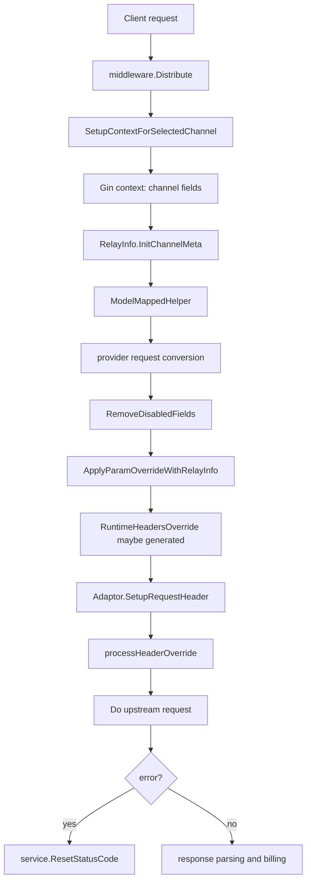

# 渠道请求覆盖、模型映射与状态码映射学习指南

本文面向已经掌握 Go 基本语法、正在通过 new-api 源码学习真实项目实现的读者。它专门梳理“渠道选出来以后，请求还能怎么被改写”这一层能力：模型映射、请求参数覆盖、请求头覆盖、状态码映射、系统提示词覆盖，以及渠道亲和性带来的动态覆盖模板。

读完本文，你应该能回答这些问题：

- 一个渠道表单里的 `model_mapping`、`param_override`、`header_override`、`status_code_mapping` 最终在哪里生效。
- `param_override` 的 legacy 格式和 operations 格式分别怎么运行。
- 请求体字段、请求头、重试信息、上一次错误信息如何进入 override 条件上下文。
- 静态 header override 和 param override 运行时 header override 的优先级是什么。
- model mapping 为什么既能做别名映射，又能做 fallback 候选。
- status code mapping 为什么只影响错误状态码，不影响成功请求。
- 前端编辑器和后端能力之间有哪些差异。

## 一句话总览

new-api 的请求改写不是在路由层一次性完成的，而是分散在几个阶段：

1. 渠道选择阶段把渠道上的改写配置写入 Gin context。
2. `RelayInfo.InitChannelMeta` 把 Gin context 里的配置装进 `RelayInfo.ChannelMeta`。
3. `helper.ModelMappedHelper` 在请求转换前决定上游模型名。
4. 各 relay handler 把请求转换成上游格式后，调用 `ApplyParamOverrideWithRelayInfo` 改写 JSON body。
5. 上游 HTTP 请求创建后，先让 provider adaptor 写默认 header，再应用 header override。
6. 上游返回错误或 adaptor 解析失败后，调用 `service.ResetStatusCode` 改写返回给客户端的状态码。

这条链路的关键点是：model mapping 发生在请求体转换之前，param override 发生在请求体转换之后，header override 发生在 provider 默认 header 之后，status code mapping 发生在错误生成之后。



## 相关字段和源码入口

渠道表字段定义在 `model.Channel`：

- `ModelMapping *string`：JSON 字符串，前端字段名 `model_mapping`。
- `StatusCodeMapping *string`：JSON 字符串，前端字段名 `status_code_mapping`。
- `ParamOverride *string`：JSON 字符串，前端字段名 `param_override`。
- `HeaderOverride *string`：JSON 字符串，前端字段名 `header_override`。
- `Setting *string`：包含 `system_prompt`、`system_prompt_override`、`pass_through_body_enabled` 等额外设置。

后端主要入口：

- `middleware/distributor.go`：`SetupContextForSelectedChannel` 把渠道字段写入 Gin context。
- `relay/common/relay_info.go`：`RelayInfo.InitChannelMeta` 把 context 转为 `ChannelMeta`。
- `relay/helper/model_mapped.go`：`ModelMappedHelper` 处理模型映射和 fallback。
- `relay/common/override.go`：`ApplyParamOverrideWithRelayInfo` 和所有 param override 操作。
- `relay/channel/api_request.go`：`processHeaderOverride`、`DoApiRequest`、`DoFormRequest`、`DoWssRequest`。
- `service/error.go`：`ResetStatusCode`。
- `relay/param_override_error.go`：把 `return_error` 转成 `NewAPIError`。
- `service/log_info_generate.go`：把 param override 审计信息写入消费日志 `other.po`。

前端主要入口：

- `web/default/src/features/channels/lib/channel-form.ts`：表单 schema、默认值、create/update payload。
- `web/default/src/features/channels/components/drawers/channel-mutate-drawer.tsx`：渠道编辑抽屉和提交前校验。
- `web/default/src/features/channels/components/dialogs/param-override-editor-dialog.tsx`：param override 可视化编辑器。
- `web/default/src/features/channels/components/model-mapping-editor.tsx`：model mapping 可视化/JSON 编辑器。
- `web/default/src/features/channels/lib/model-mapping-validation.ts`：model mapping 缺失模型检测。
- `web/default/src/features/channels/lib/status-code-risk-guard.ts`：高风险状态码映射检测。
- `web/default/src/features/channels/components/dialogs/status-code-risk-dialog.tsx`：高风险确认弹窗。

## 渠道字段如何进入 relay

`middleware.Distribute` 选中渠道后，会调用 `SetupContextForSelectedChannel`。这里有一段非常关键的写 context 逻辑：

- `channel.GetParamOverride()` 解析 `ParamOverride` 字符串为 `map[string]interface{}`。
- `channel.GetHeaderOverride()` 解析 `HeaderOverride` 字符串为 `map[string]interface{}`。
- `channel.GetModelMapping()` 返回原始 JSON 字符串。
- `channel.GetStatusCodeMapping()` 返回原始 JSON 字符串。
- `service.ApplyChannelAffinityOverrideTemplate` 有机会把渠道亲和性规则里的 param template 合并进当前渠道的 `param_override`。
- 最后通过 `common.SetContextKey` 写入 `ContextKeyChannelParamOverride`、`ContextKeyChannelHeaderOverride`、`ContextKeyChannelModelMapping`、`ContextKeyChannelStatusCodeMapping`。

`RelayInfo.InitChannelMeta(c)` 再从 context 中读取这些值：

- `ParamOverride` 进入 `info.ChannelMeta.ParamOverride`。
- `HeadersOverride` 进入 `info.ChannelMeta.HeadersOverride`。
- `UpstreamModelName` 初始等于原始请求模型名。
- `IsModelMapped` 初始为 false。

这里体现了 Gin 项目里常见的一种写法：middleware 不直接改业务对象，而是把中间状态放进 request context；后面的 handler 再把这些 context key 收拢成一个更适合业务处理的结构体。

## 渠道亲和性 override template

渠道亲和性不是本文主角，但它会影响 `param_override` 的最终值，所以要单独提一下。

`service.ApplyChannelAffinityOverrideTemplate(c, paramOverride)` 会在选中渠道后读取本次命中的亲和性规则。如果规则携带 `ParamTemplate`，就通过 `mergeChannelOverride` 合并到渠道原有 param override 里。

合并规则：

- 没有 template 时不改动。
- 普通字段：如果渠道原有 override 已经有同名 key，保留渠道原值；template 不覆盖渠道配置。
- `operations` 字段：如果两边都有 operations，则 template operations 放在前面，渠道原有 operations 放在后面。

这意味着亲和性模板可以作为“前置规则”影响请求，但渠道自己的规则仍然可以在后续 operations 中覆盖它。这个设计很适合按 user-agent、path、模型名等条件注入一些通用兼容逻辑。

## model_mapping：模型名重定向和 fallback

`model_mapping` 看起来只是一个 JSON map，但后端实际有两层含义：

- 第一层是 legacy 链式模型映射：把请求模型名改成另一个上游模型名。
- 第二层是有序 fallback 候选：当当前渠道能力表不支持请求模型时，按候选顺序找可用模型。

主要实现位于 `relay/helper/model_mapped.go` 的 `ModelMappedHelper`。

### legacy 链式映射

如果渠道配置：

```json
{
  "gpt-a": "gpt-b",
  "gpt-b": "gpt-c"
}
```

请求 `gpt-a` 时，`ModelMappedHelper` 会沿着链走到 `gpt-c`，并设置：

- `info.UpstreamModelName = "gpt-c"`
- `info.IsModelMapped = true`
- 请求对象的 model 字段也会被 `request.SetModelName(info.UpstreamModelName)` 改掉。

循环检测规则：

- `A -> B -> A` 会返回 `model_mapping_contains_cycle`。
- `A -> A` 且 A 就是原请求模型时，视为未映射，直接返回。
- 如果已经映射到中间模型后又遇到自环，保留已映射状态并跳出。

Go 学习点：这里用 `map[string]bool` 做 visited set，是最直接的有向图循环检测写法。读这段代码时可以练习“把业务 JSON 看成图”的思路。

### 数组候选格式

后端的 `unmarshalLegacyModelMapping` 能接受值为数组的格式：

```json
{
  "gpt-a": ["gpt-b", "gpt-c"]
}
```

但是在 legacy 链式映射阶段，它只取数组里的第一个字符串元素，也就是先把 `gpt-a` 当成映射到 `gpt-b`。

完整数组候选是在 fallback 阶段使用的。`model.Channel.GetFallbackCandidates(requestedModel)` 会把数组按顺序解析出来，`resolveFirstAvailableFallback` 再按顺序查当前 channel/group 是否启用了对应模型。

### fallback 可用性判断

`resolveFirstAvailableFallback` 的逻辑是：

1. 如果当前渠道能力表已经支持请求模型，直接使用请求模型，不需要 fallback。
2. 如果不支持，先尝试 legacy 链式映射的最终目标。
3. 如果链式目标不可用，再遍历 `GetFallbackCandidates(requestedModel)` 的候选数组。
4. 找到第一个当前 channel/group 可用的候选，就设置 `UpstreamModelName`，并把 `PricingModelName` 也改成候选模型。
5. 如果全部不可用，就调用 `service.MarkModelUnavailableForChannel` 写入负缓存。

这里的 `PricingModelName` 很重要：普通映射时计费模型通常还是原始模型；fallback 命中时，代码会把计费模型设成实际上游模型，避免按不可用的原始模型结算。

### 前端差异

当前默认前端 `channel-form.ts` 和 `ModelMappingEditor` 只接受“JSON object 且 value 为 string”的 model mapping。也就是说，后端已经能解析数组候选，但默认前端表单校验会拒绝数组值。

因此读源码时要分清：

- 后端能力：支持 string，也能部分支持 array。
- 默认前端编辑能力：只允许 string value。
- 通过其他入口或旧数据进入 DB 的 array value，后端仍可能处理。

## param_override：请求体和运行时 header 的规则引擎

`param_override` 是本文最复杂的部分。它由 `relay/common/override.go` 实现，核心函数是：

- `ApplyParamOverride(jsonData, paramOverride, conditionContext)`
- `ApplyParamOverrideWithRelayInfo(jsonData, info)`

各 relay handler 通常在“请求转换完成、移除禁用字段之后、构建上游 body 之前”调用它。典型顺序是：

1. adaptor 把 OpenAI 请求转换成上游格式。
2. `common.Marshal` 得到 JSON bytes。
3. `relaycommon.RemoveDisabledFields` 删除渠道设置中禁用的字段。
4. `relaycommon.ApplyParamOverrideWithRelayInfo` 应用 param override。
5. `NewOutboundJSONBody` 生成上游请求体。

如果启用了全局或渠道级 body passthrough，多数 JSON handler 会直接复用原始 body，不进入转换分支，因此也不会应用 `param_override`。但 header override 仍会在发上游请求时生效。

### 两种格式

legacy 格式：

```json
{
  "temperature": 0,
  "max_tokens": 1000
}
```

operations 格式：

```json
{
  "operations": [
    {
      "mode": "set",
      "path": "temperature",
      "value": 0.7,
      "conditions": [
        { "path": "model", "mode": "prefix", "value": "gpt" }
      ],
      "logic": "AND"
    }
  ]
}
```

如果一个 JSON 里同时存在普通字段和 `operations`，执行顺序是：

1. 先把普通字段作为 legacy override 应用。
2. 再按顺序执行 operations。

所以冲突时 operations 会赢。

### legacy 格式的一个关键细节

legacy 格式里的 key 被当作“顶层字面 key”，不是 gjson/sjson 路径。

例如：

```json
{
  "generationConfig.temperature": 0.2
}
```

legacy 模式会设置一个名字就叫 `generationConfig.temperature` 的顶层字段，而不是设置：

```json
{
  "generationConfig": {
    "temperature": 0.2
  }
}
```

如果要改嵌套字段，应该使用 operations 格式的 `path`。

### operations 支持的模式

`ParamOperation.Mode` 支持这些值：

| mode | 作用 |
| --- | --- |
| `set` | 设置 JSON 字段，`keep_origin=true` 时已有字段不覆盖 |
| `delete` | 删除 JSON 字段 |
| `copy` | 从 `from` JSON 路径复制到 `to` JSON 路径 |
| `move` | 从 `from` JSON 路径移动到 `to` JSON 路径 |
| `prepend` | 对字符串/数组/对象做前置追加或合并 |
| `append` | 对字符串/数组/对象做后置追加或合并 |
| `trim_prefix` | 去掉字符串前缀 |
| `trim_suffix` | 去掉字符串后缀 |
| `ensure_prefix` | 确保字符串有指定前缀 |
| `ensure_suffix` | 确保字符串有指定后缀 |
| `trim_space` | 去掉字符串两端空白 |
| `to_lower` | 字符串转小写 |
| `to_upper` | 字符串转大写 |
| `replace` | 字符串全文替换 |
| `regex_replace` | 正则替换字符串 |
| `return_error` | 立即中断请求并返回自定义错误 |
| `prune_objects` | 按条件从对象/数组结构里移除对象节点 |
| `set_header` | 设置运行时请求头 |
| `delete_header` | 删除运行时请求头 |
| `copy_header` | 从请求头/运行时头复制到另一个运行时头 |
| `move_header` | 从请求头/运行时头移动到另一个运行时头 |
| `pass_headers` | 把指定客户端请求头传到上游 |
| `sync_fields` | 在 JSON 字段和 header 字段之间补齐缺失一侧 |

路径类操作支持两个增强能力：

- `*` 通配路径展开，例如 `messages.*.content`。
- 负数索引，例如 `messages.-1.content` 表示最后一条消息的 content。

通配展开会把 JSON 先解成 interface 树，再收集真实路径。因此它比普通路径更重，适合用在确实需要批量改字段的场景。

### 字符串、数组、对象的 append/prepend

`append` 和 `prepend` 会根据当前字段类型选择行为：

- 当前值是 string：拼接字符串。
- 当前值是 array：把 value 放到数组前面或后面；value 如果本身是 array，会展开。
- 当前值是 object：把 value 当成 object 合并；`keep_origin=true` 时保留原对象同名字段。

这段代码很适合学习 Go 里的类型分支：`gjson.Result` 先判断 JSON 类型，再进入不同 helper。

### 条件系统

operation 可以带 `conditions` 和 `logic`：

```json
{
  "mode": "set",
  "path": "temperature",
  "value": 0.3,
  "conditions": [
    { "path": "original_model", "mode": "contains", "value": "gpt" },
    { "path": "retry_index", "mode": "gte", "value": 1 }
  ],
  "logic": "AND"
}
```

条件支持数组形式，也支持对象简写：

```json
{
  "conditions": {
    "model": "gpt-4.1"
  }
}
```

对象简写等价于 `mode=full`。

支持的 condition mode：

| mode | 含义 |
| --- | --- |
| `full` | 完整相等，要求 JSON 类型兼容 |
| `prefix` | 字符串前缀匹配 |
| `suffix` | 字符串后缀匹配 |
| `contains` | 字符串包含 |
| `gt` | 数字大于 |
| `gte` | 数字大于等于 |
| `lt` | 数字小于 |
| `lte` | 数字小于等于 |

其他字段：

- `invert=true`：把比较结果取反。
- `pass_missing_key=true`：字段缺失时直接判定为 true。
- `logic="AND"`：全部条件通过才执行；其他值默认按 OR。

条件查找顺序是：先查当前 JSON body，再查 condition context。也就是说，如果 body 和 context 有同名路径，body 优先。

### condition context 里有什么

`BuildParamOverrideContext(info)` 负责构建上下文。常用字段：

- `model`：上游模型名。如果已经 model mapping，就是映射后的模型名。
- `upstream_model`：同样表示上游模型名。
- `original_model`：客户端请求里的原始模型名。
- `request_path`：请求 URL path。
- `request_headers`：客户端请求头，key 会转小写。
- `header_override`：当前有效 header override。
- `retry_index`：当前重试次数，从 0 开始。
- `is_retry`：是否重试。
- `retry.index`、`retry.is_retry`：嵌套形式的重试信息。
- `last_error.status_code`、`last_error.message`、`last_error.code`、`last_error.type`、`last_error.skip_retry`：上一次错误信息。
- `last_error_status_code`、`last_error_message`、`last_error_code`、`last_error_type`：扁平形式的上一次错误信息。
- `is_channel_test`：是否渠道测试请求。

这让 `param_override` 可以写出“只有重试时才降级参数”“只有某个请求头存在时才透传”“上一次错误是 429 时改请求头”等规则。

### return_error

`return_error` 是一个“主动拒绝请求”的 operation。它不改 body，而是立即返回 `ParamOverrideReturnError`。

简单写法：

```json
{
  "operations": [
    {
      "mode": "return_error",
      "value": "request blocked by channel rule"
    }
  ]
}
```

对象写法：

```json
{
  "operations": [
    {
      "mode": "return_error",
      "value": {
        "message": "model is not allowed here",
        "status_code": 422,
        "code": "model_not_allowed",
        "type": "invalid_request_error",
        "skip_retry": true
      }
    }
  ]
}
```

默认值：

- `status_code` 默认 400。
- `code` 默认 `invalid_request`。
- `type` 默认 `invalid_request_error`。
- `skip_retry` 默认 true。

handler 会通过 `relay/param_override_error.go` 的 `newAPIErrorFromParamOverride` 把它转成 OpenAI 风格错误。普通 param override 执行错误则会变成 `ErrorCodeChannelParamOverrideInvalid`，并带 skip retry。

### prune_objects

`prune_objects` 用来从复杂 JSON 里删除满足条件的对象节点。常见场景是删除 provider 不支持的工具字段、thinking 字段或某类内容块。

简单写法：

```json
{
  "operations": [
    {
      "mode": "prune_objects",
      "path": "messages",
      "value": "redacted_thinking"
    }
  ]
}
```

这里字符串 value 会被解释成：

```json
{
  "conditions": [
    { "path": "type", "mode": "full", "value": "redacted_thinking" }
  ]
}
```

对象写法：

```json
{
  "operations": [
    {
      "mode": "prune_objects",
      "path": "messages",
      "value": {
        "logic": "AND",
        "recursive": true,
        "where": {
          "type": "tool_result"
        }
      }
    }
  ]
}
```

如果 `path` 为空，它会从整个 JSON root 开始处理。默认 `recursive=true`，会递归清理子对象。

### header 类 operation

`param_override` 不只会改请求体，也能生成运行时 header override。

这些 mode 会操作 `conditionContext.header_override`：

- `set_header`
- `delete_header`
- `copy_header`
- `move_header`
- `pass_headers`
- `sync_fields`

`ApplyParamOverrideWithRelayInfo` 执行结束后，会调用 `syncRuntimeHeaderOverrideFromContext`。如果 context 里存在 `header_override`，就写入：

- `info.RuntimeHeadersOverride`
- `info.UseRuntimeHeadersOverride = true`

后续发上游请求时，`GetEffectiveHeaderOverride(info)` 会优先使用 runtime header override。

重点：runtime header override 一旦启用，就是最终 header override 来源；它不会再自动和静态 `ChannelMeta.HeadersOverride` 二次合并。因为构建 condition context 时，初始 `header_override` 已经来自当前有效 header override，所以 header 类 operation 是在这个基础上修改。

### set_header 的映射写法

`set_header` 的 value 可以是字符串，也可以是对象。字符串会直接设置整个 header：

```json
{
  "mode": "set_header",
  "path": "authorization",
  "value": "Bearer token"
}
```

对象写法用于处理逗号分隔 token header，例如 `anthropic-beta`：

```json
{
  "mode": "set_header",
  "path": "anthropic-beta",
  "value": {
    "old-token": "new-token",
    "remove-me": null,
    "$append": ["extra-token"],
    "$keep_only_declared": false
  }
}
```

规则大意：

- 先读取当前 header token 列表。
- 如果 token 在映射对象里，就替换为对应 token；对应值为 null 表示删除。
- `*` 可以作为未声明 token 的通配替换。
- `$append` 会追加 token。
- `$keep_only_declared=true` 时，未声明 token 会被丢弃。
- 最终 token 会去重，并用逗号拼回字符串。

### pass_headers 和 header_override 的泛透传不是一回事

`param_override` 里的 `pass_headers` 只会复制你指定的请求头：

```json
{
  "mode": "pass_headers",
  "value": ["X-Request-Id", "User-Agent"],
  "keep_origin": true
}
```

而静态 `header_override` 里的 `*` 或 `re:` 是发上游请求阶段的泛透传规则。它们在不同层执行：

- `pass_headers`：在 param override 阶段，从 `request_headers` 复制到运行时 `header_override`。
- `header_override` 的 `*` / `re:`：在 `processHeaderOverride` 阶段，从真实 Gin request header 批量复制。

如果你只想透传少量 header，`pass_headers` 更可控。如果要按正则透传一类 header，静态 header override 更直接。

### sync_fields

`sync_fields` 用来在两个目标之间补齐缺失值。目标格式：

- `json:model` 或直接 `model`：JSON body path。
- `header:x-request-id`：header。

示例：

```json
{
  "operations": [
    {
      "mode": "sync_fields",
      "from": "header:x-request-id",
      "to": "json:metadata.request_id"
    }
  ]
}
```

如果 from 有值、to 没值，就写 to；如果 to 有值、from 没值，就写 from；两边都有或两边都没有时不改。

## header_override：发上游请求前的最终 header 覆盖

静态 `header_override` 由渠道字段提供，执行位置在 `relay/channel/api_request.go`：

- `DoApiRequest`
- `DoFormRequest`
- `DoWssRequest`

执行顺序非常重要：

1. 创建上游 request。
2. adaptor 调 `SetupRequestHeader` 设置 provider 默认 header，例如 Authorization、Content-Type。
3. `processHeaderOverride` 解析渠道 header override。
4. `applyHeaderOverrideToRequest` 写入上游 request header。

所以 header override 可以覆盖 adaptor 默认写入的 Authorization 等 header。

### 支持的占位符

静态 header override 的 value 支持：

- `{api_key}`：替换成当前渠道 key。
- `{client_header:NAME}`：读取客户端请求头 `NAME` 的值。

示例：

```json
{
  "Authorization": "Bearer {api_key}",
  "X-Trace-Id": "{client_header:X-Trace-Id}"
}
```

`{client_header:NAME}` 必须是完整 value，不能嵌在别的字符串里。渠道测试请求会跳过 `{client_header:...}`，因为测试请求未必有真实客户端 header。

### 泛透传规则

静态 header override 的 key 支持特殊规则：

```json
{
  "*": true,
  "re:^X-Trace-.*$": true,
  "regex:^X-Custom-.*$": true
}
```

规则含义：

- `*`：透传所有允许透传的客户端请求头。
- `re:<regex>`：透传 header name 匹配 Go regexp 的请求头。
- `regex:<regex>`：同上，是更显式的写法。

`processHeaderOverride` 会先处理泛透传，再处理普通显式 override。因此显式 override 赢。

出于安全原因，泛透传会跳过这些 header：

- hop-by-hop header，如 `connection`、`keep-alive`、`transfer-encoding`、`upgrade`。
- `cookie`。
- `host`、`content-length`、`accept-encoding`。
- 凭证类 header，如 `authorization`、`x-api-key`、`x-goog-api-key`。
- WebSocket 握手 header，如 `sec-websocket-key`。

如果确实要覆盖 Authorization，应使用显式 header override，而不是泛透传。

### header 优先级总结

可以把优先级分成两层：

第一层：header override 来源选择。

1. 如果 `info.UseRuntimeHeadersOverride=true`，使用 `info.RuntimeHeadersOverride`。
2. 否则使用渠道静态 `info.ChannelMeta.HeadersOverride`。

第二层：同一来源内部的处理顺序。

1. 先按 `*`、`re:`、`regex:` 做泛透传。
2. 再应用普通 key/value override。

最终效果是：param override 生成的 runtime header 能接管静态 header override；在同一个 header map 内，显式 key 又能覆盖泛透传结果。

## status_code_mapping：只改错误状态码

`status_code_mapping` 是一个 JSON object 字符串：

```json
{
  "400": "500",
  "429": "503"
}
```

实现位于 `service/error.go` 的 `ResetStatusCode(newApiErr, statusCodeMappingStr)`。

它的行为很克制：

- `newApiErr == nil` 时不做事。
- 空字符串或 `{}` 不做事。
- JSON 解析失败时静默跳过。
- 如果错误当前状态码是 200，不做事。
- 只按当前 `newApiErr.StatusCode` 查 map。
- value 支持 string、int、整数型 float64、`json.Number`。
- 只改 `newApiErr.StatusCode`，不改错误 body 的 message/code/type。

应用点覆盖主要同步 relay handler：

- OpenAI compatible handler。
- Responses handler。
- Claude handler。
- Gemini handler。
- Embedding handler。
- Image handler。
- Rerank handler。
- Audio handler。
- WebSocket handler。
- Gemini channel 内部特例。

### 为什么前端拦截 504/524 映射

`web/default/src/features/channels/lib/status-code-risk-guard.ts` 把 504 和 524 视为高风险状态码。提交渠道时，如果新增规则把 504/524 映射到其他状态码，前端会弹出 `StatusCodeRiskDialog`，要求勾选检查项并输入确认文本。

原因是这些状态码常被重试/故障处理逻辑识别。把它们映射成其他状态，可能改变客户端或网关的重试行为。

注意：这个拦截是前端治理，不是 `ResetStatusCode` 的后端限制。后端只按 JSON 配置执行合法整数映射。

## system_prompt_override：系统提示词覆盖

系统提示词覆盖不属于 `param_override` 字段，但它也是渠道改写请求的一部分。

相关字段在 `dto.ChannelSettings`：

- `SystemPrompt string`
- `SystemPromptOverride bool`

前端通过渠道设置保存到 `setting` JSON。后端在不同 handler 中读取 `info.ChannelSetting.SystemPromptOverride`：

- OpenAI compatible handler。
- Claude handler。
- Gemini handler。
- Chat Completions via Responses。
- Codex adaptor 等。

大致语义是：当渠道设置了 system prompt 并启用 override 时，handler 在协议转换阶段插入或替换 system prompt，并通过 `ContextKeySystemPromptOverride` 标记本次请求发生过系统提示词覆盖。后续日志生成可以记录这个事实。

它和 `param_override` 的区别：

- system prompt override 是 handler 按协议结构显式处理，更懂消息格式。
- param override 是通用 JSON 路径改写，不理解业务语义。

如果只是改 system prompt，优先看现有 system prompt override；如果要按复杂条件改任意字段，再考虑 param override。

## 前端配置和保存链路

默认前端把这些字段放在渠道编辑抽屉的高级区域。

### 表单 schema

`channel-form.ts` 用 zod 校验：

- `model_mapping`：可空；非空时必须是 JSON object，且 value 必须是 string。
- `status_code_mapping`：可空；非空时必须是 JSON object，key/value 都必须是 100 到 599 的整数状态码。
- `param_override`：可空；非空时必须是 JSON object。
- `header_override`：可空；非空时必须是 JSON object。

创建 payload 时，空字符串会转成 null；更新 payload 时，最后又会把这些字段规范成空字符串或实际字符串。这和后端 patch/update 接口的兼容有关。

### 敏感字段权限

后端 `controller/channel_authz.go` 把 `header_override`、`param_override` 归为敏感字段，修改它们需要 `ChannelSensitiveWrite`。

`model_mapping` 和 `status_code_mapping` 被归为非敏感字段，具有普通渠道写权限的管理员可以编辑。

前端也有对应的 `sensitiveLocked` 判断：没有敏感写权限时，会禁用 key、base_url、setting、param override、header override 等敏感区域，并在提交时检查 dirty fields。

### param override 编辑器

`ParamOverrideEditorDialog` 支持两种编辑模式：

- Visual：可视化编辑 operations 或 legacy object。
- JSON：直接编辑原始 JSON。

可视化 operations 覆盖了后端支持的大部分 mode：

- 字段 set/delete/copy/move。
- 字符串 append/prepend/replace/regex/trim/ensure/case。
- `return_error`。
- `prune_objects`。
- header 类操作。
- `pass_headers`。
- `sync_fields`。

它还提供模板：

- 新格式 operations 模板。
- legacy 模板。
- `X-Request-Id` header passthrough。
- Gemini Image 4K。
- Claude CLI header passthrough。
- Codex CLI header passthrough。
- AWS Bedrock Claude 兼容模板。

编辑器保存时会构造：

```json
{
  "operations": [
    {
      "mode": "set",
      "path": "temperature",
      "value": 0.7
    }
  ]
}
```

如果现有 JSON 无法解析，编辑器会进入 JSON 模式并显示错误，不会强行改写。

有一个前后端一致性细节要特别注意：页面文案写着“Cannot override stream parameter”，但当前可视化编辑器和后端 `ApplyParamOverride` 都没有看到针对 `path: "stream"` 的硬拦截。它更像是配置建议和风险提示，而不是一个由代码强制执行的规则。真正判断某个字段能不能传给上游，还要结合 `RemoveDisabledFields`、渠道设置和 provider adaptor。

### header override 编辑器

渠道抽屉里 `header_override` 当前是 JSON textarea，不是专门的复杂可视化编辑器。它提供几个按钮：

- Fill Template：填入 `*`、`re:`、`{client_header:...}`、`{api_key}` 示例。
- Passthrough Template：填入 `{ "*": true }`。
- Format：尝试格式化 JSON。
- Clear：清空。

说明文字列出 `{api_key}` 和 `{client_header:NAME}`。

### model mapping 编辑器

`ModelMappingEditor` 有 Visual 和 JSON 两个 tab。

Visual 模式按行编辑：

- from：源模型。
- to：目标模型。

保存时生成：

```json
{
  "gpt-3.5-turbo": "gpt-3.5-turbo-0125"
}
```

它会检测重复 source model。如果重复，会把表单值写成一个故意非法的 sentinel，让外层校验失败，从而阻止提交。

提交时 `channel-mutate-drawer.tsx` 还会调用：

- `validateModelMappingJson`：确认格式和值类型。
- `findMissingModelsInMapping`：检查 mapping 的源模型是否存在于渠道 models 列表。
- `MissingModelsConfirmationDialog`：让用户选择取消或把缺失源模型加入 models。

这里要注意：mapping 的 key 是“对外暴露/可请求的源模型”，所以如果 key 不在渠道 models 里，客户端可能根本选不到这个渠道。

抽屉里还有一个 guardrail：如果 mapping 的 target 模型也出现在渠道 models 列表中，前端会提示它可能被 `/v1/models` 暴露。通常 source alias 应该出现在 models 中，target upstream model 不一定要暴露给客户端。

### status code risk guard

提交时前端先调用 `collectInvalidStatusCodeEntries` 做格式检查，再调用 `collectNewDisallowedStatusCodeRedirects` 检查新增高风险映射。

高风险只针对新增规则。如果编辑已有渠道，原来已经存在的高风险规则不会反复弹窗；只有新加或改变出来的 504/524 重定向会要求确认。

## 常见真实链路

### 普通 OpenAI Chat 请求

1. 客户端请求 `/v1/chat/completions`，body 里有 `model`。
2. `Distribute` 根据 model/group/token 等选择渠道。
3. 渠道配置进入 Gin context。
4. handler 初始化 `RelayInfo`。
5. `ModelMappedHelper` 把请求模型映射成上游模型。
6. adaptor 转换请求结构。
7. `RemoveDisabledFields` 根据渠道设置删除不允许透传的字段。
8. `ApplyParamOverrideWithRelayInfo` 根据上游模型、原始模型、请求头、重试状态等改 JSON。
9. 如果 param override 生成 runtime header，写入 `info.RuntimeHeadersOverride`。
10. `DoApiRequest` 创建上游 request。
11. adaptor 写默认 header。
12. `processHeaderOverride` 应用 runtime 或静态 header override。
13. 上游返回错误时，`ResetStatusCode` 改写错误状态码。

### 重试时按上一次错误改参数

因为 condition context 里有 `retry_index` 和 `last_error.*`，可以写：

```json
{
  "operations": [
    {
      "mode": "set",
      "path": "temperature",
      "value": 0,
      "conditions": [
        { "path": "is_retry", "mode": "full", "value": true },
        { "path": "last_error_status_code", "mode": "full", "value": 429 }
      ],
      "logic": "AND"
    }
  ]
}
```

这样只有上一轮遇到 429 且正在重试时才改参数。

### 按客户端 header 传递上游 header

如果只想透传 `X-Request-Id`，可以使用 param override：

```json
{
  "operations": [
    {
      "mode": "pass_headers",
      "value": ["X-Request-Id"],
      "keep_origin": true
    }
  ]
}
```

如果要按正则透传一组 header，可以使用静态 header override：

```json
{
  "re:^X-Trace-.*$": true
}
```

如果要把客户端 header 改名：

```json
{
  "operations": [
    {
      "mode": "copy_header",
      "from": "x-client-trace",
      "to": "x-upstream-trace"
    }
  ]
}
```

header 名在 param override context 中会统一小写，所以文档和配置里建议都用小写写法，减少误解。

## 易错点清单

- `param_override` 的 legacy key 是顶层字面 key；嵌套路径要用 operations。
- `param_override` 发生在请求转换之后，所以 path 要写“上游请求格式”的路径，不一定是客户端 OpenAI 请求格式。
- body passthrough 会让多数 JSON handler 跳过 param override。
- `header_override` 发生在 adaptor 默认 header 之后，所以能覆盖 Authorization。
- runtime header override 一旦启用，不会再自动合并静态 header override。
- `pass_headers` 不是泛透传；它只复制指定 header。
- 静态 header override 的泛透传会跳过凭证类 header；要覆盖凭证必须显式设置。
- `return_error` 默认 skip retry，可能导致请求不再换渠道。
- `status_code_mapping` 只改错误状态码；映射 200 没效果。
- `status_code_mapping` 不改错误 body，只改 `NewAPIError.StatusCode`。
- `model_mapping` 的数组候选后端可处理，但默认前端不允许保存数组 value。
- `model_mapping` 的源模型最好出现在渠道 models 列表里，否则渠道能力索引可能无法匹配。
- `model_mapping` 的目标模型如果也放进渠道 models，可能会在模型列表接口里暴露上游真实模型名。
- `conditions` 先查 body 再查 context；同名字段 body 优先。
- 数字比较要求两边都是 JSON number；字符串 `"1"` 和数字 `1` 不是一回事。
- `copy`/`move` JSON 源路径不存在会报错；header copy/move 源 header 不存在会跳过。
- `set_header` 的对象映射适合 token header，不适合任意 JSON object 语义。

## Go 源码学习切入点

### 1. 从 context 到结构体

阅读顺序：

1. `middleware/distributor.go` 的 `SetupContextForSelectedChannel`。
2. `relay/common/relay_info.go` 的 `InitChannelMeta`。

关注点：

- Gin context 怎么作为 middleware 和 handler 之间的状态传递层。
- 为什么 `ParamOverride`、`HeadersOverride` 在 `ChannelMeta` 里是 map，而 `model_mapping`、`status_code_mapping` 仍保留为字符串。

### 2. 从 JSON bytes 做局部修改

阅读顺序：

1. `ApplyParamOverride`。
2. `applyOperationsLegacy`。
3. `applyOperations`。
4. `resolveOperationPaths`、`processNegativeIndex`。

关注点：

- 为什么新实现尽量在 `[]byte` 上用 gjson/sjson，避免对大 base64 body 整体 unmarshal。
- 哪些操作必须把 JSON 解成 interface 树，比如通配路径展开和 `prune_objects`。
- 错误如何用 `%w` 包装，让上层保留上下文。

### 3. 用 tests 当规格读

`relay/common/override_test.go` 是这个模块最好的行为说明书。建议按这些测试分组读：

- legacy 和 operations 混合。
- wildcard path 和负数索引。
- 条件 OR/AND/invert/pass_missing_key/context。
- header 类 operation。
- `return_error`。
- `prune_objects`。
- runtime header sync。
- audit 记录。

读测试时不要只看 expected JSON，也要看测试名。这个项目的 override 测试名基本直接描述业务契约。

### 4. 类型错误和业务错误的分界

`return_error` 返回的是业务设计出来的错误，用户看到的是可控 message/status/code/type。

其他 param override 执行错误，比如路径源不存在、正则非法、value 类型不对，则会被包装成 `ErrorCodeChannelParamOverrideInvalid`。这是配置错误，不是上游错误。

这类分界在网关项目里很重要：用户请求、管理员配置、上游响应三类错误要尽量分开。

### 5. 前后端契约不是天然一致

这个专题特别适合练习“不要只读一端源码”：

- 后端 `model_mapping` 能解析 array 候选。
- 前端 schema 当前只允许 string value。
- 前端会提示 target 模型不应暴露在 models 列表里，但后端不会因为 target 出现在 models 中而拒绝保存。
- 前端文案提示不能 override `stream`，但后端通用 path 处理没有专门拦截 `stream`。
- 后端 `status_code_mapping` 遇到非法 JSON 会静默跳过。
- 前端会先阻止非法状态码并拦截高风险映射。
- 后端把 `param_override`/`header_override` 视作敏感字段。
- 前端也会根据权限锁住敏感区域。

真实项目里，前端校验、后端鉴权、后端容错经常不完全等价。读源码时要把它们看成三道不同的保护层。

## 修改这些能力时的建议

如果你要改 `param_override`：

- 先读 `relay/common/override_test.go`，找到相近模式。
- 新增 mode 时同时考虑：解析、执行、审计、前端可视化编辑器、测试。
- 可选标量字段要小心 JSON 类型，避免字符串和数字混用。
- 如果操作 header，明确它改的是 runtime header override，而不是直接改 `http.Request`。

如果你要改 `header_override`：

- 确认安全跳过列表是否仍合理。
- 新增占位符时要考虑渠道测试请求和客户端输入注入风险。
- 保持“泛透传先执行，显式 override 后执行”的优先级。

如果你要改 `model_mapping`：

- 同时检查能力表、fallback cache、负缓存和前端校验。
- 明确 `PricingModelName` 应该是原始模型还是实际上游模型。
- 小心循环映射，不要让链式解析无限循环。

如果你要改 `status_code_mapping`：

- 明确它是否应该只影响错误状态码。
- 前端 risk guard 和后端 ResetStatusCode 要一起看。
- 不要把错误 body 和 HTTP status 的概念混在一起。

## 推荐阅读路径

1. 先读 `middleware/distributor.go` 中渠道字段写 context 的位置。
2. 再读 `relay/common/relay_info.go` 的 `InitChannelMeta`。
3. 读 `relay/helper/model_mapped.go`，掌握模型名如何变化。
4. 精读 `relay/common/override.go` 的结构体定义和 `applyOperations`。
5. 用 `relay/common/override_test.go` 验证每个 operation 的行为。
6. 读 `relay/channel/api_request.go`，确认 header 真正发出前怎么处理。
7. 读 `service/error.go` 的 `ResetStatusCode`。
8. 最后读前端 `channel-form.ts`、`param-override-editor-dialog.tsx`、`model-mapping-editor.tsx`，把配置入口和保存格式对上。

这个专题的核心不是记住每个 JSON 写法，而是掌握一条原则：new-api 把“渠道选择”和“渠道适配”分开，先选出合适渠道，再用一组可配置规则把请求塑造成这个上游真正能接受的形状。
