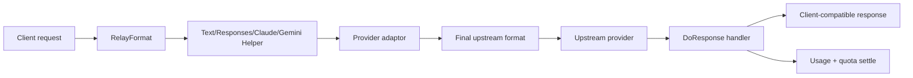
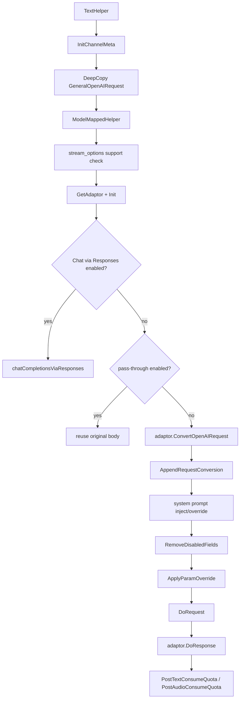
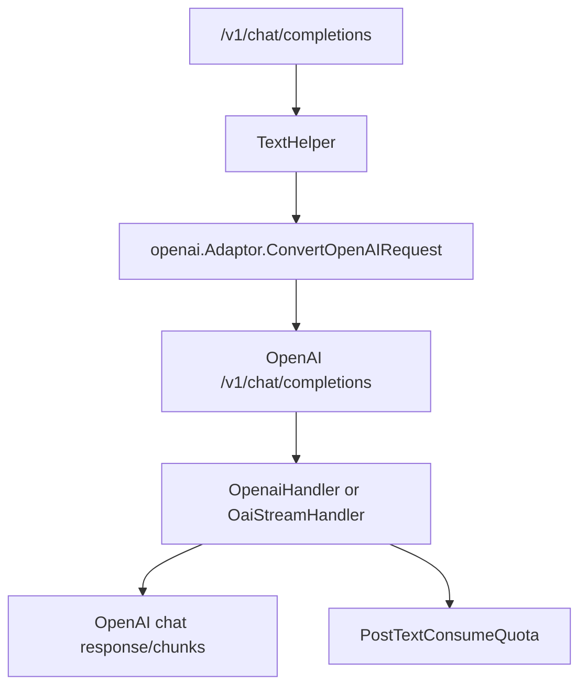
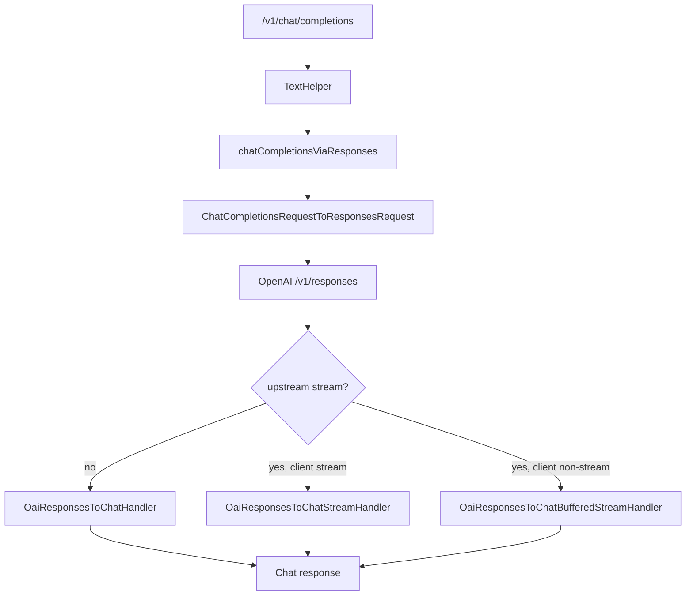
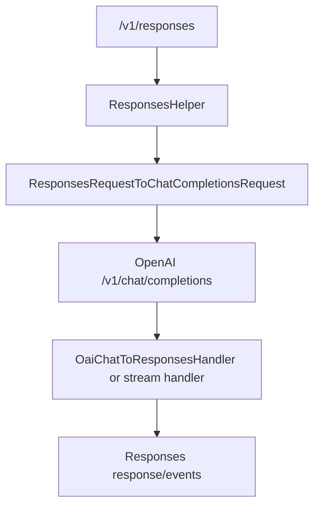
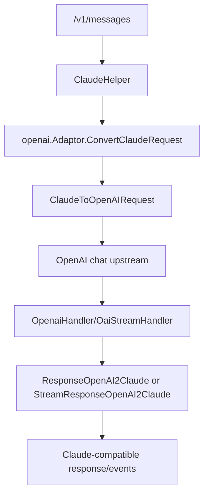
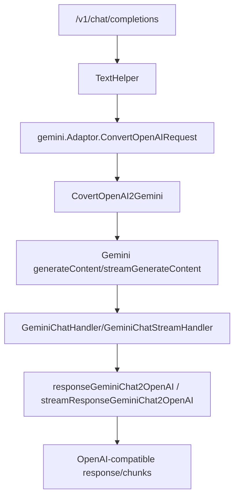

# Chat、Responses、工具调用与协议转换学习指南

这篇文档专门讲 new-api 文本协议层最核心、也最容易绕晕的一组逻辑：

- OpenAI Chat Completions：`/v1/chat/completions`、`/v1/completions`。
- OpenAI Responses：`/v1/responses`、`/v1/responses/compact`。
- Claude Messages：`/v1/messages`。
- Gemini native：`/v1beta/models/*path` 中的 generate/stream generate。
- 工具调用：OpenAI `tool_calls`、Responses `function_call`、Claude `tool_use`、Gemini `functionCall`。
- 流式转换：Chat chunk、Responses event、Claude event、Gemini SSE 之间互转。

前面的 `relay-error-retry-streaming-guide-for-go-learners.md` 已经讲过 relay 主流程、错误、重试和计费闭环；这里更聚焦“协议对象如何长成、怎么互转、工具调用怎么不丢信息”。

## 一句话总览

new-api 的文本 relay 不是简单 HTTP 反代，而是一个协议转换器：



关键思想：

- 客户端入口协议由 router 决定，写入 `RelayFormat`。
- 渠道类型由 `Distribute` 选择结果决定，写入 `ApiType` / `ChannelType`。
- helper 负责通用处理：deep copy、模型映射、系统提示、字段过滤、param override、请求体构造、调用 adaptor。
- adaptor 负责 provider 差异：OpenAI、Claude、Gemini、Azure、OpenRouter 等。
- 响应 handler 负责把上游结果转回客户端期待的协议格式。
- usage 最终统一成 `dto.Usage`，再进入 `PostTextConsumeQuota` 或音频计费。

## 路由入口和 RelayFormat

`router/relay-router.go` 把文本类协议映射为不同 `RelayFormat`：

| 路由 | RelayFormat | Helper |
| --- | --- | --- |
| `POST /v1/completions` | `openai` | `TextHelper` |
| `POST /v1/chat/completions` | `openai` | `TextHelper` |
| `POST /v1/responses` | `openai_responses` | `ResponsesHelper` |
| `POST /v1/responses/compact` | `openai_responses_compaction` | `ResponsesHelper` |
| `POST /v1/messages` | `claude` | `ClaudeHelper` |
| `POST /v1beta/models/*path` | `gemini` | `GeminiHelper` 或 embedding handler |

`types/relay_format.go` 里定义了这些格式。`relay/constant/relay_mode.go` 再根据 URL 细分 `RelayMode`，例如 chat completions、responses、responses compact、gemini 等。

这里要分清两个概念：

- `RelayFormat`：客户端请求的协议格式，比如 OpenAI、Claude、Gemini、Responses。
- `RelayMode`：具体接口模式，比如 chat、responses、embedding、image、audio。

同一个 `RelayFormatOpenAI` 下可以有 chat、completions、moderations 等不同 mode。

## RelayInfo：协议转换的上下文

`relay/common/relay_info.go` 的 `RelayInfo` 是文本 relay 的运行时上下文。

这篇最关注这些字段：

| 字段 | 作用 |
| --- | --- |
| `RelayFormat` | 客户端入口协议 |
| `RelayMode` | 当前接口模式 |
| `OriginModelName` | 用户请求的模型名 |
| `UpstreamModelName` | 模型映射后发给上游的模型名 |
| `ApiType` / `ChannelType` | 选中的上游渠道类型 |
| `IsStream` | 当前是否按流式处理 |
| `ShouldIncludeUsage` | OpenAI stream 是否应返回 usage chunk |
| `SupportStreamOptions` | 渠道是否支持 `stream_options` |
| `ClaudeConvertInfo` | OpenAI/Claude 流式互转状态 |
| `ResponsesUsageInfo` | Responses built-in tool 调用计数 |
| `RequestConversionChain` | 请求协议转换链 |
| `FinalRequestRelayFormat` | 最终上游请求格式 |
| `StreamStatus` | 流式扫描结束状态 |

`GenRelayInfo` 根据 `RelayFormat` 创建不同的 info：

- OpenAI：`GenRelayInfoOpenAI`
- Claude：`GenRelayInfoClaude`，会初始化 `ClaudeConvertInfo`
- Gemini：`GenRelayInfoGemini`
- Responses：`GenRelayInfoResponses`，会初始化 `ResponsesUsageInfo`
- Responses compact：`GenRelayInfoResponsesCompaction`

`RequestConversionChain` 的记录点很简单：

```go
relaycommon.AppendRequestConversionFromRequest(info, convertedRequest)
```

它会根据转换后的 DTO 类型猜格式：

- `dto.GeneralOpenAIRequest` -> `openai`
- `dto.OpenAIResponsesRequest` -> `openai_responses`
- `dto.ClaudeRequest` -> `claude`
- `dto.GeminiChatRequest` -> `gemini`

这条链最后会进消费日志的 `Other.request_conversion`，排查“客户端发 Claude，为什么上游收到 OpenAI/Responses”时非常有用。

## DTO 地图

### Chat Completions

Chat 请求主要在 `dto/openai_request.go`：

```go
type GeneralOpenAIRequest struct {
    Model               string
    Messages            []Message
    Stream              *bool
    StreamOptions       *StreamOptions
    MaxTokens           *uint
    MaxCompletionTokens *uint
    Temperature         *float64
    TopP                *float64
    Tools               []ToolCallRequest
    ToolChoice          any
    ResponseFormat      *ResponseFormat
    ReasoningEffort     string
    Store               json.RawMessage
    SafetyIdentifier    json.RawMessage
}
```

几个设计点：

- 可选 scalar 字段多用指针，例如 `*bool`、`*uint`、`*float64`，这样能区分“没传”和“显式传 0/false”。
- provider 特有字段多用 `json.RawMessage`，让 unknown shape 能保留下来。
- `Tools` 是结构化字段，因为工具调用需要参与 token 估算和协议转换。
- `GetSystemRoleName()` 会对 o 系列和 GPT-5 类模型把 system role 转成 developer role。

`ToolCallRequest`：

```go
type ToolCallRequest struct {
    ID       string
    Type     string
    Function FunctionRequest
    Custom   json.RawMessage
}
```

`Custom` 用来承接 Responses custom tool 或其他非 function 工具形态。

### Chat 响应和流式 chunk

`dto/openai_response.go` 中：

- `OpenAITextResponse`：非流式 chat completion 响应。
- `ChatCompletionsStreamResponse`：流式 chunk。
- `ToolCallResponse`：assistant 工具调用。
- `Usage`：统一 usage 容器。

流式工具调用有几个关键字段：

```go
type ToolCallResponse struct {
    Index    *int
    ID       string
    Type     any
    Function FunctionResponse
}
```

- `Index` 只在 chunk 中稳定标识“第几个工具调用”。
- `ID`、`Type`、`Function.Name` 通常只在首段出现，后续 delta 可能只有 arguments。
- `Function.Arguments` 是字符串增量，需要拼接。

`ChatCompletionsStreamResponse.ClearToolCalls()` 会清空 tool call 的 `id/type/name`，用于某些流式兼容场景避免重复发送元信息。

### Responses 请求和响应

Responses 请求在 `dto/openai_request.go` 的后半部分，响应在 `dto/openai_response.go`：

```go
type OpenAIResponsesResponse struct {
    ID                string
    Object            string
    CreatedAt         int
    Status            json.RawMessage
    IncompleteDetails *IncompleteDetails
    Model             string
    Output            []ResponsesOutput
    Tools             []map[string]any
    Usage             *Usage
}
```

`ResponsesOutput` 是 Responses 的核心输出 item：

```go
type ResponsesOutput struct {
    Type      string
    ID        string
    Status    string
    Role      string
    Content   []ResponsesOutputContent
    CallId    string
    Name      string
    Arguments json.RawMessage
}
```

常见 `Type`：

- `message`
- `reasoning`
- `function_call`
- `custom_tool_call`
- `image_generation_call`
- `web_search_call`

Responses stream event 由 `ResponsesStreamResponse` 表示：

- `response.created`
- `response.output_item.added`
- `response.output_text.delta`
- `response.function_call_arguments.delta`
- `response.function_call_arguments.done`
- `response.output_item.done`
- `response.completed`
- `response.incomplete`
- `response.failed`
- `response.error`

## TextHelper：Chat Completions 主流程

`relay/compatible_handler.go` 的 `TextHelper` 处理 OpenAI-compatible 文本请求。

主流程：



关键细节：

1. `DeepCopy` 是为了不要修改 `info.Request` 原对象。
2. `ModelMappedHelper` 会把用户模型映射为渠道上游模型。
3. 如果请求带 `web_search_options`，会把 search context size 放到 gin context，后续计费用。
4. `StreamOptions` 只有在渠道支持且请求是 stream 时才保留。
5. `ForceStreamOption` 可强制给流式请求加 `include_usage: true`。
6. `SystemPrompt` 在转换后注入，只有 converted request 还是 OpenAI request 时才直接操作。
7. 敏感或额外计费字段通过 `RemoveDisabledFields` 默认过滤。
8. `ParamOverride` 在过滤后应用。

### Chat via Responses 旁路

如果这些条件都满足：

- 当前 mode 是 `RelayModeChatCompletions`
- 没有全局 pass-through
- 渠道没有开启 body pass-through
- `ShouldChatCompletionsUseResponsesGlobal(...)` 返回 true

则 `TextHelper` 不走普通 `ConvertOpenAIRequest`，而是走：

```go
chatCompletionsViaResponses(c, info, adaptor, request)
```

这表示：客户端发的是 Chat Completions，但上游要用 Responses API。

这个策略默认不开。`setting/model_setting/global.go` 中默认 `enabled=false`、`all_channels=true`。真正判断在 `service/relayconvert/policy.go`：先看策略是否启用，再看 channel id/type 是否命中，最后用 `model_patterns` 正则匹配模型。所以即使配置里 `all_channels=true`，只要 `enabled=false` 或模型正则不匹配，也不会进入 Chat via Responses。

## Chat -> Responses 请求转换

转换入口：

- `relay/chat_completions_via_responses.go`
- `service.ChatCompletionsRequestToResponsesRequest`
- `service/relayconvert/chat_to_responses.go`

`ChatCompletionsRequestToResponsesRequest` 做这些映射：

| Chat | Responses |
| --- | --- |
| `messages[].role=system/developer` | 合并到 `instructions` |
| 普通 user/assistant message | `input` 数组 item |
| text content | `input_text` 或 `output_text` |
| image_url | `input_image` |
| input_audio | `input_audio` |
| file | `input_file` |
| video_url | `input_video` |
| assistant `tool_calls` | `function_call` item |
| tool/function role message | `function_call_output` item |
| `tools[].function` | Responses `tools[].type=function` |
| `tool_choice.function.name` | Responses `{type:"function", name:"..."}` |
| `response_format` | Responses `text.format` |
| `max_tokens/max_completion_tokens` | `max_output_tokens` |
| `reasoning_effort` | `reasoning.effort` + `summary=detailed` |

限制和兜底：

- `n > 1` 不支持，会返回错误。
- tool/function 输出如果缺少 `tool_call_id`，会降级为一条 user 文本：`[tool_output_missing_call_id] ...`。
- unknown tool type 会尽量保留原始 shape。
- image URL 支持 string、map、`MessageImageUrl` 等形态，尽量归一成 Responses 需要的值。

这不是字段全量无损转换。当前 Chat -> Responses 输出重点覆盖 messages、多模态 content、tools、tool_choice、response_format、max tokens、reasoning effort 等核心字段；一些 Chat 或 provider 扩展字段没有显式映射，例如 `stop`、`seed`、`logprobs`、`frequency_penalty`、`presence_penalty`、`service_tier`、`safety_identifier`、`prompt_cache_key` 等。阅读这段代码时不要假设 `GeneralOpenAIRequest` 中所有字段都会进入 `OpenAIResponsesRequest`。

`chatCompletionsViaResponses` 转换后会临时修改：

- `info.RelayMode = RelayModeResponses`
- `info.RequestURLPath = "/v1/responses"`

并在 defer 中恢复原值。这样 OpenAI/Azure adaptor 会按 Responses URL 构造上游请求，但外层仍然知道这是一个 Chat 客户端请求。

## ResponsesHelper：Responses 主流程

`relay/responses_handler.go` 的 `ResponsesHelper` 处理 `/v1/responses` 和 `/v1/responses/compact`。

流程和 `TextHelper` 类似：

1. `InitChannelMeta`
2. 检查 compact 是否只给 OpenAI/Codex API type 使用
3. 把 compaction request 适配成普通 `OpenAIResponsesRequest`
4. `DeepCopy`
5. `ModelMappedHelper`
6. `GetAdaptor + Init`
7. pass-through 或 `ConvertOpenAIResponsesRequest`
8. `RemoveDisabledFields`
9. `ApplyParamOverride`
10. `DoRequest`
11. `DoResponse`
12. 根据 mode 做计费结算

Responses compact 的特殊点：

- `/v1/responses/compact` 只支持 OpenAI / Codex API type。
- 请求类型是 `OpenAIResponsesCompactionRequest`，内部转成 `OpenAIResponsesRequest` 的子集。
- 响应后会重新跑一次 `ModelPriceHelper`，用原模型价格做 compact 计费结算，再恢复 `OriginModelName` 和 `PriceData`。

## Responses -> Chat 请求转换

如果客户端发 `/v1/responses`，但上游只支持 Chat Completions，就需要转成 Chat 请求。

入口：

- `service.ResponsesRequestToChatCompletionsRequest`
- `service/relayconvert/responses_request_to_chat.go`
- `relay/channel/openai/responses_via_chat.go`

转换前会拒绝一些 stateful Responses 字段：

- `conversation`
- `previous_response_id`
- `prompt`
- `context_management`

原因：这些字段表示 Responses API 的有状态能力，Chat Completions 没有等价表达，强行转换会误导用户。

主要映射：

| Responses | Chat |
| --- | --- |
| `instructions` | system message |
| `input` string | user message |
| `input[]` role item | chat message |
| `input_text/output_text/text` | text content |
| `input_image` | image_url content |
| `input_file` | file content |
| `input_audio` | input_audio content |
| `input_video` | video_url content |
| `function_call` | append 到最近 assistant message 的 `tool_calls` |
| `custom_tool_call` | custom tool call |
| `function_call_output` | role=tool message |
| `tools[].type=function` | Chat function tool |
| `tool_choice {type:function,name}` | Chat `{type:function,function:{name}}` |
| `text.format` | `response_format` |
| `reasoning.effort` | `reasoning_effort` |
| `max_output_tokens` | `max_completion_tokens` |

`appendToolCallToLastAssistant` 是工具调用转换的关键：Responses 的 function_call 是独立 input item，而 Chat 需要它挂在 assistant message 上。如果当前最后一条不是 assistant，就新建一条空 assistant message。

## OpenAI adaptor：URL、header 和协议选择

`relay/channel/openai/adaptor.go` 是 OpenAI-compatible 上游的适配器。

### URL

OpenAI 普通渠道默认直接拼 `ChannelBaseUrl + RequestURLPath`。

特殊情况：

- Azure chat：`/openai/deployments/{deployment}/{task}?api-version=...`
- Azure Responses：`/openai/v1/responses` 或 `/openai/responses`
- Responses compact：追加 `/compact`
- Claude/Gemini 入口如果走 OpenAI-compatible 上游，默认打 `/v1/chat/completions`
- Realtime 会把 http/https base URL 改成 ws/wss

### Header

- OpenAI：`Authorization: Bearer {key}`
- Azure：`api-key: {key}`
- OpenRouter：补 `HTTP-Referer` 和 `X-OpenRouter-Title`
- Realtime WebSocket：可能使用 `Sec-WebSocket-Protocol` 携带 `openai-insecure-api-key`
- Header override 如果设置了 Authorization，会跳过默认 Authorization

### OpenAI 请求转换

`ConvertOpenAIRequest` 主要做 provider/model 兼容：

- 非 OpenAI/Azure 渠道移除 `StreamOptions`。
- OpenRouter 默认加 `usage.include=true`。
- OpenRouter 的 `-thinking` 后缀转成 `reasoning` 参数。
- OpenAI o 系列和 GPT-5 系列会把 `max_tokens` 转成 `max_completion_tokens`。
- o 系列会移除 temperature。
- GPT-5 会移除 temperature、top_p、logprobs 等不支持字段。
- reasoning effort 后缀会解析到 `ReasoningEffort`。
- o 系列/GPT-5 下 system role 可能改成 developer role。

`ConvertOpenAIResponsesRequest` 则处理 Responses 的 reasoning effort 后缀，并写入 `info.ReasoningEffort`。

## OpenAI Chat 响应处理

`relay/channel/openai/relay-openai.go`：

### 非流式 `OpenaiHandler`

流程：

1. 读取上游 body。
2. 解析 `OpenAITextResponse`。
3. 如果响应里有 OpenAI error，转成 `NewAPIError`。
4. 如果 finish reason 是 `content_filter`，写 admin reject reason。
5. 如果 usage 缺失或 prompt tokens 为 0，用估算 prompt + 输出文本 token 补 usage。
6. `applyUsagePostProcessing` 补 provider 特殊 usage。
7. 根据客户端 `RelayFormat` 输出：
   - OpenAI：原样或 force format 后返回。
   - Claude：`service.ResponseOpenAI2Claude`
   - Gemini：`service.ResponseOpenAI2Gemini`
8. 返回 `dto.Usage` 给 helper 结算。

### 流式 `OaiStreamHandler`

流程：

1. 用 `StreamScannerHandler` 扫 SSE。
2. 保留 `lastStreamData`，每次收到新 data 时先发送上一段。
3. `processTokenData` 累积文本、reasoning、工具名和 arguments，用于没有 usage 时估算 completion tokens。
4. 最后一段用 `handleLastResponse` 提取 id、created、model、usage、system fingerprint。
5. 没有 usage 时 `ResponseText2Usage` 估算，工具调用额外加 `toolCount * 7` completion tokens。
6. `HandleFinalResponse` 根据客户端格式补最终事件：
   - OpenAI：可能补 usage chunk，然后 `[DONE]`
   - Claude：补 Claude 结束事件
   - Gemini：补 Gemini 结束响应

一个微妙点：为了知道最后一段是否只是 usage/finish chunk，代码延迟一拍发送流式数据。这样能在 `ShouldIncludeUsage=false` 时避免把纯 usage chunk 发给客户端。

## Responses 响应处理

### 原生 Responses 非流式

`OaiResponsesHandler`：

1. 读取 body。
2. 解析 `OpenAIResponsesResponse`。
3. 检查 error。
4. 如果有 `image_generation_call`，在 context 里标记质量和尺寸，后续计费用。
5. 原样写回 Responses body。
6. 把 Responses usage 映射为通用 `dto.Usage`：
   - `input_tokens` -> `PromptTokens`
   - `output_tokens` -> `CompletionTokens`
   - `total_tokens` -> `TotalTokens`
   - `input_tokens_details.cached_tokens` -> cached tokens
7. 根据 `response.Tools` 统计 built-in tool 调用次数。

### 原生 Responses 流式

`OaiResponsesStreamHandler`：

1. 扫 SSE event。
2. 早期 lifecycle event 如 `response.created`、`response.in_progress` 会先 pending。
3. 一旦真正有内容，再 flush pending events。
4. `response.failed` / `response.error` 转成 `NewAPIError`。
5. 只有看到 `response.completed` 才认为正常完成。
6. EOF 但没看到 completed，会生成 `responses stream closed before response.completed`。
7. `response.output_text.delta` 累积文本，用于 usage fallback。
8. `response.output_item.done` 中的 `web_search_call` 会计入 built-in web search call count。

为什么要 pending 早期 event？

如果上游一开始只发了 `response.created`，然后立刻失败，而下游 response writer 还没开始写，new-api 还能返回正常 JSON 错误。如果太早把 lifecycle event 写给客户端，HTTP 头已经发出，后面只能在流里补错误事件。

## Chat 响应转 Responses

用于两种场景：

- 客户端请求 Responses，但上游打了 Chat。
- 上游 Chat stream 要对客户端表现成 Responses stream。

入口：

- `relay/channel/openai/responses_via_chat.go`
- `service.ChatCompletionsResponseToResponsesResponse`
- `relayconvert.ChatCompletionsStreamChunkToResponsesEvents`

### 非流式

`ChatCompletionsResponseToResponsesResponse`：

- Chat message content -> Responses `output[].type=message` + `output_text`
- reasoning content -> Responses `output[].type=reasoning` + `summary_text`
- Chat `tool_calls` -> Responses `function_call` output item
- finish reason:
  - `length` -> status `incomplete` + reason `max_output_tokens`
  - `content_filter` -> status `incomplete` + reason `content_filter`
  - 其他 -> `completed`
- Chat usage -> Responses usage：
  - prompt -> input
  - completion -> output
  - total -> total

### 流式

`ChatToResponsesStreamState` 维护状态：

- 是否已发 `response.created`
- 文本 output index
- reasoning output index
- 工具调用按 chat index 聚合
- output item 顺序
- 已累积文本和 reasoning
- usage

Chat chunk 到 Responses event 的映射：

| Chat chunk | Responses event |
| --- | --- |
| 首个 chunk | `response.created` |
| content delta | `response.output_item.added` + `response.output_text.delta` |
| reasoning delta | reasoning item added + reasoning summary delta |
| tool_calls delta | function_call output item + arguments delta |
| finish_reason | text/tool/reasoning done events |
| finalize | `response.completed` 或 `response.incomplete` |

工具调用里如果缺少 ID，会生成 `{responseID}_call_{index}`，保证 Responses 的 `call_id` 可用。

## Responses 响应转 Chat

用于 Chat via Responses，以及 Responses stream 对 Chat 客户端的兼容。

入口：

- `relay/channel/openai/chat_via_responses.go`
- `service.ResponsesResponseToChatCompletionsResponse`
- `relayconvert.ResponsesStreamEventToChatChunks`

### 非流式

`ResponsesResponseToChatCompletionsResponse`：

- 优先提取 assistant message output_text。
- reasoning output -> `Message.ReasoningContent`
- `function_call` / `custom_tool_call` output -> `tool_calls`
- status incomplete:
  - reason `content_filter` -> finish reason `content_filter`
  - 其他 -> `length`
- 如果有 tool calls，finish reason 是 `tool_calls`
- Responses usage -> Chat usage：
  - input -> prompt
  - output -> completion
  - total -> total

### 流式

`ResponsesToChatStreamState` 维护：

- response id/model/created
- usage
- 是否已发起始 role chunk
- 是否看到 tool call
- tool key 到 index 的映射
- output index、item id、call id 到 tool key 的映射
- pending arguments
- usage text

Responses event 到 Chat chunk 的映射：

| Responses event | Chat chunk |
| --- | --- |
| `response.created` | role=assistant 起始 chunk |
| `response.output_text.delta` | delta.content |
| reasoning delta | delta.reasoning_content |
| `response.output_item.added/done` tool item | tool_calls 元信息 |
| function args delta/done | tool_calls.function.arguments 增量 |
| completed/done/incomplete | finish chunk |
| failed/error | NewAPIError |

`OaiResponsesToChatStreamHandler` 还有一个重要分支：如果客户端原本是 Claude 或 Gemini 格式，它会先把 Responses event 转成 Chat chunk，再调用 `HandleStreamFormat` 转成 Claude/Gemini 流式事件。

注意 `response.done` 和 `response.completed` 在不同路径里的语义不完全一样：

- Responses -> Chat 兼容桥把 `response.completed`、`response.done`、`response.incomplete` 都作为终止事件处理。
- 原生 `/v1/responses` 的 `OaiResponsesStreamHandler` 只在看到 `response.completed` 时把 `completed=true`；如果 EOF 前没有 completed，会按 `responses stream closed before response.completed` 处理。

所以排查 Responses 流式 EOF 问题时，要先确认走的是原生 Responses 转发，还是 Responses -> Chat 兼容桥。

## ClaudeHelper：Claude Messages 主流程

`relay/claude_handler.go` 处理 `/v1/messages`。

主流程：

1. `InitChannelMeta`
2. deep copy `ClaudeRequest`
3. `ModelMappedHelper`
4. 获取 adaptor
5. 默认补 `max_tokens`
6. 处理 Claude thinking/adaptive thinking 后缀
7. 注入或覆盖 system prompt
8. 如果开启 Chat via Responses：Claude -> OpenAI -> Responses 上游
9. 否则 pass-through 或 `adaptor.ConvertClaudeRequest`
10. 过滤 disabled fields
11. param override
12. DoRequest
13. DoResponse
14. `PostTextConsumeQuota`

Claude 的 `MaxTokens` 必须有值，所以 helper 会用 Claude setting 的默认值补齐。

Claude thinking 相关逻辑较多：

- `-thinking` 后缀可触发 thinking adapter。
- Opus 4.7/4.8 使用 adaptive thinking high effort。
- 某些模型会移除 temperature/top_p/top_k。
- `OutputConfig` 可携带 effort。

## Claude 与 OpenAI 互转

### Claude -> OpenAI

当 Claude 客户端请求打到 OpenAI-compatible 上游时：

```go
openai.Adaptor.ConvertClaudeRequest
  -> service.ClaudeToOpenAIRequest
  -> openai.Adaptor.ConvertOpenAIRequest
```

也就是说 Claude request 先变成 `GeneralOpenAIRequest`，再复用 OpenAI adaptor 的兼容逻辑。

如果渠道支持 stream options 且请求是 stream，会强制：

```go
StreamOptions{IncludeUsage: true}
```

这是因为 Claude 流式结算需要尽量拿到 usage。

### OpenAI -> Claude

当 OpenAI 客户端请求打到 Claude 上游时：

```go
claude.Adaptor.ConvertOpenAIRequest
  -> RequestOpenAI2ClaudeMessage
```

`relay/channel/claude/relay-claude.go` 负责：

- OpenAI messages -> Claude messages/system
- OpenAI tools -> Claude tools
- OpenAI tool_choice -> Claude tool_choice
- image/file/media content -> Claude content block
- thinking / cache / beta header 等 provider 细节

### Claude response -> OpenAI

Claude 上游响应在 `ClaudeHandler` / `ClaudeStreamHandler` 中转回 OpenAI：

- `ResponseClaude2OpenAI`
- `StreamResponseClaude2OpenAI`

Claude usage 语义不同，cache read/write token 要分开处理。转换后会标记 `UsageSemantic`，后续计费用它判断 cache 是否已包含在 input tokens 中。

### OpenAI response -> Claude

OpenAI-compatible 上游响应给 Claude 客户端时：

- 非流式：`service.ResponseOpenAI2Claude`
- 流式：`service.StreamResponseOpenAI2Claude`

`ClaudeConvertInfo` 维护：

- 上一个 message 类型：text / tools / thinking
- 当前 content block index
- usage
- finish reason
- tool call base index 和最大 offset
- 是否 done

这是因为 Claude stream 是 event + content block 模型，OpenAI stream 是 choice delta 模型，两者不能一对一简单映射。

## GeminiHelper：Gemini native 主流程

`relay/gemini_handler.go` 处理 Gemini native generateContent / streamGenerateContent。

主流程：

1. `InitChannelMeta`
2. deep copy `GeminiChatRequest`
3. `ModelMappedHelper`
4. Gemini thinking adapter
5. 获取 adaptor
6. 注入或覆盖 `SystemInstructions`
7. 清理空 system instruction
8. pass-through 或 `adaptor.ConvertGeminiRequest`
9. param override
10. DoRequest
11. DoResponse
12. `PostTextConsumeQuota`

Gemini thinking 有几个特殊规则：

- `thinkingBudget=0` 可识别为 no-thinking 请求。
- 如果模型价格表里存在 `-nothinking` 价格，可能把 `OriginModelName` 切到 no-thinking 计费模型。
- `-thinking-number` 后缀会被规整。

## Gemini 与 OpenAI/Responses 互转

### Gemini -> OpenAI

当 Gemini 客户端请求打到 OpenAI-compatible 上游时：

```go
openai.Adaptor.ConvertGeminiRequest
  -> service.GeminiToOpenAIRequest
  -> openai.Adaptor.ConvertOpenAIRequest
```

Gemini role、parts、function call 会转换为 OpenAI messages/tools。

Gemini -> Claude native 不是完整矩阵的一部分。`claude.Adaptor.ConvertGeminiRequest` 当前返回 `not implemented`。如果要把 Gemini 客户端请求发到 Claude 能力上，必须看是否存在先转 OpenAI 再转其他协议的具体渠道路径；不能假设所有格式之间都能任意互转。

### OpenAI -> Gemini

当 OpenAI 客户端请求打到 Gemini 上游时：

```go
gemini.Adaptor.ConvertOpenAIRequest
  -> CovertOpenAI2Gemini
```

`relay/channel/gemini/relay-gemini.go` 负责：

- messages -> contents
- system/developer -> systemInstruction
- text/image/audio/file/video parts -> Gemini parts
- tools/function declarations -> Gemini tools
- tool_choice -> toolConfig
- generation config、safety settings、thinking config

### Responses -> Gemini

Gemini adaptor 也实现了 `ConvertOpenAIResponsesRequest`：

- 预处理 Responses request。
- 过滤 Gemini 不支持或不应透传的 Responses tools/input。
- 转成 `GeminiChatRequest`。
- Gemini response 再通过 `relay/channel/gemini/relay_responses.go` 转成 OpenAI Responses JSON/SSE。

这条链意味着：客户端可以发 Responses，渠道可以是 Gemini，上游实际收到 Gemini native request，客户端仍收到 Responses 格式。

这里有一个重要取舍：`relay/channel/gemini/adaptor_responses.go` 目前只保留 Responses function tools。custom/freeform tools 以及对应的 custom tool call input/output 会被跳过，源码注释也说明要等 Gemini 有安全等价表示后再支持。也就是说 Gemini Responses 兼容不是 full fidelity。

Claude adaptor 虽然有 `ConvertOpenAIResponsesRequest` 方法以满足接口，但当前返回 `not implemented`。因此 `/v1/responses` 直接选择 Claude 原生上游时不能期待自动 Responses -> Claude native 转换。Claude 请求要走 Responses 上游，当前主要是 ClaudeHelper 中先 Claude -> OpenAI，再进入 Chat Completions via Responses 这条兼容路径。

## 工具调用的四种形态

### OpenAI Chat

请求：

```json
{
  "tools": [
    {
      "type": "function",
      "function": {
        "name": "get_weather",
        "parameters": {}
      }
    }
  ]
}
```

响应：

```json
{
  "tool_calls": [
    {
      "id": "call_x",
      "type": "function",
      "function": {
        "name": "get_weather",
        "arguments": "{\"city\":\"Paris\"}"
      }
    }
  ]
}
```

工具结果作为下一轮消息：

```json
{
  "role": "tool",
  "tool_call_id": "call_x",
  "content": "..."
}
```

### OpenAI Responses

工具声明：

```json
{
  "tools": [
    {
      "type": "function",
      "name": "get_weather",
      "parameters": {}
    }
  ]
}
```

工具调用是 output/input item：

```json
{
  "type": "function_call",
  "call_id": "call_x",
  "name": "get_weather",
  "arguments": "{\"city\":\"Paris\"}"
}
```

工具结果：

```json
{
  "type": "function_call_output",
  "call_id": "call_x",
  "output": "..."
}
```

### Claude

Claude 使用 content block：

- tool use：`type=tool_use`
- tool result：`type=tool_result`
- tool schema 在 `tools`。

转换时需要维护 content block index，所以有 `ClaudeConvertInfo.Index` 和 `LastMessagesType`。

### Gemini

Gemini 使用 part：

- function call：`functionCall`
- function response：`functionResponse`
- tool declaration：`functionDeclarations`

转换时还要处理 role：

- Gemini 的 model/user 与 OpenAI assistant/user 之间转换。
- function response 可能需要挂到 user turn。

## 工具调用流式转换的难点

工具调用最难的是流式增量。

OpenAI Chat stream 可能长这样：

1. 第一段给 `tool_calls[0].id/type/function.name`
2. 后续多段只给 `tool_calls[0].function.arguments` 的片段
3. 最后一段 finish reason 是 `tool_calls`

Responses stream 则是：

1. `response.output_item.added`，声明一个 function_call item
2. 多段 `response.function_call_arguments.delta`
3. `response.function_call_arguments.done`
4. `response.output_item.done`

因此转换状态机必须记录：

- Chat tool index -> Responses output index
- Responses output index/item id/call id -> Chat tool index
- 已经发送过 tool name/id 没有
- arguments 累积到哪里
- done 时是否还有 pending arguments 要 flush

相关状态结构：

- `relayconvert.ChatToResponsesStreamState`
- `relayconvert.ResponsesToChatStreamState`
- `relaycommon.ClaudeConvertInfo`

读源码时重点看 map 字段：

```go
toolByKey
outputIndexToKey
itemIDToKey
callIDToKey
pendingArgsByOutputIndex
pendingArgsByItemID
```

这些 map 的存在说明一件事：流式协议转换不是“看到一段转一段”那么简单，它需要记忆前文。

## Usage 统一和计费入口

不管上游是什么协议，最终都要返回 `*dto.Usage`。

### Chat usage

OpenAI Chat：

- `prompt_tokens`
- `completion_tokens`
- `total_tokens`
- `prompt_tokens_details`
- `completion_tokens_details`

如果上游不返回 usage，new-api 用：

```go
service.ResponseText2Usage(c, outputText, upstreamModel, estimatePromptTokens)
```

估算 usage。

流式 Chat 如果没有 usage：

- 累积 content + reasoning。
- 工具调用把 name 和 arguments 也计入文本。
- 额外加 `toolCount * 7` completion tokens。

### Responses usage

Responses usage：

- `input_tokens` -> prompt/input
- `output_tokens` -> completion/output
- `total_tokens`
- `input_tokens_details.cached_tokens`

转换函数：

- `UsageFromResponsesUsage`
- `UsageFromChatUsage`

### Claude usage

Claude usage 有 cache read/write 语义：

- input tokens
- output tokens
- cache read input tokens
- cache creation input tokens
- 5m / 1h cache creation split

计费层会根据 `UsageSemantic` 区分 OpenAI 聚合语义和 Anthropic 语义，避免 cache token 重复扣费或漏扣。

### Gemini usage

Gemini usage 来自 `UsageMetadata`：

- `PromptTokenCount + ToolUsePromptTokenCount` 作为 prompt/input 侧口径。
- `CandidatesTokenCount + ThoughtsTokenCount` 作为 completion/output 侧口径。
- `ThoughtsTokenCount` 同时进入 reasoning tokens。
- 如果上游缺少 prompt token，会回退到估算 prompt tokens。

这和 OpenAI 的 usage 字段不是完全同名同义，读 `buildUsageFromGeminiMetadata` 时要特别注意 tool-use prompt token 和 thoughts token 的归属。

### Built-in tools surcharge

Responses built-in tools 通过 `ResponsesUsageInfo.BuiltInTools` 计数，例如：

- `web_search_preview`
- `file_search`

非流式会看 `responsesResponse.Tools`，流式会看 `web_search_call` 的 output item done。后续 `service/text_quota.go` 会把 built-in tool 调用附加费加入文本计费。

## 字段过滤和透传边界

文本协议层里有一类字段默认不透传，除非渠道配置允许：

- `service_tier`
- `inference_geo`
- `speed`
- `safety_identifier`
- `stream_options.include_obfuscation`

`store` 默认允许透传，但可以通过渠道设置禁用。注释里明确提到禁用可能影响 Codex 使用。

过滤入口：

```go
relaycommon.RemoveDisabledFields(jsonData, info.ChannelOtherSettings, info.ChannelSetting.PassThroughBodyEnabled)
```

如果全局或渠道开启 pass-through body，则不会做这些结构化转换和过滤，而是复用原始请求体。这时你就不能期待 `RequestConversionChain`、字段过滤、系统提示注入都按普通路径发生。

## 常见完整链路

### 1. Chat 客户端 -> OpenAI 上游 -> Chat 响应



### 2. Chat 客户端 -> Responses 上游 -> Chat 响应



### 3. Responses 客户端 -> Chat 上游 -> Responses 响应



### 4. Claude 客户端 -> OpenAI 上游 -> Claude 响应



### 5. OpenAI 客户端 -> Gemini 上游 -> OpenAI 响应



## 常见误区

### 误区 1：RelayFormat 等于最终上游格式

不一定。`RelayFormat` 是客户端入口格式。最终上游格式要看 adaptor 转换结果和 `FinalRequestRelayFormat`。

### 误区 2：Chat via Responses 只是换 URL

不是。它会先做 Chat -> Responses 请求转换，还要在响应时 Responses -> Chat 转回来。

### 误区 3：Responses 可以无损转 Chat

不是。`conversation`、`previous_response_id`、`prompt`、`context_management` 这类 stateful 字段无法表达成 Chat，会直接报不支持。

反过来 Chat -> Responses 也不是完整无损转换，一些 Chat/provider 扩展参数当前没有显式映射到 Responses request。

### 误区 4：流式转换是纯 stateless

不是。工具调用、reasoning、Responses output item 都需要状态机记忆 index、id、arguments 和 done 状态。

### 误区 5：tool call arguments 可以当 JSON object 处理

OpenAI Chat 响应里的 arguments 是字符串，流式时还是字符串片段。代码需要拼接字符串，不应假设每段都是完整 JSON。

### 误区 6：所有 stream 都以 `[DONE]` 判断成功

Responses stream 要求看到 `response.completed`。EOF 但没有 completed 会变成错误。

### 误区 7：pass-through 仍会做系统提示和字段过滤

不会。pass-through 复用原始 body，跳过结构化转换和过滤。

### 误区 8：Claude usage 可以直接按 OpenAI usage 算

不能。Claude cache read/write 语义不同，计费层要用 `UsageSemantic` 区分。

### 误区 9：`StreamOptions` 总会透传

不会。只有渠道支持且请求是 stream 时才保留；部分非 OpenAI/Azure 渠道会被移除。

### 误区 10：Responses built-in tool 只看 request tools

计费看调用次数。非流式从 response tools/usage info 统计，流式会观察 `web_search_call` 等 output item done。

### 误区 11：OpenAI、Claude、Gemini、Responses 是全矩阵互转

不是。常见主路径做了兼容，但不是任意两种协议都有原生转换。例如 Gemini -> Claude native 当前未实现，Claude adaptor 的 Responses request 转换也未实现。

### 误区 12：Gemini Responses 会保留所有 Responses 工具

不会。当前 Gemini Responses 预处理只保留 function tools，custom/freeform tools 和相关 custom tool call input/output 会被过滤。

## 按源码阅读顺序

建议这样读：

1. `router/relay-router.go`：确认路由到 RelayFormat。
2. `types/relay_format.go`、`relay/constant/relay_mode.go`：分清 format 和 mode。
3. `relay/common/relay_info.go`：看 `RelayInfo` 里和协议转换有关的字段。
4. `dto/openai_request.go`、`dto/openai_response.go`：先掌握 Chat 和 Responses DTO。
5. `relay/compatible_handler.go`：读 `TextHelper` 主流程。
6. `relay/responses_handler.go`：读 `ResponsesHelper` 主流程。
7. `service/relayconvert/chat_to_responses.go`：读 Chat 请求转 Responses。
8. `service/relayconvert/responses_request_to_chat.go`：读 Responses 请求转 Chat。
9. `service/relayconvert/chat_to_responses_response.go`：读 Chat 响应/流转 Responses。
10. `service/relayconvert/responses_to_chat.go`：读 Responses 响应/流转 Chat。
11. `relay/channel/openai/relay-openai.go`：读 Chat 上游响应处理。
12. `relay/channel/openai/relay_responses.go`：读 Responses 原生响应处理。
13. `relay/channel/openai/chat_via_responses.go`、`responses_via_chat.go`：读兼容桥。
14. `relay/claude_handler.go`、`relay/channel/claude/relay-claude.go`、`service/convert.go`：读 Claude 互转。
15. `relay/gemini_handler.go`、`relay/channel/gemini/relay-gemini.go`、`relay/channel/gemini/relay_responses.go`：读 Gemini 互转。

## 给 Go 学习者的练习

### 练习 1：跟一条 Chat via Responses 请求

从 `/v1/chat/completions` 开始，找出这些函数的调用顺序：

- `TextHelper`
- `ShouldChatCompletionsUseResponsesGlobal`
- `chatCompletionsViaResponses`
- `ChatCompletionsRequestToResponsesRequest`
- `ConvertOpenAIResponsesRequest`
- `OaiResponsesToChatHandler` 或 `OaiResponsesToChatStreamHandler`

回答：为什么函数里要临时修改 `info.RelayMode` 和 `info.RequestURLPath`？

### 练习 2：找出不可转换的 Responses 字段

读 `validateResponsesRequestChatUnsupportedFields`，回答：

- 哪些字段不能转 Chat？
- 为什么它们不能转？
- 如果强行转，会给用户造成什么错误预期？

### 练习 3：解释工具调用状态机

读 `ResponsesToChatStreamState`，画出这几个 map 的关系：

- `outputIndexToKey`
- `itemIDToKey`
- `callIDToKey`
- `pendingArgsByOutputIndex`
- `pendingArgsByItemID`

然后回答：为什么只靠 `output_index` 不够？

### 练习 4：比较 Claude 和 OpenAI usage

读 `ResponseClaude2OpenAI`、`buildOpenAIStyleUsageFromClaudeUsage` 和计费文档，回答：

- Claude cache read token 在 OpenAI usage 里放哪里？
- cache creation 5m/1h 如何保留？
- 为什么计费要知道 usage semantic？

### 练习 5：检查一个 provider 是否支持 Responses

任选一个 adaptor，找它是否实现了：

```go
ConvertOpenAIResponsesRequest(...)
```

再看 `DoResponse` 里是否有 Responses 分支。回答：如果没有原生支持，它是报错、透传，还是转 Chat/Gemini？
