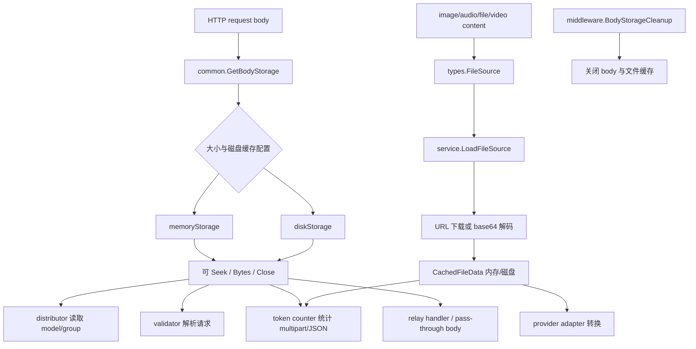

# 请求体、文件资源与多模态输入链路源码学习指南

这篇文档讲 new-api 怎么处理“请求体只能读一次”的 Go HTTP 限制，以及图片、音频、视频、PDF、multipart、URL、base64 等多模态资源如何在 token 计数和 provider adapter 之间复用。

## 一句话总览

new-api 把请求体抽象为可复读的 `common.BodyStorage`，把多模态资源抽象为 `types.FileSource`。前者解决同一个 HTTP body 被 distributor、validator、token counter、relay handler、adapter 多次读取的问题；后者解决 URL/base64 文件在 token 计数、格式转换和 provider 请求构造中重复下载、重复解码和及时清理的问题。



## 关键源码地图

| 文件 | 职责 |
| --- | --- |
| `common/body_storage.go` | `BodyStorage` 接口、内存/磁盘实现、根据大小选择存储、关闭清理。 |
| `common/gin.go` | `GetRequestBody`、`GetBodyStorage`、`UnmarshalBodyReusable`、`ParseMultipartFormReusable`。 |
| `middleware/gzip.go` | gzip / br 请求体解压，并对解压后的 body 使用 `http.MaxBytesReader` 控制最大体积。 |
| `middleware/body_cleanup.go` | 请求结束后清理 body storage 和 FileSource 缓存。 |
| `middleware/request_body_limit.go` | 匿名请求体大小限制。 |
| `types/file_source.go` | URL/base64 文件来源抽象、缓存状态、清理注册状态、`CachedFileData`。 |
| `types/file_data.go` | 旧兼容结构 `LocalFileData`。 |
| `service/file_service.go` | 统一加载 URL/base64、MIME 探测、图片尺寸、磁盘缓存、上下文缓存。 |
| `service/file_decoder.go` | MIME 类型探测和旧接口兼容。 |
| `relay/common/outbound_body.go` | 上游 JSON 请求体包装，把转换后的大 JSON 也放入 `BodyStorage`，降低等待上游时的堆内存驻留。 |
| `service/token_counter.go` | 本地 token 计数时解析 multipart、加载媒体资源、计算图片/音频/文件 token。 |
| `dto/openai_request.go` | OpenAI/Responses 请求中把 image/audio/file/video 解析为 `FileSource`。 |
| `middleware/distributor.go` | 读取 body 中的 model/group，决定是否选渠道。 |
| `relay/*_handler.go` | 在 pass-through 或转换请求时复用原始 body。 |
| `relay/channel/*` | Provider adapter 里把 `FileSource` 转成目标 provider 的格式。 |

## 为什么需要 BodyStorage

Go 的 `http.Request.Body` 默认是一个只能向前读的 stream。new-api 的一个 relay 请求通常要被多处读取：

1. distributor 先读 body 里的 `model` 和 `group`，用于选渠道。
2. 请求校验要解析 JSON、form 或 multipart。
3. token counter 可能还要统计文本、图片、音频 token。
4. handler 需要把请求转换为上游协议。
5. pass-through 模式要把原始 body 直接转发给上游。

如果每一层都直接 `io.ReadAll(c.Request.Body)`，后面的层就读不到数据。`BodyStorage` 的核心价值就是把请求体转成可 `Seek(0)` 的对象，让每层都能从头再读。

## BodyStorage 接口

`common.BodyStorage` 同时实现：

- `io.ReadSeeker`
- `io.Closer`
- `Bytes() ([]byte, error)`
- `Size() int64`
- `IsDisk() bool`

两个实现：

| 实现 | 适用场景 | 特点 |
| --- | --- | --- |
| `memoryStorage` | 小 body 或磁盘缓存不可用 | 用 `bytes.Reader` 保存，关闭时扣减内存统计。 |
| `diskStorage` | 大 body 且磁盘缓存可用 | 写入统一磁盘缓存文件，`Bytes()` 时从文件读，关闭时删除文件。 |

`CreateBodyStorageFromReader` 会根据配置选择内存或磁盘：

1. 请求进入时，`middleware.DecompressRequestMiddleware` 会先处理 gzip / br，并对解压后的 body 套 `http.MaxBytesReader`。
2. 读取 `constant.MaxRequestBodyMB` 作为最大请求体。
3. 如果磁盘缓存启用、`ContentLength` 超过阈值、磁盘可用，则直接流式写入磁盘。
4. 否则读入内存，再交给 `CreateBodyStorage` 判断是否需要磁盘。
5. 读取超过 `maxBytes` 时返回 `ErrRequestBodyTooLarge`。

注意一个细节：如果一开始决定直接写磁盘，而磁盘写失败，代码不会回退到内存，因为原始 reader 已经被消费，无法安全恢复。

## 请求体复读入口

### `GetRequestBody`

`common.GetRequestBody(c)` 是底层入口：

1. 如果 Gin context 里已有 `KeyBodyStorage`，就 `Seek(0)` 后返回。
2. 如果存在旧式 `KeyRequestBody` 字节缓存，就转成 `BodyStorage`。
3. 否则从 `c.Request.Body` 创建新的 `BodyStorage`。
4. 关闭原始 `Request.Body`。
5. 把 storage 缓存在 context 中。

### `GetBodyStorage`

`GetBodyStorage` 是类型更明确的封装：确保返回的是 `BodyStorage`，而不是普通 `io.Seeker`。

### `UnmarshalBodyReusable`

`UnmarshalBodyReusable(c, v)` 用于“解析请求，同时恢复 body”：

- JSON：用项目统一 `common.Unmarshal`。
- 大 JSON 且在磁盘上：直接 `DecodeJson(storage, v)`，避免把整个大 body 再读回堆内存。
- `application/x-www-form-urlencoded`：转成 map 后再 marshal/unmarshal 到结构体。
- `multipart/form-data`：解析 form value，再映射到结构体。
- 解析后 `Seek(0)`，并把 `c.Request.Body = io.NopCloser(storage)`。

### `ParseMultipartFormReusable`

`ParseMultipartFormReusable(c)` 用于音频转写、图片编辑、视频提交等 multipart 场景。它会：

1. 从 `BodyStorage.Bytes()` 获取完整 body。
2. 记录第一次看到的原始 Content-Type 到 `_original_multipart_ct`。
3. 从 Content-Type 中解析 boundary。
4. 用 `multipart.NewReader` 重新构建 form。
5. 结束后恢复 `Request.Body`。

保存原始 Content-Type 很重要，因为有些 adapter 会重建 multipart 并覆盖 header；后续再解析时如果 boundary 变了，就会读不回来。

## 请求结束清理

`middleware.BodyStorageCleanup()` 在请求结束后执行：

1. `common.CleanupBodyStorage(c)` 关闭 body storage。
2. `service.CleanupFileSources(c)` 关闭本请求中注册过的文件缓存。

这一步对磁盘缓存尤其重要：`diskStorage.Close()` 会关闭文件并删除临时文件；`CachedFileData.Close()` 也会删除磁盘上的 base64 文件缓存。

读源码时要记住：资源不是靠 GC 释放，而是靠中间件在请求结束时显式关闭。

全局请求体链路可以记成：解压与最大体积限制 -> `BodyStorageCleanup` 挂好 after hook -> controller/relay/retry 过程中多次复读 body -> 请求结束统一清理。

## 匿名请求体限制

`middleware.AnonymousRequestBodyLimit()` 用于匿名入口的 body 限制：

1. 从 `common.GetAnonymousRequestBodyLimitBytes()` 取最大值。
2. 用 `io.LimitReader(body, maxBytes+1)` 读取。
3. 超出时返回 HTTP 413。
4. 没超出时把 body 替换成新的 `bytes.Reader`。

它和 `BodyStorage` 的职责不同：一个是入口限流，一个是已接受请求后的可复读缓存。

## FileSource 抽象

多模态输入可能来自：

- URL：`https://...`
- base64：纯 base64 字符串
- data URL：`data:image/png;base64,...`

`types.FileSource` 把这些统一起来：

```go
type FileSource interface {
    IsURL() bool
    GetIdentifier() string
    GetRawData() string
    ClearRawData()
    SetCache(data *CachedFileData)
    GetCache() *CachedFileData
    HasCache() bool
    ClearCache()
    IsRegistered() bool
    SetRegistered(registered bool)
    Mu() *sync.Mutex
}
```

当前有两个实现：

- `URLSource`：保存 URL，`ClearRawData` 不清空原始 URL。
- `Base64Source`：保存 base64 和 MIME，`ClearRawData` 会在大于 1024 字符时清空原始数据，减小内存占用。

`NewFileSourceFromData(data, mimeType)` 通过字符串前缀判断：`http://` 或 `https://` 是 URL，否则是 base64。

## CachedFileData 怎么保存文件

`types.CachedFileData` 是加载后的文件内容：

- 小文件：`base64Data` 放内存。
- 大文件：`diskPath` 指向磁盘缓存文件，文件内容是 base64 字符串。
- `MimeType`：MIME 类型。
- `Size`：原始文件字节大小。
- `DiskSize`：磁盘缓存的 base64 字符串大小。
- `ImageConfig`、`ImageFormat`：图片宽高和格式。
- `OnClose`：关闭时扣减磁盘统计。

`GetBase64Data()` 对磁盘缓存会读文件内容；`Close()` 对磁盘缓存会删除文件，对内存缓存会清空字符串。

## LoadFileSource 的完整流程

`service.LoadFileSource(c, source, reason...)` 是文件加载统一入口：

1. 如果 `source` 已有缓存，直接返回，并注册清理。
2. 对 `source.Mu()` 加锁，避免同一个资源并发重复下载/解码。
3. 二次检查缓存。
4. 对 URL：
   - 先查 Gin context 中的 URL cache key。
   - 未命中则 `loadFromURL` 下载。
5. 对 base64：
   - 先查 Gin context 中的 base64 cache key。
   - 未命中则 `loadFromBase64` 解码。
6. 把结果写回 `source.SetCache`。
7. 把结果写入 Gin context，方便同一请求内多个 `FileSource` 命中同一缓存。
8. 注册到 `ContextKeyFileSourcesToCleanup`，请求结束自动关闭。

context cache 的意义是：同一张图片可能在 token counter 里被加载一次，在 adapter 转换里又加载一次；第二次不应重新下载。

## URL 加载与安全

`loadFromURL` 做了这些事：

1. 调用 `DoDownloadRequest(url, reason...)` 下载。
2. 要求 HTTP 200。
3. 用 `io.LimitReader` 限制最大下载大小：`constant.MaxFileDownloadMB`。
4. 读取 bytes 后转为 base64。
5. 智能检测 MIME。
6. 大 base64 走磁盘缓存，小 base64 走内存缓存。
7. 如果是图片，尝试读取宽高和格式。

SSRF 防护不在 `loadFromURL` 本身实现，而是在下载请求入口 `DoDownloadRequest` / HTTP client 相关逻辑中通过 `common.ValidateURLWithFetchSetting` 执行。调用链上还会传 `reason`，方便日志和策略识别下载用途。默认配置会限制私网/保留 IP、端口、域名/IP 规则，并且重定向时也会重新校验。这个保护发生在请求前和重定向阶段，不应理解成能彻底固定连接期 IP 或完全消除 DNS rebinding 风险。

MIME 探测顺序：

1. `Content-Type` header。
2. `Content-Disposition` 文件名扩展名。
3. URL path 扩展名。
4. `http.DetectContentType`。
5. HEIF/HEIC 特殊检测。
6. 图片 decode config。
7. 回退 `application/octet-stream`。

## base64 加载

`loadFromBase64` 支持两种输入：

- 纯 base64。
- `data:<mime>;base64,<data>`。

流程是：

1. 拆掉 data URL 头部。
2. 如果调用方传了 MIME，以调用方 MIME 为准。
3. `base64.StdEncoding.DecodeString` 验证和得到原始大小。
4. 根据 base64 字符串大小决定内存或磁盘缓存。
5. MIME 为空或是图片时，尝试 decode 图片宽高和格式。

这里缓存的是清理后的 base64 字符串，不是原始 bytes。这样 provider adapter 要拼 JSON 请求时可以直接取 base64。

## OpenAI 请求如何变成 FileSource

`dto/openai_request.go` 里，`MediaContent.ToFileSource()` 负责把不同内容类型转成 `FileSource`：

- `image_url`：`MessageImageUrl.Url` 可能是 URL 或 base64。
- `input_audio`：`MessageInputAudio.Data` 是 base64，`Format` 转成 `audio/<format>`。
- `file`：`MessageFile.FileData` 转成文件 source。
- `video_url`：`MessageVideoUrl.Url` 转成 URL source。

`OpenAIRequest.GetTokenCountMeta()` 会遍历 messages：

1. 文本内容合并到 `TokenCountMeta.CombineText`。
2. 图片、音频、文件、视频放入 `TokenCountMeta.Files`。
3. 每个文件记录 `FileType`、`Source`、图片 detail。

Responses API 也类似：`input_image`、`input_file` 会被放入 `FileMeta`。

## token counter 如何使用文件

`service.EstimateRequestToken` 中，多模态 token 计数会：

1. 先统计文本 token。
2. 判断是否需要本地获取媒体文件：
   - Gemini 格式默认不 fetch。
   - `constant.GetMediaToken` 关闭时不 fetch。
   - `GetMediaTokenNotStream` 关闭且非流式时不 fetch。
3. 对每个 `FileMeta`：
   - 如果类型未知，或 URL 且需要 fetch，则调用 `LoadFileSource`。
   - 用 MIME 推断 image/audio/video/file。
4. 图片按 OpenAI 图像 token 规则估算。
5. 音频默认加 256。
6. 视频默认加 `4096 * 2`。
7. 普通文件默认加 4096。

音频转写/翻译是特殊 multipart 路径：它用 `ParseMultipartFormReusable` 取 `file` 字段，打开文件后通过 `common.GetAudioDuration` 按分钟折算 token。

## provider adapter 如何使用文件

不同 provider 的输入格式不同，adapter 会把统一的 `FileSource` 转成目标格式：

- Claude：图片和文档需要 base64 + media type，代码会调用 `service.GetBase64Data`。
- Gemini：多模态 part 需要 inline data，调用 `GetBase64Data` 后填 MIME 和 data。
- AWS Bedrock Claude：把媒体 source 转成 Claude 风格 request，再 marshal 到 AWS request body。
- Ollama：图片需要 base64 数组，adapter 会 fetch image。
- OpenAI image/audio multipart：通过 `ParseMultipartFormReusable` 复用原始 multipart form。
- Replicate 图片编辑会先把本地 multipart 文件上传到上游 `/v1/files`，拿返回 URL 再进入预测请求。
- Dify 会把 base64 图片解码后上传到上游 `/v1/files/upload`，使用返回的 upload file id。
- Pass-through 模式：handler 直接从 `BodyStorage` 取原始 body，而不是重新 marshal。

读 adapter 时可以抓住一个模式：DTO 层只负责把输入抽象成 `FileSource`；真正下载、base64、MIME 探测都放在 `service/file_service.go`。

注意：router 里的 OpenAI `/v1/files` 相关路由当前是 `RelayNotImplemented`，它不是 new-api 自己提供的通用文件存储入口。上面提到的 `/v1/files` 是某些 provider adapter 对上游服务发起的上传。

## pass-through 与 BodyStorage

在 `relay/responses_handler.go`、`relay/*_handler.go` 和 AWS 等 adapter 中，经常看到：

- 全局 `PassThroughRequestEnabled`
- 渠道 `PassThroughBodyEnabled`

开启时，代码会调用 `common.GetBodyStorage(c)`，然后把 storage 作为上游 request body。`common.ReaderOnly(storage)` 用来隐藏 `io.Closer`，避免 `http.NewRequest` 误把底层 storage 当成可关闭 body 并提前关闭。

有些 provider 在 pass-through 时仍要删字段，例如 AWS 会从原始 JSON 里删除 `model` 和 `stream` 后再 marshal，因为 Bedrock InvokeModel 的 model id 不在 body 里。

非 pass-through 的转换请求也有类似资源管理：handler 先 marshal 上游 JSON，再调用 `relay/common.NewOutboundJSONBody`。如果转换后的 JSON 很大，例如包含大 base64 图片，它也可以落到磁盘缓存；上游请求结束后由 caller `defer closer.Close()` 清理。

## multipart 的几个特殊点

multipart 不只出现在 OpenAI audio，也出现在图片编辑、视频提交、Replicate、Sora 等 adapter。

需要注意：

- multipart body 也先进入 `BodyStorage`。
- `ParseMultipartFormReusable` 每次从完整 body 和原始 boundary 重新解析。
- 如果 adapter 重建 multipart，要小心不要破坏后续解析所依赖的 `_original_multipart_ct`。
- `multipartMemoryLimit()` 使用 `constant.MaxFileDownloadMB` 作为内存限制基准。
- form 的临时文件在 `ReadForm` 后通过 `RemoveAll` 清理。
- 如果某个新调用点要把 `multipart.Form` 保留下来跨函数使用，要明确谁负责 `RemoveAll()`；统一清理中间件主要负责 `BodyStorage` 和 `FileSource`，不等于自动清理所有持久化 form 对象。

## 磁盘缓存的两类用途

项目里“磁盘缓存”至少服务两类资源：

1. 请求体 body cache：`DiskCacheTypeBody`，由 `diskStorage` 管理，请求结束删除。
2. 文件 base64 cache：`DiskCacheTypeFile`，由 `CachedFileData` 管理，请求结束删除。

二者都走 common 的统一磁盘缓存统计和清理能力，但生命周期对象不同：

- body cache 由 `common.CleanupBodyStorage` 关闭。
- file cache 由 `service.CleanupFileSources` 关闭。

启动时还有 `CleanupOldCacheFiles` 清理旧缓存，防止进程异常退出留下残留文件。

## 安全与资源边界

这条链路最重要的安全/稳定性点：

- 请求体大小由 `constant.MaxRequestBodyMB` 控制。
- 匿名请求有单独 body limit。
- URL 下载大小由 `constant.MaxFileDownloadMB` 控制。
- 外部 URL 下载应通过统一下载入口做 SSRF 校验。
- 大 body 和大 base64 可以落盘，降低堆内存压力。
- 所有 storage 和 file cache 都要在请求结束关闭。
- `FileSource` 内部加锁，避免并发重复下载。
- context cache 避免同请求重复下载同一个 URL 或重复解码同一个 base64。
- data URL 会剥离头部，避免把 MIME 头误当 base64 内容。
- MIME 探测不能只相信 URL 扩展名，会综合 header、文件名、内容嗅探和图片解码。

## 读源码时的易错点

1. `Request.Body` 原始 stream 只能读一次；项目靠 `BodyStorage` 让它看起来能被多层复读。
2. `BodyStorage.Bytes()` 对磁盘 storage 会把完整文件读回内存；大 JSON 解码因此有专门的 stream decode 分支。
3. `FileSource` 是“来源”，`CachedFileData` 才是“已加载内容”。
4. URL 文件不是创建 `URLSource` 时下载，而是第一次 `LoadFileSource` 时懒加载。
5. 同一请求里的相同 URL/base64 会走 context cache，但跨请求不会复用。
6. `GetMimeType` 可能只为探测 MIME 发起下载；token counter 为了避免重复请求，直接 `LoadFileSource`。
7. Gemini 路径默认不本地 fetch 媒体 token，这会影响本地预估 token。
8. pass-through 不代表完全不碰 body，有些 provider 仍会从原始 body 删除或调整字段。
9. `ReaderOnly(storage)` 很关键，它避免上游 HTTP transport 提前关闭共享的 `BodyStorage`。
10. 清理发生在中间件 after `c.Next()`，handler 内不能在清理后继续异步使用这些 source。

## 建议阅读练习

1. 从 `middleware/distributor.go` 的 `getModelFromRequest` 追到 `common.GetBodyStorage`，看 model 是如何被读取后又恢复 body 的。
2. 从 `dto.OpenAIRequest.GetTokenCountMeta` 追一个 `image_url`，看它如何变成 `types.FileSource`。
3. 从 `service.EstimateRequestToken` 追到 `LoadFileSource`，理解 token 计数什么时候会真的下载 URL。
4. 选一个 adapter，例如 `relay/channel/gemini/relay-gemini.go`，看 `GetBase64Data` 如何把统一 source 转成 provider 格式。
5. 对照 `middleware/body_cleanup.go`，确认每种缓存资源最终由谁关闭。
