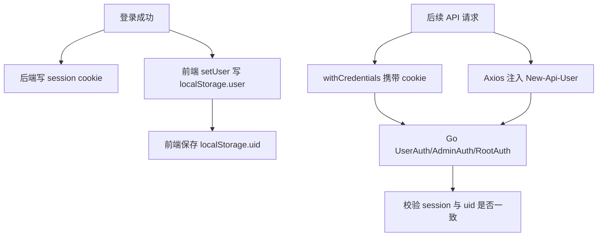
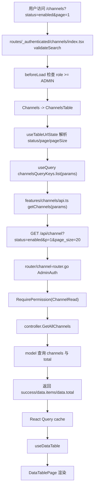

# 默认前端路由、数据流和管理工作流学习指南

这份文档继续深挖 `web/default` 默认前端。已有的 `frontend-default-guide-for-go-learners.md` 更像总览；本文重点解释一个页面动作如何从 React 路由、状态、表格、表单、API client，一路落到 Go 后端的 router/controller/model/service。

读完本文，你应该能回答：

- 默认前端是如何启动并渲染路由的。
- 登录态为什么既有 `localStorage`，又依赖后端 session cookie。
- `/_authenticated`、Admin、Root、细粒度权限分别拦在哪一层。
- `api.ts`、React Query、query key、DataTable、URL search params 怎么协作。
- 用户、渠道、API Key、系统设置、日志这些典型页面如何端到端对上后端。
- 哪些前端判断只是体验层，哪些后端 middleware 才是真正安全边界。

## 一、先建立前端阅读地图

默认前端位于：

```text
web/default/
```

本专题最重要的入口：

```text
web/default/src/main.tsx
web/default/src/routes/__root.tsx
web/default/src/routes/_authenticated/route.tsx
web/default/src/lib/api.ts
web/default/src/stores/auth-store.ts
web/default/src/components/data-table/
web/default/src/hooks/use-table-url-state.ts
web/default/src/features/
```

推荐把前端当成四层来看：

```text
应用外壳层：main.tsx、Provider、RouterProvider、root route
路由守卫层：routes/、validateSearch、beforeLoad、layout
数据协作层：lib/api.ts、React Query、feature/api.ts、DataTable
业务页面层：features/users、channels、keys、system-settings、usage-logs
```

对应的 Go 后端入口主要是：

```text
router/api-router.go
router/channel-router.go
router/authz-router.go
middleware/auth.go
middleware/secure_verification.go
controller/user.go
controller/token.go
controller/channel.go
controller/option.go
controller/log.go
model/user.go
model/token.go
model/channel.go
model/option.go
```

前端源码的核心读法不是“从组件树向下随便点”，而是按真实用户动作走：

```text
URL
  -> route validateSearch / beforeLoad
  -> feature index
  -> provider / table / drawer / dialog
  -> feature/api.ts
  -> src/lib/api.ts
  -> Go router
  -> middleware
  -> controller
  -> model/service
  -> response
  -> React Query cache / local state refresh
```

## 二、应用启动：从 `main.tsx` 到页面组件

入口文件是：

```text
web/default/src/main.tsx
```

它做的事情可以拆成五步。

第一步，初始化前端本地辅助能力：

```text
initializeFrontendCache()
installBuildMetadata()
import './i18n/config'
import './styles/index.css'
```

这里不是业务逻辑，而是运行环境准备：

- 前端缓存能力。
- 构建元数据。
- i18next 初始化。
- 全局样式。

第二步，创建 React Query 的 `QueryClient`。

`QueryClient` 的全局策略很重要：

- `401`、`403` 不重试。
- 开发环境基本不重试，方便暴露错误。
- 生产环境最多重试有限次数。
- `refetchOnWindowFocus = false`，避免切回浏览器时日志、渠道等重页面自动刷新。
- 默认 `staleTime = 10s`。
- query 全局错误里，`401` 会清理登录态并跳到 `/sign-in`。
- query 全局错误里，`500` 会跳到 `/500`。
- mutation 全局错误会调用 `handleServerError`，并按 HTTP 状态做 toast。

这相当于前端版的“统一错误中间件”。Go 后端 controller 返回错误后，不是每个组件都单独处理一遍，很多 HTTP 错误会在 QueryClient 和 Axios 拦截器处集中处理。

第三步，创建 TanStack Router：

```text
createRouter({
  routeTree,
  context: { queryClient },
  defaultPreload: 'intent',
  defaultPreloadStaleTime: 0,
})
```

`routeTree` 来自：

```text
web/default/src/routeTree.gen.ts
```

这是 TanStack Router 根据 `src/routes/**` 自动生成的路由树。平时读业务逻辑时不要从这个生成文件开始，应该从 `src/routes` 里的手写路由文件开始。

第四步，先做品牌信息的 cache-first 初始化。

`main.tsx` 会先从 `localStorage.status` 读 `system_name` 和 `logo`，立刻设置 `document.title` 与 favicon，然后后台请求：

```text
GET /api/status
```

这让页面刷新时不会先闪默认名称，再变成站点名称。这个细节也说明 `/api/status` 不只是“健康状态接口”，它还驱动前端品牌、导航、显示开关等。

第五步，挂载 React：

```text
ReactDOM.createRoot(rootElement).render(
  <StrictMode>
    <QueryClientProvider client={queryClient}>
      <ThemeProvider>
        <FontProvider>
          <DirectionProvider>
            <RouterProvider router={router} />
          </DirectionProvider>
        </FontProvider>
      </ThemeProvider>
    </QueryClientProvider>
  </StrictMode>
)
```

可以记成：

```text
React 根
  -> QueryClientProvider：数据请求缓存
  -> ThemeProvider：主题
  -> FontProvider：字体
  -> DirectionProvider：LTR/RTL
  -> RouterProvider：页面路由
```

## 三、根路由：`__root.tsx` 做什么

根路由文件：

```text
web/default/src/routes/__root.tsx
```

它使用：

```text
createRootRouteWithContext<{ queryClient: QueryClient }>()
```

这里的 context 来自 `main.tsx` 创建 Router 时传入的 `queryClient`。这让路由 loader/beforeLoad 有机会拿到全局数据层对象。

根路由的 `RootComponent` 负责渲染全局外壳：

```text
ThemeCustomizationProvider
NavigationProgress
Outlet
Toaster
ReactQueryDevtools
TanStackRouterDevtools
```

其中 `<Outlet />` 是子路由真正出现的位置。你可以把它理解成后端模板里的“内容槽”。

根路由的 `beforeLoad` 主要做 setup 检查：

```text
如果不是 /setup
  并且本会话还没检查过 setup
    -> GET /api/setup
    -> 如果系统未初始化，redirect('/setup')
```

它故意不调用 `getSelf()`。源码注释也说明，用户认证状态交给 `_authenticated` 路由处理，根路由只处理“系统有没有初始化”这个全局前置条件。

这里有两个缓存：

- `setupStatusChecked`：内存标记，当前页面生命周期内避免重复检查。
- `localStorage.setup_status_checked`：页面刷新后也避免每次导航都请求 setup。

对 Go 读者来说，这像是把全站级前置条件放在最顶层 middleware，但它只负责跳转体验，不是后端安全边界。

## 四、受保护路由：`/_authenticated`

受保护路由文件：

```text
web/default/src/routes/_authenticated/route.tsx
```

它是所有后台页面的共同父路由。

核心逻辑：

```text
beforeLoad(location):
  auth = useAuthStore.getState().auth

  如果 auth.user 不存在:
    redirect('/sign-in', redirect=location.href)

  如果 auth.user 存在但当前浏览器会话还没验证过:
    res = getSelf()
    如果 res.success:
      auth.setUser(res.data)
      sessionVerified = true
    如果后端明确返回 401:
      auth.reset()
      redirect('/sign-in', redirect=location.href)
    如果是网络错误或 5xx:
      暂时放行，下次导航再验
```

它背后的设计是：

- `localStorage.user` 让前端刷新页面后能快速知道“曾经登录过谁”。
- `/api/user/self` 让前端确认后端 session 还有效。
- `sessionVerified` 防止同一页面会话里每次跳路由都请求一次 `getSelf()`。

这一层的布局组件是：

```text
web/default/src/components/layout/components/authenticated-layout.tsx
```

它包住：

```text
LayoutProvider
SearchProvider
SidebarProvider
SkipToMain
AppHeader
AppSidebar
SidebarInset
AnimatedOutlet
```

`AnimatedOutlet` 是受保护子页面出现的位置。于是后台页面整体结构就是：

```text
/_authenticated
  -> AuthenticatedLayout
    -> header
    -> sidebar
    -> child page outlet
```

## 五、登录态：localStorage、uid header、session cookie 三件事

登录态 store 在：

```text
web/default/src/stores/auth-store.ts
```

它使用 Zustand：

```text
useAuthStore
  auth.user
  auth.setUser(user)
  auth.reset()
```

`AuthUser` 包含很多后端返回给前端的字段：

```text
id
username
display_name
email
role
status
group
quota
used_quota
request_count
setting
sidebar_modules
permissions
```

`setUser(user)` 做两件事：

```text
localStorage.user = JSON.stringify(user)
localStorage.uid = user.id
```

`reset()` 清理：

```text
localStorage.user
localStorage.uid
auth.user = null
```

注意：`localStorage.user` 不是认证凭据。真正让 Go 后端认可当前用户的是 session cookie。前端必须用 `withCredentials: true` 让请求带上 cookie。

默认 Axios 实例在：

```text
web/default/src/lib/api.ts
```

关键配置：

```text
baseURL = ''
withCredentials = true
Cache-Control = no-store
```

请求拦截器还会加一个自定义 header：

```text
New-Api-User: <localStorage.uid>
```

后端 `middleware/auth.go` 里的认证 helper 会检查这个 header 和 session 里的用户 id 是否一致。这样可以减少一种风险：浏览器里本地缓存还指向 A 用户，但 cookie/session 已经变成 B 用户。

所以完整认证关系是：



如果你调试登录问题，要同时看三处：

- 浏览器 cookie 里是否有后端 session。
- `localStorage.user` 是否存在。
- `localStorage.uid` 是否和当前 session 用户一致。

只清 cookie 或只清 localStorage，都可能导致前端看起来“还登录着”，但后端返回 `401`。

## 六、登录成功后如何进入后台

登录 API 在：

```text
web/default/src/features/auth/api.ts
```

登录页相关逻辑包括：

```text
web/default/src/routes/(auth)/sign-in.tsx
web/default/src/features/auth/hooks/use-auth-redirect.ts
web/default/src/features/auth/sign-in/components/user-auth-form.tsx
```

主流程：

```text
UserAuthForm
  -> login()
  -> POST /api/user/login
  -> 如果需要 2FA，跳 /otp
  -> 否则 handleLoginSuccess()
  -> getSelf()
  -> auth.setUser(self.data)
  -> 恢复用户语言偏好
  -> navigate(redirect 或 /dashboard)
```

Go 后端对应：

```text
router/api-router.go
  POST /api/user/login -> controller.Login
  POST /api/user/login/2fa -> controller.Verify2FALogin
  GET /api/user/self -> controller.GetSelf，需要 UserAuth()
```

`/api/user/self` 是前端最重要的用户契约。它不仅返回基本用户信息，还返回：

```text
permissions.sidebar_settings
permissions.sidebar_modules
permissions.admin_permissions
```

因此你在读权限、侧边栏、按钮显隐时，要把 `controller.GetSelf` 看作前端权限视图的源头。

## 七、路由权限：登录、Admin、Root、细粒度权限

前端角色常量在：

```text
web/default/src/lib/roles.ts
```

常见角色：

```text
ROLE.GUEST = 0
ROLE.USER = 1
ROLE.ADMIN = 10
ROLE.SUPER_ADMIN = 100
```

后端对应常量在 `common` 中，例如：

```text
common.RoleCommonUser
common.RoleAdminUser
common.RoleRootUser
```

前端有四层权限。

第一层：登录守卫。

```text
web/default/src/routes/_authenticated/route.tsx
```

只要进入 `_authenticated` 子路由，就必须有本地 `auth.user`，并在每个页面会话第一次进入时用 `/api/user/self` 验证后端 session。

第二层：Admin 路由守卫。

典型文件：

```text
web/default/src/routes/_authenticated/channels/index.tsx
web/default/src/routes/_authenticated/users/index.tsx
web/default/src/routes/_authenticated/models/index.tsx
web/default/src/routes/_authenticated/redemption-codes/index.tsx
web/default/src/routes/_authenticated/subscriptions/index.tsx
```

逻辑通常是：

```text
if (!auth.user || auth.user.role < ROLE.ADMIN) {
  redirect('/403')
}
```

第三层：Root 路由守卫。

典型文件：

```text
web/default/src/routes/_authenticated/system-settings/route.tsx
web/default/src/routes/_authenticated/system-info/index.tsx
```

系统设置要求：

```text
auth.user?.role === ROLE.SUPER_ADMIN
```

否则跳 `/403`。

第四层：细粒度权限。

前端工具在：

```text
web/default/src/lib/admin-permissions.ts
```

核心函数：

```text
hasPermission(user, resource, action)
```

它的规则：

```text
没有 user -> false
Root -> true
否则读取 user.permissions.admin_permissions[resource][action]
```

渠道相关权限常量：

```text
ADMIN_PERMISSION_RESOURCES.CHANNEL = 'channel'
ADMIN_PERMISSION_ACTIONS.READ = 'read'
ADMIN_PERMISSION_ACTIONS.OPERATE = 'operate'
ADMIN_PERMISSION_ACTIONS.WRITE = 'write'
ADMIN_PERMISSION_ACTIONS.SENSITIVE_WRITE = 'sensitive_write'
ADMIN_PERMISSION_ACTIONS.SECRET_VIEW = 'secret_view'
```

前端细粒度权限主要影响：

- 按钮是否显示。
- 菜单项是否可点。
- 表单字段是否禁用。
- 敏感字段是否能提交。

但真正安全边界在 Go 后端。

渠道路由注册在：

```text
router/channel-router.go
```

流程：

```text
/api/channel
  -> AdminAuth()
  -> RequirePermission(authz.ChannelRead / Operate / Write / SensitiveWrite)
  -> controller
```

这意味着即使前端按钮被绕过，后端仍会拒绝没有权限的请求。

## 八、侧边栏和导航不是安全边界

默认后台侧边栏数据来自：

```text
web/default/src/hooks/use-sidebar-data.ts
```

它定义了全量导航：

```text
Chat
General
Personal
Admin
```

其中 Admin 分组包含：

```text
Channels
Models
Users
Redemption Codes
Subscriptions
System Info
System Settings
```

后续还有两类过滤。

第一类是系统配置过滤：

```text
web/default/src/hooks/use-sidebar-config.ts
web/default/src/lib/nav-modules.ts
```

这些配置通常来自 `/api/status` 的字段，例如：

```text
SidebarModulesAdmin
HeaderNavModules
```

第二类是用户自己的模块配置：

```text
auth.user.sidebar_modules
auth.user.permissions.sidebar_modules
```

前端会把系统设置和用户设置合并后决定哪些侧边栏项可见。

但要记住：隐藏菜单不是权限控制。一个用户看不到菜单，不代表直接请求后端接口也会放行。接口放不放行由：

```text
UserAuth()
AdminAuth()
RootAuth()
RequirePermission()
SecureVerificationRequired()
```

决定。

## 九、统一 API client：`src/lib/api.ts`

`src/lib/api.ts` 是前端请求 Go 后端的主入口。

核心能力：

```text
api = axios.create({
  baseURL: '',
  withCredentials: true,
  headers: { 'Cache-Control': 'no-store' },
})
```

### 1. 空 baseURL

`baseURL = ''` 表示请求走当前域名：

```text
GET /api/status
GET /api/user/self
POST /api/token/
```

开发环境由 Rsbuild dev server 代理到 Go 后端；生产环境通常由 Go 服务直接托管前端静态资源并提供 `/api`。

### 2. GET 并发去重

`api.ts` 覆盖了 `api.get`：

```text
key = url + '?' + JSON.stringify(params)

如果 inFlightGet 已有 key:
  返回同一个 Promise
否则:
  发起 GET
  finally 后删除 key
```

用途是减少同一时刻重复请求，例如多个组件同时请求 `/api/status` 或同一组列表数据。

需要禁用时：

```text
disableDuplicate: true
```

渠道某些实时动作会这么做，例如获取上游 group ratio，避免被并发去重误伤实时性。

### 3. 业务错误处理

后端常见响应格式：

```json
{
  "success": true,
  "message": "",
  "data": {}
}
```

Axios response interceptor 会检查：

```text
response.data.success === false
```

默认会 toast `message`。如果某些操作要自己处理业务失败，可以传：

```text
skipBusinessError: true
```

渠道操作常用：

```text
channelActionConfig({
  skipBusinessError: true,
  skipErrorHandler: true,
})
```

因为渠道测试、余额查询、上游模型获取等动作需要在弹窗或表格里展示更细的错误信息，不能只靠全局 toast。

### 4. HTTP 错误处理

Axios error interceptor 中：

```text
401:
  auth.reset()
  toast('Session expired!')

其他错误:
  toast(response.data.message || error.message || 'Request failed')
```

可用：

```text
skipErrorHandler: true
```

绕过全局 HTTP toast。`getSelf()` 就这么做，因为它经常在路由守卫里调用，如果 session 过期，由守卫负责跳转，不希望重复弹 toast。

### 5. SSE 和非 Axios 请求的公共 header

`getCommonHeaders()` 返回：

```text
Content-Type: application/json
New-Api-User: <uid>
```

它给非 axios 场景复用，例如 SSE 或手写 fetch 请求。这样不管请求工具是什么，都能维持后端识别当前用户的一致性。

## 十、React Query：服务端状态的统一缓存层

默认前端把“服务端返回的数据”交给 TanStack Query 管理。

常见写法：

```text
useQuery({
  queryKey: ['users', page, pageSize, filter, status, role, group, refreshTrigger],
  queryFn: async () => getUsers(...),
  placeholderData: previous => previous,
})
```

或者：

```text
useMutation({
  mutationFn: updateSystemOption,
  onSuccess: () => queryClient.invalidateQueries(...)
})
```

要区分两类状态：

```text
React Query 管服务端状态：
  用户列表
  渠道列表
  系统配置
  日志列表
  API Key 列表

React local state / context 管 UI 状态：
  当前弹窗是否打开
  当前选中的 row
  是否批量模式
  敏感字段是否显示
  表单输入中间态
```

### query key 两种模式

第一种：页面内数组式。

用户页、令牌页常见：

```text
['users', page, pageSize, filter, status, role, group, refreshTrigger]
['keys', page, pageSize, filter, tokenFilter, refreshTrigger]
```

优点是直接，读组件就知道哪些条件会触发重新请求。

第二种：工厂式 query key。

渠道页使用：

```text
channelsQueryKeys.all
channelsQueryKeys.lists()
channelsQueryKeys.list(params)
channelsQueryKeys.detail(id)
```

这种适合更复杂的模块，因为新增、编辑、删除后可以精确 invalidate：

```text
invalidateQueries({ queryKey: channelsQueryKeys.lists() })
invalidateQueries({ queryKey: channelsQueryKeys.detail(id) })
```

### placeholderData 的意义

很多表格页面使用：

```text
placeholderData: previousData => previousData
```

分页或筛选变化时，旧数据会先留在页面上，等新请求回来再替换。这样用户不会看到表格反复清空闪烁。

### refreshTrigger 模式

用户页和 API Key 页常用 provider 中的：

```text
refreshTrigger
triggerRefresh()
```

它把一个数字放进 query key。新增、修改、删除成功后：

```text
setRefreshTrigger(prev => prev + 1)
```

query key 改变，React Query 自动重新请求。

这种模式简单，但粒度比较粗。渠道页更多使用 query key 工厂和 `invalidateQueries`。

## 十一、DataTable：后台表格的统一模型

表格体系在：

```text
web/default/src/components/data-table/
```

核心文件：

```text
hooks/use-data-table.ts
layout/data-table-page.tsx
toolbar/toolbar.tsx
toolbar/faceted-filter.tsx
core/column-header.tsx
core/pagination.tsx
```

你可以把表格拆成三层。

第一层：URL 状态。

```text
web/default/src/hooks/use-table-url-state.ts
```

它负责把以下状态和 URL search params 同步：

```text
page
pageSize
filter
status
role
group
type
model
token
```

例如用户页的 URL：

```text
/users?page=2&pageSize=20&filter=alice&status=1&role=10
```

就会变成：

```text
pagination.pageIndex = 1
pagination.pageSize = 20
globalFilter = 'alice'
columnFilters = [
  { id: 'status', value: ['1'] },
  { id: 'role', value: ['10'] },
]
```

注意前后端页码转换：

```text
前端 TanStack Table: pageIndex 从 0 开始
后端 API: p 从 1 开始

p = pagination.pageIndex + 1
```

第二层：TanStack Table 封装。

```text
useDataTable()
```

它包装 `useReactTable`，并支持：

- 受控或非受控 sorting。
- 受控或非受控 pagination。
- 受控或非受控 columnFilters。
- rowSelection。
- expanded rows。
- column visibility localStorage 持久化。
- column sizing localStorage 持久化。
- manualPagination。
- manualFiltering。
- manualSorting。
- totalCount/pageCount。
- ensurePageInRange。

后台列表通常是服务端分页，所以会传：

```text
manualPagination: true
manualFiltering: true
manualSorting: true 或按页面需要开启
```

第三层：页面壳。

```text
DataTablePage
```

它把表格 UI 固定成：

```text
toolbar
  -> search input
  -> faceted filters
  -> view options
desktop table 或 mobile card list
pagination footer
bulk actions
empty state
skeleton
```

因此业务页面通常只需要提供：

```text
columns
data
isLoading / isFetching
toolbarProps
bulkActions
getRowClassName
```

## 十二、路由 search schema：URL 也是数据契约

TanStack Router 路由文件经常写：

```text
validateSearch: z.object(...)
```

例如用户页：

```text
page: z.number().optional().catch(1)
pageSize: z.number().optional().catch(undefined)
filter: z.string().optional().catch('')
status: z.array(z.enum(['-1', '1', '2'])).optional().catch([])
role: z.array(z.enum(['1', '10', '100'])).optional().catch([])
group: z.string().optional().catch('')
```

渠道页：

```text
page
pageSize
filter
status
type
group
model
```

API Key 页：

```text
page
pageSize
status
filter
token
```

日志页：

```text
page
pageSize
type
filter
model
token
channel
group
username
requestId
upstreamRequestId
startTime
endTime
```

这有三个价值：

- URL 可分享，筛选条件不会藏在组件内存里。
- 浏览器前进后退能恢复表格状态。
- 无效 URL 参数会被 `catch` 成默认值，不容易把页面弄崩。

日志页还有一个特殊守卫：

```text
如果 section 不是 common/drawing/task 中的合法值:
  redirect 到默认 section

如果 section 不是 common 但 URL 带 type:
  清理 type 参数并 replace
```

这说明路由层不只负责“显示哪个组件”，也负责把 URL 状态整理成业务允许的形状。

## 十三、端到端链路一：用户管理

前端路由：

```text
web/default/src/routes/_authenticated/users/index.tsx
```

路由层做两件事：

```text
validateSearch(usersSearchSchema)
beforeLoad:
  auth.user.role >= ROLE.ADMIN
```

页面入口：

```text
web/default/src/features/users/index.tsx
```

组件结构：

```text
Users
  -> UsersProvider
    -> UsersContent
      -> SectionPageLayout
      -> UsersPrimaryButtons
      -> UsersTable
      -> UsersMutateDrawer
      -> UsersDeleteDialog
```

`UsersProvider` 管 UI 状态：

```text
open
currentRow
refreshTrigger
triggerRefresh()
```

`UsersTable` 的请求链路：

```text
route.useSearch()
  -> useTableUrlState()
  -> pagination/globalFilter/columnFilters
  -> useQuery(queryKey)
  -> getUsers() 或 searchUsers()
  -> useDataTable()
  -> DataTablePage()
```

API 文件：

```text
web/default/src/features/users/api.ts
```

列表：

```text
getUsers({ p, page_size })
  -> GET /api/user/?p=1&page_size=20

searchUsers({ keyword, group, role, status, p, page_size })
  -> GET /api/user/search?keyword=...&group=...&role=...&status=...
```

编辑：

```text
UsersMutateDrawer
  -> React Hook Form + Zod
  -> getGroups()
  -> getPermissionCatalog()
  -> getUser(id) 拉详情
  -> transformFormDataToPayload()
  -> createUser() 或 updateUser()
  -> triggerRefresh()
```

后端路由：

```text
router/api-router.go

userRoute := apiRouter.Group("/user")
adminRoute := userRoute.Group("/")
adminRoute.Use(middleware.AdminAuth())
```

对应接口：

```text
GET    /api/user/              -> controller.GetAllUsers
GET    /api/user/search        -> controller.SearchUsers
GET    /api/user/:id           -> controller.GetUser
POST   /api/user/              -> controller.CreateUser
PUT    /api/user/              -> controller.UpdateUser
POST   /api/user/manage        -> controller.ManageUser
DELETE /api/user/:id           -> controller.DeleteUser
DELETE /api/user/:id/reset_passkey -> controller.AdminResetPasskey
DELETE /api/user/:id/2fa       -> controller.AdminDisable2FA
```

用户管理里容易忽略的点：

- 前端创建用户时不允许直接创建 Root，只能创建普通用户或 Admin。
- `getPermissionCatalog()` 从 `/api/authz/catalog` 拉权限 catalog，权限 schema 的源头在后端，不在前端硬编码。
- 编辑用户时会重新 `getUser(id)`，而不是完全相信表格 row，因为表格 row 可能是简化后的数据。
- 额度显示要经过前端货币/额度换算工具，后端存储仍然是 quota/token 单位。
- 成功后不是手动拼表格数据，而是触发刷新，让列表重新走后端真实数据。

## 十四、端到端链路二：API Key 管理

前端路由：

```text
web/default/src/routes/_authenticated/keys/index.tsx
```

这个页面只要求登录，不要求 Admin，因为普通用户要管理自己的 API Key。

页面入口：

```text
web/default/src/features/keys/index.tsx
```

组件结构：

```text
ApiKeys
  -> ApiKeysProvider
    -> ApiKeysTable
    -> ApiKeysMutateDrawer
    -> delete dialogs
```

API 文件：

```text
web/default/src/features/keys/api.ts
```

列表和搜索：

```text
getApiKeys({ p, size })
  -> GET /api/token/?p=1&size=20

searchApiKeys({ keyword, token, p, size })
  -> GET /api/token/search?keyword=...&token=...
```

创建和编辑：

```text
createApiKey(data)
  -> POST /api/token/

updateApiKey(data)
  -> PUT /api/token/

updateApiKeyStatus(id, status)
  -> PUT /api/token/?status_only=true
```

删除：

```text
deleteApiKey(id)
  -> DELETE /api/token/:id/

batchDeleteApiKeys(ids)
  -> POST /api/token/batch
```

查看真实 key：

```text
fetchTokenKey(id)
  -> POST /api/token/:id/key

fetchTokenKeysBatch(ids)
  -> POST /api/token/batch/keys
```

后端路由：

```text
router/api-router.go

tokenRoute := apiRouter.Group("/token")
tokenRoute.Use(middleware.UserAuth())
```

对应 controller：

```text
GET    /api/token/             -> controller.GetAllTokens
GET    /api/token/search       -> controller.SearchTokens
GET    /api/token/:id          -> controller.GetToken
POST   /api/token/             -> controller.AddToken
PUT    /api/token/             -> controller.UpdateToken
DELETE /api/token/:id          -> controller.DeleteToken
POST   /api/token/batch        -> controller.DeleteTokenBatch
POST   /api/token/:id/key      -> controller.GetTokenKey
POST   /api/token/batch/keys   -> controller.GetTokenKeysBatch
```

敏感信息处理：

- 列表和详情不会直接返回完整 key，而是返回 masked key。
- 真实 key 只通过 `/api/token/:id/key` 或 `/api/token/batch/keys` 获取。
- 这两个接口加了 `CriticalRateLimit()` 和 `DisableCache()`。
- 后端还会校验 token 属于当前登录用户，不能拿别人的 token id 看 key。

API Key 页面与渠道密钥查看不同：

```text
API Key 真实 key：
  登录用户自己的资源
  UserAuth + CriticalRateLimit + DisableCache

渠道 key：
  平台上游密钥
  RootAuth + SecureVerificationRequired + CriticalRateLimit + DisableCache
```

这反映了安全级别不同：用户自己的 API Key 是用户资源；渠道上游 key 是平台级敏感凭据。

## 十五、端到端链路三：渠道管理

前端路由：

```text
web/default/src/routes/_authenticated/channels/index.tsx
```

路由层：

```text
validateSearch(channelsSearchSchema)
beforeLoad:
  auth.user.role >= ROLE.ADMIN
```

页面入口：

```text
web/default/src/features/channels/index.tsx
```

组件结构：

```text
Channels
  -> ChannelsProvider
    -> SectionPageLayout
      -> ChannelsPrimaryButtons
      -> ChannelsTable
    -> ChannelsDialogs
```

`ChannelsProvider` 管：

```text
open
currentRow
currentTag
enableTagMode
idSort
batchMode
sensitiveVisible
upstream update state
```

渠道列表请求：

```text
ChannelsTable
  -> route.useSearch()
  -> useTableUrlState()
  -> status/type/group/model/filter/page/pageSize
  -> channelsQueryKeys.list(params)
  -> getChannels() 或 searchChannels()
```

API 文件：

```text
web/default/src/features/channels/api.ts
```

常见接口：

```text
getChannels(params)
  -> GET /api/channel

searchChannels(params)
  -> GET /api/channel/search

getChannel(id)
  -> GET /api/channel/:id

createChannel(data)
  -> POST /api/channel

updateChannel(id, data)
  -> PUT /api/channel/

updateChannelStatus(id, status)
  -> POST /api/channel/:id/status

batchUpdateChannelStatus(ids, status)
  -> POST /api/channel/status/batch

deleteChannel(id)
  -> DELETE /api/channel/:id

batchDeleteChannels(data)
  -> POST /api/channel/batch

testChannel(id, params)
  -> GET /api/channel/test/:id

updateChannelBalance(id)
  -> GET /api/channel/update_balance/:id

fetchUpstreamModels(id)
  -> GET /api/channel/fetch_models/:id
```

后端渠道路由集中在：

```text
router/channel-router.go
```

它的结构很值得学习：

```text
channelRoute := apiRouter.Group("/channel")
channelRoute.Use(middleware.AdminAuth())

特殊 Root 路由:
  /:id/key
  /:id/upstream_password
  /:id/upstream_auth/session

普通权限路由:
  遍历 channelPermissionRoutes
  每条 route 绑定 method/path/permission/handler
```

`channelPermissionRoutes` 把 HTTP 路由和权限写成表：

```text
GET    /                  ChannelRead
GET    /search            ChannelRead
GET    /ops               ChannelRead
GET    /:id               ChannelRead
GET    /test/:id          ChannelOperate
GET    /update_balance/:id ChannelOperate
POST   /                  ChannelSensitiveWrite
PUT    /                  ChannelWrite
POST   /:id/status        ChannelOperate
DELETE /:id               ChannelSensitiveWrite
POST   /batch             ChannelSensitiveWrite
POST   /copy/:id          ChannelSensitiveWrite
```

这种写法的好处是：

- 路由权限一眼可查。
- 新增渠道接口时必须明确权限级别。
- controller 不需要重复写大量权限判断。

渠道创建链路：

```text
ChannelMutateDrawer
  -> useChannelMutateForm
  -> transformFormDataToCreatePayload
  -> createChannel()
  -> POST /api/channel
  -> AdminAuth
  -> RequirePermission(ChannelSensitiveWrite)
  -> controller.AddChannel
  -> validateChannel
  -> model.BatchInsertChannels
  -> AddAbilities
  -> InitChannelCache
```

渠道编辑链路：

```text
ChannelMutateDrawer
  -> useChannelMutateForm
  -> transformFormDataToUpdatePayload
  -> updateChannel()
  -> PUT /api/channel/
  -> AdminAuth
  -> RequirePermission(ChannelWrite)
  -> controller.UpdateChannel
  -> 如果包含敏感变更，后端再次检查 ChannelSensitiveWrite
  -> channel.Update()
  -> UpdateAbilities
  -> Upsert/Update upstream profile
  -> InitChannelCache
```

这里有一个很重要的安全点：

前端 `useChannelMutateForm` 会根据 `hasPermission(..., sensitive_write)` 删除或禁用敏感字段，但后端 `UpdateChannel` 仍会检查请求里是否有敏感变更。如果有，而当前用户没有 `ChannelSensitiveWrite`，后端拒绝。

这就是正确的前后端分工：

```text
前端权限：
  让界面更友好，少展示不能做的动作。

后端权限：
  真正保护数据，不能依赖前端。
```

渠道敏感字段包括但不限于：

- 上游 key。
- upstream base URL。
- header override。
- parameter override。
- model mapping。
- status code mapping。
- 上游认证信息。

渠道列表还会做敏感字段过滤：

- 后端列表默认不直接返回 key。
- 查看渠道 key 需要 Root 权限和安全二次验证。
- 前端有 `sensitiveVisible` 只是显示状态，不等于后端会返回秘密。

## 十六、端到端链路四：系统设置

系统设置只允许 Root 访问。

路由文件：

```text
web/default/src/routes/_authenticated/system-settings/route.tsx
```

逻辑：

```text
if (auth.user?.role !== ROLE.SUPER_ADMIN) {
  redirect('/403')
}
```

系统设置目录：

```text
web/default/src/features/system-settings/
```

主要分区：

```text
site/
auth/
content/
models/
operations/
billing/
security/
general/
integrations/
maintenance/
request-limits/
```

核心基础设施：

```text
api.ts
hooks/use-system-options.ts
hooks/use-update-option.ts
hooks/use-settings-form.ts
components/settings-page.tsx
components/settings-form-layout.tsx
components/form-dirty-indicator.tsx
components/form-navigation-guard.tsx
```

读取配置：

```text
useSystemOptions()
  -> useQuery(['system-options'])
  -> getSystemOptions()
  -> GET /api/option/
```

后端：

```text
optionRoute := apiRouter.Group("/option")
optionRoute.Use(middleware.RootAuth())
GET /api/option/ -> controller.GetOptions
```

`GetOptions` 从 `common.OptionMap` 读取运行时配置，但会过滤敏感 key：

```text
strings.HasSuffix(k, "Token")
strings.HasSuffix(k, "Secret")
strings.HasSuffix(k, "Key")
strings.HasSuffix(k, "secret")
strings.HasSuffix(k, "api_key")
```

所以系统设置页面能读到大量配置，但默认不会读到密钥类值。

提交配置：

```text
Settings section form
  -> useSettingsForm()
  -> 收集 dirty fields
  -> useUpdateOption()
  -> updateSystemOption({ key, value })
  -> PUT /api/option/
```

`useSettingsForm` 的重点是“只提交变更字段”：

```text
flatten default values
collect dirty fields
compare with baseline
changedFields = only actually changed values
for each changed field:
  updateOption.mutateAsync({ key, value })
```

后端 `controller.UpdateOption` 做几类工作：

```text
DecodeJson
把 bool/float/int 转成字符串
按 key 做业务校验
model.UpdateOption(key, value)
recordManageAudit("option.update", { key })
返回 success
```

特殊校验包括：

- OAuth 开关启用前检查 client id/secret 是否齐全。
- Turnstile 开关启用前检查 site key。
- 邮箱域名限制启用前检查白名单。
- `theme.frontend` 只能是 `default` 或 `classic`。
- `GroupRatio`、`ImageRatio`、`AudioRatio`、`CreateCacheRatio` 等倍率 JSON 要能解析。
- 自动禁用/自动重试状态码范围要合法。
- console setting 的公告、FAQ、API info 等 JSON 要通过对应 validator。

`model.UpdateOption` 会写数据库 `options` 表，并更新内存 `OptionMap`。许多 setting 包会从 `OptionMap` 或注册过的配置层读取当前值。

前端更新成功后：

```text
invalidateQueries(['system-options'])
```

某些会影响公开状态或导航的 key，还会：

```text
invalidateQueries(['status'])
invalidateQueries(['auto-priority-scan-status'])
localStorage.removeItem('status')
```

这些 key 包括：

```text
theme.frontend
HeaderNavModules
SidebarModulesAdmin
Notice
LogConsumeEnabled
QuotaPerUnit
USDExchangeRate
DisplayInCurrencyEnabled
DisplayTokenStatEnabled
general_setting.quota_display_type
general_setting.custom_currency_symbol
general_setting.custom_currency_exchange_rate
monitor_setting.auto_priority_scan_enabled
monitor_setting.auto_priority_scan_interval_hours
```

为什么要清 `localStorage.status`？

因为首页、导航、品牌、额度展示等很多地方会 cache-first 使用 `/api/status` 的旧值。如果 Root 刚改了系统名称、导航模块或货币显示，必须清掉旧缓存，否则页面可能继续显示旧配置。

## 十七、端到端链路五：日志页面

日志路由：

```text
web/default/src/routes/_authenticated/usage-logs/$section.tsx
```

它支持三个 section：

```text
common
drawing
task
```

路由层做：

```text
validateSearch(usageLogsSearchSchema)
beforeLoad:
  section 不合法 -> redirect 默认 section
  非 common section 带 type -> 清掉 type
```

API 文件：

```text
web/default/src/features/usage-logs/api.ts
```

它有一个很清楚的通用函数：

```text
buildApiPath(endpoint, isAdmin):
  isAdmin ? endpoint : endpoint + '/self'
```

这说明同一个日志页面会根据当前用户是否 Admin 选择不同 API：

```text
Admin common logs:
  GET /api/log

User common logs:
  GET /api/log/self

Admin drawing logs:
  GET /api/mj

User drawing logs:
  GET /api/mj/self

Admin task logs:
  GET /api/task

User task logs:
  GET /api/task/self
```

后端路由：

```text
router/api-router.go

logRoute.GET("/", middleware.AdminAuth(), controller.GetAllLogs)
logRoute.GET("/self", middleware.UserAuth(), controller.GetUserLogs)
logRoute.GET("/search", middleware.AdminAuth(), controller.SearchAllLogs)
logRoute.GET("/self/search", middleware.UserAuth(), middleware.SearchRateLimit(), controller.SearchUserLogs)

mjRoute.GET("/self", middleware.UserAuth(), controller.GetUserMidjourney)
mjRoute.GET("/", middleware.AdminAuth(), controller.GetAllMidjourney)

taskRoute.GET("/self", middleware.UserAuth(), controller.GetUserTask)
taskRoute.GET("/", middleware.AdminAuth(), controller.GetAllTask)
```

日志页的学习价值在于：

- 同一个前端页面同时服务普通用户和 Admin。
- URL search params 很多，适合练习参数构造。
- 后端按 `/self` 与非 `/self` 分离权限。
- common/drawing/task 三类日志复用页面框架，但 API 和数据结构不同。

## 十八、前端 `feature/api.ts` 与 Go controller 的命名关系

默认前端基本遵循：

```text
web/default/src/features/<module>/api.ts
```

对应 Go：

```text
router/api-router.go 或 router/<module>-router.go
controller/<module>.go
model/<module>.go
```

例如：

| 前端模块 | 前端 API | HTTP 路径 | 后端 |
| --- | --- | --- | --- |
| users | `features/users/api.ts` | `/api/user/...` | `controller/user.go` |
| keys | `features/keys/api.ts` | `/api/token/...` | `controller/token.go` |
| channels | `features/channels/api.ts` | `/api/channel/...` | `controller/channel.go` + `router/channel-router.go` |
| system-settings | `features/system-settings/api.ts` | `/api/option/...` | `controller/option.go` |
| usage-logs | `features/usage-logs/api.ts` | `/api/log` `/api/mj` `/api/task` | `controller/log.go` `controller/midjourney.go` `controller/task.go` |
| profile | `features/profile/api.ts` | `/api/user/self` `/api/user/setting` | `controller/user.go` |
| wallet | `features/wallet/api.ts` | `/api/user/topup` `/api/user/pay` | `controller/topup.go` |

读一个新页面时，最省力的办法：

```text
打开 route 文件
  -> 找 component
  -> 打开 feature/index.tsx
  -> 找 table/drawer/dialog
  -> 打开 feature/api.ts
  -> 搜索 HTTP path
  -> 在 router/api-router.go 找路由
  -> 跳 controller
```

## 十九、表单提交：React Hook Form 到 Go JSON

默认前端复杂表单常用：

```text
react-hook-form
zodResolver
zod schema
transformFormDataToPayload
feature/api.ts
```

例如用户编辑：

```text
UsersMutateDrawer
  -> userFormSchema
  -> transformFormDataToPayload
  -> createUser/updateUser
```

API Key 编辑：

```text
ApiKeysMutateDrawer
  -> api key form schema
  -> transformFormDataToPayload
  -> createApiKey/updateApiKey
```

渠道编辑：

```text
ChannelMutateDrawer
  -> useChannelMutateForm
  -> channel form utilities
  -> createChannel/updateChannel
```

系统设置：

```text
Settings section
  -> useSettingsForm
  -> changedFields
  -> updateSystemOption({ key, value })
```

Go 后端对应常见模式：

```text
var req SomeRequest
err := common.DecodeJson(c.Request.Body, &req)
if err != nil { ... }

validate req
call model/service
common.ApiSuccess(c, data)
```

注意项目规范要求 Go 业务代码使用 `common.DecodeJson`、`common.Marshal`、`common.Unmarshal`，不要直接调 `encoding/json` 的 marshal/unmarshal。

## 二十、敏感字段：前端遮蔽和后端过滤要一起看

默认前端和后端都有敏感字段处理。

系统设置：

```text
controller.GetOptions
  -> 过滤 Token/Secret/Key/secret/api_key 后缀
```

渠道：

```text
列表不直接给 key
Root + SecureVerificationRequired 才能查看渠道 key
普通 Admin 可能能读渠道配置，但不一定能看秘密
```

API Key：

```text
列表返回 masked key
真实 key 通过专门接口获取
后端校验 token owner
```

前端：

```text
MaskedValueDisplay
ApiKeyCell
sensitiveVisible
SecureVerificationDialog
hasPermission(...)
```

这些 UI 组件让用户体验更好，但不要把它们当成安全边界。真正的安全点在：

```text
RootAuth
AdminAuth
UserAuth
RequirePermission
SecureVerificationRequired
CriticalRateLimit
DisableCache
controller 内部 owner 校验
```

## 二十一、缓存刷新：改完数据后页面如何变新

不同模块刷新方式不同。

用户页：

```text
UsersProvider.refreshTrigger
triggerRefresh()
queryKey 包含 refreshTrigger
```

API Key 页：

```text
ApiKeysProvider.refreshTrigger
triggerRefresh()
queryKey 包含 refreshTrigger
```

渠道页：

```text
queryClient.invalidateQueries({ queryKey: channelsQueryKeys.all 或 lists() })
```

系统设置：

```text
invalidate ['system-options']
必要时 invalidate ['status']
必要时清 localStorage.status
```

后端也有缓存刷新。

渠道修改后常见：

```text
model.InitChannelCache()
service.ResetProxyClientCache()
```

系统设置修改：

```text
model.UpdateOption()
updateOptionMap()
setting 读取新值
```

Token 修改：

```text
model/token_cache.go
Redis 或内存 user/token cache 可能失效或重载
```

这说明前端“刷新列表”只解决浏览器视图；后端还要维护运行时缓存、Redis、内存索引，保证后续 relay 或管理请求用到新数据。

## 二十二、i18n 在这些工作流里的位置

前端用户可见文案基本应使用：

```text
useTranslation()
t('English key')
```

典型位置：

```text
按钮
表格列标题
toast
dialog title
empty state
form label
form description
validation message
```

管理页中大量常量也要可翻译：

```text
status label
role label
filter option
action success message
```

前端 locale：

```text
web/default/src/i18n/locales/en.json
web/default/src/i18n/locales/zh.json
web/default/src/i18n/locales/fr.json
web/default/src/i18n/locales/ru.json
web/default/src/i18n/locales/ja.json
web/default/src/i18n/locales/vi.json
```

后端也有 i18n，但当前 controller 里仍有一些直接中文 message。前端会优先展示后端返回的 `message`，所以如果后端直接返回中文，非中文 UI 下也可能看到中文错误。这是读系统时需要注意的边界。

## 二十三、和 Go 后端中间件的对应关系

前端动作最终会落到这些 Go middleware。

| 前端场景 | HTTP | 后端中间件 |
| --- | --- | --- |
| 登录后看个人信息 | `GET /api/user/self` | `UserAuth()` |
| 用户管理 | `/api/user/...` admin route | `AdminAuth()` |
| 系统设置 | `/api/option/...` | `RootAuth()` |
| 渠道管理 | `/api/channel/...` | `AdminAuth()` + `RequirePermission()` |
| 查看渠道 key | `POST /api/channel/:id/key` | `RootAuth()` + `SecureVerificationRequired()` |
| 查看 API Key | `POST /api/token/:id/key` | `UserAuth()` + owner 校验 |
| 搜索 API Key | `GET /api/token/search` | `UserAuth()` + `SearchRateLimit()` |
| 普通日志 | `/api/log/self` | `UserAuth()` |
| Admin 日志 | `/api/log` | `AdminAuth()` |

前端 route guard 对应用户体验：

```text
没有权限时提前跳 /403
session 失效时提前跳 /sign-in
```

后端 middleware 对应安全：

```text
直接请求接口也必须过认证和权限
```

## 二十四、Go 学习者应该重点学习的前端概念

虽然这份文档是前端专题，但它能帮助你理解 Go 项目的接口设计。

### 1. URL search params 是 API 参数的前置形态

前端：

```text
/channels?page=2&pageSize=20&status=enabled&type=1&model=gpt
```

组件里变成：

```text
pagination
columnFilters
globalFilter
```

API 里变成：

```text
GET /api/channel?p=2&page_size=20&status=enabled&type=1&model=gpt
```

Go controller 里再用 query 参数解析。

### 2. 前端表单 payload 要和 Go DTO 对齐

例如渠道编辑里的 optional 字段，如果前端传空字符串、`null`、不传字段，后端行为可能不同。读这类代码时要同时看：

```text
transformFormDataToPayload
Go request struct
controller validation
model update 里的零值处理
```

### 3. `success=false` 和 HTTP error 不是一回事

后端可能返回：

```text
HTTP 200 + { success: false, message: '...' }
```

也可能返回：

```text
HTTP 401/403/500
```

前端处理路径不同：

- `success=false` 走业务错误 toast。
- HTTP error 走 Axios/React Query error。

读 controller 时要看它用的是：

```text
common.ApiError
common.ApiErrorMsg
common.ApiErrorI18n
c.JSON(http.StatusOK, gin.H{"success": false, ...})
```

这会影响前端怎么接住错误。

### 4. 前端 cache 和后端 cache 是两套东西

前端：

```text
React Query cache
localStorage.status
localStorage.user
column visibility localStorage
page-size localStorage
```

后端：

```text
OptionMap
channel cache
token cache
user cache
Redis
HybridCache
```

调试“改了但没生效”时，要判断是哪一层缓存没刷新。

## 二十五、典型源码阅读任务

如果你想边学 Go 边学这个项目，可以按下面任务做。

### 任务一：从登录到 `/api/user/self`

读：

```text
web/default/src/features/auth/api.ts
web/default/src/features/auth/hooks/use-auth-redirect.ts
web/default/src/stores/auth-store.ts
web/default/src/lib/api.ts
router/api-router.go
controller/user.go
middleware/auth.go
```

你要画出：

```text
login -> session cookie -> getSelf -> setUser -> _authenticated guard
```

重点问题：

- 为什么要 `withCredentials`。
- `New-Api-User` 的作用是什么。
- `localStorage.user` 和 session cookie 谁才是认证凭据。

### 任务二：从用户表格筛选到 Go controller

读：

```text
routes/_authenticated/users/index.tsx
features/users/components/users-table.tsx
hooks/use-table-url-state.ts
components/data-table/hooks/use-data-table.ts
features/users/api.ts
router/api-router.go
controller/user.go
```

你要追踪：

```text
URL filter/status/role/group
  -> useTableUrlState
  -> searchUsers
  -> /api/user/search
  -> AdminAuth
  -> controller.SearchUsers
```

### 任务三：从渠道编辑到权限兜底

读：

```text
routes/_authenticated/channels/index.tsx
features/channels/components/drawers/channel-mutate-drawer.tsx
features/channels/hooks/use-channel-mutate-form.ts
features/channels/api.ts
router/channel-router.go
middleware/auth.go
service/authz/resources_channel.go
controller/channel.go
model/channel.go
model/channel_cache.go
```

你要解释：

```text
ChannelWrite 和 ChannelSensitiveWrite 的区别
前端如何隐藏敏感字段
后端如何再次检测敏感变更
渠道更新后如何刷新 ability 和 channel cache
```

### 任务四：从系统设置保存到 OptionMap

读：

```text
features/system-settings/hooks/use-system-options.ts
features/system-settings/hooks/use-update-option.ts
features/system-settings/hooks/use-settings-form.ts
features/system-settings/components/settings-page.tsx
features/system-settings/site/index.tsx
router/api-router.go
controller/option.go
model/option.go
setting/*
```

你要说明：

```text
GET /api/option 为什么过滤敏感 key
PUT /api/option 为什么把值转成字符串
哪些 key 有特殊校验
更新后前端为什么要清 localStorage.status
```

### 任务五：从 API Key 显示真实 key 到安全边界

读：

```text
features/keys/components/api-keys-cells.tsx
features/keys/components/api-keys-provider.tsx
features/keys/api.ts
router/api-router.go
controller/token.go
model/token.go
middleware/auth.go
```

你要分清：

```text
列表 masked key
单独接口取真实 key
UserAuth 和 token owner 校验
DisableCache 的意义
```

## 二十六、常见误区

### 误区一：看到前端 redirect `/403`，就以为权限安全已经完成

不对。前端 redirect 只是体验。真正安全要看后端 route 是否用了：

```text
AdminAuth
RootAuth
RequirePermission
```

### 误区二：看到 `auth.user` 存在，就以为登录一定有效

不对。`auth.user` 来自 localStorage。它需要通过 `/api/user/self` 验证后端 session。session 过期后，后端会返回 `401`，前端再清理本地状态。

### 误区三：认为所有错误都是 HTTP 非 200

不对。项目里很多业务失败是：

```text
HTTP 200 + success=false
```

这会走 Axios business error 逻辑，而不是 HTTP error 逻辑。

### 误区四：系统设置页面拿不到某个 secret 就以为没保存

不一定。`GetOptions` 会主动过滤敏感 key。密钥类值可能存在数据库或运行时配置里，但不会回显给前端。

### 误区五：改完配置前端没变，就是后端没保存

不一定。可能是：

- React Query cache 没 invalidate。
- `localStorage.status` 还在。
- 后端 `OptionMap` 没刷新。
- 某个 setting 包只在启动时加载。
- 多节点部署下其他节点还没同步。

## 二十七、最小全链路示例

下面用“用户在渠道页按状态筛选”为例，把前后端串起来。



这就是默认前端大多数管理列表的共同骨架。

## 二十八、下一步如何继续深挖

读完本文后，建议回到源码按专题继续：

```text
如果想理解登录和 OAuth：
  auth-extensions-security-guide-for-go-learners.md

如果想理解 API Key、quota、扣费：
  auth-token-quota-guide-for-go-learners.md

如果想理解渠道选择和 relay：
  channel-management-selection-guide-for-go-learners.md
  relay-error-retry-streaming-guide-for-go-learners.md

如果想理解系统设置：
  settings-configuration-guide-for-go-learners.md

如果想理解缓存一致性：
  cache-concurrency-consistency-guide-for-go-learners.md
```

本文的作用是把默认前端“如何发起和维护这些后台工作流”讲清楚。真正掌握项目时，要把前端页面、HTTP API、Go middleware、controller、model/cache 放在同一张调用链里读。
