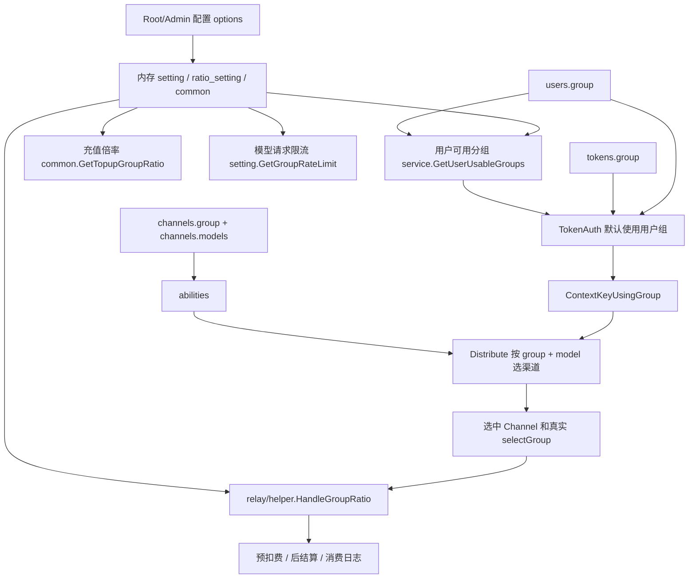

# new-api 分组、倍率和访问控制源码学习指南

这篇文档专门梳理 new-api 里最容易混在一起的一条主线：**分组 group、倍率 ratio、可访问模型、渠道选路、auto group、跨组重试、分组限流、充值倍率和前端配置界面**。

读完这篇，你应该能回答这些问题：

- 用户的 `group`、令牌的 `group`、渠道的 `group`、`abilities.group` 到底是不是同一个东西。
- 为什么后台新增了一个 `GroupRatio` 分组后，用户不一定能选它，渠道也不一定能跑它。
- API Key 绑定分组、Playground 选择分组、relay 选择渠道、计费倍率之间怎么串起来。
- `auto` 分组什么时候还是 `auto`，什么时候变成真实的 `default`、`vip` 等分组。
- `GroupRatio`、`GroupGroupRatio`、`UserUsableGroups`、`group_special_usable_group`、`TopupGroupRatio` 分别影响什么。

## 1. 先把四种 group 分清楚

new-api 里 `group` 不是单一概念。它至少有四层语义：

| 概念 | 存在哪里 | 代表什么 | 主要消费方 |
| --- | --- | --- | --- |
| 用户所属分组 | `users.group` | 用户身份等级或套餐层级，比如 `default`、`vip` | 可用组计算、特殊倍率、充值倍率、默认 relay 分组 |
| Token/请求使用分组 | `tokens.group`、`ContextKeyUsingGroup` | 这个 API Key 或请求实际想走哪个分组 | TokenAuth、Distribute、计费、日志 |
| 渠道配置分组 | `channels.group` | 这个渠道开放给哪些分组，数据库里是逗号字符串 | 渠道编辑、Ability 生成 |
| 渠道能力分组 | `abilities.group` | 某个渠道能否在某分组下服务某模型 | 渠道选路、模型可见性 |

最重要的一句话：

> `GroupRatio` 定义“分组存在和倍率”；`UserUsableGroups` 定义“用户能不能选择”；`abilities` 定义“这个分组下有没有渠道能跑某模型”。

所以创建一个新分组通常要同时考虑三件事：

1. 在 `GroupRatio` 里给它倍率，让系统认为它是有效分组。
2. 在 `UserUsableGroups` 或 `group_special_usable_group` 里让目标用户能选它。
3. 在渠道 `group`/`abilities` 里让它有可用模型和渠道。

## 2. 总体数据流



这个图里有两个入口：

- 配置入口：Root/Admin 在系统设置里修改 option，热加载到内存。
- 请求入口：用户或 API Key 发起请求，middleware 把用户组、token 组、最终使用组写入 `gin.Context`。

## 3. 配置存储：options 表和内存 setting

分组/倍率相关配置大多存在 `options` 表，启动时加载进 `common.OptionMap` 和各个 setting 包。

关键文件：

- `model/option.go`
- `setting/ratio_setting/group_ratio.go`
- `setting/user_usable_group.go`
- `setting/auto_group.go`
- `setting/rate_limit.go`
- `common/topup-ratio.go`

### 3.1 分组基础倍率：GroupRatio

源码入口：`setting/ratio_setting/group_ratio.go`

默认值：

- `default: 1`
- `vip: 1`
- `svip: 1`

核心函数：

- `GetGroupRatioCopy() map[string]float64`
- `ContainsGroupRatio(name string) bool`
- `GroupRatio2JSONString() string`
- `UpdateGroupRatioByJSONString(jsonStr string) error`
- `GetGroupRatio(name string) float64`
- `CheckGroupRatio(jsonStr string) error`

`GroupRatio` 有两个作用：

1. 给分组一个计费倍率。
2. 作为“分组是否存在”的判断来源。

例如 `middleware.TokenAuth` 校验 token 绑定分组时，会用 `ratio_setting.ContainsGroupRatio(tokenGroup)` 判断分组是否已被弃用。只有 `auto` 是特例：`auto` 不需要存在于 `GroupRatio`。

### 3.2 用户组到使用组的特殊倍率：GroupGroupRatio

源码入口：`setting/ratio_setting/group_ratio.go`

结构是：

```json
{
  "vip": {
    "edit_this": 0.9
  }
}
```

含义是：**某个用户所属分组使用某个目标分组时，覆盖目标分组的普通倍率**。

例如：

- 用户 `users.group = vip`
- API Key 使用 `token.group = edit_this`
- `GroupRatio.edit_this = 1.2`
- `GroupGroupRatio.vip.edit_this = 0.9`

最终计费倍率是 `0.9`，不是 `1.2`。

核心函数：

- `GetGroupGroupRatio(userGroup, usingGroup string) (float64, bool)`
- `GroupGroupRatio2JSONString() string`
- `UpdateGroupGroupRatioByJSONString(jsonStr string) error`

注意：`GroupGroupRatio` 不是授权配置。它只覆盖倍率，不决定用户能不能选这个组。授权仍看 `UserUsableGroups` 和 `group_special_usable_group`。

### 3.3 用户可用分组：UserUsableGroups

源码入口：`setting/user_usable_group.go`

默认值：

```json
{
  "default": "默认分组",
  "vip": "vip分组"
}
```

核心函数：

- `GetUserUsableGroupsCopy() map[string]string`
- `UserUsableGroups2JSONString() string`
- `UpdateUserUsableGroupsByJSONString(jsonStr string) error`
- `GetUsableGroupDescription(groupName string) string`

这个配置的值是描述文案，不是倍率。

如果一个分组在 `GroupRatio` 里，但不在用户可用组里，普通用户/API Key/Playground 不能选择它。

### 3.4 特定用户组的可用组增删：group_special_usable_group

源码入口：`setting/ratio_setting/group_ratio.go`

它在 `GroupRatioSetting` 结构体里：

- `GroupSpecialUsableGroup *types.RWMap[string, map[string]string]`

配置 key 是：

- `group_ratio_setting.group_special_usable_group`

示例：

```json
{
  "vip": {
    "+:fast": "高速分组",
    "-:default": "移除默认分组",
    "special": "特殊分组"
  }
}
```

`service.GetUserUsableGroups(userGroup)` 会解释这些规则：

- `+:fast`：添加 `fast`。
- `-:default`：从基础 `UserUsableGroups` 中移除 `default`。
- `special`：无前缀时也视为添加。

最后还有一个兜底：如果用户自己的 `users.group` 不在可用组中，会把用户组本身追加进去，描述为 `用户分组`。

这让管理员可以只把用户设为某个组，即使没写进 `UserUsableGroups`，用户仍能使用自己的组。

### 3.5 自动分组：AutoGroups 和 DefaultUseAutoGroup

源码入口：`setting/auto_group.go`

默认：

- `AutoGroups = ["default"]`
- `DefaultUseAutoGroup = false`

`AutoGroups` 是 `auto` 分组展开时的全局顺序。它本身不是数据库表，也不是渠道组。

`service.GetUserAutoGroup(userGroup)` 会把全局 `AutoGroups` 和用户可用组取交集：

1. 先算 `service.GetUserUsableGroups(userGroup)`。
2. 遍历 `setting.GetAutoGroups()`。
3. 只保留用户有权使用的组。

`DefaultUseAutoGroup` 用在新建默认 API Key 场景：如果开启，注册用户生成默认令牌时会把 token group 设为 `auto`。

### 3.6 充值分组倍率：TopupGroupRatio

源码入口：`common/topup-ratio.go`

默认：

```json
{
  "default": 1,
  "vip": 1,
  "svip": 1
}
```

它影响的是用户充值支付金额，不影响模型消耗倍率。

消费倍率看：

- `GroupRatio`
- `GroupGroupRatio`
- 模型倍率或模型固定价格
- 动态计费表达式

充值金额看：

- `TopupGroupRatio`
- 支付渠道单价
- 充值展示类型
- 预设折扣

相关调用：

- `controller/topup.go` 的 `getPayMoney`
- `controller/topup_stripe.go` 的 `getStripePayMoney`
- `controller/topup_waffo.go`
- `controller/topup_waffo_pancake.go`

### 3.7 分组请求限流：ModelRequestRateLimitGroup

源码入口：`setting/rate_limit.go`

结构：

```json
{
  "vip": [100, 80]
}
```

含义：

- 第一个数：窗口内总请求数上限。
- 第二个数：窗口内成功请求数上限。

核心函数：

- `ModelRequestRateLimitGroup2JSONString()`
- `UpdateModelRequestRateLimitGroupByJSONString(jsonStr string)`
- `GetGroupRateLimit(group string) (totalCount, successCount int, found bool)`
- `CheckModelRequestRateLimitGroup(jsonStr string) error`

`middleware.ModelRequestRateLimit` 优先读取 `ContextKeyTokenGroup`，为空再读 `ContextKeyUserGroup`。这意味着：

- token 绑定 `vip`，按 `vip` 的限流配置。
- token 绑定 `auto`，通常按 `auto` 的限流配置，而不是最终选中的真实 auto group。

## 4. 管理端如何读写这些配置

主要路由在 `router/api-router.go`：

- `GET /api/option/`：Root 读取系统配置。
- `PUT /api/option/`：Root 更新单个配置。
- `GET /api/group/`：Admin 获取所有 `GroupRatio` 里的分组名。
- `GET /api/prefill_group/`：Admin 获取模型/分组预填模板。
- `POST /api/prefill_group/`
- `PUT /api/prefill_group/`
- `DELETE /api/prefill_group/:id`

### 4.1 UpdateOption 的更新链路

核心路径：

```text
router/api-router.go
  -> controller.UpdateOption
  -> model.UpdateOption
  -> model.updateOptionMap
  -> setting/ratio_setting/common/setting 包内存变量
```

`model/option.go` 里初始化 `common.OptionMap` 时会把当前内存配置序列化进去，例如：

- `TopupGroupRatio`
- `AutoGroups`
- `DefaultUseAutoGroup`
- `ModelRequestRateLimitGroup`
- `GroupRatio`
- `GroupGroupRatio`
- `UserUsableGroups`

更新时，`updateOptionMap` 根据 key 分派：

- `TopupGroupRatio` -> `common.UpdateTopupGroupRatioByJSONString`
- `AutoGroups` -> `setting.UpdateAutoGroupsByJsonString`
- `DefaultUseAutoGroup` -> 设置布尔变量
- `ModelRequestRateLimitGroup` -> `setting.UpdateModelRequestRateLimitGroupByJSONString`
- `GroupRatio` -> `ratio_setting.UpdateGroupRatioByJSONString`
- `GroupGroupRatio` -> `ratio_setting.UpdateGroupGroupRatioByJSONString`
- `UserUsableGroups` -> `setting.UpdateUserUsableGroupsByJSONString`

点号配置如 `group_ratio_setting.group_special_usable_group` 走 `setting/config` 注册系统，由 `config.GlobalConfig.Register("group_ratio_setting", &groupRatioSetting)` 暴露结构体字段。

### 4.2 写入前校验

`controller/option.go` 会对部分 key 做额外校验：

- `GroupRatio`：调用 `ratio_setting.CheckGroupRatio`，倍率不能小于 0。
- `ModelRequestRateLimitGroup`：调用 `setting.CheckModelRequestRateLimitGroup`，必须是 `{group: [total, success]}`，数值范围合法。

这个项目里很多配置是 JSON 字符串，所以读源码时要区分：

- 数据库存储：`options.value` 是字符串。
- 业务内存：map、slice、bool、float 等。
- 前端表单：通常仍是字符串，保存前 normalize JSON。

### 4.3 PrefillGroup 不等于权限分组

源码：

- `controller/prefill_group.go`
- `model/prefill_group.go`

`PrefillGroup` 用于前端表单快速填模型列表或分组模板。它不是：

- 用户组。
- token 组。
- 渠道能力。
- 计费倍率。

它只是管理界面的预填数据。

## 5. 用户如何看到可用分组

路由：

- `GET /api/user/groups`
- `GET /api/user/self/groups`

源码：

- `controller/group.go`
- `service/group.go`
- `model/user.go`

`GetUserGroups` 的流程：

```text
1. 从 gin.Context 取用户 id。
2. model.GetUserGroup(userId, false) 得到 users.group。
3. service.GetUserUsableGroups(userGroup) 计算可用组。
4. 遍历 ratio_setting.GetGroupRatioCopy()。
5. 只返回既存在于 GroupRatio 又存在于用户可用组中的分组。
6. ratio 用 service.GetUserGroupRatio(userGroup, groupName)。
7. 如果用户可用组包含 auto，额外返回 auto，ratio 为 "自动"。
```

响应形状：

```json
{
  "success": true,
  "data": {
    "default": {
      "ratio": 1,
      "desc": "默认分组"
    },
    "auto": {
      "ratio": "自动",
      "desc": "auto"
    }
  }
}
```

一个细节：`/api/user/groups` 在路由里没有挂 `UserAuth`，未登录时 `id` 为 0，会退化成默认可用组逻辑。真正登录态自助页面通常用 `/api/user/self/groups`。

## 6. 用户如何看到可用模型

路由：

- `GET /api/user/models`
- `GET /api/user/models?group=vip`
- relay 兼容模型列表：`GET /v1/models`、`GET /v1beta/models`

源码：

- `controller/user.go` 的 `GetUserModels`
- `controller/model.go` 的模型列表逻辑
- `model/ability.go` 的 `GetGroupEnabledModels`
- `model/pricing.go` 的 `GetPricing`

`GET /api/user/models?group=vip` 的流程：

```text
1. 读取当前用户。
2. service.GetUserUsableGroups(user.Group) 得到用户可用组。
3. 如果传了 group，先确认 group 在可用组里。
4. 不可用则返回空数组，不报错。
5. 可用则 model.GetGroupEnabledModels(group) 从 abilities 表查 distinct model。
```

不传 `group` 时：

```text
1. 算出用户全部可用组。
2. 对每个组调用 model.GetGroupEnabledModels(group)。
3. 合并去重后返回。
```

注意它查的是 `abilities`，不是 `GroupRatio`。如果一个组有倍率但没有任何 `abilities`，模型列表仍然为空。

## 7. 渠道 group 如何变成 ability

核心文件：

- `model/channel.go`
- `model/ability.go`
- `model/channel_cache.go`
- `model/channel_satisfy.go`

渠道表里有两个逗号字符串：

- `channels.models`
- `channels.group`

例如：

```text
models = "gpt-4o,gpt-4.1"
group  = "default,vip"
```

保存渠道时，模型层会把笛卡尔积展开到 `abilities`：

```text
default + gpt-4o   + channel_id
default + gpt-4.1  + channel_id
vip     + gpt-4o   + channel_id
vip     + gpt-4.1  + channel_id
```

`Ability` 结构：

- `Group`
- `Model`
- `ChannelId`
- `Enabled`
- `Priority`
- `Weight`
- `Tag`

真正参与选路的是 `abilities`。`channels.group` 更像是编辑源数据和筛选字段。

### 7.1 渠道缓存结构

内存缓存会构建：

```text
group2model2channels[group][model] = []channelID
```

查询时会先走缓存：

- `model.GetRandomSatisfiedChannelWithExclusions`
- `model.GetChannelsForGroupModelWithFallback`
- `model.IsChannelEnabledForGroupModel`

缓存关闭或兜底时再查 DB：

- `model.getChannelQuery`
- 条件是 `group + model + enabled + priority`

### 7.2 分组筛选的跨数据库写法

`channels.group` 是逗号字符串，按组筛选时不能直接 `LIKE "%vip%"`，否则 `vip` 可能误匹配 `svip`。

`model/channel.go` 里使用：

- `NormalizeChannelGroupFilter`
- `channelGroupFilterCondition`
- `channelGroupFilterPattern`
- `ApplyChannelGroupFilter`

它把字段拼成带前后逗号的字符串再匹配：

```text
",default,vip," LIKE "%,vip,%"
```

并且针对 MySQL 和 SQLite/PostgreSQL 的字符串拼接语法做了分支。

这是读 Go 项目时一个很好的跨数据库兼容例子。

## 8. TokenAuth 如何确定请求使用分组

核心文件：

- `middleware/auth.go`
- `model/token.go`
- `model/user_cache.go`
- `service/group.go`
- `setting/ratio_setting/group_ratio.go`

relay 路由大致顺序是：

```text
TokenAuth()
ModelRequestRateLimit()
Distribute()
controller.Relay()
```

`TokenAuth` 做的分组相关工作：

1. 从多种协议位置提取 key：
   - OpenAI `Authorization`
   - Midjourney `mj-api-secret`
   - Gemini query/header key
   - Anthropic `x-api-key`
2. `model.ValidateUserToken` 校验 token。
3. `model.GetUserCache` 获取用户缓存。
4. `userCache.WriteContext(c)` 写用户信息，包括 `ContextKeyUserGroup`。
5. 默认 `userGroup := userCache.Group`。
6. 如果 `token.Group != ""`，token group 覆盖 user group。
7. 覆盖前校验：
   - token group 必须在 `service.GetUserUsableGroups(userGroup)` 中。
   - token group 必须存在于 `GroupRatio`，除非它是 `auto`。
8. 写入 `ContextKeyUsingGroup`。
9. `SetupContextForToken` 写入：
   - token id/key/name
   - token quota
   - token model limits
   - `ContextKeyTokenGroup`
   - `ContextKeyTokenCrossGroupRetry`

这里有一个容易混淆的点：

- `ContextKeyUserGroup` 仍表示用户自己的 `users.group`。
- `ContextKeyTokenGroup` 表示 token 绑定分组。
- `ContextKeyUsingGroup` 表示本次请求当前要使用的分组。

没有 token group 时，`UsingGroup = UserGroup`。

有 token group 时，`UsingGroup = TokenGroup`。

Playground 还可以在 `Distribute` 中用请求体里的 `group` 再覆盖一次。

## 9. Distribute 如何按分组选渠道

核心文件：

- `middleware/distributor.go`
- `service/channel_select.go`
- `model/channel_cache.go`
- `model/channel_satisfy.go`

`Distribute` 的分组相关流程：

```text
1. 解析请求体 model。
2. 如果 token 开了模型限制，先校验 model 是否在 token 允许列表中。
3. 读取 ContextKeyUsingGroup。
4. Playground 特例：请求体 group 可覆盖 usingGroup。
5. 尝试渠道亲和性 preferred channel。
6. 未命中则调用 service.CacheGetRandomSatisfiedChannel。
7. 成功后记录 selectGroup，写入渠道相关 context。
```

### 9.1 token 模型限制

如果 token 开启 `ModelLimitsEnabled`，`Distribute` 会读：

- `ContextKeyTokenModelLimitEnabled`
- `ContextKeyTokenModelLimit`

并用 `ratio_setting.FormatMatchingModelName(model)` 做匹配。这让某些模型后缀或规范化模型名能按统一规则判断。

不通过则直接 403，不进入渠道选择。

### 9.2 Playground group 覆盖

Playground 请求路径是：

- `/pg/chat/completions`

请求体里带：

```json
{
  "model": "gpt-4o",
  "group": "vip",
  "messages": []
}
```

`Distribute` 会重新读取请求体：

1. 如果 `group` 非空，校验它在用户可用组中，或者等于当前 `usingGroup`。
2. 校验通过后，把 `ContextKeyUsingGroup` 改成请求体里的 group。

所以 Playground 可以在当前用户有权限的范围内选择分组。

### 9.3 普通分组选路

普通分组调用：

```text
service.CacheGetRandomSatisfiedChannel({
  ModelName: model,
  TokenGroup: usingGroup,
  RequestPath: path,
  Retry: retry,
})
```

普通分支最终走：

```text
model.GetRandomSatisfiedChannelWithExclusions(group, model, retry, path, excluded)
```

候选渠道来自：

```text
group2model2channels[group][model]
```

同时会考虑：

- 规范化模型名。
- fallback mapping。
- endpoint/path 是否支持。
- priority。
- weight 随机。
- 请求级排除列表。
- 负缓存里不可用的渠道。

## 10. auto group 和跨组重试

`auto` 是一个虚拟请求分组，不是一个真实渠道分组。

当 `TokenGroup == "auto"` 时，`service.CacheGetRandomSatisfiedChannel` 进入 auto 分支：

```text
1. 读取用户真实 UserGroup。
2. service.GetUserAutoGroup(userGroup) 得到用户可用的 auto 候选组。
3. 按 AutoGroups 顺序遍历。
4. 对每个真实组尝试选渠道。
5. 选中后写 ContextKeyAutoGroup。
6. 返回 selectGroup = 真实组。
```

例如：

```json
AutoGroups = ["vip", "default"]
UserUsableGroups(default user) = {"default": "..."}
```

普通用户使用 `auto` 时只会尝试 `default`，不会尝试 `vip`。

### 10.1 auto 什么时候变成真实组

在 `Distribute` 和渠道选择阶段：

- `ContextKeyUsingGroup` 可能仍是 `auto`。
- `ContextKeyAutoGroup` 会被写成真实组，比如 `default`。
- `selectGroup` 返回真实组。

在计费阶段：

- `relay/helper.HandleGroupRatio` 检查 context 中是否有 `auto_group`。
- 如果有，就把 `relayInfo.UsingGroup` 改成真实组。
- 后续计费使用真实组倍率。

### 10.2 CrossGroupRetry

`tokens.cross_group_retry` 通过 `SetupContextForToken` 写到：

- `ContextKeyTokenCrossGroupRetry`

它只在 `auto` 分支里有意义。

启用后，如果当前真实组在 retry 中耗尽优先级，会推进：

- `ContextKeyAutoGroupIndex`
- `ContextKeyAutoGroupRetryIndex`

并重置 retry，让同一个 relay 重试循环继续尝试下一个 auto 候选组。

不启用时，请求一般会在当前真实组的重试范围内转。

## 11. 分组限流在什么时候生效

核心文件：

- `middleware/model-rate-limit.go`
- `setting/rate_limit.go`
- `router/relay-router.go`

路由顺序保证 `ModelRequestRateLimit` 在 `TokenAuth` 后运行，因此它能读取用户和 token context。

流程：

```text
1. 如果 ModelRequestRateLimitEnabled=false，直接放行。
2. 默认使用全局 ModelRequestRateLimitCount / SuccessCount / Duration。
3. group := ContextKeyTokenGroup。
4. 如果 token group 为空，group := ContextKeyUserGroup。
5. setting.GetGroupRateLimit(group) 如果命中，覆盖全局阈值。
6. Redis 开启则用 Redis 计数，否则用内存限流器。
```

重点边界：

- 分组限流是“用户请求限流阈值按组配置”，不是所有同组用户共享一个总额度。
- auto 请求通常按 `auto` 查限流配置，而不是按最终选中的真实 `auto_group`。
- 限流发生在渠道选择前，所以此时还不知道 auto 最终会选中哪个真实组。

## 12. 分组倍率如何进入预扣费和结算

核心文件：

- `relay/common/relay_info.go`
- `relay/helper/price.go`
- `service/text_quota.go`
- `service/tiered_settle.go`
- `service/log_info_generate.go`

`RelayInfo` 初始化时会带三类组：

- `UserGroup`
- `TokenGroup`
- `UsingGroup`

预扣费阶段，`relay/helper.ModelPriceHelper` 会调用 `HandleGroupRatio`：

```text
1. 默认 groupRatio = 1。
2. 如果 context 有 auto_group，将 relayInfo.UsingGroup 改为真实组。
3. 尝试 GetGroupGroupRatio(relayInfo.UserGroup, relayInfo.UsingGroup)。
4. 命中则使用特殊倍率，并记录 GroupSpecialRatio。
5. 未命中则使用 GetGroupRatio(relayInfo.UsingGroup)。
```

然后按不同计费模式计算：

- 按 token 倍率：`tokens * modelRatio * groupRatio`
- 按固定价格：`modelPrice * QuotaPerUnit * groupRatio`
- tiered expr：表达式算出基础 quota 后再乘 `groupRatio`

后结算阶段，`service/text_quota.go` 继续使用 `relayInfo.PriceData.GroupRatioInfo.GroupRatio`。这保证预扣费和最终结算使用同一套分组倍率信息。

### 12.1 日志里的 group 和 ratio

消费日志：

- `model.RecordConsumeLog`
- 文本结算写入 `Group: relayInfo.UsingGroup`

因此 auto 场景下，消费日志通常记录最终真实组。

日志 `other` 里还会带：

- `model_ratio`
- `group_ratio`
- `completion_ratio`
- `user_group_ratio`

前端日志列会优先显示用户组特殊倍率。

错误日志有个差异：`controller/relay.go` 处理渠道错误时，group 可能取的是 context 当前的 `group`/`usingGroup`，auto 下可能仍显示 `auto`。所以分析日志时要区分错误日志和消费日志。

## 13. /api/pricing 和 /api/ratio_config 的区别

两个接口都和“价格/倍率”有关，但用途不同。

### 13.1 /api/pricing

源码：`controller/pricing.go`

返回：

- 模型 pricing 列表。
- vendors。
- `group_ratio`。
- `usable_group`。
- `supported_endpoint`。
- `auto_groups`。

如果请求已登录：

1. 根据用户组读取 `GroupGroupRatio`，覆盖 group ratio 展示。
2. `service.GetUserUsableGroups(group)` 过滤 pricing。
3. 删除不可用组的 group ratio。

它是前端 Pricing 页面、模型价格展示和部分公开价格信息的主要接口。

### 13.2 /api/ratio_config

源码：

- `router/api-router.go`
- `controller/ratio_config.go`
- `setting/ratio_setting/expose_ratio.go`
- `setting/ratio_setting/exposed_cache.go`

只有 `ExposeRatioEnabled=true` 才返回，否则 403。

返回数据包括：

- `model_ratio`
- `completion_ratio`
- `cache_ratio`
- `create_cache_ratio`
- `model_price`

它不暴露 `GroupRatio`。

这个接口还会被上游倍率同步逻辑尝试读取，用于从另一个 new-api/sub2api 实例拉价格配置。

## 14. 前端里的两套分组语义

前端 `web/default` 里尤其容易混：

1. **用户/令牌可选分组**：API Key、Playground、Pricing 使用。
2. **渠道可访问分组**：渠道表单使用，最终保存到 `channels.group`。

### 14.1 API Key 分组选择

核心文件：

- `web/default/src/features/keys/components/api-keys-mutate-drawer.tsx`
- `web/default/src/features/keys/components/api-key-group-combobox.tsx`
- `web/default/src/features/keys/lib/api-key-form.ts`

流程：

```text
1. 打开 API Key 抽屉。
2. getUserGroups -> /api/user/self/groups。
3. getUserModels -> /api/user/models。
4. groupsRaw 转成 { value, label, desc, ratio }。
5. Combobox 展示分组名、描述和倍率 badge。
6. 提交时 group 原样传给 /api/token。
7. cross_group_retry 只有 group === "auto" 才会传 true。
```

`auto` 的 ratio 是字符串 `"自动"`，所以前端类型允许 `number | string`。

### 14.2 Playground 分组选择

核心文件：

- `web/default/src/features/playground/api.ts`
- `web/default/src/features/playground/hooks/use-playground-options.ts`
- `web/default/src/components/model-group-selector.tsx`
- `web/default/src/features/playground/lib/streaming/payload-builder.ts`

流程：

```text
1. use-playground-options 拉 /api/user/self/groups。
2. 根据当前 group 拉 /api/user/models?group=vip。
3. ModelGroupSelector 左侧选组、右侧选模型。
4. payload-builder 构造请求体，包含 group。
5. 请求发到 /pg/chat/completions。
6. 后端 Distribute 校验 group 权限并覆盖 UsingGroup。
```

如果当前保存的 group 不再可用，前端会 fallback 到 `default` 或第一个可用组。

### 14.3 用户管理里的 group

核心文件：

- `web/default/src/features/users/api.ts`
- `web/default/src/features/users/components/users-mutate-drawer.tsx`
- `web/default/src/features/users/lib/user-form.ts`

用户编辑抽屉调用：

- `GET /api/group/`

这个接口返回的是 `GroupRatio` 里的全部分组名，供管理员设置 `users.group`。

这里不是用户自己的可用组列表，而是管理员可分配的用户所属组。

### 14.4 渠道管理里的 group

核心文件：

- `web/default/src/features/channels/api.ts`
- `web/default/src/features/channels/components/drawers/channel-mutate-drawer.tsx`
- `web/default/src/features/channels/lib/channel-form.ts`
- `web/default/src/features/channels/components/channels-table.tsx`

渠道表单里 `group` 是 `string[]`，默认 `["default"]`。

提交到后端前会变成逗号字符串：

```text
["default", "vip"] -> "default,vip"
```

这是为了匹配后端 `channels.group` 字段和 `ApplyChannelGroupFilter` 的逗号字符串查询方式。

渠道列表筛选里，URL search params 可以是数组，但实际请求通常只取第一个 group 传给后端筛选。

### 14.5 系统设置里的倍率页

核心文件：

- `web/default/src/features/system-settings/billing/section-registry.tsx`
- `web/default/src/features/system-settings/models/ratio-settings-card.tsx`
- `web/default/src/features/system-settings/models/group-ratio-form.tsx`
- `web/default/src/features/system-settings/models/group-ratio-visual-editor.tsx`
- `web/default/src/features/system-settings/models/group-special-usable-editor.tsx`
- `web/default/src/features/system-settings/request-limits/rate-limit-section.tsx`
- `web/default/src/features/system-settings/request-limits/rate-limit-visual-editor.tsx`

倍率设置虽然组件在 `features/system-settings/models` 目录下，但页面入口归在 Billing 设置里。

保存 group 配置时，`ratio-settings-card.tsx` 会更新：

- `GroupRatio`
- `TopupGroupRatio`
- `UserUsableGroups`
- `GroupGroupRatio`
- `AutoGroups`
- `DefaultUseAutoGroup`
- `group_ratio_setting.group_special_usable_group`

分组限流在 request-limits 页面，更新：

- `ModelRequestRateLimitEnabled`
- `ModelRequestRateLimitDurationMinutes`
- `ModelRequestRateLimitCount`
- `ModelRequestRateLimitSuccessCount`
- `ModelRequestRateLimitGroup`

## 15. 典型业务流程 walkthrough

### 15.1 新增一个 vip-fast 分组

目标：VIP 用户可以选择 `vip-fast`，普通用户不能选；渠道也能跑这个组；这个组倍率为 1.5。

需要改：

1. `GroupRatio`

```json
{
  "default": 1,
  "vip": 1,
  "vip-fast": 1.5
}
```

2. `group_ratio_setting.group_special_usable_group`

```json
{
  "vip": {
    "+:vip-fast": "VIP 高速分组"
  }
}
```

或者直接放进 `UserUsableGroups`，但那会让所有用户基础可见。

3. 渠道配置

把支持这个分组的渠道 `group` 里加上 `vip-fast`，保存后后端会更新 `abilities`。

4. 验证

- VIP 用户 `GET /api/user/self/groups` 能看到 `vip-fast`。
- 普通用户看不到。
- `GET /api/user/models?group=vip-fast` 返回有模型。
- API Key 绑定 `vip-fast` 后 relay 能选到渠道。
- 消费日志 group 是 `vip-fast`，倍率是 1.5 或特殊覆盖倍率。

### 15.2 API Key 绑定 auto 并允许跨组重试

流程：

```text
1. 前端 API Key 抽屉拉 /api/user/self/groups。
2. 如果后端返回 auto，用户可以选 auto。
3. 表单 group=auto，cross_group_retry=true。
4. /api/token 保存 token.group=auto 和 token.cross_group_retry=true。
5. 请求进入 TokenAuth，auto 通过用户可用组校验和 GroupRatio 特例。
6. Distribute 调 CacheGetRandomSatisfiedChannel。
7. service.GetUserAutoGroup(userGroup) 算出候选真实组。
8. 选中真实组并写 auto_group。
9. 失败重试时如果当前组耗尽，推进到下一个 auto 候选组。
10. 计费阶段 HandleGroupRatio 把 UsingGroup 从 auto 改成真实组。
```

关键边界：

- token group 是 `auto`。
- 限流可能按 `auto`。
- 计费和消费日志通常按最终真实组。

### 15.3 Playground 临时选择某分组

流程：

```text
1. Playground 拉 /api/user/self/groups。
2. 用户选择 group=vip。
3. 前端按 /api/user/models?group=vip 拉模型。
4. 请求体包含 group=vip。
5. Distribute 在 /pg/chat/completions 路径下解析 PlayGroundRequest。
6. 校验 vip 在用户可用组中。
7. 通过后覆盖 ContextKeyUsingGroup。
8. 后续选路和计费按 vip。
```

Playground 不直接修改 token 或用户，只是在单次请求体里指定 group。

### 15.4 管理员改了分组倍率后如何生效

流程：

```text
1. 前端系统设置页修改 GroupRatio。
2. PUT /api/option/ { key: "GroupRatio", value: "{...}" }。
3. controller.UpdateOption 校验 JSON 和倍率非负。
4. model.UpdateOption 写 options 表。
5. updateOptionMap 调 ratio_setting.UpdateGroupRatioByJSONString。
6. 后续 TokenAuth、GetUserGroups、HandleGroupRatio 读取新内存值。
```

如果改的是模型价格/模型倍率，pricing 缓存可能有 TTL，需要看是否手动刷新价格缓存。分组倍率本身在 `HandleGroupRatio` 中直接读当前 `ratio_setting`，不依赖 pricing 列表缓存。

## 16. 读源码时的 Go 学习点

### 16.1 用 map + RWMutex 做热配置

`setting/user_usable_group.go` 和 `common/topup-ratio.go` 是简单版本：

- 包级变量 map。
- 包级 `sync.RWMutex`。
- `Get...Copy` 读锁并复制 map。
- `Update...ByJSONString` 写锁并替换 map。

这适合学习 Go 里共享配置的并发保护。

### 16.2 types.RWMap 封装并发 map

`ratio_setting/group_ratio.go` 使用 `types.NewRWMap`：

- `ReadAll`
- `Get`
- `AddAll`
- `MarshalJSONString`
- `types.LoadFromJsonString`

相比手写 mutex，这种封装让多个配置 map 的代码更统一。

### 16.3 gin.Context 作为请求级状态容器

分组链路大量依赖 context key：

- `ContextKeyUserGroup`
- `ContextKeyTokenGroup`
- `ContextKeyUsingGroup`
- `ContextKeyAutoGroup`
- `ContextKeyTokenCrossGroupRetry`
- `ContextKeyAutoGroupIndex`

读这种代码时，不要只看函数参数。很多业务状态是从 middleware 写进 `gin.Context`，后续 controller/service 再读出来。

### 16.4 GORM 跨库兼容

`group` 是 SQL 保留字。项目在 `model/main.go` 定义 `commonGroupCol`，在 raw SQL 条件里使用它，避免 MySQL、PostgreSQL、SQLite 的引用方式差异。

例如：

- `model.GetGroupEnabledModels`
- `model.IsChannelEnabledForGroupModel`
- `model.ApplyChannelGroupFilter`

这是本项目数据库兼容规则的典型案例。

### 16.5 JSON 字符串配置的前后端契约

很多复杂配置在后端是 JSON 字符串 option，前端需要：

1. 读取字符串。
2. parse 成对象给可视化编辑器。
3. 编辑后 stringify。
4. `PUT /api/option/` 保存。

例如：

- `GroupRatio`
- `UserUsableGroups`
- `GroupGroupRatio`
- `AutoGroups`
- `ModelRequestRateLimitGroup`

写功能时要确认前端和后端对 JSON 形状一致。

## 17. 常见误区和边界

### 17.1 `GroupRatio` 不等于用户可用组

`GroupRatio` 里有 `svip`，不代表普通用户能选 `svip`。

用户能不能选看：

- `UserUsableGroups`
- `group_special_usable_group`
- 用户自己的 `users.group` 兜底追加

### 17.2 用户能选某组，不代表这个组有模型

模型可用性看 `abilities`。

如果用户可用组里有 `vip-fast`，但没有任何渠道把 `vip-fast` 展开到 `abilities`，`/api/user/models?group=vip-fast` 仍会返回空。

### 17.3 渠道 group 不直接决定用户权限

渠道 `group` 表示“这个渠道服务哪些分组”。它不是“哪些用户能管理这个渠道”，也不是“用户可选组列表”。

用户能否使用该组要先过 `TokenAuth` 或 Playground 的用户可用组校验。

### 17.4 `GroupGroupRatio` 不是给 group 起别名

它只是特殊倍率覆盖。

它不会：

- 创建分组。
- 授权分组。
- 给渠道增加 ability。
- 改变 auto group 顺序。

### 17.5 `TopupGroupRatio` 不影响消耗

充值倍率只影响支付金额或充值换算，不影响一次模型请求扣多少 quota。

模型请求消耗看 `HandleGroupRatio` 和模型计费配置。

### 17.6 `auto` 是虚拟组

`auto` 可以作为 token group 或请求 group，但最终要展开到真实分组才能选渠道和计费。

例外是分组限流阶段：因为它发生在渠道选择前，所以可能仍按 `auto` 限流。

### 17.7 `/api/ratio_config` 不暴露 group ratio

这个接口暴露模型相关倍率快照，且需要开启 `ExposeRatioEnabled`。

如果你想看可用分组和分组倍率，通常看：

- `/api/user/self/groups`
- `/api/pricing`
- `/api/group/`
- `/api/option/`

### 17.8 API Key group 和用户 group 不一定相同

用户 `users.group = vip`，token 可以绑定 `default`、`vip`、`auto` 或其他用户可用组。

计费特殊倍率用的是：

```text
GetGroupGroupRatio(userGroup, usingGroup)
```

所以“用户所属组”和“本次使用组”同时参与计费决策。

## 18. 推荐阅读顺序

如果你想按源码把这条链路完整跑一遍，建议这样读：

1. `setting/ratio_setting/group_ratio.go`
2. `setting/user_usable_group.go`
3. `service/group.go`
4. `controller/group.go`
5. `model/option.go`
6. `middleware/auth.go` 的 `TokenAuth`
7. `middleware/model-rate-limit.go`
8. `middleware/distributor.go`
9. `service/channel_select.go`
10. `model/ability.go`
11. `model/channel_cache.go`
12. `relay/helper/price.go`
13. `service/text_quota.go`
14. `controller/pricing.go`
15. `web/default/src/features/keys/components/api-keys-mutate-drawer.tsx`
16. `web/default/src/features/playground/hooks/use-playground-options.ts`
17. `web/default/src/features/channels/lib/channel-form.ts`
18. `web/default/src/features/system-settings/models/ratio-settings-card.tsx`

每读完一个文件，问自己三个问题：

- 它读的是用户组、token 组、渠道组，还是 ability 组？
- 它是在做授权、展示、选路、限流，还是计费？
- 它依赖的是 options 内存配置，还是数据库表？

只要这三件事分清，new-api 的分组系统就不会再显得乱。
