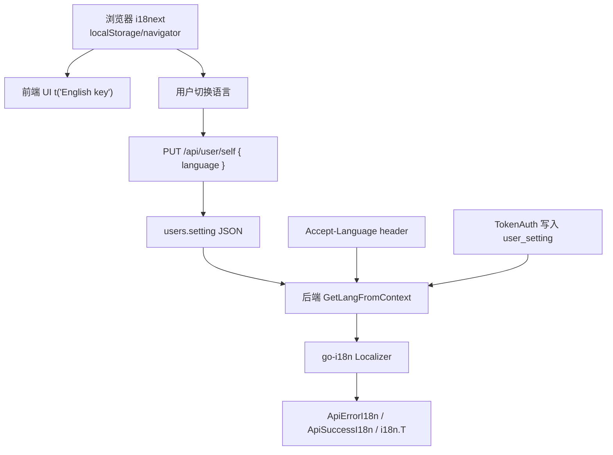

# 国际化 i18n 与语言偏好学习指南

这篇文档专门讲 new-api 的国际化系统：后端如何用 go-i18n 返回多语言错误，默认前端如何用 i18next 管理 6 种语言，用户语言偏好如何保存到 `users.setting`，以及登录前、登录后、API Key 请求和前端切换语言时分别会发生什么。

如果你已经掌握 Go 基本语法，这篇适合用来学习真实项目里的“多语言工程”：embed 文件、初始化顺序、Gin context、用户设置 JSON、React i18n hook、toast、表单校验、语言包同步脚本和翻译维护边界。

## 1. 先建立全局模型

new-api 有两套 i18n：

| 层 | 技术 | 语言 | 作用 |
| --- | --- | --- | --- |
| 后端 | `nicksnyder/go-i18n/v2` | `en`、`zh-CN`、`zh-TW` | API message、middleware 错误、OpenAI-compatible 错误文本 |
| 默认前端 | `i18next` + `react-i18next` | `en`、`zh`、`fr`、`ru`、`ja`、`vi` | 页面文案、按钮、表单、toast、菜单、空状态 |

最重要的边界：

- 后端 locale 文件在 `i18n/locales/*.yaml`。
- 前端 locale 文件在 `web/default/src/i18n/locales/*.json`。
- 后端支持语言少于前端。前端保存 `fr/ru/ja/vi` 后，后端 API message 会回退英文。
- 用户语言偏好保存在 `users.setting` JSON 里的 `language` 字段。
- 前端切换语言主要影响 UI；浏览器的 `Accept-Language` 请求头不会因为 UI 切换自动改变。

## 2. 整体流程图



这个图的读法：

- 前端 UI 翻译由 i18next 决定。
- 后端 message 翻译由 `GetLangFromContext` 决定。
- 用户设置能影响后端，但只对后端支持的语言有效。
- 登录前没有用户设置，只能依赖 `Accept-Language` 或默认英文。

## 3. 后端 i18n 目录

后端相关文件：

| 文件 | 作用 |
| --- | --- |
| `i18n/i18n.go` | 初始化 bundle/localizer、语言解析、翻译函数 |
| `i18n/keys.go` | 后端消息 key 常量表 |
| `i18n/locales/en.yaml` | 英文消息 |
| `i18n/locales/zh-CN.yaml` | 简体中文消息 |
| `i18n/locales/zh-TW.yaml` | 繁体中文消息 |
| `middleware/i18n.go` | 全局语言检测 middleware |
| `common/gin.go` | `ApiErrorI18n`、`ApiSuccessI18n`、`TranslateMessage` |
| `model/user.go` | 用户设置 JSON 读写 |
| `model/user_cache.go` | 用户语言缓存读取 |

## 4. 后端初始化

`i18n.Init()` 做这些事：

1. 用 `sync.Once` 保证只初始化一次。
2. 创建 `go-i18n` bundle。
3. 注册 YAML 解析函数。
4. 通过 `//go:embed locales/*.yaml` 加载 locale 文件。
5. 预创建 `zh-CN`、`zh-TW`、`en` 的 localizer。
6. 把 `common.TranslateMessage` 替换成 `i18n.T`。

`common.TranslateMessage` 的存在是为了避免循环 import：

```text
common 需要提供 ApiErrorI18n
i18n 需要读 gin.Context 和 common helper
```

所以 common 里先放一个默认实现，i18n 初始化完成后再注入真正翻译函数。

启动链路在 `main.InitResources`：

```text
i18n.Init()
  -> i18n.SetUserLangLoader(model.GetUserLanguage)
```

如果 i18n 初始化失败，项目会记录错误，但不会阻断启动。也就是说 i18n 被视为重要但非致命基础设施。

## 5. 后端语言优先级

后端最终翻译时调用：

```text
i18n.T(c, key, args...)
  -> GetLangFromContext(c)
  -> Translate(lang, key, args...)
```

`GetLangFromContext` 的优先级是：

1. `gin.Context` 中的 `ContextKeyUserSetting.Language`。
2. 如果 context 有 `id`，通过 `model.GetUserLanguage(userId)` 懒加载用户语言。
3. `middleware.I18n` 写入的 `ContextKeyLanguage`。
4. 直接读取请求 `Accept-Language`。
5. 默认 `en`。

这点非常关键。虽然 `middleware.I18n()` 是全局 middleware，但它注册在 auth 之前，通常还拿不到用户 setting。因此真正的用户偏好优先级是在翻译发生时由 `GetLangFromContext` 补上的。

## 6. Accept-Language 解析

后端 `ParseAcceptLanguage` 很简单：

```text
Accept-Language: zh-CN,zh;q=0.9,en;q=0.8
  -> 取逗号前第一个
  -> 去掉 ;q=
  -> normalizeLang
```

它不按 q-value 排序。

归一化规则：

| 输入 | 输出 |
| --- | --- |
| `zh-TW`、`zh-TW-*` | `zh-TW` |
| `zh`、`zh-CN`、其他 `zh*` | `zh-CN` |
| `en`、`en-US`、其他 `en*` | `en` |
| 其他语言 | `en` |

这解释了为什么前端保存 `fr` 后，后端 message 仍是英文：后端不支持法语，归一化后回退 `en`。

## 7. 后端消息 key 体系

`i18n/keys.go` 定义常量，避免在业务代码里散落字符串。

命名风格：

```text
domain.snake_case
```

常见分组：

- `common.*`
- `auth.*`
- `token.*`
- `redemption.*`
- `user.*`
- `quota.*`
- `subscription.*`
- `payment.*`
- `channel.*`
- `model.*`
- `group.*`
- `setting.*`
- `oauth.*`
- `distributor.*`
- `custom_oauth.*`

locale YAML 是 flat key，不是嵌套 YAML：

```yaml
common.invalid_params: Invalid parameters
auth.not_logged_in: Not logged in
```

模板参数使用 Go template 风格：

```yaml
common.batch_too_many: "Batch size cannot exceed {{.Max}}"
```

调用时：

```go
common.ApiErrorI18n(c, i18n.MsgBatchTooMany, map[string]any{"Max": 100})
```

## 8. 后端响应封装

`common/gin.go` 提供：

```go
func ApiErrorI18n(c *gin.Context, key string, args ...map[string]any)
func ApiSuccessI18n(c *gin.Context, key string, data any, args ...map[string]any)
```

返回格式与普通 API helper 一致：

```json
{
  "success": false,
  "message": "translated message"
}
```

成功响应：

```json
{
  "success": true,
  "message": "translated message",
  "data": {}
}
```

controller 里推荐优先使用这些封装，而不是手写中文或英文。

## 9. middleware 和 OpenAI-compatible 错误

并不是所有后端错误都走 `ApiErrorI18n`。

例如：

- auth middleware 会直接用 `common.TranslateMessage(c, key)` 后手写 JSON。
- distributor middleware 需要输出 OpenAI-compatible 错误结构，会先 `i18n.T(c, key, params)` 得到字符串，再放入错误对象。
- OAuth 下层会返回带 `MsgKey` 和 `Params` 的错误，controller 再翻译。

这说明一个原则：下层 service/model 最好不要提前翻译成固定语言，而是返回 key + params，让靠近 Gin context 的地方翻译。

## 10. 用户语言偏好存储

用户设置不是独立表，也不是独立列，而是 `users.setting` 字符串字段中的 JSON。

结构体在 `dto.UserSetting`：

```go
type UserSetting struct {
    Language string `json:"language,omitempty"`
    ...
}
```

读写函数：

- `User.GetSetting()`：把 `user.Setting` JSON 解析成 `dto.UserSetting`。
- `User.SetSetting()`：把 `dto.UserSetting` marshal 成 JSON。
- `model.UpdateUserSetting()`：更新 DB 的 `setting` 字段，并更新 Redis 用户缓存。
- `model.GetUserLanguage()`：从用户缓存读取 setting，再取 `Language`。

这意味着：

- 用户语言偏好跟通知设置、侧边栏设置等共享同一个 JSON。
- 更新时如果没有合并旧 setting，可能覆盖掉其他字段。

## 11. 用户语言更新 API

前端保存语言调用：

```text
PUT /api/user/self
body: { "language": "zh" }
```

后端在 `controller.UpdateSelf` 中处理：

1. 读取当前用户。
2. 解析当前 `user.Setting`。
3. 只更新 `currentSetting.Language`。
4. 调 `model.UpdateUserSetting` 保存。

这个路径会保留其他 setting 字段。

另一个接口：

```text
PUT /api/user/setting
```

用于通知、webhook、Bark、Gotify、quota warning 等设置。它会重新构造一个新的 `dto.UserSetting` 再保存。当前实现主要保留 `UpstreamModelUpdateNotifyEnabled`，不完整保留 `Language`、`SidebarModules` 等字段。

这是一个很重要的数据坑：保存通知设置可能清掉语言偏好。读代码或改代码时要特别小心这类“整包写 JSON setting”的函数。

## 12. session、TokenAuth 和 API Key 的语言差异

### 12.1 登录前

没有用户 id，也没有用户 setting。

后端语言只能来自：

1. `Accept-Language`
2. 默认 `en`

前端 UI 语言则来自：

1. i18next localStorage
2. navigator
3. fallback `en`

两者不一定一致。

### 12.2 session 登录后

session auth 会把 `id/role/group` 等写入 Gin context，但不直接写 `ContextKeyUserSetting`。

翻译时 `GetLangFromContext` 看到 context 有 `id`，会调用 `model.GetUserLanguage` 懒加载用户语言。

因此 session 请求仍然能用用户语言，只是通过 lazy loader 而不是 auth middleware 直接写入。

### 12.3 API Key / TokenAuth

API Key 请求由 `TokenAuth` 处理。

成功验证 token 后，会拿到用户缓存并执行：

```text
userCache.WriteContext(c)
```

这会写入：

- user id
- group
- status
- quota
- `ContextKeyUserSetting`

因此有效 token 请求通常优先用用户 setting 里的语言。

注意：如果 token 无效、缺失或还没解析到用户，早期错误只能使用 `Accept-Language` 或默认英文。

### 12.4 API 客户端传 Accept-Language 的影响

对于有效 TokenAuth 请求，如果账号保存了后端支持的语言，用户 setting 会覆盖请求头。也就是说 API 客户端传 `Accept-Language` 不一定生效。

这对多语言 API 消费者很重要：账号级语言偏好可能比请求头更优先。

## 13. 默认前端 i18n 文件结构

默认前端相关文件：

| 文件 | 作用 |
| --- | --- |
| `web/default/src/i18n/config.ts` | 初始化 i18next |
| `web/default/src/i18n/languages.ts` | 语言选项和前端语言归一化 |
| `web/default/src/i18n/static-keys.ts` | 动态 key 清单 |
| `web/default/src/i18n/locales/en.json` | 英文语言包 |
| `web/default/src/i18n/locales/zh.json` | 中文语言包 |
| `web/default/src/i18n/locales/fr.json` | 法语语言包 |
| `web/default/src/i18n/locales/ru.json` | 俄语语言包 |
| `web/default/src/i18n/locales/ja.json` | 日语语言包 |
| `web/default/src/i18n/locales/vi.json` | 越南语语言包 |
| `web/default/scripts/sync-i18n.mjs` | 同步、排序、报告 locale 状态 |
| `web/default/scripts/add-missing-keys.mjs` | 添加/更新翻译的脚本入口 |

locale JSON 结构是 flat：

```json
{
  "translation": {
    "Sign in": "Sign in",
    "Request failed": "Request failed"
  }
}
```

key 使用英文源文本。`en.json` 通常 key=value。

当前六个前端 locale key 数一致，各 5007 个。

## 14. 前端 i18next 初始化

`web/default/src/i18n/config.ts`：

```text
import en/zh/fr/ru/ja/vi
  -> i18n.use(LanguageDetector)
  -> i18n.use(initReactI18next)
  -> init({
       resources,
       fallbackLng: 'en',
       supportedLngs: ['en','zh','fr','ru','ja','vi'],
       load: 'languageOnly',
       nsSeparator: false,
       detection: { order: ['localStorage','navigator'], caches: ['localStorage'] }
     })
```

关键点：

- `load: 'languageOnly'` 会把 `zh-CN` 归一为 `zh`。
- `nsSeparator: false` 允许 key 中出现冒号，例如 URL 或 label。
- 检测顺序是 localStorage 优先，然后 navigator。
- fallback 是英文。

`main.tsx` 通过副作用导入：

```ts
import './i18n/config'
```

确保 React 渲染前 i18n 已初始化。

## 15. 前端使用模式

### 15.1 React 组件内

标准写法：

```tsx
const { t } = useTranslation()

return <Button>{t('Save')}</Button>
```

所有用户可见文本都应该走 `t()`：

- label
- button
- placeholder
- dialog title
- description
- empty state
- table header
- toast
- validation message

### 15.2 非 React 模块

非组件模块不能用 hook，可以用：

```ts
import i18next from 'i18next'
i18next.t('Request failed')
```

或：

```ts
import { t } from 'i18next'
t('Request failed')
```

典型场景是 Axios interceptor、通用 action helper、全局 toast。

### 15.3 动态 key

有些配置会这样写：

```ts
const meta = { titleKey: 'Models' }
t(meta.titleKey)
```

这类 key 不一定能被简单正则扫描到，所以项目维护了 `static-keys.ts` 作为动态 key 清单。

但要注意：`static-keys.ts` 只是约定和审计辅助，当前 sync 脚本不消费它。把 key 加进去不等于 locale 里有翻译。

### 15.4 表单校验

项目里有两种模式：

1. schema 里写英文错误，`FormMessage` 再 `t(body)` 翻译。
2. schema factory 接收 `t`，直接生成本地化错误。

新代码更推荐第二种，尤其是动态校验、`superRefine` 和带插值的错误。

## 16. 前端语言切换

### 16.1 顶部语言切换器

`LanguageSwitcher`：

1. 用户选择语言。
2. 调 `i18n.changeLanguage(code)`。
3. 如果已登录，best-effort 调 `PUT /api/user/self { language: code }`。
4. 保存失败不阻断 UI，也不回滚。

这个切换器适合全局快速切语言。

### 16.2 Profile 语言偏好卡

Profile 页面 `LanguagePreferencesCard` 更严格：

1. 从 `profile.setting` 解析保存语言。
2. 用户选择语言。
3. 乐观切换 i18next。
4. 调 `updateUserLanguage(nextLanguage)` 保存。
5. 成功后更新 Zustand user setting，并刷新 profile。
6. 失败则回滚 i18next 和 UI 状态。

这条路径更适合“保存偏好”的设置场景。

### 16.3 登录后恢复语言

登录成功后，前端会再请求 `getSelf()`。

`GetSelf` 返回原始 `setting` 字符串，前端解析 `setting.language`，如果存在就：

```ts
i18n.changeLanguage(savedLang)
```

因此用户在另一台设备保存的语言，登录后能恢复到前端。

## 17. 请求头与前后端语言不一致

前端 Axios 请求会自动加：

```text
New-Api-User: <uid>
```

但没有显式把当前 i18next 语言写入：

```text
Accept-Language: <current i18next language>
```

因此：

- 未登录 API message 主要看浏览器自己的 `Accept-Language`。
- UI 里切到日语，不代表后端未登录接口就用日语。
- 后端也不支持日语，最终仍会英文。
- 登录后后端优先用户 setting，但只支持 `en/zh-CN/zh-TW`。

这是读项目时很容易误会的点。

## 18. i18n sync 脚本

前端脚本：

```bash
cd web/default
bun run i18n:sync
```

实际运行：

```text
node scripts/sync-i18n.mjs
```

脚本会：

- 读取所有 locale JSON。
- 选择 key 最多的 base locale。
- 按 base 顺序重排所有语言。
- 缺失 key 用 base/en 填充。
- 额外 key 写到 `_extras`。
- 疑似未翻译写到 `_reports/*.untranslated.json`。
- 生成 `_reports/_sync-report.json`。

当前 `_sync-report.json` 显示六种前端语言的 missing、extras、untranslated 都是 0。

注意：`i18n:sync` 会写回 locale 文件。只做只读审计时不要运行。

## 19. 新增后端 i18n 文案流程

新增后端消息时：

1. 在 `i18n/keys.go` 选择业务分组，加 `MsgXxx = "domain.snake_case"`。
2. 在三份 YAML 同时添加同一个 key：
   - `i18n/locales/en.yaml`
   - `i18n/locales/zh-CN.yaml`
   - `i18n/locales/zh-TW.yaml`
3. 如果有变量，三份 YAML 使用相同占位符，例如 `{{.Provider}}`。
4. controller 使用 `common.ApiErrorI18n` 或 `common.ApiSuccessI18n`。
5. middleware/OpenAI-compatible 错误用 `i18n.T` 或 `common.TranslateMessage` 得到字符串。
6. service/model 层尽量返回 key + params，不提前翻译。

后端新增文案的关键是三份 YAML 同步。缺 key 时不会 panic，用户会直接看到 key 字符串。

## 20. 新增前端 i18n 文案流程

新增前端文案时：

1. 代码里使用 `t('English source string')` 或 `i18next.t('English source string')`。
2. 动态 key 要确保渲染处调用 `t(key)`，并把 key 记录到 `static-keys.ts` 或确保有可扫描字面量。
3. 使用脚本写入六种 locale：
   - `en`
   - `zh`
   - `fr`
   - `ja`
   - `ru`
   - `vi`
4. 运行 `bun run i18n:sync`。
5. 检查 `_sync-report.json`。

项目约定：不要手工直接编辑 `web/default/src/i18n/locales/*.json`。locale 写入应该走 `add-missing-keys.mjs` 和 `bun run i18n:sync`，保证六个语言包同步和排序。

## 21. 后端与前端 i18n 的差异

| 维度 | 后端 | 前端 |
| --- | --- | --- |
| key 风格 | `domain.snake_case` | 英文源文本 |
| 文件格式 | YAML flat map | JSON `{ translation: {} }` |
| 支持语言 | `en`、`zh-CN`、`zh-TW` | `en`、`zh`、`fr`、`ru`、`ja`、`vi` |
| 插值格式 | `{{.Name}}` | `{{name}}` |
| 初始化 | `i18n.Init()` | `import './i18n/config'` |
| 使用方式 | `i18n.T(c,key)`、`ApiErrorI18n` | `useTranslation().t`、`i18next.t` |
| 缺 key 行为 | 返回 key | 回退 key / fallback |
| 语言来源 | user setting、context、header | localStorage、navigator、用户选择 |

不要把前端 key 直接拿到后端用，也不要把后端 `domain.snake_case` 当成前端 UI 文案。

## 22. 常见坑

### 22.1 后端支持语言少于前端

前端可以保存 `fr/ru/ja/vi`，但后端会归一化到英文。用户可能看到法语 UI，但 API 错误 message 是英文。

### 22.2 UI 切换语言不会改浏览器 Accept-Language

前端调用 `i18n.changeLanguage` 不会让浏览器请求头跟着变。未登录接口仍按浏览器语言或英文。

### 22.3 `PUT /api/user/setting` 可能覆盖语言偏好

它会整包重建 `dto.UserSetting`。如果新结构没有保留旧字段，就可能清掉 `language`。改用户设置相关代码时，要先读当前 setting 并 merge。

### 22.4 后端缺 key 不报错

go-i18n localize 失败后项目返回 key。用户会看到 `common.some_key` 这种字符串。

### 22.5 前端只加 `t()` 不加 locale 不够

如果 locale 缺 key，就会回退英文或被 sync 报告标记。六种语言都要补。

### 22.6 `static-keys.ts` 不是 locale

它只是动态 key 清单。真正翻译仍要写入 locale JSON。

### 22.7 插值占位符不能改

前端 `{{count}}`、后端 `{{.Count}}` 都必须在翻译中保留。改名会导致渲染缺变量。

### 22.8 直接返回错误字符串会绕过 i18n

`common.ApiError(c, err)`、`ApiErrorMsg`、手写 `c.JSON` 里的中文/英文不会自动翻译。

### 22.9 Accept-Language 不按 q-value

后端只取第一个语言。`fr,zh;q=0.9` 会先归一化 `fr`，最后落英文，不会选 `zh`。

## 23. 读源码路线

### 第一轮：后端 i18n

1. `i18n/i18n.go`
2. `i18n/keys.go`
3. `i18n/locales/en.yaml`
4. `common/gin.go`
5. `middleware/i18n.go`
6. `middleware/auth.go`

目标：理解后端 message 如何从 key 翻译成字符串。

### 第二轮：用户语言偏好

1. `dto/user_settings.go`
2. `model/user.go` 的 `GetSetting`、`UpdateUserSetting`
3. `model/user_cache.go` 的 `GetUserLanguage`
4. `controller/user.go` 的 `GetSelf`、`UpdateSelf`、`UpdateUserSetting`
5. `i18n.GetLangFromContext`

目标：理解用户语言如何保存、缓存、读取和覆盖请求头。

### 第三轮：前端 i18n

1. `web/default/src/i18n/config.ts`
2. `web/default/src/i18n/languages.ts`
3. `web/default/src/i18n/static-keys.ts`
4. `web/default/src/main.tsx`
5. `web/default/src/components/language-switcher.tsx`
6. `web/default/src/features/profile/components/language-preferences-card.tsx`
7. `web/default/scripts/sync-i18n.mjs`

目标：理解前端 UI 翻译和语言切换。

### 第四轮：真实调用链

练习追踪：

```text
用户在 Profile 选择 zh
  -> i18n.changeLanguage('zh')
  -> PUT /api/user/self { language: 'zh' }
  -> controller.UpdateSelf
  -> model.UpdateUserSetting
  -> users.setting / Redis cache
  -> 后续 API 请求
  -> GetLangFromContext
  -> ApiErrorI18n 返回中文 message
```

再追踪：

```text
用户未登录，在 UI 切换 ja
  -> i18next localStorage = ja
  -> 前端 UI 日语
  -> 请求 /api/...
  -> 后端看 Accept-Language
  -> 后端不支持 ja，返回英文或浏览器首选支持语言
```

## 24. 总结

new-api 的 i18n 可以分成三句话理解：

- 后端 i18n 是 key-based：`i18n.MsgXxx` + YAML + `ApiErrorI18n`。
- 前端 i18n 是 English-source-key based：`t('English text')` + 六份 JSON locale。
- 用户语言偏好存进 `users.setting`，登录后能同时影响前端恢复语言和后端 API message，但后端只支持 `en/zh-CN/zh-TW`。

读懂这套链路后，你就能判断一段新增文案应该放后端还是前端，知道该补哪些 locale，知道什么时候用户语言不会生效，也能避开“整包更新 setting 清掉 language”这类真实项目里很隐蔽的问题。
