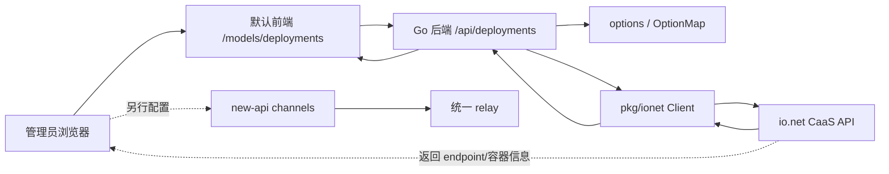

# io.net 模型部署源码学习指南

本文专门梳理 new-api 里 io.net 模型部署管理的实现。

它是 `model-vendor-deployment-guide-for-go-learners.md` 的补充：模型目录文档只简述 Deployments section 的位置和边界，本文把 `/api/deployments` 后端、`pkg/ionet` 客户端、默认前端部署页面、系统设置、审计和渠道关系完整串起来。

适合的读者：

- 已经掌握 Go 基本语法，想通过真实业务代码学习 Gin controller、HTTP client、DTO 映射、错误处理。
- 想分清模型目录、io.net deployment、new-api channel、relay 上游这几个容易混淆的概念。
- 想知道默认前端 `/models/deployments` 页面每个按钮背后对应哪条后端链路。

## 一、先建立整体心智模型

io.net deployment 在 new-api 中是一个外部资源管理能力：管理员在 new-api 后台填写 io.net API key，然后通过 new-api 代理调用 io.net 的 CaaS API，创建、查看、更新、延长、终止容器部署。

它不是本地数据库里的 deployment 表，也不会自动变成 relay 渠道。



关键边界：

- `/models/metadata` 管本地模型目录、供应商、上游模型同步和价格元数据。
- `/models/deployments` 管 io.net 外部部署生命周期。
- `/channels` 才是 new-api relay 真正选路和转发的入口。
- deployment 创建成功只表示 io.net 那边有一个容器部署，不表示本地模型目录、channel、ability、计费倍率已经自动创建。

## 二、源码入口地图

后端入口：

```text
router/api-router.go
controller/deployment.go
pkg/ionet/client.go
pkg/ionet/deployment.go
pkg/ionet/hardware.go
pkg/ionet/container.go
pkg/ionet/types.go
pkg/ionet/jsonutil.go
middleware/audit.go
middleware/auth.go
```

前端入口：

```text
web/default/src/routes/_authenticated/models/index.tsx
web/default/src/routes/_authenticated/models/$section.tsx
web/default/src/features/models/index.tsx
web/default/src/features/models/api.ts
web/default/src/features/models/hooks/use-model-deployment-settings.ts
web/default/src/features/models/components/deployment-access-guard.tsx
web/default/src/features/models/components/deployments-table.tsx
web/default/src/features/models/components/deployments-columns.tsx
web/default/src/features/models/components/dialogs/create-deployment-drawer.tsx
web/default/src/features/models/components/dialogs/view-details-dialog.tsx
web/default/src/features/models/components/dialogs/view-logs-dialog.tsx
web/default/src/features/models/components/dialogs/rename-deployment-dialog.tsx
web/default/src/features/models/components/dialogs/extend-deployment-dialog.tsx
web/default/src/features/models/components/dialogs/update-config-dialog.tsx
web/default/src/features/system-settings/integrations/ionet-deployment-settings-section.tsx
web/default/src/features/system-settings/models/section-registry.tsx
```

读源码时建议按这个顺序：

1. 先读 `router/api-router.go` 中 `/api/deployments` 路由组，知道外部 HTTP API 的形状。
2. 再读 `controller/deployment.go`，理解 Gin handler 如何绑定请求、读取配置、调用 client、返回前端格式。
3. 然后读 `pkg/ionet/*`，理解 Go HTTP client 如何封装 io.net API。
4. 最后读默认前端 `features/models`，把页面状态、React Query、表单 payload 和后端 DTO 对上。

## 三、路由和权限边界

`/api/deployments` 整组挂在 `middleware.AdminAuth()` 下，因此 Admin 用户可以管理 io.net deployment。

但 io.net API key 和开关保存走的是系统配置 `/api/option`，它属于 Root 级设置。也就是说：

- Root 用户配置 `model_deployment.ionet.enabled` 和 `model_deployment.ionet.api_key`。
- Admin 用户在 deployments 页面执行 list/create/update/delete 等外部部署操作。

部署相关路由如下：

| 方法与路径 | Controller | 作用 |
| --- | --- | --- |
| `GET /api/deployments/settings` | `GetModelDeploymentSettings` | 查看 io.net 部署功能是否启用、是否配置 key、是否可连接。 |
| `POST /api/deployments/settings/test-connection` | `TestIoNetConnection` | 测试已保存或请求体传入的 API key。 |
| `POST /api/deployments/test-connection` | `TestIoNetConnection` | 兼容测试连接路径。 |
| `GET /api/deployments/` | `GetAllDeployments` | 分页列出 deployments。 |
| `GET /api/deployments/search` | `SearchDeployments` | 按状态和名称搜索 deployments。 |
| `GET /api/deployments/hardware-types` | `GetHardwareTypes` | 查询可用硬件类型。 |
| `GET /api/deployments/locations` | `GetLocations` | 查询可用地区。 |
| `GET /api/deployments/available-replicas` | `GetAvailableReplicas` | 按硬件和 GPU 数查询可用副本。 |
| `POST /api/deployments/price-estimation` | `GetPriceEstimation` | 估算部署费用。 |
| `GET /api/deployments/check-name` | `CheckClusterNameAvailability` | 检查集群名是否可用。 |
| `POST /api/deployments/` | `CreateDeployment` | 创建部署。 |
| `GET /api/deployments/:id` | `GetDeployment` | 查询部署详情。 |
| `GET /api/deployments/:id/logs` | `GetDeploymentLogs` | 获取某个 container 的 raw logs。 |
| `GET /api/deployments/:id/containers` | `ListDeploymentContainers` | 列出部署下的 containers/workers。 |
| `GET /api/deployments/:id/containers/:container_id` | `GetContainerDetails` | 查询某个 container 详情。 |
| `PUT /api/deployments/:id` | `UpdateDeployment` | 更新部署配置。 |
| `PUT /api/deployments/:id/name` | `UpdateDeploymentName` | 改名。 |
| `POST /api/deployments/:id/extend` | `ExtendDeployment` | 延长部署时长。 |
| `DELETE /api/deployments/:id` | `DeleteDeployment` | 请求终止部署。 |

一个 Gin 路由细节：固定路径必须注册在 `/:id` 前面。这里 `hardware-types`、`locations`、`available-replicas`、`check-name` 等固定路径都在动态 id 路由前注册，避免被误识别成 deployment id。

## 四、配置读取和连接测试

io.net 配置存在 `options` 表中，运行时通过 `common.OptionMap` 读取。

```text
model_deployment.ionet.enabled
model_deployment.ionet.api_key
```

`controller/deployment.go` 中的核心函数是 `getIoAPIKey()`：

```text
getIoAPIKey()
  -> 读取 common.OptionMap["model_deployment.ionet.enabled"]
  -> enabled 必须等于 "true"
  -> 读取 common.OptionMap["model_deployment.ionet.api_key"]
  -> api key 去空格后不能为空
  -> 返回 api key
```

这个函数用于真实部署操作，所以它要求开关和 key 同时有效。

`GetModelDeploymentSettings` 更温和，只返回当前状态：

- `provider`: 固定是 io.net。
- `enabled`: 开关是否为 `"true"`。
- `configured`: API key 是否非空。
- `can_connect`: 后端先按 `enabled && configured` 给出静态值，真正连通性由前端后续 test connection 判断。

`TestIoNetConnection` 是特殊入口。它不调用 `getIoAPIKey()`，因为系统设置页需要支持“还没保存 key，先测试这个 key 是否可用”的体验。

测试连接的取 key 规则：

1. 如果请求体传了 `api_key`，优先用请求体里的 key。
2. 否则用已保存的 `model_deployment.ionet.api_key`。
3. key 为空则返回配置错误。
4. 用该 key 创建 io.net client 并发起轻量查询来验证。

这就解释了一个常见现象：test connection 可以在 enabled 还没打开时成功，但 list/create/delete 等真实操作仍会因为 enabled 不是 `"true"` 而失败。

## 五、client 分层：normal 与 enterprise

`pkg/ionet/client.go` 定义了两个构造函数：

```text
NewClient(apiKey)
  base URL = https://api.io.solutions/v1/io-cloud/caas

NewEnterpriseClient(apiKey)
  base URL = https://api.io.solutions/enterprise/v1/io-cloud/caas
```

controller 中大部分管理能力走 enterprise client：

- deployments CRUD。
- hardware types。
- available replicas。
- price estimation。
- check name / update name。
- containers list / container detail。

两个能力走 normal client：

- `GetLocations`。
- `GetDeploymentLogs`。

这不是 new-api 内部权限差异，而是 io.net API 本身不同 endpoint 分布导致的 base URL 差异。

## 六、`pkg/ionet.Client` 如何发 HTTP 请求

client 的中心是 `makeRequest(method, endpoint, body)`。

它的责任很清楚：

1. 拼出完整 URL：`BaseURL + endpoint`。
2. 如果 `body != nil`，把 Go struct 编成 JSON。
3. 创建 `http.Request`。
4. 设置请求头：
   - `X-API-KEY`
   - `Content-Type: application/json`
5. 用 `http.Client` 发请求。
6. 读取响应 body。
7. HTTP status 大于等于 400 时转成 `APIError`。
8. 成功时返回原始响应字节。

错误解析策略：

- 如果 io.net 返回类似 `{"detail":"..."}`，`APIError.Message` 使用 detail。
- 如果不是这个格式，message 使用 HTTP status 文案，原始响应体放在 `Details` 中。

query 参数由 `buildQueryParams` 统一构造。它的行为值得注意：

- 空字符串会被跳过。
- 数值 0 会被跳过。
- nil 会被跳过。
- bool 会发送。
- `[]int` 和 `[]string` 会先 JSON 编码成字符串，再 URL encode。

因此如果上游某个接口真的需要显式发送数值 `0`，当前工具函数不会发送它。deployment 这条链路通常用正数参数，所以问题不大。

## 七、响应解析：data wrapper 与 direct JSON

io.net API 的响应格式并不完全统一，`pkg/ionet` 里因此同时存在两类解析模式。

第一类是 data wrapper：

```json
{
  "data": {}
}
```

对应 `decodeData()` 或 `decodeDataWithFlexibleTimes()`。

第二类是 direct JSON：

```json
{
  "deployment_id": "...",
  "status": "..."
}
```

这类响应直接解析到目标 struct。

时间解析也做了兼容处理。`pkg/ionet/jsonutil.go` 里的 flexible time 逻辑会处理没有 timezone 的时间字符串，把它补成 UTC RFC3339Nano 再解析。

对 Go 学习者来说，这里有两个实用读法：

- 看函数名字判断响应形状：`decodeData...` 暗示需要 `data` 包裹。
- 看目标 DTO 的字段类型：带 `time.Time` 或自定义 flexible time 的字段，需要注意上游时间格式。

## 八、部署列表和搜索

后端列表流程：

```text
GET /api/deployments/
  -> AdminAuth
  -> GetAllDeployments
  -> getIoEnterpriseClient
  -> ionet.ListDeployments
  -> GET /deployments?page=&page_size=&sort_by=created_at&sort_order=desc
  -> mapIoNetDeployment
  -> common.ApiSuccess
```

controller 从 query 中读取：

- `page`
- `page_size`
- `status`

然后调用 enterprise client 拉 io.net deployment 列表。

`pkg/ionet.ListDeployments` 做两件重要映射：

- 从 io.net 的硬件字段里整理 `GPUCount`、`Replicas` 等展示字段。
- 把上游分页结果转成 `DeploymentListResponse`。

controller 再用 `mapIoNetDeployment()` 转前端更方便消费的结构，例如：

- `id`
- `deployment_name`
- `status`
- `provider`
- `hardware`
- `gpu_count`
- `replicas`
- `created_at`
- `updated_at`
- `time_remaining`

搜索流程是：

```text
GET /api/deployments/search?keyword=&status=&page=&page_size=
  -> SearchDeployments
  -> 先按 status 拉 list
  -> 再在当前页结果中按 name 做本地过滤
```

这里容易误解：它不是 io.net 服务端全量搜索，也不是按 deployment id 搜索。当前实现主要按 name 过滤当前 list 结果。

## 九、部署详情

详情流程：

```text
GET /api/deployments/:id
  -> GetDeployment
  -> getIoEnterpriseClient
  -> ionet.GetDeployment(id)
  -> GET /deployment/:id
  -> map detail response
```

详情返回比列表更丰富：

- 基本信息：id、name、status、created/updated 时间。
- 硬件信息：hardware id、硬件名称、GPU 数、container 数。
- 地区信息：locations。
- container config：镜像、端口、entrypoint、args、env。
- registry config：镜像仓库认证相关字段。
- raw response：前端详情弹窗会展示原始 JSON，方便排查。

Go 学习点：

- handler 从 Gin path param 读取 `id`。
- client 把 path param 拼到 endpoint。
- DTO 既要贴合上游响应，也要服务前端展示。
- controller 做的是“外部 DTO 到本项目 API DTO”的边界映射。

## 十、创建部署

前端创建抽屉最终提交到：

```text
POST /api/deployments/
```

后端流程：

```text
CreateDeployment
  -> ShouldBindJSON(&ionet.DeploymentRequest)
  -> getIoEnterpriseClient()
  -> client.DeployContainer(request)
  -> POST /deploy
  -> 返回 deployment_id / status / message
```

`ionet.DeploymentRequest` 的主要字段：

```text
resource_private_name
duration_hours
gpus_per_container
hardware_id
location_ids
container_config
registry_config
```

`container_config` 常见字段：

```text
replica_count
traffic_port
entrypoint
args
env_variables
secret_env_variables
```

`registry_config` 常见字段：

```text
image_url
registry_username
registry_secret
```

client 在 `DeployContainer` 中先做本地参数校验：

- resource name 不能为空。
- location ids 不能为空。
- hardware id 必须有效。
- image url 不能为空。
- GPU 数必须大于 0。
- duration 必须有效。
- replica count 必须有效。

校验通过后才调用 io.net `POST /deploy`。

前端创建抽屉的默认值也体现了这条链路：

- 默认镜像：`ollama/ollama:latest`。
- 默认端口：`11434`。
- 先选 hardware。
- 再根据 hardware 和 GPU 数拉 available replicas。
- 再从 replicas 里生成 location 选项。
- 最后组装 `DeploymentRequest`。

需要注意：创建表单里的 `currency` 只用于 price estimation，不会进入 create payload。

## 十一、硬件、地区、可用副本和价格估算

创建部署前，前端需要知道三类资源：

- 有哪些硬件类型。
- 哪些地区可用。
- 某个硬件和 GPU 数下还有多少可用副本。

### 11.1 硬件类型

```text
GET /api/deployments/hardware-types
  -> GetHardwareTypes
  -> ionet.ListHardwareTypes
  -> GET /hardware/max-gpus-per-container
```

`pkg/ionet/hardware.go` 会把 io.net 返回的最大 GPU 数、硬件 id、硬件名称等转换成前端使用的 `HardwareType`。

### 11.2 地区

```text
GET /api/deployments/locations
  -> GetLocations
  -> ionet.ListLocations
  -> GET /locations
```

地区接口使用 normal client。解析时会把 ISO2 国家码转成大写；如果上游没有 total，代码会按 available 数量补一个可展示值。

### 11.3 可用副本

```text
GET /api/deployments/available-replicas?hardware_id=&gpu_count=
  -> GetAvailableReplicas
  -> ionet.GetAvailableReplicas
  -> GET /available-replicas?hardware_id=&hardware_qty=
```

controller 要求：

- `hardware_id > 0`。
- `gpu_count` 如果没传，默认按 1 处理。

前端在创建抽屉中选择 hardware 和 GPU 数后调用这个接口，再从返回的 replicas 里去重生成 location 选项。

### 11.4 价格估算

```text
POST /api/deployments/price-estimation
  -> GetPriceEstimation
  -> ionet.GetPriceEstimation
  -> GET /price
```

默认参数：

- `currency = usdc`
- `duration_type = hourly`

controller 收前端 POST body，client 再把它转换成 query 参数访问 io.net。

当前前端创建抽屉会触发 price estimation query，但 `priceSummary` 被 `void` 掉了，没有实际渲染价格摘要。延长部署弹窗会使用 price estimate 帮助展示延长时长的费用上下文。

## 十二、更新、改名、延长和删除

### 12.1 更新配置

```text
PUT /api/deployments/:id
  -> UpdateDeployment
  -> ionet.UpdateDeployment
  -> PATCH /deployment/:id
```

前端 `UpdateConfigDialog` 会先读取 deployment details，再从 `container_config` 回填表单。

可更新内容包括：

- image url。
- traffic port。
- registry username / secret。
- command。
- entrypoint。
- args。
- env variables。
- secret env variables。

### 12.2 改名

```text
PUT /api/deployments/:id/name
  -> UpdateDeploymentName
  -> CheckClusterNameAvailability
  -> UpdateClusterName
```

改名前会先请求：

```text
GET /clusters/check_cluster_name_availability?cluster_name=
```

如果可用，再请求：

```text
PUT /clusters/:id/update-name
```

前端 `RenameDeploymentDialog` 也是先 check name，再提交 rename。成功后刷新 deployments list 和 details cache。

### 12.3 延长部署

```text
POST /api/deployments/:id/extend
  -> ExtendDeployment
  -> ionet.ExtendDeployment
  -> POST /deployment/:id/extend
```

client 要求 `duration_hours >= 1`。

前端 `ExtendDeploymentDialog` 会先拉 details，从 details 中取：

- `hardware_id`
- `gpus_per_container`
- `total_containers`
- `locations[].id`

然后拼出 price estimate 参数，最后提交 extend。

### 12.4 删除部署

```text
DELETE /api/deployments/:id
  -> DeleteDeployment
  -> ionet.DeleteDeployment
  -> DELETE /deployment/:id
```

这里的 delete 语义更接近“请求终止 deployment”。io.net 返回状态可能是 termination requested，而不是本地立即删除一行数据库记录。

前端删除操作在 `DeploymentsTable` 内用确认弹窗保护，确认后调用 DELETE。

## 十三、containers 和 logs

deployment 下面有 container/worker 维度的信息。前端详情和日志弹窗都依赖它。

### 13.1 列 containers

```text
GET /api/deployments/:id/containers
  -> ListDeploymentContainers
  -> ionet.ListContainers
  -> GET /deployment/:id/containers
```

io.net 返回结构里通常叫 workers。controller 会把事件时间等字段转换成前端更容易展示的结构。

### 13.2 container detail

```text
GET /api/deployments/:id/containers/:container_id
  -> GetContainerDetails
  -> ionet.GetContainerDetails
  -> GET /deployment/:id/container/:container_id
```

这个接口用于查看某个 container 的细节。

### 13.3 raw logs

```text
GET /api/deployments/:id/logs?container_id=
  -> GetDeploymentLogs
  -> ionet.GetContainerLogsRaw
  -> GET /deployment/:id/log/:container_id
```

logs 有几个重要特点：

- `container_id` 是 query 参数，不是 path 参数。
- controller 返回 raw string。
- 它走 normal client。
- 它不是本地 `logs` 表里的审计日志。
- `pkg/ionet.GetContainerLogs()` 里存在把日志规范化为 `ContainerLogs` 的方法，但当前 controller 使用的是 raw logs 方法。

前端 `ViewLogsDialog` 的流程：

```text
打开弹窗
  -> listDeploymentContainers(id)
  -> 默认选择第一个 container
  -> getDeploymentLogs(id, container_id)
  -> 展示 raw logs
```

UI 支持：

- stdout / stderr / all 过滤。
- 手动刷新。
- 每 5 秒自动刷新。
- 下载日志。
- 自动滚动到底部。

## 十四、默认前端页面数据流

模型页面使用 TanStack Router。入口是：

```text
/models/
  -> redirect 到默认 section metadata

/models/$section
  -> section = metadata | deployments
```

因此 deployments 不是 `/models` 的默认页，需要进入 `/models/deployments` 或在模型页面切到 Deployments tab。

`ModelsContent` 根据 section 渲染不同页面：

```text
section = metadata
  -> 模型目录管理

section = deployments
  -> DeploymentsSection
  -> DeploymentAccessGuard
  -> DeploymentsTable
```

deployment 表格的 URL search 参数有独立前缀，避免和 metadata 表冲突：

```text
dPage
dPageSize
dFilter
dStatus
```

表格请求规则：

- 没有 keyword 时调用 `listDeployments`。
- 有 keyword 时调用 `searchDeployments`。
- status 是单选过滤。
- `all` 会被当作没有 status。

表格列：

- ID。
- Name。
- Status。
- Provider。
- Time remaining。
- Hardware。
- Created。
- Actions。

Actions 包括：

- 查看日志。
- 查看详情。
- 更新配置。
- 延长。
- 改名。
- 删除。

## 十五、DeploymentAccessGuard

前端不会直接展示 deployments table，而是先经过 `DeploymentAccessGuard`。

它依赖 `useModelDeploymentSettings()`：

```text
GET /api/deployments/settings
  -> 如果 enabled
     POST /api/deployments/settings/test-connection
  -> 连接结果缓存 5 分钟
```

guard 的状态：

- 正在加载配置。
- 正在检查连接。
- 服务未启用。
- 连接失败。
- 可访问。

服务未启用或连接失败时，界面会引导管理员去：

```text
/system-settings/models/model-deployment
```

这里有一个现实体验细节：连接结果有 5 分钟模块级缓存。刚改完 key 后，如果页面仍显示失败，通常需要 retry 或等待相关 query 刷新。

## 十六、创建抽屉的 payload 映射

`CreateDeploymentDrawer` 是理解前后端 DTO 对齐的最佳入口。

表单字段：

```text
resource_private_name
image_url
traffic_port
hardware_id
gpus_per_container
location_ids
replica_count
duration_hours
env_json
secret_env_json
entrypoint
args
registry_username
registry_secret
currency
```

提交时组装成后端 DTO：

```text
DeploymentRequest
  resource_private_name
  duration_hours
  gpus_per_container
  hardware_id
  location_ids
  container_config
    replica_count
    traffic_port
    entrypoint
    args
    env_variables
    secret_env_variables
  registry_config
    image_url
    registry_username
    registry_secret
```

表单处理细节：

- `env_json` 必须是 JSON object，数组不接受。
- env value 会全部转成 string。
- `secret_env_json` 同理。
- `entrypoint` 和 `args` 是按空格 split，不是 shell quote-aware parser。
- `currency` 只进入 price estimate，不进入 create payload。

这类表单代码很适合学习 TypeScript 表单 schema 与 Go struct tag 如何对齐：前端字段名、JSON key、后端 DTO 字段 tag、io.net 上游字段必须连成一条线。

## 十七、系统设置页面

系统设置中的 io.net deployment 配置在：

```text
web/default/src/features/system-settings/integrations/ionet-deployment-settings-section.tsx
```

注册在：

```text
web/default/src/features/system-settings/models/section-registry.tsx
```

对应 section：

```text
/system-settings/models/model-deployment
```

默认配置：

```text
model_deployment.ionet.enabled = false
model_deployment.ionet.api_key = ""
```

保存时只提交变更项，逐个调用：

```text
PUT /api/option/
```

value 会转成字符串，因此 enabled 最终进入 `OptionMap` 时是 `"true"` 或 `"false"` 字符串。后端 `getIoAPIKey()` 也正是按字符串 `"true"` 判断。

系统设置页还有一个 test connection 按钮，它会把未保存的 key 放在请求体中：

```json
{
  "api_key": "..."
}
```

这样管理员可以先验证 key，再决定是否保存。

## 十八、审计日志边界

`controller/deployment.go` 没有为每个写操作手动创建审计日志。

部署写操作主要依赖 AdminAuth 链路上的审计中间件兜底记录。`middleware/audit.go` 对部分路由有明确 action 映射，例如：

```text
deployment.create
deployment.update
deployment.delete
```

未显式映射的写操作会进入 generic 路由审计。例如 rename、extend 这类路由会被兜底记录，但 action 可能不是专门的 `deployment.rename` 或 `deployment.extend`。

审计日志最终写入本地 `logs` 表，属于管理操作日志。

这和 `GET /api/deployments/:id/logs` 完全不是同一个概念：

- 审计日志：管理员在 new-api 做了什么管理操作。
- deployment logs：io.net container 运行时输出了什么日志。

## 十九、和 channel 的关系

deployment 创建不会自动创建 channel。

后端 `CreateDeployment` 只做：

```text
bind DeploymentRequest
  -> ionet.DeployContainer
  -> 返回 deployment_id/status/message
```

它不会：

- 创建 `model.Channel`。
- 调用 `AddChannel`。
- 调用 `BatchInsertChannels`。
- 写 ability 索引。
- 写模型倍率。
- 自动进入 relay 选路。

如果管理员想让 new-api relay 到这个部署，仍需单独配置 channel，把 io.net 部署暴露的 endpoint、认证方式、模型名等填进渠道。

前端渠道列表里存在 “From IO.NET deployment” 之类的 badge，但它不是后端 join 出来的强关系。它来自前端解析 `channel.other_info`：

```json
{
  "source": "ionet",
  "deployment_id": "..."
}
```

这意味着：

- `other_info` 是通用附加 JSON，不是专属 deployment 外键。
- badge 是前端约定，不是数据库约束。
- 如果 JSON 被手工写成 `source = ionet`，前端就可能展示 badge。

从 channel 跳转到 deployments 的链接形如：

```text
/models/deployments?dFilter=<deployment_id>
```

但当前 backend search 主要按 deployment name 过滤，不按 id 全量搜索。如果 deployment name 不包含该 id，这个跳转可能搜不到目标。

## 二十、和模型目录的关系

模型目录文档中提到的 Metadata 页面负责：

- 模型元数据。
- 供应商。
- 官方模型同步。
- 缺失模型。
- 预填分组。
- 上游模型检测。
- 价格倍率同步。

io.net Deployments 页面负责：

- 查询 io.net 可用资源。
- 创建外部容器部署。
- 查看部署详情和日志。
- 更新、延长、改名、终止部署。

它们共用 `/models` 一级导航，但业务含义不同。

可以这样记：

```text
metadata: new-api 知道哪些模型、怎样展示、怎样计费。
deployments: io.net 上跑着哪些容器资源。
channels: new-api 实际把请求转发到哪里。
relay: 用户请求真正经过的统一代理链路。
```

## 二十一、Go 学习重点

这条业务线能练到很多 Go 项目常见能力。

### 21.1 Gin handler 模式

关注 `controller/deployment.go`：

- 从 `c.Query()` 读分页、状态、筛选。
- 从 `c.Param()` 读 path id。
- 用 `ShouldBindJSON()` 绑定请求体。
- 出错时返回统一 API error。
- 成功时用统一 success helper 返回。

读的时候可以把每个 handler 拆成四段：

```text
输入解析
  -> 权限和配置前置条件
  -> 调 service/client
  -> 映射响应
```

### 21.2 DTO 边界

`pkg/ionet/types.go` 中的类型大致分三类：

- 请求 DTO：发给 io.net 的结构。
- 响应 DTO：接 io.net 返回的结构。
- 前端友好 DTO：controller 再整理给默认前端的结构。

读 DTO 时不要只看字段名，还要看 JSON tag。前端 payload、Go struct tag、上游 API 字段名必须一致。

### 21.3 HTTP client 封装

`pkg/ionet/client.go` 展示了一个典型外部 API client：

- base URL。
- API key header。
- method/endpoint/body。
- query builder。
- response body 读取。
- status code 错误转领域错误。
- direct JSON 和 data wrapper 分别处理。

### 21.4 外部状态与本地状态

deployment 状态存在 io.net，不存在 new-api 本地 deployment 表。

因此 list/detail/update/delete 都是实时代理外部 API。new-api 本地只保存配置 key 和审计日志。

这对理解系统边界很重要：不是每个后台页面都对应一张本地表，有些页面是外部 SaaS 管理代理。

### 21.5 前后端契约

创建抽屉、更新弹窗、日志弹窗都能练习“从 UI 事件追到 Go handler，再追到上游 API”的阅读方法。

建议拿创建部署练一遍：

```text
CreateDeploymentDrawer submit
  -> createDeployment(api.ts)
  -> POST /api/deployments/
  -> router/api-router.go
  -> controller.CreateDeployment
  -> ionet.DeployContainer
  -> io.net POST /deploy
```

## 二十二、典型流程串读

### 22.1 第一次启用 io.net deployment

```text
Root 打开系统设置
  -> 输入 api key
  -> Test Connection
  -> POST /api/deployments/settings/test-connection with api_key
  -> 保存 enabled/api_key
  -> PUT /api/option/
  -> OptionMap 刷新
```

然后 Admin 打开：

```text
/models/deployments
  -> GET /api/deployments/settings
  -> POST /api/deployments/settings/test-connection
  -> 连接成功
  -> GET /api/deployments/
  -> 展示表格
```

### 22.2 创建一个部署

```text
打开 Create deployment
  -> GET /api/deployments/hardware-types
  -> 选择 hardware 和 GPU 数
  -> GET /api/deployments/available-replicas
  -> 选择 location
  -> 可选触发 POST /api/deployments/price-estimation
  -> 提交表单
  -> POST /api/deployments/
  -> io.net POST /deploy
  -> 返回 deployment_id
  -> 刷新 deployments table
```

### 22.3 查看日志

```text
点击 logs
  -> GET /api/deployments/:id/containers
  -> 选第一个 container
  -> GET /api/deployments/:id/logs?container_id=...
  -> 展示 raw logs
  -> 可开启每 5 秒刷新
```

### 22.4 把部署接入 relay

```text
io.net deployment 创建成功
  -> 管理员拿到 endpoint 和认证信息
  -> 到 /channels 新建或编辑 channel
  -> 填 base url / model / key / group / priority 等
  -> channel ability 刷新
  -> 用户请求进入 relay
  -> Distribute 选择 channel
  -> relay 转发到该 endpoint
```

这一步不是 deployment 页面自动完成的。

## 二十三、常见误解清单

- `/models` 默认进入 metadata，不是 deployments。
- `/api/deployments` 是 AdminAuth；保存 api key 通常走 Root 才能访问的 `/api/option`。
- `TestIoNetConnection` 可以测试未保存 key，也不要求 enabled 已打开。
- 真实部署操作基本要求 enabled 为 `"true"` 且 api key 非空。
- normal client 和 enterprise client 只是 io.net base URL 不同，不是 new-api 用户角色不同。
- search 不是 io.net 服务端全量搜索，当前主要过滤当前页名称。
- deployment id 日志接口的 container id 是 query 参数。
- deployment logs 是 io.net 容器日志，不是本地管理审计日志。
- 创建 deployment 不会创建 channel。
- channel 的 IO.NET badge 来自 `other_info` 前端约定，不是数据库外键。
- `currency` 参与价格估算，不进入创建部署 payload。
- `entrypoint` 和 `args` 按空格切分，不能表达复杂 shell quote。
- price estimation 在创建抽屉中会发请求，但当前没有渲染价格摘要。

## 二十四、修改这块代码时的检查点

后端修改：

- 新增路由时确认固定路径仍在 `/:id` 前注册。
- 新增真实 io.net 操作时确认是否应使用 `getIoAPIKey()`，避免绕过 enabled/key 检查。
- 确认该 endpoint 应使用 normal client 还是 enterprise client。
- 上游返回是否是 `data` wrapper，解析函数要匹配。
- 如果新增可选标量字段，注意请求 DTO 中是否需要 pointer + `omitempty`，以保留显式 0/false。
- 错误返回要保持统一 API 形状，避免把上游敏感信息直接暴露过多。
- 写操作是否已有审计 action 映射；没有的话至少确认兜底审计符合预期。

前端修改：

- 用户可见文案要走 i18n。
- API key 设置仍应支持未保存 key 的 test connection。
- deployment 表格 URL 参数继续使用 `dPage/dPageSize/dFilter/dStatus`，避免和 metadata 表冲突。
- 创建或更新 payload 字段要和 `pkg/ionet/types.go` 的 JSON tag 对齐。
- env JSON 解析失败要给用户明确反馈。
- 弹窗成功后要 invalidate 相关 deployments/details/containers query。
- 如果展示 price estimate，需要处理加载、失败、币种、时长和地点变化。

业务边界修改：

- 如果未来要“部署后自动创建 channel”，需要明确设计 channel 字段、endpoint 获取方式、key 存储、安全权限、ability 刷新、审计和失败回滚。
- 如果要让 channel 到 deployment 的跳转稳定，需要后端 search 支持按 id 查询，或前端改为直接打开详情。
- 如果要把 deployment 与 channel 建成强关系，不能只依赖 `other_info`，需要数据库字段或明确的关联模型。

## 二十五、快速索引

后端核心函数：

| 函数 | 文件 | 读法 |
| --- | --- | --- |
| `getIoAPIKey` | `controller/deployment.go` | 配置开关和 key 的真实操作前置条件。 |
| `getIoClient` | `controller/deployment.go` | normal client 构造入口。 |
| `getIoEnterpriseClient` | `controller/deployment.go` | enterprise client 构造入口。 |
| `GetModelDeploymentSettings` | `controller/deployment.go` | 前端 access guard 的 settings 来源。 |
| `TestIoNetConnection` | `controller/deployment.go` | 支持传入未保存 key 的连接测试。 |
| `GetAllDeployments` | `controller/deployment.go` | list controller。 |
| `SearchDeployments` | `controller/deployment.go` | 当前页 name 过滤的搜索逻辑。 |
| `CreateDeployment` | `controller/deployment.go` | 创建部署主入口。 |
| `UpdateDeployment` | `controller/deployment.go` | 更新配置入口。 |
| `ExtendDeployment` | `controller/deployment.go` | 延长部署入口。 |
| `DeleteDeployment` | `controller/deployment.go` | 终止部署入口。 |
| `GetDeploymentLogs` | `controller/deployment.go` | raw container logs 入口。 |
| `makeRequest` | `pkg/ionet/client.go` | io.net HTTP client 的中心函数。 |
| `buildQueryParams` | `pkg/ionet/client.go` | query 参数编码规则。 |
| `DeployContainer` | `pkg/ionet/deployment.go` | 创建部署上游请求。 |
| `ListHardwareTypes` | `pkg/ionet/hardware.go` | 硬件类型映射。 |
| `ListContainers` | `pkg/ionet/container.go` | containers/workers 列表。 |

前端核心组件：

| 组件或文件 | 作用 |
| --- | --- |
| `features/models/index.tsx` | models 页面总入口，按 section 渲染 metadata 或 deployments。 |
| `use-model-deployment-settings.ts` | settings + test connection + 5 分钟缓存。 |
| `deployment-access-guard.tsx` | 服务未启用、连接失败、加载状态和可访问状态。 |
| `deployments-table.tsx` | deployment 列表、分页、筛选、删除确认。 |
| `deployments-columns.tsx` | 表格列和 actions 菜单。 |
| `create-deployment-drawer.tsx` | 创建部署表单和 payload 映射。 |
| `view-details-dialog.tsx` | 详情弹窗。 |
| `view-logs-dialog.tsx` | logs 弹窗。 |
| `rename-deployment-dialog.tsx` | 改名弹窗。 |
| `extend-deployment-dialog.tsx` | 延长弹窗。 |
| `update-config-dialog.tsx` | 更新配置弹窗。 |
| `ionet-deployment-settings-section.tsx` | 系统设置中的 io.net 配置和连接测试。 |

## 二十六、读完后的掌握标准

读完本文并跟源码走一遍后，应该能做到：

- 说清 `/api/deployments` 每条路由对应什么 controller 和上游 io.net endpoint。
- 说清 AdminAuth 与 Root 配置权限的边界。
- 解释为什么 test connection 能测试未保存 key。
- 区分 normal client 与 enterprise client。
- 看懂 `makeRequest`、`buildQueryParams`、`decodeData` 这些 client 基础设施。
- 从前端创建表单追到 Go DTO，再追到 io.net `POST /deploy`。
- 解释 deployment logs 与本地 audit logs 的区别。
- 解释 deployment 为什么不会自动进入 relay。
- 判断一个 io.net deployment 相关 bug 应该从前端表单、controller 映射、client 请求、上游响应还是权限配置哪一层开始查。
