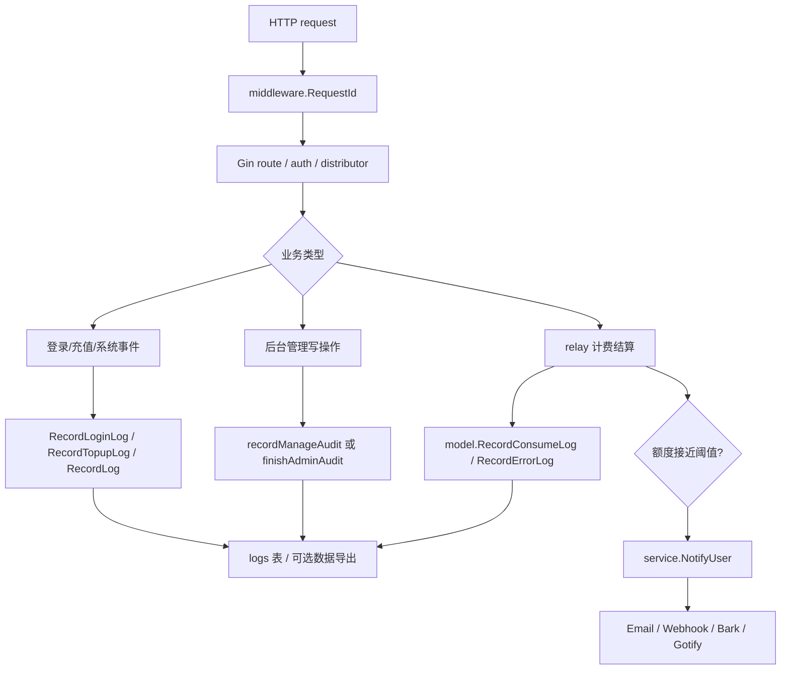

# 日志、审计、通知与 Webhook 链路源码学习指南

这篇文档专门讲 new-api 里“发生了什么、谁做的、能不能追踪、要不要通知”的实现。读完后，你应该能从一次 API 请求、一次后台管理操作、一次充值回调或一次渠道异常，追到数据库日志、控制台查询、管理员审计和用户通知。

## 一句话总览

new-api 的日志系统以 `model.Log` 为中心：消费、错误、充值、登录、管理审计、系统事件都写入同一张 `logs` 表；Gin 请求日志和业务日志通过 `request_id` 串联；管理写操作通过鉴权中间件自动兜底审计；额度预警、渠道变更等事件再通过 `NotifyUser` 分发到 Email、Webhook、Bark 或 Gotify。

## 关键源码地图

| 文件 | 职责 |
| --- | --- |
| `model/log.go` | `Log` 模型、日志类型常量、消费/错误/充值/登录/审计日志写入、日志查询、统计、清理。 |
| `controller/log.go` | 控制台日志查询 API：管理员全量查询、用户自查、统计、旧清理接口。 |
| `middleware/request-id.go` | 每个 HTTP 请求生成 `request_id`，写入 Gin context、request context 和响应头。 |
| `middleware/logger.go` | Gin access log 格式化输出，带 route tag 与 `request_id`。 |
| `logger/logger.go` | 应用运行日志封装，`LogInfo/Warn/Error/Debug` 从 context 取 request id，并支持按日志条数轮换文件。 |
| `middleware/audit.go` | 管理/root 写接口的兜底审计：包装 response writer、判断成功、异步写审计日志。 |
| `controller/audit.go` | 手动审计埋点 helper：稳定 action、结构化 params、操作者信息。 |
| `service/log_info_generate.go` | 生成消费日志 `Other` 字段：计费参数、请求路径、timing、渠道选择、tiered billing 等。 |
| `service/quota.go` | 额度结算、消费日志写入、额度不足通知触发。 |
| `service/user_notify.go` | 通知分发入口：root 通知、渠道变更 watcher、用户通知。 |
| `service/notify-limit.go` | 通知限流：Redis 或内存 `sync.Map`。 |
| `service/webhook.go` | Webhook 通知 payload、HMAC 签名、Worker 转发或本机 HTTP 发送。 |
| `common/sys_log.go`、`logger/logger.go` | 应用运行日志、格式化额度、debug/info/warn/error 输出。 |

## `model.Log` 的字段怎么读

`model.Log` 是所有业务日志的统一持久化模型。理解字段时可以按四组看：

1. 归属和检索字段：`UserId`、`Username`、`TokenId`、`TokenName`、`Group`、`ChannelId`、`ModelName`。
2. 时间和类型字段：`CreatedAt`、`Type`。
3. 计费字段：`Quota`、`PromptTokens`、`CompletionTokens`、`UseTime`、`IsStream`。
4. 追踪和扩展字段：`RequestId`、`UpstreamRequestId`、`Ip`、`Other`。

日志类型没有用 `iota`，而是显式常量：

| 类型 | 值 | 含义 |
| --- | --- | --- |
| `LogTypeTopup` | 1 | 充值/支付相关日志。 |
| `LogTypeConsume` | 2 | API 消费日志。 |
| `LogTypeManage` | 3 | 管理/高危操作审计日志。 |
| `LogTypeSystem` | 4 | 系统事件，例如注册赠送、任务退款。 |
| `LogTypeError` | 5 | relay 错误日志。 |
| `LogTypeRefund` | 6 | 退款类日志。 |
| `LogTypeLogin` | 7 | 登录成功和安全事件日志。 |

这里的设计重点是“同表多类型”。前端的用量日志、后台审计、充值记录，本质都在查同一个模型，只是查询条件、展示列和 `Other` 解析方式不同。

## request id 如何贯穿链路

`middleware.RequestId()` 在请求进入时：

1. 调用 `common.NewRequestId()` 生成 ID。
2. 写入 Gin context：`c.Set(common.RequestIdKey, id)`。
3. 写入标准 `context.Context`：方便 logger 从 request context 取。
4. 写入响应头：客户端可以拿到同一个 ID。

`middleware.SetUpLogger()` 输出 Gin access log 时会从 `param.Keys[common.RequestIdKey]` 取这个值。消费日志写入时，`model.RecordConsumeLog` 也会从 `c.GetString(common.RequestIdKey)` 写进 `logs.request_id`。

所以排查一次请求时，推荐顺序是：

1. 从客户端响应头拿 `request_id`。
2. 在控制台日志页按 `request_id` 搜索消费/错误日志。
3. 在进程日志里搜索同一个 `request_id`，找到 Gin access log、relay debug/error。
4. 如果上游响应里也带 `X-Oneapi-Request-Id`，项目会把它捕获到 `upstream_request_id`，再按 `upstream_request_id` 反查。

这里有一个容易混淆的点：`request_id` 是本系统给当前请求生成的链路 ID；`upstream_request_id` 当前主要捕获上游响应头里的 `X-Oneapi-Request-Id`。它不一定是各个厂商自己文档里说的 request id。

## 消费日志的完整流程

一次普通 relay 请求成功后，大致经历：

1. `middleware/distributor.go` 选出渠道，并在 context 中留下用户、token、渠道、分组、模型等信息。
2. relay handler 调用 provider adaptor 发起上游请求。
3. 响应解析得到 usage，例如 prompt tokens、completion tokens、cache tokens、audio tokens。
4. `service/quota.go` 计算实际 quota。
5. `SettleBilling` 做钱包或订阅的后结算。
6. `GenerateTextOtherInfo`、`GenerateClaudeOtherInfo` 或 `GenerateAudioOtherInfo` 生成 `Other`。
7. `model.RecordConsumeLog` 写入 `logs` 表。
8. 如果开启数据导出，`RecordConsumeLog` 还会调用 `LogQuotaData` 写聚合数据。
9. 若结算后额度低于阈值，异步触发 `checkAndSendQuotaNotify`。

`RecordConsumeLog` 不只是写 tokens 和 quota，它还会做几个细节：

- `LogConsumeEnabled` 为 false 时直接跳过消费日志。
- `username` 从 Gin context 取，避免重复查用户。
- `request_id` 和 `upstream_request_id` 从 context 取。
- 是否记录 IP 由用户设置 `RecordIpLog` 控制。
- `Other` 用 JSON 字符串保存，承载很多“只给管理端看”的细节。

## `Other` 字段藏了哪些重要信息

`service/log_info_generate.go` 是读消费日志最重要的补充文件。它会把一些非结构化展示信息写到 `Other`：

- `model_ratio`、`group_ratio`、`completion_ratio`、`cache_ratio`、`model_price`：计费公式相关参数。
- `frt`：first response time，第一包响应耗时。
- `relay_timing_ms`、`relay_timing_meta`：relay 内部阶段耗时和元信息。
- `request_path`：实际请求路径。
- `request_conversion`：OpenAI、Claude、Gemini、Responses 等格式转换链。
- `pricing_model_name`、`is_model_mapped`、`upstream_model_name`：模型映射和计费模型。
- `billing_source`、`subscription_*`：订阅扣费路径。
- `po`：参数覆盖审计。
- `stream_status`：流式响应是否正常结束、错误数量和结束原因。
- `admin_info`：渠道选择、multi-key、亲和性、本地 token 计数等管理端调试信息。
- `billing_mode`、`expr_b64`、`matched_tier`：动态计费表达式命中信息。

普通用户查询日志时，`formatUserLogs` 会剥离 `Other.admin_info`、`Other.audit_info` 和 `stream_status`，避免把管理调试信息暴露出去。

多次 retry 时，尝试过的渠道会进入 `admin_info.use_channel`。排查“为什么最终用了这个渠道，前面失败过哪些渠道”时，这个字段很有用。

## 错误日志怎么写

`model.RecordErrorLog` 和消费日志结构很像，但类型是 `LogTypeError`，tokens 与 quota 通常为 0。relay 主流程里的错误处理会判断错误是否允许记录、是否需要重试、是否触发渠道自动禁用或 root 通知。错误日志本身也写入：

- 用户、渠道、模型、token、分组。
- request id 和 upstream request id。
- use time、stream 标记。
- 根据用户设置决定是否写 IP。
- `Other` 里可带错误上下文。

有些错误会带 `types.ErrOptionWithNoRecordErrorLog()`，表示错误已经足够明确或不应该重复记录。读错误处理时要同时看 `types/error.go` 中的错误选项。

运行日志和 DB 日志不是一套东西：`logger.*` / `common.SysLog` 写 stdout/file，用来给运维和开发排障；`model.RecordLog(..., LogTypeSystem, ...)` 写 `logs` 表，属于用户或管理员在控制台可见的系统事件。

## 管理审计的两条路径

管理审计分为手动埋点和中间件兜底。

### 手动埋点

`controller/audit.go` 提供：

- `recordManageAudit`
- `recordManageAuditFor`
- `recordUserSecurityAudit`

手动埋点适合“业务语义明确”的操作，例如创建渠道、更新用户、查看渠道 key。调用方传入稳定的 `action` 和结构化 `params`，文案由 `auditContentTemplates` 生成英文兜底内容。

写入时：

- `Log.Type = LogTypeManage`
- `Other.op = { action, params }`
- `Other.admin_info` 保存操作者身份
- `markAuditLogged` 标记本请求已经记过审计，避免兜底重复写

### 中间件兜底

`middleware/audit.go` 在 `authHelper` 里被调用。只有经过 `AdminAuth` 或 `RootAuth` 的写方法才会启用：

1. `beginAdminAudit` 包装 `gin.ResponseWriter`，截取有限大小的响应体。
2. handler 执行业务。
3. `finishAdminAudit` 判断是否已有手动审计。
4. 如果没有，则用 method + route 找 `auditRouteActions`。
5. 根据 HTTP 状态码和响应 JSON 的 `success` 字段判断成功/失败。
6. 用 `gopool.Go` 异步写 `RecordOperationAuditLog`。

这个设计的意义是：新增管理写接口即使忘记手动埋点，也会至少留下兜底日志。

## 登录、充值、系统日志

除了 relay 和管理操作，项目还有几类显式日志：

- `RecordLoginLog`：登录成功日志，`Other.op` 用于前端 i18n 展示，extra 可以带登录方式、UA 等。
- `RecordTopupLog`：充值日志，`Other.admin_info` 带服务器 IP、节点名、调用 IP、支付方式等。
- `RecordLog`：通用系统日志，例如注册赠送额度、签到、异步任务退款。
- `RecordTaskBillingLog`：异步任务结算日志，支持消费、退款、系统日志，并可写数据导出。

读异步任务时要特别注意：任务可能不是在原始 HTTP 请求中完成，因此 `RecordTaskBillingLog` 不能依赖 Gin context，而是通过任务记录里的 user/channel/model/token/group 写日志。

## 日志查询与统计

`controller/log.go` 暴露几类接口：

- `GetAllLogs`：管理员查询所有日志。
- `GetUserLogs`：用户查询自己的日志。
- `GetLogByKey`：按 token id 查询最近日志。
- `GetLogsStat` / `GetLogsSelfStat`：统计 quota、rpm、tpm。
- `DeleteHistoryLogs`：旧版同步清理接口，默认前端更多使用系统任务清理。

`model.GetAllLogs` 支持：

- 类型、时间范围、模型、用户名、token、渠道、分组。
- `request_id`、`upstream_request_id` 精确检索。
- `%` 模糊搜索，但会先走 `sanitizeLikePattern` 或 ClickHouse 专用清洗。
- 查询后补 `ChannelName`，内存缓存开启时优先从 channel cache 取。

ClickHouse 日志库有特殊处理：

- 排序使用 `created_at desc, request_id desc`，避免依赖自增 id。
- `assignDisplayLogIds` 给前端补显示 ID。
- 删除旧日志时用 `ALTER TABLE logs DELETE ... SETTINGS mutations_sync = 1`，避免按批 mutation。

## 通知系统入口

通知统一从 `service.NotifyUser` 进入。当前支持：

| 类型 | 配置字段 | 发送函数 |
| --- | --- | --- |
| Email | `NotificationEmail` 或用户邮箱 | `sendEmailNotify` |
| Webhook | `WebhookUrl`、`WebhookSecret` | `SendWebhookNotify` |
| Bark | `BarkUrl` | `sendBarkNotify` |
| Gotify | `GotifyUrl`、`GotifyToken`、`GotifyPriority` | `sendGotifyNotify` |

调用方主要有：

- `checkAndSendQuotaNotify`：钱包额度低于阈值。
- `checkAndSendSubscriptionQuotaNotify`：订阅额度低于阈值。
- `NotifyRootUser`：渠道自动禁用、渠道测试完成等 root 通知。
- `NotifyUpstreamModelUpdateWatchers`：渠道上游模型更新后通知开启 watcher 的管理员。

通知内容使用 `dto.Notify`：

- `Type`：事件类型，例如 `quota_exceed`、`channel_update`。
- `Title`：标题。
- `Content`：模板内容。
- `Values`：用于替换模板占位符。

## 通知限流

`NotifyUser` 发送前会调用 `CheckNotificationLimit(userId, data.Type)`。

Redis 开启时：

- key 为 `notify_limit:{userId}:{notifyType}:{yyyyMMddHH}`。
- 首次发送 `RedisSet`，后续 `RedisIncr`。
- 限制数来自 `constant.NotifyLimitCount`。

Redis 未开启时：

- 用进程内 `sync.Map`。
- key 同样按用户、通知类型、小时分桶。
- `cleanupOnce` 启动后台清理任务，每小时清理过期 entry。

这意味着多节点部署时，如果没有 Redis，通知限流是节点本地的，不是全局的。

## Webhook 发送与安全

`service/webhook.go` 的 `SendWebhookNotify` 做了几件事：

1. 用 `Values` 渲染内容。
2. 组装 `WebhookPayload`：type、title、content、values、timestamp。
3. 序列化为 JSON。
4. 如果配置了 secret，计算 HMAC-SHA256，并放到 `X-Webhook-Signature`。
5. 如果启用 Worker，则走 `DoWorkerRequest`，同时把 `Authorization: Bearer <secret>` 传给 worker 请求。
6. 如果不走 Worker，则先调用 `common.ValidateURLWithFetchSetting` 做 SSRF 校验，再用统一 HTTP client 发送。
7. 非 2xx 响应视为失败。

Bark 和 Gotify 也有类似的 Worker / 非 Worker 分支。非 Worker 分支都会先过 SSRF 防护。

一个需要按源码理解的细节：Email、Bark、Gotify 对 `{{value}}` 是逐个替换；`SendWebhookNotify` 当前用 `fmt.Sprintf(content, value)` 的方式处理 values。额度预警内容本身是 `{{value}}` 风格，因此 webhook 内容模板行为和其他通知渠道不完全一致，改通知模板或排查 webhook 内容时要特别留意。

## 安全边界

日志、审计、通知链路里有几个关键安全点：

- IP 日志默认不是无条件记录，而是由用户设置 `RecordIpLog` 控制。
- 普通用户日志会剥离 `admin_info`、`audit_info`、`stream_status`。
- 错误内容在进入响应和日志前会经过错误选项、敏感信息隐藏、运行日志预览截断等多层处理。
- 管理审计记录操作者身份和鉴权方式，方便区分 session 与 access token。
- Webhook、Bark、Gotify 的外发 URL 在非 Worker 模式下会走 SSRF 校验。
- Webhook secret 只用于签名和 Worker 授权，不直接写入日志。
- 审计 response body 只截取最多 64KB，避免大响应占用内存。
- 管理审计通过鉴权链路兜底，减少新增高危接口漏审计的概率。

## 读源码时的易错点

1. `logs` 不是只存“用量日志”，它也存登录、管理、系统、充值和错误。
2. `request_id` 不等于上游 request id，后者在 `upstream_request_id`，且当前主要捕获上游响应里的 `X-Oneapi-Request-Id`。
3. `Other` 不是随便塞字符串，而是前端展示、管理排障、计费解释的扩展协议。
4. 普通用户看到的 `Other` 已经被剥离，管理员看到的信息更多。
5. 手动审计和兜底审计会互相避重，关键开关是 `ContextKeyAuditLogged`。
6. 通知失败通常只写系统日志，不会阻塞主请求结算。
7. 通知限流桶不一定只按大类划分，渠道更新等通知可能把渠道 ID、状态或 key 指纹拼进类型里。
8. 通知限流在没有 Redis 时只在当前进程生效。
9. ClickHouse 日志库的排序和删除语义不同于 SQLite/MySQL/PostgreSQL。

## 建议阅读练习

1. 从 `middleware/request-id.go` 开始，追一次 `request_id` 如何进入 `model.RecordConsumeLog`。
2. 找一个渠道更新接口，查看它是手动 `recordManageAudit` 还是依赖中间件兜底。
3. 在 `service/quota.go` 里找到 `checkAndSendQuotaNotify`，追到 `SendWebhookNotify`。
4. 看 `model.GetUserLogs` 和 `model.GetAllLogs` 的差异，理解普通用户和管理员的可见信息边界。
5. 对照前端用量日志页面，观察 `Other` 里的字段如何被渲染成计费说明和调试信息。
