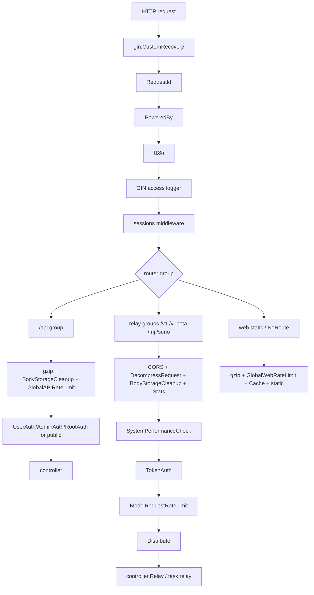

# Middleware、路由装配与请求生命周期学习指南

这篇文档专门梳理 new-api 的 Gin 路由和 middleware 链路。读完它，你应该能把一个请求从进入 HTTP server 到进入 controller/relay 前发生的事情讲清楚：

- `main.go` 如何创建 Gin engine 并挂全局 middleware。
- `router.SetRouter` 如何分 `/api`、relay、旧 dashboard 兼容接口、视频任务和前端静态资源。
- `UserAuth`、`AdminAuth`、`RootAuth`、`TokenAuth`、`Distribute` 分别写入哪些 context。
- 限流、CORS、gzip、请求解压、BodyStorage 清理、Turnstile、安全二次验证、系统性能保护分别在哪里生效。
- relay 请求为什么必须经过 `TokenAuth -> ModelRequestRateLimit -> Distribute -> controller.Relay`。

本文适合已经掌握 Go 基本语法，正在学习 Gin 中间件、路由组、上下文传值和真实网关请求治理的读者。

## 一句话总览

new-api 的请求生命周期是一个 **分层 middleware pipeline**：

1. `main.go` 创建 Gin engine，挂全局 panic recovery、request id、版本头、语言检测、访问日志、session。
2. `router.SetRouter` 注册 API、relay、视频、旧 dashboard 和前端静态资源。
3. 路由组继续挂业务级 middleware，例如 gzip、CORS、全局限流、TokenAuth、UserAuth、SystemPerformanceCheck。
4. relay 路由在 controller 前一定要做 token 鉴权、模型请求限流、渠道分发和上下文写入。
5. controller/relay 从 Gin context 读取用户、token、渠道、模型、语言、request id 等信息，继续执行业务。

核心源码入口：

| 主题 | 关键文件 |
| --- | --- |
| 程序启动与全局 middleware | `main.go` |
| 环境变量与限流默认配置 | `common/init.go` |
| 总路由装配 | `router/main.go` |
| 后台 API 路由 | `router/api-router.go` |
| relay API 路由 | `router/relay-router.go` |
| 视频 relay 路由 | `router/video-router.go` |
| 旧 dashboard 兼容路由 | `router/dashboard.go` |
| 前端静态资源路由 | `router/web-router.go` |
| session/user/admin/root/token 鉴权 | `middleware/auth.go` |
| 渠道选择与 relay context 写入 | `middleware/distributor.go` |
| 全局/IP/用户限流 | `middleware/rate-limit.go` |
| 模型请求限流 | `middleware/model-rate-limit.go` |
| 请求体解压与大小限制 | `middleware/gzip.go`、`middleware/request_body_limit.go` |
| request id、日志、语言、清理 | `middleware/request-id.go`、`middleware/logger.go`、`middleware/i18n.go`、`middleware/body_cleanup.go` |
| CORS、缓存、防缓存 | `middleware/cors.go`、`middleware/cache.go`、`middleware/disable-cache.go` |
| Turnstile、安全二次验证 | `middleware/turnstile-check.go`、`middleware/secure_verification.go` |
| 性能保护和连接统计 | `middleware/performance.go`、`middleware/stats.go` |
| context key 总表 | `constant/context_key.go` |

## 总流程图



Gin middleware 是洋葱模型：先注册的先进入，调用 `c.Next()` 后才继续后面的 handler；后置清理逻辑写在 `c.Next()` 之后。

典型例子是 `BodyStorageCleanup()`：

```go
return func(c *gin.Context) {
    c.Next()
    common.CleanupBodyStorage(c)
    service.CleanupFileSources(c)
}
```

它不是请求前做事，而是在请求结束后清理 body 缓存和文件资源。

## main.go：全局 middleware 顺序

`main.go` 初始化资源和后台任务之后，创建 Gin engine：

```go
server := gin.New()
```

然后按顺序挂全局 middleware：

1. `gin.CustomRecovery(...)`
2. `middleware.RequestId()`
3. `middleware.PoweredBy()`
4. `middleware.I18n()`
5. `middleware.SetUpLogger(server)`
6. `sessions.Sessions("session", store)`

这几个对所有路由生效，包括 `/api`、relay、web 静态资源和 NoRoute。

### CustomRecovery

全局 panic recovery 捕获 handler 或 middleware 的 panic，写系统日志，然后返回：

```json
{
  "error": {
    "message": "Panic detected, error: ...",
    "type": "new_api_panic"
  }
}
```

它是最后的兜底。relay 目录里还有一个 `RelayPanicRecover()`，但当前主路由靠 `gin.CustomRecovery` 覆盖全局。

### RequestId

`middleware.RequestId()` 每个请求生成一个 id：

- 写入 Gin context：`common.RequestIdKey`
- 写入标准 `context.Context`
- 写响应头：`X-Oneapi-Request-Id`

后续日志、消费日志、错误排查都会用这个 id 串起来。

### PoweredBy

`middleware.PoweredBy()` 写响应头：

```http
X-New-Api-Version: <common.Version>
```

它只写 header，不改变请求流。

### I18n

`middleware.I18n()` 检测语言并写入：

```go
constant.ContextKeyLanguage
```

检测顺序：

1. 如果 context 已经有 `dto.UserSetting`，优先用用户设置语言。
2. 解析 `Accept-Language`。
3. 回退到默认语言。

注意一个小边界：全局 I18n 在 UserAuth/TokenAuth 之前运行，所以大多数请求进入 I18n 时还没有用户设置。后续业务如果需要用户语言，通常还会通过 `common.TranslateMessage(c, ...)` 或 `i18n.T(c, ...)` 从当前 context/header 取。

### Logger

`middleware.SetUpLogger(server)` 使用 Gin logger formatter 输出：

```text
[GIN] time | route_tag | request_id | status | latency | client_ip | method path
```

`route_tag` 由各路由组的 `middleware.RouteTag("api")`、`RouteTag("relay")`、`RouteTag("old_api")` 写入。没有写时默认是 `web`。

### Session

session 使用 cookie store：

- 名称：`session`
- `MaxAge`: 30 天
- `HttpOnly`: true
- `SameSite`: strict

后台管理 API 的 `UserAuth/AdminAuth/RootAuth` 主要依赖这个 session，也支持 access token 作为 fallback。

## router.SetRouter：五类路由

总入口在 `router/main.go`：

```go
func SetRouter(router *gin.Engine, assets ThemeAssets) {
    SetApiRouter(router)
    SetDashboardRouter(router)
    SetRelayRouter(router)
    SetVideoRouter(router)
    ...
    SetWebRouter(router, assets)
}
```

顺序很重要：

1. 先注册精确 API/relay 路由。
2. 最后注册 web 静态资源和 NoRoute。
3. 如果 `FRONTEND_BASE_URL` 设置且当前不是 master node，则 NoRoute 会重定向到外部前端。

这保证 `/api/...` 和 `/v1/...` 不会被前端 SPA fallback 吃掉。

还有一个 Gin 细节：`router.Use(...)` 只影响它之后注册的路由，不会 retroactively 改写已经注册好的 route。因此 `SetRelayRouter()` 里追加的 engine-level CORS/解压/Stats 不会影响之前已经注册的 `/api` 和旧 dashboard 路由，但会影响随后注册的 relay、video、web 和 NoRoute。

## /api 后台 API 路由组

`router/api-router.go` 创建：

```go
apiRouter := router.Group("/api")
apiRouter.Use(middleware.RouteTag("api"))
apiRouter.Use(gzip.Gzip(gzip.DefaultCompression))
apiRouter.Use(middleware.BodyStorageCleanup())
apiRouter.Use(middleware.GlobalAPIRateLimit())
```

所以 `/api` 下默认有：

- route tag = `api`
- 响应 gzip
- 请求结束后清理 BodyStorage/file sources
- 全局 API IP 限流

然后按接口再叠加：

| 路由类型 | 常见 middleware |
| --- | --- |
| 公开信息 | 无额外 auth，例如 `/api/status`、`/api/notice` |
| 登录注册/密码/OAuth | `CriticalRateLimit`、`AnonymousRequestBodyLimit`、`TurnstileCheck` |
| 用户自助 | `UserAuth` |
| 管理后台 | `AdminAuth` |
| root 系统设置 | `RootAuth` |
| 搜索接口 | `SearchRateLimit` |
| 密钥导出 | `CriticalRateLimit` + `DisableCache`，部分还需要安全验证 |
| webhook 回调 | 通常无 auth，但挂匿名 body limit |

`/api/channel` 是一个值得单独记的管理路由：整组先挂 `AdminAuth()`，普通渠道操作再用 `RequirePermission(...)` 做细粒度权限；查看 channel key、上游密码、上游 auth session 这类高敏接口还会叠加 `RootAuth + CriticalRateLimit + DisableCache + SecureVerificationRequired`。

### HeaderNavModuleAuth

Pricing、Rankings、Perf Metrics 这类页面接口不是简单公开/登录二选一，而是受 `HeaderNavModules` 配置控制。

`HeaderNavModuleAuth(module)` 规则：

- 配置为空：默认公开，但会尝试读取登录态。
- module disabled：root session 允许，其他人 403。
- `requireAuth=true`：必须登录。
- 否则 `TryUserAuth()`，有登录态就写入 `id/role`，没有也放行。

`HeaderNavModulePublicOrUserAuth(module)` 类似，但 disabled 或 requireAuth 时要求登录，适合“公开可看，但禁用后登录用户仍可看”的接口。

## relay 路由组

`router/relay-router.go` 在 engine 上先挂四个全局 relay middleware：

```go
router.Use(middleware.CORS())
router.Use(middleware.DecompressRequestMiddleware())
router.Use(middleware.BodyStorageCleanup())
router.Use(middleware.StatsMiddleware())
```

这是 engine-level 的 `Use`，在 `SetRelayRouter` 调用后注册的路由都会经过它。因为 `/api` 和旧 dashboard 已在前面注册，它们不会吃到这组 middleware；relay、video、web 静态资源和 NoRoute 会吃到。核心目的主要是 relay/API 客户端兼容。

relay 主要路由：

| 路由组 | 主要用途 | middleware |
| --- | --- | --- |
| `/v1/models` | OpenAI/Claude/Gemini 兼容模型列表 | `RouteTag("relay")` + `TokenAuth` |
| `/v1beta/models` GET | Gemini 模型列表 | `RouteTag("relay")` + `TokenAuth` |
| `/pg` | playground relay | `RouteTag("relay")` + `SystemPerformanceCheck` + `UserAuth` + `Distribute` |
| `/v1` | OpenAI/Claude/Responses/Audio/Image/Embedding/Rerank | `RouteTag("relay")` + `SystemPerformanceCheck` + `TokenAuth` + `ModelRequestRateLimit` + `Distribute` |
| `/v1beta` POST | Gemini 原生 relay | 同上 |
| `/mj`、`/:mode/mj` | Midjourney proxy | `SystemPerformanceCheck` + `TokenAuth` + `Distribute`，但 `GET /image/:id` 在 token middleware 前注册 |
| `/suno` | Suno task relay | `SystemPerformanceCheck` + `TokenAuth` + `Distribute` |

### OpenAI/Claude/Responses 路由

`/v1` 下的 HTTP routes 会根据 path 指定 relay format：

- `/v1/messages` -> `types.RelayFormatClaude`
- `/v1/chat/completions` -> `types.RelayFormatOpenAI`
- `/v1/responses` -> `types.RelayFormatOpenAIResponses`
- `/v1/responses/compact` -> `types.RelayFormatOpenAIResponsesCompaction`
- `/v1/images/*` -> `types.RelayFormatOpenAIImage`
- `/v1/embeddings` -> `types.RelayFormatEmbedding`
- `/v1/audio/*` -> `types.RelayFormatOpenAIAudio`
- `/v1/rerank` -> `types.RelayFormatRerank`
- `/v1/models/*path` -> `types.RelayFormatGemini`

这些 handler 最终都调用：

```go
controller.Relay(c, format)
```

### WebSocket Realtime

`/v1/realtime` 是 GET WebSocket 路由：

```go
wsRouter.Use(middleware.Distribute())
wsRouter.GET("/realtime", func(c *gin.Context) {
    controller.Relay(c, types.RelayFormatOpenAIRealtime)
})
```

TokenAuth 会从 `Sec-WebSocket-Protocol` 里提取 `openai-insecure-api-key.<key>` 并改写成 Authorization header。

## video router

`router/video-router.go` 单独注册视频相关入口：

- `/v1/video/generations`
- `/v1/videos`
- `/v1/videos/:video_id/remix`
- `/v1/videos/:task_id/content`
- `/kling/v1/...`
- `jimeng/...`

特点：

- 任务提交一般走 `TokenAuth + Distribute`。
- 视频内容下载用 `TokenOrUserAuth`，允许 dashboard 用户或 API token 访问。
- Kling/Jimeng 官方格式会先经过对应 request convert middleware，再进入统一 task relay。

这体现了 new-api 的一个常见模式：不同外部协议先被 middleware 转成内部统一任务格式，再复用 `controller.RelayTask`。

## web router

`router/web-router.go` 注册前端静态资源：

```go
router.Use(gzip.Gzip(gzip.DefaultCompression))
router.Use(middleware.GlobalWebRateLimit())
router.Use(middleware.Cache())
router.Use(static.Serve("/", themeFS))
router.NoRoute(...)
```

`themeFS` 是 default/classic 两套前端构成的 theme-aware 文件系统。

NoRoute 行为：

- 如果 path 以 `/v1`、`/api`、`/assets` 开头，返回 relay not found。
- 否则返回当前主题的 `index.html`，支持 SPA 前端路由。

`Cache()` 对 `/` 写 `no-cache`，其他静态资源写一周缓存，并带 `Cache-Version`。

## 旧 dashboard 兼容路由

`router/dashboard.go` 注册旧 OpenAI dashboard 兼容路径：

- `/dashboard/billing/subscription`
- `/v1/dashboard/billing/subscription`
- `/dashboard/billing/usage`
- `/v1/dashboard/billing/usage`

middleware：

- route tag = `old_api`
- gzip
- GlobalAPIRateLimit
- CORS
- TokenAuth

它们不是后台页面接口，而是 OpenAI dashboard API 兼容层。

## Auth middleware：session、access token、API token

new-api 有两条主要鉴权线：

1. 后台管理/用户中心：`UserAuth/AdminAuth/RootAuth`
2. relay API：`TokenAuth`

### UserAuth/AdminAuth/RootAuth

三者都调用：

```go
authHelper(c, minRole)
```

流程：

1. 先从 session 取 `username/role/id/status`。
2. 如果 session 没有 username，再从 `Authorization` 读取 access token。
3. access token 通过 `model.ValidateAccessToken()` 找用户。
4. 校验请求头 `New-Api-User` 必须存在，并且和 session/access token 用户 id 一致。
5. 检查用户未禁用。
6. 检查角色 >= minRole。
7. 写响应头 `Auth-Version`。
8. 写 Gin context：`username`、`role`、`id`、`group`、`user_group`、`use_access_token`。
9. 如果是 admin/root，写操作会开启审计兜底。

`UserAuth` 要求普通用户，`AdminAuth` 要求管理员，`RootAuth` 要求 root。

一个容易忽略的细节：后台 API 不只是靠 cookie，还要求 `New-Api-User` header 与 session/access token 中的 id 对得上。这是前端请求封装的一部分，也降低了跨版本/错用户调用风险。

### TryUserAuth

`TryUserAuth()` 很轻，只从 session 取 id/role，取不到也放行。它用于公开接口但希望“如果用户已登录，就能看到更多信息”的场景，例如公开 Pricing 页面。

### TokenAuth

`TokenAuth()` 负责 API Key 鉴权，兼容多种 provider 的 key 传法。

它会先把不同来源规范化成 `Authorization: Bearer ...`：

| 场景 | key 来源 |
| --- | --- |
| OpenAI 普通请求 | `Authorization: Bearer sk-...` |
| Realtime WebSocket | `Sec-WebSocket-Protocol` 中的 `openai-insecure-api-key...` |
| Claude Messages/Models | `x-api-key` |
| Gemini | query `key` 或 header `x-goog-api-key` |
| Midjourney | `mj-api-secret` |

然后：

1. 去掉 `Bearer ` 和 `sk-` 前缀。
2. 按 `-` split，第一段作为 token key；第二段可能是指定渠道 id。
3. 调用 `model.ValidateUserToken(key)`。
4. 检查 token IP 白名单。
5. 读取 user cache，确认用户未禁用。
6. `userCache.WriteContext(c)` 写用户上下文。
7. 校验 token group 是否在用户可用分组里。
8. 校验 group 是否仍存在，`auto` 除外。
9. 写 `ContextKeyUsingGroup`。
10. 调用 `SetupContextForToken()` 写 token 上下文。

`SetupContextForToken()` 写入：

- `id`
- `token_id`
- `token_key`
- `token_name`
- `token_unlimited_quota`
- `token_quota`
- `token_model_limit_enabled`
- `token_model_limit`
- `token_group`
- `token_cross_group_retry`
- `specific_channel_id`，仅管理员 token 支持

### TokenAuthReadOnly

`TokenAuthReadOnly()` 用于只读查询接口，例如按 token 查 usage/log。它只验证 token key 存在和用户未禁用，不检查 token 状态、过期时间和额度。

这让用户可以用已经耗尽/过期的 key 查询历史用量，但不能继续 relay。

### TokenOrUserAuth

`TokenOrUserAuth()` 先尝试 session 用户，失败后回退 `TokenAuth()`。它用于视频内容这类既可能从控制台访问，也可能从 API 客户端访问的资源。

## Distribute：relay 前最关键的 middleware

`middleware.Distribute()` 是 relay 请求进入 controller 前的最后一道大门。它做两件大事：

1. 从请求里解析模型，选择渠道。
2. 把选中的渠道信息写入 Gin context。

### 解析模型

`getModelRequest(c)` 根据不同路径解析模型：

| 路径/内容 | 模型来源 |
| --- | --- |
| 普通 JSON | body 的 `model` 字段 |
| `/v1/realtime` | query `model` |
| `/v1/moderations` | 缺省 `text-moderation-stable` |
| embeddings legacy path | path param `model` |
| `/v1/images/generations` | 缺省 `dall-e` |
| `/v1/audio/speech` | 缺省 `tts-1` |
| `/v1/audio/transcriptions`/translations | body model 或缺省 `whisper-1` |
| Gemini `/v1beta/models/{model}:...` | 从路径提取 model |
| Midjourney/Suno/Video task | 根据 task action 或已存任务回填 |
| Playground | body 的 `model` 和 `group` |
| `/v1/responses/compact` | 模型名追加 compact suffix |

JSON 请求会通过 `common.GetBodyStorage(c)` 读 body，再 `Seek(0)` 把 body 复位，保证后面的 controller/relay 还能继续读。

### token 模型白名单

如果 token 启用了模型限制：

1. 从 context 取 `token_model_limit`。
2. 用 `ratio_setting.FormatMatchingModelName()` 规范化模型名。
3. 不在白名单里则 403。

### 指定渠道

如果 token key 包含指定渠道 id，并且 token 用户是管理员：

```text
sk-<token>-<channelId>
```

`SetupContextForToken()` 会写 `specific_channel_id`，`Distribute()` 直接取该渠道。

普通用户指定渠道会被拒绝。

### 渠道选择

正常选择走：

```go
service.CacheGetRandomSatisfiedChannel(&service.RetryParam{
    Ctx:         c,
    ModelName:   modelRequest.Model,
    TokenGroup:  usingGroup,
    RequestPath: c.Request.URL.Path,
    Retry:       common.GetPointer(0),
})
```

它会考虑：

- token/user group
- auto group
- priority/weight
- fallback model
- negative cache
- channel affinity
- Advanced Custom path 支持

选择失败时返回 OpenAI 风格错误。

### 写入渠道 context

`SetupContextForSelectedChannel(c, channel, modelName)` 写入：

- `original_model`
- `channel_id`
- `channel_name`
- `channel_type`
- `channel_create_time`
- `channel_setting`
- `channel_other_setting`
- `param_override`
- `header_override`
- `channel_organization`
- `auto_ban`
- `model_mapping`
- `status_code_mapping`
- `channel_is_multi_key`
- `channel_multi_key_index`
- `channel_key`
- `base_url`
- `system_prompt_override`

还会根据 channel type 写一些 provider 特定 context：

| channel type | context |
| --- | --- |
| Azure | `api_version` |
| Vertex AI | `region` |
| Xunfei/Gemini/Cloudflare/MokaAI | `api_version` |
| Ali | `plugin` |
| Coze | `bot_id` |

relay 后续的 `relay/common/relay_info.go` 会把这些 context 聚合成 `RelayInfo`。

## context key：请求状态的共享总线

new-api 大量使用 Gin context 作为请求内状态总线。核心 key 定义在 `constant/context_key.go`。

可以按来源分类理解。

### Request 层

- `X-Oneapi-Request-Id`
- `request_start_time`
- `language`
- `is_stream`

### User 层

由 session auth 或 token auth 写入：

- `id`
- `username`
- `user_group`
- `group`
- `user_quota`
- `user_status`
- `user_email`
- `user_setting`

### Token 层

由 `TokenAuth` 写入：

- `token_id`
- `token_key`
- `token_group`
- `token_unlimited_quota`
- `token_model_limit_enabled`
- `token_model_limit`
- `token_cross_group_retry`
- `specific_channel_id`

### Channel 层

由 `Distribute` 写入：

- `channel_id`
- `channel_name`
- `channel_type`
- `base_url`
- `channel_key`
- `channel_setting`
- `channel_other_setting`
- `param_override`
- `header_override`
- `model_mapping`
- `status_code_mapping`
- `channel_is_multi_key`
- `channel_multi_key_index`

### Relay/计费层

后续 relay 和 service 会继续写：

- `prompt_tokens`
- `estimated_tokens`
- `local_count_tokens`
- `admin_reject_reason`
- `file_sources_to_cleanup`
- `audit_logged`

学习这块源码时要养成一个习惯：看到 `common.GetContextKey...`，马上反查是谁 `SetContextKey`。这比从函数参数找数据来源更有效。

## 限流体系

new-api 有多层限流，不是一个统一开关。

### 全局 IP 限流

`middleware/rate-limit.go` 提供：

- `GlobalWebRateLimit`
- `GlobalAPIRateLimit`
- `CriticalRateLimit`
- `DownloadRateLimit`
- `UploadRateLimit`

默认配置来自 `common.InitEnv()`：

- `GLOBAL_API_RATE_LIMIT_ENABLE`
- `GLOBAL_API_RATE_LIMIT`
- `GLOBAL_API_RATE_LIMIT_DURATION`
- `GLOBAL_WEB_RATE_LIMIT_ENABLE`
- `GLOBAL_WEB_RATE_LIMIT`
- `GLOBAL_WEB_RATE_LIMIT_DURATION`
- `CRITICAL_RATE_LIMIT_ENABLE`
- `CRITICAL_RATE_LIMIT`
- `CRITICAL_RATE_LIMIT_DURATION`
- `SEARCH_RATE_LIMIT_ENABLE`
- `SEARCH_RATE_LIMIT`
- `SEARCH_RATE_LIMIT_DURATION`

key 是：

```text
rateLimit:<mark><clientIP>
```

有 Redis 时用 Redis list 记录时间窗口；无 Redis 时用 `common.InMemoryRateLimiter`。Redis 是否启用取决于 `REDIS_CONN_STRING` 初始化是否成功。

命中限制通常返回纯 HTTP 429；Redis 或时间解析错误通常返回纯 HTTP 500。用户维度限流如果没有在 auth 之后使用，会因为缺少 `id` 返回 401。

### SearchRateLimit

搜索接口使用用户维度限流，而不是 IP：

```go
userRateLimitFactory(..., "SR")
```

它必须挂在 `UserAuth()` 之后，因为需要 `id`。

这可以防止用户通过代理轮换 IP 绕过搜索限流。

### EmailVerificationRateLimit

邮箱验证码有单独限流：

- key 维度：client IP
- 30 秒最多 2 次
- Redis 用 `INCR + TTL`
- Redis 失败会 fallback 到内存限流

超限返回：

```json
{
  "success": false,
  "message": "发送过于频繁，请等待 N 秒后再试"
}
```

### ModelRequestRateLimit

这是 relay 模型请求限流，挂在 `/v1` 和 `/v1beta` relay 路由上，位于 `TokenAuth()` 之后、`Distribute()` 之前。

配置来源：

- `setting.ModelRequestRateLimitEnabled`
- `setting.ModelRequestRateLimitDurationMinutes`
- `setting.ModelRequestRateLimitCount`
- `setting.ModelRequestRateLimitSuccessCount`
- `setting.GetGroupRateLimit(group)`

这些值来自 DB option 加载后的 setting 内存态，支持全局配置和分组覆盖。

它有两个计数：

1. **总请求数限制**：包括失败请求。
2. **成功请求数限制**：只在 `c.Writer.Status() < 400` 后记录。

有 Redis 时：

- 成功请求数用 Redis list 检查窗口。
- 总请求数用 `common/limiter` 的 Redis token bucket Lua 脚本。

无 Redis 时：

- 用 `InMemoryRateLimiter`。

几个实现细节：

- Redis 版本的总请求限流用 token bucket；普通全局限流用 list sliding window。它们不是同一个算法。
- Redis 版本的错误/超限使用 OpenAI 风格 JSON，并带 request id。
- 内存版本的超限目前返回纯 HTTP 429。
- 内存版本的成功请求限制用 `_check` key 做请求前预检查，行为更接近“尝试数预限流”；请求成功后才写实际 success key。

## 请求体治理

### DecompressRequestMiddleware

`middleware.DecompressRequestMiddleware()` 支持：

- `Content-Encoding: gzip`
- `Content-Encoding: br`
- 未压缩 body

它会：

1. 跳过 GET 或空 body。
2. 根据 `constant.MaxRequestBodyMB` 计算最大解压后大小，环境默认是 128MB，代码里如果配置值小于等于 0 会兜底 32MB。
3. 用 `http.MaxBytesReader` 包住 body，防止超大请求或 zip bomb。
4. 解压成功后删除 `Content-Encoding` header。

这个 middleware 在 relay router 里是 engine-level 挂载，因此大体保护所有后续注册的请求。

### AnonymousRequestBodyLimit

匿名敏感接口，比如注册、登录、密码重置、webhook，会额外挂：

```go
anonymousRequestBodyLimit := middleware.AnonymousRequestBodyLimit()
```

限制值来自：

```go
common.GetAnonymousRequestBodyLimitBytes()
```

环境变量是：

```text
ANONYMOUS_REQUEST_BODY_LIMIT_KB
```

它会完整读 body，如果超过限制返回 413；读完后用 `io.NopCloser(bytes.NewReader(...))` 放回 request body，保证后续 controller 还能读。

### BodyStorageCleanup

很多地方会用 `common.GetBodyStorage(c)` 把请求体缓存成可复读对象。middleware 在请求结束后清理：

- `common.CleanupBodyStorage(c)`
- `service.CleanupFileSources(c)`

这对 multipart、多模态文件、URL/base64 文件下载尤其重要。

BodyStorage 本身还会根据性能配置在内存和磁盘之间选择：小 body 走内存；启用磁盘缓存且超过阈值、容量允许时才落磁盘。从 `[]byte` 创建磁盘缓存失败可以回退内存；但从 reader 直接写磁盘失败时 body 已经被消费，不能完全安全回退。

## CORS、gzip、缓存

### CORS

`middleware.CORS()` 使用 gin-contrib/cors：

- `AllowAllOrigins = true`
- `AllowCredentials = true`
- methods: GET/POST/PUT/DELETE/OPTIONS
- headers: `*`

relay 和旧 dashboard 兼容路由会挂 CORS。

### gzip

后台 `/api` 和 web 静态资源使用 gin-contrib/gzip。主 engine 上有一行被注释：

```go
// This will cause SSE not to work!!!
//server.Use(gzip.Gzip(gzip.DefaultCompression))
```

这说明不能对所有请求无脑 gzip，否则 SSE 流式响应可能出问题。

### Cache / DisableCache

`Cache()` 用于静态资源：

- `/` -> `Cache-Control: no-cache`
- 其他路径 -> `max-age=604800`
- 写 `Cache-Version`

`DisableCache()` 用于敏感接口，例如 token key 导出、upstream password/session：

- `Cache-Control: no-store, no-cache, must-revalidate, private, max-age=0`
- `Pragma: no-cache`
- `Expires: 0`

## Turnstile 与安全二次验证

### TurnstileCheck

如果 `common.TurnstileCheckEnabled` 开启：

1. 先看 session 是否已有 `turnstile`。
2. 没有则从 query 读取 `turnstile` token。
3. 调 Cloudflare siteverify。
4. 成功后写 session `turnstile=true`。

常挂在：

- 注册
- 登录
- 发送密码重置邮件
- check-in
- 邮箱验证码

相关开关和 site key/secret 来自 DB options。它返回的是后台统一 JSON，而不是 OpenAI error；失败时很多分支返回 HTTP 200 + `{success:false,message}`，这是后台交互接口的历史风格。

### SecureVerificationRequired

安全二次验证用于高敏操作，例如渠道 upstream password 或 upstream auth session。

它要求：

- 用户已经登录，context 有 `id`。
- session 中有 `secure_verified_at`。
- 时间未超过 300 秒。

失败时返回：

- `VERIFICATION_REQUIRED`
- `VERIFICATION_INVALID`
- `VERIFICATION_EXPIRED`

验证状态由 `/api/verify` 写入 session，超时时间目前硬编码为 300 秒。它依赖 cookie session，没有 Redis fallback。

`OptionalSecureVerification()` 不阻断请求，只写：

- `secure_verified`
- `secure_verified_at`

用于“根据是否验证展示不同信息”的场景。

## SystemPerformanceCheck 与 StatsMiddleware

### SystemPerformanceCheck

relay 请求会先检查系统负载：

- CPU
- Memory
- Disk

配置来自：

```go
common.GetPerformanceMonitorConfig()
```

如果超过阈值，返回 503。Claude `/v1/messages` 会返回 Claude 错误格式，其他默认 OpenAI 错误格式。

这层保护在渠道选择和上游请求之前执行，可以在本机过载时尽早拒绝新 relay。

配置的默认值和同步逻辑在 `common/performance_config.go` 与 `setting/performance_setting`。Root 性能管理接口更新 option 后会同步到 common 层。

### StatsMiddleware

`StatsMiddleware()` 用 atomic 维护活跃连接数：

- 请求进入：`activeConnections + 1`
- 请求结束：defer `activeConnections - 1`

`middleware.GetStats()` 返回当前活跃连接数，供状态/性能接口使用。

## 管理审计兜底

`AdminAuth()` 和 `RootAuth()` 鉴权通过后，会自动对写操作开启审计兜底：

1. `beginAdminAudit(c)` 包装 `gin.ResponseWriter`。
2. handler 执行。
3. `finishAdminAudit(c, writer)` 判断是否成功。
4. 如果 handler 没有设置 `ContextKeyAuditLogged`，自动写操作审计日志。

只对这些方法生效：

- POST
- PUT
- PATCH
- DELETE

响应成功判断：

1. HTTP status >= 400 视为失败。
2. 如果响应体是 JSON 且有 `success` 字段，优先用它。
3. 否则 status < 400 视为成功。

这是一种很实用的设计：把“管理写操作必须留痕”放进鉴权链路，避免新增管理接口时忘记挂审计。

## 三条典型请求 walkthrough

### 1. 登录请求 `/api/user/login`

路径：

```text
POST /api/user/login
```

执行链：

1. `gin.CustomRecovery`
2. `RequestId`
3. `PoweredBy`
4. `I18n`
5. Gin logger
6. session
7. `/api` group: `RouteTag("api")`
8. gzip
9. `BodyStorageCleanup`
10. `GlobalAPIRateLimit`
11. route-level `CriticalRateLimit`
12. route-level `AnonymousRequestBodyLimit`
13. route-level `TurnstileCheck`
14. `controller.Login`
15. 请求结束后清理 body/file sources

它不走 `UserAuth`，因为登录前还没有用户。

### 2. 后台管理员创建渠道

路径：

```text
POST /api/channel/
```

执行链大体是：

1. 全局 middleware
2. `/api` group middleware
3. `AdminAuth`
4. `authHelper` 校验 session/access token、`New-Api-User`、角色
5. `beginAdminAudit`
6. `controller.AddChannel`
7. `finishAdminAudit`
8. `BodyStorageCleanup`

如果 handler 自己记录了更精细审计，会设置 `audit_logged`，兜底审计就跳过。

### 3. OpenAI Chat relay

路径：

```text
POST /v1/chat/completions
```

执行链：

1. 全局 middleware
2. relay engine-level `CORS`
3. `DecompressRequestMiddleware`
4. `BodyStorageCleanup`
5. `StatsMiddleware`
6. `/v1` group `RouteTag("relay")`
7. `SystemPerformanceCheck`
8. `TokenAuth`
9. `ModelRequestRateLimit`
10. `Distribute`
11. `controller.Relay(c, types.RelayFormatOpenAI)`
12. 请求结束后记录成功模型限流、亲和性、清理 body/file sources、active connections -1

`controller.Relay` 里生成 `RelayInfo` 时，会读取前面 middleware 写入的 user/token/channel context。

## 常见排查路线

### 返回 401/403，没进 controller

先看路由上挂的是哪种 auth：

- `UserAuth`：检查 session/access token、`New-Api-User` header、角色、用户状态。
- `AdminAuth/RootAuth`：检查角色。
- `TokenAuth`：检查 Authorization/x-api-key/key/mj-api-secret 是否被规范化到 token key。
- `TokenOrUserAuth`：确认是 session 还是 token 路径。

### relay 选不到渠道

顺序排查：

1. `TokenAuth` 是否写入用户和 token group。
2. token 模型白名单是否拒绝。
3. `Distribute` 是否解析到正确 model。
4. 使用 group 是否存在或是否为 auto。
5. channel ability 是否支持模型。
6. Advanced Custom 是否支持当前 request path。
7. negative cache/affinity 是否影响选择。

### 请求体读一次后后面读不到

看是否使用：

- `common.GetBodyStorage(c)`
- `common.UnmarshalBodyReusable(c, ...)`
- `storage.Seek(0, io.SeekStart)`

如果自己直接 `io.ReadAll(c.Request.Body)`，就可能破坏后续读取。

### SSE/流式异常

确认没有把全局 gzip 打开。`main.go` 明确注释全局 gzip 会影响 SSE。只应在 `/api` 或 web 静态资源等非 SSE 场景使用 gzip。

### 429 Too Many Requests

要分清是哪一层：

- `/api` 或 dashboard：`GlobalAPIRateLimit`
- web 静态资源：`GlobalWebRateLimit`
- 高危接口：`CriticalRateLimit`
- 搜索：`SearchRateLimit`
- 邮箱验证码：`EmailVerificationRateLimit`
- relay 模型请求：`ModelRequestRateLimit`

不同限流的 key 维度、配置来源和错误格式都不同。

### 413 Request Entity Too Large

可能来自：

- `AnonymousRequestBodyLimit`
- `DecompressRequestMiddleware` 的 `http.MaxBytesReader`

前者限制匿名接口 body，后者限制解压后请求体大小。

## 从 Go/Gin 学习角度看这块源码

### 1. 路由组叠加 middleware

Gin 的 `router.Group("/api")` 和 `group.Use(...)` 是理解项目入口的关键。new-api 用它表达“所有 `/api` 都有全局 API 限流，但只有部分 route 需要登录”。

### 2. 中间件前置和后置逻辑

看到 `c.Next()` 前后位置，要判断它是前置检查还是后置清理。`BodyStorageCleanup`、`ModelRequestRateLimit` 的成功计数、`AdminAuth` 审计都是后置逻辑。

### 3. Context 作为请求内依赖注入

`TokenAuth` 不直接调用 relay，而是写 context；`Distribute` 不直接调用上游，而是写 channel context；`RelayInfo` 再统一读取。这个模式让 middleware 链条解耦，但也要求读源码时追踪 context key。

### 4. 多协议兼容前置规范化

`TokenAuth` 把 Claude、Gemini、Realtime、Midjourney 的 key 位置都规范化成内部 token key。这是一种网关常见技巧：外部协议各不相同，内部先统一成一种上下文。

### 5. Redis/内存双实现

限流和缓存经常有 Redis 版本和内存 fallback。读这类代码时要同时看：

- 多实例场景下 Redis 共享状态。
- 单实例或 Redis 关闭时内存 fallback。
- Redis 错误时是否 fail open、fail closed 或 fallback。

### 6. 错误格式按入口协议区分

relay middleware 常用 `abortWithOpenAiMessage` 或根据 path 返回 Claude/OpenAI 错误格式。后台 API 则返回 `{success, message}`。这是 API gateway 项目里非常重要的“入口协议一致性”。

## 推荐阅读顺序

1. `main.go`：只看 Gin engine 创建和 `server.Use` 顺序。
2. `router/main.go`：理解总路由装配顺序。
3. `router/api-router.go`：看后台 API 如何按 User/Admin/Root 分组。
4. `router/relay-router.go`：看 relay 路由如何按协议设置 relay format。
5. `middleware/auth.go`：重点读 `authHelper`、`TokenAuth`、`SetupContextForToken`。
6. `middleware/distributor.go`：重点读 `getModelRequest` 和 `SetupContextForSelectedChannel`。
7. `constant/context_key.go`：把 context key 建一张脑图。
8. `middleware/rate-limit.go` 和 `middleware/model-rate-limit.go`：比较普通 IP 限流、用户限流、模型请求限流。
9. `middleware/gzip.go`、`request_body_limit.go`、`body_cleanup.go`：理解请求体复读、大小限制和清理。
10. `middleware/audit.go`、`secure_verification.go`、`turnstile-check.go`：理解后台安全防护。

## 小练习

### 练习 1：手推 `/v1/responses`

问题：`POST /v1/responses` 进入 `controller.Relay` 前，哪些 middleware 会写入 relay 必需 context？

答案要点：

- `RequestId` 写 request id。
- `TokenAuth` 写 user/token/group/model limit。
- `ModelRequestRateLimit` 读取 group 做限流。
- `Distribute` 解析 model、选 channel、写 channel key/base URL/type/setting/model mapping。
- `RouteTag("relay")` 写 route tag 供日志。

### 练习 2：为什么 SearchRateLimit 要挂在 UserAuth 后面

因为它按 `id` 限流。如果没有 `UserAuth` 先写入用户 id，`userRateLimitFactory` 会返回 401。

### 练习 3：解释 BodyStorageCleanup 的时机

它不是请求进入前清理，而是在 `c.Next()` 后清理。这样请求处理期间 body storage 和 file sources 都可用，请求结束后再释放资源。

### 练习 4：区分两种 token

后台 access token 和 relay API token 不是同一个东西：

- access token 给 `UserAuth/AdminAuth/RootAuth` 使用，代表用户登录态 fallback。
- API token 给 `TokenAuth` 使用，代表 relay 调用凭证，会参与 quota、group、model limit、channel selection。

## 本专题的心智模型

new-api 的 middleware 不是一堆散乱函数，而是四层防线：

1. **全局基础层**：panic、request id、版本头、语言、日志、session。
2. **路由组治理层**：CORS、gzip、缓存、全局限流、解压、body 清理、连接统计。
3. **身份与权限层**：User/Admin/Root、TokenAuth、HeaderNav、Turnstile、安全二次验证。
4. **relay 准备层**：系统性能保护、模型请求限流、模型解析、渠道选择、context 写入。

controller 之所以能保持相对聚焦，是因为这些 middleware 已经把“谁在请求、能不能请求、请求哪个模型、用哪个渠道、上游 key/base URL 是什么、出了问题怎么记录”都预处理好了。

读懂这条链路，再去读 `controller.Relay`、计费、provider adaptor，很多看似凭空出现的字段都会变得有来源。
