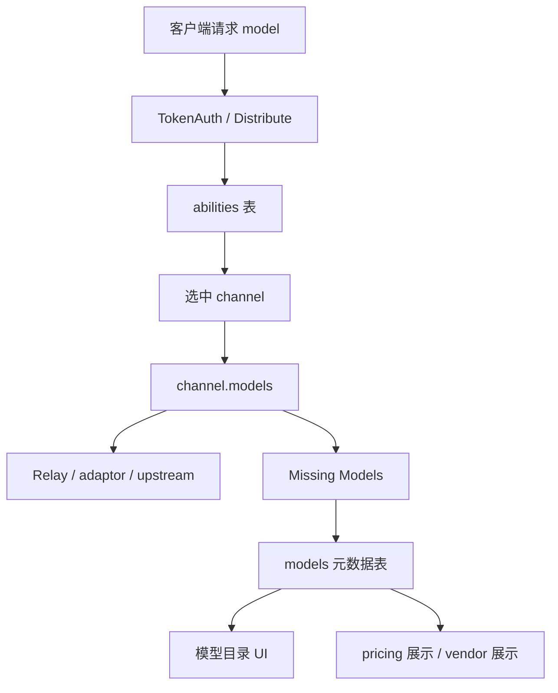

# 模型目录、供应商、部署与上游同步学习指南

这篇文档专门梳理 new-api 里名字最容易混在一起的一组能力：模型元数据、供应商、渠道模型列表、Ability、上游模型检测、模型目录官方同步、价格倍率同步，以及 io.net 模型部署。

读这块源码时先记住一句话：`models` 元数据表主要服务管理台展示和目录治理，真正决定 relay 能不能转发某个模型的是渠道 `models` 字段、`abilities` 表、分组、倍率和渠道选择逻辑。

## 一、先把几个“模型”概念拆开

项目里至少有五类与模型相关的对象：

| 概念 | 主要位置 | 作用 |
| --- | --- | --- |
| 客户端请求里的 model | relay 请求 JSON，例如 `gpt-4o` | 用户实际请求的模型名，是 relay 入口解析、鉴权、计费和渠道选择的核心输入。 |
| channel.models | `model.Channel.Models`，前端渠道表单 | 某个渠道声称支持哪些模型。更新它通常会重建 `abilities`。 |
| abilities | `model/ability.go` | 渠道、模型、分组、优先级、权重的可路由索引。`middleware.Distribute` 主要靠它选渠道。 |
| 模型元数据 | `model.Model` / `/api/models` | 后台模型目录：描述、图标、标签、供应商、匹配规则、是否启用、是否允许官方同步。 |
| provider adaptor 静态列表 | `relay/channel/*` 的 `GetModelList()` | 初始化 `/v1/models` 默认列表和部分渠道类型默认模型，不能代表某个真实账号当前可用模型。 |

这几个层级的关系可以画成：



因此：

- 添加一条 `model.Model` 元数据，不会自动让某个渠道支持这个模型。
- 给渠道添加模型并调用 `UpdateAbilities` 后，模型才进入路由能力集合。
- `model.Model.Status` 更偏目录展示状态；运行时是否可路由主要看渠道状态、ability、分组和倍率。
- `model.Model.NameRule` 允许目录中用前缀、包含、后缀规则汇总多个真实模型，但 relay 请求仍使用真实模型名。

## 二、源码地图

后端核心文件：

| 文件 | 作用 |
| --- | --- |
| `router/api-router.go` | 注册 `/api/models`、`/api/vendors`、`/api/prefill_group`、`/api/deployments`。 |
| `router/channel-router.go` | 注册 `/api/channel/fetch_models/:id` 和 `/api/channel/upstream_updates/*`。 |
| `model/model_meta.go` | `Model` 表结构、名称去重、增删改查、规则匹配辅助查询。 |
| `controller/model_meta.go` | 模型元数据 CRUD、搜索、列表 enrichment。 |
| `model/vendor_meta.go` / `controller/vendor_meta.go` | 供应商 CRUD。 |
| `model/missing_models.go` / `controller/missing_models.go` | 找出被渠道使用但未建元数据的模型。 |
| `controller/model_sync.go` | 从官方 metadata 仓库同步模型和供应商。 |
| `controller/channel.go` | 单渠道即时抓取上游 `/models`。 |
| `controller/channel_upstream_update.go` | 渠道上游模型变更检测、暂存、应用、定时任务。 |
| `controller/system_task_handlers.go` | `model_update` 系统任务注册与执行。 |
| `controller/ratio_sync.go` | 系统设置中的上游价格倍率同步预览。 |
| `service/channel_auto_priority_task.go` | 上游分组倍率同步 + 自动优先级重算的独立后台扫描。 |
| `model/channel_upstream_profile.go` | 渠道上游身份、分组倍率、自动优先级、余额不足通知所需 profile。 |
| `service/upstream_group_ratios.go` | 从 new-api/sub2api 上游拉分组倍率。 |
| `service/upstream_group_ratio_sync.go` | 批量同步上游分组倍率并更新渠道 RPM。 |
| `controller/deployment.go` / `pkg/ionet/*` | io.net 部署代理 API。 |

前端核心文件：

| 文件 | 作用 |
| --- | --- |
| `web/default/src/features/models/index.tsx` | `/models/:section` 页面入口，Metadata / Deployments 两个 section。 |
| `web/default/src/features/models/api.ts` | 模型、供应商、预填组、部署 API 封装。 |
| `web/default/src/features/models/components/models-provider.tsx` | 模型页对话框和当前行状态。 |
| `web/default/src/features/models/components/models-primary-buttons.tsx` | Add Model、Missing Models、Sync Upstream、Prefill Groups、Manage Vendors。 |
| `web/default/src/features/models/components/dialogs/sync-wizard-dialog.tsx` | 模型目录官方同步向导。 |
| `web/default/src/features/models/components/dialogs/upstream-conflict-dialog.tsx` | 选择哪些字段用上游覆盖本地。 |
| `web/default/src/features/models/components/dialogs/missing-models-dialog.tsx` | 展示并一键创建缺失元数据。 |
| `web/default/src/features/models/components/dialogs/create-deployment-drawer.tsx` | 创建 io.net deployment。 |
| `web/default/src/features/channels/components/dialogs/fetch-models-dialog.tsx` | 单渠道抓取上游模型列表并保存到渠道。 |
| `web/default/src/features/channels/hooks/use-channel-upstream-updates.ts` | 渠道上游模型变更检测/应用 API 调用。 |
| `web/default/src/features/channels/components/dialogs/upstream-update-dialog.tsx` | 让管理员勾选新增/删除模型。 |
| `web/default/src/features/system-settings/models/upstream-ratio-sync.tsx` | 系统设置中的上游价格倍率同步 UI。 |

## 三、后端路由层

`router/api-router.go` 里与模型治理相关的后台 API 都要求 `AdminAuth()`：

```text
/api/prefill_group
  GET /                  -> GetPrefillGroups
  POST /                 -> CreatePrefillGroup
  PUT /                  -> UpdatePrefillGroup
  DELETE /:id            -> DeletePrefillGroup

/api/vendors
  GET /                  -> GetAllVendors
  GET /search            -> SearchVendors
  GET /:id               -> GetVendorMeta
  POST /                 -> CreateVendorMeta
  PUT /                  -> UpdateVendorMeta
  DELETE /:id            -> DeleteVendorMeta

/api/models
  GET /sync_upstream/preview -> SyncUpstreamPreview
  POST /sync_upstream        -> SyncUpstreamModels
  GET /missing               -> GetMissingModels
  GET /                      -> GetAllModelsMeta
  GET /search                -> SearchModelsMeta
  GET /:id                   -> GetModelMeta
  POST /                     -> CreateModelMeta
  PUT /                      -> UpdateModelMeta
  DELETE /:id                -> DeleteModelMeta

/api/deployments
  GET /settings
  POST /settings/test-connection
  GET /, /search, /:id
  POST /
  PUT /:id, /:id/name
  POST /:id/extend
  DELETE /:id
  GET /hardware-types, /locations, /available-replicas, /price-estimation, /:id/logs, /:id/containers

/api/ratio_sync
  GET /channels          -> GetSyncableChannels
  POST /fetch            -> FetchUpstreamRatios

/api/option
  GET /channel_auto_priority_scan/status -> GetChannelAutoPriorityScanStatus
  POST /channel_auto_priority_scan/run   -> RunChannelAutoPriorityScan
```

`router/channel-router.go` 里则是渠道级模型能力：

```text
/api/channel/fetch_models/:id
  -> FetchUpstreamModels

/api/channel/upstream_updates/detect
  -> DetectChannelUpstreamModelUpdates

/api/channel/upstream_updates/apply
  -> ApplyChannelUpstreamModelUpdates

/api/channel/upstream_updates/detect_all
  -> DetectAllChannelUpstreamModelUpdates

/api/channel/upstream_updates/apply_all
  -> ApplyAllChannelUpstreamModelUpdates
```

这两个路由组要分开看：`/api/models` 管“目录”，`/api/channel/...` 管“渠道实际可用模型”。

## 四、模型元数据表

`model.Model` 在 `model/model_meta.go`：

| 字段 | 含义 |
| --- | --- |
| `ModelName` | 目录中的模型名或匹配片段，软删除唯一。 |
| `Description`、`Icon`、`Tags` | 展示信息。 |
| `VendorID` | 关联 `vendors.id`。 |
| `Endpoints` | 目录展示用端点信息，列表接口可能动态填充。 |
| `Status` | 启用状态，默认 1。 |
| `SyncOfficial` | 是否允许官方同步覆盖该模型字段。 |
| `NameRule` | 0 exact，1 prefix，2 contains，3 suffix。 |
| `BoundChannels`、`EnableGroups`、`QuotaTypes` | `gorm:"-"` 运行时回填字段，不入库。 |
| `MatchedModels`、`MatchedCount` | 规则匹配模型的展示信息，不入库。 |

### 4.1 Insert 的零值处理

`Model.Insert()` 先保存原始 `Status` 和 `SyncOfficial`，`DB.Create()` 后再 `Updates` 写回。原因是 GORM default tag 可能把 Go 零值当作“没传”，自动套用默认值。项目需要允许 `status=0` 或 `sync_official=0` 被真实保存。

这是读 Go/GORM 时很好的一个例子：struct tag 默认值和业务默认值不是一回事。

### 4.2 Update 强制选择字段

`Model.Update()` 使用：

```text
Select("model_name", "description", "icon", "tags", "vendor_id", "endpoints", "status", "sync_official", "name_rule", "updated_time")
```

这同样是为了解决零值更新问题。比如状态从 1 改成 0，如果直接 `Updates(struct)`，GORM 可能跳过零值字段。

### 4.3 列表 enrichment

`controller.GetAllModelsMeta()` 和 `SearchModelsMeta()` 会调用 `enrichModels(modelsMeta)`。它做三件事：

1. 精确匹配模型：批量查询 `abilities JOIN channels`，回填 `BoundChannels`。
2. 若 `Endpoints` 为空，从 pricing/能力缓存推导 `GetModelSupportEndpointTypes`。
3. 规则匹配模型：遍历 `model.GetPricing()`，按 prefix/contains/suffix 找到所有真实模型，汇总 endpoint、group、quota type 和绑定渠道。

所以列表接口不是单纯读 `models` 表；它还把运行时 pricing/ability 信息融合进来，方便前端显示。

## 五、供应商 Vendor

`model.Vendor` 很轻量：

| 字段 | 含义 |
| --- | --- |
| `Name` | 供应商名称，软删除唯一。 |
| `Description` | 供应商描述。 |
| `Icon` | LobeHub icons 图标名，前端直接渲染。 |
| `Status` | 预留启用状态。 |

模型通过 `VendorID` 关联供应商，但数据库层没有强制外键。官方同步时如果上游模型带了 `vendor_name`，`ensureVendorID()` 会先查本地供应商，不存在则用上游 vendor 信息创建。

注意：删除供应商不会自动清理模型的 `vendor_id`。它更像目录分类数据，不是 relay 运行时依赖。

## 六、预填组 PrefillGroup

`PrefillGroup` 是前端表单的可复用模板，不是权限组，也不是用户分组。

字段：

| 字段 | 含义 |
| --- | --- |
| `Name` | 预填组名称。 |
| `Type` | `model` / `tag` / `endpoint`。 |
| `Items` | JSON 数组，跨数据库用自定义 `JSONValue` 读写。 |
| `Description` | 说明。 |

它的主要用途是让模型表单里快速填一组模型、标签或端点。不要把它和 relay 选择用的 `group` 混淆。

## 七、缺失模型检测

入口：

```text
GET /api/models/missing
  -> controller.GetMissingModels
  -> model.GetMissingModels
```

核心逻辑：

1. `model.GetEnabledModels()` 收集系统里已经启用的模型名，来源主要是渠道/ability/pricing 能力集合。
2. 查询 `models` 元数据表已有的 `model_name`。
3. 返回“正在被系统使用，但没有元数据记录”的模型名。

前端 `MissingModelsDialog` 会展示这些名字，点击 Configure 时打开 `ModelMutateDrawer`，预填 `model_name`，让管理员补描述、图标、供应商等目录信息。

这说明“缺失模型”不是 relay 不可用，而是“缺目录配置”。

## 八、官方模型目录同步

这条线在 `controller/model_sync.go`，负责从 metadata 仓库同步 `models` 和 `vendors`。

默认上游：

```text
https://basellm.github.io/llm-metadata/api/newapi/models.json
https://basellm.github.io/llm-metadata/api/newapi/vendors.json
```

可通过环境变量覆盖 base：

```text
SYNC_UPSTREAM_BASE
SYNC_HTTP_TIMEOUT_SECONDS
SYNC_HTTP_RETRY
SYNC_HTTP_MAX_MB
```

### 8.1 Locale

`getUpstreamURLs(locale)` 支持把 locale 映射到：

```text
/api/i18n/{locale}/newapi/models.json
/api/i18n/{locale}/newapi/vendors.json
```

当前后端 `normalizeLocale()` 接受 `en`、`zh-CN`、`zh-TW`、`ja`。前端选项传的是 `zh`、`en`、`ja`，其中 `zh` 不会命中 i18n 分支，会走默认 `/api/newapi/...`。这不是 relay 问题，只影响目录描述语言。

前端类型里还有 `source`，但当前后端 `syncRequest` 只读取 `locale` 和 `overwrite`；模型目录同步源实际由 `SYNC_UPSTREAM_BASE` 决定，前端的 config source 选项也是 disabled。

### 8.2 拉取与缓存

`fetchJSON()` 的特点：

- 带重试和指数退避。
- 限制响应体大小。
- 支持 ETag：有 ETag 时下次带 `If-None-Match`。
- 收到 304 时使用进程内 `bodyCache`。
- 支持两种上游格式：`{success,message,data}` envelope，或直接数组。
- 对 `github.io` 优先尝试 IPv4，失败再 IPv6。

代码里使用两个 goroutine 并发拉 vendors 和 models；models 拉取失败会阻断，vendors 失败不会阻断，只是无法填充供应商描述/icon。

### 8.3 Preview

入口：

```text
GET /api/models/sync_upstream/preview
  -> SyncUpstreamPreview
```

它做：

1. 并发拉上游 models/vendors。
2. 读取本地 `sync_official <> 0` 且也存在于上游的模型。
3. 找出缺失且上游存在的模型。
4. 对比本地与上游字段差异：`description`、`icon`、`tags`、`vendor`、`name_rule`、`status`。
5. 返回 `missing` 和 `conflicts` 给前端。

前端 `SyncWizardDialog` 先调用 preview；如果有 conflicts，就打开 `UpstreamConflictDialog`，让管理员勾选字段级覆盖。

### 8.4 Sync

入口：

```text
POST /api/models/sync_upstream
  body: { locale, overwrite: [{ model_name, fields }] }
```

执行逻辑：

1. 调 `model.GetMissingModels()`，只准备创建缺失模型。
2. 如果既没有缺失模型，也没有 overwrite，直接返回 0。
3. 并发拉上游 models/vendors。
4. 对每个缺失模型：
   - 上游没有该模型则 skipped。
   - 若极端情况下本地已有且 `sync_official=0`，跳过。
   - 根据 `vendor_name` 查找或创建供应商。
   - 创建 `model.Model`，写 description/icon/tags/vendor/status/name_rule。
5. 对 `overwrite`：
   - 只处理本地已有模型。
   - `sync_official=0` 的模型跳过。
   - 只覆盖用户勾选的字段。
   - 更新字段在事务里保存。

这条同步线不会直接改渠道 `models`，也不会调用 `UpdateAbilities()`。

## 九、单渠道抓取上游模型列表

入口：

```text
GET /api/channel/fetch_models/:id
  -> controller.FetchUpstreamModels
  -> fetchChannelUpstreamModelIDs
```

这条线面向“某个渠道账号当前支持哪些模型”。

`fetchChannelUpstreamModelIDs()` 会根据渠道类型选择不同 URL：

| 渠道 | URL / 方式 |
| --- | --- |
| Ollama | `ollama.FetchOllamaModels(baseURL, key)` |
| Gemini | `gemini.FetchGeminiModels(baseURL, key, proxy)` |
| Ali | `{base}/compatible-mode/v1/models` |
| Zhipu v4 | special base 时走 OpenAIBaseURL，否则 `{base}/api/paas/v4/models` |
| VolcEngine | special base 时走 OpenAIBaseURL，否则 `{base}/v1/models` |
| Moonshot | special base 时走 OpenAIBaseURL，否则 `{base}/v1/models` |
| 默认 OpenAI 兼容 | `{base}/v1/models` |

header 由 `buildFetchModelsHeaders()` 构造：

- Anthropic 用 Claude auth header。
- 其他默认用 OpenAI auth header。
- channel header override 会应用 `{api_key}`，但跳过 header passthrough rule。

前端 `FetchModelsDialog` 调这个接口后会把上游返回的模型列表展示成“新增/已有/移除”视图。保存时调用渠道更新接口写回 `channel.models`，这会影响 ability 和后续路由能力。

## 十、渠道上游模型变更检测

单次抓取是手动覆盖渠道模型列表；`channel_upstream_update.go` 则是持续检测上游模型是否变化。

核心数据存在 `ChannelOtherSettings` 里：

| 设置 | 含义 |
| --- | --- |
| `upstream_model_update_check_enabled` | 是否参与上游模型巡检。 |
| `upstream_model_update_auto_sync_enabled` | 定时任务发现新增模型时是否自动加入渠道。 |
| `upstream_model_update_last_detected_models` | 暂存待新增模型。 |
| `upstream_model_update_last_removed_models` | 暂存待删除模型。 |
| `upstream_model_update_ignored_models` | 管理员忽略的新增模型，支持普通模型名和 `regex:`。 |
| `upstream_model_update_last_check_time` | 上次检测时间。 |

### 10.1 差异计算

`collectPendingUpstreamModelChangesFromModels()` 输入：

- 本地 `channel.GetModels()`
- 上游抓到的模型列表
- ignored models
- `model_mapping`

输出：

- `pendingAddModels`：上游有，但本地没有，也没有被 mapping target 覆盖，也没有被 ignored 命中。
- `pendingRemoveModels`：本地有，但上游没有。注意 model mapping 的 source 是虚拟别名，不会因为上游缺失就被建议删除。

这就是为什么渠道模型映射会影响上游检测：映射目标代表真实上游模型，映射源代表本站暴露给用户的别名。

### 10.2 单渠道 detect/apply

```text
POST /api/channel/upstream_updates/detect
  -> checkAndPersistChannelUpstreamModelUpdates(force=true, allowAutoApply=false)

POST /api/channel/upstream_updates/apply
  -> applyChannelUpstreamModelUpdates
```

detect 会：

1. 抓上游模型。
2. 计算新增/删除。
3. 写入 settings 的 pending 字段。
4. 更新 last_check_time。

apply 会：

1. 只接受仍在 pending 里的模型。
2. selected add 加入 `channel.models`。
3. selected remove 从 `channel.models` 删除。
4. 未选中的 add 进入 ignored。
5. 已处理项从 pending 清掉。
6. 如果模型列表改变，调用 `channel.UpdateAbilities(nil)`。
7. 刷新内存渠道缓存和代理 client cache。

前端 `UpstreamUpdateDialog` 里未勾选的新增模型会被当作 ignore 提交；删除模型则只有勾选才会删除。

### 10.3 全量 detect/apply 与系统任务

```text
POST /api/channel/upstream_updates/detect_all
  -> EnqueueSystemTask(SystemTaskTypeModelUpdate, {manual:true})

POST /api/channel/upstream_updates/apply_all
  -> 遍历启用渠道，应用所有 pending add/remove
```

`model_update` 系统任务在 `controller/system_task_handlers.go` 注册：

- 定时任务：`Manual=false`，尊重每渠道最小检查间隔，允许开启 auto-sync 的渠道自动加入新增模型。
- 手动 detect all：`Manual=true`，强制重查，不自动应用，等待管理员审阅。

相关环境变量：

```text
CHANNEL_UPSTREAM_MODEL_UPDATE_TASK_ENABLED
CHANNEL_UPSTREAM_MODEL_UPDATE_TASK_INTERVAL_MINUTES
CHANNEL_UPSTREAM_MODEL_UPDATE_MIN_CHECK_INTERVAL_SECONDS
```

任务按 channel id 分批扫描启用渠道，默认 batch size 100。发现变化或失败时会汇总通知 `NotifyUpstreamModelUpdateWatchers`，并有 24 小时同摘要抑制窗口。

## 十一、上游账号 Profile、分组倍率和自动优先级

`ChannelUpstreamProfile` 不是模型目录的一部分，但它是理解“上游同步/上游治理”的关键。

它按 channel + key fingerprint 记录：

- 上游账号、登录地址、加密密码。
- 上游分组名、分组倍率、完整分组倍率快照。
- 充值倍率、有效成本倍率。
- 自动优先级参数和值。
- 余额不足关键词、通知抑制状态。
- access token / refresh token 会话凭据。
- `UpstreamIdentity` 关联，用于跨 channel 共享同一上游身份。

### 11.1 分组倍率拉取

`service.FetchUpstreamGroupRatios()` 的尝试顺序：

1. account + password 登录 new-api 上游，再拉 `/api/ratio_config` 或 `/api/pricing`。
2. account + password 登录 sub2api，再拉 `/api/v1/groups/available`。
3. password 为空时，把 account 当 sub2api access token 直连。
4. 无认证尝试 new-api 公开接口。
5. 无认证尝试 sub2api 公开接口。

`SyncAllChannelUpstreamGroupRatios()` 批量扫描有 `upstream_login_url` 的 profile，成功后更新：

- `upstream_group_ratio`
- `upstream_group_ratios`
- 必要时 `upstream_topup_ratio`
- 若 sub2api 快照明确带 `rpm_limit`，更新 channel settings 的 `UpstreamRPMLimit`

如果配置的上游分组不再存在，`DisableChannelWhenUpstreamGroupMissing()` 可能自动禁用渠道。

### 11.2 自动优先级

`CalculateAutoPriorityValue()` 用：

```text
effective_ratio = upstream_group_ratio / upstream_topup_ratio
priority = round(base / effective_ratio)
```

再按 min/max clamp。更新 profile 时会调用 `ApplyChannelAutoPriority()`，同时写 channel 和 ability 的 priority。

这条线连接了上游成本和渠道选择：上游越便宜，自动优先级可以越高。

自动扫描入口在 `service/channel_auto_priority_task.go`，不是 `model_update` 系统任务。启动后只在 master 节点运行，受 `operation_setting.MonitorSetting.AutoPriorityScanEnabled` 和 `AutoPriorityScanIntervalHours` 控制。一次扫描会分两步：

1. `SyncAllChannelUpstreamGroupRatios()` 拉取所有 profile 的上游分组倍率。
2. `model.RecalculateAllChannelAutoPriorities()` 重算并应用 priority。

Root 管理员也可以通过 `/api/option/channel_auto_priority_scan/run` 手动触发一次，通过 `/api/option/channel_auto_priority_scan/status` 查看当前节点是否会调度后台扫描。

## 十二、价格倍率同步

`controller/ratio_sync.go` 是系统设置中的“上游价格同步”，和模型目录同步不是同一件事。

它可以从这些来源拉数据：

- 选中的上游渠道 `/api/pricing` 或 `/api/ratio_config`。
- OpenRouter 风格 `/v1/models`。
- 官方倍率预设。
- models.dev `/api.json`。

它对比的字段包括：

```text
model_ratio
completion_ratio
cache_ratio
create_cache_ratio
image_ratio
audio_ratio
audio_completion_ratio
model_price
billing mode / billing expr
```

前端入口在：

```text
web/default/src/features/system-settings/models/ratio-settings-card.tsx
web/default/src/features/system-settings/models/upstream-ratio-sync.tsx
```

这条线最终影响计费配置，不负责创建 `model.Model`，也不负责更新渠道 `models`。

后端 `/api/ratio_sync/fetch` 只负责拉取、归一化并返回差异数据；真正保存倍率通常仍通过系统设置的 option 更新链路完成，也就是 `/api/option` 写入配置后触发对应 setting refresh。

## 十三、io.net 模型部署

模型页的 Deployments section 是 io.net deployment 管理，不是本地部署表。

配置来自 `options`：

```text
model_deployment.ionet.enabled
model_deployment.ionet.api_key
```

后端 `controller/deployment.go` 每次请求都会：

1. 检查 enabled 和 api key。
2. 创建 `ionet.Client` 或 enterprise client。
3. 调 io.net API。
4. 把 io.net 返回结构映射成前端通用字段。

主要能力：

| API | 后端函数 | 作用 |
| --- | --- | --- |
| `GET /api/deployments/settings` | `GetModelDeploymentSettings` | 查看是否启用、是否配置 key。 |
| `POST /api/deployments/settings/test-connection` | `TestIoNetConnection` | 用保存或传入 API key 测试连接。 |
| `GET /api/deployments/` | `GetAllDeployments` | 列 deployment。 |
| `GET /api/deployments/search` | `SearchDeployments` | 按状态和名称搜索。 |
| `POST /api/deployments/` | `CreateDeployment` | 创建容器部署。 |
| `PUT /api/deployments/:id` | `UpdateDeployment` | 更新环境变量、镜像、端口等。 |
| `PUT /api/deployments/:id/name` | `UpdateDeploymentName` | 先查名称可用性，再改名。 |
| `POST /api/deployments/:id/extend` | `ExtendDeployment` | 延长时长。 |
| `DELETE /api/deployments/:id` | `DeleteDeployment` | 请求终止 deployment。 |
| `GET /api/deployments/:id/logs` | `GetDeploymentLogs` | 拉容器日志。 |

前端 `DeploymentAccessGuard` 会先检查 settings 和连接；只有 io.net 启用且连接成功才展示 `DeploymentsTable`。创建抽屉会拉硬件类型、可用副本、价格估算，并在提交前组装 `DeploymentRequest`。

需要注意：deployment 创建出来的容器不会自动变成 new-api 的 relay 渠道。管理员仍需要把该部署暴露出的 endpoint 配进 channel。

## 十四、默认前端数据流

模型管理入口：

```text
routes/_authenticated/models/$section.tsx
  -> features/models/index.tsx
  -> ModelsProvider
  -> section = metadata | deployments
```

### 14.1 Metadata 页面

`ModelsTable` 负责列表，`ModelsPrimaryButtons` 提供全局操作：

- Add Model：打开 `ModelMutateDrawer`。
- Missing Models：打开 `MissingModelsDialog`，调用 `/api/models/missing`。
- Sync Upstream：打开 `SyncWizardDialog`。
- Prefill Groups：打开 `PrefillGroupManagement`。
- Manage Vendors：打开 `VendorMutateDialog`。

`SyncWizardDialog` 的流程：

```text
选择 source/locale
  -> previewUpstreamDiff()
  -> 有 conflicts: UpstreamConflictDialog
  -> 无 conflicts: syncUpstream()
  -> invalidate models/vendors queries
```

`UpstreamConflictDialog` 把 conflict 拆成“模型 + 字段”行。管理员勾选字段后发送：

```json
{
  "locale": "en",
  "overwrite": [
    {"model_name": "gpt-4o", "fields": ["description", "vendor"]}
  ]
}
```

### 14.2 Channels 页面中的上游模型

渠道页面有两种相关操作：

1. `FetchModelsDialog`：即时抓取上游模型列表，保存后直接更新 `channel.models`。
2. `UpstreamUpdateDialog`：处理已经检测出的 pending add/remove，确认后调用 apply。

`useChannelUpstreamUpdates()` 是前端封装点，负责：

- 单渠道 detect。
- 全量 detect task。
- 单渠道 apply。
- 全量 apply。
- toast 汇总结果。

### 14.3 System Settings 中的倍率同步

系统设置的 Models section 里还有倍率、Claude/Gemini/Grok、路由可靠性、上游价格同步等卡片。它们走 `features/system-settings/api.ts`，不是 `features/models/api.ts`。

## 十五、常见误区

1. `models` 元数据表不是 relay 路由表。真正路由靠 channel/ability。
2. 官方模型目录同步不会给渠道添加模型，也不会自动生成 ability。
3. 单渠道 fetch models 会改变渠道支持列表；模型目录 sync 不会。
4. 上游模型巡检的 pending 数据存在 channel settings，不存在 `models` 元数据表。
5. `SyncOfficial=0` 只是防止官方同步覆盖该模型字段，不代表模型不可用。
6. `NameRule` 只影响目录展示和 enrichment 聚合，不会把用户请求模型自动改名。
7. 供应商 `Vendor` 是目录分类，不是 provider adaptor，也不是 channel type。
8. PrefillGroup 是表单模板，不是用户分组，也不是渠道 group。
9. io.net Deployments 是外部部署代理管理，不是本地 deployment 数据表。
10. 价格倍率同步影响 billing/ratio setting，不负责同步模型描述和供应商。
11. `source` 目前在模型同步前端类型里存在，但后端实际没有按 source 分流。
12. 渠道 `model_mapping` 会影响“上游新增/删除”的判断，避免把别名当成上游真实缺失模型误删。
13. 自动优先级扫描不是 system task 表里的任务；它是 master 节点上的独立后台循环，也可由 root 手动触发。

## 十六、推荐精读路线

如果要自己从源码跟一遍，建议按这个顺序：

1. 读 `model/model_meta.go`，理解 `Model` 字段、`NameRule` 和 GORM 零值处理。
2. 读 `controller/model_meta.go`，特别是 `enrichModels()` 如何把目录和能力数据拼起来。
3. 读 `model/missing_models.go`，理解“正在使用但缺目录”的判定。
4. 读 `controller/model_sync.go`，跟 `SyncUpstreamPreview` 和 `SyncUpstreamModels`。
5. 读 `controller/channel.go` 的 `FetchUpstreamModels()` 和 `controller/channel_upstream_update.go` 的 detect/apply。
6. 读 `controller/system_task_handlers.go` 的 `modelUpdateHandler`，理解定时巡检和手动巡检差异。
7. 读 `model/channel_upstream_profile.go` 和 `service/upstream_group_ratio_sync.go`，把上游分组倍率和自动优先级串起来。
8. 读 `controller/deployment.go` 和 `pkg/ionet/deployment.go`，确认 deployment 是外部 API 代理。
9. 最后读前端 `features/models`、`features/channels`、`features/system-settings/models`，把用户操作和后端 API 对上。

读完这条线后，再回到 `channel-management-selection-guide-for-go-learners.md` 和 `billing-expression-guide-for-go-learners.md`，你会更容易理解模型目录、渠道能力、分组倍率、计费规则之间的边界。
