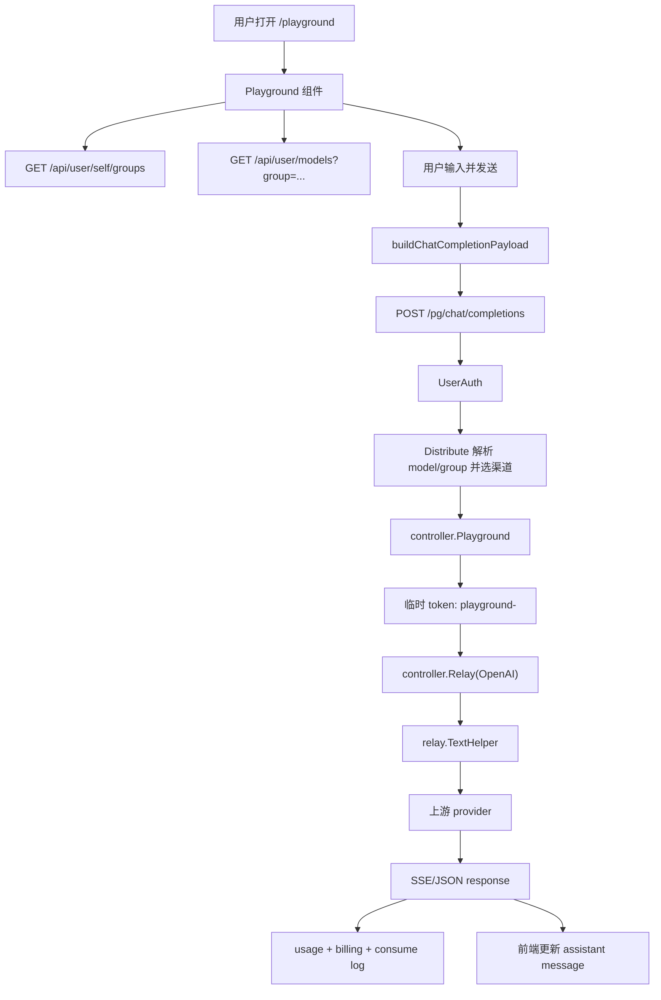

# Playground Chat 到 Relay 全链路学习指南

这份文档专门梳理默认前端 Playground 如何发送一条聊天请求，并如何进入 Go 后端统一 relay、渠道选择、流式响应、usage 统计和计费结算。

它适合已经读过这些文档后继续深挖：

```text
frontend-routing-data-workflows-guide-for-go-learners.md
relay-error-retry-streaming-guide-for-go-learners.md
chat-responses-tools-protocol-guide-for-go-learners.md
channel-management-selection-guide-for-go-learners.md
auth-token-quota-guide-for-go-learners.md
```

读完本文，你应该能回答：

- `/playground` 页面如何加载模型、分组和历史消息。
- 前端如何构造 OpenAI Chat Completions 请求体。
- 为什么流式请求使用 `sse.js` 而不是原生 `EventSource`。
- `/pg/chat/completions` 和普通 `/v1/chat/completions` 有什么差异。
- 登录用户 session 如何被包装成 relay 所需的 token context。
- `RelayInfo.IsPlayground` 影响了哪些计费和日志行为。
- 后端如何扫描上游 SSE、提取 usage、补发 usage 或估算 usage。

## 一、先看总链路

Playground 的完整链路可以先记成：

```text
/playground
  -> Playground React 页面
  -> 加载 groups/models
  -> 用户输入消息
  -> buildChatCompletionPayload
  -> POST /pg/chat/completions
  -> UserAuth
  -> Distribute
  -> controller.Playground
  -> 构造临时 playground token context
  -> controller.Relay(OpenAI)
  -> GetAndValidateRequest
  -> GenRelayInfo
  -> ModelPriceHelper
  -> PreConsumeBilling
  -> getChannel / retry
  -> relay.TextHelper
  -> provider adaptor
  -> 上游 SSE 或 JSON
  -> PostTextConsumeQuota
  -> RecordConsumeLog
```

图示：



## 二、关键源码地图

前端入口：

```text
web/default/src/routes/_authenticated/playground/index.tsx
web/default/src/features/playground/index.tsx
web/default/src/features/playground/api.ts
web/default/src/features/playground/constants.ts
web/default/src/features/playground/types.ts
```

前端状态和数据加载：

```text
web/default/src/features/playground/hooks/use-playground-state.ts
web/default/src/features/playground/hooks/use-playground-options.ts
web/default/src/features/playground/lib/storage/storage.ts
web/default/src/features/playground/lib/storage/storage-schema.ts
```

前端发送和流式读取：

```text
web/default/src/features/playground/hooks/use-playground-conversation.ts
web/default/src/features/playground/hooks/use-chat-handler.ts
web/default/src/features/playground/hooks/use-stream-request.ts
web/default/src/features/playground/lib/streaming/payload-builder.ts
web/default/src/features/playground/lib/streaming/stream-utils.ts
web/default/src/features/playground/lib/streaming/request-error-utils.ts
web/default/src/features/playground/lib/message/message-streaming-utils.ts
```

后端路由和认证：

```text
router/relay-router.go
router/api-router.go
middleware/auth.go
middleware/distributor.go
middleware/model-rate-limit.go
middleware/rate-limit.go
```

后端 Playground 和 Relay：

```text
controller/playground.go
controller/relay.go
relay/common/relay_info.go
relay/compatible_handler.go
relay/channel/openai/relay-openai.go
relay/helper/stream_scanner.go
relay/helper/price.go
```

模型、分组、渠道和计费：

```text
controller/user.go
controller/group.go
controller/model.go
model/ability.go
model/channel_cache.go
service/group.go
service/channel_select.go
service/channel_satisfy.go
service/billing_session.go
service/quota.go
service/text_quota.go
```

## 三、路由入口：`/_authenticated/playground`

前端路由文件：

```text
web/default/src/routes/_authenticated/playground/index.tsx
```

它注册：

```text
createFileRoute('/_authenticated/playground/')
```

因为它在 `_authenticated` 下，所以先经过父路由：

```text
web/default/src/routes/_authenticated/route.tsx
```

父路由保证：

```text
必须有 auth.user
每个浏览器会话首次进入时调用 /api/user/self 验证 session
```

Playground 自己的 `beforeLoad` 只做模块可见性检查：

```text
if (!isSidebarModuleEnabled('chat', 'playground')) {
  redirect('/dashboard')
}
```

这里的 `isSidebarModuleEnabled` 读取本地缓存的 `/api/status` 配置，例如 `SidebarModulesAdmin`。它是前端可见性控制，不是后端安全边界。

页面组件：

```text
function PlaygroundPage() {
  return (
    <Main className='p-0'>
      <Playground />
    </Main>
  )
}
```

所以 `/playground` 页面的真实业务入口是：

```text
web/default/src/features/playground/index.tsx
```

## 四、Playground 组件如何组装

`Playground` 组件本身很像一个总装配器：

```text
usePlaygroundState()
useChatHandler()
usePlaygroundConversation()
usePlaygroundOptions()

PlaygroundChat
PlaygroundInput
```

对应关系：

| hook/组件 | 作用 |
| --- | --- |
| `usePlaygroundState` | 管 config、parameterEnabled、messages、models、groups、本地持久化 |
| `usePlaygroundOptions` | 拉取可用 group 和当前 group 下的 models |
| `usePlaygroundConversation` | 用户发送、重新生成、编辑、删除消息 |
| `useChatHandler` | 发送 chat completion，处理流式/非流式响应 |
| `PlaygroundChat` | 展示消息列表、空状态、编辑态、重新生成 |
| `PlaygroundInput` | 输入框、模型/分组选择、发送/停止 |

主结构：

```text
Playground
  -> PlaygroundChat
  -> PlaygroundInput
```

`PlaygroundChat` 管展示，`PlaygroundInput` 管输入。真正的业务状态和请求都在 hooks 里。

## 五、本地状态：config、messages、parameterEnabled

状态 hook：

```text
web/default/src/features/playground/hooks/use-playground-state.ts
```

它管理：

```text
config
parameterEnabled
messages
isLoadingMessages
models
groups
```

默认配置在：

```text
web/default/src/features/playground/constants.ts
```

默认值：

```text
model: 'gpt-4o'
group: 'default'
temperature: 0.7
top_p: 1
max_tokens: 4096
frequency_penalty: 0
presence_penalty: 0
seed: null
stream: true
```

参数开关默认：

```text
temperature: true
top_p: true
max_tokens: false
frequency_penalty: true
presence_penalty: true
seed: false
```

注意这里有两个概念：

- `config.max_tokens = 4096` 是配置值。
- `parameterEnabled.max_tokens = false` 表示默认不把它发给后端。

也就是说请求体只包含“启用的参数”。

### localStorage keys

持久化 key：

```text
playground_config
playground_messages
playground_parameter_enabled
```

读写工具在：

```text
web/default/src/features/playground/lib/storage/storage.ts
```

这个 storage 不是简单 `JSON.parse` 一下就完事。它做了不少保护：

- 使用 schema 校验配置、参数开关和消息结构。
- 存储 envelope 带 `version`。
- 消息数量超过上限时只保留最近消息。
- 总内容过大时按字符数裁剪。
- 单条消息内容过长时截断。
- 加载时把卡在 loading/streaming 状态但已有内容的 assistant 消息恢复成 complete。
- 对重复章节快照做压缩，避免 localStorage 被长回复撑爆。

这说明 Playground 不是一次性 demo，而是一个会长期保留用户本地会话的工具页面。

## 六、模型和分组如何加载

加载 hook：

```text
web/default/src/features/playground/hooks/use-playground-options.ts
```

它有两个 React Query：

```text
queryKey: ['playground-groups']
queryFn: getUserGroups

queryKey: ['playground-models', currentGroup]
queryFn: () => getUserModels(currentGroup)
enabled: currentGroup !== ''
```

前端 API：

```text
web/default/src/features/playground/api.ts
```

调用：

```text
GET /api/user/self/groups
GET /api/user/models?group=<currentGroup>
```

返回后会做 fallback：

```text
groupsData -> setGroups(groupsData)
如果当前 group 不存在，选一个 fallback group

modelsData -> setModels(modelsData)
如果当前 model 不存在，选一个 fallback model
如果当前 group 没有模型，清空 model
```

这意味着默认 `gpt-4o/default` 只是初始值。真正可用值以后端返回为准。

### group 列表后端

后端路由在：

```text
router/api-router.go
GET /api/user/self/groups -> controller.GetUserGroups
```

实际函数在：

```text
controller/group.go
```

流程：

```text
userId := c.GetInt("id")
userGroup := model.GetUserGroup(userId)
userUsableGroups := service.GetUserUsableGroups(userGroup)

遍历 ratio_setting.GetGroupRatioCopy()
  如果 group 在 userUsableGroups 中:
    返回 ratio + desc

如果 userUsableGroups 包含 auto:
  返回 auto 分组，ratio 显示为 "自动"
```

`service.GetUserUsableGroups(userGroup)` 在：

```text
service/group.go
```

它会先读全局 `UserUsableGroups`，再叠加用户所在分组的特殊可用组配置：

```text
+:group 表示添加
-:group 表示移除
普通 key 表示添加或覆盖
```

最后如果用户自身 `userGroup` 不在可用组里，会自动补进去。

### model 列表后端

后端路由：

```text
GET /api/user/models -> controller.GetUserModels
```

函数在：

```text
controller/user.go
```

流程：

```text
user := model.GetUserCache(id)
groups := service.GetUserUsableGroups(user.Group)
requestedGroup := c.Query("group")

如果传了 group:
  如果 group 不在用户可用分组，返回空数组
  否则返回 model.GetGroupEnabledModels(group)

如果没传 group:
  遍历所有可用分组
  汇总 model.GetGroupEnabledModels(group)
  去重后返回
```

`model.GetGroupEnabledModels(group)` 的来源是 `abilities` 表，也就是“哪个 group 下哪个 model 有可用 channel”的索引。

因此 Playground 模型选择不是静态配置，而是：

```text
用户所在 group
  -> 用户可用 groups
  -> 每个 group 的 abilities
  -> enabled models
```

### 和 `/v1/models` 的差异

普通 API Key 的模型列表走：

```text
GET /v1/models -> controller.ListModels
```

它更接近外部 OpenAI-compatible API，会额外考虑：

- token group。
- token model limit。
- auto group 下多个候选 group。
- 非自用模式下过滤没有价格/倍率配置的模型。

而 Playground 的 `/api/user/models?group=...` 主要按用户可用 group 和 ability 返回。是否真的能请求成功，还会在 relay 时由 `ModelPriceHelper`、`Distribute` 和渠道选择再次检查。

## 七、用户输入到消息数组

输入组件：

```text
web/default/src/features/playground/components/input/playground-input.tsx
```

它使用通用 AI 输入组件：

```text
PromptInput
PromptInputTextarea
PromptInputFooter
```

提交时：

```text
handleSubmit(message):
  submittableText = getSubmittableInputText(message, disabled)
  if empty return
  onSubmit(submittableText)
  setText('')
```

`onSubmit` 来自 `Playground` 中的：

```text
handleSendMessage
```

这个函数由：

```text
web/default/src/features/playground/hooks/use-playground-conversation.ts
```

提供。

发送逻辑：

```text
handleSendMessage(text):
  nextMessages = appendUserMessagePair(messages, text)
  updateMessages(nextMessages)
  sendChat(nextMessages)
```

`appendUserMessagePair` 会追加两条消息：

```text
user message: 用户输入内容
assistant message: 空内容，status=loading/streaming 占位
```

为什么要先放一个 assistant 占位？

因为流式返回时，前端需要不断把 `delta.content` 追加到最后一条 assistant 消息上。如果没有占位，每个 chunk 都要判断是否创建消息。

重新生成也是类似：

```text
handleRegenerateMessage(message):
  nextMessages = createRegeneratedMessages(messages, message.key)
  updateMessages(nextMessages)
  sendChat(nextMessages)
```

编辑消息：

```text
handleEditMessage -> setEditingMessageKey
applyEdit(newContent, shouldSubmit)
  -> applyMessageEdit
  -> updateMessages
  -> 如果 shouldSubmit，sendChat
```

## 八、构造 Chat Completion 请求体

请求体构造函数：

```text
web/default/src/features/playground/lib/streaming/payload-builder.ts
```

核心：

```text
processedMessages = messages
  .filter(isValidMessage)
  .map(formatMessageForAPI)

payload = {
  model: config.model,
  group: config.group,
  messages: processedMessages,
  stream: config.stream,
}

如果参数开关启用:
  temperature
  top_p
  max_tokens
  frequency_penalty
  presence_penalty
  seed
```

请求类型在：

```text
web/default/src/features/playground/types.ts
```

`ChatCompletionRequest`：

```text
model: string
group?: string
messages: ChatCompletionMessage[]
stream: boolean
temperature?: number
top_p?: number
max_tokens?: number
frequency_penalty?: number
presence_penalty?: number
seed?: number
```

这里的 `group` 是 new-api Playground 扩展字段，不是标准 OpenAI Chat Completions 字段。后端 `Distribute` 会专门读取它，然后决定用哪个分组选渠道。

`isValidMessage` 会排除空的 assistant loading 占位，所以刚插入的空 assistant 消息不会被发送给后端。真正发送的是已有历史消息和刚刚的 user 消息。

## 九、流式和非流式分支

发送 hook：

```text
web/default/src/features/playground/hooks/use-chat-handler.ts
```

入口：

```text
sendChat(messages):
  if config.stream:
    sendStreamingChat(messages)
  else:
    sendNonStreamingChat(messages)
```

### 非流式

非流式走 Axios：

```text
sendChatCompletion(payload, abortController.signal)
  -> api.post('/pg/chat/completions', payload, { signal, skipErrorHandler: true })
```

成功后：

```text
hasChatCompletionChoice(response)
applyChatCompletionResponse(message, response)
```

失败后：

```text
parseRequestErrorDetails(error)
handleStreamError(errorMessage, errorCode)
updateAssistantMessageWithError(...)
```

虽然函数名里有 `handleStreamError`，但它也用于非流式错误，因为最终都是把最后一条 assistant 占位消息改成 error 状态。

### 流式

流式走：

```text
web/default/src/features/playground/hooks/use-stream-request.ts
```

使用：

```text
import { SSE } from 'sse.js'
```

为什么不用浏览器原生 `EventSource`？

因为原生 `EventSource` 只能 GET，不能方便地 POST JSON body。Playground 需要：

```text
POST /pg/chat/completions
Content-Type: application/json
payload: JSON.stringify(payload)
```

所以使用 `sse.js`。

发送：

```text
new SSE('/pg/chat/completions', {
  headers: getCommonHeaders(),
  method: 'POST',
  payload: JSON.stringify(payload),
})
```

`getCommonHeaders()` 来自：

```text
web/default/src/lib/api.ts
```

包含：

```text
Content-Type: application/json
New-Api-User: <localStorage.uid>
```

`New-Api-User` 会被后端 `UserAuth` 用于校验当前 session 用户，防止本地缓存串号。

## 十、前端如何读取 SSE

流式事件处理在：

```text
useStreamRequest()
```

监听三类事件：

```text
message
error
readystatechange
```

### message

```text
source.addEventListener('message', e => {
  if (isStreamDoneMessage(e.data)) {
    closeActiveStream()
    onComplete()
    return
  }

  updates = parseStreamMessageUpdates(e.data)
  for update in updates:
    onUpdate(update.type, update.chunk)
})
```

`isStreamDoneMessage` 判断：

```text
data === '[DONE]'
```

`parseStreamMessageUpdates` 在：

```text
web/default/src/features/playground/lib/streaming/stream-utils.ts
```

它解析 OpenAI chunk：

```text
choices[0].delta.reasoning_content -> reasoning update
choices[0].delta.content -> content update
```

所以前端只关心两个增量：

```text
reasoning
content
```

### error

如果 SSE error 带 data：

```json
{
  "error": {
    "code": "...",
    "message": "..."
  }
}
```

`parseStreamErrorDetails` 会提取 error code 和 message。

如果不是 JSON，就把原始 data 或默认错误作为 message。

### readystatechange

如果 readyState 关闭，且 HTTP status 不是 200：

```text
HTTP <status>: Connection closed
```

这样可以把 401、403、500 这类错误变成可展示的 assistant error message。

## 十一、前端如何把 chunk 写进消息

`useChatHandler` 对流式 chunk 做了一个 50ms 合批：

```text
STREAM_UPDATE_FLUSH_MS = 50
```

收到 chunk 时：

```text
handleStreamUpdate(type, chunk):
  pendingStreamChunksRef[type] = mergePendingStreamChunk(...)
  scheduleStreamFlush()
```

刷新时：

```text
updateLastAssistantMessage(prev, message => {
  if reasoning chunk:
    applyStreamingChunk(message, 'reasoning', chunk)
  if content chunk:
    applyStreamingChunk(message, 'content', chunk)
})
```

为什么要合批？

上游 SSE 可能非常密集。如果每个 token 都 `setState` 一次，会造成 React 重渲染过于频繁。50ms 合批在体验上仍然像实时输出，但性能更稳。

完成时：

```text
handleStreamComplete():
  flushStreamUpdates()
  setIsRequesting(false)
  completeAssistantMessage(message)
```

如果内容里含 `<think>` 标签，后续 message streaming utils 会拆出 reasoning 和可见 content。

停止生成：

```text
stopGeneration():
  stopStream()
  flushStreamUpdates()
  abortController.abort()
  complete pending assistant message
```

它不会请求后端“取消上游任务”，主要是关闭前端连接和请求 signal。后端会通过 request context 感知客户端断开。

## 十二、后端 `/pg/chat/completions` 路由

路由在：

```text
router/relay-router.go
```

注册：

```text
playgroundRouter := router.Group("/pg")
playgroundRouter.Use(middleware.RouteTag("relay"))
playgroundRouter.Use(middleware.SystemPerformanceCheck())
playgroundRouter.Use(middleware.UserAuth(), middleware.Distribute())
playgroundRouter.POST("/chat/completions", controller.Playground)
```

同时，整个 relay router 还有全局 middleware：

```text
middleware.CORS()
middleware.DecompressRequestMiddleware()
middleware.BodyStorageCleanup()
middleware.StatsMiddleware()
```

所以 `/pg/chat/completions` 的后端链路是：

```text
CORS
DecompressRequestMiddleware
BodyStorageCleanup
StatsMiddleware
RouteTag("relay")
SystemPerformanceCheck
UserAuth
Distribute
controller.Playground
```

对比普通 OpenAI-compatible API：

```text
/v1/chat/completions
  -> RouteTag("relay")
  -> SystemPerformanceCheck
  -> TokenAuth
  -> ModelRequestRateLimit
  -> Distribute
  -> controller.Relay(OpenAI)
```

主要差异：

| 项目 | Playground `/pg` | 普通 API `/v1` |
| --- | --- | --- |
| 认证 | `UserAuth()` session 用户 | `TokenAuth()` API Key |
| 模型请求限流 | 不挂 `ModelRequestRateLimit()` | 挂 `ModelRequestRateLimit()` |
| group 来源 | 请求体 `group` + 用户可用分组校验 | token 自带 group |
| token quota | 无真实 token，不扣 token quota | 扣 token quota |
| 用户钱包/订阅计费 | 扣 | 扣 |
| access token | `controller.Playground` 明确拒绝 | 不走 Playground |

## 十三、Distribute 对 Playground 的特殊处理

`middleware.Distribute()` 在：

```text
middleware/distributor.go
```

它会从请求体读取 model。对 `/pg/chat/completions` 还有特殊分支：

```text
if strings.HasPrefix(c.Request.URL.Path, "/pg/chat/completions") {
  playgroundRequest := &dto.PlayGroundRequest{}
  common.UnmarshalBodyReusable(c, playgroundRequest)

  if playgroundRequest.Group != "" {
    if !service.GroupInUserUsableGroups(usingGroup, playgroundRequest.Group) &&
       playgroundRequest.Group != usingGroup {
      abort 403
    }
    usingGroup = playgroundRequest.Group
    ContextKeyUsingGroup = usingGroup
  }
}
```

还会在 `getModelFromRequest` 类似逻辑里：

```text
modelRequest.Model = req.Model
modelRequest.Group = req.Group
ContextKeyTokenGroup = modelRequest.Group
```

关键点：

- 前端传来的 `group` 不是纯 UI 参数。
- 后端必须校验 group 是否在用户可用分组内。
- 校验通过后，`usingGroup` 会影响渠道选择和 group ratio 计费。

然后 `Distribute` 会继续做渠道选择：

```text
根据 model + usingGroup
  -> 渠道亲和性 preferred channel
  -> auto group 候选
  -> channel ability
  -> fallback candidates
  -> channel status/path support
  -> SetupContextForSelectedChannel
```

选中的渠道信息写入 Gin context：

```text
channel_id
channel_type
channel_key
channel_base_url
original_model
channel_setting
param_override
header_override
```

后续 `RelayInfo.InitChannelMeta` 会把这些 context 值拷贝到 `RelayInfo.ChannelMeta`。

## 十四、controller.Playground：把 session 用户包装成临时 token

代码在：

```text
controller/playground.go
```

核心流程：

```text
func Playground(c *gin.Context) {
  if c.GetBool("use_access_token") {
    error: 暂不支持使用 access token
    return
  }

  relayInfo, err := relaycommon.GenRelayInfo(c, OpenAI, nil, nil)
  userId := c.GetInt("id")

  userCache, err := model.GetUserCache(userId)
  userCache.WriteContext(c)

  tempToken := &model.Token{
    UserId: userId,
    Name: fmt.Sprintf("playground-%s", relayInfo.UsingGroup),
    Group: relayInfo.UsingGroup,
  }
  middleware.SetupContextForToken(c, tempToken)

  Relay(c, OpenAI)
}
```

为什么要构造临时 `model.Token`？

普通 relay 管线大量逻辑默认从 context 读取 token 信息：

```text
token_id
token_key
token_name
token_group
token_unlimited_quota
token_model_limit
```

Playground 没有真实 API Key，但又想复用这套成熟的 relay/计费/日志链路，于是构造一个临时 token：

```text
UserId: 当前登录用户
Name: playground-<group>
Group: 选中的 group
Id: 0
Key: ""
```

然后调用：

```text
middleware.SetupContextForToken(c, tempToken)
```

写入 token context。

这是一种很典型的 Go 项目复用手法：通过把上下文补齐，让后续公共流程不需要知道调用者是 API Key 还是 Playground。

## 十五、UserAuth 和 TokenAuth 的差异

Playground 走：

```text
UserAuth()
```

它基于后端 session。前端请求必须携带：

- session cookie。
- `New-Api-User` header。

普通 API 走：

```text
TokenAuth()
```

它基于 API Key，会额外处理：

- token 是否存在。
- token 是否启用。
- token 是否过期。
- token 剩余额度。
- token group。
- token model limit。
- IP 白名单。
- 用户状态。
- read-only token usage 接口等。

Playground 不走真实 token，所以也没有 token 模型限制和 token quota。它依赖用户自身 group、用户钱包/订阅额度、渠道可用性来控制请求。

## 十六、RelayInfo 里的 Playground 标记

`RelayInfo` 在：

```text
relay/common/relay_info.go
```

核心字段：

```text
TokenId
TokenKey
TokenGroup
UserId
UsingGroup
UserGroup
TokenUnlimited
IsStream
IsPlayground
OriginModelName
PricingModelName
RequestURLPath
UserSetting
UserQuota
PriceData
Billing
ChannelMeta
```

`genBaseRelayInfo` 会从 Gin context 读取：

```text
UserId
UserQuota
UserSetting
UsingGroup
UserGroup
TokenId
TokenKey
TokenGroup
OriginModelName
IsStream
```

特殊逻辑：

```text
if strings.HasPrefix(c.Request.URL.Path, "/pg") {
  info.IsPlayground = true
  info.RequestURLPath = strings.TrimPrefix(info.RequestURLPath, "/pg")
  info.RequestURLPath = "/v1" + info.RequestURLPath
}
```

也就是说：

- 对外真实请求路径是 `/pg/chat/completions`。
- relay 内部会把它当成 `/v1/chat/completions` 处理。
- `IsPlayground=true` 作为计费和 token quota 的特殊开关。

## 十七、进入普通 Relay 主流程

`controller.Playground` 最后调用：

```text
Relay(c, types.RelayFormatOpenAI)
```

之后进入普通 relay 主流程：

```text
helper.GetAndValidateRequest
relaycommon.GenRelayInfo
敏感词检查
EstimateRequestToken
ModelPriceHelper
PreConsumeBilling
retry loop
getChannel
relayHandler
relay.TextHelper
```

### 请求校验

`helper.GetAndValidateRequest` 会解析 OpenAI request，确认 model、messages、stream 等字段合法。这里仍然走项目统一 JSON wrapper 和请求体复读机制。

### RelayInfo

`relaycommon.GenRelayInfo(OpenAI)` 调用：

```text
GenRelayInfoOpenAI
genBaseRelayInfo
InitRequestConversionChain
```

此时 `RelayInfo` 已经能看到：

```text
UserId: 登录用户
TokenName: playground-<group>
TokenId: 0
UsingGroup: 前端选择并通过后端校验的 group
OriginModelName: 请求 model
IsPlayground: true
IsStream: request.stream
```

### 预估 token 和计费

Relay 会：

```text
meta = request.GetTokenCountMeta()
tokens = service.EstimateRequestToken(...)
relayInfo.SetEstimatePromptTokens(tokens)
priceData = helper.ModelPriceHelper(...)
service.PreConsumeBilling(...)
```

`ModelPriceHelper` 会检查模型价格/倍率/表达式计费配置。注意：`/api/user/models` 可能返回一个 model，但真正请求时如果没有计费配置，仍可能在这里失败，除非自用模式或用户设置允许未配置倍率模型。

## 十八、TextHelper：OpenAI Chat 的后端执行

文本 relay 在：

```text
relay/compatible_handler.go
```

入口：

```text
func TextHelper(c *gin.Context, info *RelayInfo)
```

主要步骤：

```text
info.InitChannelMeta(c)
textReq := info.Request.(*dto.GeneralOpenAIRequest)
request := DeepCopy(textReq)
ModelMappedHelper(c, info, request)
处理 StreamOptions
adaptor := GetAdaptor(info.ApiType)
adaptor.Init(info)
ConvertOpenAIRequest
应用系统提示词覆盖
Marshal
RemoveDisabledFields
ApplyParamOverride
NewOutboundJSONBody
adaptor.DoRequest
检查上游 HTTP status
adaptor.DoResponse
PostTextConsumeQuota 或 PostAudioConsumeQuota
```

重要点：

- `ModelMappedHelper` 会处理渠道 `model_mapping`、fallback model 等。
- `StreamOptions` 只有渠道支持且请求是 stream 时才保留。
- `constant.ForceStreamOption` 可强制 `include_usage=true`。
- 渠道系统提示词可插入或覆盖请求中的 system message。
- `param_override`、disabled fields 会在请求上游前应用。
- `adaptor.DoResponse` 负责把上游响应转换成 OpenAI-compatible 下游响应。

Playground 前端发送的是 OpenAI Chat Completions 格式，但选中的上游渠道可能是 Claude、Gemini、Azure、OpenRouter、Ollama 等。具体转换在 provider adaptor 内完成。

## 十九、后端如何处理上游 SSE

OpenAI-compatible 流式处理典型入口：

```text
relay/channel/openai/relay-openai.go
OaiStreamHandler
```

它调用：

```text
relay/helper/stream_scanner.go
StreamScannerHandler
```

`StreamScannerHandler` 负责通用 SSE 扫描：

```text
SetEventStreamHeaders(c)
scanner := bufio.Scanner(resp.Body)
scanner.Split(bufio.ScanLines)

for scanner.Scan():
  line := scanner.Text()
  只处理 data: 或 [DONE]
  trim "data:"
  如果是 [DONE]，结束
  否则传给 dataHandler
```

它还处理：

- streaming timeout。
- ping interval。
- 客户端断开连接。
- scanner buffer size。
- goroutine 清理。
- stream end reason。
- 收到响应数量。
- 首包时间。

SSE response header 由：

```text
helper.SetEventStreamHeaders
```

设置。

### ping

如果系统开启 ping：

```text
operation_setting.GetGeneralSetting().PingIntervalEnabled
```

后端会定期写 ping，避免长时间无 token 时连接被代理或浏览器断开。

### timeout

`constant.StreamingTimeout` 控制流式 idle timeout。每收到一行数据会 reset ticker。如果超时，stream end reason 会记录 timeout。

### 客户端断开

`c.Request.Context().Done()` 会被监听。前端点击 Stop 或关闭页面时，后端能尽量停止扫描和写响应。

## 二十、OpenAI Stream Handler 如何提取 usage

`OaiStreamHandler` 做了几个关键动作。

第一，暂存最后一个 chunk。

它不是每个 chunk 立刻完全处理完，而是：

```text
如果 lastStreamData 不为空:
  先处理/发送上一条

lastStreamData = 当前 data
```

原因是最后一个 chunk 可能包含 usage。如果直接原样全部转发，就不好在结尾统一补 usage 和 `[DONE]`。

第二，累计响应文本。

```text
processTokenData(..., &responseTextBuilder, &toolCount)
```

这用于上游没有返回 usage 时估算 completion tokens。

第三，处理最后响应。

```text
handleLastResponse(...)
```

如果最后 chunk 中有 usage：

```text
containStreamUsage = true
usage = stream usage
```

否则：

```text
usage = service.ResponseText2Usage(
  responseTextBuilder.String(),
  info.UpstreamModelName,
  info.GetEstimatePromptTokens(),
)
usage.CompletionTokens += toolCount * 7
```

第四，补发 final usage。

```text
HandleFinalResponse(...)
```

如果客户端希望 include usage，而上游没有给 usage，new-api 可以生成一个 final usage chunk，再写 `[DONE]`。

这解释了为什么前端只需要按 OpenAI SSE 规则读取 chunk：后端已经尽力把不同上游的流式输出整理成 OpenAI-compatible 格式。

## 二十一、计费：Playground 扣用户额度但不扣 token quota

Playground 和普通 API 请求都走：

```text
ModelPriceHelper
PreConsumeBilling
SettleBilling
PostTextConsumeQuota
RecordConsumeLog
```

区别在 `RelayInfo.IsPlayground`。

### 预扣费

`Relay` 中：

```text
if priceData.FreeModel:
  skip preconsume
else:
  service.PreConsumeBilling(c, priceData.QuotaToPreConsume, relayInfo)
```

`PreConsumeBilling` 创建 `BillingSession`，资金来源可能是：

- 用户钱包 quota。
- 用户订阅额度。

Playground 仍然会预扣用户钱包或订阅额度。

### token quota 特例

`service/billing_session.go`：

```text
if !s.relayInfo.IsPlayground {
  model.DecreaseTokenQuota(...)
}
```

`reserveToken`：

```text
if delta <= 0 || s.relayInfo.IsPlayground {
  return nil
}
```

`service/quota.go` 的 `PostConsumeQuota`：

```text
if !relayInfo.IsPlayground {
  调整 token quota
}
```

所以：

```text
Playground:
  扣用户钱包/订阅
  不扣 API Key token quota

普通 API Key relay:
  扣用户钱包/订阅
  同时扣 API Key token quota
```

这是因为 Playground 没有真实 token，临时 token 的 `TokenId=0`、`TokenKey=""` 只用于让 relay 管线拿到 token-like context。

### 消费日志

文本消费日志在：

```text
service/text_quota.go
PostTextConsumeQuota
```

它会调用：

```text
model.RecordConsumeLog(...)
```

记录：

```text
UserId
ChannelId
PromptTokens
CompletionTokens
ModelName
TokenName
Quota
TokenId
UseTimeSeconds
IsStream
Group
Other
```

Playground 日志通常表现为：

```text
TokenName: playground-<group>
TokenId: 0
IsStream: true/false
Group: 前端选择的 group
Other.request_path: /pg/chat/completions
```

`RelayInfo.RequestURLPath` 内部会改写成 `/v1/chat/completions` 方便 relay 复用，但日志里仍可能保留真实请求路径，便于区分 Playground 与外部 API。

## 二十二、Playground 和 API Key relay 的完整差异表

| 维度 | Playground `/pg/chat/completions` | API Key `/v1/chat/completions` |
| --- | --- | --- |
| 前端入口 | `web/default` Playground 页面 | 外部客户端或 Playground 之外的 API 调用 |
| 认证 | Cookie session + `New-Api-User` | Bearer/API Key |
| 中间件 | `UserAuth()` | `TokenAuth()` |
| 模型请求限流 | 未挂 `ModelRequestRateLimit()` | 挂 `ModelRequestRateLimit()` |
| group 来源 | 请求体 `group` | token 的 `Group` |
| group 校验 | 必须在用户可用 group 内 | token group 必须有效且可用 |
| token model limit | 无真实 token，不走 | 支持 `ModelLimitsEnabled` |
| token quota | 不扣 | 扣 |
| 用户 quota/订阅 | 扣 | 扣 |
| 渠道选择 | 走 `Distribute()` | 走 `Distribute()` |
| 上游转换 | 走 provider adaptor | 走 provider adaptor |
| 流式响应 | SSE OpenAI-compatible | SSE OpenAI-compatible |
| 消费日志 | `TokenName=playground-<group>` | token 名称 |
| access token | 明确拒绝 | 不适用 |

## 二十三、可用模型和真正可请求模型的区别

Playground 的模型下拉来自：

```text
GET /api/user/models?group=...
```

它主要依据：

```text
用户可用分组
abilities 表里的 group/model enabled
```

但真正请求成功还要通过：

```text
Distribute:
  group 权限
  channel status
  channel ability
  channel path support
  channel RPM
  fallback candidates
  negative unavailable cache

ModelPriceHelper:
  model ratio
  model price
  group ratio
  tiered_expr
  AcceptUnsetRatioModel / self-use mode
```

所以“下拉框里能选”不等于“请求一定成功”。下拉框代表当前 group 下有 ability；relay 阶段还要检查计费配置和实时渠道可用性。

## 二十四、Chat 预设页面不是 Playground

源码里还有：

```text
web/default/src/routes/_authenticated/chat/$chatId.tsx
web/default/src/routes/_authenticated/chat2link.tsx
```

这不是内置 Chat Completions Playground。

`/chat/$chatId` 是“聊天预设”入口：

- 从系统状态里的 `Chats/chats` 解析预设。
- web 类型可能 iframe 打开第三方页面。
- 外部协议或链接会通过侧边栏触发。
- 需要 API key 的预设会通过 `useActiveChatKey()` 找一个 enabled key。
- `resolveChatUrl()` 替换 `{key}`、`{address}` 等占位符。

所以读源码时不要把 `/chat/$chatId` 和 `/playground` 混在一起：

```text
/playground:
  内置 new-api Playground，直接 POST /pg/chat/completions

/chat/$chatId:
  外部/预设聊天入口，可能只是跳转或 iframe
```

## 二十五、调试一条 Playground 请求应该看哪里

如果前端没有模型：

```text
GET /api/user/self/groups
GET /api/user/models?group=...
controller/group.go
controller/user.go:GetUserModels
service/group.go
model.GetGroupEnabledModels
abilities 表
```

如果发送后 401：

```text
浏览器 cookie session
localStorage.uid
New-Api-User header
middleware.UserAuth
```

如果发送后 403 group access denied：

```text
payload.group
service.GetUserUsableGroups
middleware.Distribute Playground group 分支
```

如果提示模型不存在或无可用渠道：

```text
payload.model
middleware.Distribute
service.CacheGetRandomSatisfiedChannel
model/channel_cache.go
abilities 表
channel status
channel path support
model mapping fallback
```

如果提示模型价格错误：

```text
relay/helper/price.go
ratio_setting
ModelRatio / ModelPrice / tiered_expr
用户 AcceptUnsetRatioModel
operation_setting.SelfUseModeEnabled
```

如果流式中断：

```text
前端 use-stream-request.ts
后端 relay/helper/stream_scanner.go
StreamingTimeout
PingInterval
客户端是否点击 Stop
上游是否发送 [DONE]
```

如果扣费不符合预期：

```text
RelayInfo.IsPlayground
service/billing_session.go
service/text_quota.go
service/quota.go
消费日志 TokenName/TokenId/Group/Other
```

## 二十六、推荐源码阅读顺序

第一轮，只读前端主线：

```text
web/default/src/routes/_authenticated/playground/index.tsx
web/default/src/features/playground/index.tsx
web/default/src/features/playground/hooks/use-playground-state.ts
web/default/src/features/playground/hooks/use-playground-options.ts
web/default/src/features/playground/hooks/use-playground-conversation.ts
web/default/src/features/playground/hooks/use-chat-handler.ts
web/default/src/features/playground/hooks/use-stream-request.ts
web/default/src/features/playground/lib/streaming/payload-builder.ts
```

第二轮，对上后端入口：

```text
router/relay-router.go
controller/playground.go
middleware/auth.go
middleware/distributor.go
controller/relay.go
```

第三轮，理解模型和分组：

```text
controller/group.go
controller/user.go:GetUserModels
service/group.go
model/ability.go
controller/model.go:ListModels
```

第四轮，理解 relay 执行：

```text
relay/common/relay_info.go
relay/compatible_handler.go
relay/channel/openai/relay-openai.go
relay/helper/stream_scanner.go
```

第五轮，理解计费：

```text
relay/helper/price.go
service/billing_session.go
service/quota.go
service/text_quota.go
model/log.go
```

## 二十七、这条链路能学到哪些 Go 项目技巧

### 1. 用 context 统一跨层数据

`UserAuth`、`Distribute`、`Playground`、`Relay` 都往 Gin context 写值。`RelayInfo` 再一次性把这些值收束成结构体。

这是大型 Go Web 项目常见模式：

```text
middleware 写上下文
controller 读取上下文并组装业务对象
service/relay 使用结构体而不是到处读 context
```

### 2. 用临时对象复用公共流程

Playground 没有真实 API Key，但构造临时 `model.Token`，调用 `SetupContextForToken`，让后面的 relay/计费/日志流程尽量不分叉。

这是很实用的工程技巧：只要语义边界清楚，临时适配对象可以显著降低重复代码。

### 3. 安全边界永远在后端

前端 group 下拉只展示可用 group，但后端仍然在 `Distribute` 里校验 payload group。

这条链路体现了正确分工：

```text
前端：减少误操作，改善体验
后端：认证、授权、计费、限流、渠道选择
```

### 4. 流式响应要关心资源清理

`StreamScannerHandler` 里有 timeout、ping、context cancel、goroutine wait、response body close。这些都是 Go 流式服务必须认真处理的点。

### 5. 日志字段要能反映入口差异

Playground 复用 `/v1/chat/completions` relay 管线，但消费日志仍能通过 `TokenName=playground-<group>`、`TokenId=0`、request path 区分来源。

这能帮助运维和排查：复用管线不等于丢失来源信息。

## 二十八、最小心智模型

最后用一句话概括：

```text
Playground 是一个登录用户版的 OpenAI Chat Completions 客户端。
它在前端用 sse.js POST /pg/chat/completions，在后端用 UserAuth 认证，
再把 session 用户包装成临时 token context，进入普通 Relay 管线。
它和 API Key 请求共用渠道选择、协议转换、流式扫描、usage 和用户额度计费，
但因为 RelayInfo.IsPlayground=true，不会扣真实 token quota。
```

掌握这条链路后，再读 Realtime、Responses、Claude/Gemini 转换、工具调用、图片/音频 relay，会容易很多：它们都在同一个“请求进来 -> context -> RelayInfo -> adaptor -> usage -> billing/log”的框架里变化。
