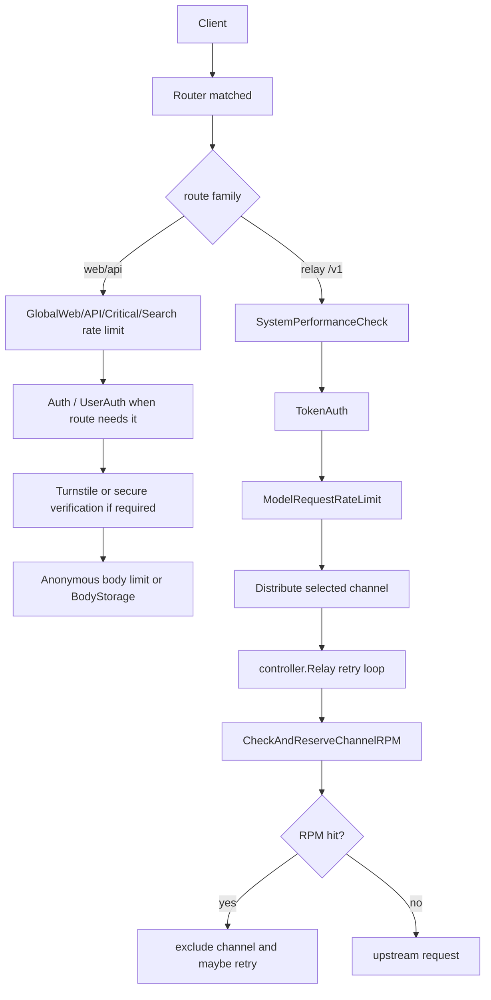

# 限流、请求治理与防滥用学习指南

本文面向已经掌握 Go 基本语法、希望通过 new-api 学习真实网关项目的读者。它专门梳理 new-api 如何在不同层面保护系统：IP 限流、用户搜索限流、模型请求限流、渠道上游 RPM、系统资源保护、请求体大小控制、Turnstile、人机校验、安全二次验证，以及通知发送频率限制。

读完本文，你应该能回答这些问题：

- 一个请求进入 new-api 后，可能依次经过哪些“闸门”。
- 哪些限流按 IP，哪些按用户，哪些按渠道。
- Redis 开启和关闭时，限流行为有什么区别。
- 为什么模型请求限流分为“总请求数”和“成功请求数”。
- 渠道上游 RPM 为什么不在 middleware 里做，而是在 relay retry 选渠道时做。
- 系统资源保护和磁盘缓存配置如何通过 `performance_setting` 热更新。
- 前端系统设置能改哪些限流项，哪些仍然只能靠环境变量控制。

## 一句话总览

new-api 的防滥用不是一个单一 middleware，而是一组分层保护：

1. 路由级限流：按 IP 或用户限制后台 API、Web、敏感操作和搜索。
2. 登录/注册/找回密码防护：CriticalRateLimit、Turnstile、匿名请求体大小限制。
3. Relay 前置保护：TokenAuth 校验 API Key、用户状态、IP 白名单、模型权限和分组权限。
4. Relay 请求保护：SystemPerformanceCheck 和 ModelRequestRateLimit。
5. 渠道级保护：渠道上游 RPM reserve、失败重试、excluded channel、亲和性 break。
6. 请求体治理：解压、最大 body 限制、BodyStorage、请求结束清理。
7. 异步通知治理：通知频率限制，避免通知轰炸。



## 相关源码地图

中间件：

- `middleware/rate-limit.go`：全局 Web/API/Critical/Search/上传下载限流。
- `middleware/model-rate-limit.go`：模型请求限流。
- `middleware/performance.go`：系统 CPU/内存/磁盘保护。
- `middleware/request_body_limit.go`：匿名请求体大小限制。
- `middleware/body_cleanup.go`：请求结束后清理 BodyStorage 和文件源。
- `middleware/turnstile-check.go`：Cloudflare Turnstile 校验。
- `middleware/secure_verification.go`：敏感操作二次验证。
- `middleware/email-verification-rate-limit.go`：邮件验证码发送限流。
- `middleware/auth.go`：TokenAuth 中的 API Key、用户、IP、分组、模型权限上下文。

公共基础设施：

- `common/rate-limit.go`：进程内滑动窗口限流器。
- `common/limiter/limiter.go` 和 `common/limiter/lua/rate_limit.lua`：Redis token bucket。
- `common/gin.go`、`common/body_storage.go`：请求体复读、大小限制、磁盘缓存。
- `middleware/gzip.go`：gzip/br 解压与解压后最大 body 限制。
- `common/request_body_limit.go`：匿名 body limit 字节数。
- `common/performance_config.go`：系统资源保护配置的 atomic 存储。
- `common/init.go`：从环境变量读取全局路由限流和 body limit 默认值。

业务层：

- `service/channel_rate_limit.go`：渠道上游 RPM 限制。
- `controller/relay.go`：渠道 RPM、retry、亲和性失败处理的交互。
- `service/notify-limit.go`：通知发送频率限制。
- `service/channel_affinity.go`：亲和性规则在 rate limit 下是否 break。

配置与前端：

- `setting/rate_limit.go`：模型请求限流运行时配置。
- `setting/performance_setting/config.go`：磁盘缓存和系统资源保护配置。
- `model/option.go`：`OptionMap` 初始化、DB 覆盖和热更新。
- `controller/option.go`：系统设置保存前校验。
- `controller/performance.go`：Root 性能接口。
- `web/default/src/features/system-settings/request-limits/rate-limit-section.tsx`：模型请求限流设置页。
- `web/default/src/features/system-settings/maintenance/performance-section.tsx`：磁盘缓存和性能保护设置页。
- `setting/system_setting/fetch_setting.go`：SSRF/外链访问限制配置。
- `common/url_validator.go`：按 fetch setting 校验外链 URL。

## 第一层：路由级 IP 限流

`middleware/rate-limit.go` 里有几个工厂函数：

- `GlobalWebRateLimit()`：Web 路由限流。
- `GlobalAPIRateLimit()`：后台 `/api` 和 dashboard 兼容 API 限流。
- `CriticalRateLimit()`：登录、注册、支付、OAuth、敏感读写等关键接口。
- `DownloadRateLimit()` / `UploadRateLimit()`：下载/上传场景。
- `SearchRateLimit()`：搜索接口，按用户 ID 限流。

前三类默认按 `c.ClientIP()` 构造 key：

```text
rateLimit:<mark><client_ip>
```

其中 mark 典型值：

- `GW`：Global Web。
- `GA`：Global API。
- `CT`：Critical。
- `DW`：Download。
- `UP`：Upload。

如果 Redis 开启，使用 Redis list 记录时间戳；如果 Redis 关闭，使用进程内 `common.InMemoryRateLimiter`。

选择 Redis 还是内存是在 `rateLimitFactory()` 创建 middleware 时决定的。通用路由限流的 Redis 调用失败时会返回 500，不会自动 fallback 到内存。邮箱验证码限流是例外，它在 Redis `INCR` 失败时会退回内存限流。

### Redis list 版限流

`redisRateLimiter` 的逻辑：

1. `LLen(key)` 取当前窗口内记录数。
2. 如果记录数小于最大请求数，`LPush` 当前时间，并设置过期时间。
3. 如果记录数已满，取最旧记录 `LIndex(key, -1)`。
4. 如果最旧记录距离现在仍小于 duration，返回 429。
5. 否则 `LPush` 新记录，`LTrim` 保留最近 maxRequestNum 条。

这个实现近似滑动窗口。它不是固定整点窗口，而是以队列里最旧请求时间为窗口边界。

排查 Redis 时要注意，通用 IP 限流 key 的 mark 和 IP 中间没有冒号，例如 `rateLimit:GA1.2.3.4`。

错误行为：

- Redis 操作或时间解析失败：返回 500 并 abort。
- 超限：只设置 HTTP 429 状态，没有 JSON body。

### 内存版限流

`common.InMemoryRateLimiter` 用 `map[string]*[]int64` 保存每个 key 的请求时间队列，并用 mutex 保护。

核心方法是：

```go
Request(key string, maxRequestNum int, duration int64) bool
```

它同样是滑动窗口：

- 队列未满，追加当前时间。
- 队列已满，检查最旧时间是否超过 duration；超过就弹出最旧并追加当前时间。
- 否则拒绝。

初始化时会启动后台清理 goroutine，按 `expirationDuration` 周期清理过期 key。

Go 学习点：这是典型的“mutex + map + slice queue”的并发安全写法。它不适合跨节点共享，所以多实例部署时应优先使用 Redis。

## 路由级限流在哪里挂载

几个关键位置：

- `router/web-router.go`：Web 路由使用 `GlobalWebRateLimit()`。
- `router/api-router.go`：`/api` 使用 `BodyStorageCleanup()` 和 `GlobalAPIRateLimit()`。
- `router/dashboard.go`：dashboard 兼容 API 使用 `GlobalAPIRateLimit()`。
- `router/api-router.go`：登录、注册、OAuth、支付、自助更新等敏感接口单独加 `CriticalRateLimit()`。
- `router/api-router.go`：token/log 搜索接口加 `SearchRateLimit()`。
- `router/channel-router.go`：渠道敏感操作加 `CriticalRateLimit()` 和 `SecureVerificationRequired()`。

路由级限流的一个重要特点是：它通常发生在 controller 之前，很多时候也在业务鉴权之前。因此 Global API / Critical 主要按 IP 防护，而不是按账号防护。

还要注意一个很容易误读的点：主要 `/v1` relay 路由没有挂 `GlobalAPIRateLimit()`。Relay 的主保护链路是 `SystemPerformanceCheck()`、`TokenAuth()`、`ModelRequestRateLimit()`、`Distribute()` 和后续渠道 RPM/retry。全局 API 限流主要保护 `/api`、旧 dashboard API 和 Web 路由。

## 第二层：用户级搜索限流

`SearchRateLimit()` 和普通 IP 限流不同，它调用 `userRateLimitFactory`，按认证后的用户 ID 构造 key：

Redis key：

```text
rateLimit:SR:user:<user_id>
```

内存 key：

```text
SR:user:<user_id>
```

这个 middleware 必须放在 `UserAuth()` 后面。如果 context 中没有 `id`，会返回 401。

它用于搜索类接口，例如：

- token 搜索。
- 用户日志搜索。

这样设计是为了避免代理 IP 轮换绕过搜索接口限流。

## 第三层：邮件验证码限流

`middleware/email-verification-rate-limit.go` 专门限制邮件验证码发送。

固定规则：

- 30 秒窗口。
- 最多 2 次。
- key 按客户端 IP。

Redis key：

```text
emailVerification:EV:<client_ip>
```

Redis 版使用 `INCR + EXPIRE`：

- 第一次请求设置 30 秒过期。
- 超过 2 次返回 429，并尽量根据 TTL 提示剩余等待秒数。

Redis 出错时会 fallback 到内存版。内存版使用全局 `inMemoryRateLimiter`。

它和 `CriticalRateLimit` 是两层防护：CriticalRateLimit 管大类敏感接口频率，EmailVerificationRateLimit 单独管验证码发送频率。

## 第四层：Turnstile 人机校验

`middleware/turnstile-check.go` 在 `common.TurnstileCheckEnabled` 开启时生效。

处理流程：

1. 如果 session 中已有 `turnstile`，直接放行。
2. 从 query 参数读取 `turnstile`。
3. 缺失时返回 HTTP 200，body 为 `{success:false,message:...}`。
4. 调用 Cloudflare `siteverify`，提交 secret、response、remoteip。
5. 失败时返回 HTTP 200，body 为 `{success:false,message:...}`。
6. 成功时把 session `turnstile=true` 保存起来。

它挂在注册、登录、邮箱验证、找回密码、签到等入口上。

注意这里返回码常常是 200，而不是 4xx。这是为了兼容前端表单统一处理 `success:false` 的模式。读源码时不要只看 HTTP 状态码判断是否失败。

前端通过 `/api/status` 暴露的 `turnstile_check` 和 site key 决定是否渲染 Turnstile 组件。

后台系统设置里的 Turnstile 配置键是：

- `TurnstileCheckEnabled`
- `TurnstileSiteKey`
- `TurnstileSecretKey`

`controller/option.go` 在启用 Turnstile 时会检查 site key 是否为空。另一个细节是：`GetOptions()` 会隐藏所有以 `Key` 结尾的配置，所以后台表单读取到的 `TurnstileSiteKey` 可能为空；但 `/api/status` 会公开前台渲染需要的 `turnstile_site_key`。

## 第五层：敏感操作二次验证

`middleware/secure_verification.go` 保护高风险管理操作，例如渠道 key 读取、渠道敏感配置编辑等。

`SecureVerificationRequired()` 的流程：

1. 要求 context 中有登录用户 `id`。
2. 从 session 读取 `secure_verified_at`。
3. 不存在：返回 403，code 为 `VERIFICATION_REQUIRED`。
4. 类型错误：清理 session，返回 `VERIFICATION_INVALID`。
5. 超过 300 秒：清理 session，返回 `VERIFICATION_EXPIRED`。
6. 仍在有效期内：放行。

`OptionalSecureVerification()` 则不阻断请求，只在 context 里设置 `secure_verified`。

这类验证不是速率限制，但属于请求治理：它保护“少量但高价值”的敏感操作，防止登录态被盗后直接导出密钥或修改渠道。

## 第六层：匿名请求体大小限制

`middleware/request_body_limit.go` 的 `AnonymousRequestBodyLimit()` 用于未登录或公开回调类接口，如 setup、注册、登录、支付 webhook 等。

大小来源：

- `common.GetAnonymousRequestBodyLimitBytes()`
- 底层读取 `constant.AnonymousRequestBodyLimitKB`
- 环境变量默认来自 `ANONYMOUS_REQUEST_BODY_LIMIT_KB`
- 小于 0 时回退默认 512 KB

它用 `io.LimitReader(body, maxBytes+1)` 读入 body。如果超过限制：

- 返回 413 Request Entity Too Large。

如果读取失败：

- 返回 400。

通过后，它会把读出的 bytes 重新塞回 `c.Request.Body`，并修正 `ContentLength`，让后续 controller 能正常读取。

这一层只管匿名/公开入口，不是 relay 大请求体的主治理。Relay 大请求体主要靠 `common.GetRequestBody` 和 BodyStorage。

## 第七层：请求体复读、最大 body 和磁盘缓存

Relay 请求经常需要多次读取 body：解析模型、计费估算、provider 转换、重试复用。new-api 用 `common.BodyStorage` 抽象解决这个问题。

关键函数：

- `middleware.DecompressRequestMiddleware()`
- `common.GetRequestBody(c)`
- `common.GetBodyStorage(c)`
- `common.CreateBodyStorageFromReader(reader, contentLength, maxBytes)`
- `middleware.BodyStorageCleanup()`

`DecompressRequestMiddleware()` 会先处理请求 body：

- GET 或空 body 直接放行。
- `Content-Encoding: gzip` 用 gzip reader 解压。
- `Content-Encoding: br` 用 brotli reader 解压。
- 其他 body 也会包一层 `http.MaxBytesReader`。
- 解压后删除 `Content-Encoding` header。

这里限制的是“解压后大小”，用于防止压缩炸弹。`constant.MaxRequestBodyMB <= 0` 时，这个 middleware 默认使用 32 MB；而 `common.GetRequestBody` 中小于等于 0 的默认值是 128 MB。正常情况下二者都来自同一个环境变量，但读代码时要注意两个默认值不完全相同。

最大 body 逻辑：

- `constant.MaxRequestBodyMB` 来自环境变量 `MAX_REQUEST_BODY_MB`。
- 小于等于 0 时默认 128 MB。
- `CreateBodyStorageFromReader` 通过 `LimitReader(maxBytes+1)` 检测超限。
- 超限返回 `ErrRequestBodyTooLarge`，上层通常转成请求体过大错误。

存储选择：

- 如果启用磁盘缓存，且内容长度超过阈值，且磁盘缓存容量允许，写入磁盘临时文件。
- 否则读入内存。
- 如果已知 content length 触发磁盘写入但磁盘写失败，由于 reader 已被消费，不能安全回退到内存，只能返回错误。
- 如果先读成 bytes 后创建磁盘缓存失败，则可以 fallback 到内存。

`BodyStorageCleanup()` 在请求结束后：

- `common.CleanupBodyStorage(c)` 关闭存储并删除临时文件。
- `service.CleanupFileSources(c)` 清理 URL 下载文件等 file source。

Go 学习点：`BodyStorage` 组合了 `io.ReadSeeker`、`io.Closer` 和自定义方法，是 Go interface 组合的实际例子。内存和磁盘实现都用 mutex + atomic closed flag 防止关闭后读写。

## 第八层：系统资源保护

`middleware/performance.go` 的 `SystemPerformanceCheck()` 只挂在 relay 相关路由上，不拦截普通后台 API。

它读取：

- `common.GetPerformanceMonitorConfig()`
- `common.GetSystemStatus()`

`GetSystemStatus()` 读的是 `common.StartSystemMonitor()` 后台 goroutine 写入的 atomic 快照。监控启用时大约每 5 秒刷新一次；监控关闭时后台循环会每 30 秒睡眠并跳过采样。

检查：

- CPU 使用率超过阈值。
- 内存使用率超过阈值。
- 磁盘使用率超过阈值。

任一超限时返回 503：

- OpenAI 格式接口返回 `ToOpenAIError()`。
- `/v1/messages` Claude 格式接口返回 `ToClaudeError()`。

错误 code：

- `system_cpu_overloaded`
- `system_memory_overloaded`
- `system_disk_overloaded`

配置来自 `setting/performance_setting/config.go`：

- `performance_setting.monitor_enabled`
- `performance_setting.monitor_cpu_threshold`
- `performance_setting.monitor_memory_threshold`
- `performance_setting.monitor_disk_threshold`

这些配置通过 `model/option.go` 的分层配置系统热更新。`handleConfigUpdate` 识别 `performance_setting.*` 后，会调用 `performance_setting.UpdateAndSync()`，再写入 `common` 的 atomic config。

这是一种很值得学习的写法：读路径用 `atomic.Value`，更新路径由配置系统集中同步，避免每个请求都去读 DB 或加锁。

## 第九层：TokenAuth 的访问治理

Relay 路由的核心鉴权是 `middleware.TokenAuth()`。

它不只是验证 API Key，还会做多项访问治理：

1. 从不同协议位置提取 key：
   - `Authorization: Bearer ...`
   - Anthropic `x-api-key`
   - Gemini query `key`
   - Gemini `x-goog-api-key`
   - Midjourney `mj-api-secret`
2. `model.ValidateUserToken(key)` 校验 token。
3. 如果 token 限制了 IP，检查 `c.ClientIP()` 是否在 CIDR 列表内。
4. 读取用户缓存，确认用户未禁用。
5. 写入用户上下文。
6. 根据 token group 检查用户是否有权访问该分组。
7. 检查 group 是否仍在 `GroupRatio` 配置中，`auto` 除外。
8. 调用 `SetupContextForToken` 写入 token 上下文：
   - `token_id`
   - `token_key`
   - `token_name`
   - `token_unlimited_quota`
   - `token_quota`
   - `token_model_limit_enabled`
   - `token_model_limit`
   - token group
   - cross group retry
   - specific channel

这里的模型限制不是速率限制，但也是防滥用边界：token 可以限制可请求模型集合，后续 `Distribute` 会用这些 context 做模型权限判断。

`TokenAuthReadOnly()` 是相邻概念：它用于 token 维度的只读查询接口，只确认 key 能对应用户且用户未被禁用，不做完整的 token 状态、过期、额度检查。外层通常还会挂 `CriticalRateLimit()`，避免只读接口被频繁探测。从防滥用角度看，`TokenAuth()` 是 relay 请求的账户准入闸门，`TokenAuthReadOnly()` 更像只读查询身份识别，不应误用到会消耗额度或访问上游的接口上。

## 第十层：模型请求限流

`middleware/model-rate-limit.go` 的 `ModelRequestRateLimit()` 是 relay 专用限流。它挂在 `/v1` 和 Gemini relay 路由组上，发生在 `TokenAuth` 后面，因此可以按用户 ID 和 group 限制。

配置项：

- `setting.ModelRequestRateLimitEnabled`
- `setting.ModelRequestRateLimitDurationMinutes`
- `setting.ModelRequestRateLimitCount`
- `setting.ModelRequestRateLimitSuccessCount`
- `setting.ModelRequestRateLimitGroup`

语义：

- `ModelRequestRateLimitCount`：周期内总请求数上限，包括失败请求；0 表示不限。
- `ModelRequestRateLimitSuccessCount`：周期内成功请求数上限，至少 1。
- `ModelRequestRateLimitGroup`：按 group 覆盖，格式是 `{"default":[total,success]}`。

group 取值顺序：

1. `ContextKeyTokenGroup`
2. `ContextKeyUserGroup`

如果命中 group 覆盖，就用 group 的 `[total, success]` 替换全局配置。

### Redis 版模型请求限流

Redis 版把“总请求数”和“成功请求数”分开处理。

成功请求数：

```text
rateLimit:MRRLS:<user_id>
```

它先用 Redis list 检查成功请求数是否已经达到上限，但不立即记录。请求执行完成后，如果 `c.Writer.Status() < 400`，才把本次请求写入成功列表。

总请求数：

```text
rateLimit:<user_id>
```

总请求数使用 `common/limiter` 的 Redis token bucket，而不是 list。调用参数大致是：

- capacity = `totalMaxCount * duration`
- rate = `totalMaxCount`
- requested = `duration`

这等价于在一个 duration 周期内消耗 duration 个 token，每秒补充 totalMaxCount 个 token。它和 list 版的成功请求窗口实现不同，读源码时不要把两者混成一种算法。

`common/limiter/lua/rate_limit.lua` 里的 `EXPIRE` 当前是注释状态，所以 token bucket 的 Redis hash key 可能长期保留。它保存的是桶状态，不是请求日志；排查 Redis 空间时要把这一点和 list 型限流区分开。

超限时返回 OpenAI 风格错误 body：

- HTTP 429。
- message 是中文提示。

Redis 检查失败时返回：

- HTTP 500。
- message `rate_limit_check_failed`。

### 内存版模型请求限流

内存版复用全局 `inMemoryRateLimiter`。

总请求数：

```text
MRRL<user_id>
```

成功请求数：

```text
MRRLS<user_id>
```

注意一个实现细节：内存版检查成功请求数时先对 `successKey + "_check"` 调 `Request`，请求成功后再对真实 `successKey` 调 `Request`。这让它能“先检查后记录成功”，但 `_check` key 自己也会积累记录。这个行为和 Redis list 版不完全一致，属于内存 fallback 的近似实现。

## 第十一层：渠道上游 RPM 限制

渠道 RPM 限制不在 middleware 里，而在 `service/channel_rate_limit.go` 和 `controller/relay.go` 的选渠道/重试过程中。

配置字段：

- `dto.ChannelOtherSettings.UpstreamRPMLimit`
- 渠道编辑表单里的 `upstream_rpm_limit`
- 上游分组倍率同步也可能写入该值。

`CheckAndReserveChannelRPM(channel)` 的逻辑：

1. `limit <= 0` 表示不限。
2. 当前窗口是 `time.Now().Unix() / 60`，即按自然分钟切桶。
3. 用全局 mutex 保护 `map[int]*channelRPMWindow`。
4. 如果渠道当前窗口不存在或已过期，清理旧窗口并创建 count=1。
5. 如果 count 已达到 limit，返回 false。
6. 否则 count++ 并返回 true。

这个限流是单进程内存限流，不依赖 Redis。因此多实例部署时，每个实例会各自计算 RPM；如果需要严格全局上游 RPM，需要额外的跨节点机制。

它也是“预占”计数：一旦 `CheckAndReserveChannelRPM` 返回 true，当前分钟窗口的 count 就增加；后续请求失败、被上游拒绝或进入重试，不会回滚这个 RPM 计数。

### 渠道 RPM 和 retry 的关系

`controller/relay.go` 的 `getChannel` 会在两个位置检查 RPM：

1. 首次 retry=0 且复用 middleware 已选中的 channel 时，如果 RPM 已满：
   - 把 channel 加入 `retryParam.Excluded`。
   - 设置 `channelRateLimitedContextKey`。
   - 清空 `info.ChannelMeta`。
   - 返回 HTTP 429 的 channel error。
2. 重新选出 channel 后，如果 RPM 已满：
   - 把该 channel 和已尝试 channel 加入 excluded。
   - 设置 `channelRateLimitedContextKey`。
   - 返回 HTTP 429。

`shouldRetry` 遇到 429 时会：

- 如果存在亲和性规则，并且规则要求 rate limit 时不 break affinity，则不重试。
- 否则根据 `operation_setting.ShouldRetryByStatusCode(429)` 判断是否重试。

如果亲和性规则配置了 `BreakAffinityOnRateLimit`，最终失败记录会进入 `HandleChannelAffinityFailure`，让下次不再死黏同一个受限渠道。

这个设计说明：渠道 RPM 是“选择可用上游”的一部分，而不是单纯拒绝用户请求。能换渠道时，系统会尽量换渠道。

当前没有看到通用的“渠道活跃并发数限制”主链路。多 key 轮询锁保护的是 polling index，不是并发限流；HTTP client 的 `MaxIdleConns`、`MaxIdleConnsPerHost` 是空闲连接池配置，也不是活跃请求并发上限。渠道侧上游压力控制主要靠 `upstream_rpm_limit`、失败重试和自动禁用。

## 第十二层：通知发送限流

`service/notify-limit.go` 用于通知类操作的频率限制。

Redis key：

```text
notify_limit:<user_id>:<notify_type>:<yyyyMMddHH>
```

内存 key：

```text
<user_id>:<notify_type>:<yyyyMMddHH>
```

限制值：

- `constant.NotifyLimitCount`
- `constant.NotificationLimitDurationMinute`

Redis 版用 `RedisGet`、`RedisSet`、`RedisIncr`。

内存版用 `sync.Map`，并通过 `cleanupOnce.Do(startCleanupTask)` 启动每小时清理任务。

这个模块和 relay 请求无关，但属于系统级防滥用：避免用户或异常任务触发通知轰炸。

## 第十三层：SSRF 与外链访问治理

new-api 还有一类不直接叫 rate limit、但同样属于防滥用的能力：限制服务端主动访问外部 URL，防止 SSRF。

配置注册在 `setting/system_setting/fetch_setting.go`，通常以 `fetch_setting.*` 形式进入 OptionMap。运行时外链校验由 `common.ValidateURLWithFetchSetting` 这类 helper 使用，覆盖下载、Webhook、视频代理、用户通知等需要服务端访问外链的场景。

它和请求限流的关系是：

- 限流控制“请求频率”。
- body limit 控制“请求体大小”。
- SSRF 设置控制“服务端能访问哪些外部地址”。

读这部分源码时要特别注意前后端类型一致性。某些字段在 Go 侧可能是 `[]string`，前端表单如果按 `number[]` 保存，即使 DB/OptionMap 写入成功，`config.UpdateConfigFromMap()` 解析失败后也可能导致运行态没有同步到预期值。

## 配置来源和热更新

### 环境变量控制的限流

`common/init.go` 从环境变量读取这些默认值：

- `GLOBAL_API_RATE_LIMIT_ENABLE`
- `GLOBAL_API_RATE_LIMIT`
- `GLOBAL_API_RATE_LIMIT_DURATION`
- `GLOBAL_WEB_RATE_LIMIT_ENABLE`
- `GLOBAL_WEB_RATE_LIMIT`
- `GLOBAL_WEB_RATE_LIMIT_DURATION`
- `CRITICAL_RATE_LIMIT_ENABLE`
- `CRITICAL_RATE_LIMIT`
- `CRITICAL_RATE_LIMIT_DURATION`
- `SEARCH_RATE_LIMIT_ENABLE`
- `SEARCH_RATE_LIMIT`
- `SEARCH_RATE_LIMIT_DURATION`
- `MAX_REQUEST_BODY_MB`
- `ANONYMOUS_REQUEST_BODY_LIMIT_KB`
- `NOTIFY_LIMIT_COUNT`
- `NOTIFICATION_LIMIT_DURATION_MINUTE`

默认前端系统设置页明确提示：Web/API 路由级限流由环境变量配置，模型请求限流才由系统设置控制。

### OptionMap 控制的模型请求限流

`model.InitOptionMap()` 会把默认模型请求限流写入 `common.OptionMap`：

- `ModelRequestRateLimitEnabled`
- `ModelRequestRateLimitCount`
- `ModelRequestRateLimitDurationMinutes`
- `ModelRequestRateLimitSuccessCount`
- `ModelRequestRateLimitGroup`

然后 `loadOptionsFromDatabase()` 从 DB `options` 表覆盖默认值。

更新时：

1. `controller/option.go` 对 `ModelRequestRateLimitGroup` 调 `setting.CheckModelRequestRateLimitGroup` 校验。
2. `model.UpdateOption` 保存 DB。
3. `updateOptionMap` 更新 `common.OptionMap` 和 `setting` 包变量。

多实例部署时，当前进程保存后会立即更新自己的内存态；其他实例依赖 `model.SyncOptions()` 周期性从 DB 重新加载。入口在 `main.go`。所以系统设置不是强一致广播，而是“写 DB + 本实例立即生效 + 其他实例定时同步”。

group JSON 校验要求：

- object value 必须是长度为 2 的数字数组。
- 第一个值 total >= 0。
- 第二个值 success >= 1。
- 两者不能超过 int32 上限。

### performance_setting 分层配置

性能保护和磁盘缓存走分层配置系统：

- `performance_setting.disk_cache_enabled`
- `performance_setting.disk_cache_threshold_mb`
- `performance_setting.disk_cache_max_size_mb`
- `performance_setting.disk_cache_path`
- `performance_setting.monitor_enabled`
- `performance_setting.monitor_cpu_threshold`
- `performance_setting.monitor_memory_threshold`
- `performance_setting.monitor_disk_threshold`

这些配置注册在 `setting/performance_setting/config.go` 的 `init()` 中。更新时 `model.handleConfigUpdate` 识别 `performance_setting.*`，调用 `config.UpdateConfigFromMap`，然后 `performance_setting.UpdateAndSync()` 同步到 common。

分层配置有一个实际排查点：`config.UpdateConfigFromMap()` 对无法解析的字段可能跳过，但 `model.updateOptionMap()` 已经先把字符串写进了 `common.OptionMap`。因此 DB/OptionMap 看起来更新了，不代表 Go 运行态结构一定成功更新。遇到“UI 保存成功但运行行为没变”的问题，要同时检查配置解析和运行态 getter。

## 前端管理面

### 模型请求限流设置页

`RateLimitSection` 在系统设置的 request limits 区域。

字段：

- Enable rate limiting：`ModelRequestRateLimitEnabled`
- Limit period：`ModelRequestRateLimitDurationMinutes`
- Max requests per period：`ModelRequestRateLimitCount`
- Max successful requests：`ModelRequestRateLimitSuccessCount`
- Group-based rate limits：`ModelRequestRateLimitGroup`

前端校验：

- period >= 0。
- total 在 0 到 100000000。
- success 在 1 到 100000000。
- group JSON 必须是 object，value 为 `[number, number]`。
- group total >= 0，success >= 1，且两者 <= 2147483647。

它提供 visual editor 和 JSON mode。保存时逐个调用 update option hook，因此多个字段不是一个后端事务。某个字段保存成功、后续字段失败时，前端和后端可能出现部分更新，这点和 `UpdateOptionsBulk` 不同。

相关接口是 `/api/option/`，路由要求 Root 权限。普通管理员不能修改全局限流、Turnstile、性能保护等系统设置。

### 性能保护设置页

`PerformanceSection` 在 maintenance/performance 区域。

字段：

- Disk cache enabled。
- Disk cache threshold MB。
- Disk cache max size MB。
- Disk cache path。
- Monitor enabled。
- CPU threshold。
- Memory threshold。
- Disk threshold。

还会调用 Root 性能接口：

- `GET /api/performance/stats`
- `DELETE /api/performance/disk_cache`
- `POST /api/performance/reset_stats`
- `POST /api/performance/gc`

这些接口主要用于观察和清理，不等同于请求限流；但它们影响 BodyStorage 是否用磁盘、以及 SystemPerformanceCheck 是否拒绝新 relay 请求。

`/api/performance/*` 同样要求 Root 权限。Root 可以查看统计、清理磁盘缓存、重置缓存统计、触发 GC；这些操作本身也会进入审计/日志链路。

### Turnstile 和 SSRF 设置页

Turnstile 设置在 auth/bot protection 区域，保存 `TurnstileCheckEnabled`、`TurnstileSiteKey`、`TurnstileSecretKey`。

SSRF/fetch 设置在 request limits 相关区域。它们控制服务端 fetch URL 的 scheme、host、port、私网地址等规则，属于外链访问防护，不会影响普通客户端请求频率。

## 常见链路 walkthrough

### 登录请求

1. `/api/user/login` 命中 `/api` 组。
2. 先经过 `GlobalAPIRateLimit`。
3. 再经过 `CriticalRateLimit`。
4. 再经过 `AnonymousRequestBodyLimit`。
5. 如果启用 Turnstile，还要经过 `TurnstileCheck`。
6. controller 执行登录。

这个链路说明：登录失败不只靠账号密码逻辑保护，外层已经有 IP 频率、body 大小和人机校验。

### OpenAI Chat Relay 请求

1. `/v1/chat/completions` 命中 relay 路由。
2. relay 路由组经过 `SystemPerformanceCheck`。
3. 经过 `TokenAuth`，解析 API Key、用户、token group、IP 白名单、模型限制。
4. 经过 `ModelRequestRateLimit`，按用户和 group 限制请求频率。
5. `Distribute` 选择渠道。
6. `controller.Relay` 进入 retry loop。
7. `getChannel` 调 `CheckAndReserveChannelRPM`。
8. RPM 已满则 exclude 当前渠道并尝试 retry。
9. 请求体通过 `GetBodyStorage` 支持重试复读。
10. 请求结束后 `BodyStorageCleanup` 清理临时资源。

### 渠道已达 RPM 但还有其他渠道

1. 首次渠道 A 被选中。
2. `CheckAndReserveChannelRPM(A)` 返回 false。
3. A 加入 `retryParam.Excluded`。
4. 返回 429 channel error。
5. `shouldRetry` 根据状态码重试配置判断可以重试。
6. 下一轮 `CacheGetRandomSatisfiedChannel` 会避开 excluded。
7. 如果渠道 B 可用且 RPM 未满，请求继续。

这就是为什么渠道 RPM 在 relay loop 内处理：它要和渠道选择、excluded、亲和性、状态码重试协同。

## 容易踩坑

- `GlobalAPIRateLimit` 和 `CriticalRateLimit` 默认按 IP，不按用户。
- `SearchRateLimit` 按用户 ID，必须放在认证 middleware 后面。
- 开 Redis 时多个实例共享路由限流；关 Redis 时每个实例独立限流。
- 渠道 RPM 是进程内内存 map，不是 Redis 全局限流。
- `ModelRequestRateLimitCount=0` 表示总请求数不限，但成功请求数仍受 `ModelRequestRateLimitSuccessCount` 约束。
- 模型请求限流 Redis 版和内存版算法不完全一致；内存版是 fallback，不应作为多节点精确限流方案。
- Turnstile 失败经常返回 HTTP 200 + `success:false`，不是 4xx。
- `AnonymousRequestBodyLimit` 只保护挂载了该 middleware 的公开接口；relay body 大小由 `MAX_REQUEST_BODY_MB` 和 BodyStorage 控制。
- `SystemPerformanceCheck` 只保护新 relay 请求，不会杀掉已经在运行的请求。
- 性能 monitor 配置是热更新的，但 `GLOBAL_API_RATE_LIMIT` 等路由级环境变量不是系统设置页保存项。
- rate limit 返回的 429 可能被 relay retry 逻辑处理；普通后台 API 的 429 则不会进入 relay retry。
- 渠道亲和性命中后，是否因 rate limit break affinity 取决于规则配置。
- `TurnstileSiteKey` 这类以 `Key` 结尾的 option 在后台读取时会被隐藏，但前台状态接口仍可能公开必要的 site key。
- 系统设置前端逐 key 保存，不是事务；保存多个限流字段时可能部分成功。
- DB/OptionMap 更新成功不等于分层配置运行态一定更新成功，解析失败时要看 `config.UpdateConfigFromMap`。
- SSRF/fetch 设置是防外链滥用，不是请求频率限制；排查 Webhook、文件下载、视频代理时也要看它。
- `setting.UpdateModelRequestRateLimitGroupByJSONString()` 当前用 `RLock()` 包住 map 重建，读源码时要意识到这是一个并发写入风险点；如果后续要改模型限流配置热更新，应一并修正锁语义。

## Go 学习切入点

### 1. middleware 工厂

从 `middleware/rate-limit.go` 读起。观察 `rateLimitFactory` 如何根据 `common.RedisEnabled` 返回不同闭包。

这能帮你理解 Go 里 middleware 常见写法：函数返回 `func(*gin.Context)`，运行时捕获配置参数。

### 2. Redis 和内存两套实现

对比：

- `redisRateLimiter`
- `memoryRateLimiter`
- `common.InMemoryRateLimiter.Request`

你会看到同一个业务规则在 Redis 和内存里的不同权衡：Redis 共享、适合多节点；内存简单、无外部依赖，但只在单进程内准确。

### 3. Redis token bucket

读 `common/limiter/limiter.go` 和 `common/limiter/lua/rate_limit.lua`。

重点看：

- `go:embed` 如何把 Lua 脚本嵌入 Go 程序。
- `ScriptLoad` 和 `EvalSha` 如何执行 Redis Lua。
- token bucket 如何用 `tokens` 和 `last_time` 两个字段表达状态。

### 4. atomic config

读 `common/performance_config.go` 和 `setting/performance_setting/config.go`。

`atomic.Value` 适合“读很多、写很少”的配置场景。请求路径不用锁，更新路径集中同步。

### 5. retry 中的限流不是 middleware

读 `controller/relay.go` 的 `getChannel` 和 `shouldRetry`，再读 `service/channel_rate_limit.go`。

这能训练一个重要判断：不是所有保护都适合放 middleware。有些保护必须嵌入业务状态机，例如渠道 RPM 必须知道 retry、excluded channel 和 affinity。

### 6. body 复读和资源清理

读 `common/gin.go`、`common/body_storage.go`、`middleware/body_cleanup.go`。

关注：

- 为什么 HTTP request body 默认只能读一次。
- 为什么要把 body 变成 `ReadSeeker`。
- 为什么请求结束后必须 cleanup。
- 为什么磁盘存储失败有时可以 fallback，有时不能。

## 修改这些能力时的建议

如果你要改路由级限流：

- 确认 key 是按 IP 还是用户。
- 确认 Redis 和内存行为是否都要改。
- 不要忘记多实例部署下内存限流不是全局限流。
- 如果要返回 JSON body，检查现有调用方是否依赖空 body + status。

如果你要改模型请求限流：

- 同时改 `setting/rate_limit.go`、`model/option.go`、`controller/option.go` 和前端 `RateLimitSection`。
- 明确 total 和 success 的语义。
- 更新 group JSON 校验时，要同步前端和后端。
- 对 Redis token bucket 的参数要特别小心，避免把“每分钟 N 次”误写成“每秒 N 次”。

如果你要改渠道 RPM：

- 它影响 retry 行为，不只是返回 429。
- 改动要看 `getChannel`、`shouldRetry`、亲和性 failure record。
- 多节点严格限流需要新设计，不能只改当前内存 map。

如果你要改请求体限制：

- 同时考虑压缩请求、解压后大小、multipart、BodyStorage、磁盘缓存容量。
- 不要在已经消费 reader 后尝试无依据 fallback。
- 所有临时文件都要有清理路径。

## 推荐阅读路径

1. `router/api-router.go` 和 `router/relay-router.go`：先看 middleware 挂载顺序。
2. `middleware/rate-limit.go`：理解路由级限流。
3. `common/rate-limit.go`：理解内存滑动窗口。
4. `middleware/model-rate-limit.go`：理解 relay 用户级模型请求限流。
5. `common/limiter/lua/rate_limit.lua`：理解 Redis token bucket。
6. `service/channel_rate_limit.go` 和 `controller/relay.go`：理解渠道 RPM 与 retry。
7. `middleware/performance.go`、`setting/performance_setting/config.go`：理解系统资源保护。
8. `common/gin.go`、`common/body_storage.go`：理解请求体治理。
9. `web/default/src/features/system-settings/request-limits/rate-limit-section.tsx`：把后端配置和前端表单对上。

这个专题的核心不是记住某个数字，而是建立分层视角：IP 限流保护入口，用户限流保护账号资源，模型限流保护 relay 服务，渠道 RPM 保护上游，系统资源保护保护实例本身。每一层的 key、状态存储和失败行为都不同。
