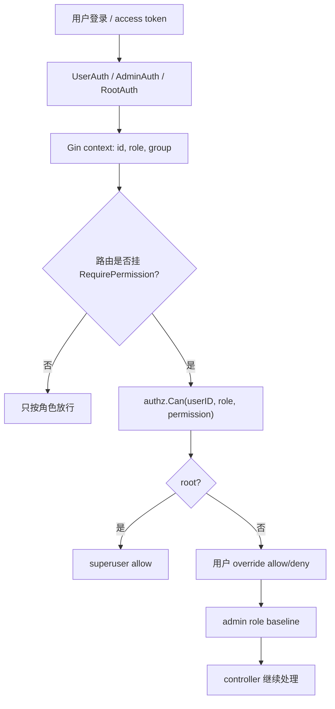

# RBAC、管理员权限与前后端权限守卫学习指南

这篇文档专门梳理 new-api 的后台权限系统：从粗粒度角色、Gin 中间件、Casbin 策略、每用户权限 override，到前端路由守卫和按钮级能力判断。

读这块源码时先记住一句话：角色决定能不能进入一类后台区域，细粒度权限决定管理员能不能执行某些高风险操作；前端只负责体验和预防误点，后端中间件和 controller 才是最终安全边界。

## 一、权限系统的三层模型

new-api 当前权限体系可以分成三层：

| 层级 | 主要代码 | 作用 |
| --- | --- | --- |
| 系统角色 | `common.Role*`、`model.User.Role`、`middleware.AdminAuth/RootAuth` | 粗粒度身份：普通用户、管理员、Root。 |
| 细粒度权限 | `service/authz`、`model.CasbinRule`、`middleware.RequirePermission` | 管理员内部的资源动作权限，例如渠道 read/write/sensitive_write。 |
| 前端能力展示 | `web/default/src/lib/admin-permissions.ts`、route `beforeLoad`、渠道页按钮/表单 | 根据后端返回的能力矩阵隐藏/禁用 UI。 |

简化流程：



## 二、源码地图

后端核心文件：

| 文件 | 作用 |
| --- | --- |
| `main.go` | `InitResources()` 调 `authz.Init(model.DB)`；主流程启动 `authz.StartPolicySync()`。 |
| `middleware/auth.go` | `UserAuth`、`AdminAuth`、`RootAuth`、`RequirePermission`。 |
| `service/authz/enforcer.go` | Casbin model、初始化、reload、多节点策略同步。 |
| `service/authz/adapter.go` | 自定义 GORM adapter，把 Casbin policy 读写到 `casbin_rule`。 |
| `service/authz/role.go` | 内置 root/admin 授权角色定义。 |
| `service/authz/resources_channel.go` | 当前已注册的权限资源和动作：channel。 |
| `service/authz/registry.go` | 权限目录 registry，给后端判断和前端 catalog 共同使用。 |
| `service/authz/resolver.go` | `Can()` 和 `Capabilities()`，计算某个用户最终权限。 |
| `service/authz/override.go` | 保存、清理、读取每用户权限 override。 |
| `service/authz/seed.go` | 初始化内置角色和默认策略。 |
| `model/authz_role.go` | `authz_roles` 表，记录内置授权角色元数据。 |
| `model/casbin_rule.go` | `casbin_rule` 表，记录 role baseline 和 user override。 |
| `controller/authz.go` / `router/authz-router.go` | `/api/authz/catalog`。 |
| `controller/user.go` | 用户创建/更新时保存 `admin_permissions`，角色层级保护。 |
| `router/channel-router.go` | 渠道路由细粒度权限映射。 |
| `controller/channel_authz.go` | 渠道字段敏感分类和 fail-closed 校验。 |

前端核心文件：

| 文件 | 作用 |
| --- | --- |
| `web/default/src/lib/roles.ts` | 前端角色常量：user/admin/super admin。 |
| `web/default/src/stores/auth-store.ts` | 保存登录用户和 `permissions.admin_permissions`。 |
| `web/default/src/lib/admin-permissions.ts` | `hasPermission()`、权限 catalog 类型、矩阵归一化。 |
| `web/default/src/features/users/api.ts` | `getPermissionCatalog()` 拉 `/api/authz/catalog`。 |
| `web/default/src/features/users/lib/user-form.ts` | 创建/更新用户时构造 `admin_permissions` payload。 |
| `web/default/src/features/users/components/users-mutate-drawer.tsx` | Root 给管理员编辑权限矩阵。 |
| `web/default/src/features/channels/hooks/use-channel-mutate-form.ts` | 没有 sensitive_write 时剥离敏感字段。 |
| `web/default/src/features/channels/components/*` | 根据 `hasPermission()` 控制渠道按钮、批量动作和多 key 管理。 |
| `web/default/src/routes/_authenticated/*` | `beforeLoad` 用角色做页面级守卫。 |

## 三、系统角色：最粗的一道门

后端角色值来自 `common.Role*`，前端镜像在 `web/default/src/lib/roles.ts`：

| 角色 | 前端值 | 含义 |
| --- | --- | --- |
| Guest | 0 | 预留/访客。 |
| User | 1 | 普通用户。 |
| Admin | 10 | 管理员。 |
| Super Admin / Root | 100 | Root 管理员。 |

`model.User.Role` 是真实存储字段。大多数后台 API 先用：

后端常量定义在 `common/constants.go`，`common.IsValidateRole()` 只承认 guest/common/admin/root 这四个值。

- `middleware.UserAuth()`：至少普通用户。
- `middleware.AdminAuth()`：至少管理员。
- `middleware.RootAuth()`：必须 Root。

`authHelper(c, minRole)` 做了这些事：

1. 优先从 session 取 `username/role/id/status`。
2. 没有 session 时尝试 `Authorization` access token。
3. 要求请求带 `New-Api-User` header，并和 session/access token 里的 user id 一致。
4. 检查用户状态不是 disabled。
5. 检查 `role >= minRole`。
6. 把 `username/role/id/group/use_access_token` 写入 Gin context。
7. 对 Admin/Root 写接口启动管理审计兜底。

所以 controller 里常见的：

```go
c.GetInt("role")
c.GetInt("id")
```

并不是凭空来的，而是由这些 auth middleware 写入。

## 四、Casbin 数据模型

`service/authz/enforcer.go` 里 Casbin model 很简单：

```text
r = sub, obj, act
p = sub, obj, act, eft
e = some(where (p.eft == allow))
m = r.sub == p.sub && r.obj == p.obj && r.act == p.act && p.eft == "allow"
```

也就是说，策略行表达的是：

```text
subject 对 resource 的 action 是 allow 或 deny
```

项目没有使用 Casbin 的 `g` 角色继承模型。系统数字角色通过 `resolveSubjectRoles()` 在运行时映射成 `role:root` 或 `role:admin`，再参与权限判断。

subject 字符串由 `service/authz/permission.go` 生成：

```text
role:root
role:admin
user:42
```

`casbin_rule` 表结构在 `model/casbin_rule.go`：

| 字段 | 含义 |
| --- | --- |
| `Ptype` | Casbin policy type，主要是 `p`。 |
| `V0` | subject，例如 `role:admin` 或 `user:42`。 |
| `V1` | resource，例如 `channel`。 |
| `V2` | action，例如 `read`。 |
| `V3` | effect，例如 `allow` 或 `deny`。 |
| `V4/V5` | 预留。 |

`authz_roles` 表在 `model/authz_role.go`，记录 role 元数据：`key/name/description/built_in/enabled/sort`。它更像角色 catalog 表，不是用户到角色的绑定表。用户到系统角色的关系仍在 `users.role`。

## 五、初始化与多节点同步

启动链路：

```text
main.InitResources()
  -> model.InitDB()
  -> authz.Init(model.DB)
  -> model.CheckSetup()
  -> model.InitOptionMap()

main.main()
  -> go authz.StartPolicySync(common.SyncFrequency)
```

`authz.Init(db)` 做：

1. 如果当前节点是 master：
   - `seedBuiltInRoles(db)` upsert 内置 root/admin 到 `authz_roles`。
   - `resetBuiltInRolePolicies(db)` 删除内置角色旧策略。
2. 创建 Casbin model 和 `newGormAdapter(db)`。
3. 创建 `casbin.SyncedEnforcer`，开启 AutoSave。
4. 写入全局 `enforcer`。
5. 如果是 master，`seedDefaultPolicies()` 写入 admin 默认策略。

非 master 节点只加载当前 DB policy，不负责 seed。这样避免多节点同时重置内置策略。

`StartPolicySync(frequency)` 会周期性 `ReloadPolicy()`。原因是权限变更写入 DB 后，只会立即刷新当前节点；其他实例靠这个循环加载最新策略。

## 六、内置角色和默认权限

`service/authz/role.go` 定义两个授权角色：

| role key | Superuser | 含义 |
| --- | --- | --- |
| `root` | true | 不需要显式 policy，`Can()` 直接放行所有已知权限。 |
| `admin` | false | 通过默认 policy 获得一组基线权限。 |

当前已注册资源只有 channel，来自 `service/authz/resources_channel.go`：

| 权限 | 默认 admin | 含义 |
| --- | --- | --- |
| `channel:read` | 是 | 查看渠道列表和详情，不含完整 secret。 |
| `channel:operate` | 是 | 测试渠道、刷新余额、启停渠道。 |
| `channel:write` | 是 | 编辑非敏感路由字段，例如模型、分组、权重。 |
| `channel:sensitive_write` | 否 | 创建渠道、修改 key/base_url/header/param override 等敏感字段。 |
| `channel:secret_view` | 否 | 预留的查看 secret 权限。当前完整 key 查看仍主要走 RootAuth + 安全验证。 |

这解释了一个很重要的默认行为：普通 admin 可以管理渠道的非敏感路由配置，但默认不能创建渠道或改 key/base_url。

## 七、权限判断：Can()

`service/authz/resolver.go` 的 `Can(userID, systemRole, permission)` 是后端最终判断函数。

顺序：

1. `resolveSubjectRoles(userID, systemRole)` 把系统角色映射到 authz role：
   - root 用户 -> `role:root`
   - admin 用户 -> `role:admin`
   - 普通用户 -> nil
2. 如果包含 superuser role，直接允许。
3. 如果 permission 不在 registry，拒绝。
4. 先查用户级 explicit policy：
   - `deny` 优先返回拒绝。
   - `allow` 返回允许。
5. 再查角色 baseline policy。
6. 都没有则拒绝。

这里体现了一个常见 RBAC 扩展模式：

```text
角色提供默认权限
用户 override 可以加权或减权
deny 优先于 allow
```

`Capabilities(userID, systemRole)` 会遍历 registry，返回完整矩阵。它用于：

- `GET /api/user/self` 返回当前用户权限给前端。
- `GET /api/user/:id` 返回被编辑用户的权限矩阵。

## 八、用户级权限 override 如何保存

`model.User.AdminPermissions` 是：

```go
AdminPermissions map[string]map[string]bool `json:"admin_permissions,omitempty" gorm:"-:all"`
```

它是运行时字段，不存到 `users` 表。

保存入口在 `controller/user.go`：

- 创建用户：`CreateUser()`。
- 更新用户：`UpdateUser()`。
- 降级用户：`ManageUser(action=demote)` 清理授权。

共同调用：

```text
updateAdminPermissionsForUserInTx(c, tx, userID, userRole, permissions)
```

规则：

1. `permissions == nil`：
   - 普通情况下不改现有权限。
   - 如果目标已不是 admin 且操作者是 root，则清理授权。
2. 只有 root 可以提交 admin 权限矩阵。
3. 目标不是 admin 时，清理用户授权。
4. 目标是 admin 时，`authz.SetUserPermissionsInTx()` 写入 override。
5. 事务成功后调用 `authz.ReloadPolicy()` 刷新当前节点。

`SetUserPermissionsInTx()` 不是把完整矩阵全存进去，而是调用 `userOverridePolicies()` 只存“相对 admin baseline 有差异”的项：

- admin 默认允许、你取消勾选 -> 存 `deny`。
- admin 默认不允许、你勾选 -> 存 `allow`。
- 和默认相同 -> 不存。

这样 `casbin_rule` 里不会堆满冗余用户策略。

## 九、角色层级保护

用户管理不是只靠 RBAC，还叠加了角色层级规则。

`canManageTargetRole(myRole, targetRole)`：

```text
myRole == root 或 myRole > targetRole
```

体现到业务上：

- admin 不能管理同级 admin。
- admin 不能创建 admin 或 root。
- root 可以管理 admin 和普通用户。
- Root 用户不能被禁用、删除、降级。
- 只有 root 能 promote 普通用户为 admin。
- 只有 root 能修改 admin 的细粒度权限。

这是 RBAC 之外的“管理关系”约束，不能用单个 `channel:*` 权限表达。

## 十、路由权限链

### 10.1 普通后台路由

多数后台路由仍是角色门槛：

```text
/api/user/* admin routes       -> AdminAuth
/api/option/*                  -> RootAuth
/api/performance/*             -> RootAuth
/api/system_task/*             -> RootAuth
/api/models/*                  -> AdminAuth
/api/deployments/*             -> AdminAuth
```

这些路由当前没有挂 `RequirePermission`，所以细粒度权限主要集中在渠道系统。

### 10.2 Authz catalog

```text
GET /api/authz/catalog
  -> AdminAuth
  -> controller.GetPermissionCatalog
  -> authz.Catalog() + authz.Roles()
```

返回给前端：

- resources：资源和动作定义。
- roles：root/admin 的 baseline grants。

前端权限编辑器不硬编码完整 catalog，而是从这里拿 schema。

### 10.3 渠道路由

`router/channel-router.go` 先对整个 `/api/channel` 挂 `AdminAuth()`，再按路由挂 `RequirePermission(permission)`。

典型映射：

| 权限 | 路由例子 |
| --- | --- |
| `ChannelRead` | 列表、搜索、详情、可用模型、ops 信息。 |
| `ChannelOperate` | 测试渠道、刷新余额、启停渠道、检测上游模型。 |
| `ChannelWrite` | 更新渠道、编辑 tag、批量 tag、应用上游模型变更。 |
| `ChannelSensitiveWrite` | 创建/删除渠道、批量删除、抓取模型 POST、Codex refresh、Ollama pull/delete、复制渠道。 |

此外还有一些更高风险接口直接使用：

```text
RootAuth + CriticalRateLimit + DisableCache + SecureVerificationRequired
```

例如完整 key 查看、上游密码查看、上游 session 凭据设置。这些不是单靠 `ChannelSecretView` 放行。

## 十一、渠道字段级敏感校验

路由层只能知道“这是 PUT /api/channel”，但不知道这次请求改了哪些字段。因此 `controller/channel_authz.go` 又做了一层字段级判断。

`channelHasSensitiveChanges(channel, origin, requestData)` 会检查：

- `type`
- `key`
- `base_url`
- `openai_organization`
- `header_override`
- `param_override`
- `setting`
- `other`
- `settings`
- `key_mode`
- `upstream_profile`

如果这些字段有变化，就要求 `authz.ChannelSensitiveWrite`。

非敏感字段包括：

- `name`
- `weight`
- `models`
- `group`
- `model_mapping`
- `status_code_mapping`
- `priority`
- `auto_ban`
- `tag`
- `remark`
- `channel_info`
- `multi_key_mode`

还有只读字段和操作字段单独分类。

最关键的是 fail-closed 逻辑：

```text
请求里出现未知字段
  -> 不在 sensitive/non-sensitive/operational/read-only 分类
  -> 默认视为 sensitive
```

`controller/channel_authz_test.go` 的 `TestChannelFieldsAreClassified` 会反射 `PatchChannel` 的 JSON 字段，要求每个字段都被分类。以后新增 channel 字段时，测试会逼开发者明确它属于哪一类。

这是一条很实用的安全工程经验：新增字段默认不能悄悄变成普通 admin 可写。

## 十二、前端登录态和权限矩阵

`controller.GetSelf()` 返回当前用户信息时会附带：

```text
permissions.sidebar_settings
permissions.sidebar_modules
permissions.admin_permissions
```

前端 `auth-store.ts` 把用户对象存到 Zustand 和 localStorage。

`web/default/src/lib/admin-permissions.ts` 提供：

```ts
hasPermission(user, resource, action)
```

规则：

1. 没有 user -> false。
2. `role === SUPER_ADMIN` -> true。
3. 否则读取 `user.permissions.admin_permissions[resource][action]`。

这里和后端一致：Root 前端直接视为所有权限 true。

但要注意：localStorage 里的权限只是 UI 状态，不能作为安全依据。真实请求仍会被后端 `RequirePermission` 和 controller 字段级校验拦截。

## 十三、前端权限 catalog 和用户编辑器

前端通过：

```text
features/users/api.ts
  -> getPermissionCatalog()
  -> GET /api/authz/catalog
```

拿到资源、动作、角色 baseline。

`normalizeAdminPermissions(value, catalog)` 会：

1. 找到 admin role baseline。
2. 遍历 catalog 里所有 resource/action。
3. 有用户传入值就用用户值。
4. 没有用户值就填 admin baseline。

用户编辑抽屉 `UsersMutateDrawer` 只有在：

```text
当前用户是 SUPER_ADMIN
目标用户 role >= ADMIN
catalog.resources 非空
```

时展示 “Admin Permissions” 区域。

提交时 `transformFormDataToPayload()` 只在目标是 admin 且 catalog 可用时发送完整 `admin_permissions` 矩阵；否则省略该字段，后端会保持现有授权不变。

## 十四、前端渠道页如何使用权限

渠道前端主要用 `hasPermission(..., channel, sensitive_write)` 判断敏感操作。

典型位置：

- `channels-primary-buttons.tsx`：没有 `sensitive_write` 时不展示创建渠道等敏感入口。
- `data-table-row-actions.tsx` / `data-table-bulk-actions.tsx`：控制删除、复制、批量敏感动作。
- `multi-key-manage-dialog.tsx`：控制多 key 修改类操作。
- `channel-mutate-drawer.tsx`：控制敏感字段展示和完整 key reveal。
- `use-channel-mutate-form.ts`：提交更新前，如果没有 `sensitive_write`，主动删除敏感字段。

`use-channel-mutate-form.ts` 的前端剥离敏感字段只是体验优化，后端仍有 `channelHasSensitiveChanges()` 做最终判断。

完整 key 查看目前前端用：

```text
currentUser.role === SUPER_ADMIN
```

后端对应路由也是 `RootAuth + SecureVerificationRequired`，并不只是看 `channel:secret_view`。

## 十五、前端路由守卫

TanStack Router 的 `beforeLoad` 做页面级角色守卫：

- `/channels`、`/models`、`/users`、`/subscriptions`：要求 `role >= ADMIN`。
- `/system-settings`、`/system-info`：要求 `role === SUPER_ADMIN`。
- pricing/rankings：走导航模块配置，可能公开、需要登录或禁用。

这些路由守卫主要是避免用户看到不该看的页面。后端 API 仍然必须有对应的 auth middleware，因为前端守卫可以被绕过。

## 十六、Header Nav 权限不是 RBAC

`middleware/header_nav.go` 管的是公开导航模块，例如 pricing、rankings 是否启用、是否要求登录。

它和 `service/authz` 的 RBAC 是两套东西：

- HeaderNavModuleAuth：控制前台公开页面是否可访问。
- AdminAuth/RootAuth/RequirePermission：控制后台管理 API。

所以不要把“pricing 页面需要登录”理解成 Casbin 权限。

## 十七、常见误区

1. `users.role` 不是 Casbin role assignment 表；系统角色仍直接存在 users 表。
2. `authz_roles` 不是用户角色绑定表，而是内置授权角色 catalog。
3. Root 的所有权限不是靠 `casbin_rule` 写满，而是 `Can()` 里 superuser 短路。
4. admin 的默认权限来自 permission registry 的 `DefaultRoles`，初始化时写成 role baseline policy。
5. 用户权限保存时只存相对 admin baseline 的 override，不存完整矩阵。
6. `deny` 可以覆盖 admin baseline 的 allow。
7. 当前细粒度权限主要覆盖 channel 资源，不代表所有后台模块都已经 Casbin 化。
8. `ChannelSecretView` 当前是预留权限；完整 key 查看仍走 RootAuth 和安全验证。
9. 前端 `hasPermission()` 不是安全边界，后端仍必须校验。
10. 普通 admin 默认不能创建渠道或改 key/base_url，因为这些需要 `channel:sensitive_write`。
11. 渠道 `PUT /api/channel` 即使路由允许 `ChannelWrite`，敏感字段变化仍会在 controller 内二次校验。
12. 新增 channel 字段必须分类；否则测试会失败，运行时也按 sensitive 处理。
13. 多节点里权限变更不是靠内存共享，而是写 DB 后各节点周期 reload。
14. 项目没有用 Casbin `g` 表达用户属于某个角色；用户角色仍来自 `users.role`。

## 十八、推荐精读路线

建议按这个顺序读源码：

1. `middleware/auth.go`：先理解 session/access token 如何变成 Gin context。
2. `service/authz/resources_channel.go`：看当前权限资源和动作。
3. `service/authz/role.go`、`registry.go`：理解 role baseline 和 catalog。
4. `service/authz/enforcer.go`、`adapter.go`：看 Casbin 如何接 GORM。
5. `service/authz/resolver.go`：精读 `Can()` 的判断顺序。
6. `service/authz/override.go`：理解为什么只保存差异 override。
7. `controller/user.go`：看 root 如何给 admin 保存权限，以及角色层级保护。
8. `router/channel-router.go`：把 channel 路由和权限动作一一对应。
9. `controller/channel_authz.go`：看字段级敏感校验和 fail-closed 思路。
10. `web/default/src/lib/admin-permissions.ts`：看前端怎么消费后端能力矩阵。
11. `web/default/src/features/users/components/users-mutate-drawer.tsx`：看权限编辑器。
12. `web/default/src/features/channels`：看按钮、表单、mutation 如何使用 `hasPermission()`。

读完这条线后，再回到 `channel-management-selection-guide-for-go-learners.md`，你会更容易理解为什么渠道模块的 CRUD、密钥、模型、权重、批量操作被拆成多种权限。
