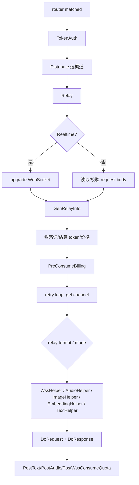
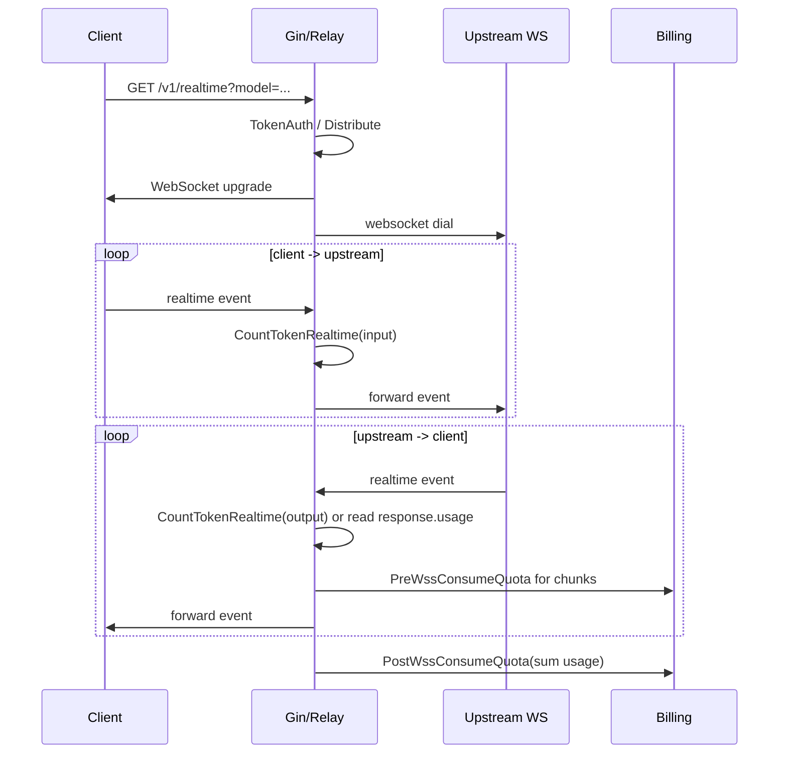
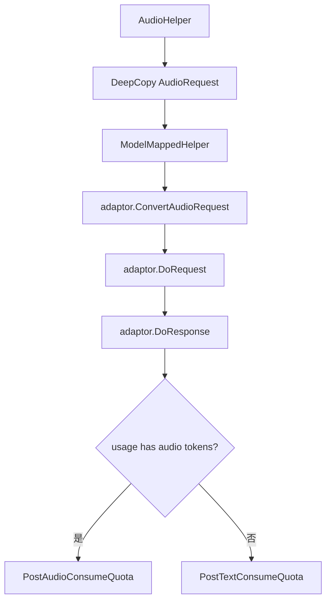
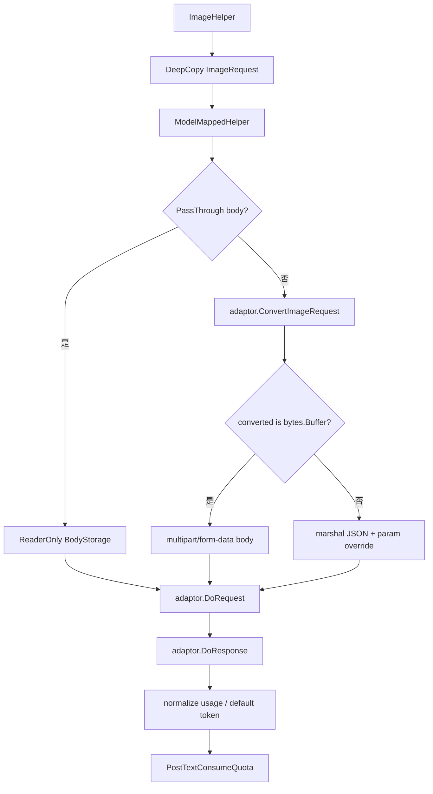

# Realtime、音频、图片、Embedding 与 Moderation Relay 学习指南

这篇文档专门梳理 new-api 除普通 chat/completions 之外的同步 relay 链路：Realtime WebSocket、音频 speech/transcription/translation、图片 generations/edits、embeddings、moderations，以及 Gemini 原生 embedding。

读这块源码时先记住一句话：这些接口共用 `controller.Relay`、`TokenAuth`、`Distribute`、预扣费、重试、`Adaptor`、日志和后结算框架，但每类接口在请求体读取、上游协议、usage 获取和计费 token 语义上都不一样。

## 一、先看路由如何分流

核心路由在 `router/relay-router.go`：

| 路由 | RelayFormat | RelayMode | 主要 helper |
| --- | --- | --- | --- |
| `GET /v1/realtime` | `RelayFormatOpenAIRealtime` | `RelayModeRealtime` | `relay.WssHelper` |
| `POST /v1/audio/speech` | `RelayFormatOpenAIAudio` | `RelayModeAudioSpeech` | `relay.AudioHelper` |
| `POST /v1/audio/transcriptions` | `RelayFormatOpenAIAudio` | `RelayModeAudioTranscription` | `relay.AudioHelper` |
| `POST /v1/audio/translations` | `RelayFormatOpenAIAudio` | `RelayModeAudioTranslation` | `relay.AudioHelper` |
| `POST /v1/images/generations` | `RelayFormatOpenAIImage` | `RelayModeImagesGenerations` | `relay.ImageHelper` |
| `POST /v1/images/edits` | `RelayFormatOpenAIImage` | `RelayModeImagesEdits` | `relay.ImageHelper` |
| `POST /v1/edits` | `RelayFormatOpenAIImage` | `RelayModeImagesEdits` | `relay.ImageHelper` |
| `POST /v1/images/variations` | not implemented | not implemented | `RelayNotImplemented` |
| `POST /v1/embeddings` | `RelayFormatEmbedding` | `RelayModeEmbeddings` | `relay.EmbeddingHelper` |
| `POST /v1/moderations` | `RelayFormatOpenAI` | `RelayModeModerations` | `relay.TextHelper` |
| `POST /v1/models/*path` containing embed | `RelayFormatGemini` | `RelayModeGemini` | `relay.GeminiEmbeddingHandler` |

`relay/constant/relay_mode.go` 的 `Path2RelayMode` 是路由之外的第二层分流。它把 URL path 映射成整数模式，后续 `controller.relayHandler` 用这个模式选择 helper。

注意：`/v1/moderations` 虽然业务上和 embedding 一样是“非 chat”接口，但它走 OpenAI text request 和 `TextHelper`，不是 `EmbeddingHelper`。如果 body 里没传 model，会在校验阶段默认成 `text-moderation-latest`，分发阶段也有 `text-moderation-stable` 的兜底。

## 二、共同主流程：还是 `controller.Relay`

这些接口都先进入 `controller.Relay`。简化流程如下：



共同点：

- 都复用 `middleware.TokenAuth` 识别 API key。
- 都复用 `middleware.Distribute` 选择渠道和设置上下文。
- 都会生成 `relaycommon.RelayInfo`，记录用户、token、分组、模型、渠道、请求路径、stream 状态和计费上下文。
- 都会先估算 token 并预扣费，然后在 helper 成功后按真实 usage 后结算。
- helper 返回 `NewAPIError` 时，会走统一的重试、自动禁用、退款和错误响应逻辑。
- 成功结算后通常会写 `logs`、`quota_data`，并记录 `perf_metrics` sample。

不同点：

- Realtime 在 request body 校验前就升级 WebSocket。
- audio transcription/translation 和 image edits 可能是 multipart。
- image streaming 走 SSE 扫描，Realtime 走 WebSocket 双向转发。
- embedding 和 moderation 的 usage 多数来自本地估算或上游 usage，不涉及输出 token。

## 三、请求校验和 DTO

入口是 `relay/helper/valid_request.go` 的 `GetAndValidateRequest`。

### Realtime

Realtime 不读取 HTTP body：

- `RelayFormatOpenAIRealtime` 直接返回 `&dto.BaseRequest{}`。
- 真实消息在 WebSocket 建立后逐条转发和解析。
- model 不在 body 中，而是从 `/v1/realtime?model=...` 查询参数被 `Distribute` 识别。

### 音频

`GetAndValidAudioRequest` 解析 `dto.AudioRequest`：

- speech 要求 `model`。
- transcription/translation 也要求 `model`，如果没传 `response_format`，默认 `json`。
- `AudioRequest.IsStream` 目前根据 `stream_format == "sse"` 判断。
- `GetTokenCountMeta` 对 speech 输入文本计 token；如果模型名包含 `gpt`，使用 tokenizer，否则按文本长度估算。

transcription/translation 的真实音频文件从 multipart 里读取，不在 `AudioRequest.Input`。

### 图片

`GetAndValidOpenAIImageRequest` 解析 `dto.ImageRequest`：

- generations 通常是 JSON。
- edits 支持 JSON，也支持 `multipart/form-data`。
- multipart edits 会从 form 字段填 `prompt/model/n/quality/size/stream/watermark`，并复用 `common.ParseMultipartFormReusable`，避免 body 被读坏。
- `dall-e-2`/`dall-e` 校验 size 只能是 `256x256`、`512x512`、`1024x1024`。
- `dall-e-3` 校验 size 和 quality，默认 `standard`。
- `gpt-image-1` 默认 quality 为 `auto`，multipart edits 中默认 `standard`。
- `N` 为空或 0 时默认 1。

`ImageRequest.GetTokenCountMeta` 会把 prompt 作为文本，并根据 DALL-E 的 size/quality 算 `ImagePriceRatio`。这里特意不把 `n` 乘进去，因为 `ImageHelper` 和部分 adaptor 会通过 `OtherRatio("n")` 处理生成数量，避免双倍计费。

另一个细节：`ImageRequest` 用 `Extra map[string]json.RawMessage` 接收未知字段，但当前 `MarshalJSON` 没有把 `Extra` 自动平铺回上游请求；需要透传 provider 特有字段时，要看具体 adaptor 是否显式读取 `Extra` 或 `extra_fields`。

### Embedding

`GetAndValidateEmbeddingRequest` 解析 `dto.EmbeddingRequest`：

- `input` 必填。
- `/v1/embeddings` 没传 model 时会尝试用 path param，但普通 OpenAI embeddings 路由通常没有 `:model`。
- `ParseInput` 支持 string 和 `[]any` 中的 string。
- token meta 会把所有 input 文本用换行拼起来。

### Moderation

`GetAndValidateTextRequest` 在 `RelayModeModerations` 下处理 moderation：

- 没传 model 时默认 `text-moderation-latest`。
- `input` 必填。
- 后续仍走 OpenAI text helper。

## 四、Realtime WebSocket 链路

Realtime 是这组接口里最特殊的一条链路。



### API key 从哪里来

Realtime 客户端常把 key 放在 `Sec-WebSocket-Protocol`：

```text
Sec-WebSocket-Protocol: realtime, openai-insecure-api-key.sk-REDACTED, openai-beta.realtime-v1
```

`middleware.TokenAuth` 会解析这个 header，找到 `openai-insecure-api-key.` 前缀，把 key 转成普通 `Authorization: Bearer ...`，后续鉴权逻辑就能复用。

`controller.Relay` 对 Realtime 会先用 `websocket.Upgrader` 升级客户端连接。当前 upgrader 声明的 subprotocol 是 `realtime`。

### RelayInfo 如何初始化

`relay/common/relay_info.go` 的 `GenRelayInfoWs`：

- 设置 `RelayFormatOpenAIRealtime`。
- 保存 `ClientWs`。
- 默认 `InputAudioFormat` 和 `OutputAudioFormat` 都是 `pcm16`。
- 设置 `IsFirstRequest = true`。
- request body 是 `BaseRequest`，不参与普通 JSON 校验。

`middleware.Distribute` 对 `/v1/realtime` 会从 query 参数取 model：

```text
/v1/realtime?model=gpt-4o-realtime-preview-2024-10-01
```

### 如何连上游

`relay.WssHelper`：

1. `info.InitChannelMeta(c)` 把当前渠道信息填入 `RelayInfo`。
2. `GetAdaptor(info.ApiType)` 找 provider adaptor。
3. `adaptor.DoRequest` 对 OpenAI adaptor 来说会进入 `channel.DoWssRequest`。
4. `DoWssRequest` 用 adaptor 的 `GetRequestURL` 和 `SetupRequestHeader` 构造上游 WebSocket 连接。
5. 上游连接保存到 `info.TargetWs`。
6. `adaptor.DoResponse` 进入 `OpenaiRealtimeHandler`，开始双向转发。

OpenAI adaptor 对 Realtime 有两种 header：

- 如果客户端带了 `Sec-WebSocket-Protocol`，上游也用 subprotocol，内容包括 `realtime`、`openai-insecure-api-key.{upstreamKey}`、`openai-beta.realtime-v1`。
- 如果客户端没带 subprotocol，就设置 `openai-beta: realtime=v1` 和 `Authorization: Bearer {upstreamKey}`。

Azure Realtime 的 URL 不同：

```text
/openai/realtime?deployment={deployment}&api-version={apiVersion}
```

普通 OpenAI/兼容渠道则通常复用请求路径和 base URL。

### 双向转发和 usage

`relay/channel/openai/relay_realtime.go` 的 `OpenaiRealtimeHandler` 启动两个 goroutine：

| goroutine | 方向 | 做什么 |
| --- | --- | --- |
| client reader | client -> upstream | 读客户端消息、解析 `RealtimeEvent`、记录 session tools、估算输入 text/audio token、转发给上游。 |
| target reader | upstream -> client | 读上游消息、设置 first response time、解析 usage 或本地估算输出 text/audio token、转发给客户端。 |

usage 有两种来源：

- 上游 `response.done` 里带 `response.usage` 时，优先累加上游 usage。
- 没有 usage 时，本地根据 realtime event 类型估算 token。

本地估算在 `service.CountTokenRealtime`：

| event type | 估算方式 |
| --- | --- |
| `session.update` | 对 instructions 计文本 token。 |
| `input_audio_buffer.append` | 对输入 audio base64 按输入音频格式算 audio token。 |
| `response.audio.delta` | 对输出 audio delta 按输出格式算 audio token。 |
| `response.audio_transcript.delta` | 对 transcript delta 计文本 token。 |
| `response.function_call_arguments.delta` | 对 function call arguments delta 计文本 token。 |
| `conversation.item.created` | 对 input_text 内容计文本 token。 |
| `response.done` | 非首次请求时把 session tools 也计入。 |

音频 token 的换算在 `CountAudioTokenInput` 和 `CountAudioTokenOutput`：

- 输入：`duration / 60 * 100 / 0.06`
- 输出：`duration / 60 * 200 / 0.24`

这两个公式把音频时长转成项目内部 token 语义，最终仍由 audio quota 公式结算。

### Realtime 为什么有两阶段扣费

Realtime 会在会话过程中调用 `PreWssConsumeQuota`：

- 每次拿到一段 usage 后，先检查用户 quota 和 token quota。
- 然后调用 `PostConsumeQuota` 进行阶段性消耗。
- 这样长连接不会等到断开才发现额度不足。

连接结束后，`WssHelper` 调 `PostWssConsumeQuota`：

- 用累计 `sumUsage` 计算总 quota。
- 支持 `tiered_expr` 的 `TryTieredSettle`。
- 更新用户/渠道累计用量。
- 调 `SettleBilling` 处理预扣和真实结算差额。
- 写 `RecordConsumeLog`。

容易混淆的是：Realtime 既有连接前普通预扣，也有连接中的 `PreWssConsumeQuota`，最后还有 `PostWssConsumeQuota` 做总账。这是为了同时覆盖长连接风险和最终日志/统计。

### 错误和性能指标

Realtime 的错误处理和普通 HTTP relay 有两个区别：

- WebSocket 握手失败或 `controller.Relay` defer 捕获到 `NewAPIError` 时，会通过 `helper.WssError` 包成 Realtime `error` event 发回客户端。
- `OpenaiRealtimeHandler` 内部的上游/下游读写错误会进入 `errChan`，当前主要记录日志并返回累计 usage，不一定变成 `NewAPIError`。

失败性能 sample 只有在最终 `newAPIError != nil` 时由 `controller.Relay` 记录。普通文本和音频成功结算会记录 `perfmetrics.RecordRelaySample`，但当前 `PostWssConsumeQuota` 没有调用这个函数，因此 Realtime 成功样本可能不会进入 `perf_metrics`。读 Dashboard 性能指标时不要把 Realtime 和普通 HTTP 请求混在一起推断。

## 五、音频 speech/transcription/translation

音频统一入口是 `relay.AudioHelper`。



### Speech

OpenAI adaptor 的 `ConvertAudioRequest`：

- `RelayModeAudioSpeech` 使用 JSON body。
- `OpenaiTTSHandler` 把上游 audio body 原样写给客户端。
- 非流式 speech 会读取完整响应体，并尝试计算音频时长。
- 如果格式是 `pcm`，按 24000 Hz、16-bit、单声道直接用字节数估算时长。
- 其它格式调用 `common.GetAudioDuration`。
- 如果无法读时长，就按响应体 KB 粗略估算输出 audio token。
- 输出 audio token 写到 `CompletionTokenDetails.AudioTokens`。

如果 `stream_format == "sse"`，TTS 会走 stream scanner，并尝试从流式 chunk 中读取 usage。

### Transcription / Translation

OpenAI adaptor 的 `ConvertAudioRequest`：

- transcription/translation 使用 multipart。
- 复用 `common.ParseMultipartFormReusable`。
- 写入 `model` 和其它 form 字段。
- 要求至少有一个 `file`。
- 复制第一个 file 到新的 multipart writer。
- 更新请求 header 的 `Content-Type` 为新 multipart boundary。

估算 token 在 `service.EstimateRequestToken` 中对这两个模式特殊处理：

- 解析 multipart。
- 打开每个 `file`。
- 用 `common.GetAudioDuration` 获取时长。
- 按“一分钟 1000 token”估算输入 audio token。

`OpenaiSTTHandler` 会把上游响应原样写回客户端。如果响应 JSON 中有 usage，优先使用；否则 usage 退回到预估 prompt tokens，completion 为 0。

### 音频计费

`PostAudioConsumeQuota` 和文本结算相似，但 quota 公式是 `calculateAudioQuota`：

| token 类型 | 乘数 |
| --- | --- |
| 输入文本 token | 基础模型倍率 |
| 输出文本 token | completion ratio |
| 输入音频 token | audio ratio |
| 输出音频 token | audio ratio * audio completion ratio |

如果模型是 price 模式，则按 `modelPrice * QuotaPerUnit * groupRatio` 计费。`tiered_expr` 开启时，会用表达式结果覆盖普通音频公式。

最后会：

- 更新用户/渠道累计用量。
- `SettleBilling`。
- 写消费日志和 `GenerateAudioOtherInfo`。
- 记录 `perfmetrics.RecordRelaySample`。

### 常见音频 provider 差异

| Provider | 关键实现 | 特点 |
| --- | --- | --- |
| OpenAI | `relay/channel/openai/audio.go` | speech 直接转发音频 body；STT/translation 重新构造 multipart；优先使用上游 usage。 |
| Cloudflare | `relay/channel/cloudflare/adaptor.go` | STT 可能把上传文件原始 bytes 作为 body，不构造 OpenAI multipart。 |
| MiniMax | `relay/channel/minimax/adaptor.go`、`minimax/tts.go` | 主要支持 TTS；OpenAI voice/speed/format/input 转 MiniMax request；metadata 可覆盖请求结构。 |

如果某个 provider 没实现对应音频转换，路由仍然存在，但该渠道会在 helper/adaptor 阶段失败，然后进入统一重试或错误流程。

## 六、图片 generations/edits

图片统一入口是 `relay.ImageHelper`。



### Pass-through 与转换

如果全局或渠道开启 pass-through body，`ImageHelper` 会直接从 `BodyStorage` 读取原始 body 转发。否则：

- generations 通常保持 JSON。
- edits 如果是 multipart，OpenAI adaptor 会重新构造 multipart body。
- multipart edits 支持 `image`、`image[]`、`image[0]` 这类数组字段。
- mask 文件会作为 `mask` 字段一起复制。
- 文件 MIME 会按扩展名识别，无法识别时默认 `image/png`。

### 图片 usage

OpenAI image response 的 usage 字段和 chat 不同，常见是：

- `input_tokens`
- `output_tokens`
- `input_tokens_details`

`normalizeOpenAIUsage` 会把它们映射到项目通用字段：

- `input_tokens` -> `PromptTokens`
- `output_tokens` -> `CompletionTokens`
- `input_tokens_details.image_tokens` -> `PromptTokensDetails.ImageTokens`
- `total_tokens` 为空时用 prompt + completion 补齐。

如果上游没有 usage，`ImageHelper` 会给 `TotalTokens` 和 `PromptTokens` 设置 1，避免成功生成图片却完全不计费。

### 图片 streaming

`ImageRequest.IsStream` 由 `stream` bool 决定。

OpenAI adaptor 的 `DoResponse` 对图片流式分三种：

- 上游返回 `text/event-stream`：`OpenaiImageStreamHandler` 用共享 `StreamScannerHandler` 扫描 SSE。
- 上游返回 JSON 但客户端请求 stream：`OpenaiImageJSONAsStreamHandler` 把普通 JSON 响应包装成 SSE `image_generation.completed` 事件，再发送 `[DONE]`。
- 上游错误 JSON：走普通 `OpenaiImageHandler` 解析错误。

图片流式复用了普通 SSE 引擎，因此有 ping、超时、客户端断连和 stream status 处理。

### 图片计费

图片最终走 `PostTextConsumeQuota`，但关键计费因素来自：

- `ImageRequest.GetTokenCountMeta` 的 `ImagePriceRatio`，用于 DALL-E size/quality。
- `relay/helper/price.go` 里的 image ratio。
- `ImageHelper` 对 price 模式设置 `OtherRatio("n")`，按生成数量乘一次。
- 部分 adaptor 会根据上游真实响应数量设置更准确的 `n`。
- `PostTextConsumeQuota` 会把 `ImageTokens` 从基础 prompt tokens 中扣出，再乘 image ratio。

所以图片计费不是“图片 helper 专属公式”，而是“图片 usage + image ratio + text quota 结算”的组合。

### 常见图片 provider 差异

| Provider | 关键实现 | 特点 |
| --- | --- | --- |
| OpenAI | `relay/channel/openai/adaptor.go`、`relay_image.go` | generations JSON 透传；edits 重建 multipart；OpenAI image usage 需要归一化。 |
| Ali/DashScope | `relay/channel/ali/adaptor.go`、`ali/image.go` | generation 按模型分同步/异步；Wan/qwen/z-image edits 有不同上游；`parameters.n` 会写 `OtherRatio("n")`。 |
| MiniMax | `relay/channel/minimax/image.go` | `size` 转 `aspect_ratio`；`response_format=b64_json/base64` 转 MiniMax `base64`；usage 常为空，靠 helper 兜底。 |
| Zhipu v4 | `relay/channel/zhipu_4v/image.go` | 上游 URL 图片会下载转 b64，再输出 OpenAI 风格 `b64_json`。 |
| Jimeng | `relay/channel/jimeng/adaptor.go`、`jimeng/image.go` | 使用火山签名；`extra_fields` 可覆盖 provider payload；响应转 OpenAI image response。 |
| Replicate | `relay/channel/replicate/adaptor.go` | 转 `/v1/models/{model}/predictions`；edits 先上传图片成 URL；`201 Created` 被 image helper 视为成功。 |
| SiliconFlow | `relay/channel/siliconflow/adaptor.go` | `size/n` 映射到 `image_size/batch_size`，并允许部分额外字段覆盖。 |
| Gemini/Vertex | `relay/channel/gemini/adaptor.go`、`vertex/adaptor.go` | `imagen` 类模型走 Gemini image response 转换。 |

这张表的读法是：通用 `ImageHelper` 只保证统一框架，真正“如何把 OpenAI 图片请求变成上游请求”在各 provider adaptor 里。

## 七、Embeddings

OpenAI-compatible embedding 入口是 `relay.EmbeddingHelper`：

1. 校验 `*dto.EmbeddingRequest`。
2. deep copy，避免重试或 adaptor 修改污染原始请求。
3. `ModelMappedHelper` 做渠道模型映射。
4. `adaptor.ConvertEmbeddingRequest`。
5. marshal JSON，应用 param override。
6. `adaptor.DoRequest`。
7. `adaptor.DoResponse`。
8. `PostTextConsumeQuota`。

OpenAI adaptor 的 `ConvertEmbeddingRequest` 默认原样返回 request。usage 通常在上游 embedding 响应中带回；如果 provider 不带 usage，通用 handler 会按项目规则补齐或用估算。

Embedding 的 token meta 来自 `EmbeddingRequest.ParseInput`，会把多个输入字符串拼接。它没有 completion token，主要按输入 token 计费。

## 八、Gemini 原生 embedding

Gemini 原生路径和 OpenAI-compatible `/v1/embeddings` 不同：

- 路由是 `/v1/models/*path` 或 `/v1beta/models/*path`。
- 如果 path 包含 `:embedContent` 或 `:batchEmbedContents`，`geminiRelayHandler` 会进 `relay.GeminiEmbeddingHandler`。
- `info.IsGeminiBatchEmbedding` 标记是否 batch。
- 单条请求解析 `dto.GeminiEmbeddingRequest`。
- batch 请求解析 `dto.GeminiBatchEmbeddingRequest`。
- 请求 model 会被改成 `models/{UpstreamModelName}`。

Gemini embedding 响应在 `relay/channel/gemini/relay-gemini.go` 转换：

- 读取 Gemini embedding response。
- 构造 OpenAI embedding response：`object=list`、`data[].embedding`、`model`。
- usage 用 `service.ResponseText2Usage` 根据估算 prompt tokens 生成。
- 写回客户端后调用 `PostTextConsumeQuota`。

这条链路回答的是“Gemini 原生 embedding API 如何被转换成 OpenAI 风格响应”，不是普通 `/v1/embeddings`。

## 九、Moderations

`/v1/moderations` 走 `RelayFormatOpenAI` 和 `TextHelper`：

- `Path2RelayMode` 标记 `RelayModeModerations`。
- `GetAndValidateTextRequest` 要求 `input`，缺 model 默认 `text-moderation-latest`。
- `middleware.Distribute` 也有 moderation model 兜底。
- helper 层按普通 OpenAI text 请求转发。
- usage 和计费走 `PostTextConsumeQuota`。

因此 moderation 的特殊性主要在校验和默认模型，不在单独 helper。

## 十、Provider adaptor 扩展点

所有这些模式都落在 `relay/channel/adapter.go` 的统一接口上：

| 方法 | 用途 |
| --- | --- |
| `ConvertAudioRequest` | speech/transcription/translation 请求转换，可能返回 JSON reader 或 multipart reader。 |
| `ConvertImageRequest` | generations/edits 请求转换，可能返回 JSON object 或 multipart buffer。 |
| `ConvertEmbeddingRequest` | embedding 请求转换。 |
| `DoRequest` | 根据 relay mode 选择普通 HTTP、form request 或 WebSocket request。 |
| `DoResponse` | 把上游响应写给客户端，并返回统一 usage。 |

OpenAI adaptor 是默认参考实现：

- audio transcription/translation 和非 JSON image edits 用 `DoFormRequest`。
- realtime 用 `DoWssRequest`。
- 其它大多数请求用 `DoApiRequest`。

其它 provider 可以只实现自己支持的转换：

- Gemini/Vertex 会把 OpenAI image 或 embedding 转为 Gemini 原生格式。
- Ali、VolcEngine、MiniMax、Jimeng、Zhipu 等 provider 有自己的 image 请求/响应格式。
- 不支持某种模式的 adaptor 通常返回 not implemented error，helper 会把它变成不可重试或可处理的 relay error。

一个实际阅读技巧：先读 `relay/image_handler.go`、`relay/audio_handler.go`、`relay/embedding_handler.go` 掌握统一骨架，再跳到目标 provider 的 `adaptor.go` 看三类 `Convert*Request` 和 `DoResponse`。不要从 provider 文件直接开始，否则容易把“通用框架”和“厂商特例”混在一起。

## 十一、日志、用量和性能指标落点

| 接口类型 | 后结算函数 | usage 主要来源 | 日志 other |
| --- | --- | --- | --- |
| Realtime | `PostWssConsumeQuota` | 上游 `response.usage` 或本地 event 估算 | `GenerateWssOtherInfo` |
| Speech | `PostAudioConsumeQuota` 或 `PostTextConsumeQuota` | 音频时长、本地估算或流式 usage | `GenerateAudioOtherInfo` |
| Transcription/Translation | `PostAudioConsumeQuota` 或 `PostTextConsumeQuota` | 上游 usage 或音频时长预估 | `GenerateAudioOtherInfo` |
| Image | `PostTextConsumeQuota` | 上游 image usage 或保底 token | text other + image fields |
| Embedding | `PostTextConsumeQuota` | 上游 usage 或输入估算 | text other |
| Moderation | `PostTextConsumeQuota` | 上游 usage 或输入估算 | text other |

这些后结算函数最终都会写 `model.RecordConsumeLog`。如果 `DataExportEnabled` 开启，消费日志还会进入 `quota_data` 聚合表，供 Dashboard 和排行榜使用。

性能指标方面：

- `PostTextConsumeQuota`、`PostAudioConsumeQuota` 成功后都会异步调用 `perfmetrics.RecordRelaySample`。
- 当前 `PostWssConsumeQuota` 没有记录成功 sample，Realtime 成功请求不一定进入 `perf_metrics`。
- 失败时 `controller.Relay` 在重试耗尽后记录 `success=false` sample。
- Realtime 是长连接，总耗时就是连接持续时间，所以 latency 指标和普通 HTTP 请求含义不同。

## 十二、常见误区

| 误区 | 正确理解 |
| --- | --- |
| Realtime 也从 JSON body 里读 model。 | Realtime 从 query 参数 `model` 读取，消息体在 WebSocket 中传输。 |
| Realtime 只在断开时扣费。 | 它连接中会按 usage 阶段性 `PreWssConsumeQuota`，断开后再 `PostWssConsumeQuota` 做总账和日志。 |
| `Sec-WebSocket-Protocol` 只是协议协商。 | 项目还兼容从其中提取 `openai-insecure-api-key` 作为 API key。 |
| audio speech 和 transcription 请求格式一样。 | speech 是 JSON；transcription/translation 是 multipart file。 |
| 图片 `n` 在 token meta 中乘过了。 | `ImageRequest.GetTokenCountMeta` 不乘 `n`，`ImageHelper` 或 adaptor 通过 OtherRatio 处理，避免双算。 |
| image edits 只支持单个 `image` 文件。 | OpenAI adaptor 支持 `image`、`image[]` 和 `image[0]` 这类数组字段。 |
| image streaming 一定要求上游也是 SSE。 | 如果上游返回 JSON，项目可以包装成 SSE completed event。 |
| `/v1/images/variations` 已实现。 | 当前路由明确 `RelayNotImplemented`。 |
| moderation 有专门 helper。 | moderation 走 OpenAI text helper，特殊点是 mode、校验和默认模型。 |
| Gemini embedding 和 OpenAI `/v1/embeddings` 是同一条路径。 | Gemini 原生 `:embedContent`/`:batchEmbedContents` 走 `GeminiEmbeddingHandler` 并转换为 OpenAI 风格响应。 |
| DTO 里的 `Extra` 一定会透传给上游。 | 不一定。要看具体 adaptor 是否读取 `Extra` 或 `extra_fields`。 |
| Realtime 成功一定会进入性能指标。 | 当前成功路径没有在 `PostWssConsumeQuota` 里记录 perf sample。 |

## 十三、Go 学习点

这组代码很适合练习几类 Go 后端能力：

- 用接口统一不同 provider：`Adaptor` 把请求转换、上游请求和响应处理分离。
- 用 `io.Reader` 抽象 JSON body、multipart body 和 BodyStorage。
- 用 `multipart.Writer` 重建上游 form-data，并正确设置 boundary。
- 用 `websocket.Conn` 做双向转发，并用 channel 协调关闭和错误。
- 用 goroutine 读 client/upstream 两个方向，同时注意 panic recover、连接关闭和 context 取消。
- 用 DTO 的 `IsStream`、`GetTokenCountMeta`、`SetModelName` 让不同请求体接入同一 relay 框架。
- 用 `json.RawMessage` 保留 provider 扩展字段，避免过早丢失协议能力。
- 用“预估 usage + 上游真实 usage + 本地补算”组合处理 provider usage 不稳定的问题。

## 十四、推荐阅读顺序

1. 读 `router/relay-router.go`，把这几类路由和 `RelayFormat` 对上。
2. 读 `relay/constant/relay_mode.go`，理解 `RelayMode` 如何从 URL 推导。
3. 读 `controller.Relay`，确认这些接口都复用预扣、重试、退款框架。
4. 读 `relay/helper/valid_request.go`，看每种 DTO 如何校验和补默认值。
5. 读 `relay/websocket.go` 和 `relay/channel/openai/relay_realtime.go`，掌握 Realtime 双向转发。
6. 读 `relay/audio_handler.go` 和 `relay/channel/openai/audio.go`，掌握 speech 和 STT 的差异。
7. 读 `relay/image_handler.go`、`dto/openai_image.go`、`relay/channel/openai/relay_image.go`，掌握图片 usage 和 stream。
8. 读 `relay/embedding_handler.go` 和 `relay/gemini_handler.go`，对比 OpenAI-compatible embedding 和 Gemini 原生 embedding。
9. 读 `service/quota.go` 的 `PostAudioConsumeQuota`、`PostWssConsumeQuota`，把 usage 接到最终计费。
10. 回到 `model.RecordConsumeLog` 和 `pkg/perf_metrics`，确认日志和性能指标如何沉淀。
