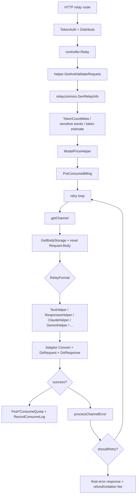

# Relay 主流程、错误重试与流式响应学习指南

这篇文档专门精读 new-api 最核心的一段运行时链路：用户发起一次 `/v1/chat/completions`、`/v1/responses`、Claude、Gemini 或 OpenAI 兼容请求后，项目如何解析请求、估算 token、预扣费、选择渠道、转换请求、调用上游、处理错误、决定是否重试、写回响应、结算额度，并把流式状态写入日志。

如果你已经看过 `auth-token-quota-guide-for-go-learners.md`、`channel-management-selection-guide-for-go-learners.md` 和 `provider-adapter-guide-for-go-learners.md`，这篇就是把三者在运行时串起来的“函数级地图”。

## 一句话总览

`controller.Relay` 是 relay 请求的总调度器。它先完成请求解析、`RelayInfo` 构造、敏感词检查、token 估算和预扣费；然后进入一个带 `RetryParam` 的渠道尝试循环；每次循环里恢复可复读 body、按协议调用具体 helper；成功就交给 provider handler 写响应并后结算，失败就用 `NewAPIError`、`processChannelError` 和 `shouldRetry` 决定是否记录错误、禁用渠道、排除当前渠道、重新选渠道或把错误返回给客户端。



## 关键源码地图

| 文件 | 职责 |
| --- | --- |
| `controller/relay.go` | relay 总入口、重试循环、错误响应 defer、渠道错误处理、Midjourney/task 入口。 |
| `relay/compatible_handler.go` | OpenAI compatible 文本主 helper：模型映射、StreamOptions、请求转换、上游调用、响应处理、结算。 |
| `relay/responses_handler.go` | Responses API helper：Responses/compact 校验、请求转换、pass-through、响应处理。 |
| `relay/claude_handler.go`、`relay/gemini_handler.go` | Claude/Gemini 协议入口与转换。 |
| `relay/helper/valid_request.go` | 按 `RelayFormat` 解析和校验 DTO，文本请求会校验 model、messages/prompt/input、max tokens、web search options 等。 |
| `relay/channel/api_request.go` | 统一构造上游 HTTP 请求、header override、Content-Length、HTTP trace、stream ping。 |
| `relay/channel/openai/relay-openai.go` | OpenAI 非流式/流式响应处理、usage 提取、本地 usage 估算、最终 SSE。 |
| `relay/channel/openai/relay_responses.go` | OpenAI Responses 非流式/流式响应处理、built-in tool 计数。 |
| `relay/helper/stream_scanner.go` | SSE 扫描器：超时、ping、客户端断开、data handler、`StreamStatus`。 |
| `relay/helper/stream_result.go` | 流式 data handler 对扫描器的回传接口：soft error、stop、done。 |
| `relay/common/stream_status.go` | 流式结束原因、错误计数、正常/异常判断、日志摘要。 |
| `relay/common/relay_info.go` | `RelayInfo` 聚合请求、用户、token、渠道、计费、转换链、timing、stream 状态。 |
| `middleware/distributor.go` | relay 前置分发：模型解析、token 模型权限、playground group、亲和性和初始渠道 context。 |
| `types/error.go` | `NewAPIError`、错误类型/错误码、skip retry、是否记录错误日志、协议格式转换。 |
| `service/error.go` | 上游非 2xx 错误解析、状态码映射、Task 错误包装。 |
| `service/text_quota.go`、`service/quota.go` | 文本、音频、realtime 结算和消费日志。 |
| `service/channel.go` | 渠道自动禁用/恢复判定和 root 通知。 |

## 入口前置：路由、中间件与上下文

一次 relay 请求进入 `controller.Relay` 之前，通常已经过了这些层：

1. `middleware.RequestId`：生成 `X-Oneapi-Request-Id`。
2. `TokenAuth`：解析 API key，写入 user、token、group、quota 等 context。
3. request body / decompression / rate limit / sensitive route middleware：根据路由组合执行。
4. `middleware.Distribute`：从 body、path 或 query 解析 model，校验 token 可用模型，处理 playground group，优先命中渠道亲和性，否则随机/auto 分组选出初始 channel，并把 `channel_id`、`channel_type`、`channel_key`、`channel_base_url`、override、status mapping 等写入 context。
5. 路由把 OpenAI / Claude / Gemini / Responses / Realtime 等协议映射成 `types.RelayFormat`。

`Relay` 不是从数据库重新查所有东西，而是大量依赖前面中间件已经放好的 context。这是读源码时最容易漏掉的一点：`RelayInfo` 只是把上下文收拢成一个结构体，不是所有数据的起点。

## `controller.Relay` 的前半段

`Relay(c, relayFormat)` 前半段处理“还没发上游前”的准备工作：

1. 保存当前 `requestId`，用于最终错误响应里附带 request id。
2. 如果是 Realtime，先升级 WebSocket。
3. 注册一个 `defer`：只要最终 `newAPIError != nil`，就按协议写 OpenAI/Claude/WSS 错误响应。
4. `helper.GetAndValidateRequest` 解析和校验请求体。
5. `relaycommon.GenRelayInfo` 生成 `RelayInfo`。
6. 根据敏感词检查和 token 计数开关，决定是否构造完整 `TokenCountMeta`。
7. `service.CheckSensitiveText` 做敏感词拦截。
8. `service.EstimateRequestToken` 估算 prompt tokens。
9. `helper.ModelPriceHelper` 计算价格、倍率、预扣额度、tiered billing snapshot。
10. 非免费模型调用 `service.PreConsumeBilling` 预扣费。
11. 注册另一个 `defer`：如果后续失败，退还预扣费，并按需要收违规费用。

这里的 Go 学习点是：函数内多个 `defer` 共享同一个命名变量 `newAPIError`。后面的代码只要给 `newAPIError` 赋值，defer 就能看到最终值。

## `RelayInfo` 是什么

`RelayInfo` 是 relay 运行时最重要的“上下文快照”，字段很多，但可以按用途分组：

| 分组 | 典型字段 | 用途 |
| --- | --- | --- |
| 用户与 token | `UserId`、`TokenId`、`TokenKey`、`TokenGroup`、`UserQuota` | 鉴权、计费、日志。 |
| 模型与协议 | `RelayFormat`、`RelayMode`、`OriginModelName`、`UpstreamModelName`、`PricingModelName` | 决定 helper、adapter、上游 URL 和计费模型。 |
| 渠道 | `ChannelMeta`、`ChannelId`、`ChannelType`、`ApiKey`、`ChannelSetting` | 每次选中渠道后刷新。 |
| 计费 | `PriceData`、`Billing`、`BillingSource`、`TieredBillingSnapshot` | 预扣费、后结算、退款。 |
| 流式 | `IsStream`、`ShouldIncludeUsage`、`DisablePing`、`StreamStatus` | SSE/WebSocket 处理与日志。 |
| timing | `StartTime`、`FirstResponseTime`、`TimingMarks`、`TimingMeta` | 观测和日志 `Other.relay_timing_ms`。 |
| 转换链 | `RequestConversionChain`、`FinalRequestRelayFormat` | 记录 OpenAI/Claude/Gemini/Responses 之间的转换。 |

`InitChannelMeta(c)` 会在每次选中渠道后从 Gin context 读取渠道信息，并重置 `info.ChannelMeta`。因此 retry 换渠道后，`RelayInfo` 里的渠道字段也会随之变化。

## 重试循环

预扣费成功后，`Relay` 进入：

```go
for ; retryParam.GetRetry() <= common.RetryTimes; retryParam.IncreaseRetry() {
    channel, channelErr := getChannel(...)
    ...
    bodyStorage, bodyErr := common.GetBodyStorage(c)
    c.Request.Body = io.NopCloser(bodyStorage)
    ...
    newAPIError = relayHandler(...)
    ...
}
```

`RetryParam` 里最重要的状态：

- `Retry`：当前第几次尝试。
- `Excluded`：本请求内排除的渠道。
- `Failures`：本请求内每个渠道失败次数。
- `TokenGroup`、`ModelName`、`RequestPath`：重新选渠道时需要的条件。

每次尝试前都会重新拿 `BodyStorage` 并把 `c.Request.Body` 指回开头。这就是为什么请求体复读是 relay retry 的基础设施：如果 body 只能读一次，第二个渠道根本无法重新发送同样的请求。

循环条件是 `retry <= common.RetryTimes`。所以 `RetryTimes` 表示“失败后最多重试几次”，不是总尝试次数；普通情况下总尝试次数是 `RetryTimes + 1`。模型不可用、auto 跨组、RPM 限制和本请求内排除渠道等路径还可能重置 retry index。

## `getChannel` 怎么选下一次渠道

`getChannel` 有三种情况：

1. `info.ChannelMeta == nil`：通常表示第一次尝试，直接使用 `Distribute` 已经放进 context 的渠道。
2. `Retry == 0` 且 `Excluded` 非空：说明某些渠道已经被本请求排除，调用 `GetFirstAvailableChannelAcrossPriorities` 找一个避开它们的 fallback 渠道。
3. 普通 retry：调用 `CacheGetRandomSatisfiedChannel(retryParam)`，按分组、模型、优先级、权重等重新选。

选渠道时还会检查上游 RPM：

- 初始渠道 RPM 满了，会放入 `Excluded`，标记 `channelRateLimitedContextKey`。
- retry 选出的渠道 RPM 满了，会把当前渠道和已经尝试过的渠道都排除。

成功选出新渠道后，`middleware.SetupContextForSelectedChannel` 会把 channel 的 key、baseURL、settings、override 等重新写入 Gin context。

## 不同 RelayFormat 分派到哪里

每次重试中，`Relay` 根据 `relayFormat` 分派：

| RelayFormat | 调用 |
| --- | --- |
| OpenAI Realtime | `relay.WssHelper` |
| Claude | `relay.ClaudeHelper` |
| Gemini | `geminiRelayHandler` |
| OpenAI compatible 默认 | `relayHandler` |

`relayHandler` 再根据 `RelayMode` 分派：

- images -> `relay.ImageHelper`
- audio speech/transcription/translation -> `relay.AudioHelper`
- rerank -> `relay.RerankHelper`
- embeddings -> `relay.EmbeddingHelper`
- responses / compact -> `relay.ResponsesHelper`
- 其他 -> `relay.TextHelper`

所以“OpenAI compatible”不是只有文本，它是一个协议入口，内部再按 endpoint mode 分发。

## `TextHelper` 的主流程

`relay/compatible_handler.go` 的 `TextHelper` 是最常读的文本主链路：

1. `info.InitChannelMeta(c)` 刷新当前渠道元数据。
2. 从 `info.Request` 取 `*dto.GeneralOpenAIRequest`。
3. `common.DeepCopy`，避免转换过程污染原始请求。
4. `helper.ModelMappedHelper` 做模型映射，设置 `UpstreamModelName` / `PricingModelName`。
5. 根据 channel 是否支持 `StreamOptions` 和请求是否 stream，决定是否保留或强制设置 `StreamOptions`。
6. 取 `Adaptor` 并 `adaptor.Init(info)`。
7. 若满足 Chat Completions via Responses 条件，走 `chatCompletionsViaResponses`。
8. pass-through 时直接复用原始 `BodyStorage`。
9. 非 pass-through 时调用 `adaptor.ConvertOpenAIRequest`，记录转换链，处理系统提示词覆盖，marshal JSON，删除禁用字段，应用参数覆盖。
10. `relaycommon.NewOutboundJSONBody` 包装上游 body。
11. `adaptor.DoRequest` 发上游。
12. 非 200 用 `service.RelayErrorHandler` 转成 `NewAPIError`。
13. `adaptor.DoResponse` 写回下游并返回 usage。
14. 根据 usage 中是否有 audio tokens，调用 `PostAudioConsumeQuota` 或 `PostTextConsumeQuota`。

这个函数是项目 interface 思维的好例子：`TextHelper` 不关心具体是 OpenAI、Claude、Gemini、Azure、OpenRouter 还是 Ollama，它只依赖 adaptor 接口做转换、请求和响应处理。

## pass-through 和转换请求

上游请求体有两种来源：

### pass-through

当全局或渠道开启 pass-through：

1. `TextHelper` 调用 `common.GetBodyStorage(c)`。
2. debug 模式下可打印原始 body。
3. 用 `common.ReaderOnly(storage)` 作为上游 request body。

这意味着 new-api 尽量不改请求体，适合高级自定义渠道或用户希望直接把原协议转给上游的场景。

### 转换请求

默认路径会：

1. 调用 adaptor 的 `ConvertOpenAIRequest`、`ConvertClaudeRequest` 或 `ConvertGeminiRequest`。
2. 用 `relaycommon.AppendRequestConversionFromRequest` 记录转换链。
3. 通过 `RemoveDisabledFields` 删除渠道配置禁用字段。
4. 通过 `ApplyParamOverrideWithRelayInfo` 应用参数覆盖。
5. 用 `NewOutboundJSONBody` 包装 JSON。

转换链最终进入消费日志 `Other.request_conversion`，是排查“客户端发的是 Claude，为什么上游收到 OpenAI/Responses”的关键证据。

## 上游 HTTP 请求

`relay/channel/api_request.go` 负责统一上游请求：

- `SetupApiRequestHeader` 设置基础 `Content-Type`、`Accept`。
- provider adaptor 再设置 Authorization、api-key、OpenRouter 特殊 header 等。
- `processHeaderOverride` 支持 `{api_key}` 和 `{client_header:name}` 占位符，也支持 header passthrough 规则。
- `applyUpstreamContentLength` 给 `ReaderOnly(BodyStorage)` 包装的 body 手动设置 `ContentLength`，避免上游不接受 chunked transfer。
- `attachUpstreamHTTPTrace` 记录 DNS、connect、TLS、got conn、wrote request、first response byte 等 timing。
- `doRequest` 使用渠道代理或统一 HTTP client 发请求。
- 如果上游响应头带 `X-Oneapi-Request-Id`，写入 `UpstreamRequestIdKey`。

流式请求在 `doRequest` 阶段也可能启动 ping keepalive；真正扫描上游 SSE 则在具体 response handler 中完成。

## `NewAPIError` 的职责

`types.NewAPIError` 是 relay 错误的统一载体：

- `Err`：Go error，最终 message 来源。
- `RelayError`：OpenAI/Claude 等协议错误结构。
- `errorType`：`new_api_error`、`openai_error`、`claude_error` 等。
- `errorCode`：稳定错误码。
- `StatusCode`：HTTP status。
- `skipRetry`：是否禁止 retry。
- `recordErrorLog`：是否写 DB 错误日志。

重要方法：

- `ToOpenAIError()`：按 OpenAI error 格式输出。
- `ToClaudeError()`：按 Claude error 格式输出。
- `MaskSensitiveErrorWithStatusCode()`：错误日志脱敏。
- `ErrOptionWithSkipRetry()`：标记不要 retry。
- `ErrOptionWithNoRecordErrorLog()`：标记不要写错误日志。
- `ErrOptionWithHideErrMsg()`：隐藏内部错误内容。

这解释了为什么有些错误会立即返回，有些错误会换渠道重试，有些错误不会出现在用户日志里：不是靠字符串判断，而是靠 `NewAPIError` 上的选项和错误码共同控制。

## `processChannelError`

一次上游尝试失败后，`Relay` 会调用 `processChannelError`。它做四类事：

1. 记录运行日志：包含 channel id、状态码、错误预览。
2. 模型不可用判断：如果是 `model_not_found` / `channel:model_not_available` 或无可用渠道，标记该渠道模型不可用，并让当前请求立即排除这个渠道。
3. 上游余额不足判断：匹配渠道配置的余额不足关键字，设置 `upstreamInsufficientBalanceContextKey`，异步通知 root。
4. 自动禁用判断：`service.ShouldDisableChannel` 或余额不足，且 channel 开启 auto ban，则异步 `DisableChannel`。
5. 错误日志：如果 `constant.ErrorLogEnabled` 且 `types.IsRecordErrorLog(err)`，写 `model.RecordErrorLog`。

错误日志的 `Other.admin_info` 会带 `use_channel`、multi-key、亲和性、选择信息等；普通用户查询时会被剥离，管理员排障时很有价值。

余额不足有一条特殊路径：普通自动禁用错误需要 `common.AutomaticDisableChannelEnabled` 打开，并命中 `channel:*`、禁用状态码或禁用关键词；但余额不足只要渠道 `AutoBan` 开启，就会进入禁用流程。也就是说余额不足是比普通自动禁用更强的保护信号。

## `shouldRetry` 怎么判定

`shouldRetry(c, err, retryTimes, forceRetry)` 的核心规则：

1. 没错误或剩余 retry 次数为 0，不 retry。
2. 指定了 `specific_channel_id`，不 retry。
3. 429：受渠道亲和性策略和 `operation_setting.ShouldRetryByStatusCode` 控制。
4. 亲和性命中且策略不允许打破亲和性时，不 retry。
5. `channel:*` 错误码默认 retry。
6. `forceRetry` 为 true 时 retry。
7. `ErrOptionWithSkipRetry` 标记时不 retry。
8. 2xx 错误不 retry。
9. always-skip 的错误码不 retry。
10. 最后按状态码配置判断。

`channel:*` 错误的判断发生在 `ErrOptionWithSkipRetry` 之前，因此 skip retry 不是绝对最高优先级。默认配置里，504 和 524 属于 always-skip retry status code；`bad_response_body` 属于 always-skip error code。

`forceRetry` 主要用于上游余额不足等明确“这个渠道暂时不可用”的场景。但在主循环里，如果识别为余额不足，会先 break，最终错误会被改写成 503“上游渠道暂不可用”，避免把具体余额错误暴露给调用方。

## 本请求内排除渠道

主循环还有一个保护：同一个渠道在一次请求里失败达到 `perRequestChannelFailureLimit`，会被放入 `retryParam.Excluded`，之后重新选渠道时避开它。

模型不可用是更强的排除：`processChannelError` 返回 `excludeCurrentChannel` 时，代码会立即排除当前渠道、重置 retry 计数并重新选渠道。

这两个机制解决的是不同问题：

- 模型不可用：这个渠道对该模型不应再试。
- 多次失败阈值：避免一次请求在同一坏渠道上空转。

## 最终错误响应

`Relay` 顶部的 defer 负责最终错误响应：

1. 如果标记了上游余额不足，把错误改写成 503，且不记录错误日志。
2. 运行日志里记录 `relay error`。
3. 给错误 message 加 request id。
4. 如果下游响应已经写出，则跳过错误响应，避免破坏流式/半写响应。
5. 按协议输出：
   - Realtime：`helper.WssError`
   - Claude：`{"type":"error","error": ...}`
   - 默认：`{"error": ...}`

这也是流式请求的一个关键边界：一旦已经给客户端写了部分 SSE，就不能再改成普通 JSON 错误响应。

## 成功后的结算

成功响应处理一般发生在 provider handler 里：

- 非流式 OpenAI：`OpenaiHandler` 读取完整 body、解析 usage、必要时本地估算 usage、写回响应。
- 流式 OpenAI：`OaiStreamHandler` 扫描 SSE、累积文本、提取最后 usage 或本地估算 usage、发送最终 usage chunk。
- Responses：`OaiResponsesHandler` 或 `OaiResponsesStreamHandler` 把 Responses usage 转成通用 `dto.Usage`。

`TextHelper` 拿到 usage 后：

- 普通文本走 `service.PostTextConsumeQuota`。
- 含音频 token 且配置了音频倍率时走 `service.PostAudioConsumeQuota`。

`PostTextConsumeQuota` 会：

1. 处理 usage 缺失、本地 token 估算、cache token 归一化。
2. 计算 quota，包含模型倍率、分组倍率、补全倍率、cache、图片、音频输入、工具调用附加费、tiered billing。
3. 更新用户和渠道用量。
4. `SettleBilling` 做钱包/订阅后结算。
5. 生成日志 `Other`。
6. `RecordConsumeLog` 写消费日志。
7. 异步记录性能样本。

`PreConsumeBilling` 实际创建的是 `BillingSession`。钱包计费时如果用户额度和 token 额度都高于 trust quota，可能命中信任额度旁路，`BillingSession` 存在但实际预扣为 0；订阅计费不会走这个信任旁路。免费模型则完全跳过 `BillingSession`。

## 流式扫描器

`relay/helper/stream_scanner.go` 的 `StreamScannerHandler` 是所有 SSE handler 的基础设施。它做的事情比“for scanner.Scan”多很多：

1. 初始化 `info.StreamStatus = NewStreamStatus()`。
2. defer 关闭上游 response body。
3. 用 `NewStreamScanner` 创建可处理大行的 scanner。
4. 设置 SSE 响应头。
5. 如果启用 ping，启动 ping goroutine，定期向客户端发 keepalive。
6. 启动 data handler goroutine，串行调用业务 `dataHandler(data, sr)`。
7. 启动 scanner goroutine，逐行读取上游 SSE。
8. 只处理 `data:` 行和 `[DONE]`。
9. 每收到非 `[DONE]` 数据，设置 first response time、增加 received count，并送入 data channel。
10. 监听 streaming timeout、stop channel、客户端断开。
11. 结束时输出 `StreamStatus.Summary()`。

它用 `writeMutex` 保护 ping 和业务 data handler 对下游 writer 的并发写，避免两个 goroutine 同时写 SSE。

有个实现细节值得记住：代码的过滤条件看似也允许裸 `[DONE]` 行，但随后会统一做 `data = data[5:]`。可靠路径实际是标准 SSE 的 `data: [DONE]`。

## `StreamResult` 和 soft error

业务 data handler 不是直接返回 error，而是拿到一个 `*StreamResult`：

- `sr.Error(err)`：记录 soft error，流继续。
- `sr.Stop(err)`：记录错误并设置 `handler_stop`，处理完当前 chunk 后停止。
- `sr.Done()`：设置 `done`，正常停止。

这样 handler 可以区分：

- 某个 chunk 的格式不完美，但还能继续。
- 遇到致命错误，必须停止。
- 协议事件表示已经完成。

soft error 会进入 `StreamStatus.Errors`，最多保存 20 条明细，但 `ErrorCount` 会累计总数。

## 流式结束原因

`StreamStatus` 里的结束原因：

| 原因 | 含义 |
| --- | --- |
| `done` | 收到 `[DONE]` 或 handler 主动 `Done()`。 |
| `timeout` | 超过 `constant.StreamingTimeout` 没有新数据。 |
| `client_gone` | 下游客户端断开。 |
| `scanner_error` | scanner 读取上游 body 出错。 |
| `handler_stop` | data handler 主动停止。 |
| `eof` | 上游 EOF，但不一定有 `[DONE]`。 |
| `panic` | scanner/data/ping goroutine panic。 |
| `ping_fail` | ping 写失败或超时。 |

`IsNormalEnd()` 认为 `done`、`eof`、`handler_stop` 是正常结束。但如果 `HasErrors()` 为 true，日志仍会把 stream 视作有问题。

一个细节：`canPromoteStreamEndReason` 允许 `done` 覆盖之前的 `eof` 或 `client_gone`。这是为了处理并发结束信号竞争，最终以更明确的完成事件为准。

## OpenAI Chat 流式处理

`OaiStreamHandler` 的主要逻辑：

1. 定义 `responseTextBuilder` 累积输出文本和 reasoning。
2. 调用 `StreamScannerHandler`。
3. 每个新 data 到来时，先把上一个 data 写给客户端。
4. 当前 data 留作 `lastStreamData`，用于最后提取 usage 或 finish 信息。
5. `processTokenData` 从 chunk 里累积文本和工具调用内容。
6. 对音频模型，使用倒数第二个 chunk 提取 usage。
7. 扫描结束后，`handleLastResponse` 从最后一个 chunk 里提取 usage、response id、created、model。
8. 如果没有上游 usage，就用 `ResponseText2Usage` 本地估算 completion tokens。
9. `applyUsagePostProcessing` 修正某些渠道的 cache tokens。
10. `HandleFinalResponse` 发送最终 usage chunk 和 `[DONE]`，或者转换为 Claude/Gemini 最终流式响应。

为什么“先发送上一个 data，保留当前 data”？因为 OpenAI 风格最后一个 chunk 可能只包含 usage 或 finish_reason，不应在某些情况下直接转给客户端，必须等看到下一个 chunk 后才知道上一个是否安全可发。

`include_usage=false` 只影响是否把 usage chunk 发给客户端，不代表服务端不计费。服务端仍会从最后 chunk、倒数第二个音频 chunk 或本地 fallback usage 中得到结算依据。

## Responses 流式处理

`OaiResponsesStreamHandler` 与 Chat Completions 不同：

- 它按 `streamResponse.Type` 识别事件。
- 早期生命周期事件 `response.created`、`response.in_progress` 会先 pending，避免上游马上失败时提前写出响应。
- `response.error` 或 `response.failed` 会转成 `NewAPIError`。
- 如果已经写出响应，再遇到失败，只能发送 failure event 并把错误标记为 skip retry。
- `response.completed` 中提取 usage，并 `sr.Done()`。
- 如果 EOF 但没有 completed，会生成 `responses stream closed before completed` 错误。
- built-in tools，如 web search、file search，会计数进 `ResponsesUsageInfo`，后面参与工具附加费。

这个 handler 展示了流式错误处理的难点：只要下游已经开始收到事件，后端就不能再像普通 JSON 那样换渠道重试。

## Claude/Gemini 流式转换

OpenAI compatible 上游可以服务 Claude/Gemini 入口，这时流式输出需要转换：

- `HandleStreamFormat` 根据 `info.RelayFormat` 分派。
- Claude：`handleClaudeFormat` 把 OpenAI chunk 转成 Claude events，并保存 usage。
- Gemini：`handleGeminiFormat` 把 OpenAI chunk 转成 Gemini stream response。
- 最终响应由 `HandleFinalResponse` 补齐 Claude/Gemini 的结束事件。

这也是为什么 `RelayInfo` 有 `ClaudeConvertInfo`、`RequestConversionChain`、`FinalRequestRelayFormat` 等字段：请求和响应都可能跨协议转换。

原生 Claude/Gemini 流也各自有 usage 语义：

- Claude stream 会从 `message_start`、`message_delta` 中提取 input/cache/output tokens；`UsageSemantic` 会标成 `anthropic`，后续计费会把 cache read/write 分开处理。
- Gemini stream 会从 `UsageMetadata` 映射 tokens；`ThoughtsTokenCount` 会算进 completion/reasoning 相关字段。没有 usage 时，也会回退到文本估算。

## stream status 如何进入日志

`service/log_info_generate.go` 里的 `appendStreamStatus` 会把 `relayInfo.StreamStatus` 写入消费日志 `Other.stream_status`，字段包括：

- `status`：`ok` 或 `error`。
- `end_reason`：done、eof、timeout 等。
- `end_error`：结束错误。
- `error_count`：soft error 数量。
- `errors`：部分错误消息。

普通用户查询日志时会剥离 `stream_status`，管理员可以看到它。排查“用户说流断了，但消费日志显示成功”时，`stream_status` 和 `relay_timing_ms` 是第一手证据。

## 状态码映射

渠道配置可能带 `status_code_mapping`。在 `TextHelper` 中：

1. 非 200 上游响应先经 `RelayErrorHandler` 解析。
2. `service.ResetStatusCode(newApiErr, statusCodeMappingStr)` 按映射改 status code。
3. `DoResponse` 返回的错误也会做同样映射。

注意：在 `TextHelper` 中，状态码映射发生在 helper 返回错误之前，因此会影响 controller 后续 `shouldRetry`、自动禁用和最终响应的判断。它改的是 `NewAPIError.StatusCode`，不是错误类型或错误码。

## 常见误解

1. `Distribute` 选出的渠道不是最终一定使用的渠道，`Relay` 里还可能 retry 换渠道。
2. `RelayInfo.ChannelMeta` 会在 retry 中刷新，不要把第一次渠道信息当成整个请求的最终渠道。
3. `RetryTimes` 不是总尝试次数，普通情况下总尝试次数是 `RetryTimes + 1`。
4. `ErrOptionWithSkipRetry` 不等于不返回错误，它只影响 retry 决策，而且 `channel:*` 错误会先被认为可重试。
5. `ErrOptionWithNoRecordErrorLog` 不等于不写运行日志，它只影响 DB 错误日志。
6. 上游余额不足不是继续换渠道重试，而是通知/可能禁用后中断，并对用户隐藏原始余额错误。
7. 流式请求一旦已经写给客户端，很多错误就不能再换渠道重试，只能在流里表达或记录日志。
8. EOF 对部分流式 handler 可视为正常结束，但 Responses API 要求看到 `response.completed`，否则会转成错误。
9. `StreamOptions` 只有在渠道支持且请求是 stream 时才会保留；有些渠道会被置空。
10. `include_usage=false` 只是不把 usage chunk 暴露给客户端，不是不计费。
11. Claude 的 usage 语义和 OpenAI 不同，cache read/write 需要分开处理，日志用 `usage_semantic=anthropic` 区分。
12. 上游 usage 缺失时，项目会本地估算 usage，但日志会留下本地计数痕迹。
13. `upstream_request_id` 不是所有厂商都有，当前主要捕获上游 `X-Oneapi-Request-Id`。
14. 自动禁用渠道不只看状态码，还看 `channel:*` 错误、skip retry 标记、自动禁用关键词和 channel auto ban。

## 建议精读顺序

1. `controller/relay.go`：先读 `Relay` 的前半段和 retry loop。
2. `relay/common/relay_info.go`：理解 `RelayInfo` 字段和 `InitChannelMeta`。
3. `relay/compatible_handler.go`：读 `TextHelper`。
4. `relay/channel/openai/adaptor.go`：看 adaptor 如何构造 URL 和 header。
5. `relay/channel/api_request.go`：看统一上游 HTTP 请求。
6. `relay/channel/openai/relay-openai.go`：看非流式和流式 OpenAI 响应。
7. `relay/helper/stream_scanner.go`：看 SSE 扫描器。
8. `types/error.go`：看错误选项如何影响 retry 和日志。
9. `service/text_quota.go`：看 usage 如何变成 quota 和消费日志。

## 自测问题

1. 为什么 retry 前必须重新 `GetBodyStorage` 并重设 `c.Request.Body`？
2. 哪些错误会 skip retry？哪些错误虽然不是 5xx 也会 retry？
3. `channel:model_not_available` 和普通 500 错误在当前请求内排除渠道的行为有什么不同？
4. OpenAI stream 为什么保留 `lastStreamData` 到最后处理？
5. Responses stream 为什么要 pending 早期 lifecycle event？
6. 如果上游没有返回 usage，最终 quota 怎么算？
7. 为什么流式错误有时不能写最终 JSON error response？
8. `stream_status.end_reason=eof` 和 `done` 在排障上有什么差别？
