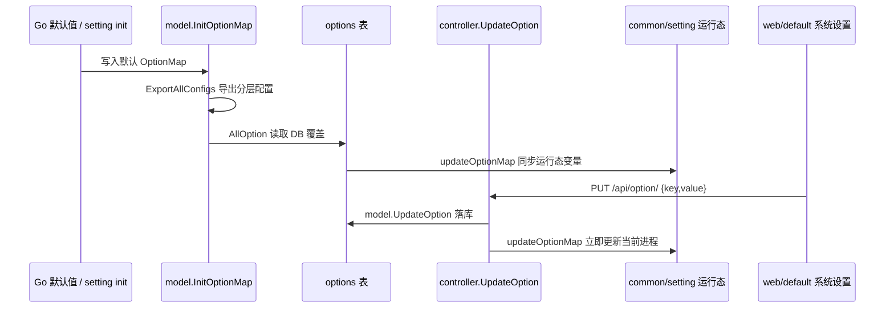

# 配置系统与系统设置学习指南

这篇文档专门讲 new-api 的配置系统：一个配置项如何有默认值、如何进入 `options` 表、如何热更新到 Go 运行态、如何被前端系统设置页面读取和保存，以及它最终如何影响 relay、计费、渠道、安全、性能和展示。

如果你已经掌握 Go 基本语法，这篇适合用来学习真实项目里的配置工程。它会把 handler、GORM、全局变量、反射、JSON、React Query、表单 dirty tracking、权限和运行时缓存串起来。

## 1. 先建立全局模型

new-api 的配置系统不是单一机制，而是“两套配置形态并存”：

| 形态 | key 例子 | 保存位置 | 运行态位置 | 更新方式 |
| --- | --- | --- | --- | --- |
| 旧式配置 | `ModelRatio`、`StripeApiSecret`、`RetryTimes` | `options` 表 | `common`、`setting`、`operation_setting`、`ratio_setting` 等包级变量 | `model.updateOptionMap` 中的 switch |
| 新式分层配置 | `billing_setting.billing_expr`、`fetch_setting.enable_ssrf_protection`、`theme.frontend` | `options` 表 | `setting/config.GlobalConfig` 注册的结构体 | `handleConfigUpdate` + 反射写结构体字段 |

从使用者角度看，它们都表现为一个字符串 key/value：

```text
key   = "billing_setting.billing_mode"
value = "model:tiered_expr"
```

但从源码角度看，旧式 key 和新式 dotted key 走不同分发路径。

## 2. 一个配置项的旅行

最重要的主线是“一个 key 的旅行”：



这个图解释了几个核心事实：

- `options` 表是系统设置的持久化来源。
- `common.OptionMap` 是运行时展示和兜底缓存。
- 大多数业务代码不会每次查 `options` 表，而是读包级变量或 setting 结构体。
- 当前进程保存配置后立即生效。
- 其他实例依赖 `SyncOptions` 周期同步，属于最终一致。

## 3. 启动链路

启动时，`main.InitResources` 会按顺序初始化资源：

```text
godotenv.Load
  -> common.InitEnv
  -> logger.SetupLogger
  -> ratio_setting.InitRatioSettings
  -> service.InitHttpClient
  -> service.InitTokenEncoders
  -> model.InitDB
  -> authz.Init
  -> model.CheckSetup
  -> model.InitOptionMap
  -> model.GetPricing
  -> model.InitLogDB
  -> common.InitRedisClient
  -> perfmetrics.Init
  -> common.StartSystemMonitor
  -> i18n.Init
  -> oauth.LoadCustomProviders
```

配置系统最关键的是：

- 环境变量先进入 `common.InitEnv`。
- 数据库初始化后才能读 `options` 表。
- `ratio_setting.InitRatioSettings` 会初始化倍率类默认 map。
- `model.InitOptionMap` 才把代码默认配置和 DB 配置合并成运行态配置。

主函数后续还会启动：

```text
go model.SyncOptions(common.SyncFrequency)
go model.SyncChannelCache(common.SyncFrequency)
```

这就是多实例配置同步和渠道缓存同步的周期刷新机制。

## 4. options 表模型

`model.Option` 是非常简单的 key/value 表：

```go
type Option struct {
    Key   string `gorm:"primaryKey"`
    Value string
}
```

它的简单性很重要：

- 所有配置最终都以字符串保存。
- bool、int、float、JSON 都要转换成字符串。
- 新式分层配置也不是多表结构，而是把 key 命名成 `模块.字段`。

这种设计的优点是通用、易迁移、后台设置页面容易统一保存。代价是类型安全要靠代码解析和前后端校验维护。

## 5. InitOptionMap：默认值、分层配置和 DB 覆盖

`model.InitOptionMap` 是配置系统启动时最重要的函数。

它做三件事：

1. 加 `common.OptionMapRWMutex` 写锁，重建 `common.OptionMap`。
2. 把代码默认值写入 `OptionMap`。
3. 导出新式分层配置默认值。
4. 释放锁后调用 `loadOptionsFromDatabase`，用 DB 值覆盖默认值。

伪流程：

```text
InitOptionMap
  -> OptionMap = make(map[string]string)
  -> 写旧式默认 key
  -> config.GlobalConfig.ExportAllConfigs()
  -> 写分层默认 key
  -> loadOptionsFromDatabase()
```

### 5.1 旧式默认值

旧式配置的默认值来自多个包：

- `common`：登录、注册、SMTP、额度、系统名称、Logo、RetryTimes 等。
- `setting` 根包：Stripe、Creem、Waffo、Chats、AutoGroups、敏感词、模型请求限速等。
- `operation_setting`：运营、支付、监控、渠道亲和等。
- `ratio_setting`：模型倍率、分组倍率、缓存倍率、音频/图片倍率等。
- `system_setting`：Worker、主题、OIDC、Passkey、fetch 安全等。

旧式 JSON 配置通常会调用 `Xxx2JSONString()` 写入默认字符串，比如：

- `Chats2JsonString`
- `AutoGroups2JsonString`
- `ModelRatio2JSONString`
- `GroupRatio2JSONString`
- `PayMethods2JsonString`

### 5.2 新式分层默认值

新式配置通过各 setting 包的 `init()` 注册：

```go
config.GlobalConfig.Register("billing_setting", &billingSetting)
```

`InitOptionMap` 会调用 `config.GlobalConfig.ExportAllConfigs()`，把已注册结构体导出为扁平 key：

```text
billing_setting.billing_mode
billing_setting.billing_expr
fetch_setting.enable_ssrf_protection
theme.frontend
```

这意味着新增分层配置时，除了写结构体和注册，还要确保对应包被启动路径 import，否则 `init()` 不会执行，`ExportAllConfigs` 也看不到它。

### 5.3 DB 覆盖

`loadOptionsFromDatabase` 会读取所有 `options` 表行，然后逐个调用 `updateOptionMap`。

这里有一个特殊顺序：`QuotaPerUnit` 先加载，再加载其他 key。原因是部分额度配置支持用金额式小数输入，解析时要依赖当前 `QuotaPerUnit` 转换成内部 quota。

例如：

```text
QuotaPerUnit = 500000
QuotaForNewUser = "0.5"
```

可能会被换算成内部 quota 数值，并写回 `OptionMap` 中的整数形式。

## 6. updateOptionMap：配置分发中心

`updateOptionMap(key, value)` 是最值得精读的函数。

它的第一步永远是：

```text
加 OptionMap 写锁
OptionMap[key] = value
```

然后判断这个 key 是否属于新式分层配置：

```text
handleConfigUpdate(key, value)
```

如果处理成功就返回；否则进入旧式 switch。

## 7. 新式分层配置：setting/config.GlobalConfig

### 7.1 ConfigManager

`setting/config/config.go` 定义了 `ConfigManager`：

```go
type ConfigManager struct {
    configs map[string]interface{}
    mutex   sync.RWMutex
}
```

它提供：

- `Register(name, config)`
- `Get(name)`
- `LoadFromDB(options)`
- `SaveToDB(updateFunc)`
- `ExportAllConfigs()`
- `UpdateConfigFromMap(config, configMap)`

运行时主链路最常用的是：

- `Register`
- `Get`
- `ExportAllConfigs`
- `UpdateConfigFromMap`

`LoadFromDB` 和 `SaveToDB` 看起来像完整配置管理入口，但当前运行时主链路主要还是 `InitOptionMap` + `updateOptionMap` 逐 key 更新。

### 7.2 反射映射规则

分层配置通过反射把结构体字段映射为 key。

字段 key 来源：

```text
json tag 存在 -> 用 json tag
json tag 不存在 -> 用字段名
```

例如：

```go
type BillingSetting struct {
    BillingMode string `json:"billing_mode"`
    BillingExpr string `json:"billing_expr"`
}
```

注册名是 `billing_setting`，最终 key 就是：

```text
billing_setting.billing_mode
billing_setting.billing_expr
```

### 7.3 类型转换规则

导出时：

- string：原样。
- bool：`strconv.FormatBool`。
- int/uint：十进制字符串。
- float：浮点字符串。
- pointer：非 nil 转 JSON，nil 转 `"null"`。
- map/slice/struct：转 JSON 字符串。

更新时：

- string：直接写。
- bool：`strconv.ParseBool`。
- int/uint：先按整数解析，失败时兼容浮点字符串。
- float：按浮点解析。
- pointer：`"null"` 还原 nil，否则 JSON 反序列化到指针。
- map：创建 fresh map 再反序列化，避免旧 key 残留。
- slice/struct：JSON 反序列化。

### 7.4 字段解析失败的边界

`UpdateConfigFromMap` 对很多字段解析失败会 `continue`，不会中断整个更新。这样配置加载比较宽容，但也意味着调用方不一定知道某个字段没更新成功。

所以对重要配置，最好在 controller 层先做校验，而不是完全依赖反射更新。

## 8. handleConfigUpdate 的后处理

`handleConfigUpdate` 的基本流程：

```text
strings.SplitN(key, ".", 2)
  -> configName, configKey
  -> config.GlobalConfig.Get(configName)
  -> config.UpdateConfigFromMap(cfg, map[configKey]value)
  -> 根据 configName 做后处理
```

当前重要后处理包括：

| configName | 后处理 | 原因 |
| --- | --- | --- |
| `performance_setting` | `performance_setting.UpdateAndSync()` | 同步到 `common` 的性能/磁盘缓存变量 |
| `tool_price_setting` | `operation_setting.RebuildToolPriceIndex()` | 工具价格需要重建索引 |
| `billing_setting` | `InvalidatePricingCache()`、`ratio_setting.InvalidateExposedDataCache()` | 计费配置影响定价和公开倍率缓存 |
| `theme` | `system_setting.UpdateAndSyncTheme()` | 同步前端主题到 `common.SetTheme` |

学习重点：如果新增配置只是结构体字段，更新后自然生效；但如果它还有派生缓存、atomic 快照、索引、旧式 common 变量，就必须在这里增加后处理。

## 9. 旧式配置 switch

旧式配置主要在 `updateOptionMap` 的 switch 中手动分发。

常见类型：

| key 类型 | 处理方式 |
| --- | --- |
| `*Permission` | 转 int，写 `common.FileUploadPermission` 等 |
| `*Enabled` | `value == "true"`，写 bool 全局变量 |
| SMTP | 写 `common.SMTP*` |
| OAuth | 写 GitHub/LinuxDO/Telegram/WeChat 相关变量 |
| 支付 | 写 Stripe、Creem、Waffo、Epay 等变量 |
| 额度 | `setQuotaOptionValue`，可能按 `QuotaPerUnit` 换算 |
| 倍率 | 调 `ratio_setting.Update*ByJSONString` |
| 模型请求限流 | 调 `setting.UpdateModelRequestRateLimitGroupByJSONString` |
| 自动禁用/重试状态码 | 调 `operation_setting.*StatusCodesFromString` |
| 敏感词 | 调 `setting.SensitiveWordsFromString` |

旧式 switch 的好处是直观。代价是新增 key 容易漏同步，类型转换规则也分散。

## 10. setting 目录职责地图

| 目录/文件 | 职责 | 配置风格 |
| --- | --- | --- |
| `setting/config` | 分层配置注册、导出、反射更新 | 新式 |
| `setting/ratio_setting` | 模型倍率、分组倍率、缓存倍率、公开倍率缓存 | 旧式 JSON map + 部分 atomic |
| `setting/billing_setting` | 阶梯/表达式计费模式和表达式 | 新式 |
| `setting/operation_setting` | 运营、支付、签到、监控、渠道亲和、工具价格、状态码策略 | 新旧并存 |
| `setting/model_setting` | OpenAI/Claude/Gemini/Qwen/Grok 适配行为 | 新式 |
| `setting/system_setting` | OIDC、Discord、Passkey、Legal、Fetch、Theme、Worker | 新旧并存 |
| `setting/console_setting` | 控制台 API info、公告、FAQ、Uptime Kuma 分组和校验 | 新式 |
| `setting/performance_setting` | 系统性能保护、请求体落盘、磁盘缓存 | 新式 + 同步到 common |
| `setting/perf_metrics_setting` | 模型性能指标桶、flush、保留周期 | 新式 |
| `setting/reasoning` | 模型名 reasoning suffix 解析 | 工具函数，不走 options 注册 |
| `setting/chat.go` | 聊天客户端入口配置 | 旧式 JSON |
| `setting/auto_group.go` | auto group 配置 | 旧式 JSON |
| `setting/rate_limit.go` | 模型请求限流配置 | 旧式 JSON |
| `setting/sensitive.go` | 敏感词配置 | 旧式字符串 |

## 11. 配置如何影响 relay 主链路

relay 主链路大致是：

```text
router.SetRelayRouter
  -> middleware.SystemPerformanceCheck
  -> middleware.TokenAuth
  -> middleware.ModelRequestRateLimit
  -> middleware.Distribute
  -> controller.Relay
  -> helper.ModelPriceHelper
  -> service.PreConsumeBilling
  -> 选择/重试渠道
  -> provider handler
  -> PostTextConsumeQuota / PostAudioConsumeQuota / PostWssConsumeQuota
  -> SettleBilling
  -> consume log + perf metrics
```

配置在这条链上到处生效：

- `performance_setting` 决定系统过载时是否提前拒绝。
- `ModelRequestRateLimit*` 决定模型请求限流。
- `ratio_setting` 决定模型是否可计价和怎么扣费。
- `billing_setting` 决定是否走表达式计费。
- `operation_setting` 决定免费模型预扣、自动重试、自动禁用。
- `channel_affinity_setting` 决定是否使用渠道亲和性。
- `model_setting` 决定 provider 转换细节。
- `fetch_setting` 决定 URL、文件、webhook 等外链访问安全。
- `perf_metrics_setting` 决定请求结束后的模型性能指标如何聚合。

下面分块讲。

## 12. ratio_setting：倍率、价格和公开倍率

`ratio_setting` 是计费最重要的配置包之一。

核心概念：

- `ModelPrice`：固定价格优先。
- `ModelRatio`：模型倍率。
- `CompletionRatio`：输出 token 倍率。
- `CacheRatio`：缓存命中 token 倍率。
- `CreateCacheRatio`：缓存创建 token 倍率。
- `GroupRatio`：用户分组倍率。
- `GroupGroupRatio`：用户组与渠道组之间的倍率。
- `ImageRatio`、`AudioRatio`、`AudioCompletionRatio`：非文本接口倍率。

### 12.1 计价优先级

简化理解：

```text
如果模型有 ModelPrice
  -> 固定价格计费
否则
  -> ModelRatio * CompletionRatio / cache/audio/image ratio
  -> 再叠加 GroupRatio / GroupGroupRatio
```

`relay/helper/price.go` 的 `ModelPriceHelper` 会在请求早期计算价格信息。它会把价格、倍率和 billing snapshot 写入 `RelayInfo`，后续预扣费和结算都依赖它。

### 12.2 RWMap 和 JSON

倍率配置通常是 JSON map，例如：

```json
{
  "gpt-4o": 2.5,
  "gpt-4o-mini": 0.15
}
```

后端会用 `types.RWMap` 保存，读写都加锁。更新时一般调用：

```text
ratio_setting.UpdateModelRatioByJSONString
ratio_setting.UpdateModelPriceByJSONString
ratio_setting.UpdateCacheRatioByJSONString
```

部分更新会触发 `InvalidateExposedDataCache`，让公开倍率缓存失效。

### 12.3 公开倍率缓存

`/api/ratio_config` 是给外部或前端展示的公开倍率配置，但必须开启 `ExposeRatioEnabled`。

公开倍率数据有短 TTL 缓存，大约 30 秒。也就是说后台刚改倍率后：

- relay 计费本进程可立即读到新倍率。
- 公开展示 API 可能受短缓存影响。
- 多实例还要等 `SyncOptions`。

## 13. billing_setting：表达式计费

`billing_setting` 用于动态表达式计费。

典型 key：

```text
billing_setting.billing_mode
billing_setting.billing_expr
```

当 `billing_mode` 指向 `model:tiered_expr` 时，计费不再只是简单倍率，而是用表达式根据模型、usage、请求字段、缓存 token、reasoning token 等变量计算。

### 13.1 预扣和冻结

预扣阶段会读取当前表达式，结合请求 body/header 编译并执行，形成 `BillingSnapshot`。

关键点：snapshot 会冻结本次请求使用的表达式和版本信息。即使请求处理中途管理员修改了计费表达式，当前 in-flight 请求也不会切到新表达式。

### 13.2 结算

结算阶段用 snapshot 和真实 usage 重新计算，得到实际扣费，再和预扣差额结算。

### 13.3 配置更新后处理

`billing_setting` 更新后会：

- 清 pricing cache。
- 清公开倍率缓存。

因为它会影响用户看到的价格和后续请求的计费。

## 14. operation_setting：运营行为总开关

`operation_setting` 覆盖很多运营功能。

### 14.1 general_setting

常见影响：

- `SelfUseModeEnabled`：允许未知倍率模型按默认倍率使用。
- 文档链接、货币展示、自定义汇率等展示配置。
- quota display type 影响前端展示。

旧式 `DisplayInCurrencyEnabled` 还会兼容同步到新式 `general_setting.quota_display_type`。

### 14.2 quota_setting

常见影响：

- 是否对免费模型做预扣。
- 预扣策略。
- quota 相关业务默认值。

这些配置直接影响 `PreConsumeBilling` 和后结算路径。

### 14.3 status code ranges

自动重试、自动禁用渠道会读取状态码范围：

- `AutomaticRetryStatusCodes`
- `AutomaticDisableStatusCodes`

后端会解析类似范围表达式，判断上游错误是否应该重试或禁用渠道。

### 14.4 monitor_setting

监控相关配置会影响：

- 周期渠道测试是否开启。
- 自动优先级扫描是否开启。
- 扫描间隔。
- channel test mode。

这类配置通常不是“保存后立即启动一次”，而是后台循环下一轮读取时生效。

### 14.5 channel_affinity_setting

渠道亲和性配置影响：

- 是否启用亲和性规则。
- key 来源。
- 默认 TTL。
- 最大缓存数量。
- 失败后是否迁移。
- 参数 override template。

注意：部分缓存对象用 `sync.Once` 创建。像容量、默认 TTL 这类参数修改后，已创建的 cache 不一定重建，通常要重启才彻底生效。

### 14.6 tool_price_setting

工具价格配置更新后需要重建索引：

```text
operation_setting.RebuildToolPriceIndex()
```

这是典型的“配置字段本身变了还不够，派生索引也要刷新”。

## 15. model_setting 和 reasoning：provider 转换行为

`setting/model_setting` 影响 provider adapter 的请求转换。

常见配置：

- `global`：全局 pass-through、字段保留、转换策略。
- `claude`：Claude thinking、version、特殊字段。
- `gemini`：Gemini safety、version、thinking adapter。
- `qwen`：Qwen 特定行为。
- `grok`：Grok 特定行为。

`setting/reasoning` 则提供模型名 suffix 解析，比如：

```text
-thinking
-nothinking
-high
```

这些后缀会影响 reasoning/thinking 参数如何进入上游 provider 请求。

学习时可以从 provider handler 反向找：

```text
relay/claude_handler.go
relay/gemini_handler.go
relay/channel/* adaptor
```

看它们如何读 `model_setting.GetClaudeSettings()`、`GetGeminiSettings()`、`GetGlobalSettings()`。

## 16. system_setting：安全、登录和主题

### 16.1 fetch_setting

`fetch_setting` 是外链安全配置，影响：

- URL 文件加载。
- video proxy。
- webhook 外发。
- HTTP client 外链请求。
- SSRF 防护。

典型字段：

- enable ssrf protection
- allow private ip
- domain filter mode
- ip filter mode
- allowed ports
- apply ip filter for domain

这些配置会被 `common.ValidateURLWithFetchSetting` 和 HTTP client 构造逻辑读取。

### 16.2 OIDC / Discord / Passkey

OIDC、Discord、Passkey 配置影响登录和注册扩展：

- 是否启用。
- client id / secret。
- authorization/token/userinfo endpoint。
- Passkey RP ID、origin、user verification。

启用某些登录方式前，`controller.UpdateOption` 会校验必要 client id 或 secret 是否存在。

### 16.3 theme

`theme.frontend` 控制默认前端主题。更新后 `system_setting.UpdateAndSyncTheme()` 会同步到 `common.SetTheme`。

前端 `/api/status` 会读取主题，用来决定用户看到 default 还是 classic。

## 17. performance_setting 与 perf_metrics_setting

### 17.1 performance_setting

`performance_setting` 管理系统保护和请求体资源策略：

- CPU 阈值。
- 内存阈值。
- 磁盘阈值。
- 是否启用请求体磁盘缓存。
- 磁盘缓存阈值和目录。

保存后 `performance_setting.UpdateAndSync()` 会同步到 `common` 包。

它影响两个地方：

- `middleware.SystemPerformanceCheck`：relay 入口过载保护。
- `common.BodyStorage`：大请求体是否落盘。

### 17.2 系统状态采样延迟

系统状态由后台监控 goroutine 周期采样，不是每次请求实时采集。因此阈值修改后，判断逻辑可以很快读新阈值，但 CPU/内存/磁盘状态快照本身有采样周期。

### 17.3 perf_metrics_setting

`perf_metrics_setting` 管理模型性能指标：

- 是否启用。
- bucket 时间粒度。
- flush 间隔。
- 保留天数。

relay 成功或失败后会记录热 bucket，后台 flush 再落库。修改 flush interval 后，要等当前 sleep 结束才体现。

## 18. console_setting：内容配置和 JSON 校验

`console_setting` 用于配置控制台内容：

- API info。
- announcements。
- FAQ。
- Uptime Kuma groups。

这类配置多是 JSON 字符串。后端在 `controller.UpdateOption` 中对相关 key 调 `console_setting.ValidateConsoleSettings`，避免错误 JSON 破坏前端展示。

历史上有旧 key 到新 key 的迁移接口：

```text
POST /api/option/migrate_console_setting
```

它把旧配置迁移到 `console_setting.*` 分层 key，然后重新 `InitOptionMap`。

## 19. API 权限边界

配置 API 主要分三层。

### 19.1 公开运行态配置

`/api/status` 是公开配置视图，普通前端会读它。它不会返回所有系统配置，而是返回展示所需子集，例如：

- system name。
- logo。
- theme。
- OAuth client id。
- 是否启用注册/登录方式。
- docs link。
- quota 展示。
- header/sidebar modules。
- legal agreement 是否存在。

它读的是运行态变量，不直接读 `options` 表。

### 19.2 Root 全量配置

`/api/option/` 由 `middleware.RootAuth()` 保护。

接口：

```text
GET /api/option/
PUT /api/option/
```

`GET` 从 `common.OptionMap` 读取全部非敏感配置，并过滤 key 后缀：

- `Token`
- `Secret`
- `Key`
- `secret`
- `api_key`

它还额外构造 `CompletionRatioMeta`，帮助前端展示补全倍率相关信息。

`PUT` 接收：

```json
{
  "key": "theme.frontend",
  "value": "default"
}
```

然后统一转字符串、做 key 级校验、调用 `model.UpdateOption`。

### 19.3 专用配置/维护 API

还有一些专用接口：

- `/api/ratio_config`：公开倍率配置，受 `ExposeRatioEnabled` 控制。
- `/api/performance/*`：Root 性能统计、GC、清磁盘缓存、日志文件维护。
- `/api/option/payment_compliance`：支付合规确认。
- `/api/option/rest_model_ratio`：重置模型倍率。
- `/api/option/refresh_pricing_cache`：刷新 pricing cache。
- `/api/option/cleanup_model_access`：清理模型访问配置。
- `/api/option/channel_affinity_cache`：渠道亲和缓存管理。

配置管理本身基本是 Root only。Admin 可以管理用户、渠道、日志、模型元数据等，但系统设置属于 Root 权限。

## 20. UpdateOption 的校验

`controller.UpdateOption` 做了几类校验。

### 20.1 value 统一转字符串

请求 body 里的 `value` 是 `any`，后端会把 bool、float、int 和其他类型转成字符串。

这有一个重要坑：复杂 JSON 配置应传 JSON 字符串，不要传 object。否则可能被 `fmt.Sprintf` 转成 Go 风格字符串，比如 `map[a:b]`，不是合法 JSON。

### 20.2 依赖校验

启用某些功能前会检查依赖：

- GitHub OAuth 需要 client id/secret。
- Discord/OIDC 需要 client id。
- LinuxDO 需要 client id。
- WeChat 需要 server address。
- Turnstile 需要 site key。
- Telegram 需要 bot token。
- Email domain restriction 需要 whitelist。

### 20.3 格式校验

部分 key 会先校验格式：

- `GroupRatio`
- `ImageRatio`
- `AudioRatio`
- `AudioCompletionRatio`
- `CreateCacheRatio`
- `ModelRequestRateLimitGroup`
- `AutomaticDisableStatusCodes`
- `AutomaticRetryStatusCodes`
- `console_setting.*`

### 20.4 合规保护

支付合规确认字段不能通过通用设置接口直接改。邀请奖励等正数额度也可能要求先完成支付合规确认。

这是配置系统里的业务保护：不是所有 key 都应该被通用接口无条件写入。

## 21. 前端系统设置页面

默认前端的系统设置在：

```text
web/default/src/features/system-settings
```

路由在：

```text
web/default/src/routes/_authenticated/system-settings
```

前端路由要求 `ROLE.SUPER_ADMIN`，对应后端 Root。

### 21.1 请求层

统一 API：

```ts
getSystemOptions()     -> GET /api/option/
updateSystemOption()   -> PUT /api/option/
```

保存成功后 `useUpdateOption` 会：

- invalidate `['system-options']`。
- 对影响展示/status 的 key，额外 invalidate `['status']`。
- 移除 localStorage 中的 status 缓存。
- toast 提示保存成功。

### 21.2 读取和类型恢复

后端返回的是字符串列表：

```ts
Array<{ key: string; value: string }>
```

前端 `getOptionValue(options, defaults)` 会根据默认值类型恢复：

- 默认值是 boolean：`"true"` 或 `"1"` 变 true。
- 默认值是 number：`Number(value)`。
- 默认值是 array：`JSON.parse(value)` 并检查数组。
- 其他：字符串。

这个模式的好处是每个页面只要定义默认 settings，就能把字符串配置恢复成表单需要的类型。

### 21.3 表单保存

前端主模式：

```text
React Hook Form
  -> Zod schema
  -> useSettingsForm
  -> dirty fields
  -> flatten dotted key
  -> useUpdateOption 逐 key 保存
```

`useSettingsForm` 会把 dotted key 展开为嵌套对象，提交时再 flatten 回 `a.b.c`。

只提交 dirty 且与 baseline 不同的字段，避免无意义写入。

### 21.4 页面分区

主要分区：

| 前端分区 | 覆盖内容 |
| --- | --- |
| Site | 系统信息、公告、Header 导航、Sidebar 模块 |
| Operations | 行为、监控、SMTP、Worker、日志、性能 |
| Models | 全局模型配置、路由可靠性、Gemini/Claude/Grok、亲和、部署 |
| Billing | 额度、货币展示、模型计费、分组计费、支付、签到 |
| Auth/Security | 基础认证、OAuth、Passkey、Turnstile、SSRF、敏感词、限流 |
| Content | API info、聊天设置、FAQ、Uptime Kuma 内容 |

### 21.5 JSON 编辑器

复杂配置通常用 JSON 编辑器或 visual editor：

- `JsonCodeEditor`：代码编辑、行号、格式化、即时 JSON 状态。
- `JsonEditor`：对象型 JSON 的 visual/table 与 raw JSON 双模式。
- 模型倍率工具会保存前格式化、校验、压缩 JSON。

后端仍然会对关键 JSON 做校验，前端校验主要提升体验，不能替代后端保护。

### 21.6 i18n

系统设置 UI 文案使用 `i18next` 和 `react-i18next`：

- locale：en、zh、fr、ru、ja、vi。
- flat JSON。
- 组件里 `useTranslation()`。
- 动态 key 补在 `static-keys.ts`。

新增系统设置 UI 时，用户可见文案要走 `t('English key')` 并补全 locale。

## 22. 配置实时性分类

| 类型 | 例子 | 生效方式 |
| --- | --- | --- |
| 当前进程下一请求生效 | `ModelRatio`、`billing_setting.*`、`fetch_setting.*`、OAuth/passkey/theme、大多数限流参数 | `UpdateOption` 后立即更新内存 |
| 多实例最终一致 | 几乎所有 options 配置 | 其他实例等 `SyncOptions` |
| 有短缓存 | `/api/ratio_config` 公开倍率 | 公开倍率缓存约 30 秒 |
| 周期任务下一轮生效 | 自动渠道测试、自动优先级扫描、perf metrics flush | 后台循环下一次读取 |
| 采样延迟 | 系统 CPU/内存/磁盘状态 | system monitor 周期采样 |
| 近似需重启 | 启动环境变量、部分 `sync.Once` cache 容量/TTL、pprof 开关 | 启动时读取或对象已创建 |

学习时要分清：

- “配置变量已更新”不等于“所有派生对象都重建”。
- “当前实例已更新”不等于“所有实例都更新”。
- “前端查询已刷新”不等于“公开缓存已失效”。

## 23. 环境变量和 options 的边界

`common.InitEnv` 读取大量环境变量：

- `DEBUG`
- `SYNC_FREQUENCY`
- `BATCH_UPDATE_INTERVAL`
- `RELAY_TIMEOUT`
- `GLOBAL_API_RATE_LIMIT`
- `STREAMING_TIMEOUT`
- `MAX_REQUEST_BODY_MB`
- `UPDATE_TASK`
- `ENABLE_PPROF`
- 数据库、Redis、日志、session/crypto secret 等。

这些不是都能通过后台系统设置修改。

一般规律：

- 部署/启动级行为：环境变量。
- 管理员运营策略：options 表。
- 请求级临时状态：Gin context。
- provider/channel 个性化：channel 表的 setting/other_settings。

新增配置前要先判断它应该属于哪一层。

## 24. 新增配置项的正确路线

### 24.1 优先判断风格

如果是新模块配置，优先使用新式分层配置：

```text
setting/sample_setting/config.go
  -> 定义结构体和默认值
  -> init 注册 config.GlobalConfig.Register("sample_setting", &sampleSetting)
  -> 提供 GetXxxSetting()
  -> 如果有派生状态，在 handleConfigUpdate 加后处理
  -> 前端使用 key "sample_setting.field_name"
```

如果是历史配置或已有旧式 key 的扩展，则按现有模式接入 `InitOptionMap` 和 `updateOptionMap` switch。

### 24.2 后端 checklist

新增配置前检查：

1. 默认值在哪里？
2. key 是否稳定？
3. 是否需要保存到 `options`？
4. 是否要出现在 `/api/option/`？
5. 是否敏感，需要被 `GetOptions` 过滤？
6. 是否影响派生缓存、索引、atomic 快照？
7. 是否多实例最终一致可以接受？
8. 是否需要 controller 层校验？
9. 是否要影响 `/api/status` 公开视图？
10. 是否要补测试？

### 24.3 前端 checklist

新增系统设置 UI 前检查：

1. 路由是否属于已有 section？
2. 默认 settings 类型是否准确？
3. 字符串/数字/bool/数组如何从 option value 恢复？
4. 表单 schema 是否校验格式？
5. 保存时是否传 JSON 字符串，而不是 object？
6. 保存后是否需要刷新 status？
7. 用户可见文案是否走 i18n？
8. 敏感值是否不应从后端 GET 回显？

## 25. 常见坑

### 25.1 删除 options 行不会自动恢复默认值

`SyncOptions` 是读取 DB 中存在的行并覆盖当前内存。它不会先重建默认 `OptionMap`。如果直接删除 DB 行，当前进程不一定自动恢复默认值，通常需要重启或重新 `InitOptionMap`。

### 25.2 新式配置包必须被 import

分层配置依赖 `init()` 注册。Go 只有被 import 的包才会执行 init。新增 setting 子包后，如果启动路径没有 import，它不会进入 `GlobalConfig`。

### 25.3 复杂 JSON 要传字符串

通用 `PUT /api/option/` 的 `value` 会被转成字符串。复杂配置请传合法 JSON 字符串。传 object 可能得到不可解析的 Go 字符串。

### 25.4 旧式 bool 和新式 bool 解析规则不同

旧式很多地方用：

```go
value == "true"
```

新式反射用：

```go
strconv.ParseBool(value)
```

后者更宽容，前者大小写不宽容。

### 25.5 字段解析失败可能静默跳过

`UpdateConfigFromMap` 对部分字段解析失败会跳过字段，不一定返回错误。重要配置要在 controller 或 service 层提前校验。

### 25.6 敏感 key 过滤靠后缀

`GetOptions` 过滤敏感配置主要靠 key 后缀匹配 `Token/Secret/Key/api_key` 等。新增敏感 key 时，要让命名能被过滤，或补充过滤逻辑。

### 25.7 当前进程实时不等于多实例实时

`UpdateOption` 只立即更新当前进程。其他实例等 `SyncOptions`。如果某配置影响强一致业务，要评估同步窗口。

### 25.8 派生对象不会自动重建

配置结构体字段变了，不代表所有缓存、索引、`sync.Once` 单例都重建。需要显式后处理。

### 25.9 `model.UpdateOption` 和 `UpdateOptionsBulk` 错误处理不同

`UpdateOptionsBulk` 用事务处理多项更新。单项 `UpdateOption` 的历史实现更直接，读代码时要注意 DB 操作错误是否被完整检查。

## 26. 读源码路线

### 第一轮：后端主链路

1. `main.go` 的 `InitResources`。
2. `common/init.go` 的 `InitEnv`。
3. `model/option.go` 的 `InitOptionMap`。
4. `model/option.go` 的 `loadOptionsFromDatabase`。
5. `model/option.go` 的 `updateOptionMap`。
6. `setting/config/config.go` 的 `ConfigManager`。

目标：能讲清默认值、DB 覆盖、运行态变量三者关系。

### 第二轮：API 和权限

1. `router/api-router.go` 的 `/api/option` 路由。
2. `middleware/auth.go` 的 `RootAuth`。
3. `controller/option.go` 的 `GetOptions`。
4. `controller/option.go` 的 `UpdateOption`。
5. `controller/misc.go` 的 `GetStatus`。

目标：能讲清 Root 全量配置和公开 status 视图的区别。

### 第三轮：业务消费

1. `relay/helper/price.go`。
2. `service/tiered_settle.go`。
3. `middleware/performance.go`。
4. `common/body_storage.go`。
5. `service/channel_affinity.go`。
6. `common/ssrf_protection.go`。

目标：能讲清配置如何改变 relay 行为。

### 第四轮：前端联动

1. `web/default/src/features/system-settings/api.ts`。
2. `hooks/use-system-options.ts`。
3. `hooks/use-update-option.ts`。
4. `hooks/use-settings-form.ts`。
5. 各 section registry。
6. JSON editor 和模型倍率编辑器。

目标：能讲清字符串配置如何变成表单字段，又如何保存回后端。

## 27. 配置系统学习练习

### 练习一：追踪 `theme.frontend`

尝试画出：

```text
setting/system_setting/theme.go
  -> config.GlobalConfig.Register("theme", &themeSettings)
  -> InitOptionMap ExportAllConfigs
  -> GET /api/option/
  -> 前端系统设置页面
  -> PUT /api/option/
  -> handleConfigUpdate
  -> system_setting.UpdateAndSyncTheme
  -> /api/status
```

这个练习能把新式分层配置完整串起来。

### 练习二：追踪 `ModelRatio`

尝试画出：

```text
ratio_setting.InitRatioSettings
  -> ModelRatio2JSONString
  -> InitOptionMap
  -> UpdateOption 校验/保存
  -> ratio_setting.UpdateModelRatioByJSONString
  -> helper.ModelPriceHelper
  -> PreConsumeBilling / SettleBilling
```

这个练习能理解旧式 JSON map 配置如何影响计费。

### 练习三：追踪 `fetch_setting.enable_ssrf_protection`

尝试画出：

```text
system_setting/fetch_setting.go
  -> config.Register
  -> UpdateConfigFromMap
  -> common.ValidateURLWithFetchSetting
  -> FileSource / webhook / video proxy / HTTP client
```

这个练习能理解安全配置如何从后台设置进入请求防护。

### 练习四：追踪前端 dirty save

从任意系统设置页面开始，观察：

```text
defaultSettings
  -> useSystemOptions
  -> getOptionValue
  -> useSettingsForm
  -> dirty fields
  -> useUpdateOption
  -> invalidate system-options/status
```

这个练习能把 React 表单和 Go 配置 API 连起来。

## 28. 总结

new-api 的配置系统有四个关键词：

- **字符串持久化**：`options` 表把所有配置存成 key/value 字符串。
- **运行态分发**：`updateOptionMap` 把字符串同步到 Go 全局变量、setting 结构体和派生缓存。
- **分层演进**：旧式 switch 和新式 `config.GlobalConfig` 并存，新配置更适合 dotted key。
- **受控暴露**：Root 读写 `/api/option/`，普通前端读 `/api/status`、`/api/pricing`、`/api/ratio_config` 等受控视图。

读懂这个系统后，你会更容易理解为什么很多业务代码没有显式查配置表，却能立刻响应后台设置；也会知道为什么有些配置多实例会延迟、有些缓存需要手动失效、有些启动环境变量不能靠后台页面修改。
