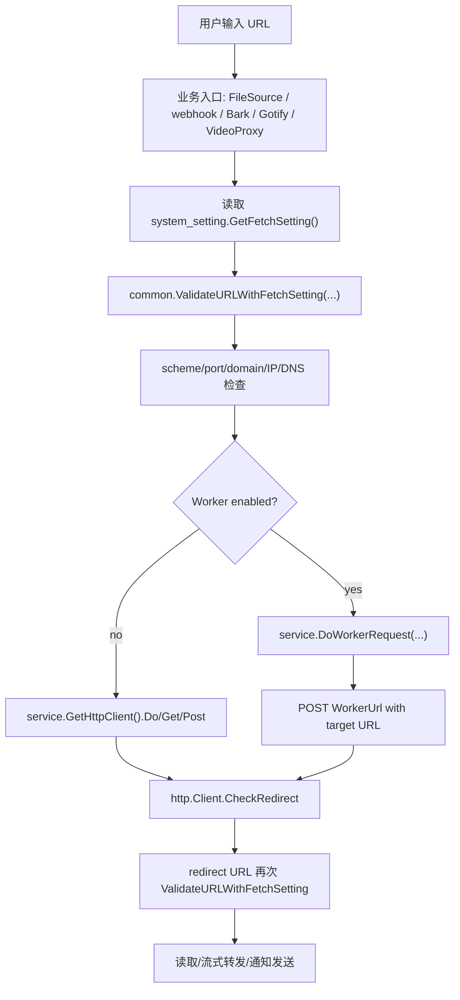
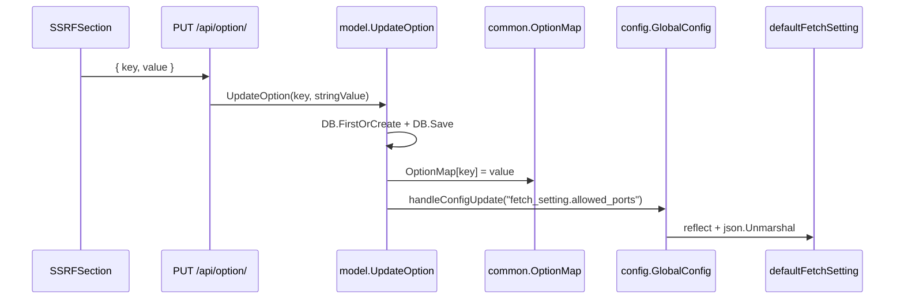
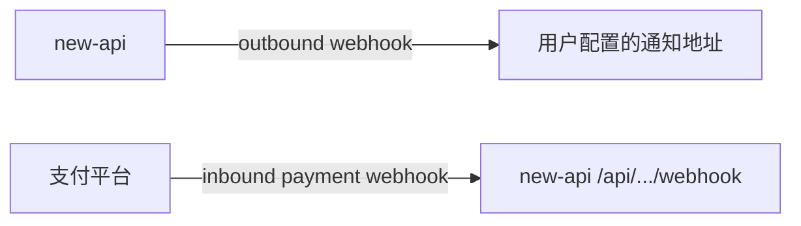

# SSRF、外链抓取、Webhook 与文件资源安全学习指南

这篇文档专门梳理 new-api 里所有“服务端主动访问外部地址”的重要链路。

如果你已经读过 `file-resource-body-guide-for-go-learners.md`、`logging-notification-audit-guide-for-go-learners.md` 和 `rate-limiting-request-governance-guide-for-go-learners.md`，这篇就是把其中散落的 SSRF、文件 URL、Webhook 外发、Worker 代理、视频结果代理再集中串一次。

阅读目标：

- 分清哪些 URL 是用户可控的，哪些 URL 是 Root 管理员配置的信任边界。
- 读懂 `fetch_setting` 如何驱动 SSRF 防护。
- 读懂 URL 校验、DNS/IP 过滤、端口过滤、HTTP redirect 校验如何协作。
- 读懂多模态文件 URL 如何变成 `FileSource`，什么时候才真正下载。
- 读懂 outbound webhook、Bark、Gotify 通知为什么也要走 SSRF 防护。
- 分清 outbound webhook 和 inbound payment webhook 是完全相反的方向。
- 理解 Worker 代理改变了哪里出网，但没有取消主进程的目标 URL 校验。
- 从 Go 语言角度学习 `net/url`、`net.IP`、`http.Client.CheckRedirect`、`io.LimitReader`、接口抽象、HMAC 签名和请求级缓存。

## 1. 先建立安全地图

new-api 是 API 网关。它既会接收用户请求，也会代表用户、管理员或后台任务主动访问外部地址。

这些外部访问大致分六类：

1. 用户请求里的文件、图片、音频、视频 URL。
2. 用户通知里的 webhook、Bark、Gotify URL。
3. 异步任务完成后，上游返回的视频或图片结果 URL。
4. Midjourney 图片转发、视频内容代理这类“结果代理”。
5. Worker 代理模式下，主进程把目标 URL 包装后交给 Worker 出网。
6. 管理员配置的 provider base URL、渠道 proxy、支付网关、OAuth endpoint 等。

它们看起来都是 HTTP 请求，但信任边界完全不同。

用户可控 URL 必须按 SSRF 处理。比如用户发一个 `image_url`，服务端为了算图片 token 或转给不支持 URL 的上游 provider，会主动下载图片。如果这里不做限制，用户就可能让服务端访问内网地址、云元数据地址、本机服务或特殊保留网段。

管理员配置 URL 不等于无风险，但它的风险模型不同。比如渠道 `base_url`、渠道 `proxy`、Worker URL 是 Root/Admin 配置，不是普通请求参数。文档里会把它们列为“管理员信任边界”，不要和用户可控外链混在一起。

## 2. 总览流程

下面是用户文件 URL 和 outbound webhook 最核心的防护路径：



这条图有两个重点：

- 初始 URL 会校验。
- HTTP 跳转后的 URL 也会校验。

如果只校验初始 URL，攻击者可以让一个公开域名 302 到内网地址。new-api 通过 `http.Client.CheckRedirect` 把 redirect URL 再次送回 SSRF 校验。

## 3. 配置入口: fetch_setting

后端配置结构在 `setting/system_setting/fetch_setting.go`：

```go
type FetchSetting struct {
    EnableSSRFProtection   bool     `json:"enable_ssrf_protection"`
    AllowPrivateIp         bool     `json:"allow_private_ip"`
    DomainFilterMode       bool     `json:"domain_filter_mode"`
    IpFilterMode           bool     `json:"ip_filter_mode"`
    DomainList             []string `json:"domain_list"`
    IpList                 []string `json:"ip_list"`
    AllowedPorts           []string `json:"allowed_ports"`
    ApplyIPFilterForDomain bool     `json:"apply_ip_filter_for_domain"`
}
```

默认值也在同一个文件：

- `EnableSSRFProtection: true`
- `AllowPrivateIp: false`
- `DomainFilterMode: false`
- `IpFilterMode: false`
- `DomainList: []string{}`
- `IpList: []string{}`
- `AllowedPorts: []string{"80", "443", "8080", "8443"}`
- `ApplyIPFilterForDomain: true`

几个字段要按运行含义理解：

`EnableSSRFProtection`

关闭时，`ValidateURLWithFetchSetting` 直接放行。关闭这个开关相当于让用户可控 URL 失去主要防护。

`AllowPrivateIp`

是否允许访问私有、回环、链路本地、保留、文档、组播等特殊 IP。默认 false。

`DomainFilterMode`

`true` 是白名单模式，只有 `DomainList` 命中的域名允许访问。`false` 是黑名单模式，`DomainList` 命中的域名禁止访问。

`IpFilterMode`

`true` 是 IP 白名单模式，只有 `IpList` 命中的 IP/CIDR 允许访问。`false` 是 IP 黑名单模式，`IpList` 命中的 IP/CIDR 禁止访问。

`DomainList`

支持精确域名和 `*.example.com` 这类通配符。代码在 `common/ssrf_protection.go` 的 `isDomainListed`。

`IpList`

支持 CIDR 或单 IP，底层通过 `IsIpInCIDRList` 判断。

`AllowedPorts`

后端类型是 `[]string`，支持：

- `"80"`
- `"443"`
- `"8080"`
- `"8000-9000"`

空列表表示不限制端口。

`ApplyIPFilterForDomain`

当 URL host 是域名时，是否先解析域名再对解析出的 IP 做 IP 过滤。默认 true。它可以拦截 `public.example.com -> 127.0.0.1` 这类解析结果。

## 4. 配置注册和运行时更新

`fetch_setting` 不是旧式散落全局变量，而是注册到统一配置管理器：

```go
func init() {
    config.GlobalConfig.Register("fetch_setting", &defaultFetchSetting)
}

func GetFetchSetting() *FetchSetting {
    return &defaultFetchSetting
}
```

这意味着数据库里的 option key 是点号形式：

- `fetch_setting.enable_ssrf_protection`
- `fetch_setting.allow_private_ip`
- `fetch_setting.domain_filter_mode`
- `fetch_setting.ip_filter_mode`
- `fetch_setting.domain_list`
- `fetch_setting.ip_list`
- `fetch_setting.allowed_ports`
- `fetch_setting.apply_ip_filter_for_domain`

保存入口是后台系统设置：

- 前端 `web/default/src/features/system-settings/request-limits/ssrf-section.tsx`
- 后端 `controller/option.go` 的 `UpdateOption`
- 持久化 `model/option.go` 的 `UpdateOption`
- 运行时更新 `model/option.go` 的 `updateOptionMap`
- 分层配置反射更新 `model/option.go` 的 `handleConfigUpdate`
- 反射工具 `setting/config/config.go`

保存流程：



这里有一个重要 caveat：`model.UpdateOption` 是单 key 保存。前端表单多个字段会逐个 `mutateAsync`，没有事务包起来。中间某个字段失败时，会出现部分字段已经保存、部分字段还没保存。

另一个 caveat 更隐蔽：`updateOptionMap` 先写 `common.OptionMap[key] = value`，再反射更新运行时 struct。如果反序列化失败，`OptionMap` 和 DB 已经是新值，但运行时 `defaultFetchSetting` 可能仍保留旧值。

## 5. 前端 SSRF 设置页

前端组件是 `web/default/src/features/system-settings/request-limits/ssrf-section.tsx` 的 `SSRFSection`。

UI 字段：

- `Enable SSRF Protection`
- `Allow Private IPs`
- `Domain Filter Mode`
- `Domain Whitelist/Blacklist`
- `IP Filter Mode`
- `IP Whitelist/Blacklist`
- `Allowed Ports`
- `Apply IP Filter to Resolved Domains`

保存格式：

- `domain_list`：多行文本，一行一个域名，保存为 JSON 字符串数组。
- `ip_list`：多行文本，一行一个 IP/CIDR，保存为 JSON 字符串数组。
- `allowed_ports`：逗号分隔文本，前端 `parsePorts()` 处理后保存。

`parsePorts()` 当前逻辑是：

```ts
const parsePorts = (value: string) =>
  value
    .split(',')
    .map((item) => Number.parseInt(item.trim(), 10))
    .filter((port) => Number.isFinite(port))
```

这里要非常注意：前端类型和后端类型不一致。

前端 `SecuritySettings` 里声明：

```ts
'fetch_setting.allowed_ports': number[]
```

后端 `FetchSetting` 里声明：

```go
AllowedPorts []string `json:"allowed_ports"`
```

后端运行时支持 `"8000-9000"`，但前端 `Number.parseInt("8000-9000", 10)` 会得到 `8000`，范围语义丢失。

更关键的是，前端保存 `[80,443]` 这样的 JSON 数字数组后，后端反射更新 `[]string` 时 `json.Unmarshal` 会失败。由于 `setting/config/config.go` 对 slice 字段反序列化失败是 `continue`，运行时配置字段会保持旧值；但 DB 和 `OptionMap` 已经写入了新字符串。

这个错位是理解 SSRF 配置时最重要的坑之一。

## 6. URL 校验入口

核心函数在 `common/ssrf_protection.go`：

```go
func ValidateURLWithFetchSetting(
    urlStr string,
    enableSSRFProtection bool,
    allowPrivateIp bool,
    domainFilterMode bool,
    ipFilterMode bool,
    domainList []string,
    ipList []string,
    allowedPorts []string,
    applyIPFilterForDomain bool,
) error
```

第一步，如果 `enableSSRFProtection` 是 false，直接返回 nil。

第二步，调用 `parsePortRanges(allowedPorts)` 把字符串端口配置转为整数端口集合。

第三步，构造 `SSRFProtection` 并调用 `ValidateURL(urlStr)`。

`SSRFProtection.ValidateURL` 的主要步骤：

1. `url.Parse(urlStr)` 解析 URL。
2. 只允许 `http` 和 `https`。
3. 从 URL host 里拆出 host 和 port。
4. 没有端口时，根据 scheme 补默认端口：`https -> 443`，`http -> 80`。
5. 检查端口是否在 `AllowedPorts`。
6. 如果 host 是 IP literal，直接做 IP 访问判断。
7. 如果 host 是域名，先做域名白/黑名单判断。
8. 如果 `ApplyIPFilterForDomain` 为 false，域名通过后直接放行。
9. 如果 `ApplyIPFilterForDomain` 为 true，调用 `net.LookupIP(host)`，对所有解析 IP 做 IP 访问判断。

这套函数是项目里用户可控外链的主安全闸门。

## 7. IP 私有/保留网段判断

`common/ssrf_protection.go` 的 `isPrivateIP` 不只检查 RFC1918 私有网段，还覆盖了很多特殊用途地址。

IPv4 包括：

- `0.0.0.0/8`
- `10.0.0.0/8`
- `100.64.0.0/10`
- `127.0.0.0/8`
- `169.254.0.0/16`
- `172.16.0.0/12`
- `192.0.0.0/24`
- `192.0.2.0/24`
- `192.168.0.0/16`
- `198.18.0.0/15`
- `198.51.100.0/24`
- `203.0.113.0/24`
- `224.0.0.0/4`
- `240.0.0.0/4`
- `255.255.255.255/32`

IPv6 包括：

- `::/128`
- `::1/128`
- `::ffff:0:0/96`
- `64:ff9b::/96`
- `100::/64`
- `2001::/23`
- `2001:db8::/32`
- `fc00::/7`
- `fe80::/10`
- `ff00::/8`

此外还调用 Go 标准库的：

- `ip.IsUnspecified()`
- `ip.IsLoopback()`
- `ip.IsLinkLocalUnicast()`
- `ip.IsLinkLocalMulticast()`
- `ip.IsInterfaceLocalMulticast()`
- `ip.IsPrivate()`

所以默认情况下，`127.0.0.1`、`localhost` 解析出的回环地址、内网地址、链路本地、云元数据常见网段附近的特殊地址都会被挡住。

## 8. 域名过滤

域名过滤逻辑在 `isDomainListed`：

- 先把域名和列表项都转小写。
- 空项跳过。
- 支持精确匹配：`example.com`。
- 支持通配符：`*.example.com`。
- 通配符既匹配 `a.example.com`，也匹配根域 `example.com`。

注意：域名过滤和 IP 过滤是两层。

如果 `DomainFilterMode=false` 且 `DomainList=[]`，域名层默认放行。

但默认 `ApplyIPFilterForDomain=true`，域名放行后还会解析 IP，再进入私网/IP 黑白名单判断。

## 9. 端口过滤

端口解析函数是 `parsePortRanges`。

支持单端口：

```text
80
443
8443
```

支持范围：

```text
8000-9000
```

范围会展开成所有整数端口。比如 `8000-8002` 会变成 `8000, 8001, 8002`。

端口必须在 `1-65535`。

如果 `AllowedPorts` 为空，`isAllowedPort` 返回 true，表示允许所有端口。

默认只允许 `80`、`443`、`8080`、`8443`。这意味着即使目标域名是公开地址，`http://example.com:9000/file.png` 默认也会被挡。

## 10. HTTP client 与 redirect 防护

HTTP client 在 `service/http_client.go`。

全局初始化函数：

```go
func InitHttpClient() {
    transport := &http.Transport{
        MaxIdleConns:        common.RelayMaxIdleConns,
        MaxIdleConnsPerHost: common.RelayMaxIdleConnsPerHost,
        IdleConnTimeout:     time.Duration(common.RelayIdleConnTimeout) * time.Second,
        ForceAttemptHTTP2:   true,
        Proxy:               http.ProxyFromEnvironment,
    }
    httpClient = &http.Client{
        Transport:     transport,
        Timeout:       time.Duration(common.RelayTimeout) * time.Second,
        CheckRedirect: checkRedirect,
    }
}
```

关键是 `CheckRedirect`：

```go
func checkRedirect(req *http.Request, via []*http.Request) error {
    fetchSetting := system_setting.GetFetchSetting()
    urlStr := req.URL.String()
    if err := common.ValidateURLWithFetchSetting(urlStr, ...); err != nil {
        return fmt.Errorf("redirect to %s blocked: %v", urlStr, err)
    }
    if len(via) >= 10 {
        return fmt.Errorf("stopped after 10 redirects")
    }
    return nil
}
```

所以：

- 初始 URL 在业务入口主动校验。
- redirect URL 由 HTTP client 自动校验。
- 最多 10 次跳转。

代理 client 也挂同一个 `checkRedirect`。

`NewProxyHttpClient` 支持：

- `http`
- `https`
- `socks5`
- `socks5h`

代理 client 会按 proxy URL 缓存到 `proxyClients` map，用 `proxyClientLock` 保护。

重要 caveat：

SSRF 校验时 `net.LookupIP(host)` 解析一次，真正拨号时 `net/http` 可能再解析一次。代码没有把校验过的 IP pin 到拨号连接，因此理论上仍存在 DNS rebinding 时间窗口。

代理模式还有额外边界：最终连接由代理发起，主进程只能校验目标 URL 字符串和本机解析结果。

## 11. URL 校验不是可信重定向域名校验

项目还有一个 `common/url_validator.go`：

```go
func ValidateRedirectURL(rawURL string) error
```

它检查：

- URL 格式。
- scheme 只能是 `http/https`。
- 域名必须在 `constant.TrustedRedirectDomains`。

这是登录、跳转、回调类可信 redirect URL 的校验，不是文件下载/Webhook 这套 SSRF 防护。

不要把 `ValidateRedirectURL` 和 `ValidateURLWithFetchSetting` 混淆。

## 12. 文件下载入口: DoDownloadRequest

文件下载统一入口在 `service/download.go`：

```go
func DoDownloadRequest(originUrl string, reason ...string) (*http.Response, error)
```

非 Worker 模式：

1. 读取 `fetchSetting := system_setting.GetFetchSetting()`。
2. 调 `common.ValidateURLWithFetchSetting(originUrl, ...)`。
3. 记录日志。
4. `GetHttpClient().Get(originUrl)`。

Worker 模式：

1. 构造 `WorkerRequest{URL: originUrl, Key: WorkerValidKey}`。
2. 调 `DoWorkerRequest(req)`。

`DoDownloadRequest` 被多处使用：

- `service/file_service.go` 的 URL 文件加载。
- `service/file_decoder.go` 的旧文件/图片 helper。
- `service/image.go` 的图片下载和图片尺寸解析。
- 某些 provider adapter 在把 URL 图片转 base64 时使用。

因为它是统一入口，很多上层代码不需要重复写 SSRF 校验。

## 13. Worker 代理模式

Worker 相关配置在旧式系统变量：

- `system_setting.WorkerUrl`
- `system_setting.WorkerValidKey`
- `system_setting.WorkerAllowHttpImageRequestEnabled`

前端组件是 `web/default/src/features/system-settings/integrations/worker-settings-section.tsx`。

`WorkerSettingsSection` 字段：

- `WorkerUrl`
- `WorkerValidKey`
- `WorkerAllowHttpImageRequestEnabled`

前端保存行为：

- `WorkerUrl` 会去掉尾部 `/`。
- `WorkerValidKey` 会 `trim()`。
- `WorkerValidKey` 因为后缀是 `Key`，后端 `GET /api/option/` 会过滤，不会回显，密码框默认空。
- `WorkerUrl` 只校验 `http://` 或 `https://` 前缀。

后端执行入口：

```go
func DoWorkerRequest(req *WorkerRequest) (*http.Response, error)
```

逻辑：

1. 如果 Worker 未启用，报错。
2. 如果 `WorkerAllowHttpImageRequestEnabled=false` 且目标 URL 不是 `https` 前缀，报错 `only support https url`。
3. 对 `req.URL` 执行 `ValidateURLWithFetchSetting`。
4. 把 `WorkerRequest` JSON POST 到 `WorkerUrl`。

`WorkerRequest` 结构：

```go
type WorkerRequest struct {
    URL     string            `json:"url"`
    Key     string            `json:"key"`
    Method  string            `json:"method,omitempty"`
    Headers map[string]string `json:"headers,omitempty"`
    Body    json.RawMessage   `json:"body,omitempty"`
}
```

两个容易误读的点：

第一，`WorkerAllowHttpImageRequestEnabled` 名字像“HTTP 图片请求”，但代码在 `DoWorkerRequest`，对所有 Worker 目标请求生效，包括 webhook、Bark、Gotify 等。为 false 时只允许 `https` 目标 URL。

第二，开启 Worker 不代表跳过 SSRF。主进程仍会校验 `req.URL`。只是最终出网发生在 Worker 端。

还有一个边界：`WorkerUrl` 自身是 Root 管理员配置的信任地址。通用保存接口没有对 `WorkerUrl` 做 SSRF 校验，前端也只做 URL 前缀校验。它属于管理员信任边界，而不是普通用户可控外链。

## 14. FileSource 抽象

文件来源抽象在 `types/file_source.go`。

核心接口：

```go
type FileSource interface {
    IsURL() bool
    GetIdentifier() string
    GetRawData() string
    ClearRawData()

    SetCache(data *CachedFileData)
    GetCache() *CachedFileData
    HasCache() bool
    ClearCache()

    IsRegistered() bool
    SetRegistered(registered bool)
    Mu() *sync.Mutex
}
```

两个实现：

- `URLSource`
- `Base64Source`

构造函数：

```go
func NewFileSourceFromData(data string, mimeType string) FileSource {
    if strings.HasPrefix(data, "http://") || strings.HasPrefix(data, "https://") {
        return NewURLFileSource(data)
    }
    return NewBase64FileSource(data, mimeType)
}
```

这段非常直接：只看字符串前缀。以 `http://` 或 `https://` 开头就是 URL，否则就是 base64/data URL。

这也解释了为什么很多 DTO 转换阶段不会立即下载文件。它只是把“来源”保存成一个对象，真正读取时再加载。

## 15. OpenAI DTO 到 FileSource

OpenAI Chat Completions 请求的多模态内容在 `dto/openai_request.go`。

`MediaContent.ToFileSource()` 处理这些类型：

- `image_url.url`
- `input_audio.data`
- `file.file_data`
- `video_url.url`

转换关系：

```go
case ContentTypeImageURL:
    return types.NewFileSourceFromData(img.Url, img.MimeType)
case ContentTypeInputAudio:
    return types.NewFileSourceFromData(audio.Data, mimeType)
case ContentTypeFile:
    return types.NewFileSourceFromData(file.FileData, "")
case ContentTypeVideoUrl:
    return types.NewFileSourceFromData(video.Url, "")
```

Responses API 的文件来源在 `OpenAIResponsesRequest.GetTokenCountMeta()`：

- `input_image.image_url`
- `input_file.file_url`

它们也会变成 `types.NewFileSourceFromData(...)`。

这样设计的好处是：token counter、provider adapter、文件转换都面对同一个 `FileSource` 接口，不需要关心原始请求字段来自 Chat 还是 Responses。

## 16. LoadFileSource 懒加载

统一加载入口在 `service/file_service.go`：

```go
func LoadFileSource(c *gin.Context, source types.FileSource, reason ...string) (*types.CachedFileData, error)
```

流程：

1. `source == nil` 直接报错。
2. 如果 source 内部已有缓存，注册清理后返回。
3. 对 `source.Mu()` 加锁。
4. 双重检查缓存。
5. 根据具体类型加载：
   - `*types.URLSource` -> `loadFromURL`
   - `*types.Base64Source` -> `loadFromBase64`
6. 设置 source 内部缓存。
7. 如果是 URL/base64 请求级缓存命中，写入 Gin context。
8. 注册清理。

URL 请求级缓存 key：

```go
file_cache_ + common.GenerateHMAC(url)
```

Base64 请求级缓存 key：

```go
b64_cache_ + common.GenerateHMAC(length + mime + prefix)
```

这里的缓存层次有两层：

- `FileSource` 对象自己的缓存。
- Gin context 里的同请求缓存。

同一个请求内，如果 token counter 和 provider adapter 都要读取同一个文件 URL，可以避免重复下载。

## 17. URL 文件加载

`loadFromURL` 做真正下载：

1. 计算 `maxFileSize = constant.MaxFileDownloadMB * 1024 * 1024`。
2. 调 `DoDownloadRequest(url, reason...)`。
3. 要求 `resp.StatusCode == 200`。
4. `io.ReadAll(io.LimitReader(resp.Body, maxFileSize+1))`。
5. 如果读取长度超过 max，报错。
6. 把文件字节 base64 编码。
7. `smartDetectMimeType` 推断 MIME。
8. 根据磁盘缓存阈值决定放内存还是写磁盘。
9. 如果是图片，尝试读取图片尺寸和格式。

大小限制来自 `constant.MaxFileDownloadMB`，初始化默认值和环境变量在其他公共配置里维护。已有文档 `common-infrastructure-guide-for-go-learners.md` 和 `file-resource-body-guide-for-go-learners.md` 有更多请求体/磁盘缓存背景。

`io.LimitReader(maxFileSize+1)` 是一个常见 Go 技巧：多读 1 byte，用来判断是否超限。

## 18. Base64/data URL 文件加载

`loadFromBase64` 支持普通 base64，也支持 `data:` 前缀。

流程：

1. 如果以 `data:` 开头，按第一个逗号拆 header 和 payload。
2. 从 header 中提取 MIME。
3. 如果调用方提供了 MIME，以调用方提供值覆盖。
4. `base64.StdEncoding.DecodeString(cleanBase64)`。
5. 按 base64 字符串长度决定内存/磁盘缓存。
6. 如果 MIME 为空或是图片，尝试解析图片配置。

注意：URL 文件下载有 `MaxFileDownloadMB` 限制。Base64 路径主要依赖请求体大小限制和后续缓存策略，具体请求入口还会受到匿名 body limit、BodyStorage、multipart limit 等治理。

## 19. MIME 类型推断

`smartDetectMimeType` 的顺序：

1. `Content-Type` header。
2. `Content-Disposition` 里的 filename 扩展名。
3. URL path 扩展名。
4. `http.DetectContentType`。
5. HEIF/HEIC magic bytes。
6. 图片解码结果。
7. 回退 `application/octet-stream`。

这个顺序体现了项目的实用取向：先尊重上游 header，但 header 不可信或缺失时会尝试从文件名、URL、内容嗅探和图片解码补救。

## 20. 磁盘缓存与清理

`types.CachedFileData` 支持内存和磁盘：

- 小文件：`NewMemoryCachedData`
- 大文件：`NewDiskCachedData`

磁盘缓存文件通过 `common.WriteDiskCacheFileString` 写入，关闭时删除，并通过 `OnClose` 扣减磁盘文件统计。

请求结束清理在 `middleware/body_cleanup.go`：

```go
func BodyStorageCleanup() gin.HandlerFunc {
    return func(c *gin.Context) {
        c.Next()
        common.CleanupBodyStorage(c)
        service.CleanupFileSources(c)
    }
}
```

路由层在 `/api` 和 relay 路由上挂了这个中间件，所以正常请求生命周期结束会清理：

- BodyStorage 请求体复读缓存。
- FileSource 下载/解码后的文件缓存。

一个 caveat：`registerSourceForCleanup` 的 `registered` 标记在 `FileSource` 对象上。如果未来把同一个 `FileSource` 对象跨多个 Gin context 复用，可能只注册到第一次请求。当前常规请求解析路径会为每次请求新建 source，这个风险主要是未来扩展时需要注意。

## 21. token counter 与 provider adapter 何时触发下载

DTO 转 FileSource 不下载。

真正下载通常发生在：

- token counter 需要图片尺寸时。
- provider adapter 需要把 URL 文件转成 base64 时。
- MIME/type 判断需要读取远程文件时。

例如 `service/token_counter.go` 里会对 `TokenCountMeta.Files` 调 `LoadFileSource`，因为图片 token 计算需要尺寸。

某些 provider adapter 不支持远程 URL，就会调用 `service.GetBase64Data` 或旧 helper 把 URL 转 base64。

这就是懒加载设计的关键：只有确实需要文件内容时才出网，并且出网入口统一走 `DoDownloadRequest`。

## 22. outbound webhook 通知

用户通知入口在 `service/user_notify.go`：

```go
func NotifyUser(userId int, userEmail string, userSetting dto.UserSetting, data dto.Notify) error
```

支持通知方式：

- email
- webhook
- bark
- gotify

通知前会先调用 `CheckNotificationLimit(userId, data.Type)` 做通知限流。限流细节见 `rate-limiting-request-governance-guide-for-go-learners.md`。

Webhook 外发实现是 `service/webhook.go` 的 `SendWebhookNotify`。

payload：

```go
type WebhookPayload struct {
    Type      string        `json:"type"`
    Title     string        `json:"title"`
    Content   string        `json:"content"`
    Values    []interface{} `json:"values,omitempty"`
    Timestamp int64         `json:"timestamp"`
}
```

签名：

```go
func generateSignature(secret string, payload []byte) string {
    h := hmac.New(sha256.New, []byte(secret))
    h.Write(payload)
    return hex.EncodeToString(h.Sum(nil))
}
```

非 Worker 模式：

1. 生成 payload JSON。
2. 对 webhook URL 执行 SSRF 校验。
3. `http.NewRequest(POST, webhookURL, body)`。
4. 设置 `Content-Type: application/json`。
5. 如果有 secret，设置 `X-Webhook-Signature`。
6. 用 `GetHttpClient().Do(req)` 发送。
7. 要求响应状态码是 2xx。

Worker 模式：

1. 构造 `WorkerRequest`。
2. Header 里放 `Content-Type: application/json`。
3. 有 secret 时放：
   - `X-Webhook-Signature`
   - `Authorization: Bearer <secret>`
4. 调 `DoWorkerRequest`。

这里有一个行为差异：非 Worker 模式只加 `X-Webhook-Signature`，Worker 模式还额外加 `Authorization: Bearer <secret>`。

## 23. Bark 和 Gotify 外发

Bark 和 Gotify 都在 `service/user_notify.go`。

Bark：

1. 用通知标题/内容替换 `{{title}}`、`{{content}}`。
2. 得到最终 URL。
3. 非 Worker 模式先校验最终 URL。
4. GET 请求外发。

Gotify：

1. `gotifyUrl` 去掉尾部 `/`，拼 `/message?token=...`。
2. 优先级限制在 `0-10`，超出使用 5。
3. 构造 JSON payload。
4. 非 Worker 模式先校验最终 URL。
5. POST 请求外发。

这两个实现有一个共性：校验的是最终 URL，而不是用户输入模板的原始字符串。Bark 模板替换后可能改变 path/query，所以校验最终 URL 才合理。

## 24. 用户通知设置保存

用户通知设置前端在 `web/default/src/features/profile/components/tabs/notification-tab.tsx`。

字段：

- `notify_type`
- `quota_warning_threshold`
- `notification_email`
- `webhook_url`
- `webhook_secret`
- `bark_url`
- `gotify_url`
- `gotify_token`
- `gotify_priority`
- `upstream_model_update_notify_enabled`
- `accept_unset_model_ratio_model`
- `record_ip_log`

保存接口：

- `PUT /api/user/setting`
- 前端 API：`web/default/src/features/profile/api.ts` 的 `updateUserSettings`
- 后端 controller：`controller/user.go` 的 `UpdateUserSetting`
- DTO：`dto/user_settings.go` 的 `UserSetting`
- 持久化：`model/user.go` 的 `UpdateUserSetting`

后端验证：

- `notify_type` 必须是 email/webhook/bark/gotify。
- 阈值必须大于 0。
- webhook 类型要求 `webhook_url` 非空，且 `url.ParseRequestURI` 能解析。
- Bark/Gotify 要求 URL 非空、能解析、以 `http://` 或 `https://` 开头。
- Gotify token 非空。
- Gotify priority 超出 `0-10` 时保存为 5。

注意：保存时只做格式校验，不做 SSRF 校验。真正安全拦截发生在发送通知时。

这是合理的，因为 Root 可能之后调整 `fetch_setting`。保存时通过的 URL，发送时仍要按最新 SSRF 配置判断。

用户设置存储在 `users.setting` JSON 字段，不是 `options` 表。

权限边界：

- `/api/user/setting` 使用登录用户鉴权。
- 普通用户可以配置自己的 webhook URL/secret。
- `upstream_model_update_notify_enabled` 只在用户角色 `>= RoleAdminUser` 时被后端接受，否则保留原值。

另一个隐私边界：

- `/api/option/` 会过滤 `Token`、`Secret`、`Key`、`secret`、`api_key` 这类系统密钥。
- `/api/user/self` 会返回当前用户自己的 `setting` 字符串，包括自己的 `webhook_secret`。

## 25. 异步任务视频结果代理

视频结果代理入口：

- 路由：`router/video-router.go`
- `GET /v1/videos/:task_id/content`
- 中间件：`TokenOrUserAuth()`
- controller：`controller/video_proxy.go` 的 `VideoProxy`

`VideoProxy` 主要流程：

1. 从 path 取 `task_id`。
2. 从 context 取当前用户 id。
3. `model.GetByTaskId(userID, taskID)` 确认任务属于当前用户。
4. 要求任务状态是 `SUCCESS`。
5. 读取任务对应 channel。
6. 根据 channel proxy 构造 HTTP client。
7. 根据 channel type 决定视频 URL：
   - Gemini：`getGeminiVideoURL`
   - Vertex：`getVertexVideoURL`
   - OpenAI/Sora：`{baseURL}/v1/videos/{upstreamTaskID}/content`
   - 其他：`task.GetResultURL()`
8. 如果是 `data:`，直接解码输出。
9. 如果是远程 URL，先执行 `ValidateURLWithFetchSetting`。
10. `client.Do(req)` 拉取。
11. 透传上游响应头。
12. `io.Copy(c.Writer, resp.Body)` 流式转发。

这条链路和 FileService 下载不同：

- 它需要任务归属校验。
- 它可以使用 channel proxy。
- 它是流式转发，不把整个视频读进内存。
- 它没有 `MaxFileDownloadMB` 限制。
- 它适合大视频内容。

这里仍然会做 SSRF 校验，并且使用的 client 也有 redirect 校验。

## 26. Gemini/Vertex 视频 URL 提取

Gemini/Vertex 的视频结果可能不是简单存好的 URL。

`controller/video_proxy_gemini.go` 做了兼容解析：

Gemini：

- 先从 `task.Data` 里找 URL。
- 找不到时通过 task adaptor 重新 fetch task。
- 从响应里解析：
  - `uri`
  - `response.generateVideoResponse.generatedSamples[].video.uri`
  - `response.videos[].uri`
  - `response.video`
  - `response.uri`
- 最终 URL 会通过 `ensureAPIKey` 补 API key。

Vertex：

- 如果 `task.GetResultURL()` 有值且不是代理自身 URL，优先用它。
- 否则从 `task.Data` 解析。
- 解析上游 payload 里的：
  - `response.videos[0].bytesBase64Encoded`
  - `response.bytesBase64Encoded`
  - `response.video`
- 如果拿到的是 base64，构造 `data:video/...;base64,...`。

这解释了为什么 VideoProxy 既要支持远程 URL，也要支持 `data:`。

## 27. Midjourney 图片代理

Midjourney 图片代理在 `relay/mjproxy_handler.go` 的 `RelayMidjourneyImage`。

路由在 `router/relay-router.go`：

- `GET /mj/image/:id`

流程：

1. 根据 `mj id` 找 Midjourney task。
2. 如果 channel 配了 proxy，创建 proxy client。
3. 否则用全局 HTTP client。
4. 对 `midjourneyTask.ImageUrl` 执行 `ValidateURLWithFetchSetting`。
5. `httpClient.Get(imageUrl)`。
6. 透传/设置 `Content-Type`。
7. `io.Copy` 把图片流式写给客户端。

这条链路和视频代理类似，也是“结果代理”，不是请求内 FileSource。

## 28. async task 结果如何保存 URL

后台轮询异步任务时，上游会返回 task result。

新路径在 `service/task_polling.go`：

- 如果成功结果 URL 是 `data:`，不把大 base64 原样暴露为结果 URL，而是构造项目自己的 proxy URL。
- 普通 URL 保存到 `task.PrivateData.ResultURL`。

旧视频路径在 `controller/task_video.go`：

- 成功时，如果 `taskResult.Url` 不是 `data:`，会写入 `task.FailReason`。
- 这是历史兼容字段。

读取时 `model.Task.GetResultURL()` 优先 `PrivateData.ResultURL`，否则回退旧字段。

这个设计避免把大体积 base64 直接塞进响应和日志，同时保留旧数据兼容。

## 29. inbound payment webhook 是另一种东西

outbound webhook 是 new-api 主动调用别人。

inbound payment webhook 是支付平台主动调用 new-api。

它们方向相反：



inbound webhook 不需要 SSRF 校验，因为服务器没有根据用户 URL 出网。它需要的是：

- body 大小限制。
- raw body 读取。
- 签名验证。
- 幂等处理。
- 订单锁定。

路由在 `router/api-router.go`：

- `POST /api/stripe/webhook`
- `POST /api/creem/webhook`
- `POST /api/waffo/webhook`
- `POST /api/waffo-pancake/webhook/:env`

这些路由挂了匿名请求体大小限制 `anonymousRequestBodyLimit`。

## 30. Stripe / Creem / Waffo / Waffo Pancake 对比

Stripe：

- controller：`controller/topup_stripe.go`
- 读取 raw body。
- 读取 `Stripe-Signature`。
- 用 Stripe SDK `ConstructEventWithOptions` 验签。
- 根据事件类型处理充值/订阅。

Creem：

- controller：`controller/topup_creem.go`
- 读取 raw body。
- 读取 `creem-signature`。
- 用本地 HMAC/secret 验证。
- 根据订单信息处理充值/订阅。

Waffo：

- controller：`controller/topup_waffo.go`
- 读取 raw body。
- 读取 `X-SIGNATURE`。
- 用 Waffo SDK `VerifySignature`。
- 成功后按订单号充值。

Waffo Pancake：

- controller：`controller/topup_waffo_pancake.go`
- 路径带 `:env`。
- 读取 `X-Waffo-Signature`。
- 调 `service.VerifyConfiguredWaffoPancakeWebhook`。
- 还会校验路径环境和 event mode 是否匹配。

共同点：

- 先确认 webhook 是否启用。
- 读 raw body。
- 验签失败直接拒绝。
- 成功后按订单号/引用号处理。
- 避免重复充值或重复完成订阅。

它们应该和 outbound webhook 分开学习。

## 31. 哪些出站 HTTP 不属于用户 URL SSRF 链路

搜索代码会看到很多 `http.NewRequest`、`client.Do`、`GetHttpClient`。不要看到 HTTP 就归为 SSRF 防护漏点。

这些通常是管理员信任边界或固定平台 API：

- provider 上游 base URL。
- channel proxy。
- OAuth token endpoint。
- Stripe/Creem/Waffo API。
- io.net 部署 API。
- 上游模型同步 API。
- Uptime Kuma URL。
- 自定义 OAuth provider endpoint。

它们仍然需要谨慎配置，但不是普通用户在一次请求里提供 URL 让服务端抓取。

文档里讨论的主要 SSRF 防护对象是用户可控或上游结果可控的 URL：

- request body 里的 `image_url` / `file_url` / `video_url`。
- 用户 profile 里配置的 webhook/Bark/Gotify。
- 上游 async task 返回的 result URL。
- Midjourney task 保存的 image URL。

## 32. 权限边界

系统 SSRF 配置：

- 前端系统设置页需要 Root/Super Admin 权限。
- 后端 `/api/option/*` 使用 `middleware.RootAuth()`。

Worker 配置：

- 同样是系统设置。
- 影响全局文件下载、Webhook 外发等 Worker 代理路径。

用户通知配置：

- `/api/user/setting` 是登录用户自己的设置。
- 普通用户可写自己的 webhook URL。
- 发送时必须走 SSRF 校验。

视频内容代理：

- `/v1/videos/:task_id/content` 使用 `TokenOrUserAuth()`。
- controller 会按当前用户 id 查询 task。
- 不允许用户直接拿别人的 task id 代理下载。

Midjourney 图片代理：

- 通过 task id 查 Midjourney task。
- 需要结合路由侧鉴权和 Midjourney 业务链路理解。

## 33. Go 学习点: net/url

`url.Parse` 和 `url.ParseRequestURI` 在项目里承担不同角色。

SSRF 防护用 `url.Parse(urlStr)`，因为它需要完整 URL 的 scheme、host、port、hostname。

用户通知保存时用 `url.ParseRequestURI` 做格式校验。这只是保存阶段的基本校验，不代表安全放行。

常见读法：

```go
u, err := url.Parse(urlStr)
if err != nil {
    return err
}
scheme := u.Scheme
host := u.Hostname()
```

如果 URL 包含端口，可以用：

```go
host, portStr, err := net.SplitHostPort(u.Host)
```

new-api 里如果没有端口，会根据 scheme 补默认端口。

## 34. Go 学习点: net.IP 与 CIDR

`net.ParseIP(host)` 可以判断 host 是否是 IP literal。

如果是 IP，直接判断 IP 可访问性。

如果是域名，就先做域名规则，再 `net.LookupIP(host)` 解析出 IP 列表。

CIDR 判断一般是：

```go
_, ipNet, err := net.ParseCIDR("192.168.0.0/16")
ipNet.Contains(ip)
```

项目里封装成 `IsIpInCIDRList`。

## 35. Go 学习点: http.Client.CheckRedirect

`http.Client` 默认会跟随重定向。

如果要拦截跳转，就设置：

```go
client := &http.Client{
    CheckRedirect: func(req *http.Request, via []*http.Request) error {
        return nil
    },
}
```

new-api 在这里重新调用 SSRF 校验。

如果 `CheckRedirect` 返回 error，本次请求停止，调用方会拿到错误。

这是防 SSRF 的关键补丁点。

## 36. Go 学习点: io.LimitReader

下载文件时不能直接 `io.ReadAll(resp.Body)`，否则远程服务器可以返回巨大响应让进程吃内存。

new-api 用：

```go
fileBytes, err := io.ReadAll(io.LimitReader(resp.Body, int64(maxFileSize+1)))
if len(fileBytes) > maxFileSize {
    return nil, fmt.Errorf("file size exceeds maximum allowed size")
}
```

多读 1 byte 是为了准确判断超限。

## 37. Go 学习点: interface + lazy loading

`FileSource` 是一个很适合学习 Go interface 的例子。

上层代码只关心：

- 这个来源是不是 URL。
- 标识符是什么。
- 有没有缓存。
- 如何拿 mutex。

它不关心具体来源是 URL 还是 base64。

真正加载时用 type switch：

```go
switch s := source.(type) {
case *types.URLSource:
    cachedData, err = loadFromURL(c, s.URL, reason...)
case *types.Base64Source:
    cachedData, err = loadFromBase64(s.Base64Data, s.MimeType)
default:
    return nil, fmt.Errorf("unsupported file source type: %T", source)
}
```

这比在每个 provider adapter 里都判断 URL/base64 更集中。

## 38. Go 学习点: HMAC 签名

Webhook 签名是标准 HMAC-SHA256：

```go
h := hmac.New(sha256.New, []byte(secret))
h.Write(payload)
signature := hex.EncodeToString(h.Sum(nil))
```

接收方可以用同样 secret 和 payload 计算签名，然后比较。

注意：签名只证明 payload 是持有 secret 的一方发送的，不等于 URL 安全。URL 是否安全仍由 SSRF 校验负责。

## 39. 常见坑点清单

1. 不要把 `ValidateRedirectURL` 当成 SSRF 校验。
2. 不要只校验初始 URL，redirect URL 也必须校验。
3. DNS 预解析不能完全消除 DNS rebinding，因为没有 IP pinning。
4. `ApplyIPFilterForDomain=false` 会让域名解析 IP 检查失效。
5. `AllowPrivateIp=true` 会放开私网访问，风险很高。
6. `AllowedPorts=[]` 表示允许所有端口，不是拒绝所有端口。
7. 前端 `allowed_ports` 目前是 `number[]`，后端是 `[]string`，会造成范围丢失和运行时更新失败。
8. Worker 开启后目标 URL 仍会校验，但实际出网在 Worker 端。
9. `WorkerAllowHttpImageRequestEnabled` 名字像图片专用，实际上影响所有 Worker 目标 URL。
10. `WorkerUrl` 是管理员信任边界，不是普通用户外链。
11. 用户 webhook 保存时只做格式校验，发送时才做 SSRF 校验。
12. Worker webhook 模式会额外发送 `Authorization: Bearer secret`，非 Worker 不会。
13. FileSource 是懒加载，DTO 解析时不会马上下载。
14. VideoProxy 是流式代理，没有 `MaxFileDownloadMB` 限制。
15. inbound payment webhook 不走 SSRF，它要解决的是验签和幂等。
16. 多字段系统设置逐 key 保存，失败时可能部分生效。
17. `OptionMap/DB` 和运行时 config struct 可能因反序列化失败而不一致。

## 40. 修改代码时的检查清单

如果你新增一个会访问用户提供 URL 的功能，至少检查：

- 是否调用了 `ValidateURLWithFetchSetting`。
- 是否使用带 `CheckRedirect` 的 `service.GetHttpClient()` 或 proxy client。
- 是否限制响应大小，或者明确是流式代理。
- 是否区分 URL、base64、data URL。
- 是否清理临时文件/缓存。
- 是否记录日志时避免泄露敏感 URL query。
- 是否在 Worker 模式下仍校验目标 URL。
- 是否需要 notification limit 或请求限流。

如果你新增一个 webhook 外发类型，至少检查：

- URL 保存时是否做基本格式校验。
- 发送前是否按最新 fetch setting 做 SSRF 校验。
- redirect 是否通过统一 client 校验。
- secret 是否只用于签名，不应泄露到日志。
- Worker 和非 Worker header 行为是否一致或有意不同。

如果你新增一个支付/第三方 inbound webhook，至少检查：

- 路由是否有匿名 body size limit。
- 是否读取 raw body。
- 是否做签名验证。
- 是否做订单幂等。
- 是否避免在日志里输出敏感字段。
- 是否和 outbound webhook 文档概念分开。

## 41. 推荐源码阅读顺序

第一轮，读配置和校验：

1. `setting/system_setting/fetch_setting.go`
2. `common/ssrf_protection.go`
3. `service/http_client.go`

第二轮，读文件 URL：

1. `types/file_source.go`
2. `dto/openai_request.go`
3. `service/file_service.go`
4. `service/download.go`
5. `middleware/body_cleanup.go`

第三轮，读通知外发：

1. `dto/user_settings.go`
2. `controller/user.go` 的 `UpdateUserSetting`
3. `service/user_notify.go`
4. `service/webhook.go`

第四轮，读结果代理：

1. `router/video-router.go`
2. `controller/video_proxy.go`
3. `controller/video_proxy_gemini.go`
4. `relay/mjproxy_handler.go`

第五轮，读入站 webhook 对比：

1. `router/api-router.go` 的 payment webhook routes
2. `controller/topup_stripe.go`
3. `controller/topup_creem.go`
4. `controller/topup_waffo.go`
5. `controller/topup_waffo_pancake.go`

## 42. 一句话总结

new-api 的外链安全主线是：用户可控 URL 不直接出网，而是先经过 `fetch_setting` 驱动的 SSRF 校验；真正出网统一使用带 redirect 再校验的 HTTP client；文件内容通过 `FileSource` 懒加载并请求级缓存；通知外发、视频代理和 Midjourney 图片代理各有业务鉴权和大小/流式差异；支付 webhook 是入站验签问题，不能和 outbound webhook 混为一谈。
