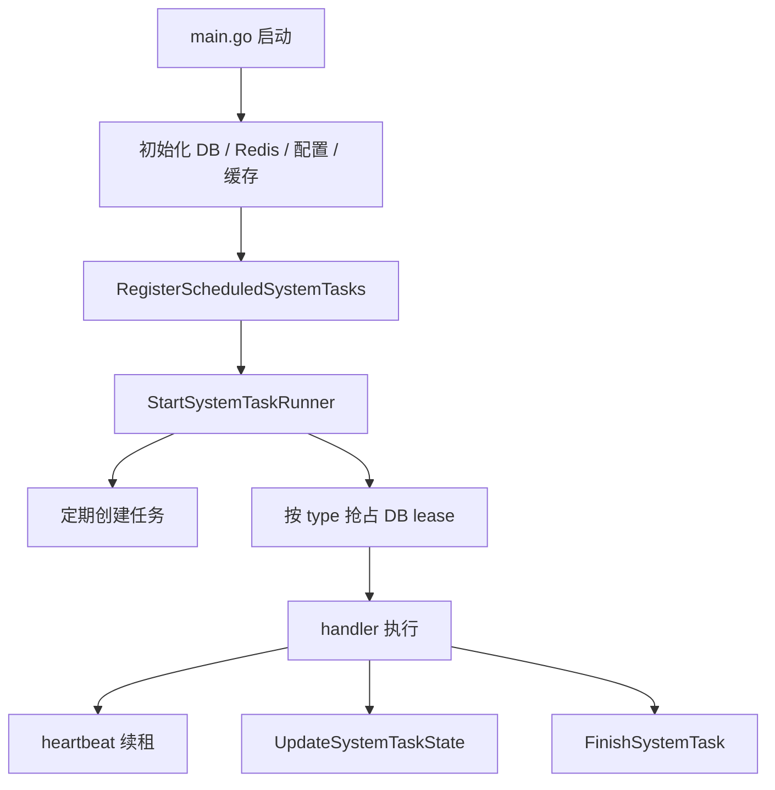
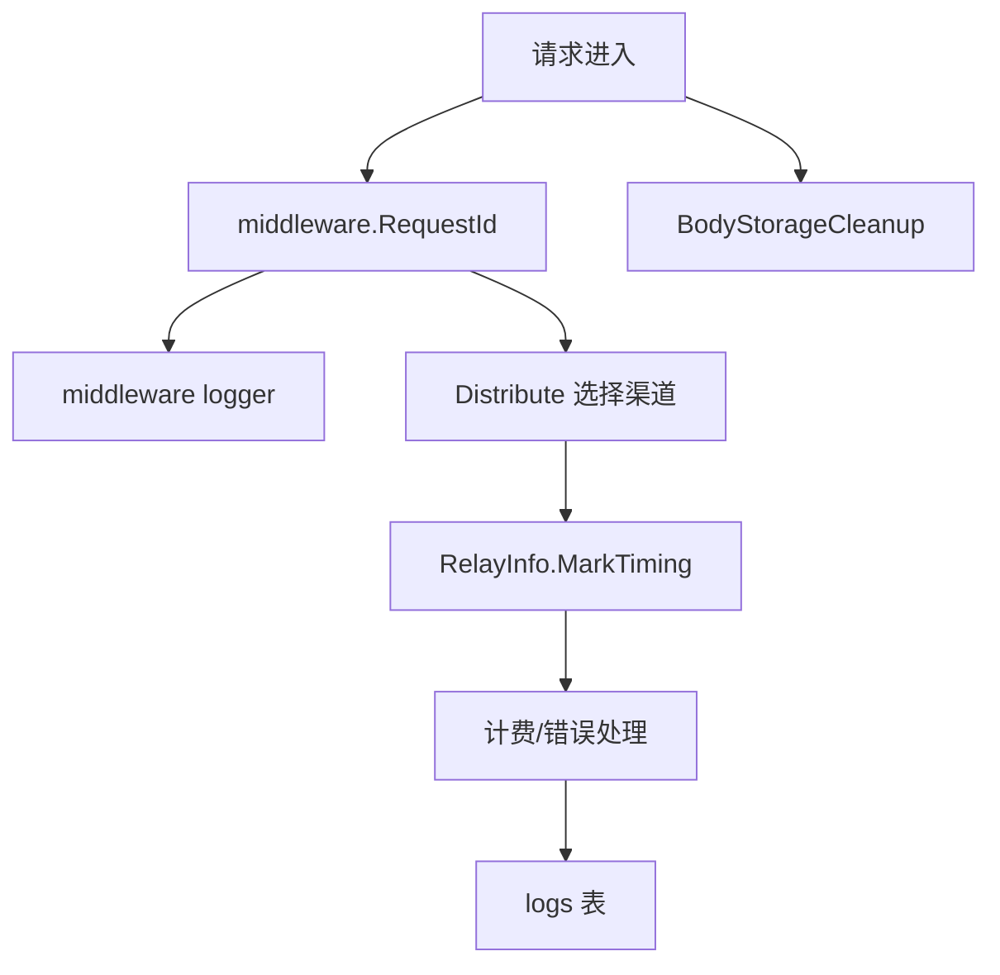

# 系统任务、日志与观测链路学习指南

这份文档梳理 new-api 的后台任务、日志、request id、性能状态、缓存刷新和资源清理。它适合用来理解“请求之外的系统如何自己运转”。

## 一、总览

new-api 不只是一个请求转发服务。它还需要在后台持续做很多事：

- 定期测试渠道。
- 同步上游模型。
- 轮询异步任务。
- 清理旧日志。
- 刷新订阅状态。
- 刷新 Codex 凭据。
- 更新实例心跳。
- 维护缓存。
- 记录请求日志和性能指标。

可以先用两张图建立整体感觉。





## 二、系统任务框架

核心代码在：

```text
service/system_task.go
model/system_task.go
controller/system_task_handlers.go
```

核心表：

```text
system_tasks
system_task_locks
```

核心接口：

```go
type SystemTaskHandler interface {
    Type() string
    Run(ctx context.Context, task *model.SystemTask, runnerID string)
}

type ScheduledSystemTaskHandler interface {
    SystemTaskHandler
    Enabled() bool
    Interval() time.Duration
    NewPayload() any
}
```

`SystemTaskHandler` 表示“一个可执行任务类型”。`ScheduledSystemTaskHandler` 额外表示“可以被调度器定期创建”。

## 三、SystemTask 与 SystemTaskLock

`SystemTask` 记录任务本体：

| 字段 | 含义 |
| --- | --- |
| `TaskID` | 公开任务 ID |
| `Type` | 任务类型 |
| `Status` | pending/running/succeeded/failed |
| `Payload` | 输入参数 |
| `State` | 运行中状态 |
| `Result` | 结果 |
| `Error` | 错误信息 |
| `ActiveKey` | 防止同类 active 任务重复 |
| `LockedBy` | 当前 runner |
| `StartedAt` / `FinishedAt` | 时间 |

`SystemTaskLock` 负责跨节点互斥：

```text
同一个 task type
  -> 同一时间只允许一个 runner 持有有效 lease
```

为什么不用 Go 里的 `sync.Mutex`？

因为生产部署可能是多实例。进程内 mutex 只能管一个进程，DB lease 可以跨节点协调。

## 四、任务执行生命周期

典型生命周期：

```text
CreateSystemTask
  -> pending + ActiveKey
  -> StartSystemTaskRunner 唤醒
  -> FindEarliestPendingSystemTasks
  -> ClaimSystemTask
  -> running + SystemTaskLock
  -> handler.Run
  -> UpdateSystemTaskState
  -> FinishSystemTask
  -> 清理 ActiveKey 和 lock
```

任务锁 TTL：

```text
systemTaskLockTTL = 60s
```

runner 空闲轮询：

```text
systemTaskRunnerIdleInterval = 15s
```

过期锁清理：

```text
systemTaskStaleLockInterval = 30s
```

执行时会有 heartbeat 续租。如果续租失败或租约丢失，runner 会 cancel context。handler 必须尊重 `ctx`：

```go
select {
case <-ctx.Done():
    return
default:
}
```

这就是 Go 里 `context.Context` 在长任务中的典型用途。

## 五、已经接入的任务类型

周期任务注册在：

```text
controller/system_task_handlers.go
```

主要包括：

- 通道测试。
- 上游模型更新。
- Midjourney 轮询。
- Suno/视频异步任务轮询。

手动触发的任务包括：

- 日志清理：`controller/system_task.go`
- 测试全部通道：`controller/channel-test.go`
- 检测上游模型：`controller/channel_upstream_update.go`

还有一些独立 goroutine 后台任务，没有完全纳入 system task：

- Codex 凭据自动刷新：`service/codex_credential_refresh_task.go`
- 订阅重置、过期、预扣记录清理：`service/subscription_reset_task.go`
- 渠道自动优先级扫描：`service/channel_auto_priority_task.go`
- 实例心跳：`service/system_instance.go`

读源码时要区分：

```text
system task 框架任务
  -> 有 system_tasks/system_task_locks 记录

独立后台 goroutine
  -> 启动后自己循环，没有统一任务表历史
```

## 六、日志清理任务

日志清理是理解 system task 的好例子。

入口：

```text
controller/system_task.go
  -> StartLogCleanupTask
  -> CreateSystemTask(SystemTaskTypeLogCleanup)
  -> runner claim
  -> runLogCleanupTask
```

它会：

1. 统计目标时间之前的日志数量。
2. 分批删除旧日志。
3. 更新 `LogCleanupState`。
4. 记录进度。
5. 完成后写 `LogCleanupResult`。

这里体现了后台任务的几个原则：

- 大任务分批做。
- 进度写入 state。
- handler 可被 context 取消。
- 最终必须 `FinishSystemTask`。
- 不要长时间占用一次 DB 操作。

## 七、Task 通用异步任务

除了 `SystemTask`，项目还有 `Task` 模型：

```text
model/task.go
```

它更偏业务异步任务，例如视频、图像、上游异步生成等。

关键字段：

- `TaskID`
- `Platform`
- `Type`
- `Status`
- `Progress`
- `Data`
- `FailReason`
- `ChannelId`
- `Quota`
- `PrivateData`

`Task.UpdateWithStatus(expectedStatus)` 使用 CAS 语义：

```text
只有当前 DB 状态仍等于 expectedStatus
  -> 才允许更新成功
```

这能避免多个轮询 worker 重复把任务结算、退款或标记完成。

相关测试：

```text
model/task_cas_test.go
service/task_polling_test.go
service/task_billing_test.go
```

## 八、日志体系

日志分三层：

| 层级 | 入口 | 用途 |
| --- | --- | --- |
| 系统日志 | `common.SysLog` / `common.SysError` | 启动、后台任务、系统级错误 |
| 应用日志 | `logger.LogInfo/Warn/Error/Debug` | 带 context/request id 的运行日志 |
| 业务日志 | `model.Log` | 消费、错误、审计、充值、退款、登录 |

业务日志模型在：

```text
model/log.go
```

常见日志类型包括：

- 消费日志。
- 错误日志。
- 管理审计日志。
- 充值日志。
- 退款日志。
- 登录日志。

查询入口：

```text
controller/log.go
```

支持按这些条件筛选：

- log type
- 时间范围
- model
- username
- token name
- channel
- group
- request id
- upstream request id

## 九、request id 与 upstream request id

请求进入后，`middleware/request-id.go` 会生成：

```text
X-Oneapi-Request-Id
```

并写入：

- Gin context。
- request context。
- response header。

上游响应里如果带 request id，`relay/channel/api_request.go` 会写入：

```text
X-Upstream-Request-Id
```

这两个字段最后会进入 `logs` 表：

```text
request_id
upstream_request_id
```

排查问题时优先用它们：

```text
用户报错截图
  -> 找 X-Oneapi-Request-Id
  -> 查错误日志/消费日志
  -> 找 upstream_request_id
  -> 对照上游平台日志
```

## 十、RelayInfo timing

relay 链路中，`RelayInfo` 会记录关键阶段耗时：

```go
info.MarkTiming("stage_name")
```

常见阶段：

- `relay_info_ready`
- `token_meta_ready`
- `sensitive_check_done`
- `estimate_tokens_done`
- `price_ready`
- `preconsume_done`
- `retry_0_channel_ready`
- `retry_0_body_ready`
- `upstream_dns_start`
- `upstream_dns_done`
- `upstream_connect_start`
- `upstream_connect_done`
- `upstream_tls_start`
- `upstream_tls_done`
- `upstream_first_response_byte`
- `first_response`

这些 timing 通常会被写进日志 `Other` 字段。它可以帮你判断：

- 慢在本地预处理还是上游。
- 是否 DNS 或 TLS 慢。
- 首字节耗时是否异常。
- retry 后是否换了渠道。

## 十一、审计日志

管理后台写操作一般要记录审计日志。中间件在：

```text
middleware/audit.go
```

它会在请求结束后，根据路由、方法、用户、请求结果等信息记录管理操作。

读后台 API 时要注意：

```text
controller 里可能没有显式 RecordLog
  -> 但 middleware/audit.go 可能统一记录了
```

这是一种横切关注点：业务 handler 专注业务，审计由中间件兜底。

## 十二、系统状态与性能保护

系统状态来自：

```text
common.StartSystemMonitor
```

它会周期性采集：

- CPU。
- 内存。
- 磁盘。

并用 `atomic.Value` 保存快照。

中间件：

```text
middleware/performance.go
```

可以在系统超过阈值时拒绝 relay 请求，避免服务被压垮。

管理接口：

```text
controller/performance.go
```

提供：

- 磁盘缓存统计。
- runtime 内存信息。
- 日志文件列表。
- 日志清理。
- 手动 GC。

这里能学到一个 Go 实践：采集系统状态可能比较重，不能每个请求都实时采集。用后台 goroutine 定期采集，再用 `atomic.Value` 给请求路径读取快照，性能更稳定。

## 十三、缓存刷新

new-api 有多层缓存：

| 缓存 | 位置 | 用途 |
| --- | --- | --- |
| channel cache | `model/channel_cache.go` | 渠道列表、能力、状态 |
| option cache | `model/option.go` / setting 包 | 系统配置 |
| user cache | `model/user_cache.go` | 用户信息 |
| token cache | `model/token_cache.go` | API Key |
| proxy client cache | relay/service HTTP client | 上游代理客户端 |
| disk cache | common/file service | 文件源和临时 body |

渠道缓存使用进程内 map + `sync.RWMutex`。刷新时整体替换，读取时走读锁，适合读多写少。

用户和 token 走 Redis hash 缓存，适合多实例共享。

上游模型变更后，会触发：

```text
InitChannelCache
ResetProxyClientCache
```

否则旧渠道配置可能继续影响 relay。

## 十四、请求资源清理

请求体复读、文件下载、multipart、图片输入等场景可能创建临时资源。清理入口：

```text
middleware/body_cleanup.go
```

请求结束后会清理 BodyStorage 和 file source cache，避免临时文件或内存引用长期保留。

读 relay 代码时，看到请求体被读取多次不要惊讶。项目通过 BodyStorage 解决“Go HTTP body 默认只能读一次”的问题，再通过 cleanup 中间件清理。

## 十五、Go 学习点

这部分源码适合学习这些 Go 实战主题：

1. 用 DB lease 做分布式单飞。
2. 用 `context.Context` 取消长任务。
3. 用 `sync.Once` 保证 runner 只启动一次。
4. 用 buffered channel 做非阻塞 wakeup。
5. 用 `time.Ticker` 做周期调度。
6. 用 `sync.RWMutex` 保护缓存 map。
7. 用 `atomic.Value` 保存系统状态快照。
8. 用 CAS 更新防止异步任务重复结算。
9. 用中间件统一记录 request id、审计日志和资源清理。
10. 用日志里的 `Other` 字段扩展观测信息。

建议练习：

```text
先读 model/system_task_test.go
  -> 再读 model/system_task.go
  -> 再读 service/system_task.go
  -> 最后读 controller/system_task_handlers.go
```

读完后自己画出：

```text
pending -> running -> succeeded/failed
```

以及：

```text
lock acquired -> heartbeat renew -> lock lost -> context cancel
```

这两张状态图画明白，后台任务框架就掌握了一大半。

