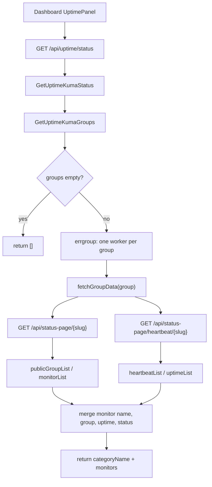
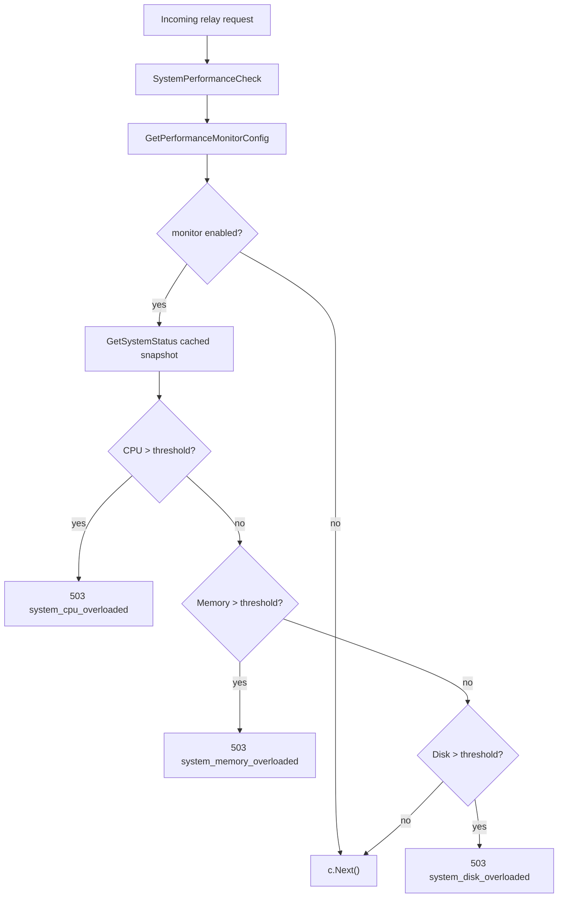
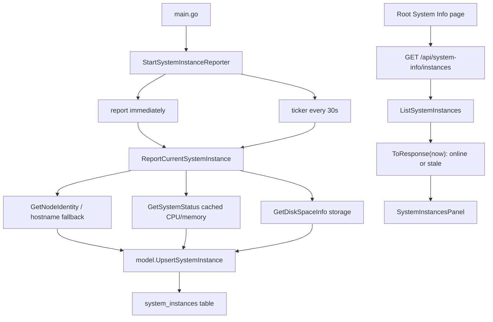
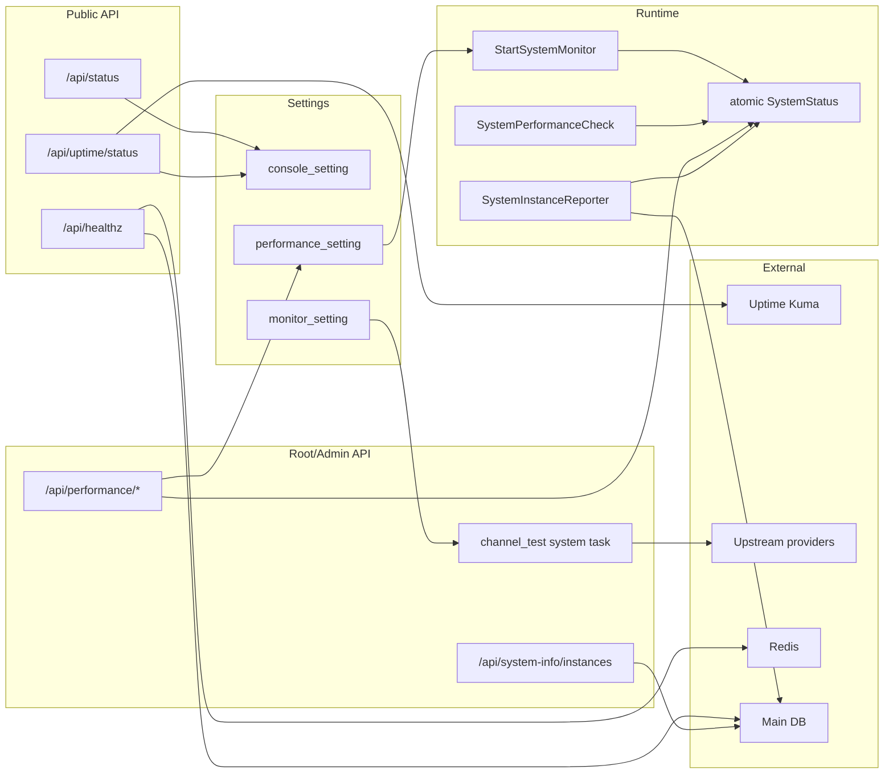

# Uptime、系统状态、性能保护与实例心跳学习指南

这篇文档专门梳理 new-api 里所有容易被统称为“监控”“状态”“健康检查”的链路。它们名字相近，但服务对象完全不同：

- `/api/status`：给前端启动用的公开配置状态，不是机器资源状态。
- `/api/healthz`：给部署平台或负载均衡用的服务健康检查。
- `/api/uptime/status`：代理外部 Uptime Kuma status page，给 Dashboard 展示可用性。
- `common.StartSystemMonitor()`：本进程 CPU、内存、磁盘的后台采样。
- `middleware.SystemPerformanceCheck()`：在 relay 请求进入前做系统过载保护。
- `/api/performance/*`：Root 管理员查看和操作性能、磁盘缓存、日志文件。
- `/api/system-info/instances`：多实例心跳列表，展示每个节点是否在线。
- `monitor_setting` + `channel_test`：上游渠道自动探测，不是本机健康检查。
- `ENABLE_PPROF` / `PYROSCOPE_URL`：性能诊断工具，不是 Dashboard 常规监控。

读完这篇，你应该能回答三个问题：

1. 用户打开前端时，哪些“状态”决定页面显示什么？
2. API relay 请求什么时候会因为系统负载被拒绝？
3. 多节点、Uptime Kuma、healthz、渠道自动测试分别解决什么问题？

## 先建立概念边界

| 名称 | 入口 | 权限 | 主要数据源 | 解决的问题 |
| --- | --- | --- | --- | --- |
| 前端状态 | `GET /api/status` | 公开 | `common`、`setting/*`、`OptionMap` | 前端启动配置、OAuth 开关、模块开关、公告/API 信息 |
| 健康检查 | `GET /api/healthz` | 公开 | DB ping、Redis ping | 部署平台判断实例是否健康 |
| Uptime Kuma 面板 | `GET /api/uptime/status` | 公开 | 外部 Uptime Kuma public status page | Dashboard 展示外部监控结果 |
| 后台资源采样 | `common.StartSystemMonitor()` | 内部 goroutine | `gopsutil`、磁盘 statfs | 缓存 CPU/内存/磁盘使用率 |
| Relay 过载保护 | `middleware.SystemPerformanceCheck()` | Relay 前置中间件 | `common.GetSystemStatus()` | 系统过载时拒绝新的 relay 请求 |
| 性能管理 | `/api/performance/*` | Root | runtime mem stats、disk cache stats、日志目录 | Root 查看性能并手动清理/GC |
| 实例心跳 | `GET /api/system-info/instances` | Root | `system_instances` 表 | 多实例部署时看节点在线/过期状态 |
| 渠道探测 | `channel_test` system task | Admin/Root 触发，后台调度 | 真实上游 provider 请求 | 判断上游渠道可用性，自动禁用/恢复 |
| pprof/Pyroscope | env 开关 | 运维侧 | Go profiling | 深度性能诊断 |

一个很实用的判断方法：

- 如果你关心“前端要显示哪些功能”，看 `/api/status`。
- 如果你关心“服务能不能接流量”，看 `/api/healthz`。
- 如果你关心“外部服务 uptime 怎么展示”，看 Uptime Kuma 链路。
- 如果你关心“本进程是否过载”，看 `performance_setting` 和 `SystemPerformanceCheck`。
- 如果你关心“多实例谁还活着”，看 `system_instances`。
- 如果你关心“某个渠道上游还能不能用”，看 `channel_test`。

## 源码地图

### 后端入口

| 文件 | 重点 |
| --- | --- |
| `router/api-router.go` | 注册 `/api/status`、`/api/healthz`、`/api/uptime/status`、`/api/performance/*`、`/api/system-info/instances` |
| `router/relay-router.go` | 在 `/v1`、`/v1beta`、`/mj`、`/suno`、`/pg` 等 relay 路由挂 `SystemPerformanceCheck` |
| `controller/misc.go` | `GetStatus`、`GetHealthz`、`TestStatus` |
| `controller/uptime_kuma.go` | 聚合外部 Uptime Kuma status page 和 heartbeat |
| `common/system_monitor.go` | 后台 CPU/内存/磁盘采样缓存 |
| `common/system_monitor_unix.go` | Unix/macOS/Linux 的磁盘空间读取 |
| `common/performance_config.go` | 资源保护阈值的 `atomic.Value` 配置快照 |
| `middleware/performance.go` | relay 请求前的 503 过载拦截 |
| `setting/performance_setting/config.go` | 磁盘缓存和性能监控配置注册、同步到 `common` |
| `controller/performance.go` | Root 性能统计、清缓存、重置统计、GC、日志文件清理 |
| `model/system_instance.go` | `system_instances` 表、upsert、stale 判断 |
| `service/system_instance.go` | 每 30 秒上报当前进程实例心跳 |
| `controller/system_info.go` | Root 查询实例列表 |
| `setting/operation_setting/monitor_setting.go` | 渠道自动测试配置 |
| `controller/system_task_handlers.go` | 注册 `channel_test` 等系统任务 handler |
| `controller/channel-test.go` | 渠道测试、自动禁用、恢复测试 |
| `common/pprof.go`、`common/pyro.go` | pprof 和 Pyroscope 性能诊断 |

### 前端入口

| 文件 | 重点 |
| --- | --- |
| `web/default/src/hooks/use-status.ts` | 拉取 `/api/status`，同步系统配置 store 和 localStorage placeholder |
| `web/default/src/features/dashboard/hooks/use-status-data.ts` | 根据 status 控制 Dashboard 内容可见性 |
| `web/default/src/features/dashboard/components/overview/uptime-panel.tsx` | Dashboard Uptime Kuma 面板 |
| `web/default/src/features/dashboard/api.ts` | `getUptimeStatus()` 请求 `/api/uptime/status` |
| `web/default/src/features/system-settings/content/uptime-kuma-section.tsx` | 配置 Uptime Kuma group |
| `web/default/src/features/system-settings/maintenance/performance-section.tsx` | 性能监控、磁盘缓存、GC、日志清理 UI |
| `web/default/src/features/system-settings/models/routing-reliability-section.tsx` | 渠道自动测试 UI |
| `web/default/src/features/system-info/index.tsx` | System Info 页面组合实例列表和系统任务 |
| `web/default/src/features/system-info/components/system-instances-panel.tsx` | 每 30 秒轮询实例列表 |
| `web/default/src/hooks/use-sidebar-data.ts` | Root 用户才显示 System Info 入口 |

## 路由与权限总览

`router/api-router.go` 里这几个路由最容易混在一起：

```go
apiRouter.GET("/setup", controller.GetSetup)
apiRouter.GET("/healthz", controller.GetHealthz)
apiRouter.GET("/status", controller.GetStatus)
apiRouter.GET("/uptime/status", controller.GetUptimeKumaStatus)
apiRouter.GET("/status/test", middleware.AdminAuth(), controller.TestStatus)
```

含义分别是：

- `/api/healthz`：公开，返回 DB/Redis 健康状态，异常时 HTTP 503。
- `/api/status`：公开，返回前端启动配置。
- `/api/uptime/status`：公开，实时请求外部 Uptime Kuma。
- `/api/status/test`：Admin，测试 DB 并返回 HTTP 统计信息。

Root 性能管理路由：

```go
performanceRoute := apiRouter.Group("/performance")
performanceRoute.Use(middleware.RootAuth())
{
    performanceRoute.GET("/stats", controller.GetPerformanceStats)
    performanceRoute.DELETE("/disk_cache", controller.ClearDiskCache)
    performanceRoute.POST("/reset_stats", controller.ResetPerformanceStats)
    performanceRoute.POST("/gc", controller.ForceGC)
    performanceRoute.GET("/logs", controller.GetLogFiles)
    performanceRoute.DELETE("/logs", controller.CleanupLogFiles)
}
```

Root 系统信息路由：

```go
systemInfoRoute := apiRouter.Group("/system-info")
systemInfoRoute.Use(middleware.RootAuth())
{
    systemInfoRoute.GET("/instances", controller.ListSystemInstances)
}
```

Relay 性能保护不在 `/api/performance` 路由里，而是在 `router/relay-router.go` 的 relay 路由组上：

```go
relayV1Router := router.Group("/v1")
relayV1Router.Use(middleware.RouteTag("relay"))
relayV1Router.Use(middleware.SystemPerformanceCheck())
relayV1Router.Use(middleware.TokenAuth())
relayV1Router.Use(middleware.ModelRequestRateLimit())
```

同样挂载性能保护的还有 `/pg`、`/mj`、`/:mode/mj`、`/suno`、`/v1beta`。

## `/api/status`：前端启动配置状态

`controller.GetStatus` 的职责不是检查机器负载，而是把“前端启动必须知道的系统配置”一次性返回给浏览器。

核心数据包括：

- 版本和启动时间：`version`、`start_time`。
- OAuth 开关和 client id：GitHub、Discord、LinuxDO、Telegram、OIDC、自定义 OAuth。
- 主题和品牌显示：`theme`、`system_name`、`logo`、`footer_html`。
- 登录/注册能力：`register_enabled`、`password_login_enabled`、`password_register_enabled`、Passkey。
- 计费显示：`quota_per_unit`、`quota_display_type`、汇率和自定义货币。
- 功能开关：绘图、任务、数据导出、checkin、demo/self-use。
- Dashboard 内容开关：`api_info_enabled`、`uptime_kuma_enabled`、`announcements_enabled`、`faq_enabled`。
- 模块配置：`HeaderNavModules`、`SidebarModulesAdmin`。
- 可选内容：API 信息、公告、FAQ 只有在开关启用时才注入。

前端 `useStatus` 会：

1. 用 React Query 请求 `/api/status`。
2. 把返回结果同步到系统配置 store。
3. 写入 localStorage 的 `status`，下次打开页面可先用本地 placeholder。
4. 设置 `staleTime`，避免每次组件渲染都打接口。

Dashboard 再根据这个 status 决定要不要展示 Uptime 面板。关键点是：`uptime_kuma_enabled` 只是前端展示开关，不是后端访问控制。即使关闭面板，`/api/uptime/status` 路由本身仍然公开存在。

## `/api/healthz`：部署健康检查

`controller.GetHealthz` 用来给负载均衡、容器编排、运维探针判断实例是否健康。

它检查两个组件：

- DB：调用 `model.PingDB()`。
- Redis：只有 `common.RedisEnabled && common.RDB != nil` 时才 ping，否则状态是 `disabled`。

响应结构里会带：

- `status`：`ok` 或 `degraded`。
- `timestamp`：当前 Unix 时间。
- `latency_ms`：整个 healthz 检查耗时。
- `version`：当前版本。
- `node_type`：`master` 或 `slave`。
- `components`：每个组件的 status、latency、error、enabled。

如果 DB 或启用中的 Redis 失败，整体 HTTP 状态码是 503，`success` 是 false。

这和 Uptime Kuma 的关系是：Uptime Kuma 可以外部定时访问 `/api/healthz`，但 new-api 自己的 Uptime 面板不会主动跑本地探测，它只是代理 Uptime Kuma 的公开 status page。

## Uptime Kuma 面板：外部状态页聚合

`controller/uptime_kuma.go` 是一个很适合练 Go 并发读法的文件。

配置来自 `console_setting`：

- `console_setting.uptime_kuma_enabled`：前端面板显示开关。
- `console_setting.uptime_kuma_groups`：多个 Uptime Kuma group 配置。

一个 group 主要包含：

- `categoryName`：new-api Dashboard 上显示的分类名。
- `url`：Uptime Kuma 实例地址。
- `slug`：Uptime Kuma status page slug。
- `description`：配置 UI 使用的描述。

校验层会限制 group 数量和字段格式，子 agent 已确认 `validation.go` 中 group 最多 20 个。

### 后端聚合流程

`GetUptimeKumaStatus`：

1. 读取 `console_setting.GetUptimeKumaGroups()`。
2. 如果没有 group，直接返回空数组。
3. 基于请求 context 创建 30 秒总超时。
4. 创建 10 秒 HTTP client timeout。
5. 对每个 group 并发调用 `fetchGroupData`。
6. 返回 `[]UptimeGroupResult`。

`fetchGroupData` 对单个 group 做两次并发请求：

- `{url}/api/status-page/{slug}`：拿 public group 和 monitor list。
- `{url}/api/status-page/heartbeat/{slug}`：拿 heartbeat 和 uptime。

然后合并：

- `publicGroupList[].monitorList[]` 给 monitor id 和 name。
- `heartbeatList[monitorID]` 给最近 heartbeat 列表。
- `uptimeList[monitorID+"_24"]` 给 24 小时 uptime。
- 第一个 heartbeat 的 `status` 作为当前状态。

流程图：



### Go 读法

这个文件有几个值得学习的点：

- `context.WithTimeout` 给整个请求设置最大生命周期。
- `http.NewRequestWithContext` 让外部 HTTP 请求能随 context 取消。
- `errgroup.WithContext` 并发请求同一个 group 的两个 endpoint。
- 外层再用 `errgroup` 并发多个 group。
- `i, group := i, group` 是 Go 并发循环里避免闭包捕获循环变量的常见写法。
- 单个 group 失败时返回空结果，不让整个 Dashboard 面板失败。

### 容易误解点

- new-api 没有本地 uptime monitor 表。
- `/api/uptime/status` 没有本地缓存，每次请求都会访问外部 Uptime Kuma。
- `uptime_kuma_enabled` 不拦截接口，只控制 Dashboard 面板显示。
- uptime 是 24 小时口径，因为 key 是 `monitorID + "_24"`。
- 这个接口是公开的，所以配置的 Uptime Kuma status page 本身也应该是可公开展示的信息。

## 系统资源采样：`common.StartSystemMonitor`

性能保护依赖一个后台采样缓存，而不是每个请求都实时调用系统 API。

启动位置在 `main.go` 的资源初始化阶段：

```go
perfmetrics.Init()

// 启动系统监控
common.StartSystemMonitor()
```

`common/system_monitor.go` 里核心结构很小：

```go
type SystemStatus struct {
    CPUUsage    float64
    MemoryUsage float64
    DiskUsage   float64
}

var latestSystemStatus atomic.Value
```

`init()` 先存一个空的 `SystemStatus{}`，避免读取时 panic。

`StartSystemMonitor()` 启动 goroutine：

1. 读取 `common.GetPerformanceMonitorConfig()`。
2. 如果监控关闭，睡 30 秒，然后继续检查。
3. 如果监控开启，调用 `updateSystemStatus()`。
4. 每 5 秒采样一次。

`updateSystemStatus()` 的数据来源：

- CPU：`gopsutil/cpu.Percent(0, false)`。
- 内存：`gopsutil/mem.VirtualMemory()` 的 `UsedPercent`。
- 磁盘：`common.GetDiskSpaceInfo()`。

磁盘读取在 Unix/macOS/Linux 下使用 `unix.Statfs`，路径优先取磁盘缓存路径：

```go
cachePath := GetDiskCachePath()
if cachePath == "" {
    cachePath = os.TempDir()
}
```

因此磁盘过载保护检查的是“磁盘缓存目录所在磁盘”，不一定是数据库目录、日志目录或程序目录所在磁盘。

### 为什么用 `atomic.Value`

这是一个读多写少的场景：

- 后台 goroutine 每 5 秒写一次。
- 每个 relay 请求可能都要读一次。

`atomic.Value` 适合保存不可变快照。读请求不需要加锁，写入时整份 `SystemStatus` 替换掉旧值。

## `performance_setting`：资源保护配置如何同步

默认配置分两层：

1. `common/performance_config.go` 给运行时默认值：监控启用，CPU/内存/磁盘阈值 90。
2. `setting/performance_setting/config.go` 注册持久化配置：监控启用，CPU/内存阈值 90，磁盘阈值 95。

`performance_setting` 同时管理两类东西：

- 磁盘缓存配置：
  - `disk_cache_enabled`
  - `disk_cache_threshold_mb`
  - `disk_cache_max_size_mb`
  - `disk_cache_path`
- 系统资源保护配置：
  - `monitor_enabled`
  - `monitor_cpu_threshold`
  - `monitor_memory_threshold`
  - `monitor_disk_threshold`

配置注册后会同步到 `common` 包：

- `common.SetDiskCacheConfig(...)`
- `common.SetPerformanceMonitorConfig(...)`

前端保存配置时，`performance-section.tsx` 把嵌套表单重新拍平成 option key，例如：

```ts
'performance_setting.monitor_enabled': values.performance_setting.monitor_enabled
```

后端更新 option 后，如果 key 属于 `performance_setting.*`，会触发 setting 的同步逻辑，把 DB 中的新配置推到 `common` 的运行时配置快照。

## Relay 过载保护：`SystemPerformanceCheck`

`middleware/performance.go` 是系统资源保护真正生效的地方。

流程：



`checkSystemPerformance` 只看三个指标：

- CPU 使用率。
- 内存使用率。
- 磁盘使用率。

阈值大于 0 才生效。超过阈值时返回 `types.NewAPIError`，HTTP 状态码是 503。

错误响应格式会按路径区分：

- `/v1/messages` 返回 Claude error shape。
- 其他 relay 路径返回 OpenAI error shape。

这里的设计目的是让不同 SDK 能按它们熟悉的协议解析错误。

### 保护范围

会被保护：

- `/pg/chat/completions`
- `/v1/realtime`
- `/v1/messages`
- `/v1/completions`
- `/v1/chat/completions`
- `/v1/responses`
- `/v1/images/*`
- `/v1/audio/*`
- `/v1/embeddings`
- `/v1/moderations`
- `/mj/*`
- `/:mode/mj/*`
- `/suno/*`
- `/v1beta/models/*path`

不会被这个中间件保护：

- `/api/status`
- `/api/healthz`
- `/api/uptime/status`
- `/api/performance/*`
- 后台普通管理 API

这意味着系统过载保护的定位很明确：优先拒绝新的 AI relay 流量，尽量保留管理和状态接口，让管理员还能查看、调整、排障。

### 对已有请求的影响

`SystemPerformanceCheck` 只在请求进入中间件时判断一次。它不会主动中断已经开始的流式请求，也不会后台扫描并杀掉运行中的请求。

## Root 性能管理：`/api/performance/*`

`controller/performance.go` 是 Root 管理员的性能管理 API。

### `GET /api/performance/stats`

返回结构包括：

- `cache_stats`：磁盘缓存计数器，例如当前活跃文件数、缓存大小、命中次数等。
- `memory_stats`：Go runtime 的 `Alloc`、`TotalAlloc`、`Sys`、`NumGC`、goroutine 数。
- `disk_cache_info`：缓存目录路径、是否存在、文件数、总大小。
- `disk_space_info`：缓存目录所在磁盘总量、空闲、已用、使用百分比。
- `config`：当前磁盘缓存配置和性能监控配置。

实现上先读取 `common.GetDiskCacheStats()`，再 `runtime.ReadMemStats`，然后读取磁盘缓存目录信息和磁盘空间。

注意注释里写明：不会每次获取统计都全量扫描磁盘缓存状态，主要依赖原子计数器；但为了接口兼容，磁盘空间仍会调用 `GetDiskSpaceInfo()`。

### `DELETE /api/performance/disk_cache`

调用：

```go
common.CleanupOldDiskCacheFiles(10 * time.Minute)
```

它清理超过 10 分钟未使用的缓存文件。这个阈值是为了避免误删正在被请求使用的文件。

### `POST /api/performance/reset_stats`

调用 `common.ResetDiskCacheStats()`，只重置统计计数，不代表删除磁盘上的活跃缓存文件。

### `POST /api/performance/gc`

直接调用 `runtime.GC()`，用于 Root 手动触发 Go GC。

### `GET /api/performance/logs`

读取 `common.LogDir` 下形如 `oneapi-*.log` 的日志文件，返回文件名、大小、修改时间、总数、总大小、最早/最新时间。

### `DELETE /api/performance/logs`

支持两种清理模式：

- `mode=by_count&value=N`：按文件名降序保留最新 N 个。
- `mode=by_days&value=N`：删除早于 N 天前的日志。

会跳过当前正在写入的 active log path。

## 磁盘缓存与性能监控的关系

磁盘缓存不是“监控系统”，但它和性能页面、磁盘保护密切相关。

请求体可能很大，多模态和文件上传尤其明显。new-api 用 `BodyStorage` 把请求体抽象成可重复读取的对象：

- 小请求体放内存。
- 大请求体在配置允许时落磁盘。

相关文件：

- `common/body_storage.go`
- `common/gin.go`
- `common/disk_cache.go`
- `middleware/body_cleanup.go`
- `service/file_service.go`

请求结束时 `BodyStorageCleanup` 中间件会 close 并清理请求体存储。

启动时 `main.go` 会调用 `common.CleanupOldCacheFiles()` 清理旧磁盘缓存文件。

性能页面里展示磁盘缓存统计，是因为这部分直接影响内存、磁盘占用和大请求吞吐。它和 `SystemPerformanceCheck` 的关系是：

- 磁盘缓存配置决定大请求体是否落盘。
- 系统监控读取缓存目录所在磁盘的使用率。
- 如果磁盘使用率超过阈值，新的 relay 请求会被拒绝。

## 多实例心跳：System Info Instances

new-api 支持多实例部署，因此需要知道当前有哪些进程还活着。

启动位置在 `main.go`：

```go
service.StartSystemInstanceReporter()
```

`service/system_instance.go` 中：

- `systemInstanceReportInterval = 30 * time.Second`
- 用 `sync.Once` 保证 reporter 只启动一次。
- 用 `gopool.Go` 启动后台循环。
- 启动后立即上报一次，然后每 30 秒上报一次。

### 上报内容

`ReportCurrentSystemInstance()` 组装 `SystemInstanceInfo`：

- `schema_version`：当前为 1。
- `node`：`common.GetNodeIdentity()`，包括节点名、来源、是否手动配置。
- `role.is_master`：来自 `common.IsMasterNode`。
- `runtime`：版本、GOOS、GOARCH、启动时间。
- `host.hostname`：系统 hostname。
- `resources.cpu.usage_percent`：来自 `common.GetSystemStatus()`。
- `resources.memory.usage_percent`：来自 `common.GetSystemStatus()`。
- `resources.storage.*`：来自 `common.GetDiskSpaceInfo()`。

如果没有配置稳定节点名，会 fallback 到 hostname，并把：

- `source` 设为 hostname。
- `manually_configured` 设为 false。
- `should_configure_manually` 设为 true。

前端会据此提示管理员应该手动配置稳定节点名。

### 表结构和 upsert

`model.SystemInstance`：

```go
type SystemInstance struct {
    NodeName   string `gorm:"type:varchar(128);primaryKey"`
    Info       string `gorm:"type:text"`
    StartedAt  int64  `gorm:"bigint;index"`
    LastSeenAt int64  `gorm:"bigint;index"`
    CreatedAt  int64  `gorm:"bigint;index"`
    UpdatedAt  int64  `gorm:"bigint;index"`
}
```

`UpsertSystemInstance` 用 GORM `clause.OnConflict` 按 `node_name` upsert：

- 如果不存在，创建。
- 如果存在，更新 `info`、`started_at`、`last_seen_at`、`updated_at`。

这里没有手写 MySQL/PostgreSQL/SQLite 的不同 SQL，而是让 GORM 生成跨数据库 upsert。

### stale 判断

`SystemInstanceStaleAfterSeconds = 90`。

`ToResponse(now)` 中：

- 如果 `now - LastSeenAt > 90`，状态是 `stale`。
- 否则状态是 `online`。

因为 reporter 每 30 秒上报一次，90 秒相当于允许丢失几个周期，避免短暂抖动就显示离线。

### 前端展示

`SystemInstancesPanel`：

- React Query key 是 `['system-info', 'instances']`。
- 请求 `/api/system-info/instances`。
- 每 30 秒轮询一次。
- 展示节点名、online/stale、master/worker、CPU、Memory、Storage、版本、runtime、started、last seen。

System Info 页面只给 Root 用户显示，侧边栏也只对超级管理员展示入口。

流程图：



## master / worker 与心跳

`common.IsMasterNode` 决定当前实例是不是 master。子 agent 确认：`NODE_TYPE=slave` 时才是 worker，否则默认 master。

这个角色很重要：

- master 会运行 master-only 后台任务，例如系统任务调度。
- worker 不运行 master-only background tasks。
- System Info 前端会显示 `master` 或 `worker`。

但无论 master 还是 worker，都可以上报 system instance。这样 Root 才能看到整个集群的活跃节点。

## 渠道探测：`monitor_setting` 和 `channel_test`

“monitoring” 在项目里还有一层含义：渠道自动测试。

它和前面几套状态系统都不同：

- 不是 `/api/healthz`：不检查本服务 DB/Redis。
- 不是 Uptime Kuma：不读取外部 status page。
- 不是系统性能保护：不检查 CPU/内存/磁盘。
- 它检查的是“上游渠道是否还能成功响应测试请求”。

配置来自 `setting/operation_setting/monitor_setting.go`：

- `auto_test_channel_enabled`
- `auto_test_channel_minutes`
- `channel_test_mode`
- `auto_priority_scan_enabled`
- `auto_priority_scan_interval_hours`

`channel_test_mode` 有两个值：

- `scheduled_all`：定时测试所有非手动禁用渠道。
- `passive_recovery`：只测试自动禁用渠道，用于恢复。

旧环境变量也会影响配置：

- `CHANNEL_TEST_FREQUENCY`：设置频率并启用 scheduled all。
- `CHANNEL_TEST_ENABLED`：显式启用/关闭。

### 系统任务如何触发

`controller.RegisterScheduledSystemTasks()` 会注册 channel test handler。

`service.StartSystemTaskRunner()` 启动系统任务 runner。它通过数据库任务行和锁实现多 master 去重，避免多个实例重复跑同一个任务。

到期后创建 `channel_test` 任务，执行 `runChannelTestTask()`：

1. 解析测试用户 ID。
2. 根据 mode 选择渠道。
3. `scheduled_all` 测所有非手动禁用渠道。
4. `passive_recovery` 只测自动禁用渠道。
5. 对每个渠道调用 `testChannel()`。
6. 根据错误码、响应时间等判断失败。
7. 失败时可自动禁用；自动禁用渠道恢复成功时可重新启用。

### 手动测试与自动测试

手动测试渠道相关路由由 Admin 权限和 channel operate 权限保护。手动全量测试现在不是直接在 HTTP 请求里跑完整循环，而是 enqueue 一个 `channel_test` system task。

自动任务和手动任务共用底层测试逻辑，但 payload 不同：

- scheduled 自动任务可以根据系统配置选择 mode。
- 手动触发通常按 `scheduled_all` 跑完整测试，并可通知 Root 用户。

### Go 读法

这条链路适合练习这些 Go/后端能力：

- 用 system task 把长任务从 HTTP 请求中解耦。
- 用 DB lease 避免多实例重复执行。
- 用 context 把取消和超时传进测试循环。
- 用内部 Gin request 复用 relay/provider adaptor 能力。
- 用明确的 mode 字符串控制业务策略。

## pprof 与 Pyroscope：性能诊断不是监控面板

`main.go` 中还有两个性能诊断入口：

- `ENABLE_PPROF=true`
- `PYROSCOPE_URL`

当 `ENABLE_PPROF=true` 时，会启用 Go 的 pprof，并启动 `common.Monitor()`。子 agent 已确认 `common.Monitor()` 会在 CPU 超过阈值时落本地 pprof 文件。

当 `PYROSCOPE_URL` 存在时，会启动 Pyroscope 持续 profiling。

它们的定位是“工程师排查性能问题”，不是产品 Dashboard 的常规状态展示。不要把它们和 `performance_setting.monitor_enabled` 混为一谈。

## 完整关系图



## 常见误区速查

### 误区 1：`/api/status` 是系统健康检查

不是。它主要服务前端启动和页面开关。健康检查看 `/api/healthz`。

### 误区 2：Uptime Kuma 面板会本地定时探测

不会。new-api 只是实时代理外部 Uptime Kuma status page，并把数据整理成 Dashboard 需要的结构。

### 误区 3：关闭 `uptime_kuma_enabled` 会禁用 `/api/uptime/status`

不会。这个开关控制前端是否显示 Uptime 面板，不是后端鉴权或路由开关。

### 误区 4：`common.GetSystemStatus()` 是实时系统调用

不是。它读取后台 goroutine 最近一次采样写入的 `atomic.Value`。

### 误区 5：性能保护会保护所有 API

不是。它只挂在 relay 路由上，普通后台管理 API 不走这个中间件。

### 误区 6：过载保护会中断已经开始的流式请求

不会。它只拒绝新进入中间件的请求。

### 误区 7：磁盘过载检查的是数据库磁盘

不一定。它检查的是磁盘缓存目录所在磁盘；没有配置缓存路径时通常是系统临时目录。

### 误区 8：`ResetPerformanceStats` 会清磁盘缓存文件

不会。它重置统计计数。清理文件用 `DELETE /api/performance/disk_cache`，且只清理不活跃旧文件。

### 误区 9：`monitor_setting` 是 CPU/内存监控设置

不是。`monitor_setting` 主要是渠道自动测试和优先级扫描；CPU/内存/磁盘阈值在 `performance_setting`。

### 误区 10：`perf_metrics` 和 `/api/performance/*` 是同一套

不是。`perf_metrics` 记录模型请求性能，用于 pricing/性能指标展示；`/api/performance/*` 是系统运行时性能和缓存管理。

### 误区 11：System Info stale 表示进程一定死了

不一定。它只表示超过 90 秒没有上报心跳。可能是进程挂了，也可能是 DB 写入失败、网络分区或实例长时间阻塞。

### 误区 12：pprof 是 Dashboard 监控

不是。pprof/Pyroscope 是运维和开发者排查性能问题的 profiling 工具。

## 按源码精读顺序

建议按这个顺序读：

1. `router/api-router.go`：先确认公开状态、Root 性能、System Info 的路由和权限。
2. `router/relay-router.go`：确认哪些 relay 路由挂了 `SystemPerformanceCheck`。
3. `controller/misc.go`：读 `GetStatus` 和 `GetHealthz`，分清前端配置与健康检查。
4. `web/default/src/hooks/use-status.ts`：看前端如何消费 `/api/status`。
5. `controller/uptime_kuma.go`：精读 Uptime Kuma 并发聚合。
6. `web/default/src/features/dashboard/components/overview/uptime-panel.tsx`：对照后端返回结构看展示。
7. `common/system_monitor.go`：读后台采样和 `atomic.Value`。
8. `setting/performance_setting/config.go`：读配置注册和同步到 common。
9. `middleware/performance.go`：读 relay 过载保护。
10. `controller/performance.go`：读 Root 性能 API。
11. `service/system_instance.go`：读实例心跳上报。
12. `model/system_instance.go`：读 upsert 和 stale 判断。
13. `web/default/src/features/system-info/components/system-instances-panel.tsx`：看前端轮询展示。
14. `setting/operation_setting/monitor_setting.go`、`controller/channel-test.go`、`controller/system_task_handlers.go`：读渠道自动测试。
15. `common/pprof.go`、`common/pyro.go`：了解 profiling 开关。

## 给 Go 学习者的练习

### 练习 1：解释 `atomic.Value`

找到：

```go
var latestSystemStatus atomic.Value
```

回答：

- 为什么 `init()` 里要先 `Store(SystemStatus{})`？
- 如果没有先 Store，`GetSystemStatus()` 第一次 `Load().(SystemStatus)` 会发生什么？
- 为什么这里没有用 mutex？

### 练习 2：追踪一次 Uptime 请求

从前端 `UptimePanel` 开始，一路追到：

- `getUptimeStatus()`
- `/api/uptime/status`
- `GetUptimeKumaStatus`
- `fetchGroupData`
- Uptime Kuma 两个 endpoint
- `Monitor` JSON 返回

重点看每一层如何把字段名转换成下一层需要的结构。

### 练习 3：模拟一次 CPU 超限

不用真的压测机器，只读源码回答：

- 阈值配置存在什么结构里？
- 中间件在哪些路由上执行？
- 触发后 HTTP 状态码是什么？
- Claude 路由和 OpenAI 路由错误 JSON 有什么差异？
- 已经开始的 stream 会不会被中断？

### 练习 4：理解 system instance stale

读 `service/system_instance.go` 和 `model/system_instance.go`，回答：

- reporter 多久上报一次？
- stale 阈值是多少？
- 为什么 stale 阈值不是 30 秒？
- `NODE_NAME` 没配时为什么要 fallback hostname？
- 多实例下为什么必须有稳定节点名？

### 练习 5：分清三种“monitor”

分别找源码说明：

- `performance_setting.monitor_enabled`
- `monitor_setting.auto_test_channel_enabled`
- `common.Monitor()` under `ENABLE_PPROF`

用自己的话写一句定义。只要这三句能讲清楚，你就不会在后续读源码时把监控概念混在一起。

