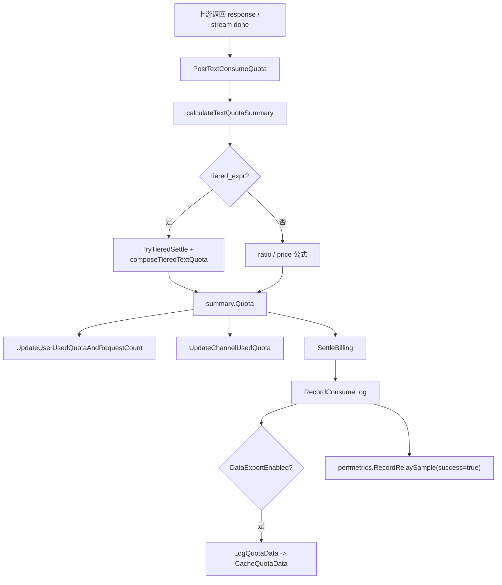
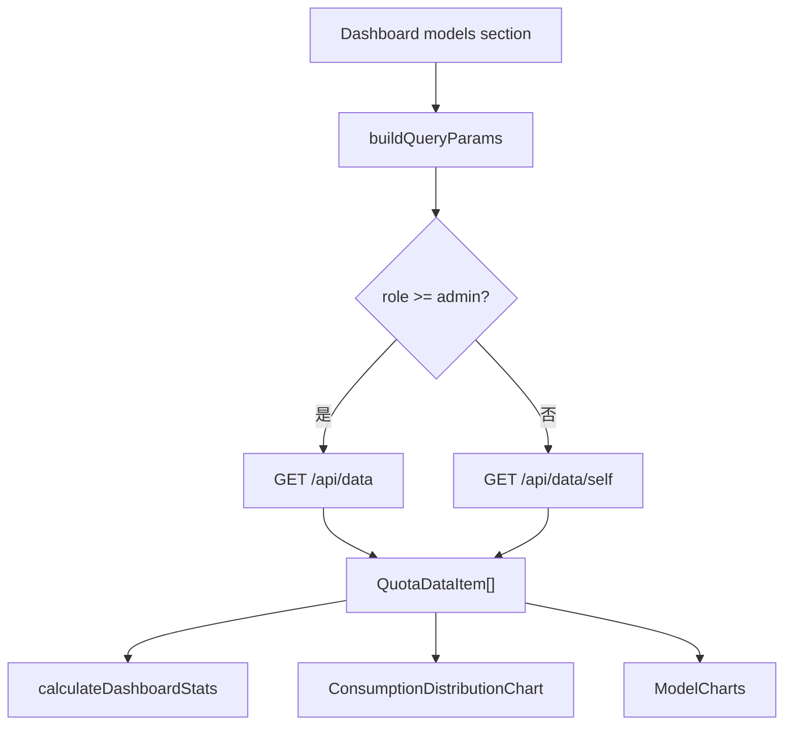
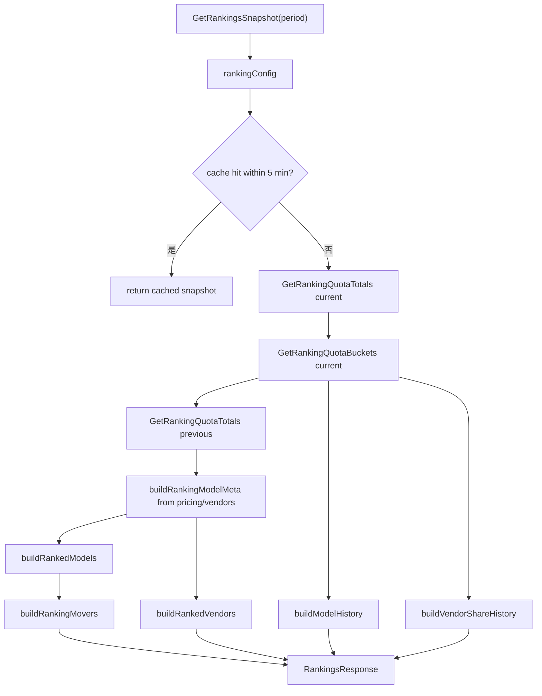
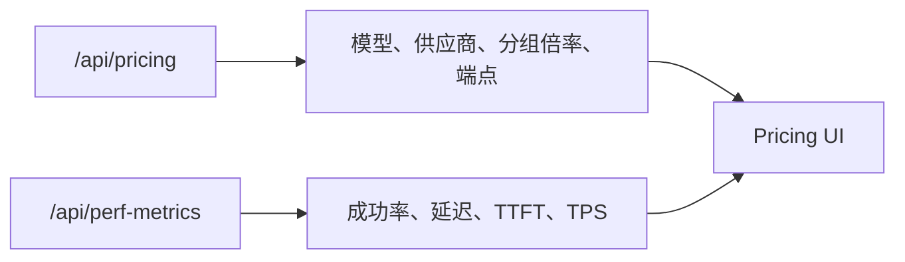

# 用量统计、Dashboard、排行榜与性能指标学习指南

这篇文档专门梳理 new-api 里“请求跑完以后，数据如何变成统计图、排行榜、价格页性能指标和 OpenAI dashboard 兼容接口”的完整链路。

读这块源码时先记住一句话：实时扣费、消费日志、小时级用量聚合、排行榜、性能指标是五套相关但不同的数据面；它们都从 relay 结算附近出发，但分别服务账务正确性、审计查询、Dashboard 图表、公开排行榜和模型性能展示。

## 一、先拆清五类统计数据

| 数据面 | 主要存储 | 主要入口 | 用途 |
| --- | --- | --- | --- |
| 用户/渠道累计额度 | `users.used_quota`、`channels.used_quota` 等 | `model.UpdateUserUsedQuotaAndRequestCount`、`model.UpdateChannelUsedQuota` | 快速显示用户和渠道累计消耗，不适合做多维统计。 |
| 逐条日志 | `logs` | `model.RecordConsumeLog`、`model.RecordTaskBillingLog` | 审计、搜索、RPM/TPM 近期统计、账单明细。 |
| 小时级用量聚合 | `quota_data` | `model.LogQuotaData`、`model.SaveQuotaDataCache` | Dashboard 模型图、用户图、流量 Sankey、排行榜。 |
| relay 性能聚合 | 内存 `hotBuckets`、Redis、`perf_metrics` | `perfmetrics.RecordRelaySample` | 价格页模型性能、Dashboard 性能健康条。 |
| OpenAI dashboard 兼容接口 | 不新增表，读用户或 token quota | `controller.GetSubscription`、`controller.GetUsage` | 兼容 `/dashboard/billing/*` 和 `/v1/dashboard/billing/*`。 |

这五类数据不要混用：

- 扣费和余额正确性主要看 `BillingSession`、用户 quota、token quota、订阅/钱包流水，不靠 `quota_data`。
- `logs` 是逐请求明细，适合查单次请求和审计；`quota_data` 是聚合数据，适合画图和排行榜。
- `perf_metrics` 统计的是成功率、延迟、首 token 时间、TPS，不统计价格。
- 排行榜从 `quota_data.token_used` 聚合模型热度，不从 pricing 表推导。
- OpenAI dashboard 兼容接口只返回兼容格式的额度/用量，不等于项目自己的 Dashboard 页面。

## 二、源码地图

后端核心文件：

| 文件 | 作用 |
| --- | --- |
| `service/text_quota.go` | 文本类请求后结算、写累计用量、写消费日志、记录性能 sample。 |
| `service/quota.go` | 音频/Realtime/WebSocket 等配额计算与结算，成功后也记录性能 sample。 |
| `model/log.go` | `logs` 表、消费日志写入、日志统计、把消费日志同步送入 `quota_data` 缓存。 |
| `model/usedata.go` | `QuotaData` 表结构、小时取整、内存聚合缓存、周期性落库、Dashboard 聚合查询。 |
| `model/usedata_flow.go` | Dashboard 流量 Sankey 的角色差异化维度查询。 |
| `model/usedata_rankings.go` | 排行榜按模型和时间桶聚合 `quota_data`。 |
| `controller/usedata.go` | `/api/data/*` Dashboard 用量接口。 |
| `controller/log.go` | `/api/log/stat` 和 `/api/log/self/stat`，从 `logs` 统计 quota/RPM/TPM。 |
| `service/rankings.go` | 排行榜快照构建、周期配置、vendor 聚合、历史曲线、涨跌榜和内存缓存。 |
| `controller/rankings.go` | `/api/rankings` 入口。 |
| `pkg/perf_metrics/*` | relay 性能 sample、内存热桶、Redis 镜像、DB flush、查询聚合。 |
| `model/perf_metric.go` | `perf_metrics` 表、upsert、查询、保留期清理。 |
| `controller/perf_metrics.go` | `/api/perf-metrics` 和 `/api/perf-metrics/summary`。 |
| `controller/pricing.go` | `/api/pricing` 返回价格、供应商、可用分组和 pricing version。 |
| `controller/performance.go` | Root 管理用 `/api/performance/*`，查看运行时内存、磁盘缓存、日志文件。 |
| `controller/billing.go` | OpenAI dashboard 兼容的 subscription/usage 响应。 |
| `router/api-router.go` | 注册 pricing、perf-metrics、rankings、performance、log、data 路由和权限。 |
| `router/dashboard.go` | 注册 OpenAI dashboard 兼容路由。 |

前端核心文件：

| 文件 | 作用 |
| --- | --- |
| `web/default/src/features/dashboard/api.ts` | Dashboard 对 `/api/data`、`/api/data/flow`、uptime 的 API 封装。 |
| `web/default/src/features/dashboard/index.tsx` | Dashboard 页面分 section：overview、models、flow、users。 |
| `web/default/src/features/dashboard/components/models/log-stat-cards.tsx` | 模型页顶部 quota/request/token/RPM/TPM 卡片。 |
| `web/default/src/features/dashboard/components/models/model-charts.tsx` | 模型维度时间序列图。 |
| `web/default/src/features/dashboard/components/models/consumption-distribution-chart.tsx` | 模型消费分布图。 |
| `web/default/src/features/dashboard/components/models/performance-overview.tsx` | Dashboard 模型页的性能健康概览。 |
| `web/default/src/features/dashboard/components/users/user-charts.tsx` | 管理员用户用量分析。 |
| `web/default/src/features/dashboard/components/flow/flow-charts.tsx` | 流量 Sankey 页面。 |
| `web/default/src/features/dashboard/lib/flow.ts` | 把后端 flow rows 转为 Sankey nodes/links，并按角色控制路径。 |
| `web/default/src/features/rankings/*` | 排行榜页面、API、hooks、图表 section。 |
| `web/default/src/features/performance-metrics/*` | 性能指标 API、类型和格式化工具。 |
| `web/default/src/features/pricing/*` | 价格页模型列表、模型详情、性能 tab 和性能徽标。 |

## 三、一次文本 relay 成功后发生了什么

以文本请求为例，成功拿到上游 usage 后，主结算入口是 `service.PostTextConsumeQuota`：

几个关键点：

- `calculateTextQuotaSummary` 先把 prompt、completion、cache、image、audio、tool call surcharge、group ratio、model ratio 等转换成项目 quota。
- 如果请求绑定了 `TieredBillingSnapshot`，真实 usage 会进入 `TryTieredSettle`，表达式结算成功后覆盖 summary 里的 quota。
- `UpdateUserUsedQuotaAndRequestCount` 和 `UpdateChannelUsedQuota` 是累计用量更新，直接用于用户/渠道管理视图。
- `SettleBilling` 处理预扣和真实结算的差额，可能补扣、退款或确认原预扣。
- `RecordConsumeLog` 是日志入口。只要 `common.DataExportEnabled` 打开，日志写入后会额外调用 `LogQuotaData`。
- 成功路径异步调用 `perfmetrics.RecordRelaySample(relayInfo, true, completionTokens)`，失败路径在 `controller.Relay` 最终错误处记录 `success=false`。

音频/Realtime 路径在 `service/quota.go` 有类似结构：先算音频输入/输出 token 的 quota，再结算、写日志和性能 sample。异步任务和 Midjourney 的计费日志走 `RecordTaskBillingLog`，消费型任务日志也会进入 `quota_data`。

一个细节：`RecordTaskBillingLog` 写入 `quota_data` 时会记录 quota、count、model、group、token、channel、node，但通用任务日志没有像文本日志一样传入 prompt/completion token，所以部分异步任务会影响 Dashboard 的费用/请求图，却不一定明显影响基于 `token_used` 的排行榜。

## 四、`logs`：逐请求明细和近期 RPM/TPM

`model.RecordConsumeLog` 写的是单次请求明细，字段包括：

| 字段 | 含义 |
| --- | --- |
| `user_id`、`username` | 请求所属用户。 |
| `created_at` | 秒级时间戳。 |
| `type` | 日志类型，消费日志为 `LogTypeConsume`。 |
| `prompt_tokens`、`completion_tokens` | 计费 token。 |
| `model_name` | 结算时使用的模型名，部分 gizmo 模型会归一化为通配形式。 |
| `quota` | 本次真实消耗。 |
| `channel_id`、`token_id`、`group` | 渠道、令牌、使用分组。 |
| `use_time`、`is_stream` | 请求耗时和是否流式。 |
| `request_id`、`upstream_request_id` | 本站和上游 request id。 |
| `other` | 额外计费信息，例如 cache、web search、tiered billing、reject reason。 |

`controller.GetLogsStat` 和 `controller.GetLogsSelfStat` 读 `model.SumUsedQuota`：

- `quota` 是按筛选条件统计 `logs.quota` 总和。
- `rpm` 是最近 60 秒内匹配条件的请求数。
- `tpm` 是最近 60 秒内匹配条件的 prompt + completion token 总和。
- 管理员接口可按 username、token、model、channel、group 过滤；用户 self 接口强制使用当前 username。

这意味着 Dashboard 顶部卡片和日志页统计不是简单同源：模型图表主要读 `quota_data`，而日志统计接口读 `logs`，尤其 RPM/TPM 是最近一分钟窗口。

## 五、`quota_data`：从日志到小时级聚合表

`quota_data` 是 Dashboard 和排行榜的核心聚合表。`model.QuotaData` 主要字段是：

| 字段 | 含义 |
| --- | --- |
| `user_id`、`username` | 用户维度。 |
| `model_name` | 模型维度。 |
| `created_at` | 小时桶时间戳，不是原始请求秒级时间。 |
| `use_group` | 计费分组。 |
| `token_id` | API key 维度。 |
| `channel_id` | 渠道维度。 |
| `node_name` | 多节点部署中处理请求的节点名。 |
| `token_used` | prompt + completion token 聚合。 |
| `count` | 请求次数聚合。 |
| `quota` | quota 消耗聚合。 |

`LogQuotaData` 的设计很关键：

1. 把 `CreatedAt` 向下取整到小时。
2. 用 user、username、model、hour、group、token、channel、node 拼出缓存 key。
3. 在进程内 `CacheQuotaData` 聚合 `count/token_used/quota`。
4. 不立即写 DB，减少高并发请求下对聚合表的写压力。

`UpdateQuotaData` 是后台循环：

1. 如果 `common.DataExportEnabled` 开启，调用 `SaveQuotaDataCache`。
2. `SaveQuotaDataCache` 对缓存中的每个小时桶做 upsert/increment。
3. 写完后清空缓存。
4. 睡眠 `common.DataExportInterval` 分钟后继续。

所以 `quota_data` 有两个延迟：

- 只有打开数据导出才会写入。
- 写入受 `DataExportInterval` 影响，不是请求结束立即可见。

这也是为什么“账单余额已经变了，但 Dashboard 图表暂时没刷新”并不一定是错误。

## 六、Dashboard 模型用量接口

`controller/usedata.go` 注册了五个主要接口：

| 接口 | 权限 | 读取逻辑 |
| --- | --- | --- |
| `GET /api/data/` | Admin | 查询所有模型聚合，支持 username 和时间范围。 |
| `GET /api/data/users` | Admin | 按用户聚合 quota/count/token，用于用户分析。 |
| `GET /api/data/self` | User | 查询当前用户，时间范围最多一个月。 |
| `GET /api/data/flow` | Admin | 查询 flow rows，按角色返回不同维度。 |
| `GET /api/data/flow/self` | User | 查询当前用户 flow rows，时间范围最多一个月。 |

普通用户接口限制最多一个月，是为了避免用户随意拉长时间范围扫过多聚合数据。`parseFlowQuotaTimeRange` 对 flow 接口还要求 start/end 都有效、正数且 end 不小于 start。

模型图的后端查询大致是：

- 管理员默认读全站 `quota_data`，可按 username 过滤。
- 用户只读自己的 `user_id`。
- 模型维度会按 `model_name + created_at` 聚合。
- 返回值保留 `quota`、`count`、`token_used`，前端再按粒度和图表偏好二次整理。

前端 `LogStatCards` 会先根据筛选器调用 `getUserQuotaDates`：

注意这里的 `rpm/tpm` 命名在前端卡片中会基于选中时间范围计算平均值，而日志统计接口的 `rpm/tpm` 是最近 60 秒窗口。读源码时要区分“展示指标名称”和“后端具体窗口”。

## 七、流量 Sankey：角色决定路径长度

流量图后端入口是 `model.GetFlowQuotaData`。它读取 `quota_data`，但不同角色看到的维度不同：

| 角色 | 返回维度 |
| --- | --- |
| Root | user、username、node_name、token_id、use_group、model_name、channel_id |
| Admin | user、username、use_group、model_name、channel_id |
| 普通用户 | token_id、use_group、model_name |

后端还会补充名称：

- token 名称从 `tokens` 表补齐；被删除的 token 前端会显示 fallback。
- channel 名称优先从内存缓存取，否则从 DB 取；仍取不到会 fallback 为 `channel-{id}`。
- 查询过滤 `use_group <> ''`，因为 flow 图必须以分组作为路径的一部分。

前端 `web/default/src/features/dashboard/lib/flow.ts` 也有同样的角色路径定义：

| 前端角色 | Sankey 路径 |
| --- | --- |
| `root` | user -> node -> token -> group -> model -> channel |
| `admin` | user -> group -> model -> channel |
| `user` | token -> group -> model |

`FlowCharts` 做的事情比“画一张图”多：

- 根据当前角色选择 `/api/data/flow` 或 `/api/data/flow/self`。
- 支持 quota、tokens、requests 三种度量。
- 支持隐藏敏感标签。
- 支持勾选可见 stage，但至少保留两个 stage，因为 Sankey 需要 link。
- 支持按节点过滤、点击节点/边高亮。
- 支持 top node limit，溢出节点可以合并为 Other 或隐藏。
- 用 `buildFlowSankeySpec` 把内部 graph 转为 VChart sankey spec。

因此，flow 图是“后端按角色裁剪数据 + 前端按角色建路径 + 前端交互过滤”的组合，不是后端直接返回 VChart 数据。

## 八、排行榜：`quota_data` 上的公开热度视图

排行榜入口是 `GET /api/rankings?period=...`，路由用 `HeaderNavModuleAuth("rankings")` 控制。后端 `service.GetRankingsSnapshot` 支持四个周期：

| period | 当前窗口 | history bucket |
| --- | --- | --- |
| `today` | 24 小时 | 1 小时 |
| `week` | 7 天 | 1 天 |
| `month` | 30 天 | 1 天 |
| `year` | 365 天 | 7 天 |

构建流程：

几个实现细节值得注意：

- `model.GetRankingQuotaTotals` 按 `model_name` 汇总 `token_used`，只保留正数，并按 token 总量倒序。
- `GetRankingQuotaBuckets` 按时间桶聚合，MySQL 用 `FLOOR(created_at / bucket) * bucket`，其他库用整数除法表达式，保持三库兼容。
- vendor 信息来自 `model.GetPricing()` 和 `model.GetVendors()`，也就是说排行榜的供应商归属是展示元数据，不影响 token 聚合结果。
- 当前周期会和上一个同长度周期比较，得到 `previous_rank` 和 `growth_pct`。
- 模型榜只返回前 20，历史曲线最多展示前 10 个模型，其余合并为 `Others`。
- vendor share 最多展示前 5 个供应商，其余合并为 `Others`。
- 快照在进程内缓存 5 分钟，避免公开页面频繁打聚合查询。

前端 `web/default/src/features/rankings/index.tsx` 从 URL search 读取 period，调用 `useRankings`，再把 snapshot 拆给三个 section：

- `ModelsSection`：模型榜和模型历史曲线。
- `MarketShareSection`：供应商份额和份额历史。
- `PulseSection`：上升/下降模型。

排行榜回答的是“哪些模型在本站最近被用得多”，不是“哪些模型价格更高”或“哪些模型响应更快”。

## 九、性能指标：从 relay sample 到价格页

性能指标入口在 `pkg/perf_metrics`。它记录的是 relay 侧观察到的表现：

| Sample 字段 | 含义 |
| --- | --- |
| `Model` | `RelayInfo.OriginModelName`，即用户请求的原始模型名。 |
| `Group` | `RelayInfo.UsingGroup`，空时归为 `default`。 |
| `LatencyMs` | 从请求开始到结束的总耗时。 |
| `TtftMs` | 流式请求首个响应到达时间，非流式没有 TTFT。 |
| `Success` | relay 最终是否成功。 |
| `OutputTokens` | 输出 token 数。 |
| `GenerationMs` | 总耗时或首 token 后生成耗时，用来算 TPS。 |

成功路径：

- `service.PostTextConsumeQuota` 在日志写完后异步记录 success sample。
- `service.PostWssConsumeQuota` 和其他成功结算路径也会记录 sample。

失败路径：

- `controller.Relay` 在重试结束后仍有 `newAPIError` 时异步记录 failure sample。
- failure sample 没有 output token，但会计入 request count 和成功率分母。

`Record` 的写入策略：

1. 如果 `perf_metrics_setting.Enabled` 关闭或 model 为空，直接跳过。
2. 计算当前 bucket，默认以设置里的 bucket seconds 为准。
3. 写入进程内 `hotBuckets`，每个 key 是 model + group + bucketTs。
4. 如果 Redis 可用，同步把当前 bucket 的计数写入 Redis hash，TTL 一小时。

flush 策略：

1. `perfmetrics.Init()` 启动 `flushLoop`。
2. 每隔 `FlushIntervalMinutes` 扫描热桶。
3. 只 flush 已完成 bucket，当前 bucket 留在内存中继续累加。
4. 落库用 `model.UpsertPerfMetric`，对 request/success/latency/ttft/output/generation 做增量 upsert。
5. flush 失败会把 drained counters 加回内存桶，避免丢样本。
6. 根据 `RetentionDays` 清理过期 DB 数据。

查询策略：

- `Query(model, group, hours)` 读取 DB 历史 bucket，再合并当前进程 `hotBuckets`。
- `QuerySummaryAll(hours, groups)` 汇总所有模型，按 request count 排序。
- 返回指标包括平均 latency、平均 TTFT、success rate、平均 TPS 和时间序列。

`controller.GetPerfMetricsSummary` 有一个额外过滤：只查询当前有效 group 加 `auto`。`GetPerfMetrics` 返回某个模型的各 group 详情后，也会用当前有效分组过滤掉已不存在的 group。

前端使用位置：

- Dashboard models section 的 `PerformanceOverview` 调 `/api/perf-metrics/summary?hours=24`，显示成功率、平均延迟、TPS 和 top models badge。
- 价格页模型卡片列表可以用同一个 summary 给模型卡片增加延迟、TPS、成功率徽标；因为 summary 的 `RequestCount` 后端只用于排序且不暴露给 JSON，前端主要依赖返回顺序表达“请求量靠前”。
- 价格页模型详情的 `ModelDetailsPerformance` 调 `/api/perf-metrics?model=...&hours=24`，展示分组级 TTFT/latency/success/TPS 和趋势图。
- 性能格式化集中在 `web/default/src/features/performance-metrics/lib/format.ts`。

注意：`perf_metrics` 是 relay 本站观察值，不是 provider 官方 SLA。它会受本站网络、重试、分组、渠道配置、流式/非流式比例影响。

## 十、Pricing API 与性能指标的关系

`GET /api/pricing` 返回的是模型价格目录所需数据：

- `data`：`model.GetPricing()` 的模型价格/元数据列表。
- `vendors`：供应商元数据。
- `group_ratio`：当前用户可见分组倍率；如果用户有 group-to-group 特殊倍率，会覆盖默认倍率。
- `usable_group`：当前用户可用分组。
- `supported_endpoint`：模型支持的端点映射。
- `auto_groups`：当前用户可用 auto group。
- `pricing_version`：前端缓存/兼容用的版本标识。

性能指标不直接塞进 `/api/pricing` 响应。前端价格页先用 `usePricingData` 拉价格目录，再在模型详情或 badge 位置按需拉 `/api/perf-metrics`。这能避免价格列表每次加载都做大量性能聚合查询。

所以价格页中有两条数据流：

## 十一、Root 性能管理接口不是模型性能指标

`controller/performance.go` 下的 `/api/performance/*` 是 Root 管理系统运行状态的接口：

| 接口 | 作用 |
| --- | --- |
| `GET /api/performance/stats` | 返回磁盘缓存统计、Go runtime 内存、goroutine 数、磁盘空间和性能配置。 |
| `DELETE /api/performance/disk_cache` | 清理不活跃磁盘缓存文件。 |
| `POST /api/performance/reset_stats` | 重置磁盘缓存统计。 |
| `POST /api/performance/gc` | 手动触发 Go GC。 |
| `GET /api/performance/logs` | 列出本地日志文件。 |
| `DELETE /api/performance/logs` | 清理日志文件。 |

它和 `/api/perf-metrics` 名字相近，但语义完全不同：

- `/api/performance/*` 是系统运行时和缓存/日志管理，Root only。
- `/api/perf-metrics/*` 是模型 relay 性能统计，挂在 pricing 模块权限下。

## 十二、OpenAI dashboard 兼容接口

`router/dashboard.go` 注册这些路径：

- `/dashboard/billing/subscription`
- `/v1/dashboard/billing/subscription`
- `/dashboard/billing/usage`
- `/v1/dashboard/billing/usage`

这些路由使用 `TokenAuth`，服务一些 OpenAI 生态工具期望的 billing dashboard 格式。

`GetSubscription`：

- 如果 `common.DisplayTokenStatEnabled` 开启，就按当前 token 的 remain/used quota 和过期时间返回。
- 否则按当前 user 的 remain/used quota 返回。
- `SoftLimitUSD`、`HardLimitUSD`、`SystemHardLimitUSD` 会根据站点展示单位转换：USD、CNY 或 TOKENS。
- token 无限额度时，amount 会给一个很大的兼容值。

`GetUsage`：

- 同样按 token 或 user 取已用 quota。
- 按展示单位转换。
- 返回 `OpenAIUsageResponse.TotalUsage = amount * 100`，符合旧 OpenAI dashboard usage 的金额单位习惯。

这组接口不是管理台 Dashboard 的数据源，只是兼容接口。

## 十三、启动和开关

统计链路是否工作，取决于几个启动和配置点：

| 能力 | 关键开关/启动点 | 影响 |
| --- | --- | --- |
| 消费日志 | `common.LogConsumeEnabled` | 关闭后消费日志可能不写，审计和 data export 会受影响。 |
| 用量聚合 | `common.DataExportEnabled` | 关闭后不写 `quota_data`，Dashboard/排行榜会缺数据。 |
| 聚合落库间隔 | `common.DataExportInterval` | 决定 `quota_data` 延迟。 |
| 性能指标 | `perf_metrics_setting.Enabled` | 关闭后 `/api/perf-metrics` 没有新 sample。 |
| 性能 flush 间隔 | `perf_metrics_setting.GetFlushIntervalMinutes()` | 决定历史 bucket 落 `perf_metrics` 的延迟。 |
| 性能保留期 | `RetentionDays` | 决定旧 `perf_metrics` 清理范围。 |
| Redis | `common.RedisEnabled` | 性能当前桶可跨进程辅助读取，但 DB/内存仍是主路径。 |

主进程启动时会启动 `model.UpdateQuotaData()`，负责周期性保存 `quota_data` 缓存；进程退出前也会再保存一次看板缓存，尽量减少重启时丢失尚未落库的聚合数据。性能指标则由 `perfmetrics.Init()` 启动自己的 flush loop。

多节点部署时尤其要注意：

- `quota_data.node_name` 能区分请求在哪个节点处理。
- 每个进程有自己的 `CacheQuotaData` 和 `hotBuckets`。
- `quota_data` 最终靠各节点各自 flush 到同一 DB 聚合。
- `perf_metrics` 当前热桶主要在进程内，Redis hash 只在指定 model+group 的活跃桶查询中补充；历史稳定视图依赖 DB flush。

## 十四、从源码阅读时的主线顺序

建议按这个顺序读：

1. 读 `service/text_quota.go` 的 `PostTextConsumeQuota`，理解真实 usage 结算以后做了哪些副作用。
2. 跳到 `model.RecordConsumeLog`，看日志如何写入，如何进入 `LogQuotaData`。
3. 读 `model/usedata.go`，理解小时桶、缓存 key 和周期性 upsert。
4. 读 `controller/usedata.go`，把 Dashboard API 路由和权限对上。
5. 读 `web/default/src/features/dashboard/api.ts` 和 `dashboard/index.tsx`，看前端如何选择接口和 section。
6. 读 `model/usedata_flow.go` 和 `dashboard/lib/flow.ts`，理解 flow 图为什么不同角色路径不同。
7. 读 `model/usedata_rankings.go` 和 `service/rankings.go`，理解排行榜如何从 token 聚合变成模型/vendor/历史/涨跌。
8. 读 `pkg/perf_metrics/metrics.go`、`flush.go`、`model/perf_metric.go`，理解性能 sample 的内存、Redis、DB 三层。
9. 读 `controller/perf_metrics.go`、价格页 `ModelDetailsPerformance`，把性能指标接到 UI。
10. 最后读 `controller/billing.go` 和 `router/dashboard.go`，理解兼容接口的边界。

## 十五、常见误区

| 误区 | 正确理解 |
| --- | --- |
| Dashboard 图表直接读 `logs`。 | 主要读 `quota_data`，日志统计接口只服务日志页/部分卡片语义。 |
| `quota_data.created_at` 是请求原始时间。 | 它是小时桶时间，`LogQuotaData` 会向下取整。 |
| 余额正确性依赖 `quota_data`。 | 余额正确性依赖扣费/结算和用户/token/订阅余额，`quota_data` 是分析聚合。 |
| 排行榜是按 quota 排名。 | 当前模型排行榜按 `token_used` 排名。 |
| 异步任务一定会进入 token 排行榜。 | 通用任务消费日志会写 quota/count，但不一定写 token_used，因此更明显影响费用图而非 token 排名。 |
| 排行榜 vendor 来自渠道类型。 | vendor 主要从 pricing/model vendor 元数据映射。 |
| `/api/performance` 和 `/api/perf-metrics` 是一回事。 | 前者是 Root 系统运行管理，后者是模型 relay 性能。 |
| 关闭 DataExport 只影响导出。 | 还会影响 Dashboard/排行榜所需的 `quota_data`。 |
| 性能 success rate 等于 provider SLA。 | 它是本站 relay 观测到的成功率，受本地配置、网络、渠道和重试影响。 |
| perf summary 返回了请求数给前端展示。 | 后端用 request count 排序，但该字段 JSON 隐藏，前端只能利用排序和其它性能字段。 |
| 用户 self flow 能看到渠道。 | 普通用户 flow 只到 token -> group -> model，不暴露渠道和节点。 |
| OpenAI dashboard 兼容接口就是管理台 Dashboard。 | 它只是返回兼容 billing 格式，管理台 Dashboard 用 `/api/data/*`。 |

## 十六、Go 学习点

这条链路很适合练习 Go 后端常见模式：

- 用 struct 表达聚合行，例如 `QuotaData`、`PerfMetric`、`RankedModel`。
- 用 GORM query builder 保持 SQLite/MySQL/PostgreSQL 兼容。
- 用 `sync.Map` 和原子计数器承接高频性能 sample。
- 用后台 goroutine 周期性 flush，把请求热路径和 DB 写压力解耦。
- 用 upsert/increment 合并聚合数据，避免每次请求都插入一行分析数据。
- 用 role 分支控制数据维度，既复用查询逻辑又保护敏感信息。
- 用 DTO/response struct 明确 API 响应形状，让前端类型稳定。
- 用前端 React Query 缓存低频聚合接口，避免图表页面频繁打后端。

读完这篇后，你应该能回答三类问题：

- 一次请求成功后，余额、日志、`quota_data`、`perf_metrics` 分别在哪里更新。
- Dashboard、排行榜、价格页性能指标分别读哪张表、哪个 API、哪段前端代码。
- 如果某个图表没有数据，该从开关、日志、聚合缓存、落库任务、权限和前端筛选哪几层排查。
