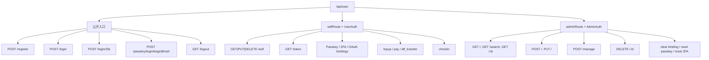
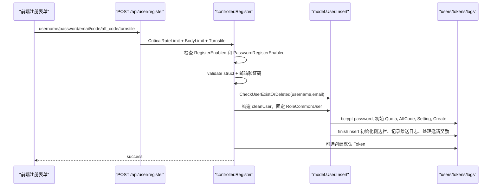
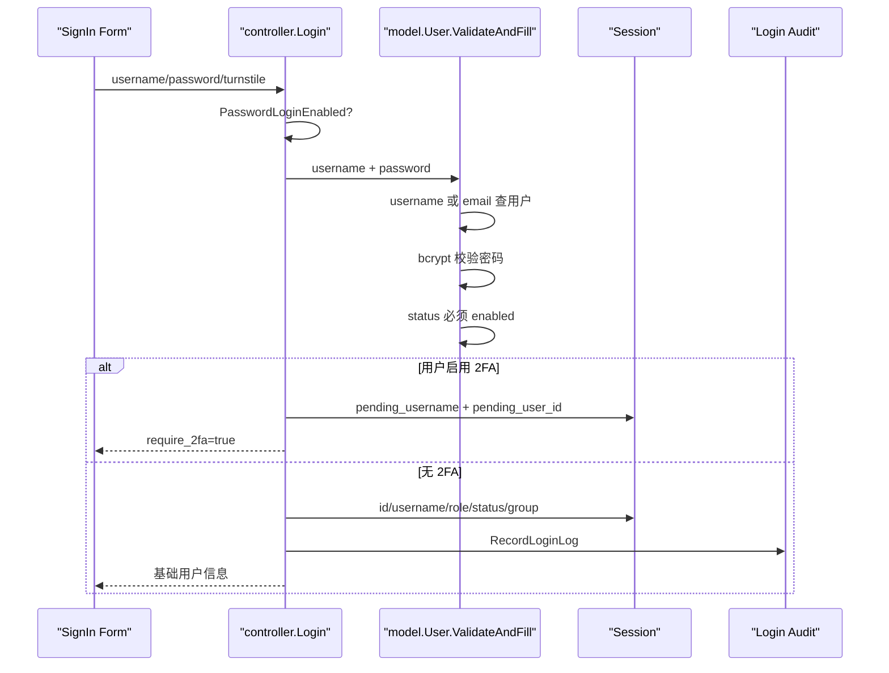
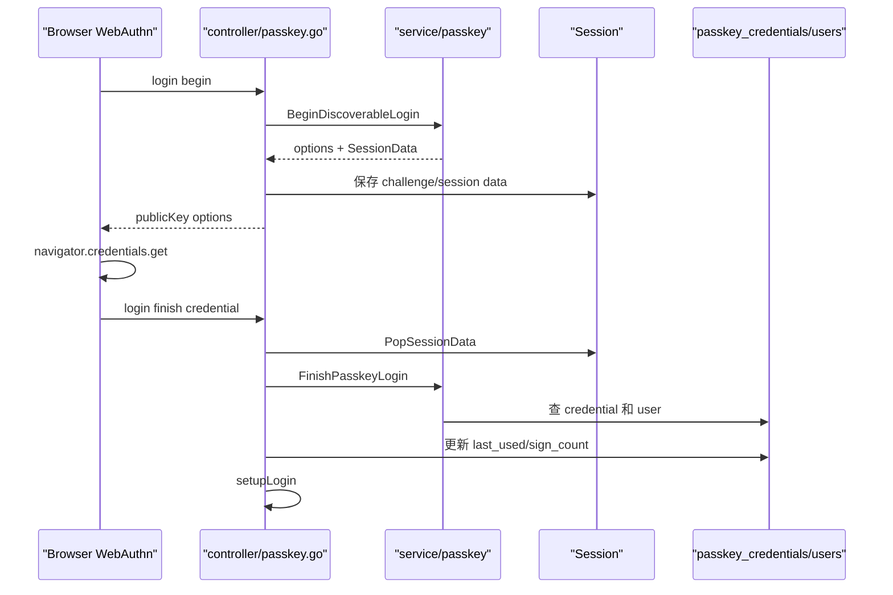
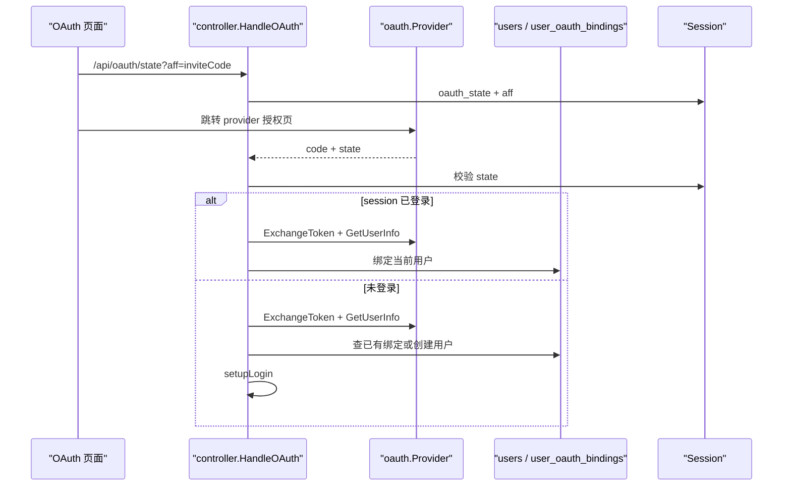
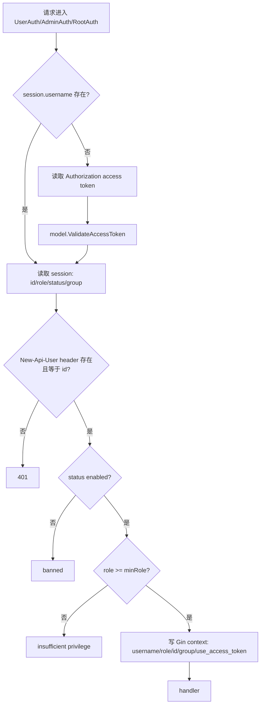

# 用户账户生命周期源码学习指南

本文面向已经掌握 Go 基本语法、希望通过 new-api 学习真实 Web 项目的读者。阅读目标不是只记住某几个接口，而是把“一个用户从注册、登录、绑定安全能力、使用余额、被管理员管理，到最终删除”这条生命周期串成一张可执行的源码地图。

new-api 的账户系统横跨四层：

- `router/`：把公开接口、自助接口、管理员接口分组挂载。
- `controller/`：解析请求、检查开关、做权限分流、组织 model/service 调用。
- `model/`：保存用户、绑定、2FA、Passkey、兑换码、充值订单、签到记录等状态。
- `web/default/src/features/`：默认前端把登录、个人中心、钱包、用户管理等页面接到这些 API 上。

读这篇文档时建议开两个窗口：左边看本文流程，右边跳到对应源码。每个章节都尽量标出“入口文件 -> 关键函数 -> 状态变化 -> Go 学习点”。

## 1. 总览：账户系统处理哪些事

账户系统可以拆成八条主线：

1. 公开身份入口：注册、密码登录、2FA 登录、Passkey 登录、OAuth 登录、密码重置。
2. 登录态和鉴权：Session Cookie、`New-Api-User` 头、系统 access token、`UserAuth/AdminAuth/RootAuth`。
3. 自助资料：`/api/user/self` 读取资料，修改显示名、密码、语言、侧边栏设置，删除账号。
4. 安全绑定：邮箱、GitHub、Discord、OIDC、LinuxDO、WeChat、Telegram、自定义 OAuth、Passkey、2FA。
5. 额度/钱包：用户余额 `Quota`、已用 `UsedQuota`、请求数、兑换码、在线充值、消费结算。
6. 邀请：邀请码、邀请奖励、邀请奖励转余额。
7. 签到：每天一次领取随机额度，跨数据库处理并发。
8. 管理端：用户列表、搜索、创建、更新、禁用、启用、软删/硬删、升降级、配额调整、清绑定、重置 Passkey/2FA。

核心源码入口：

| 主题 | 后端入口 | 前端入口 |
| --- | --- | --- |
| 路由分层 | `router/api-router.go` | `web/default/src/routes` |
| 密码登录/注册/自助用户 | `controller/user.go` | `web/default/src/features/auth`、`web/default/src/features/profile` |
| 邮箱验证码/密码重置 | `controller/misc.go` | `web/default/src/features/auth/forgot-password`、`reset-password-confirm` |
| OAuth | `controller/oauth.go`、`oauth/*`、`controller/custom_oauth.go` | `web/default/src/features/auth/lib/oauth.ts`、`profile/components/tabs/account-bindings-tab.tsx` |
| Passkey | `controller/passkey.go`、`model/passkey.go`、`service/passkey` | `web/default/src/features/auth/passkey`、`profile/components/passkey-card.tsx` |
| 2FA | `controller/twofa.go`、`model/twofa.go` | `web/default/src/features/profile/components/two-fa-card.tsx` |
| 钱包/充值 | `controller/user.go`、`controller/topup.go`、`model/topup.go`、`model/redemption.go` | `web/default/src/features/wallet` |
| 签到 | `controller/checkin.go`、`model/checkin.go` | `web/default/src/features/profile/components/checkin-calendar-card.tsx` |
| 管理用户 | `controller/user.go`、`service/authz` | `web/default/src/features/users` |

## 2. 路由把账户系统切成三层

`router/api-router.go` 是最适合建立账户系统全局图的地方。`SetApiRouter` 下 `/api/user` 这一段大致分三层：

```go
userRoute := apiRouter.Group("/user")
{
    // 公开入口：注册、登录、Passkey 登录、登出、用户分组

    selfRoute := userRoute.Group("/")
    selfRoute.Use(middleware.UserAuth())
    {
        // 登录用户自助接口：self、models、token、passkey、aff、topup、setting、2FA、checkin、OAuth binding
    }

    adminRoute := userRoute.Group("/")
    adminRoute.Use(middleware.AdminAuth())
    {
        // 管理员接口：列表、搜索、详情、创建、更新、manage、删除、清绑定、重置安全能力
    }
}
```

这层分组带来两个重要结论：

- 登录/注册/Passkey 登录是匿名接口，但通常叠加 `CriticalRateLimit`、`AnonymousRequestBodyLimit`、`TurnstileCheck`。
- 普通用户和管理员接口共用 `/api/user` 前缀，但靠 `UserAuth` 与 `AdminAuth` 分层。
- Root 专属能力不一定都在 `/api/user` 下，比如自定义 OAuth provider 管理挂在 `/api/custom-oauth-provider` 并使用 `RootAuth`。

用 Mermaid 画出来：



Go 学习点：Gin 的 `Group` 和 `Use` 是真实项目组织权限边界的核心工具。读源码时先看路由分组，比直接搜索 controller 更容易建立全局结构。

## 3. `User` 模型是账户聚合根

`model/user.go` 的 `User` 是账户系统最核心的数据结构。它不仅保存用户名密码，还聚合了角色、状态、绑定 ID、额度、邀请、设置、支付 customer 等字段。

关键字段：

| 字段 | 含义 |
| --- | --- |
| `Id` | 用户主键 |
| `Username` | 登录名，唯一索引 |
| `Password` | bcrypt hash 后的密码 |
| `OriginalPassword` | 只用于修改密码校验，`gorm:"-:all"` 不入库 |
| `DisplayName` | 展示名 |
| `Role` | 角色：普通用户、管理员、Root |
| `Status` | 状态：启用、禁用等 |
| `Email` | 邮箱绑定 |
| `GitHubId/DiscordId/OidcId/WeChatId/TelegramId/LinuxDOId` | 内置第三方绑定 |
| `AccessToken` | 用户系统 access token，用于管理类 API 的 header 鉴权 |
| `Quota` | 当前钱包余额 |
| `UsedQuota` | 已消费额度 |
| `RequestCount` | 请求次数 |
| `Group` | 用户分组，影响可用模型、价格、充值倍率等 |
| `AffCode/AffCount/AffQuota/AffHistoryQuota/InviterId` | 邀请系统状态 |
| `DeletedAt` | GORM 软删除字段 |
| `Setting` | JSON 文本，结构化为 `dto.UserSetting` |
| `Remark` | 管理员备注，自助接口会隐藏 |
| `StripeCustomer` | Stripe customer 标识 |
| `AdminPermissions` | 非持久字段，管理端返回细粒度权限矩阵 |

`User` 旁边有几个非常值得学的辅助方法：

- `GetSetting` / `SetSetting`：把 `Setting` 文本列与 `dto.UserSetting` 结构体互转。
- `ToBaseUser`：把完整用户缩成缓存用的 `UserBase`。
- `Insert` / `InsertWithTx`：创建用户时 hash 密码、初始化额度、邀请码、设置。
- `UpdateWithTx`：自助资料更新时明确 `Omit("quota", "used_quota", "request_count")`，避免覆盖账务字段。
- `EditWithTx`：管理员编辑基础字段时用 map 精确更新 `username/display_name/group/remark/password`。
- `Delete` / `HardDelete`：区分软删除和硬删除。
- `ClearBinding`：按 binding type 清空内置第三方绑定字段。

Go 学习点：

- `gorm:"-:all"` 表示字段只存在于 Go 结构体，不参与数据库读写，很适合临时请求字段。
- 更新模型时不能盲目 `Save`。new-api 在用户资料更新里显式保护 `quota/used_quota/request_count`，这是账务系统的重要边界。
- `Setting` 使用文本列 + Go DTO，而不是数据库 JSON 类型，有利于 SQLite/MySQL/PostgreSQL 同时支持。

## 4. 注册流程：从表单到用户、默认令牌和邀请奖励

前端注册入口：

- `web/default/src/features/auth/sign-up/components/sign-up-form.tsx`
- `web/default/src/features/auth/api.ts` 的 `register`
- 表单 schema 在 `web/default/src/features/auth/constants.ts`

后端入口：

- `POST /api/user/register`
- `controller.Register`
- `model.User.Insert`

注册流程：



几个容易忽略的细节：

1. 注册不是直接把请求体里的 `model.User` 入库。Controller 会构造 `cleanUser`，只拷贝允许字段，并固定 `Role: common.RoleCommonUser`。这防止客户端伪造 `role/status/quota`。
2. `CheckUserExistOrDeleted` 使用 `Unscoped()`，软删除用户的用户名/邮箱也会被认为已存在。这样避免删除后立刻抢占旧身份。
3. `Insert` 会将密码通过 `common.Password2Hash` 转成 bcrypt hash，再写库。
4. 新用户初始额度来自 `common.QuotaForNewUser`。
5. 用户自己的邀请码是 `AffCode`，注册请求里的 `aff_code` 表示邀请人的邀请码。Controller 先用 `model.GetUserIdByAffCode` 换成 `InviterId`。
6. 邀请奖励受 `operation_setting.IsPaymentComplianceConfirmed()` 控制：合规确认后才发放受邀者奖励和邀请者奖励。
7. 如果 `constant.GenerateDefaultToken` 打开，会创建一个默认 API Key，默认无限额度并可使用 auto group。

Go 学习点：

- “请求体结构体”和“入库结构体”不一定是同一个对象。真实业务里应使用白名单构造。
- `Insert` 与 `InsertWithTx` 是同一业务动作的普通版和事务版。OAuth 注册需要用户和绑定表原子写入，所以使用 `InsertWithTx`。
- 这里的 controller 仍有直接 `encoding/json` 用法。新代码应按项目规范使用 `common.DecodeJson/common.Marshal/common.Unmarshal`。

## 5. 密码登录：Session 是后台页面登录态

前端入口：

- `web/default/src/features/auth/sign-in/components/user-auth-form.tsx`
- `web/default/src/features/auth/api.ts` 的 `login`
- 登录成功后 `web/default/src/features/auth/hooks/use-auth-redirect.ts` 会拉 `/api/user/self`

后端入口：

- `POST /api/user/login`
- `controller.Login`
- `model.User.ValidateAndFill`
- `controller.setupLogin`

密码登录流程：



`ValidateAndFill` 有一个重要安全策略：密码错误、用户不存在、用户被禁用，最终对外都倾向返回“用户名或密码错误”。这能减少账户状态枚举。

`setupLogin` 做三件事：

1. `model.UpdateUserLastLoginAt(user.Id)` 更新最近登录时间。
2. 往 session 写 `id/username/role/status/group`。
3. `recordLoginAudit` 记录登录方式、IP、User-Agent。

前端不会只信登录接口返回的少量字段。`useAuthRedirect` 登录成功后会再请求 `/api/user/self` 获取完整用户快照，并存入 Zustand auth store 与 localStorage。

## 6. 2FA 登录：pending session 到正式 session

2FA 有两类流程：

- 登录时的二次验证：密码正确后还不能登录，只写 `pending_user_id`。
- 已登录后的 2FA 管理：设置、启用、禁用、重新生成备用码。

登录二次验证入口：

- `POST /api/user/login/2fa`
- `controller.Verify2FALogin`
- `model.GetTwoFAByUserId`
- `TwoFA.ValidateTOTPAndUpdateUsage`
- `TwoFA.ValidateBackupCodeAndUpdateUsage`

流程：

1. `Login` 发现 `model.IsTwoFAEnabled(user.Id)` 为 true。
2. 写 session：`pending_username`、`pending_user_id`。
3. 前端跳转到 `/otp`。
4. `Verify2FALogin` 从 session 取 pending user。
5. 校验 TOTP 或备用码。
6. 清掉 pending session。
7. 调 `setupLogin` 写正式登录 session。

`model/twofa.go` 里可以学到完整的 TOTP 状态机：

- `TwoFA` 保存 secret、是否启用、失败次数、锁定到期时间、最后使用时间。
- `TwoFABackupCode` 保存备用码 hash，而不是明文备用码。
- 验证失败会增加失败次数，达到阈值后锁定。
- 验证成功会重置失败次数并记录使用时间。
- 备用码使用后会标记为 used。

自助 2FA 管理路由：

- `GET /api/user/2fa/status`
- `POST /api/user/2fa/setup`
- `POST /api/user/2fa/enable`
- `POST /api/user/2fa/disable`
- `POST /api/user/2fa/backup_codes`

管理员 2FA 路由：

- `GET /api/user/2fa/stats`
- `DELETE /api/user/:id/2fa`

Go 学习点：

- 2FA pending session 是一种“半登录态”。它证明密码正确，但不能访问 `UserAuth` 接口。
- 备用码不应明文保存，和密码一样要 hash。
- 安全功能的状态表通常不只保存 enabled，还要保存失败次数、锁定时间、最后使用时间等审计状态。

## 7. Passkey：WebAuthn challenge 也放在 session 里

Passkey 登录和注册都分 begin/finish 两步：

| 场景 | begin | finish |
| --- | --- | --- |
| 登录 | `POST /api/user/passkey/login/begin` | `POST /api/user/passkey/login/finish` |
| 注册 | `POST /api/user/passkey/register/begin` | `POST /api/user/passkey/register/finish` |
| 安全验证 | `POST /api/user/passkey/verify/begin` | `POST /api/user/passkey/verify/finish` |

核心文件：

- `controller/passkey.go`
- `model/passkey.go`
- `service/passkey/service.go`
- `service/passkey/session.go`
- `web/default/src/features/auth/passkey`
- `web/default/src/lib/passkey.ts`

登录流程：



`model.PasskeyCredential` 保存：

- `UserID`
- `CredentialID`
- `PublicKey`
- `AttestationType`
- `Transport`
- `SignCount`
- backup / discoverable 相关标志
- `LastUsedAt`

项目目前是每用户一个 Passkey。`UpsertPasskeyCredential` 会先删除旧 credential，再创建新 credential。

安全边界：

- begin 阶段生成的 WebAuthn challenge 必须保存到 session。
- finish 阶段用 `PopSessionData` 读取并删除 challenge，避免重放。
- 删除 Passkey 时会根据已有安全能力要求 step-up verification。
- 管理员可以重置用户 Passkey，但仍受角色层级限制。

Go 学习点：

- WebAuthn 很适合学习“服务端 challenge + 浏览器签名 + 服务端校验”的状态机。
- begin/finish 这种二阶段 API 通常需要 session 或短 TTL cache 保存中间状态。

## 8. OAuth：内置 provider 字段 + 自定义 provider 绑定表

OAuth 入口：

- `GET /api/oauth/state`
- `GET /api/oauth/:provider`
- `POST /api/oauth/email/bind`
- 非标准：`/api/oauth/wechat`、`/api/oauth/telegram/login`

核心文件：

- `controller/oauth.go`
- `oauth/provider.go`
- `oauth/github.go`、`oauth/discord.go`、`oauth/oidc.go`、`oauth/linuxdo.go`、`oauth/generic.go`
- `model/user_oauth_binding.go`
- `controller/custom_oauth.go`

统一 OAuth provider 接口包括：

```go
type Provider interface {
    GetName() string
    IsEnabled() bool
    ExchangeToken(ctx context.Context, code string, c *gin.Context) (*OAuthToken, error)
    GetUserInfo(ctx context.Context, token *OAuthToken) (*OAuthUser, error)
    IsUserIDTaken(providerUserID string) bool
    FillUserByProviderID(user *model.User, providerUserID string) error
    SetProviderUserID(user *model.User, providerUserID string)
    GetProviderPrefix() string
}
```

登录流程：



绑定模型分两种：

1. 内置 provider：`GitHubId/DiscordId/OidcId/WeChatId/TelegramId/LinuxDOId` 直接写在 `users` 表。
2. 自定义 OAuth provider：写入 `user_oauth_bindings` 表，字段包括 `user_id/provider_id/provider_user_id`。

为什么自定义 provider 不继续往 `users` 表加字段？因为 provider 数量是动态的，扩展表比不断迁移用户表更适合。

OAuth 注册也会处理邀请码：`GenerateOAuthCode` 可把 `aff` 存进 session，`findOrCreateOAuthUser` 创建用户时再取出 inviter id。

GitHub 还有一个迁移细节：新版本使用不可变 numeric id，同时兼容旧版 login 字符串作为 legacy id。

Go 学习点：

- 接口抽象让 GitHub、Discord、OIDC、LinuxDO、自定义 OAuth 都能复用 `HandleOAuth`。
- 自定义扩展表是典型的“固定字段 + 扩展关系”的建模方式。
- OAuth state 校验是 CSRF 防护核心，必须在 token exchange 之前执行。

## 9. UserAuth/AdminAuth/RootAuth：后台 API 的登录态检查

核心文件：

- `middleware/auth.go`
- `main.go` 的 session 初始化
- `web/default/src/lib/api.ts`
- `web/default/src/stores/auth-store.ts`

`authHelper(c, minRole)` 是后台 API 鉴权核心。它支持两种身份来源：

1. Session Cookie：后台页面常规登录态。
2. `Authorization` header 中的用户 access token：`model.ValidateAccessToken`。

但无论哪种方式，都要求请求带 `New-Api-User` header，并且 header 中的 user id 必须与 session/access-token user id 一致。

流程：



`UserAuth`、`AdminAuth`、`RootAuth` 只是传入不同的 `minRole`：

- `UserAuth`：普通用户及以上。
- `AdminAuth`：管理员及以上。
- `RootAuth`：Root 用户。

管理员/root 写接口还会在 auth helper 内启动审计兜底。这样即使某个 handler 忘了手动记录管理日志，鉴权层也能补一条基础审计。

前端 `auth-store.ts` 会把用户快照存到 localStorage，并把 `uid` 保存起来。Axios 请求时带 Cookie，同时用 `uid` 生成 `New-Api-User`。这意味着 Cookie 有效但本地 `uid` 丢失时，后台 API 仍会被拒绝。

Go 学习点：

- 中间件可以既做鉴权，也做 context 注入，还可以包住 handler 做审计。
- Session 内保存 `role/status/group` 会带来“状态快照”问题：管理员改状态后需要配合缓存失效、重新登录或后续请求刷新策略来避免旧状态滞后。

## 10. `/api/user/self`：个人中心的数据聚合点

前端入口：

- `web/default/src/features/profile/index.tsx`
- `web/default/src/features/profile/api.ts`
- `web/default/src/features/profile/hooks/use-profile.ts`

后端入口：

- `GET /api/user/self`
- `controller.GetSelf`

`GetSelf` 从 DB 读取当前用户，隐藏管理员备注 `Remark`，再组装一个响应 map。它返回的信息比登录接口多得多：

- id、username、display_name
- role、status、group
- email、OAuth 绑定字段
- quota、used_quota、request_count
- aff_code、aff_count、aff_quota、aff_history_quota、inviter_id
- linux_do_id、stripe_customer
- setting 原始 JSON
- sidebar_modules
- permissions，包括 `admin_permissions`

为什么登录后还要请求 `/api/user/self`？因为登录接口只返回基础身份，`self` 是前端初始化菜单、权限、余额、绑定状态、语言偏好的完整用户快照。

前端 auth store 保存的 user 快照来自这里：

- `auth.setUser(user)` 写 Zustand 状态。
- 同时写 localStorage `user`。
- `saveUserId(user.id)` 写 localStorage `uid`，供 `New-Api-User` header 使用。

## 11. `PUT /api/user/self`：资料、密码、语言、侧边栏设置共用入口

`controller.UpdateSelf` 先把请求体解析成 `map[string]interface{}`，然后按字段分流：

1. 如果请求里有 `sidebar_modules`：只更新 `dto.UserSetting.SidebarModules`。
2. 如果请求里有 `language`：只更新 `dto.UserSetting.Language`。
3. 否则按普通资料更新处理：username、display_name、password、original_password。

资料/密码更新流程：

1. 请求体转回 `model.User`。
2. 如果 password 为空，临时放入 `"$I_LOVE_U"` 通过 validator，再还原为空。这是历史写法。
3. 构造 `cleanUser`，只允许更新当前用户的 `Username/Password/DisplayName`。
4. `checkUpdatePassword` 校验原密码。
5. `cleanUser.Update(updatePassword)`。
6. `UpdateWithTx` hash 新密码，并 `Omit("quota", "used_quota", "request_count")` 更新。
7. 更新用户缓存。

密码修改有两个边界：

- 当前用户已有密码时，必须提供正确原密码。
- 如果当前用户密码为空，允许第一次绑定密码时不校验旧密码。

Go 学习点：

- 同一个 endpoint 可以根据字段做轻量分支，但文档和测试要写清楚，否则前端容易误用。
- 资料更新必须保护账务字段，不能让前端提交的 `quota` 覆盖余额。

## 12. `PUT /api/user/setting`：通知和用户偏好

`dto/user_settings.go` 的 `UserSetting` 是用户设置结构：

- `NotifyType`
- `QuotaWarningThreshold`
- `WebhookUrl/WebhookSecret`
- `NotificationEmail`
- `BarkUrl`
- `GotifyUrl/GotifyToken/GotifyPriority`
- `UpstreamModelUpdateNotifyEnabled`
- `AcceptUnsetRatioModel`
- `RecordIpLog`
- `SidebarModules`
- `BillingPreference`
- `Language`

`controller.UpdateUserSetting` 负责通知设置：

1. 校验 `notify_type` 必须是 email/webhook/bark/gotify。
2. 校验额度预警阈值大于 0。
3. webhook/bark/gotify 类型校验 URL 和必要 token。
4. email 类型校验通知邮箱格式。
5. 管理员才可以更新 `UpstreamModelUpdateNotifyEnabled`。
6. 构造新的 `dto.UserSetting` 并写入 `model.UpdateUserSetting`。

注意：这个 handler 构造了一个新的 `dto.UserSetting`，只保留它关心的设置字段。语言和侧边栏更新走 `PUT /api/user/self` 的分支，以避免被通知设置覆盖。

`UserSetting` 后续会被多个系统读取：

- `model.GetUserSetting` 和 `model.GetUserCache` 用于缓存。
- relay 计费读取 `BillingPreference`。
- 日志和通知读取 `RecordIpLog`、通知渠道。
- i18n 读取 `Language`。

## 13. 删除账号：普通用户软删，管理员可硬删

普通用户自删：

- 路由：`DELETE /api/user/self`
- Handler：`controller.DeleteSelf`
- Model：`model.DeleteUserById` -> `user.Delete`
- 行为：Root 不能自删，普通用户走 GORM 软删除。

管理员删除：

- 路由：`DELETE /api/user/:id`
- Handler：`controller.DeleteUser`
- Model：`model.HardDeleteUserById`
- 行为：检查操作者角色必须高于目标用户；硬删除前删除自定义 OAuth bindings。

`ManageUser` 的 `"delete"` 动作则是管理员软删，并且会额外清理该用户的 token cache，避免已经缓存的 API Key 在 TTL 内继续通过。

Go 学习点：

- `gorm.DeletedAt` + `DB.Delete` 是软删除。
- `Unscoped().Delete` 是硬删除。
- 用户身份类数据是否软删，影响后续用户名/邮箱能否复用、审计日志是否能追溯。

## 14. 邀请：`AffCode`、奖励池和转余额

邀请相关字段：

- `AffCode`：用户自己的邀请码。
- `InviterId`：用户注册时使用的邀请码对应的邀请人。
- `AffCount`：邀请成功人数。
- `AffQuota`：邀请奖励待转余额。
- `AffHistoryQuota`：历史邀请奖励总额。

关键函数：

- `controller.GetAffCode`
- `controller.TransferAffQuota`
- `model.GetUserIdByAffCode`
- `model.inviteUser`
- `model.User.TransferAffQuotaToQuota`
- `model.User.finishInsert`

注册时：

1. 请求体的 `aff_code` 被当作邀请人的邀请码。
2. `GetUserIdByAffCode` 找到 inviter id。
3. 用户创建后，`finishInsert` 判断支付合规是否确认。
4. 给受邀者加 `QuotaForInvitee`。
5. 给邀请者增加 `AffCount/AffQuota/AffHistoryQuota`。

转余额时：

1. `TransferAffQuota` 先要求支付合规确认。
2. 读取当前用户。
3. 绑定 JSON：`{ "quota": 123 }`。
4. `TransferAffQuotaToQuota` 检查额度不得小于 `QuotaPerUnit`。
5. 事务内重新读取用户并尝试行锁。
6. 检查 `AffQuota` 是否足够。
7. `AffQuota -= quota`，`Quota += quota`。

Go 学习点：

- 邀请奖励没有直接进余额，而是先进 `AffQuota`，再由用户主动转入 `Quota`。
- 转账类操作要在事务里二次检查余额，不能只信事务外读到的值。

## 15. 钱包和充值：兑换码、在线支付、订单幂等

钱包相关前端主要在 `web/default/src/features/wallet`：

- `wallet/index.tsx` 拉当前用户和充值配置。
- `api.ts` 封装 topup、pay、amount、历史订单等 API。
- `hooks/use-redemption.ts` 调兑换码充值。
- `hooks/use-affiliate.ts` 调邀请码和邀请奖励转余额。

后端分三类：

1. 兑换码：`POST /api/user/topup` -> `controller.TopUp` -> `model.Redeem`。
2. 在线支付配置/金额/下单：`controller/topup.go`。
3. 支付回调/补单：`model.TopUp` 状态机和各 provider handler。

### 15.1 兑换码

`controller.TopUp` 有一个用户级锁：

- `topUpLocks sync.Map`
- `topUpTryLock`
- 每个 user id 对应一个非阻塞锁

这样同一用户并发提交兑换码时，第二个请求会收到“正在处理”。

`model.Redeem` 的事务逻辑：

1. 检查 key 和 user id。
2. 根据数据库类型选择 key 列引用：MySQL/SQLite 用反引号，PostgreSQL 用双引号。
3. `FOR UPDATE` 查询兑换码。
4. 检查状态 enabled。
5. 检查未过期。
6. 用户 `quota = quota + redemption.Quota`。
7. 兑换码状态改 used，记录 used user 和 redeemed time。
8. 记录充值日志。

### 15.2 在线充值

`GetTopUpInfo` 会返回：

- 可用支付方式。
- 是否启用兑换码。
- 是否已确认支付合规条款。
- 最低充值额度。
- 预设金额和折扣。
- Stripe/Waffo/Creem/Waffo Pancake 等 provider 开关。

金额计算在 `getPayMoney`：

- 如果显示类型是 tokens，先用 `QuotaPerUnit` 把 tokens 换成金额单位。
- 读取用户分组 topup ratio。
- 乘以系统价格 `operation_setting.Price`。
- 如果命中预设金额折扣，再乘折扣。
- 使用 `shopspring/decimal` 避免浮点误差。

### 15.3 订单幂等

`model.TopUp` 字段：

- `UserId`
- `Amount`
- `Money`
- `TradeNo`
- `PaymentMethod`
- `PaymentProvider`
- `CreateTime`
- `CompleteTime`
- `Status`

状态通常是 pending/success/failed。回调处理时通过 trade no 查订单，要求：

- provider 匹配。
- 状态必须是 pending。
- 在事务内改成 success。
- 给用户增加 quota。

`UpdatePendingTopUpStatus` 和 `Recharge` 都体现了这个模式。

Go 学习点：

- 支付回调必须幂等，不能让重复 webhook 重复加钱。
- 金额计算尽量用 decimal。
- 涉及保留字、行锁、事务时要考虑 SQLite/MySQL/PostgreSQL 差异。

## 16. 签到：唯一索引防重复，数据库差异分支

签到入口：

- `GET /api/user/checkin`
- `POST /api/user/checkin`
- `controller/checkin.go`
- `model/checkin.go`
- 前端 `web/default/src/features/profile/components/checkin-calendar-card.tsx`

`Checkin` 模型字段：

- `UserId`
- `CheckinDate`
- `QuotaAwarded`
- `CreatedAt`

它有一个联合唯一索引：`user_id + checkin_date`。这比只在代码里先查“今天是否签到”更可靠，因为并发请求时数据库唯一约束是最后防线。

`UserCheckin` 流程：

1. 读取系统签到设置，未启用则报错。
2. `HasCheckedInToday` 查询今天是否已签到。
3. 在 `MinQuota..MaxQuota` 之间随机奖励。
4. 构造 `Checkin`。
5. 如果主库是 SQLite，使用顺序写入 + 手动回滚。
6. MySQL/PostgreSQL 使用事务：创建签到记录 + 增加用户 quota。
7. 成功后更新缓存或调用 `IncreaseUserQuota`。

为什么 SQLite 单独处理？项目注释说明 SQLite 不支持嵌套事务时的处理方式，因此选择顺序操作，并在额度更新失败时删除签到记录作为补偿。

Go 学习点：

- 防并发重复动作时，代码检查只是用户体验，数据库唯一约束才是强约束。
- 多数据库兼容项目里，同一个业务流程可能需要按数据库类型分支。

## 17. 管理端：用户列表、搜索、创建、更新、状态和角色

前端入口：

- `web/default/src/features/users/index.tsx`
- `web/default/src/features/users/api.ts`
- `web/default/src/features/users/components/users-table.tsx`
- `web/default/src/features/users/components/users-mutate-drawer.tsx`
- `web/default/src/features/users/components/data-table-row-actions.tsx`
- `web/default/src/features/users/components/user-quota-dialog.tsx`
- `web/default/src/features/users/components/dialogs/user-binding-dialog.tsx`

后端入口：

- `GET /api/user/`
- `GET /api/user/search`
- `GET /api/user/:id`
- `POST /api/user/`
- `PUT /api/user/`
- `POST /api/user/manage`
- `DELETE /api/user/:id`

权限规则：

- 所有这些路由先过 `AdminAuth`。
- `canManageTargetRole(myRole, targetRole)` 负责目标层级检查。
- Root 可以管理更广范围；普通 admin 只能管理低于自己的普通用户。
- 创建用户时目标 role 必须低于操作者。
- 更新用户时不允许直接改 role；角色调整走 `ManageUser` 的 promote/demote。
- promote 只有 Root 可执行。
- Root 不能被禁用、删除、降级。

### 17.1 列表和搜索

`model.GetAllUsers` 和 `model.SearchUsers` 都使用 `Unscoped()`，所以管理端可以看到软删除用户。搜索支持：

- keyword 匹配 username/email/display_name。
- keyword 是数字时也匹配 id。
- group 过滤。
- role 过滤。
- status 过滤；status = -1 表示 deleted_at 不为空。

### 17.2 创建和更新

`CreateUser`：

1. 解析请求体。
2. trim username。
3. 校验 username/password。
4. display_name 为空则使用 username。
5. 检查目标 role 低于当前操作者。
6. 构造 `cleanUser`。
7. 事务内 `InsertWithTx`。
8. 写入管理员细粒度权限 override。
9. 如果权限变更，`authz.ReloadPolicy`。
10. `FinishInsert` 做后置任务。
11. 记录管理审计。

`UpdateUser`：

1. 解析 `model.User`。
2. id 必须存在。
3. password 为空时用临时值通过 validator。
4. 读取原用户。
5. 不允许直接改 role。
6. 检查操作者能管理目标角色。
7. 事务内 `EditWithTx` 更新基础字段。
8. 事务内更新 admin permissions。
9. 失效用户缓存。
10. 记录审计。

### 17.3 `ManageUser`

`ManageUser` 支持这些 action：

- `disable`
- `enable`
- `delete`
- `promote`
- `demote`
- `add_quota`

`add_quota` 不是单纯增加，它由 `mode` 决定：

- `add`：增加余额。
- `subtract`：减少余额。
- `override`：直接覆盖余额。

禁用、升降级后会：

- `model.InvalidateUserCache(user.Id)`
- `model.InvalidateUserTokensCache(user.Id)`

这样避免 Redis TTL 内继续使用旧状态或旧 token。

Go 学习点：

- 管理端不是只有“是否 admin”，还要比较操作者与目标用户的角色层级。
- 角色变化和权限 override 要放在事务里，并在成功后 reload policy。
- 改用户状态后要清缓存，否则鉴权可能继续读旧状态。

## 18. 绑定管理：用户自助解绑和管理员清绑定

普通用户：

- `GET /api/user/oauth/bindings`
- `DELETE /api/user/oauth/bindings/:provider_id`
- 内置绑定通常在 Profile 的 account bindings tab 中展示。

管理员：

- `GET /api/user/:id/oauth/bindings`
- `DELETE /api/user/:id/oauth/bindings/:provider_id`
- `DELETE /api/user/:id/bindings/:binding_type`

内置绑定清理：

- Handler：`controller.AdminClearUserBinding`
- Model：`user.ClearBinding(bindingType)`
- 支持 `email/github/discord/oidc/wechat/telegram/linuxdo`

自定义 OAuth 绑定：

- Model：`model.UserOAuthBinding`
- `user_id + provider_id` 唯一。
- `provider_id + provider_user_id` 唯一。
- 删除 provider 前会检查是否还有绑定数。

Go 学习点：

- 内置 provider 少且稳定时，可以放在用户表字段里。
- 自定义 provider 是动态资源，应该使用关系表。
- 管理端清绑定也要套目标角色层级检查。

## 19. 额度如何进入 relay 计费

账户生命周期文档不展开完整 relay 计费，但必须知道用户余额如何被消费。主线在这些文件：

- `service/billing_session.go`
- `service/funding_source.go`
- `service/text_quota.go`
- `service/quota.go`
- `model/user.go`
- `model/log.go`

典型请求会：

1. `TokenAuth` 识别 API Key，并把 user id/token/channel 信息写入 context。
2. relay 预估本次消耗，创建 `BillingSession`。
3. 预扣用户钱包或订阅额度。
4. 上游返回 usage 后重新计算实际消耗。
5. `BillingSession.Settle` 做多退少补。
6. `model.UpdateUserUsedQuotaAndRequestCount` 更新已用额度和请求数。
7. 写消费日志。
8. 如果余额低于用户设置阈值，`service.NotifyUser` 按 email/webhook/bark/gotify 通知。

所以 `Quota` 是账户余额，`UsedQuota` 是历史消耗记录，二者都被 relay 计费链路更新；资料更新、管理员编辑、缓存刷新都不能误伤这些字段。

## 20. 前端如何组织账户页面

默认前端把账户能力拆成几个 feature：

### 20.1 auth

`web/default/src/features/auth` 负责：

- 登录表单。
- 注册表单。
- 忘记密码。
- 重置确认。
- OAuth 按钮和回调。
- 2FA 登录页。
- Passkey 登录。
- Turnstile。
- auth storage helpers。

API 封装在 `auth/api.ts`：

- `login`
- `login2fa`
- `logout`
- `sendPasswordResetEmail`
- `getOAuthState`
- `wechatLoginByCode`
- `register`
- `sendEmailVerification`
- `bindEmail`

### 20.2 auth store

`web/default/src/stores/auth-store.ts` 使用 Zustand：

- `auth.user`
- `auth.setUser`
- `auth.reset`

它会把 user 保存到 localStorage，并保存 uid。uid 是后续 `New-Api-User` header 的来源。

### 20.3 profile

`web/default/src/features/profile` 负责：

- profile header。
- 资料设置卡片。
- 修改密码弹窗。
- 删除账号弹窗。
- 邮箱/微信/Telegram/OAuth bindings。
- Passkey 管理。
- 2FA 管理。
- 通知设置。
- 语言偏好。
- 侧边栏模块设置。
- 签到日历。

### 20.4 wallet

`web/default/src/features/wallet` 负责：

- 展示余额、已用、请求数。
- 拉充值配置。
- 兑换码充值。
- 在线支付下单。
- 邀请链接和邀请奖励转余额。
- 充值历史。

### 20.5 users

`web/default/src/features/users` 是管理员用户管理：

- DataTable 列表、搜索、过滤。
- 创建/编辑抽屉。
- 删除确认。
- 行操作：禁用、启用、升降级、删除、重置 Passkey、重置 2FA。
- 配额调整弹窗。
- 绑定管理弹窗。
- 权限矩阵。

## 21. 缓存和一致性：用户状态不只在数据库里

用户相关缓存主要在：

- `model/user_cache.go`
- `model/token_cache.go`

`UserBase` 是缓存快照，包含：

- id
- group
- quota
- status
- username
- setting
- email

`GetUserCache` 是 cache-aside 模式：

1. 先尝试从 Redis hash 读取。
2. 失败或缺失则从 DB 读取。
3. 异步回填 Redis。

额度变动有专门的 cache increment/decrement：

- `cacheIncrUserQuota`
- `cacheDecrUserQuota`
- `IncreaseUserQuota`
- `DecreaseUserQuota`
- `DeltaUpdateUserQuota`

管理端禁用、升降级、软删时要清：

- 用户缓存。
- 用户所有 token 缓存。

Go 学习点：

- 缓存字段和数据库字段之间要有明确同步策略。
- 对余额这种原子增减字段，不要用旧快照覆盖。
- 状态变更类操作要主动失效缓存，而不是等 TTL。

## 22. 安全边界和历史实现差异

阅读账户系统时，建议特别注意这些边界：

1. 匿名关键入口有限流、Turnstile、请求体大小限制。
2. 注册时 controller 构造白名单 `cleanUser`。
3. 密码用 bcrypt。
4. 登录失败尽量不暴露账号是否存在或是否禁用。
5. OAuth state 必须校验。
6. Passkey challenge 用 session 保存并在 finish 时弹出。
7. 2FA 备用码 hash 保存。
8. `UserAuth` 要求 `New-Api-User` 与 session/access-token user id 匹配。
9. 管理端必须检查目标角色层级。
10. 禁用/升降级/删除要清用户缓存和 token 缓存。
11. 支付回调必须只处理 pending 订单。
12. 兑换码、签到、订单回调依赖事务/唯一索引/行锁防并发。

也要知道一些历史实现差异：

- `controller/user.go`、`controller/misc.go` 中仍有直接使用 `encoding/json` 的地方。项目当前规范要求新业务代码使用 `common.DecodeJson/common.Marshal/common.Unmarshal`。
- `generateDefaultSidebarConfig` 在 controller 和 model 中存在相似逻辑，读源码时要区分调用位置。
- 密码重置 token 使用进程内验证码存储，默认有效期来自 `common.VerificationValidMinutes`。多实例或重启会影响 token 可用性。
- 密码重置会返回明文新密码给前端，前端尝试复制到剪贴板；这是易用性与暴露面的取舍。

## 23. 一条完整用户生命周期怎么读

如果你想按真实路径练习，可以这样读：

1. 从 `router/api-router.go` 找 `/api/user/register`。
2. 进入 `controller.Register`，跟到 `model.User.Insert`。
3. 看 `finishInsert` 如何初始化侧边栏、初始额度、邀请奖励和日志。
4. 回到前端 `sign-up-form.tsx`，看字段如何传给后端。
5. 找 `/api/user/login`，读 `controller.Login` 和 `ValidateAndFill`。
6. 跟 `setupLogin` 看 session 写入。
7. 看前端 `useAuthRedirect` 如何拉 `/api/user/self` 并写 auth store。
8. 读 `middleware/auth.go`，理解后续请求怎么通过 `UserAuth`。
9. 打开 profile 页面，跟 `getUserProfile` 到 `GetSelf`。
10. 修改密码，跟 `UpdateSelf` 到 `UpdateWithTx`。
11. 打开 wallet，跟兑换码 `TopUp` 到 `Redeem`。
12. 打开签到，跟 `DoCheckin` 到 `UserCheckin`。
13. 打开 users 管理页，跟 `ManageUser` 禁用用户并观察缓存失效。
14. 最后读 OAuth、Passkey、2FA，理解安全能力如何挂到同一个用户模型上。

这条路径读完，基本就能理解 new-api 账户系统的核心实现：用户不是孤立的一张表，而是认证、权限、额度、计费、安全能力、前端状态和管理审计共同组成的生命周期。

## 24. 修改账户相关代码时的检查清单

改账户系统前，建议逐项检查：

- 是否需要 `UserAuth`、`AdminAuth`、`RootAuth` 或 `RequirePermission`。
- 是否会让普通用户提交 `role/status/quota/group` 等敏感字段。
- 是否会覆盖 `quota/used_quota/request_count`。
- 是否要清 `UserCache` 或 token cache。
- 是否涉及软删除用户，需要用 `Unscoped()` 查询。
- 是否需要跨 SQLite/MySQL/PostgreSQL 兼容。
- 是否涉及支付、兑换码、签到等并发账务，需要事务/唯一索引/幂等。
- 是否需要记录管理审计或消费/充值日志。
- 是否需要前端 i18n 文案。
- 新 JSON 编解码是否使用 `common.*` wrapper。
- 新前端请求是否会携带 Cookie 和 `New-Api-User`。
- 用户设置是否会覆盖 `Language/SidebarModules/BillingPreference` 等其他字段。

账户系统的风险点通常不在“接口能不能跑通”，而在权限、缓存、账务和多数据库边界。读源码时把这四个词贴在脑子边上，会少踩很多坑。
